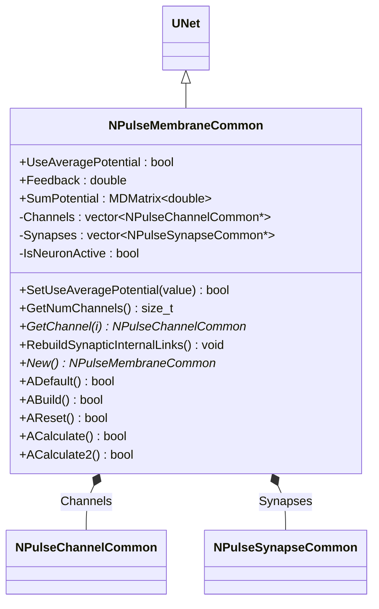
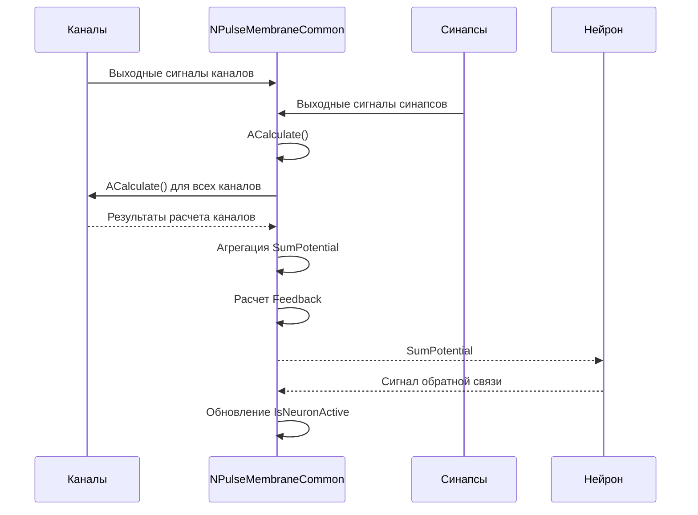
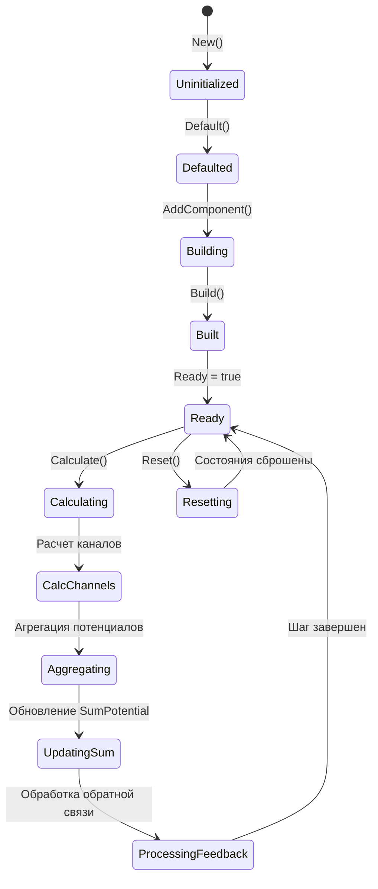
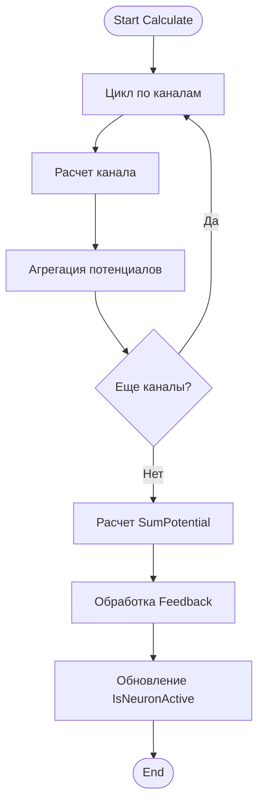
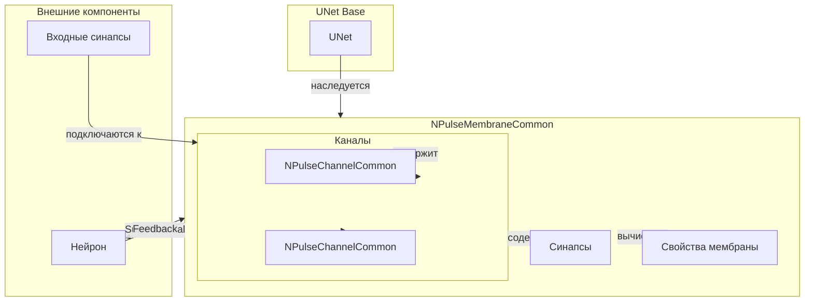
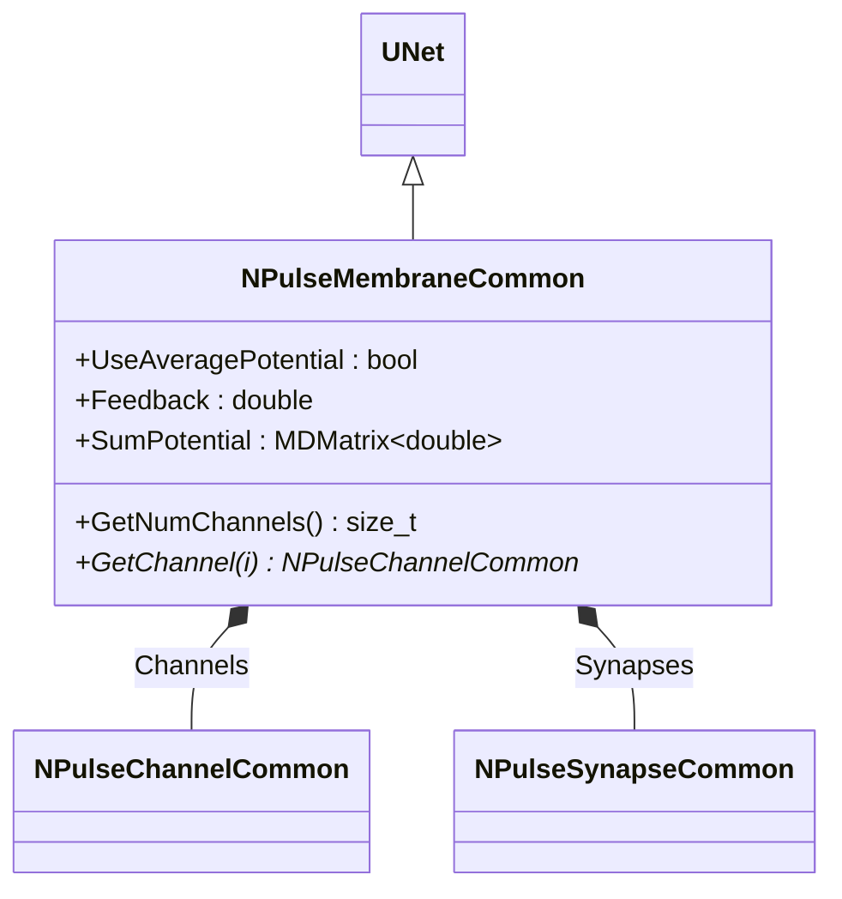
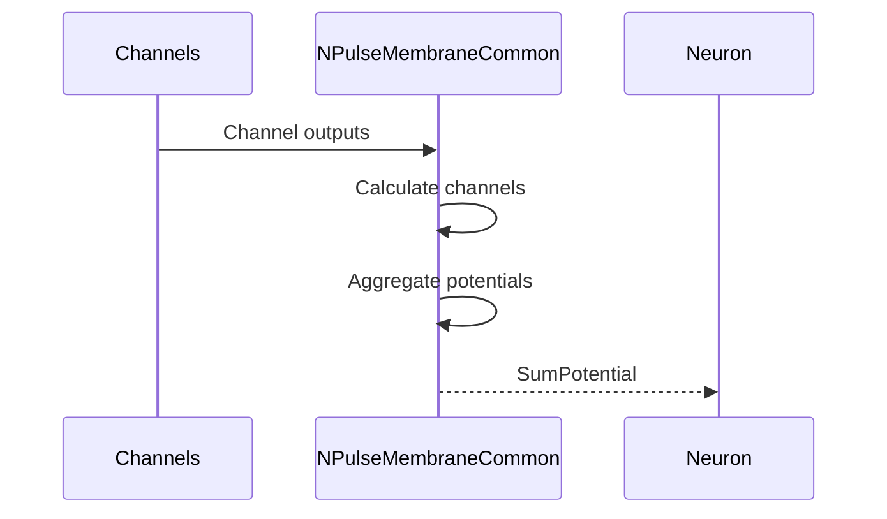
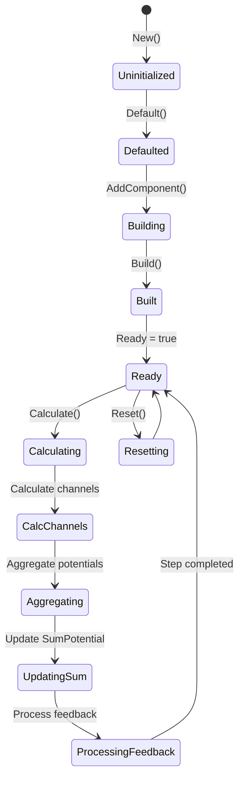
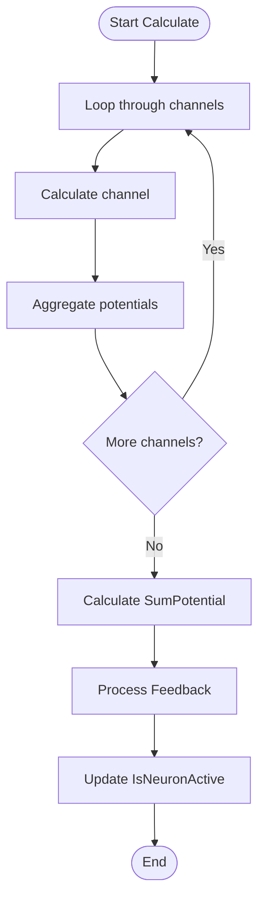
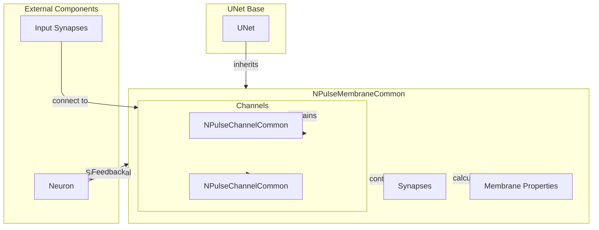

# NPulseMembraneCommon — общая импульсная мембрана

## RU

### Назначение

**Класс**: `NPulseMembraneCommon` — базовый класс для импульсных мембран с общей функциональностью.  
**Регистрация**: `NPulseLibrary.cpp` → `UploadClass("NPulseMembraneCommon", ...)`.  
**Storage-инстансы**: `ClassName = "NPulseMembraneCommon"` (обычно используется через наследников).

`NPulseMembraneCommon` является базовым классом для всех импульсных мембран в библиотеке PulseLib. Наследуется от `UNet` и предоставляет базовую функциональность для управления каналами и синапсами, агрегации потенциалов и передачи сигналов к нейрону.

### UML-диаграмма классов



**Иерархия наследования:**
- `UNet` (Rdk) — базовый класс для сетей компонентов
- `NPulseMembraneCommon` — общая импульсная мембрана

**Ключевые свойства:**
- Параметры: `UseAveragePotential` — использовать усреднение потенциалов
- Состояния: `Feedback` — обратная связь, `SumPotential` — суммарный потенциал
- Компоненты: `Channels` (вектор каналов), `Synapses` (вектор синапсов)

### UML-диаграмма последовательности



**Жизненный цикл:**
1. **Инициализация**: Установка параметров по умолчанию
2. **Сборка**: Построение структуры мембраны, регистрация каналов и синапсов
3. **Расчет**: Расчет всех каналов, агрегация потенциалов, расчет суммарного потенциала
4. **Обратная связь**: Обработка сигналов обратной связи от нейрона

### UML-диаграмма состояний



**Состояния:**
- **Uninitialized** — создан, но не инициализирован
- **Defaulted** — параметры установлены по умолчанию
- **Building** — добавление каналов и синапсов
- **Built** — структура мембраны построена
- **Ready** — готов к выполнению расчетов
- **Calculating** — выполняется расчет мембраны
- **CalcChannels** — расчет всех каналов
- **Aggregating** — агрегация потенциалов от каналов
- **UpdatingSum** — обновление суммарного потенциала
- **ProcessingFeedback** — обработка обратной связи
- **Resetting** — выполняется сброс состояний

### UML-диаграмма активности



**Алгоритм расчета:**
1. Расчет всех каналов (`ACalculate()` для каждого канала)
2. Агрегация потенциалов от каналов
3. Расчет суммарного потенциала (`SumPotential`)
4. Обработка обратной связи (`Feedback`)
5. Обновление флага активности нейрона (`IsNeuronActive`)

### UML-диаграмма компонентов



**Зависимости:**
- **Базовый класс**: `UNet`
- **Внутренние компоненты**: `NPulseChannelCommon` (каналы), `NPulseSynapseCommon` (синапсы)
- **Внешние компоненты**: нейрон (получатель `SumPotential`, источник обратной связи), входные синапсы (подключаются к каналам)

**Примечание о именовании каналов:**
- Фактические имена компонентов каналов: `InhChannel` (Type=1, тормозной) и `ExcChannel` (Type=-1, возбуждающий)
- Методы `GetPosChannel()` и `GetNegChannel()` в производных классах (например, `NPulseMembrane`) возвращают каналы с фактическими именами:
  - `GetPosChannel()` → возвращает каналы с именем `"ExcChannel"` (Type=-1, возбуждающие, семантически "положительные" по эффекту на потенциал)
  - `GetNegChannel()` → возвращает каналы с именем `"InhChannel"` (Type=1, тормозные, семантически "отрицательные" по эффекту на потенциал)

### Свойства

#### Параметры (ptPubParameter)

- **`UseAveragePotential`** (bool) — использовать усреднение потенциалов. Если `true`, мембрана использует усреднение потенциалов от каналов. Значение по умолчанию: `false`

#### Состояния (ptPubState)

- **`Feedback`** (double) — обратная связь от нейрона. Используется для передачи сигналов обратной связи от нейрона к мембране.

- **`SumPotential`** (MDMatrix<double>) — суммарный потенциал мембраны. Агрегированный потенциал всех каналов мембраны.

#### Внутренние компоненты

- **`Channels`** (vector<NPulseChannelCommon*>) — вектор указателей на каналы мембраны. Заполняется автоматически при добавлении каналов.

- **`Synapses`** (vector<NPulseSynapseCommon*>) — вектор указателей на синапсы мембраны. Заполняется автоматически при добавлении синапсов.

- **`IsNeuronActive`** (bool) — флаг активности нейрона. Используется для отслеживания состояния нейрона.

### Методы

#### Публичные методы

- **`New()`** → `NPulseMembraneCommon*` — создает новый экземпляр класса.

- **`SetUseAveragePotential(const bool &value)`** → `bool` — устанавливает флаг усреднения потенциалов.

- **`GetNumChannels()`** → `size_t` — возвращает количество каналов в мембране.

- **`GetChannel(size_t i)`** → `NPulseChannelCommon*` — возвращает канал по индексу.

- **`RebuildSynapticInternalLinks()`** → `void` — перестраивает внутренние связи синапсов. Вызывается при изменении структуры мембраны.

#### Защищенные методы жизненного цикла

- **`ADefault()`** → `bool` — инициализирует параметры по умолчанию. Устанавливает `UseAveragePotential=false`, инициализирует выходные матрицы.

- **`ABuild()`** → `bool` — строит структуру мембраны. Базовая реализация не выполняет дополнительных действий.

- **`AReset()`** → `bool` — сбрасывает состояния мембраны. Обнуляет `Feedback`, `SumPotential`, сбрасывает флаг активности.

- **`ACalculate()`** → `bool` — выполняет расчет мембраны на одном шаге. Рассчитывает все каналы, агрегирует потенциалы, обновляет суммарный потенциал.

- **`ACalculate2()`** → `bool` — виртуальный метод для дополнительных расчетов. Должен быть переопределен в производных классах.

- **`AAddComponent(UEPtr<UContainer> comp)`** → `bool` — обрабатывает добавление компонента. Регистрирует каналы и синапсы в соответствующих векторах.

- **`ADelComponent(UEPtr<UContainer> comp)`** → `bool` — обрабатывает удаление компонента. Удаляет канал или синапс из соответствующих векторов.

- **`CheckComponentType(UEPtr<UContainer> comp)`** → `bool` — проверяет допустимость типа компонента. Разрешает добавление `NPulseChannelCommon` и `NPulseSynapseCommon`.

### Примеры использования

#### Пример 1: Создание мембраны в коде C++

```cpp
// Создание мембраны
auto membrane = storage->CreateComponent<NPulseMembraneCommon>();
membrane->SetName("Membrane1");

// Инициализация
membrane->Default();

// Настройка параметров
membrane->UseAveragePotential = false;

// Добавление каналов
// Примечание: Фактические имена компонентов - "InhChannel" (Type=1) и "ExcChannel" (Type=-1)
auto inhChannel = storage->CreateComponent<NPulseChannelIzhikevich>();
inhChannel->SetName("InhChannel");
membrane->AddComponent(inhChannel);

auto excChannel = storage->CreateComponent<NPulseChannelIzhikevich>();
excChannel->SetName("ExcChannel");
membrane->AddComponent(excChannel);

// Сборка
membrane->Build();

// Использование
for (int step = 0; step < 1000; step++) {
    membrane->Calculate();
    double sumPotential = membrane->SumPotential(0, 0);
    std::cout << "Step " << step << ": SumPotential = " << sumPotential << std::endl;
}
```

#### Пример 2: Конфигурация XML

```xml
<Membrane1 Class="NPulseMembraneCommon">
    <Parameters>
        <UseAveragePotential>0</UseAveragePotential>
    </Parameters>
    <Components>
        <InhChannel Class="NPulseChannelIzhikevich">
            <!-- Параметры канала (Type=1, тормозной) -->
        </InhChannel>
        <ExcChannel Class="NPulseChannelIzhikevich">
            <!-- Параметры канала (Type=-1, возбуждающий) -->
        </ExcChannel>
    </Components>
</Membrane1>
```

### Использование в конфигурациях

`NPulseMembraneCommon` обычно не используется напрямую в конфигурациях. Вместо него используются специализированные классы:

- `NPulseMembraneIzhikevich` — для мембран модели Ижикевича
- `NPulseMembraneIaF` — для мембран модели IaF
- `NPMembraneBio` — для биоинспирированных мембран
- `NPulseMembraneCable` — для кабельных мембран

## Источники

См. [Literature-References.md](../Literature-References.md): **[A]**, **4**, **25**, **29**.

### См. также

- [`NPulseMembraneIzhikevich`](NPulseMembraneIzhikevich.md) — мембрана модели Ижикевича
- [`NPulseMembraneIaF`](NPulseMembraneIaF.md) — мембрана модели IaF
- [`NPulseChannelCommon`](NPulseChannelCommon.md) — общий канал
- [`NPulseNeuronCommon`](NPulseNeuronCommon.md) — общий нейрон
- [Architecture.md](../Architecture.md) — архитектура библиотеки

---

## EN

### Purpose

**Class**: `NPulseMembraneCommon` — base class for spiking membranes with common functionality.  
**Registration**: `NPulseLibrary.cpp` → `UploadClass("NPulseMembraneCommon", ...)`.  
**Instances**: `ClassName = "NPulseMembraneCommon"` (typically used via derived classes).

`NPulseMembraneCommon` is the base class for all spiking membranes in the PulseLib library. It inherits from `UNet` and provides basic functionality for managing channels and synapses, aggregating potentials, and transmitting signals to the neuron.

### UML Class Diagram



### UML Sequence Diagram



### UML State Diagram



### UML Activity Diagram



### UML Component Diagram



### Properties

`NPulseMembraneCommon` uses the following properties:

**Parameters:**
- `UseAveragePotential` (bool) — use averaging for potentials
- `Feedback` (double) — feedback coefficient

**Output properties:**
- `SumPotential` (MDMatrix<double>) — sum of all channel potentials
- `IsNeuronActive` (bool) — flag indicating neuron activation

**Internal components:**
- `Channels` (vector<NPulseChannelCommon*>) — vector of channels
- `Synapses` (vector<NPulseSynapseCommon*>) — vector of synapses

### Methods

`NPulseMembraneCommon` uses the following methods:

- `SetUseAveragePotential(value)` → `bool` — set use averaging for potentials
- `GetNumChannels()` → `size_t` — get number of channels
- `GetChannel(i)` → `NPulseChannelCommon*` — get channel by index
- `RebuildSynapticInternalLinks()` → `void` — rebuild internal synaptic links
- `ADefault()` → `bool` — initialize default parameters
- `ABuild()` → `bool` — build membrane structure
- `AReset()` → `bool` — reset membrane state
- `ACalculate()` → `bool` — perform one calculation step

### Usage in configurations

`NPulseMembraneCommon` is used as a base class for all spiking membranes:

- **Base class**: Used as base for all spiking membrane types
- **Channel management**: Manages multiple channels (excitatory and inhibitory)
- **Synapse management**: Manages synapses connected to channels
- **Potential aggregation**: Aggregates potentials from all channels

**Features:**
- Multiple channels: supports multiple excitatory and inhibitory channels
- Synapse management: manages synapses connected to channels
- Potential aggregation: aggregates potentials from all channels
- Feedback support: supports feedback from neuron

**Note on channel naming:**
- Actual component names of channels: `InhChannel` (Type=1, inhibitory) and `ExcChannel` (Type=-1, excitatory)
- Methods `GetPosChannel()` and `GetNegChannel()` in derived classes (e.g., `NPulseMembrane`) return channels with actual names:
  - `GetPosChannel()` → returns channels with name `"ExcChannel"` (Type=-1, excitatory, semantically "positive" effect on potential)
  - `GetNegChannel()` → returns channels with name `"InhChannel"` (Type=1, inhibitory, semantically "negative" effect on potential)

**Typical parameter values:**
- **UseAveragePotential**: false (do not use averaging)
- **Feedback**: 0.0 (no feedback by default)

### References

See [Literature-References.md](../Literature-References.md): **[A]**, **4**, **25**, **29**.

### See Also

- [`NPulseMembraneIzhikevich`](NPulseMembraneIzhikevich.md) — Izhikevich membrane
- [`NPulseMembraneIaF`](NPulseMembraneIaF.md) — IaF membrane
- [`NPulseChannelCommon`](NPulseChannelCommon.md) — common channel
- [`NPulseNeuronCommon`](NPulseNeuronCommon.md) — common neuron
- [Architecture.md](../Architecture.md) — library architecture
