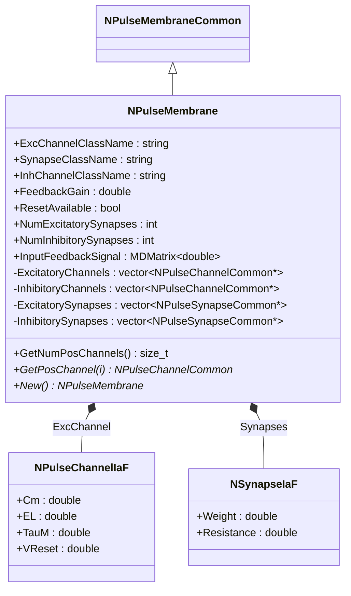
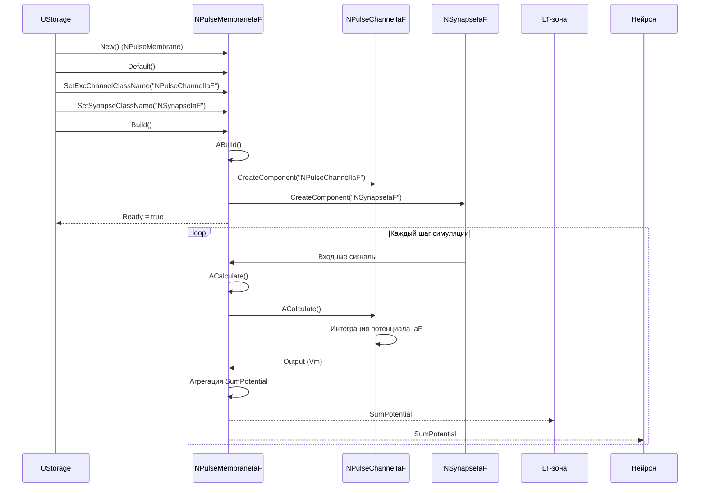
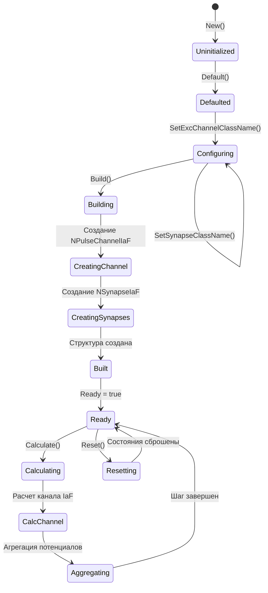
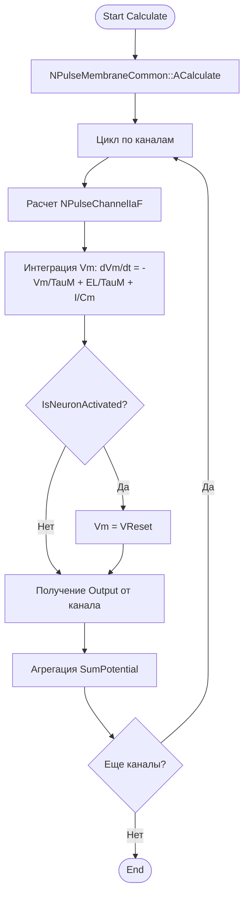
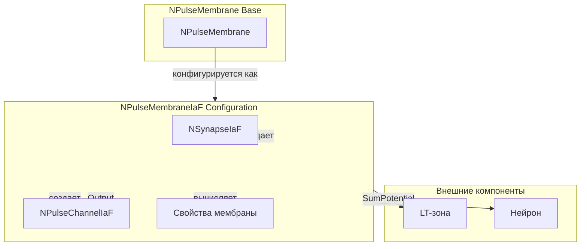
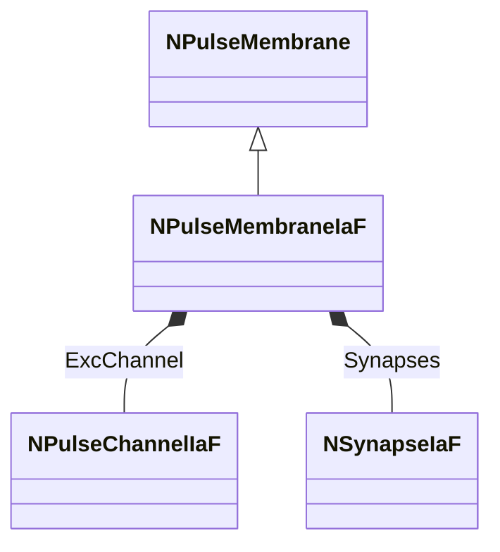
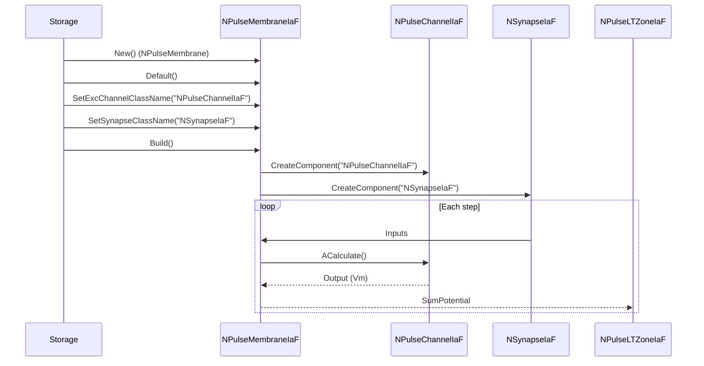
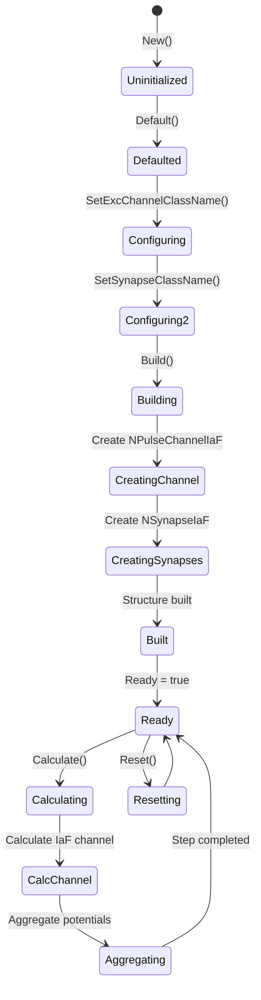
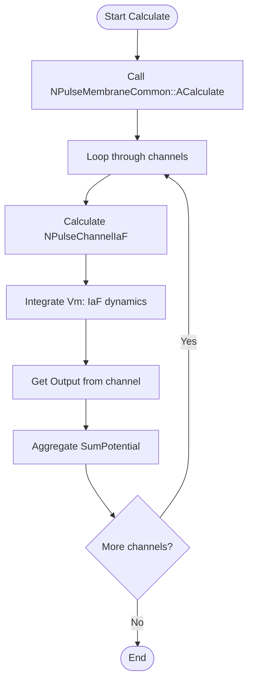
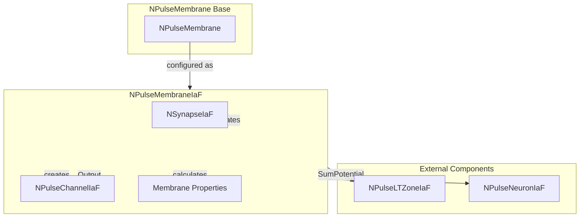

# NPulseMembraneIaF — мембрана модели IaF

## RU

### Назначение

**Класс**: `NPulseMembraneIaF` — конфигурационный вариант мембраны для нейронов модели Integrate-and-Fire.  
**Аббревиатура**: `IaF` — **I**ntegrate and **F**ire (интегрировать и стрелять).  
**Регистрация**: `NPulseLibrary.cpp` → `UploadClass("NPulseMembraneIaF", ...)`.  
**Storage-инстансы**: `ClassName = "NPulseMembraneIaF"` в `Bin/Configs/*/Model_*.xml`.

`NPulseMembraneIaF` является конфигурационным вариантом базового класса `NPulseMembrane` с предустановленными параметрами для модели IaF. Создается из `NPulseMembrane` с настройками:
- `ExcChannelClassName = "NPulseChannelIaF"` — возбуждающий канал модели IaF
- `SynapseClassName = "NSynapseIaF"` — синапс модели IaF
- `InhChannelClassName = ""` — тормозной канал не используется

**Использование:** Эксперименты с нейронами модели IaF, обучение нейросетей

### UML-диаграмма классов



**Иерархия наследования:**
- `NPulseMembraneCommon` — общая импульсная мембрана
- `NPulseMembrane` — базовая импульсная мембрана
- `NPulseMembraneIaF` — конфигурационный вариант для модели IaF

**Внутренняя структура:**
- **ExcChannel** (`NPulseChannelIaF`) — возбуждающий канал модели IaF, создается автоматически при сборке
- **Synapses** (`NSynapseIaF`) — синапсы модели IaF, создаются автоматически при сборке

### UML-диаграмма последовательности



**Жизненный цикл:**
1. **Создание**: `NPulseMembraneIaF` создается из `NPulseMembrane` с настройкой параметров
2. **Настройка**: Устанавливаются имена классов канала и синапса для модели IaF
3. **Сборка**: Автоматически создаются канал `NPulseChannelIaF` и синапсы `NSynapseIaF`
4. **Расчет**: На каждом шаге рассчитывается канал, агрегируются потенциалы

### UML-диаграмма состояний



### UML-диаграмма активности



### UML-диаграмма компонентов



### Свойства

`NPulseMembraneIaF` использует все свойства базового класса `NPulseMembrane` с предустановленными значениями:

**Наследуемые свойства от NPulseMembrane:**
- `ExcChannelClassName` (string) — имя класса возбуждающего канала. Установлено в `"NPulseChannelIaF"`
- `SynapseClassName` (string) — имя класса синапса. Установлено в `"NSynapseIaF"`
- `InhChannelClassName` (string) — имя класса тормозного канала. Установлено в `""` (не используется)
- `FeedbackGain` (double) — коэффициент обратной связи
- `ResetAvailable` (bool) — наличие механизма сброса
- `NumExcitatorySynapses` (int) — количество возбуждающих синапсов
- `NumInhibitorySynapses` (int) — количество тормозных синапсов
- `InputFeedbackSignal` (MDMatrix<double>) — входной сигнал обратной связи

**Наследуемые свойства от NPulseMembraneCommon:**
- `UseAveragePotential` (bool) — использовать усреднение потенциалов
- `Feedback` (double) — обратная связь от нейрона
- `SumPotential` (MDMatrix<double>) — суммарный потенциал мембраны

### Методы

`NPulseMembraneIaF` использует все методы базового класса `NPulseMembrane`:

**Наследуемые методы от NPulseMembrane:**
- `New()` → `NPulseMembrane*` — создает новый экземпляр класса
- `GetNumPosChannels()` → `size_t` — возвращает количество возбуждающих каналов
- `GetPosChannel(size_t i)` → `NPulseChannelCommon*` — возвращает возбуждающий канал по индексу
- `GetNumNegChannels()` → `size_t` — возвращает количество тормозных каналов
- `GetNegChannel(size_t i)` → `NPulseChannelCommon*` — возвращает тормозной канал по индексу
- `GetNumExcitatorySynapses()` → `size_t` — возвращает количество возбуждающих синапсов
- `GetExcitatorySynapses(size_t i)` → `NPulseSynapseCommon*` — возвращает возбуждающий синапс по индексу
- `GetNumInhibitorySynapses()` → `size_t` — возвращает количество тормозных синапсов
- `GetInhibitorySynapses(size_t i)` → `NPulseSynapseCommon*` — возвращает тормозной синапс по индексу

### Примеры использования

#### Пример 1: Создание мембраны в коде C++

```cpp
// Создание мембраны IaF
auto membrane = storage->CreateComponent<NPulseMembrane>();
membrane->SetName("IaFMembrane");

// Инициализация
membrane->Default();

// Настройка параметров для модели IaF
membrane->ExcChannelClassName = "NPulseChannelIaF";
membrane->SynapseClassName = "NSynapseIaF";
membrane->InhChannelClassName = "";
membrane->FeedbackGain = 0.0;
membrane->ResetAvailable = true;

// Сборка (автоматически создает канал и синапсы)
membrane->Build();

// Использование
for (int step = 0; step < 1000; step++) {
    membrane->Calculate();
    double sumPotential = membrane->SumPotential(0, 0);
    std::cout << "Step " << step << ": SumPotential = " << sumPotential << std::endl;
}
```

#### Пример 2: Конфигурация XML

```xml
<PulseMembrane Class="NPulseMembraneIaF">
    <Parameters>
        <ExcChannelClassName>NPulseChannelIaF</ExcChannelClassName>
        <SynapseClassName>NSynapseIaF</SynapseClassName>
        <InhChannelClassName></InhChannelClassName>
        <FeedbackGain>0.0</FeedbackGain>
        <ResetAvailable>1</ResetAvailable>
        <NumExcitatorySynapses>5</NumExcitatorySynapses>
        <NumInhibitorySynapses>0</NumInhibitorySynapses>
    </Parameters>
    <Components>
        <!-- Канал и синапсы создаются автоматически при Build() -->
    </Components>
</PulseMembrane>
```

### Использование в конфигурациях

`NPulseMembraneIaF` используется в нейронах модели IaF:

- Эксперименты с нейронами модели IaF
- Обучение нейросетей с простой моделью нейрона
- Сравнение различных моделей нейронов

**Особенности:**
- Автоматически создает канал `NPulseChannelIaF` при сборке
- Автоматически создает синапсы `NSynapseIaF` при сборке
- Интегрируется с LT-зоной `NPulseLTZoneIaF` для генерации спайков

### См. также

- [`NPulseMembrane`](NPulseMembrane.md) — базовая импульсная мембрана
- [`NPulseMembraneCommon`](NPulseMembraneCommon.md) — общая импульсная мембрана
- [`NPulseChannelIaF`](NPulseChannelIaF.md) — канал модели IaF
- [`NSynapseIaF`](NSynapseIaF.md) — синапс модели IaF
- [`NPulseNeuronIaF`](NPulseNeuronIaF.md) — нейрон модели IaF
- [`NPulseLTZoneIaF`](NPulseLTZoneIaF.md) — LT-зона модели IaF
- [Architecture.md](../Architecture.md) — архитектура библиотеки
- [Scientific-Background.md](../Scientific-Background.md) — научный фон (модель IaF)

---

## EN

### Purpose

**Class**: `NPulseMembraneIaF` — configuration variant of membrane for Integrate-and-Fire model neurons.  
**Registration**: `NPulseLibrary.cpp` → `UploadClass("NPulseMembraneIaF", ...)`.  
**Instances**: `ClassName = "NPulseMembraneIaF"` in `Bin/Configs/*/Model_*.xml`.

`NPulseMembraneIaF` is a configuration variant of the base class `NPulseMembrane` with preset parameters for the IaF model. Created from `NPulseMembrane` with settings:
- `ExcChannelClassName = "NPulseChannelIaF"` — excitatory channel for IaF model
- `SynapseClassName = "NSynapseIaF"` — synapse for IaF model
- `InhChannelClassName = ""` — inhibitory channel not used

**Usage:** Experiments with IaF model neurons, neural network training

### UML Class Diagram



### UML Sequence Diagram



### UML State Diagram



### UML Activity Diagram



### UML Component Diagram



### Properties

`NPulseMembraneIaF` uses all properties of base class `NPulseMembrane` with preset values:

**Configuration parameters:**
- `ExcChannelClassName = "NPulseChannelIaF"` — excitatory channel for IaF model
- `SynapseClassName = "NSynapseIaF"` — synapse for IaF model
- `InhChannelClassName = ""` — inhibitory channel not used

**Inherited properties from NPulseMembrane:**
- `FeedbackGain` — коэффициент обратной связи
- `ResetAvailable` — доступность сброса
- `NumExcitatorySynapses` — количество возбуждающих синапсов
- `NumInhibitorySynapses` — количество тормозных синапсов
- `InputFeedbackSignal` — входной сигнал обратной связи

**IaF parameters (in ExcChannel):**
- `Cm`, `EL`, `TauM`, `VReset`, `TRef` — параметры модели IaF (хранятся в канале)

### Methods

- `ADefault()` — установка параметров по умолчанию
- `ABuild()` — сборка структуры мембраны (автоматическое создание NPulseChannelIaF и NSynapseIaF)
- `AReset()` — сброс состояния мембраны
- `ACalculate2()` — выполнение шага расчета мембраны (вызов расчета канала, агрегация потенциалов)

### Usage in configurations

`NPulseMembraneIaF` is used inside IaF model neurons:

- Experiments with IaF neurons
- Simple neural network training with IaF neurons

**Typical settings:**
- **ExcChannelClassName**: `NPulseChannelIaF`
- **SynapseClassName**: `NSynapseIaF`
- **InhChannelClassName**: empty (no inhibitory channel)

### See Also

- [`NPulseMembrane`](NPulseMembrane.md) — base spiking membrane
- [`NPulseChannelIaF`](NPulseChannelIaF.md) — IaF channel
- [`NSynapseIaF`](NSynapseIaF.md) — IaF synapse
- [`NPulseNeuronIaF`](NPulseNeuronIaF.md) — IaF model neuron
- [`NPulseLTZoneIaF`](NPulseLTZoneIaF.md) — IaF LT-zone
- [Architecture.md](../Architecture.md) — library architecture
- [Scientific-Background.md](../Scientific-Background.md) — scientific background (IaF model)

