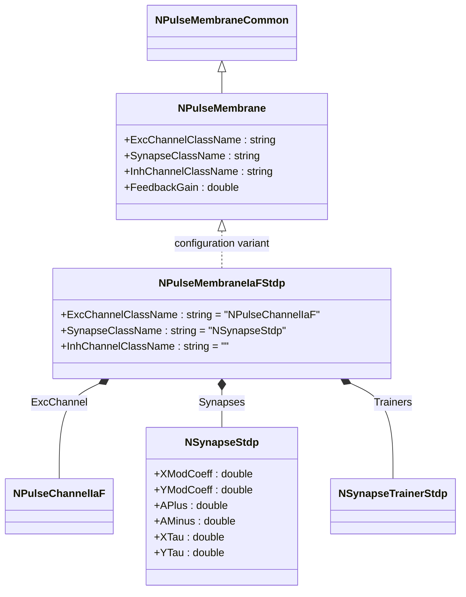
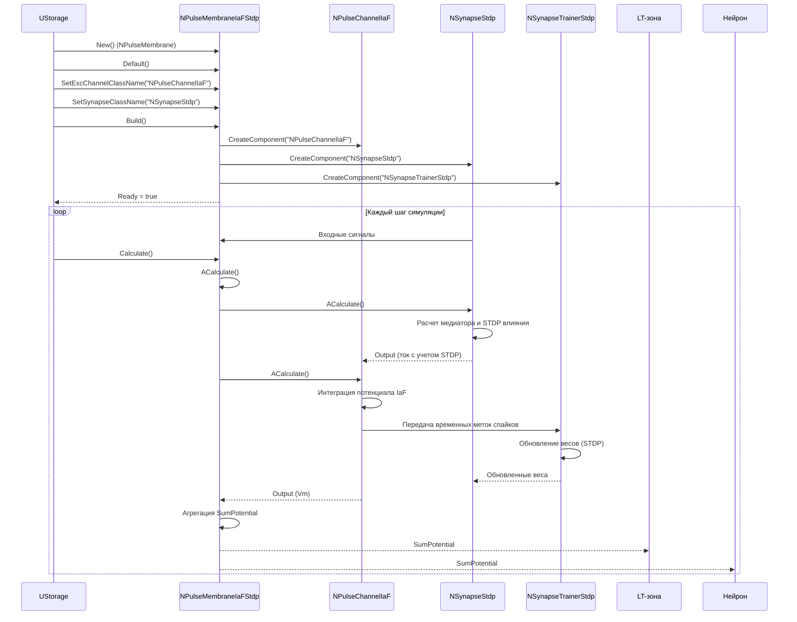
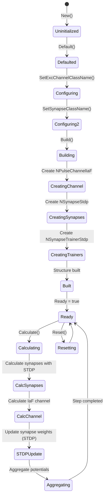
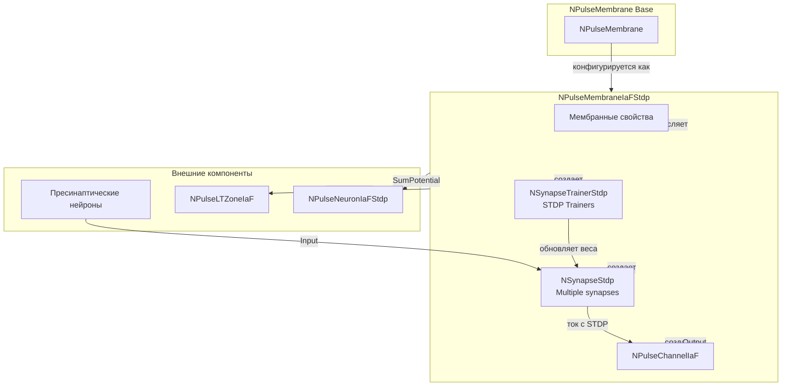
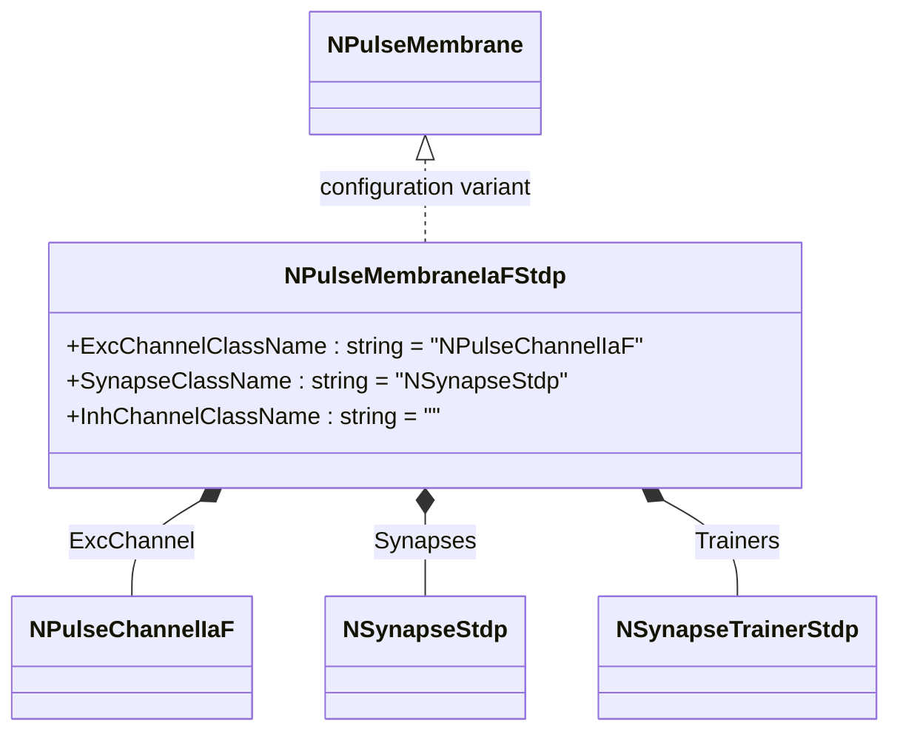
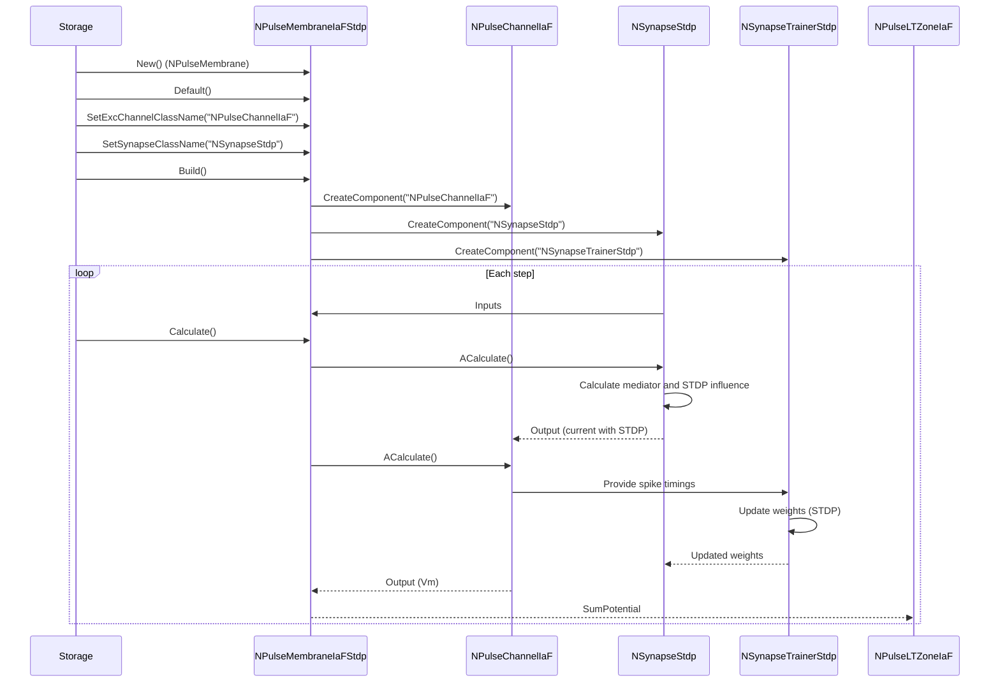
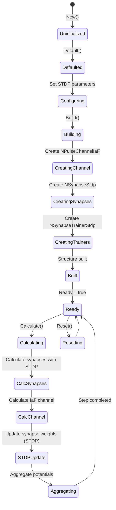
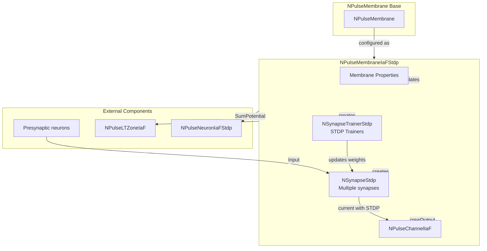

# NPulseMembraneIaFStdp — мембрана модели IaF с STDP

## RU

### Назначение

**Класс**: `NPulseMembraneIaFStdp` — конфигурационный вариант мембраны для нейронов модели Integrate-and-Fire с поддержкой STDP-обучения.  
**Аббревиатуры**: `IaF` — **I**ntegrate and **F**ire (интегрировать и стрелять); `STDP` — **S**pike-**T**iming **D**ependent **P**lasticity (пластичность, зависящая от времени спайков).  
**Регистрация**: `NPulseLibrary.cpp` → `UploadClass("NPulseMembraneIaFStdp", ...)`.  
**Storage-инстансы**: `ClassName = "NPulseMembraneIaFStdp"` в `Bin/Configs/*/Model_*.xml`.

`NPulseMembraneIaFStdp` является конфигурационным вариантом базового класса `NPulseMembrane` с предустановленными параметрами для модели IaF и поддержкой STDP-обучения. Создается из `NPulseMembrane` с настройками:
- `ExcChannelClassName = "NPulseChannelIaF"` — возбуждающий канал модели IaF
- `SynapseClassName = "NSynapseStdp"` или `"NPulseSynapseStdp"` — синапс с STDP
- `InhChannelClassName = ""` — тормозной канал не используется

**Использование:** Эксперименты по STDP-обучению с нейронами модели IaF, обучение нейросетей с пластичностью синапсов

### UML-диаграмма классов



**Иерархия наследования:**
- `NPulseMembraneCommon` — общая импульсная мембрана
- `NPulseMembrane` — базовая импульсная мембрана
- `NPulseMembraneIaFStdp` — конфигурационный вариант для модели IaF с STDP

**Внутренняя структура:**
- **ExcChannel** (`NPulseChannelIaF`) — возбуждающий канал модели IaF
- **Synapses** (`NSynapseStdp` или `NPulseSynapseStdp`) — синапсы с поддержкой STDP
- **Trainers** (`NSynapseTrainerStdp`) — тренеры для обновления весов синапсов по правилу STDP

### UML-диаграмма последовательности



**Жизненный цикл:**
1. **Создание**: `NPulseMembraneIaFStdp` создается из `NPulseMembrane` с настройкой параметров
2. **Настройка**: Устанавливаются имена классов канала и синапса с STDP
3. **Сборка**: Автоматически создаются канал `NPulseChannelIaF` и синапсы с STDP
4. **Расчет**: На каждом шаге рассчитывается канал, обновляются веса синапсов по правилу STDP, агрегируются потенциалы

### UML-диаграмма состояний



**Состояния:**
- **Uninitialized** — создан, но не инициализирован
- **Defaulted** — параметры установлены по умолчанию
- **Configuring** — настройка параметров для STDP
- **Building** — выполняется сборка
- **CreatingChannel** — создание канала IaF
- **CreatingSynapses** — создание синапсов с STDP
- **CreatingTrainers** — создание тренеров STDP
- **Built** — структура мембраны построена
- **Ready** — готов к выполнению расчетов
- **Calculating** — выполняется расчет мембраны
- **CalcSynapses** — расчет синапсов с учетом STDP
- **CalcChannel** — расчет канала IaF
- **STDPUpdate** — обновление весов синапсов по правилу STDP
- **Aggregating** — агрегация потенциалов
- **Resetting** — выполняется сброс состояний

### UML-диаграмма активности

```mermaid
flowchart TD
    Start([Start Calculate]) --> CallBase[Call NPulseMembraneCommon::ACalculate]
    CallBase --> LoopSynapses[Цикл по синапсам с STDP]
    LoopSynapses --> CalcSynapse[Расчет синапса]
    CalcSynapse --> CalcSTDP[Расчет STDP влияния]
    CalcSTDP --> GetOutput[Получение Output от синапса]
    GetOutput --> CheckMoreSynapses{Еще синапсы?}
    CheckMoreSynapses -->|Да| LoopSynapses
    CheckMoreSynapses -->|Нет| CalcChannel[Расчет NPulseChannelIaF]
    CalcChannel --> IntegrateVm[Интеграция Vm: IaF dynamics]
    IntegrateVm --> UpdateSTDP[Обновление весов синапсов (STDP)]
    UpdateSTDP --> AggregatePotential[Агрегация SumPotential]
    AggregatePotential --> End([End])
```

**Алгоритм расчета (мембрана IaF с STDP):**
1. Расчет всех синапсов с учетом STDP влияния
2. Расчет канала IaF: интеграция мембранного потенциала
3. Обновление весов синапсов по правилу STDP на основе временных меток спайков
4. Агрегация потенциалов от канала
5. Обновление выходного сигнала мембраны

### UML-диаграмма компонентов



**Зависимости:**
- **Базовый класс**: `NPulseMembrane` (конфигурационный вариант)
- **Внутренние компоненты**: `NPulseChannelIaF` (канал IaF), `NSynapseStdp` или `NPulseSynapseStdp` (синапсы с STDP), `NSynapseTrainerStdp` (тренеры STDP)
- **Внешние компоненты**: пресинаптические нейроны (источники входных сигналов), LT-зона (получатель выходного сигнала), нейрон (получатель выходного сигнала)

### Свойства

`NPulseMembraneIaFStdp` использует все свойства базового класса `NPulseMembrane` с параметрами:
- `ExcChannelClassName = "NPulseChannelIaF"`
- `SynapseClassName = "NSynapseStdp"` или `"NPulseSynapseStdp"`
- `InhChannelClassName = ""`
- `FeedbackGain = 0.0` (по умолчанию)

**Наследуемые свойства от NPulseMembrane:**
- `ExcChannelClassName` (string) — имя класса возбуждающего канала
- `SynapseClassName` (string) — имя класса синапса
- `InhChannelClassName` (string) — имя класса тормозного канала
- `FeedbackGain` (double) — коэффициент обратной связи
- `SumPotential` (MDMatrix<double>) — суммарный потенциал мембраны
- `NumExcitatorySynapses` (int) — количество возбуждающих синапсов
- `NumInhibitorySynapses` (int) — количество тормозных синапсов

### Методы

`NPulseMembraneIaFStdp` использует все методы базового класса `NPulseMembrane`.

#### Публичные методы

- **`New()`** → `NPulseMembraneIaFStdp*` — создает новый экземпляр класса. В реальности `NPulseMembraneIaFStdp` создается из `NPulseMembrane` через настройку параметров.

#### Защищенные методы жизненного цикла

- **`ADefault()`** → `bool` — инициализирует параметры по умолчанию. Вызывает `NPulseMembrane::ADefault()`.
- **`ABuild()`** → `bool` — строит структуру мембраны. Вызывает `NPulseMembrane::ABuild()`, который создает канал `NPulseChannelIaF` и синапсы с STDP.
- **`AReset()`** → `bool` — сбрасывает состояния мембраны. Вызывает `NPulseMembrane::AReset()`.
- **`ACalculate()`** → `bool` — выполняет расчет мембраны на одном шаге. Вызывает `NPulseMembrane::ACalculate()`, который рассчитывает синапсы с STDP и канал IaF.

### Примеры использования

#### Пример 1: Создание мембраны в коде C++

```cpp
// Создание мембраны IaF с STDP
auto membrane = storage->CreateComponent<NPulseMembrane>();
membrane->SetName("IaFStdpMembrane");

// Инициализация
membrane->Default();

// Настройка параметров для модели IaF с STDP
membrane->ExcChannelClassName = "NPulseChannelIaF";
membrane->SynapseClassName = "NSynapseStdp";
membrane->InhChannelClassName = "";
membrane->FeedbackGain = 0.0;
membrane->ResetAvailable = true;

// Сборка (автоматически создает канал и синапсы с STDP)
membrane->Build();

// Использование
for (int step = 0; step < 1000; step++) {
    membrane->Calculate();
    double sumPotential = membrane->SumPotential(0, 0);
    std::cout << "Step " << step << ": SumPotential = " << sumPotential << std::endl;
}
```

#### Пример 2: Конфигурация XML

```xml
<PulseMembrane Class="NPulseMembraneIaFStdp">
    <Parameters>
        <ExcChannelClassName>NPulseChannelIaF</ExcChannelClassName>
        <SynapseClassName>NSynapseStdp</SynapseClassName>
        <InhChannelClassName></InhChannelClassName>
        <FeedbackGain>0.0</FeedbackGain>
        <ResetAvailable>1</ResetAvailable>
        <NumExcitatorySynapses>5</NumExcitatorySynapses>
        <NumInhibitorySynapses>0</NumInhibitorySynapses>
    </Parameters>
    <Components>
        <PosChannel Class="NPulseChannelIaF">
            <Parameters>
                <Cm>1.0</Cm>
                <EL>-70.0</EL>
                <TauM>20.0</TauM>
                <VReset>-65.0</VReset>
            </Parameters>
            <Components>
                <Synapse1 Class="NSynapseStdp">
                    <Parameters>
                        <APlus>0.01</APlus>
                        <AMinus>0.012</AMinus>
                        <XTau>0.02</XTau>
                        <YTau>0.01</YTau>
                        <XModCoeff>1.0</XModCoeff>
                        <YModCoeff>1.0</YModCoeff>
                    </Parameters>
                    <Components>
                        <Trainer Class="NSynapseTrainerStdp">
                            <Parameters>
                                <APlus>0.01</APlus>
                                <AMinus>0.012</AMinus>
                                <WMax>1.0</WMax>
                                <WMin>0.0</WMin>
                            </Parameters>
                        </Trainer>
                    </Components>
                </Synapse1>
            </Components>
        </PosChannel>
    </Components>
</PulseMembrane>
```

### Использование в конфигурациях

`NPulseMembraneIaFStdp` используется в нейронах модели IaF с STDP-обучением:

- Эксперименты по STDP-обучению с нейронами модели IaF
- Обучение нейросетей с пластичностью синапсов
- Исследования механизмов синаптической пластичности

**Особенности:**
- Автоматически создает канал `NPulseChannelIaF` при сборке
- Автоматически создает синапсы с STDP (`NSynapseStdp` или `NPulseSynapseStdp`) при сборке
- Поддерживает обновление весов синапсов по правилу STDP
- Интегрируется с LT-зоной `NPulseLTZoneIaF` для генерации спайков
- Используется в нейронах `NPulseNeuronIaFStdp`

**Типичные значения параметров STDP:**
- **APlus**: 0.01 (усиление при пресинаптическом спайке перед постсинаптическим)
- **AMinus**: 0.012 (ослабление при постсинаптическом спайке перед пресинаптическим)
- **XTau**: 0.02 (постоянная времени для постсинаптической активности)
- **YTau**: 0.01 (постоянная времени для пресинаптической активности)

### См. также

- [`NPulseMembrane`](NPulseMembrane.md) — базовая импульсная мембрана
- [`NPulseMembraneIaF`](NPulseMembraneIaF.md) — мембрана модели IaF (без STDP)
- [`NPulseMembraneCommon`](NPulseMembraneCommon.md) — общая импульсная мембрана
- [`NPulseChannelIaF`](NPulseChannelIaF.md) — канал модели IaF
- [`NSynapseStdp`](NSynapseStdp.md) — синапс с STDP
- [`NPulseSynapseStdp`](NPulseSynapseStdp.md) — импульсный синапс с STDP
- [`NSynapseTrainerStdp`](NSynapseTrainerStdp.md) — тренер STDP
- [`NPulseNeuronIaFStdp`](NPulseNeuronIaFStdp.md) — нейрон модели IaF с STDP
- [`NPulseLTZoneIaF`](NPulseLTZoneIaF.md) — LT-зона модели IaF
- [Architecture.md](../Architecture.md) — архитектура библиотеки
- [Scientific-Background.md](../Scientific-Background.md) — научный фон (модель IaF, STDP)

---

## EN

### Purpose

**Class**: `NPulseMembraneIaFStdp` — configuration variant of membrane for Integrate-and-Fire model neurons with STDP learning support.  
**Registration**: `NPulseLibrary.cpp` → `UploadClass("NPulseMembraneIaFStdp", ...)`.  
**Instances**: `ClassName = "NPulseMembraneIaFStdp"` in `Bin/Configs/*/Model_*.xml`.

`NPulseMembraneIaFStdp` is a configuration variant of the base class `NPulseMembrane` with preset parameters for the IaF model and STDP learning support. Created from `NPulseMembrane` with settings:
- `ExcChannelClassName = "NPulseChannelIaF"` — excitatory channel for IaF model
- `SynapseClassName = "NSynapseStdp"` or `"NPulseSynapseStdp"` — synapse with STDP
- `InhChannelClassName = ""` — inhibitory channel not used

**Usage:** STDP learning experiments with IaF model neurons, neural network training with synaptic plasticity

### UML Class Diagram



### UML Sequence Diagram



### UML State Diagram



### UML Activity Diagram

```mermaid
flowchart TD
    Start([Start Calculate]) --> CallBase[Call NPulseMembraneCommon::ACalculate]
    CallBase --> LoopSynapses[Loop through STDP synapses]
    LoopSynapses --> CalcSynapse[Calculate synapse]
    CalcSynapse --> CalcSTDP[Calculate STDP influence]
    CalcSTDP --> GetOutput[Get Output from synapse]
    GetOutput --> CheckMoreSynapses{More synapses?}
    CheckMoreSynapses -->|Yes| LoopSynapses
    CheckMoreSynapses -->|No| CalcChannel[Calculate NPulseChannelIaF]
    CalcChannel --> IntegrateVm[Integrate Vm: IaF dynamics]
    IntegrateVm --> UpdateSTDP[Update synapse weights (STDP)]
    UpdateSTDP --> AggregatePotential[Aggregate SumPotential]
    AggregatePotential --> End([End])
```

### UML Component Diagram



### Properties

`NPulseMembraneIaFStdp` uses all properties of base class `NPulseMembrane` with preset values:

**Configuration parameters:**
- `ExcChannelClassName = "NPulseChannelIaF"` — excitatory channel for IaF model
- `SynapseClassName = "NSynapseStdp"` or `"NPulseSynapseStdp"` — synapse with STDP
- `InhChannelClassName = ""` — inhibitory channel not used

**Inherited properties from NPulseMembrane:**
- `FeedbackGain` — коэффициент обратной связи
- `ResetAvailable` — доступность сброса
- `NumExcitatorySynapses` — количество возбуждающих синапсов
- `NumInhibitorySynapses` — количество тормозных синапсов
- `InputFeedbackSignal` — входной сигнал обратной связи

**IaF parameters (in ExcChannel):**
- `Cm`, `EL`, `TauM`, `VReset`, `TRef` — параметры модели IaF (хранятся в канале)

**STDP parameters (in STDPSynapses):**
- `APlus`, `AMinus`, `XTau`, `YTau` — параметры STDP (хранятся в синапсах)

### Methods

- `ADefault()` — установка параметров по умолчанию
- `ABuild()` — сборка структуры мембраны (автоматическое создание NPulseChannelIaF, NSynapseStdp, NSynapseTrainerStdp)
- `AReset()` — сброс состояния мембраны
- `ACalculate2()` — выполнение шага расчета мембраны (вызов расчета синапсов с STDP, расчет канала, обновление весов, агрегация потенциалов)

### Usage in configurations

`NPulseMembraneIaFStdp` is used in IaF model neurons with STDP learning:

- STDP learning experiments with IaF model neurons
- Neural network training with synaptic plasticity
- Synaptic plasticity mechanism studies

**Features:**
- Automatically creates `NPulseChannelIaF` channel on build
- Automatically creates STDP synapses (`NSynapseStdp` or `NPulseSynapseStdp`) on build
- Supports synapse weight updates according to STDP rule
- Integrates with `NPulseLTZoneIaF` for spike generation
- Used in `NPulseNeuronIaFStdp` neurons

**Typical STDP parameter values:**
- **APlus**: 0.01 (potentiation when presynaptic spike precedes postsynaptic)
- **AMinus**: 0.012 (depression when postsynaptic spike precedes presynaptic)
- **XTau**: 0.02 (time constant for postsynaptic activity)
- **YTau**: 0.01 (time constant for presynaptic activity)

### See Also

- [`NPulseMembrane`](NPulseMembrane.md) — base spiking membrane
- [`NPulseMembraneIaF`](NPulseMembraneIaF.md) — IaF model membrane (without STDP)
- [`NPulseMembraneCommon`](NPulseMembraneCommon.md) — common spiking membrane
- [`NPulseChannelIaF`](NPulseChannelIaF.md) — IaF channel
- [`NSynapseStdp`](NSynapseStdp.md) — STDP synapse
- [`NPulseSynapseStdp`](NPulseSynapseStdp.md) — spiking STDP synapse
- [`NSynapseTrainerStdp`](NSynapseTrainerStdp.md) — STDP trainer
- [`NPulseNeuronIaFStdp`](NPulseNeuronIaFStdp.md) — IaF model neuron with STDP
- [`NPulseLTZoneIaF`](NPulseLTZoneIaF.md) — IaF LT-zone
- [Architecture.md](../Architecture.md) — library architecture
- [Scientific-Background.md](../Scientific-Background.md) — scientific background (IaF model, STDP)
