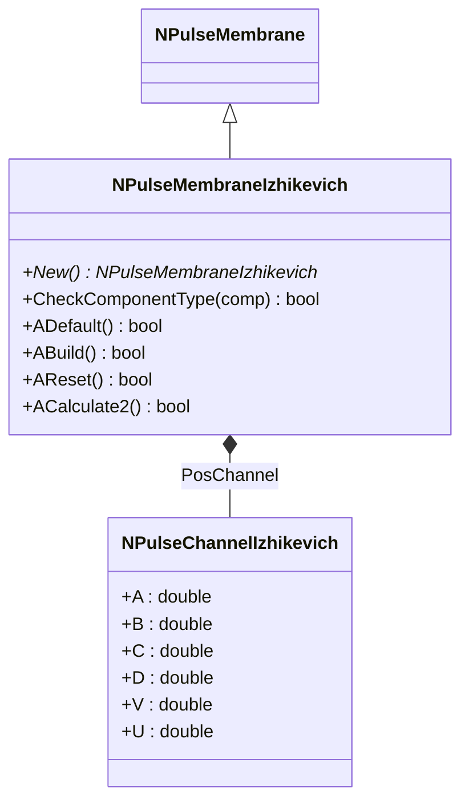
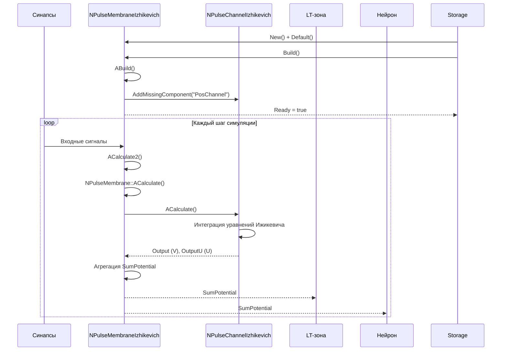
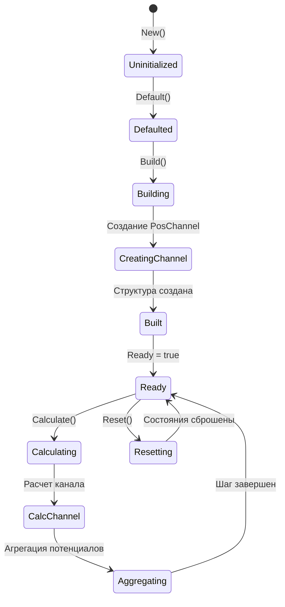
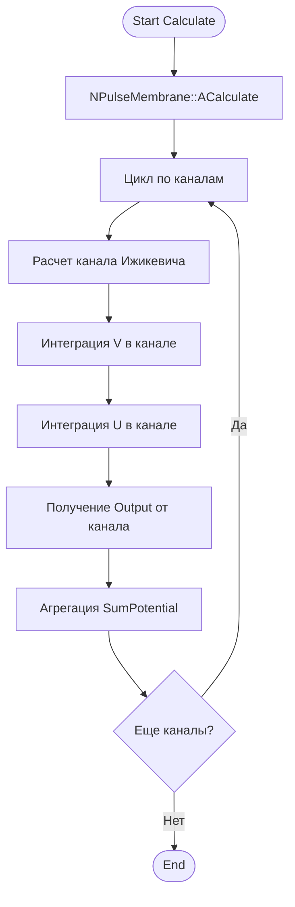
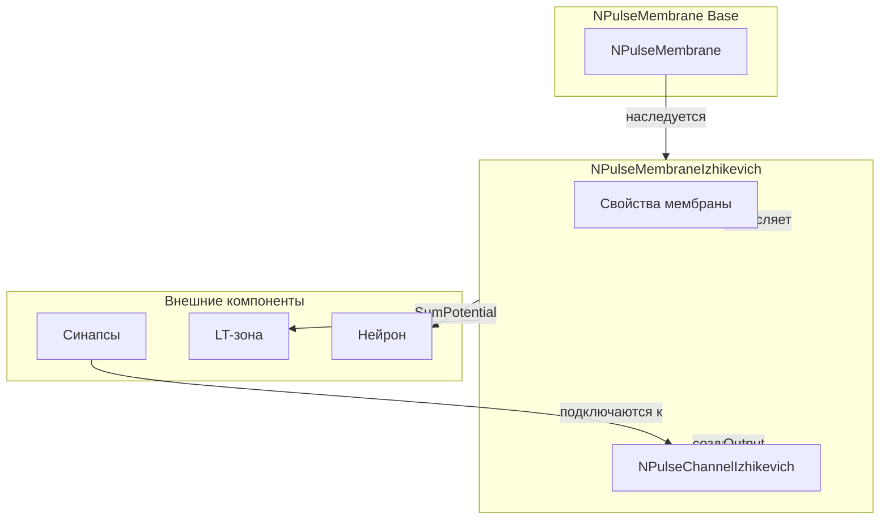
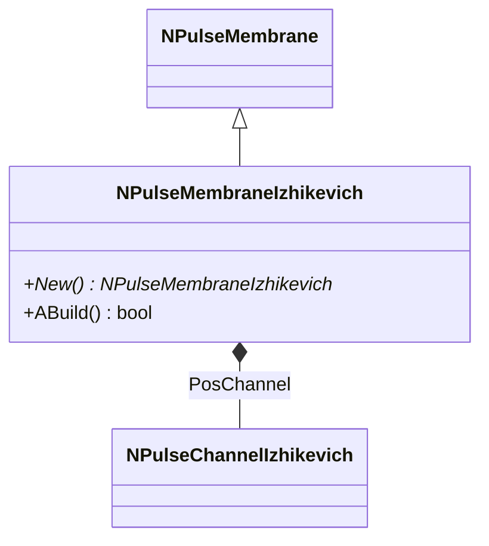
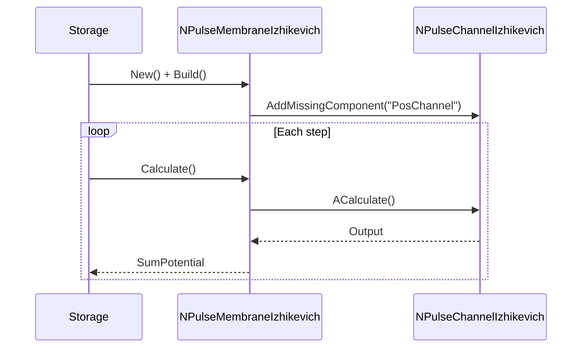
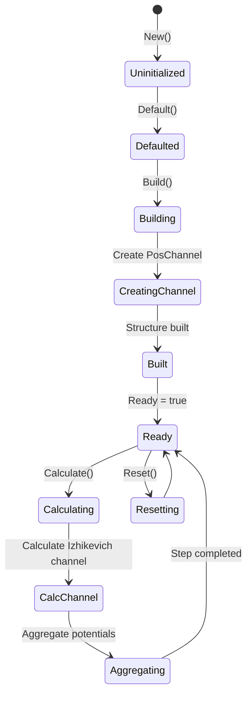
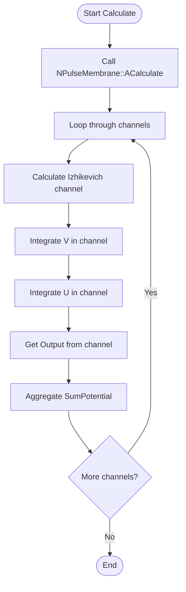
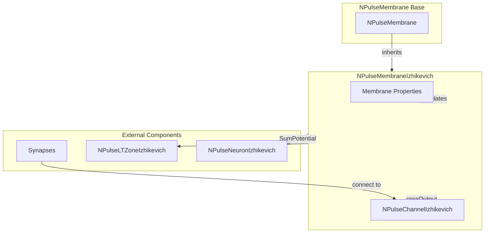

# NPulseMembraneIzhikevich — мембрана модели Ижикевича

## RU

### Назначение

**Класс**: `NPulseMembraneIzhikevich` — мембранная модель для нейронов Ижикевича.  
**Регистрация**: `NPulseLibrary.cpp` → `UploadClass("NPulseMembraneIzhikevich", ...)`.  
**Storage-инстансы**: `ClassName = "NPulseMembraneIzhikevich"` в `Bin/Configs/*/Model_*.xml`.

`NPulseMembraneIzhikevich` реализует мембрану для нейронов модели Ижикевича. Автоматически создает канал `NPulseChannelIzhikevich`, который интегрирует уравнения модели Ижикевича. Параметры модели (A, B, C, D) хранятся в канале.

**Использование:** `Bin/Configs/!OldConfigs/OldExperiments/IzhikevichTest/`, `Bin/Configs/User/CognitiveNavigation/`

### UML-диаграмма классов



**Иерархия наследования:**
- `NPulseMembrane` — базовая импульсная мембрана
- `NPulseMembraneIzhikevich` — мембрана модели Ижикевича

**Внутренняя структура:**
- **PosChannel** (`NPulseChannelIzhikevich`) — канал модели Ижикевича, создается автоматически при сборке

### UML-диаграмма последовательности



**Жизненный цикл:**
1. **Инициализация**: Установка параметров по умолчанию
2. **Сборка**: Автоматическое создание канала `NPulseChannelIzhikevich`
3. **Расчет**: На каждом шаге рассчитывается канал, агрегируются потенциалы
4. **Выход**: Генерация суммарного потенциала для передачи в LT-зону и нейрон

### UML-диаграмма состояний



**Состояния:**
- **Uninitialized** — создан, но не инициализирован
- **Defaulted** — параметры установлены по умолчанию
- **Building** — выполняется сборка структуры
- **CreatingChannel** — создание канала Ижикевича
- **Built** — структура мембраны построена
- **Ready** — готов к выполнению расчетов
- **Calculating** — выполняется расчет мембраны
- **CalcChannel** — расчет канала Ижикевича
- **Aggregating** — агрегация потенциалов от канала
- **Resetting** — выполняется сброс состояний

### UML-диаграмма активности



**Алгоритм расчета:**
1. Вызов базового метода `NPulseMembrane::ACalculate()`
2. Расчет всех каналов (включая автоматически созданный `PosChannel`)
3. Канал интегрирует уравнения модели Ижикевича
4. Агрегация потенциалов от каналов в `SumPotential`
5. Передача `SumPotential` в LT-зону и нейрон

### UML-диаграмма компонентов



**Зависимости:**
- **Базовый класс**: `NPulseMembrane`
- **Внутренние компоненты**: `NPulseChannelIzhikevich` (создается автоматически)
- **Внешние компоненты**: синапсы (подключаются к каналу), LT-зона (получатель `SumPotential`), нейрон (получатель `SumPotential`)

### Свойства

`NPulseMembraneIzhikevich` не имеет собственных публичных свойств (UProperty). Все свойства наследуются от `NPulseMembrane`. Параметры модели Ижикевича хранятся в канале (`NPulseChannelIzhikevich`).

**Наследуемые свойства от NPulseMembrane:**
- `UseAveragePotential` (bool) — использовать усреднение потенциалов
- `Feedback` (double) — обратная связь от нейрона
- `SumPotential` (MDMatrix<double>) — суммарный потенциал мембраны

**Параметры модели Ижикевича (в канале):**
- **A** (double) — параметр восстановления мембраны (по умолчанию: 0.02)
- **B** (double) — чувствительность переменной восстановления (по умолчанию: 0.2)
- **C** (double) — значение потенциала после спайка (по умолчанию: -65.0)
- **D** (double) — приращение переменной восстановления после спайка (по умолчанию: 2.0)

### Методы

#### Публичные методы

- **`New()`** → `NPulseMembraneIzhikevich*` — создает новый экземпляр класса.

- **`CheckComponentType(UEPtr<UContainer> comp)`** → `bool` — проверяет допустимость типа компонента. В текущей реализации всегда возвращает `true` (разрешает добавление любых компонентов).

#### Защищенные методы жизненного цикла

- **`ADefault()`** → `bool` — инициализирует параметры по умолчанию. Вызывает `NPulseMembrane::ADefault()`.

- **`ABuild()`** → `bool` — строит структуру мембраны. Автоматически создает канал `NPulseChannelIzhikevich` с именем "PosChannel", если он отсутствует.

- **`AReset()`** → `bool` — сбрасывает состояния мембраны. Вызывает `NPulseMembrane::AReset()`.

- **`ACalculate2()`** → `bool` — выполняет расчет мембраны на одном шаге. Вызывает `NPulseMembrane::ACalculate()`, который рассчитывает все каналы и агрегирует потенциалы.

### Примеры использования

#### Пример 1: Создание мембраны в коде C++

```cpp
// Создание мембраны
auto membrane = storage->CreateComponent<NPulseMembraneIzhikevich>();
membrane->SetName("IzhikevichMembrane");

// Инициализация
membrane->Default();

// Сборка (автоматически создает PosChannel)
membrane->Build();

// Получение канала для настройки параметров
auto channel = dynamic_cast<NPulseChannelIzhikevich*>(
    membrane->GetPosChannel(0)
);

if (channel) {
    // Настройка параметров модели Ижикевича
    channel->A = 0.02;
    channel->B = 0.2;
    channel->C = -65.0;
    channel->D = 8.0;
}

// Использование
for (int step = 0; step < 1000; step++) {
    membrane->Calculate();
    double sumPotential = membrane->SumPotential(0, 0);
    std::cout << "Step " << step << ": SumPotential = " << sumPotential << std::endl;
}
```

#### Пример 2: Конфигурация XML

```xml
<PulseMembrane Class="NPulseMembraneIzhikevich">
    <Parameters>
        <UseAveragePotential>0</UseAveragePotential>
    </Parameters>
    <Components>
        <!-- PosChannel создается автоматически при Build() -->
        <!-- Но можно также указать его явно для настройки параметров -->
        <PosChannel Class="NPulseChannelIzhikevich">
            <Parameters>
                <A>0.02</A>
                <B>0.2</B>
                <C>-65.0</C>
                <D>8.0</D>
            </Parameters>
            <Components>
                <Synapse1 Class="NSynapseStdp">
                    <!-- Параметры синапса -->
                </Synapse1>
            </Components>
        </PosChannel>
    </Components>
</PulseMembrane>
```

### Использование в конфигурациях

`NPulseMembraneIzhikevich` используется в нейронах модели Ижикевича:

- **Нейроны Ижикевича**: `Bin/Configs/!OldConfigs/OldExperiments/IzhikevichTest/`
- **Когнитивная навигация**: `Bin/Configs/User/CognitiveNavigation/*/Model_*.xml`

**Особенности:**
- Автоматически создает канал `NPulseChannelIzhikevich` при сборке
- Параметры модели Ижикевича настраиваются в канале
- Интегрируется с LT-зоной `NPulseLTZoneIzhikevich` для генерации спайков

## Источники

См. [Literature-References.md](../Literature-References.md): **25**, **29**, **30**.

### См. также

- [`NPulseMembrane`](NPulseMembrane.md) — базовая импульсная мембрана
- [`NPulseMembraneCommon`](NPulseMembraneCommon.md) — общая импульсная мембрана
- [`NPulseChannelIzhikevich`](NPulseChannelIzhikevich.md) — канал модели Ижикевича
- [`NPulseNeuronIzhikevich`](NPulseNeuronIzhikevich.md) — нейрон модели Ижикевича
- [`NPulseLTZoneIzhikevich`](NPulseLTZoneIzhikevich.md) — LT-зона модели Ижикевича
- [Architecture.md](../Architecture.md) — архитектура библиотеки
- [Scientific-Background.md](../Scientific-Background.md) — научный фон (модель Ижикевича)

---

## EN

### Purpose

**Class**: `NPulseMembraneIzhikevich` — Izhikevich model membrane for Izhikevich neurons.  
**Registration**: `NPulseLibrary.cpp` → `UploadClass("NPulseMembraneIzhikevich", ...)`.  
**Instances**: `ClassName = "NPulseMembraneIzhikevich"` in `Bin/Configs/*/Model_*.xml`.

`NPulseMembraneIzhikevich` implements the membrane for Izhikevich model neurons. Automatically creates `NPulseChannelIzhikevich` channel, which integrates Izhikevich model equations. Model parameters (A, B, C, D) are stored in the channel.

**Usage:** `Bin/Configs/!OldConfigs/OldExperiments/IzhikevichTest/`, `Bin/Configs/User/CognitiveNavigation/`

### UML Class Diagram



### UML Sequence Diagram



### UML State Diagram



### UML Activity Diagram



### UML Component Diagram



### Properties

`NPulseMembraneIzhikevich` uses all properties of base class `NPulseMembrane`. The Izhikevich model parameters (A, B, C, D) are stored in the `NPulseChannelIzhikevich` channel created automatically.

**Inherited properties from NPulseMembrane:**
- Standard membrane properties (FeedbackGain, ResetAvailable, etc.)
- Channel and synapse management properties

**Izhikevich parameters (in PosChannel):**
- `A`, `B`, `C`, `D` — Izhikevich model parameters (stored in channel)

### Methods

- `CheckComponentType(comp)` — validating component type
- `ADefault()` — setting default parameters
- `ABuild()` — building membrane structure (auto-create NPulseChannelIzhikevich)
- `AReset()` — resetting membrane state
- `ACalculate2()` — membrane calculation step (channel calculation, potential aggregation)

### Usage in configurations

`NPulseMembraneIzhikevich` is used in Izhikevich model neurons:

- **Izhikevich neurons**: `Bin/Configs/!OldConfigs/OldExperiments/IzhikevichTest/`
- **Cognitive navigation**: `Bin/Configs/User/CognitiveNavigation/*/Model_*.xml`

**Features:**
- Automatically creates `NPulseChannelIzhikevich` channel on build
- Izhikevich model parameters are configured in the channel
- Integrates with `NPulseLTZoneIzhikevich` for spike generation

### References

See [Literature-References.md](../Literature-References.md): **25**, **29**, **30**.

### See Also

- [`NPulseMembrane`](NPulseMembrane.md) — base spiking membrane
- [`NPulseChannelIzhikevich`](NPulseChannelIzhikevich.md) — Izhikevich channel
- [`NPulseNeuronIzhikevich`](NPulseNeuronIzhikevich.md) — Izhikevich model neuron
- [`NPulseLTZoneIzhikevich`](NPulseLTZoneIzhikevich.md) — Izhikevich LT-zone
- [Architecture.md](../Architecture.md) — library architecture
- [Scientific-Background.md](../Scientific-Background.md) — scientific background (Izhikevich model)

