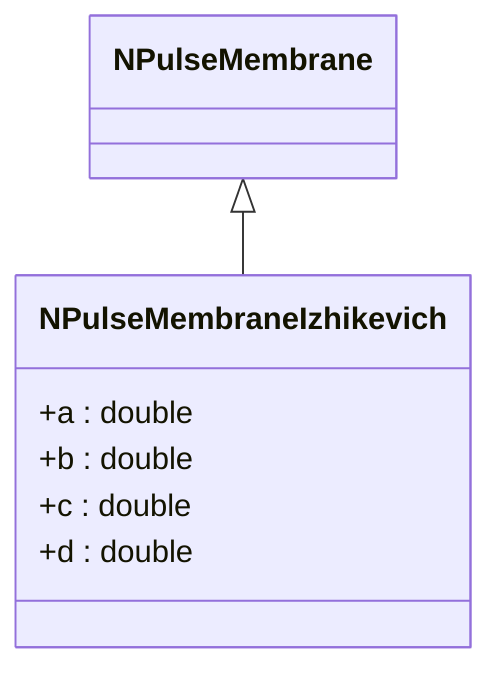
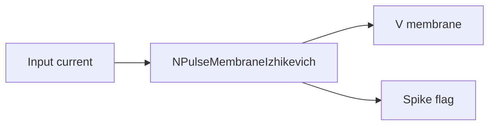
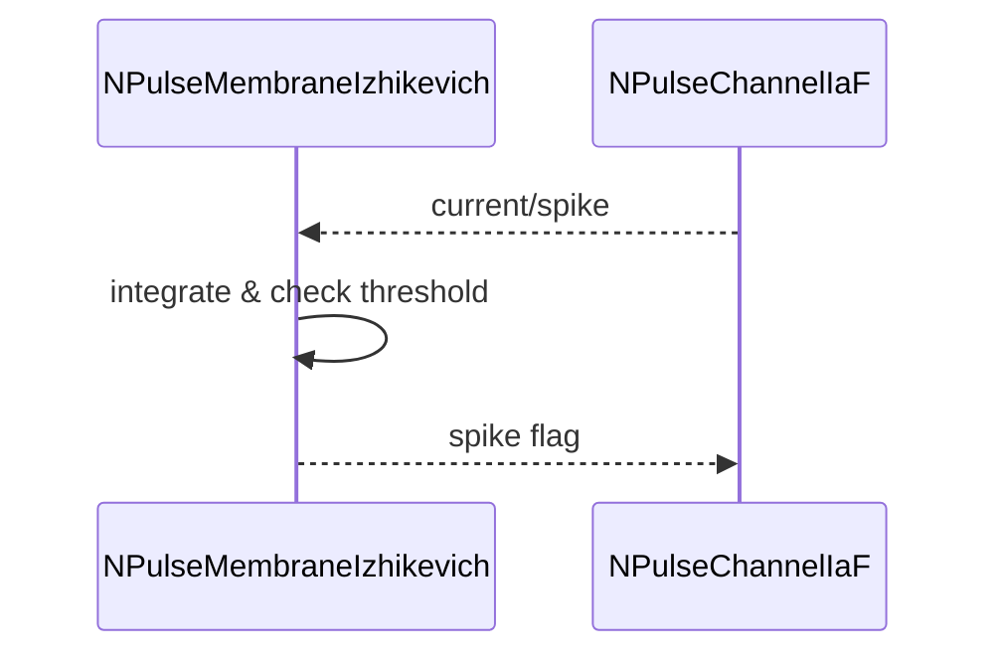

## NPulseMembraneIzhikevich — мембрана (модель Ижикевича)

**Класс**: `NPulseMembraneIzhikevich` — мембранная модель для нейронов Ижикевича.  
**Регистрация**: `NPulseLibrary.cpp` → `UploadClass("NPulseMembraneIzhikevich", ...)`.  
**Storage-инстансы**: `ClassName = "NPulseMembraneIzhikevich"`; параметры a,b,c,d, timestep.

### Входы/выходы
- Вход: ток/спайк воздействия.
- Выход: мембранный потенциал, признак спайка.

Пояснение: блок-схема показывает поток данных/сигналов (входы → компонент → выходы).

Пояснение: диаграмма последовательности показывает типовой сценарий взаимодействия и порядок вызовов.

---

## NPulseMembraneIzhikevich — membrane (Izhikevich)

Integrates input current per Izhikevich equations; outputs membrane potential and spike event.
