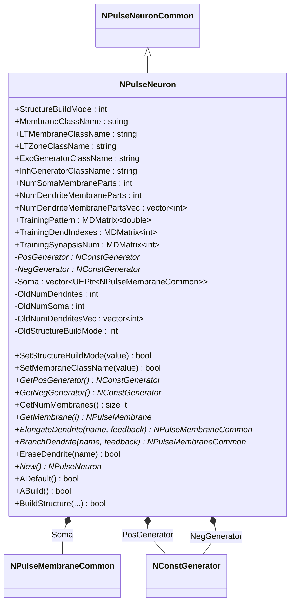
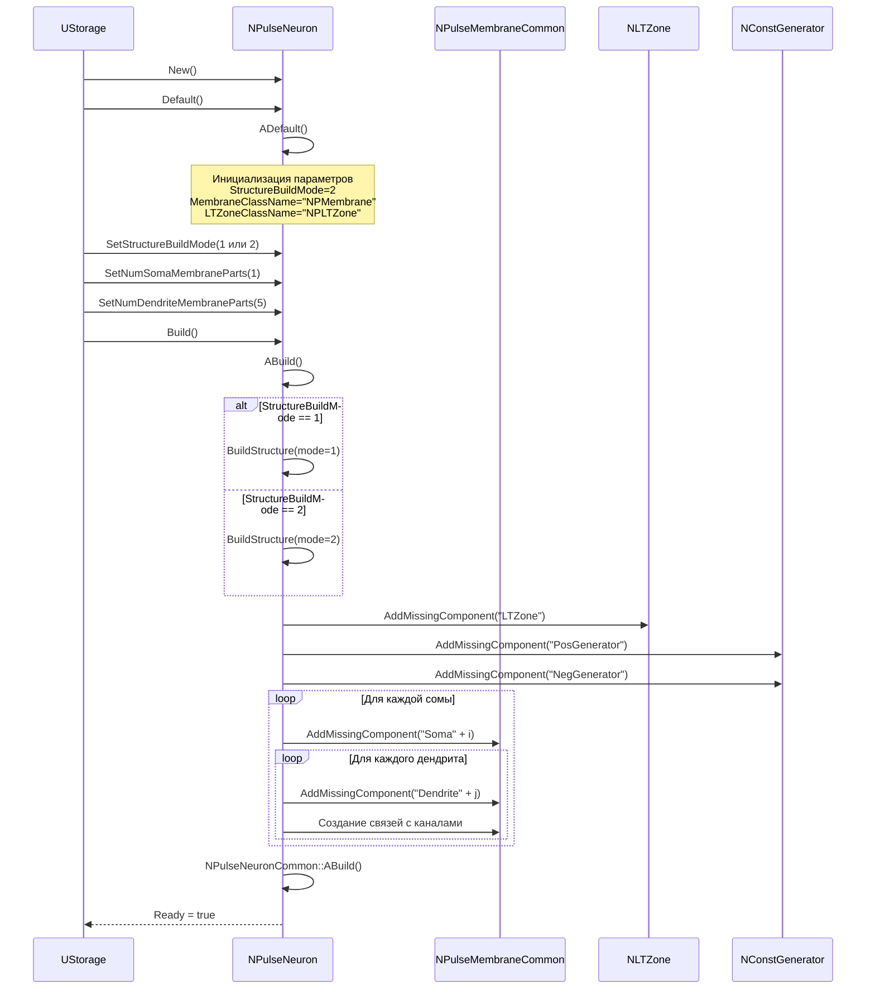
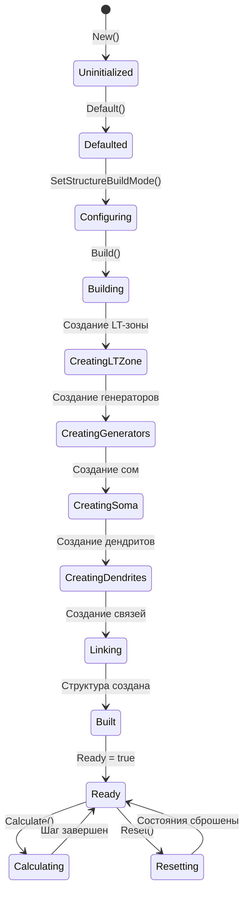
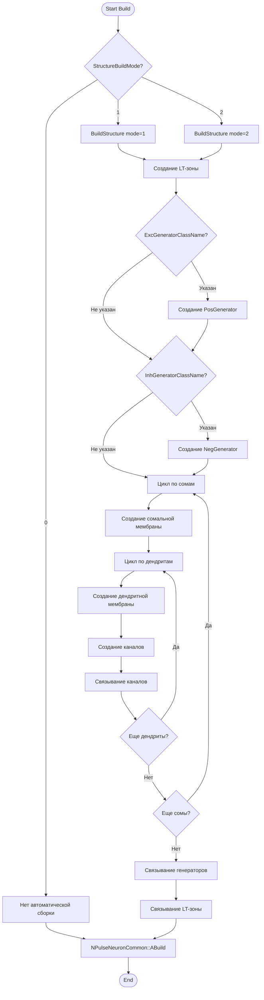
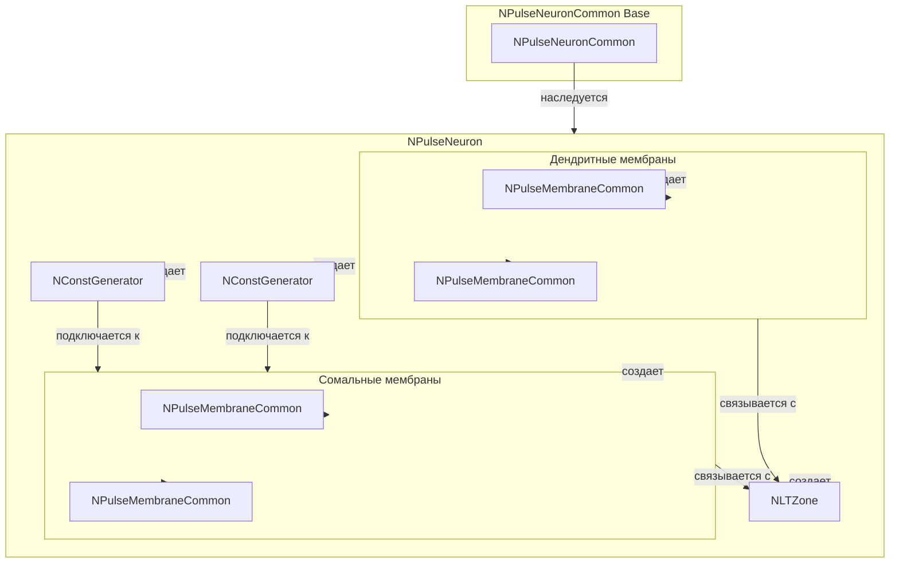
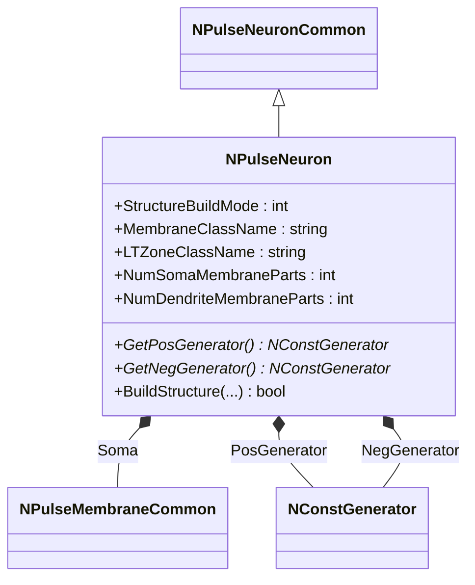
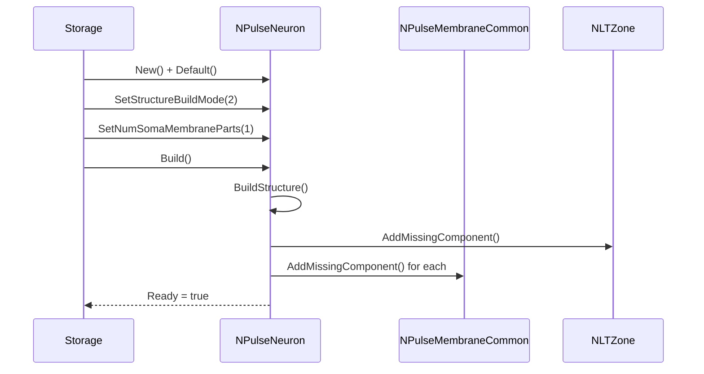
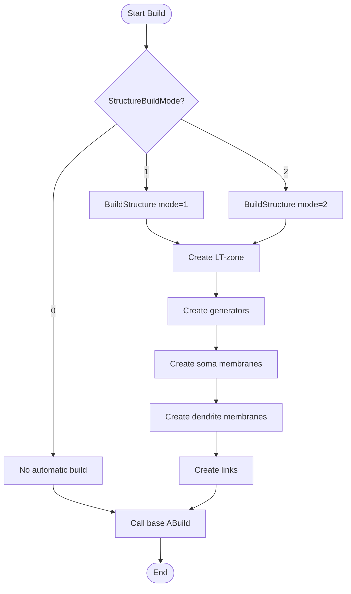
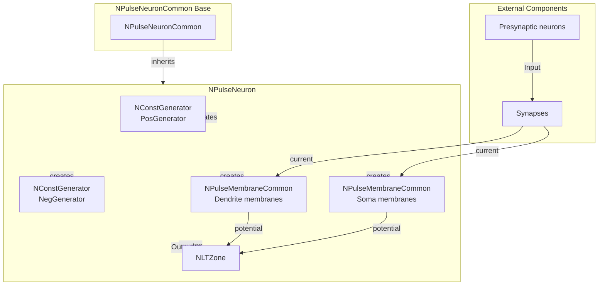

# NPulseNeuron — импульсный нейрон с параметрами структурирования

## RU

### Назначение

**Класс**: `NPulseNeuron` — импульсный нейрон с автоматическим построением структуры на основе параметров.
**Регистрация**: `NPulseLibrary.cpp` → `UploadClass("NPulseNeuron", ...)`.
**Storage-инстансы**: `ClassName = "NPulseNeuron"` в `Bin/Configs/*/Model_*.xml`.

`NPulseNeuron` расширяет `NPulseNeuronCommon` функциональностью автоматического построения структуры нейрона на основе параметров. Позволяет создавать нейроны с заданным количеством сомальных и дендритных мембран, автоматически создавать LT-зоны и генераторы, управлять структурой через параметры `StructureBuildMode`.

### UML-диаграмма классов



**Иерархия наследования:**
- `NPulseNeuronCommon` — общий импульсный нейрон
- `NPulseNeuron` — импульсный нейрон с параметрами структурирования

**Ключевые свойства:**
- Параметры структурирования: `StructureBuildMode`, `MembraneClassName`, `LTZoneClassName`, `NumSomaMembraneParts`, `NumDendriteMembraneParts`
- Генераторы: `PosGenerator` (возбуждающий), `NegGenerator` (тормозной)
- Мембраны: `Soma` (вектор сомальных мембран)

### UML-диаграмма последовательности



**Жизненный цикл:**
1. **Инициализация**: Установка параметров структурирования по умолчанию
2. **Настройка**: Установка режима сборки и количества мембран
3. **Сборка**: Автоматическое создание структуры нейрона через `BuildStructure()`
4. **Создание компонентов**: LT-зона, генераторы, мембраны создаются автоматически
5. **Создание связей**: Связи между компонентами устанавливаются автоматически

### UML-диаграмма состояний



**Состояния:**
- **Uninitialized** — создан, но не инициализирован
- **Defaulted** — параметры установлены по умолчанию
- **Configuring** — настройка параметров структурирования
- **Building** — выполняется сборка структуры
- **CreatingLTZone** — создание LT-зоны
- **CreatingGenerators** — создание генераторов
- **CreatingSoma** — создание сомальных мембран
- **CreatingDendrites** — создание дендритных мембран
- **Linking** — создание связей между компонентами
- **Built** — структура нейрона построена
- **Ready** — готов к выполнению расчетов
- **Calculating** — выполняется расчет нейрона
- **Resetting** — выполняется сброс состояний

### UML-диаграмма активности



**Алгоритм сборки структуры:**
1. Проверка режима сборки (`StructureBuildMode`)
2. Создание LT-зоны указанного класса
3. Создание генераторов (если указаны классы)
4. Создание сомальных мембран (количество = `NumSomaMembraneParts`)
5. Для каждой сомы: создание дендритных мембран (количество зависит от режима)
6. Создание каналов в мембранах
7. Связывание компонентов между собой
8. Вызов базового метода `NPulseNeuronCommon::ABuild()`

### UML-диаграмма компонентов



**Зависимости:**
- **Базовый класс**: `NPulseNeuronCommon`
- **Внутренние компоненты**: `NLTZone` (LT-зона), `NConstGenerator` (генераторы), `NPulseMembraneCommon` (мембраны)

### Свойства

#### Параметры (ptPubParameter)

- **`StructureBuildMode`** (int) — режим сборки структуры нейрона:
  - 0 — нет автоматической сборки (структура создается вручную)
  - 1 — автоматическая сборка с единой длиной дендритов (`NumDendriteMembraneParts`)
  - 2 — автоматическая сборка с индивидуальной длиной дендритов (`NumDendriteMembranePartsVec`)
  Значение по умолчанию: 2

- **`MembraneClassName`** (string) — имя класса мембраны для создания сом и дендритов. Значение по умолчанию: "NPMembrane"

- **`LTMembraneClassName`** (string) — имя класса мембраны для LT-зоны. Значение по умолчанию: "NPLTZoneNeuronMembrane"

- **`LTZoneClassName`** (string) — имя класса LT-зоны. Значение по умолчанию: "NPLTZone"

- **`ExcGeneratorClassName`** (string) — имя класса генератора возбуждающих сигналов. Если пусто, генератор не создается. Значение по умолчанию: "NPNeuronPosCGenerator"

- **`InhGeneratorClassName`** (string) — имя класса генератора тормозных сигналов. Если пусто, генератор не создается. Значение по умолчанию: "NPNeuronNegCGenerator"

- **`NumSomaMembraneParts`** (int) — количество сомальных мембран. Значение по умолчанию: 1

- **`NumDendriteMembraneParts`** (int) — количество дендритных мембран для каждой сомы (используется в режиме 1). Значение по умолчанию: 0

- **`NumDendriteMembranePartsVec`** (vector<int>) — вектор количества дендритных мембран для каждой сомы (используется в режиме 2). Размер вектора должен соответствовать `NumSomaMembraneParts`. Значение по умолчанию: пустой вектор

- **`TrainingPattern`** (MDMatrix<double>) — паттерн, которому обучен нейрон (для обучения). Если нейрон не обучен, размер = 0. Значение по умолчанию: матрица 0x0

- **`TrainingDendIndexes`** (MDMatrix<int>) — индексы входных участков на дендритах (для обучения). Значение по умолчанию: матрица 0x0

- **`TrainingSynapsisNum`** (MDMatrix<int>) — количество синапсов на входных участках дендритов (для обучения). Значение по умолчанию: матрица 0x0

**Наследуемые свойства от NPulseNeuronCommon:**
- `UseAverageDendritesPotential` (bool) — использовать усреднение потенциалов дендритов
- `UseAverageLTZonePotential` (bool) — использовать усреднение потенциалов LT-зоны
- `Output` (MDMatrix<double>) — выходной сигнал нейрона
- Все остальные свойства базового класса

### Методы

#### Публичные методы

- **`New()`** → `NPulseNeuron*` — создает новый экземпляр класса.

- **`GetPosGenerator()`** → `NConstGenerator*` — возвращает указатель на генератор возбуждающих сигналов. Возвращает `nullptr`, если генератор не создан.

- **`GetNegGenerator()`** → `NConstGenerator*` — возвращает указатель на генератор тормозных сигналов. Возвращает `nullptr`, если генератор не создан.

- **`GetNumMembranes()`** → `size_t` — возвращает количество мембран (включая сомы и дендриты).

- **`GetMembrane(size_t i)`** → `NPulseMembrane*` — возвращает мембрану по индексу.

- **`ElongateDendrite(const string &name, bool feedback=false)`** → `NPulseMembraneCommon*` — удлиняет заданный дендрит, добавляя к нему новый участок мембраны. Возвращает указатель на созданный участок или `nullptr` в случае ошибки.

- **`BranchDendrite(const string &name, bool feedback=false)`** → `NPulseMembraneCommon*` — разветвляет заданный дендрит, добавляя новый участок мембраны. Возвращает указатель на созданный участок или `nullptr` в случае ошибки.

- **`EraseDendrite(const string &name)`** → `bool` — удаляет заданный дендрит. В текущей реализации всегда возвращает `true`.

#### Защищенные методы установки параметров

- **`SetStructureBuildMode(const int &value)`** → `bool` — устанавливает режим сборки структуры. Если режим изменяется, требуется пересборка нейрона.

- **`SetMembraneClassName(const std::string &value)`** → `bool` — устанавливает имя класса мембраны. Требует пересборки.

- **`SetLTMembraneClassName(const std::string &value)`** → `bool` — устанавливает имя класса мембраны для LT-зоны. Требует пересборки.

- **`SetLTZoneClassName(const std::string &value)`** → `bool` — устанавливает имя класса LT-зоны. Требует пересборки.

- **`SetExcGeneratorClassName(const std::string &value)`** → `bool` — устанавливает имя класса генератора возбуждающих сигналов. Требует пересборки.

- **`SetInhGeneratorClassName(const std::string &value)`** → `bool` — устанавливает имя класса генератора тормозных сигналов. Требует пересборки.

- **`SetNumSomaMembraneParts(const int &value)`** → `bool` — устанавливает количество сомальных мембран. Требует пересборки.

- **`SetNumDendriteMembraneParts(const int &value)`** → `bool` — устанавливает количество дендритных мембран (режим 1). Требует пересборки.

- **`SetNumDendriteMembranePartsVec(const std::vector<int> &value)`** → `bool` — устанавливает вектор количества дендритных мембран (режим 2). Требует пересборки.

#### Защищенные методы жизненного цикла

- **`ADefault()`** → `bool` — инициализирует параметры по умолчанию. Устанавливает `StructureBuildMode=2`, `MembraneClassName="NPMembrane"`, `LTZoneClassName="NPLTZone"`, `NumSomaMembraneParts=1`, `NumDendriteMembraneParts=0`.

- **`ABuild()`** → `bool` — строит структуру нейрона. Вызывает `BuildStructure()` в зависимости от `StructureBuildMode`, затем вызывает `NPulseNeuronCommon::ABuild()`.

- **`BuildStructure(...)`** → `bool` — осуществляет сборку структуры в соответствии с выбранными именами компонентов. Создает LT-зону, генераторы, мембраны и связи между ними.

### Примеры использования

#### Пример 1: Создание нейрона в коде C++

```cpp
// Создание нейрона
auto neuron = storage->CreateComponent<NPulseNeuron>();
neuron->SetName("PulseNeuron1");

// Инициализация
neuron->Default();

// Настройка параметров структурирования
neuron->StructureBuildMode = 2;  // Режим с индивидуальной длиной дендритов
neuron->MembraneClassName = "NPulseMembraneIzhikevich";
neuron->LTZoneClassName = "NPulseLTZoneIzhikevich";
neuron->ExcGeneratorClassName = "NPNeuronPosCGenerator";
neuron->InhGeneratorClassName = "NPNeuronNegCGenerator";
neuron->NumSomaMembraneParts = 1;

// Установка количества дендритов для каждой сомы
std::vector<int> dendriteLengths = {5, 3, 7};  // 3 сомы с разным количеством дендритов
neuron->NumDendriteMembranePartsVec = dendriteLengths;
neuron->NumSomaMembraneParts = 3;

// Сборка
neuron->Build();

// Использование
for (int step = 0; step < 1000; step++) {
    neuron->Calculate();
    double output = neuron->Output(0, 0);
    std::cout << "Step " << step << ": Output = " << output << std::endl;
}
```

#### Пример 2: Конфигурация XML

```xml
<Neuron1 Class="NPulseNeuron">
    <Parameters>
        <StructureBuildMode>2</StructureBuildMode>
        <MembraneClassName>NPulseMembraneIzhikevich</MembraneClassName>
        <LTZoneClassName>NPulseLTZoneIzhikevich</LTZoneClassName>
        <ExcGeneratorClassName>NPNeuronPosCGenerator</ExcGeneratorClassName>
        <InhGeneratorClassName>NPNeuronNegCGenerator</InhGeneratorClassName>
        <NumSomaMembraneParts>1</NumSomaMembraneParts>
        <NumDendriteMembranePartsVec>
            <elem>5</elem>
            <elem>3</elem>
            <elem>7</elem>
        </NumDendriteMembranePartsVec>
    </Parameters>
</Neuron1>
```

### Использование в конфигурациях

`NPulseNeuron` используется как базовый класс для создания специализированных нейронов:

- `NPulseNeuronIzhikevich` — создается из `NPulseNeuron` с параметрами для модели Ижикевича
- `NPulseNeuronIaF` — создается из `NPulseNeuron` с параметрами для модели IaF
- `NPulseNeuronCable` — создается из `NPulseNeuron` с параметрами для кабельной модели

**Типичные значения параметров:**
- **StructureBuildMode**: 0 (ручная сборка), 1 (единая длина дендритов), 2 (индивидуальная длина)
- **MembraneClassName**: "NPMembrane", "NPulseMembraneIzhikevich", "NPulseMembraneIaF"
- **LTZoneClassName**: "NPLTZone", "NPulseLTZoneIzhikevich", "NPulseLTZoneIaF"
- **NumSomaMembraneParts**: 1-3 (обычно 1)
- **NumDendriteMembraneParts**: 0-10 (зависит от типа нейрона)

## Источники

См. [Literature-References.md](../Literature-References.md): **[A]**, **4**, **17**, **18**.

### См. также

- [`NPulseNeuronCommon`](NPulseNeuronCommon.md) — общий импульсный нейрон
- [`NPulseNeuronIzhikevich`](NPulseNeuronIzhikevich.md) — нейрон модели Ижикевича
- [`NPulseNeuronIaF`](NPulseNeuronIaF.md) — нейрон модели IaF
- [`NPulseMembraneCommon`](NPulseMembraneCommon.md) — общая мембрана
- [`NLTZone`](NPLTZone.md) — LT-зона
- [Architecture.md](../Architecture.md) — архитектура библиотеки

---

## EN

### Purpose

**Class**: `NPulseNeuron` — spiking neuron with automatic structure building based on parameters.
**Registration**: `NPulseLibrary.cpp` → `UploadClass("NPulseNeuron", ...)`.
**Instances**: `ClassName = "NPulseNeuron"` in `Bin/Configs/*/Model_*.xml`.

`NPulseNeuron` extends `NPulseNeuronCommon` with automatic structure building functionality. Allows creating neurons with specified number of soma and dendrite membranes, automatically creates LT-zones and generators, manages structure through `StructureBuildMode` parameter.

### UML Class Diagram



### UML Sequence Diagram



### UML State Diagram

```mermaid
stateDiagram-v2
    [*] --> Uninitialized: New()
    Uninitialized --> Defaulted: Default()
    Defaulted --> Configuring: Configure parameters
    Configuring --> Building: Build()
    Building --> CheckMode{StructureBuildMode?}
    CheckMode -->|0| NoBuild: No automatic build
    CheckMode -->|1| BuildMode1: BuildStructure mode=1
    CheckMode -->|2| BuildMode2: BuildStructure mode=2
    BuildMode1 --> CreateLTZone: Create LT-zone
    BuildMode2 --> CreateLTZone
    CreateLTZone --> CreateGenerators: Create generators
    CreateGenerators --> CreateSoma: Create soma membranes
    CreateSoma --> CreateDendrites: Create dendrite membranes
    CreateDendrites --> Linking: Create links
    Linking --> Built: Structure built
    NoBuild --> Built
    Built --> Ready: Ready = true
    Ready --> Calculating: Calculate()
    Calculating --> Ready: Step completed
    Ready --> Resetting: Reset()
    Resetting --> Ready
```

### UML Activity Diagram



### UML Component Diagram



### Properties

- `StructureBuildMode` — режим пересборки структуры (0 — не пересобирать, 1 — пересобирать при изменении параметров, 2 — пересобирать всегда)
- `MembraneClassName` — имя класса мембраны
- `LTMembraneClassName` — имя класса LT-мембраны
- `LTZoneClassName` — имя класса LT-зоны
- `ExcGeneratorClassName` — имя класса возбуждающего генератора
- `InhGeneratorClassName` — имя класса тормозного генератора
- `NumSomaMembraneParts` — количество частей сомальной мембраны
- `NumDendriteMembraneParts` — количество частей дендритной мембраны
- `NumDendriteMembranePartsVec` — вектор количества частей дендритных мембран
- `TrainingPattern` — паттерн для обучения
- `TrainingDendIndexes` — индексы дендритов для обучения
- `TrainingSynapsisNum` — количество синапсов для обучения

### Methods

- `SetStructureBuildMode(value)` — установка режима пересборки структуры
- `SetMembraneClassName(value)` — установка имени класса мембраны
- `GetPosGenerator()` — получение возбуждающего генератора
- `GetNegGenerator()` — получение тормозного генератора
- `GetNumMembranes()` — получение количества мембран
- `GetMembrane(i)` — получение мембраны по индексу
- `ElongateDendrite(name, feedback)` — удлинение дендрита
- `BranchDendrite(name, feedback)` — ветвление дендрита
- `EraseDendrite(name)` — удаление дендрита
- `ADefault()` — установка параметров по умолчанию
- `ABuild()` — сборка структуры нейрона
- `BuildStructure(...)` — построение структуры нейрона

### Usage in configurations

`NPulseNeuron` is used for creating spiking neurons with automatic structure building:

- **Automatic structure**: `Bin/Configs/*/Model_*.xml` (where automatic neuron structure building is required)
- **Flexible configuration**: experiments with various neuron structures
- **Training support**: supports training patterns and dendrite management

**Features:**
- Automatic structure building: creates membranes, LT-zones, and generators automatically
- Flexible structure: supports multiple soma and dendrite parts
- Dynamic structure: can modify structure during runtime (elongate, branch, erase dendrites)
- Training support: supports training patterns and dendrite selection

**Typical parameter values:**
- **StructureBuildMode**: 2 (always rebuild structure)
- **MembraneClassName**: "NPMembrane" (standard membrane)
- **LTZoneClassName**: "NPLTZone" (standard LT-zone)
- **NumSomaMembraneParts**: 1 (one soma part)
- **NumDendriteMembraneParts**: 5 (five dendrite parts)

### References

See [Literature-References.md](../Literature-References.md): **[A]**, **4**, **17**, **18**.

### See Also

- [`NPulseNeuronCommon`](NPulseNeuronCommon.md) — common spiking neuron
- [`NPulseNeuronIzhikevich`](NPulseNeuronIzhikevich.md) — Izhikevich model neuron
- [`NPulseNeuronIaF`](NPulseNeuronIaF.md) — IaF model neuron
- [`NPulseMembraneCommon`](NPulseMembraneCommon.md) — common membrane
- [Architecture.md](../Architecture.md) — library architecture
