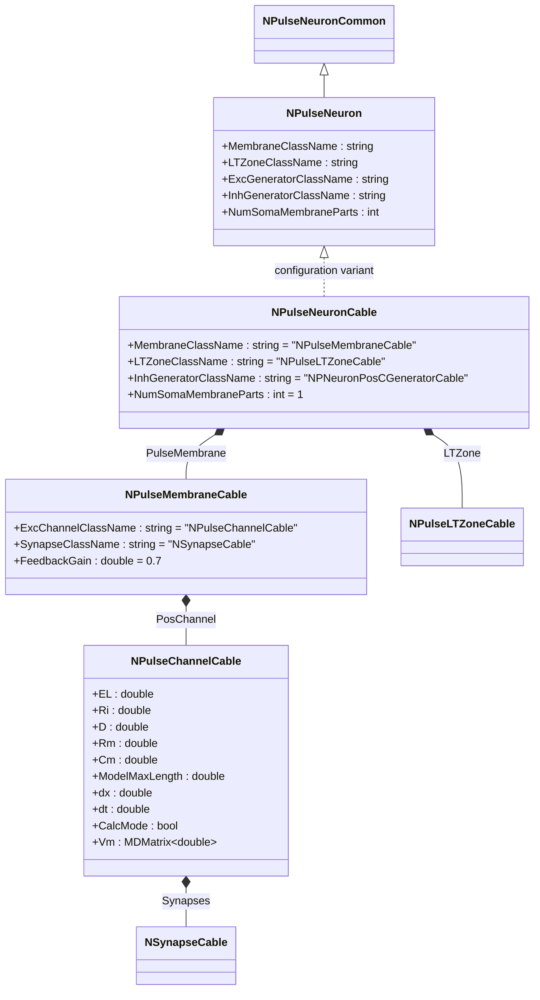
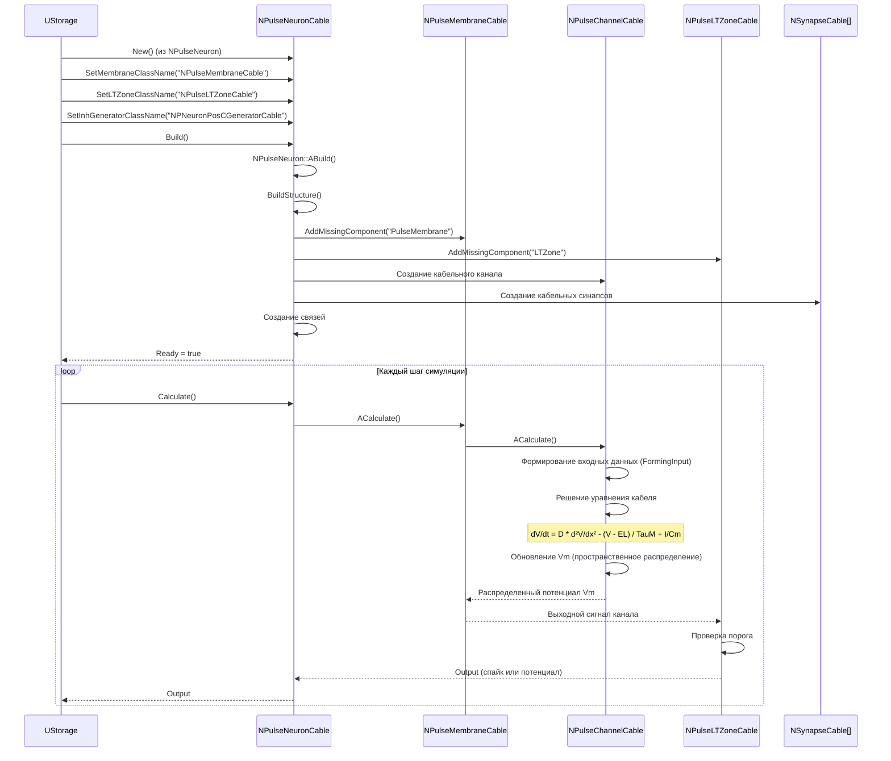
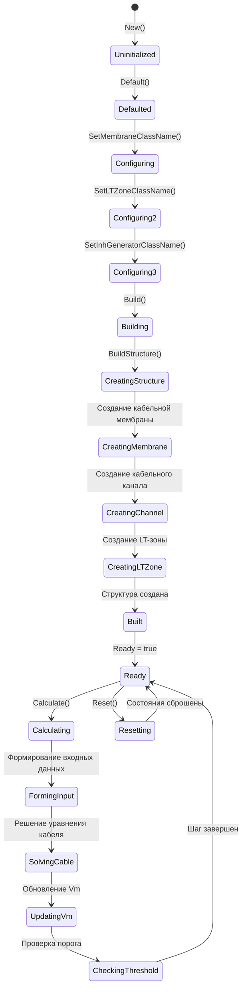
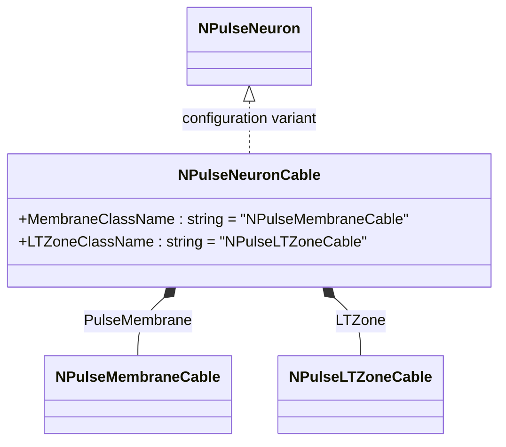
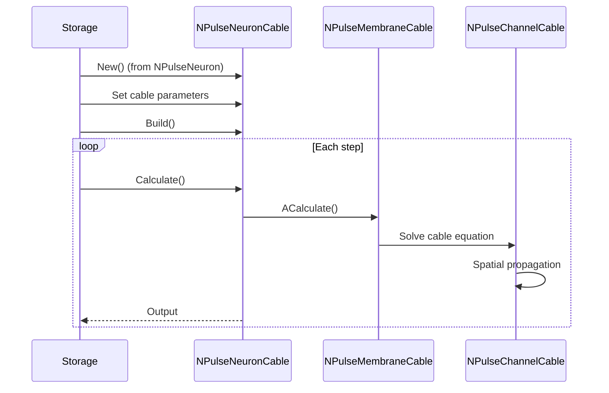
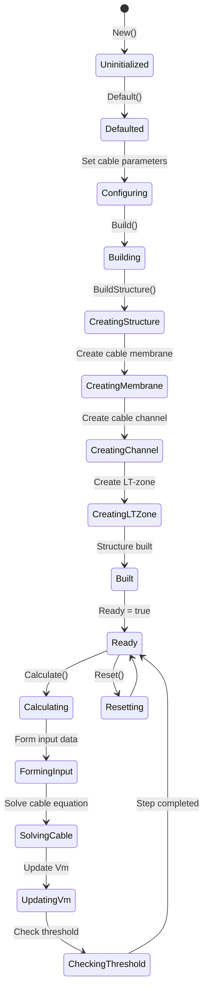

# NPulseNeuronCable — кабельный импульсный нейрон

## RU

### Назначение

**Класс**: `NPulseNeuronCable` — импульсный нейрон с кабельной моделью мембраны для пространственно-распределенного моделирования.  
**Регистрация**: `NPulseLibrary.cpp` → `UploadClass("NPulseNeuronCable", ...)`.  
**Storage-инстансы**: `ClassName = "NPulseNeuronCable"` в `Bin/Configs/*/Model_*.xml`.

`NPulseNeuronCable` реализует импульсный нейрон с кабельной моделью мембраны, которая позволяет моделировать пространственное распространение потенциала по дендритам и аксону. Создается из `NPulseNeuron` с параметрами для кабельной модели: мембрана `NPulseMembraneCable`, LT-зона `NPulseLTZoneCable`, генератор `NPNeuronPosCGeneratorCable`.

**Использование:** Моделирование пространственно-распределенных нейронов, эксперименты с дендритными структурами, кабельная теория

### UML-диаграмма классов



**Иерархия наследования:**
- `NPulseNeuronCommon` — общий импульсный нейрон
- `NPulseNeuron` — импульсный нейрон с параметрами структурирования
- `NPulseNeuronCable` — конфигурационный вариант для кабельной модели

**Внутренняя структура:**
- **PulseMembrane** (`NPulseMembraneCable`) — кабельная мембрана с пространственно-распределенным моделированием
- **LTZone** (`NPulseLTZoneCable`) — LT-зона для кабельной модели
- **PosChannel** (`NPulseChannelCable`) — кабельный канал с параметрами пространственного распространения

**Параметры кабельной модели:**
- **EL** (double) — потенциал покоя
- **Ri** (double) — осевое сопротивление (Ом*м)
- **D** (double) — коэффициент диффузии
- **Rm** (double) — сопротивление мембраны (Ом*м²)
- **Cm** (double) — емкость мембраны (Ф/м²)
- **ModelMaxLength** (double) — максимальная длина модели (м)
- **dx** (double) — шаг пространственной дискретизации (м)
- **dt** (double) — шаг временной дискретизации (с)
- **CalcMode** (bool) — режим расчета (0 — из D и CableMembraneResistance, 1 — из CableMembraneResistance и D)

### UML-диаграмма последовательности



**Жизненный цикл:**
1. **Создание**: `NPulseNeuronCable` создается из `NPulseNeuron` с настройкой параметров для кабельной модели
2. **Настройка**: Устанавливаются имена классов мембраны, LT-зоны и генератора
3. **Сборка**: Автоматически создается структура нейрона с кабельной мембраной
4. **Расчет**: На каждом шаге решается уравнение кабеля для пространственного распространения потенциала

### UML-диаграмма состояний



### UML-диаграмма активности

```mermaid
flowchart TD
    Start([Start Calculate]) --> CallBase[NPulseNeuronCommon::ACalculate]
    CallBase --> CalcMembrane[Расчет мембраны]
    CalcMembrane --> CalcChannel[Расчет кабельного канала]
    CalcChannel --> FormingInput[FormingInput: формирование входных данных]
    FormingInput --> CheckCalcMode{CalcMode?}
    CheckCalcMode -->|0/false| CalcFromD[Расчет из D и CableMembraneResistance]
    CheckCalcMode -->|1/true| CalcFromResistance[Расчет из CableMembraneResistance и D]
    CalcFromD --> SolveCable[Решение уравнения кабеля]
    CalcFromResistance --> SolveCable
    Note over SolveCable: dV/dt = D * d²V/dx² - (V - EL) / TauM + I/Cm
    SolveCable --> UpdateVm[Обновление Vm для всех точек пространства]
    UpdateVm --> CalcLTZone[Расчет LT-зоны]
    CalcLTZone --> UpdateOutput[Обновление Output]
    UpdateOutput --> End([End])
    
    Note1[Кабельная модель: пространственное распространение потенциала]
    Note1 -.-> SolveCable
```

**Алгоритм расчета (кабельная модель):**
1. Формирование входных данных для кабельного канала (`FormingInput()`)
2. Решение уравнения кабеля: `dV/dt = D * d²V/dx² - (V - EL) / TauM + I/Cm`
3. Обновление потенциала `Vm` для всех точек пространственной сетки
4. Расчет LT-зоны на основе распределенного потенциала
5. Генерация выходного сигнала нейрона

### UML-диаграмма компонентов

```mermaid
graph TB
    subgraph NPulseNeuron["NPulseNeuron Base"]
        BaseNeuron[NPulseNeuron]
    end
    
    subgraph NPulseNeuronCable["NPulseNeuronCable"]
        Membrane[NPulseMembraneCable]
        LTZone[NPulseLTZoneCable]
        Channel[NPulseChannelCable]
        Generator[NPNeuronPosCGeneratorCable]
    end
    
    subgraph External["Внешние компоненты"]
        Synapses[NSynapseCable[]]
        PreNeurons[Пресинаптические нейроны]
    end
    
    BaseNeuron -->|конфигурируется как| NPulseNeuronCable
    NPulseNeuronCable -->|создает| Membrane
    NPulseNeuronCable -->|создает| LTZone
    NPulseNeuronCable -->|создает| Generator
    Membrane -->|содержит| Channel
    Channel -->|подключается к| Synapses
    Synapses -->|входные сигналы| Channel
    PreNeurons -->|Input| Synapses
    Channel -->|пространственное распространение| Channel
    Channel -->|выходной сигнал| LTZone
    LTZone -->|обратная связь| Membrane
```

### Свойства

`NPulseNeuronCable` не имеет собственных публичных свойств (UProperty). Все свойства наследуются от `NPulseNeuron`. Параметры кабельной модели хранятся в канале (`NPulseChannelCable`).

**Наследуемые свойства от NPulseNeuron:**
- `MembraneClassName` (string) — имя класса мембраны (устанавливается в "NPulseMembraneCable")
- `LTZoneClassName` (string) — имя класса LT-зоны (устанавливается в "NPulseLTZoneCable")
- `InhGeneratorClassName` (string) — имя класса генератора (устанавливается в "NPNeuronPosCGeneratorCable")
- `NumSomaMembraneParts` (int) — количество сомальных мембран (устанавливается в 1)
- Все остальные свойства базового класса

**Параметры кабельной модели (в канале):**
- **EL** (double) — потенциал покоя (по умолчанию: зависит от реализации)
- **Ri** (double) — осевое сопротивление (Ом*м)
- **D** (double) — коэффициент диффузии (м²/с)
- **Rm** (double) — сопротивление мембраны (Ом*м²)
- **Cm** (double) — емкость мембраны (Ф/м²)
- **ModelMaxLength** (double) — максимальная длина модели (м)
- **dx** (double) — шаг пространственной дискретизации (м)
- **dt** (double) — шаг временной дискретизации (с)
- **CalcMode** (bool) — режим расчета (0 — из D и CableMembraneResistance, 1 — из CableMembraneResistance и D)
- **Vm** (MDMatrix<double>) — распределенный мембранный потенциал (пространственная сетка)

### Методы

#### Публичные методы

- **`New()`** → `NPulseNeuronCable*` — создает новый экземпляр класса. В реальности `NPulseNeuronCable` создается из `NPulseNeuron` через настройку параметров.

**Наследуемые методы от NPulseNeuron:**
- Все методы базового класса `NPulseNeuron`

#### Защищенные методы жизненного цикла

- **`ADefault()`** → `bool` — инициализирует параметры по умолчанию. Вызывает `NPulseNeuron::ADefault()`.

- **`ABuild()`** → `bool` — строит структуру нейрона. Вызывает `NPulseNeuron::ABuild()`, который создает структуру с кабельной мембраной `NPulseMembraneCable` и LT-зоной `NPulseLTZoneCable`.

- **`AReset()`** → `bool` — сбрасывает состояния нейрона. Вызывает `NPulseNeuron::AReset()`.

- **`ACalculate()`** → `bool` — выполняет расчет нейрона на одном шаге. Вызывает `NPulseNeuronCommon::ACalculate()`, который в свою очередь рассчитывает кабельную мембрану и LT-зону.

### Примеры использования

#### Пример 1: Создание кабельного нейрона в коде C++

```cpp
// Создание кабельного нейрона
auto neuron = storage->CreateComponent<NPulseNeuron>();
neuron->SetName("CableNeuron");

// Инициализация
neuron->Default();

// Настройка параметров для кабельной модели
neuron->MembraneClassName = "NPulseMembraneCable";
neuron->LTZoneClassName = "NPulseLTZoneCable";
neuron->ExcGeneratorClassName = "";
neuron->InhGeneratorClassName = "NPNeuronPosCGeneratorCable";
neuron->NumSomaMembraneParts = 1;

// Сборка
neuron->Build();

// Получение кабельного канала для настройки параметров
auto membrane = dynamic_cast<NPulseMembraneCable*>(
    neuron->GetComponent("PulseMembrane")
);

if (membrane) {
    auto channel = dynamic_cast<NPulseChannelCable*>(
        membrane->GetPosChannel(0)
    );
    if (channel) {
        // Настройка параметров кабельной модели
        channel->EL = -0.07;              // Потенциал покоя (В)
        channel->Ri = 100000;             // Осевое сопротивление (Ом*м)
        channel->D = 0.00002;            // Коэффициент диффузии (м²/с)
        channel->Rm = 1000;               // Сопротивление мембраны (Ом*м²)
        channel->Cm = 1.0e-9;             // Емкость мембраны (Ф/м²)
        channel->ModelMaxLength = 0.0002; // Максимальная длина (м)
        channel->dx = 1.0e-5;             // Шаг пространственной дискретизации (м)
        channel->CalcMode = false;        // Режим расчета
    }
}

// Использование
for (int step = 0; step < 10000; step++) {
    neuron->Calculate();
    double output = neuron->Output(0, 0);
    if (step % 1000 == 0) {
        std::cout << "Step " << step << ": Output = " << output << std::endl;
    }
}
```

#### Пример 2: Конфигурация XML

```xml
<Neuron1 Class="NPulseNeuronCable">
    <Parameters>
        <UseAverageDendritesPotential>1</UseAverageDendritesPotential>
        <UseAverageLTZonePotential>1</UseAverageLTZonePotential>
    </Parameters>
    <Components>
        <PulseMembrane Class="NPulseMembraneCable">
            <Parameters>
                <FeedbackGain>0.7</FeedbackGain>
            </Parameters>
            <Components>
                <PosChannel Class="NPulseChannelCable">
                    <Parameters>
                        <EL>-0.07</EL>
                        <Ri>100000</Ri>
                        <D>0.00002</D>
                        <Rm>1000</Rm>
                        <Cm>1.0e-9</Cm>
                        <ModelMaxLength>0.0002</ModelMaxLength>
                        <dx>1.0e-5</dx>
                        <CalcMode>0</CalcMode>
                    </Parameters>
                    <Components>
                        <Synapse1 Class="NSynapseCable">
                            <!-- Параметры кабельного синапса -->
                        </Synapse1>
                    </Components>
                </PosChannel>
            </Components>
        </PulseMembrane>
        <LTZone Class="NPulseLTZoneCable">
            <Parameters>
                <Threshold>-0.055</Threshold>
                <ThresholdOff>-0.07</ThresholdOff>
            </Parameters>
        </LTZone>
    </Components>
</Neuron1>
```

### Использование в конфигурациях

`NPulseNeuronCable` используется в экспериментах с пространственно-распределенными моделями:

- Моделирование дендритных структур
- Изучение пространственного распространения потенциала
- Эксперименты с кабельной теорией
- Моделирование аксонального распространения

**Типичные значения параметров:**
- **EL**: -0.07 В (потенциал покоя)
- **Ri**: 100000 Ом*м (осевое сопротивление)
- **D**: 0.00002 м²/с (коэффициент диффузии)
- **Rm**: 1000 Ом*м² (сопротивление мембраны)
- **Cm**: 1.0e-9 Ф/м² (емкость мембраны)
- **ModelMaxLength**: 0.0002 м (максимальная длина)
- **dx**: 1.0e-5 м (шаг пространственной дискретизации)

**Особенности:**
- Использует пространственно-распределенную модель мембраны
- Решает уравнение кабеля для распространения потенциала
- Поддерживает пространственную дискретизацию с шагом `dx`
- Моделирует распространение сигналов по дендритам и аксону

### См. также

- [`NPulseNeuron`](NPulseNeuron.md) — импульсный нейрон с параметрами структурирования
- [`NPulseNeuronCableMulti`](NPulseNeuronCableMulti.md) — многоканальный кабельный нейрон
- [`NPulseMembraneCable`](NPulseMembraneCable.md) — кабельная мембрана
- [`NPulseChannelCable`](NPulseChannelCable.md) — кабельный канал
- [`NPulseLTZoneCable`](NPulseLTZoneCable.md) — кабельная LT-зона
- [`NSynapseCable`](NSynapseCable.md) — кабельный синапс
- [Architecture.md](../Architecture.md) — архитектура библиотеки
- [Scientific-Background.md](../Scientific-Background.md) — научный фон (кабельная теория, пространственное распространение)

---

## EN

### Purpose

**Class**: `NPulseNeuronCable` — spiking neuron with cable membrane model for spatially-distributed modeling.  
**Registration**: `NPulseLibrary.cpp` → `UploadClass("NPulseNeuronCable", ...)`.  
**Instances**: `ClassName = "NPulseNeuronCable"` in `Bin/Configs/*/Model_*.xml`.

`NPulseNeuronCable` implements a spiking neuron with cable membrane model that allows modeling spatial potential propagation along dendrites and axon. Created from `NPulseNeuron` with parameters for cable model: membrane `NPulseMembraneCable`, LT-zone `NPulseLTZoneCable`, generator `NPNeuronPosCGeneratorCable`.

**Usage:** Modeling spatially-distributed neurons, experiments with dendritic structures, cable theory

### UML Class Diagram



### UML Sequence Diagram



### UML State Diagram



### UML Activity Diagram

```mermaid
flowchart TD
    Start([Start Calculate]) --> CallBase[Call NPulseNeuronCommon::ACalculate]
    CallBase --> CalcMembrane[Calculate membrane]
    CalcMembrane --> CalcChannel[Calculate cable channel]
    CalcChannel --> FormingInput[FormingInput: form input data]
    FormingInput --> CheckCalcMode{CalcMode?}
    CheckCalcMode -->|0/false| CalcFromD[Calculate from D and CableMembraneResistance]
    CheckCalcMode -->|1/true| CalcFromResistance[Calculate from CableMembraneResistance and D]
    CalcFromD --> SolveCable[Solve cable equation]
    CalcFromResistance --> SolveCable
    Note over SolveCable: dV/dt = D * d²V/dx² - (V - EL) / TauM + I/Cm
    SolveCable --> UpdateVm[Update Vm for all spatial points]
    UpdateVm --> CalcLTZone[Calculate LT-zone]
    CalcLTZone --> UpdateOutput[Update Output]
    UpdateOutput --> End([End])
```

### UML Component Diagram

```mermaid
graph TB
    subgraph NPulseNeuron["NPulseNeuron Base"]
        BaseNeuron[NPulseNeuron]
    end
    
    subgraph NPulseNeuronCable["NPulseNeuronCable"]
        Membrane[NPulseMembraneCable]
        LTZone[NPulseLTZoneCable]
        Channel[NPulseChannelCable]
        Generator[NPNeuronPosCGeneratorCable]
    end
    
    subgraph External["External Components"]
        Synapses[NSynapseCable[]]
        PreNeurons[Presynaptic neurons]
    end
    
    BaseNeuron -->|configured as| NPulseNeuronCable
    NPulseNeuronCable -->|creates| Membrane
    NPulseNeuronCable -->|creates| LTZone
    NPulseNeuronCable -->|creates| Generator
    Membrane -->|contains| Channel
    Channel -->|connects to| Synapses
    Synapses -->|input signals| Channel
    PreNeurons -->|Input| Synapses
    Channel -->|spatial propagation| Channel
    Channel -->|output signal| LTZone
    LTZone -->|feedback| Membrane
```

### Usage in configurations

`NPulseNeuronCable` is used in spatially-distributed model experiments:

- Dendritic structure modeling
- Spatial potential propagation studies
- Cable theory experiments
- Axonal propagation modeling

**Typical parameter values:**
- **EL**: -0.07 V (resting potential)
- **Ri**: 100000 Ω*m (axial resistance)
- **D**: 0.00002 m²/s (diffusion coefficient)
- **Rm**: 1000 Ω*m² (membrane resistance)
- **Cm**: 1.0e-9 F/m² (membrane capacitance)
- **ModelMaxLength**: 0.0002 m (maximum length)
- **dx**: 1.0e-5 m (spatial discretization step)

**Features:**
- Uses spatially-distributed membrane model
- Solves cable equation for potential propagation
- Supports spatial discretization with step `dx`
- Models signal propagation along dendrites and axon

### See Also

- [`NPulseNeuron`](NPulseNeuron.md) — spiking neuron with structuring parameters
- [`NPulseNeuronCableMulti`](NPulseNeuronCableMulti.md) — multi-channel cable neuron
- [`NPulseMembraneCable`](NPulseMembraneCable.md) — cable membrane
- [`NPulseChannelCable`](NPulseChannelCable.md) — cable channel
- [`NPulseLTZoneCable`](NPulseLTZoneCable.md) — cable LT-zone
- [`NSynapseCable`](NSynapseCable.md) — cable synapse
- [Architecture.md](../Architecture.md) — library architecture
- [Scientific-Background.md](../Scientific-Background.md) — scientific background (cable theory, spatial propagation)
