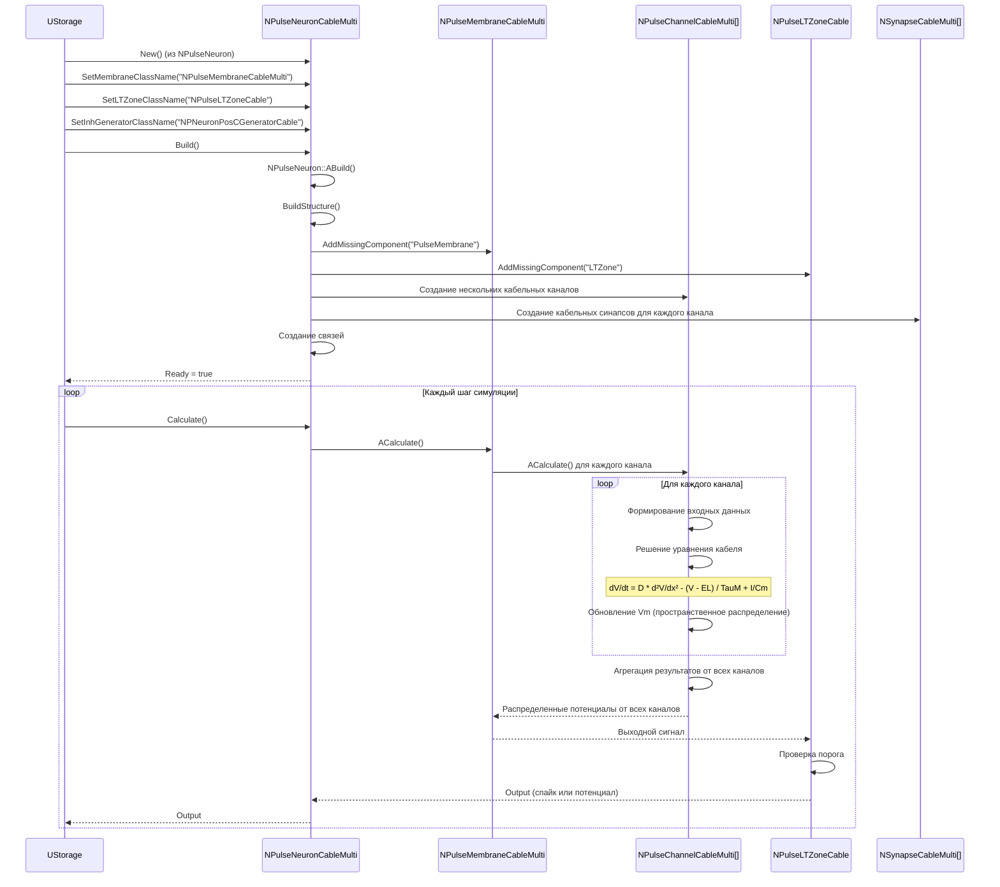
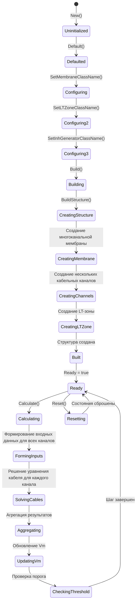
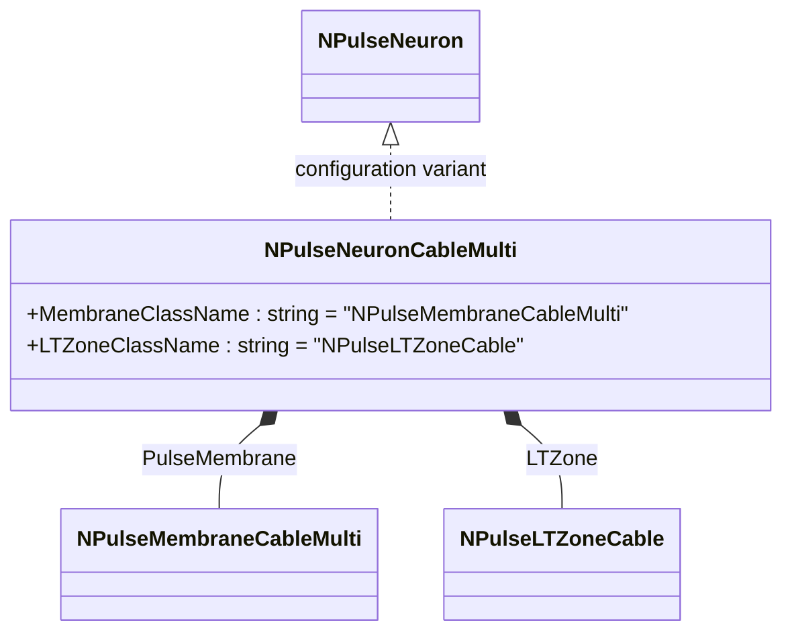
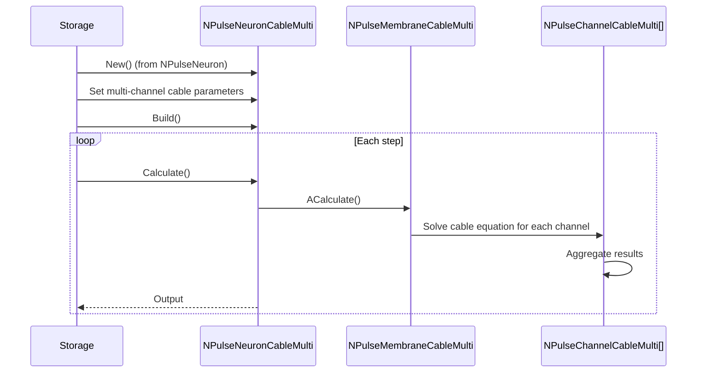
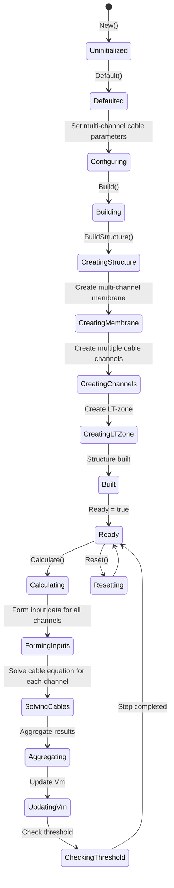

# NPulseNeuronCableMulti — многоканальный кабельный импульсный нейрон

## RU

### Назначение

**Класс**: `NPulseNeuronCableMulti` — импульсный нейрон с многоканальной кабельной моделью мембраны для моделирования нескольких параллельных кабельных каналов.  
**Регистрация**: `NPulseLibrary.cpp` → `UploadClass("NPulseNeuronCableMulti", ...)`.  
**Storage-инстансы**: `ClassName = "NPulseNeuronCableMulti"` в `Bin/Configs/*/Model_*.xml`.

`NPulseNeuronCableMulti` реализует импульсный нейрон с многоканальной кабельной моделью мембраны, которая позволяет моделировать несколько параллельных кабельных каналов для более сложных пространственных структур. Создается из `NPulseNeuron` с параметрами для многоканальной кабельной модели: мембрана `NPulseMembraneCableMulti`, LT-зона `NPulseLTZoneCable`, генератор `NPNeuronPosCGeneratorCable`.

**Использование:** Моделирование сложных пространственных структур нейронов, эксперименты с несколькими параллельными кабельными каналами, моделирование ветвления дендритов

### UML-диаграмма классов

```mermaid
classDiagram
    NPulseNeuronCommon <|-- NPulseNeuron
    NPulseNeuron <|.. NPulseNeuronCableMulti : configuration variant
    NPulseNeuronCableMulti *-- NPulseMembraneCableMulti : PulseMembrane
    NPulseNeuronCableMulti *-- NPulseLTZoneCable : LTZone
    NPulseMembraneCableMulti *-- NPulseChannelCableMulti[] : PosChannels
    NPulseChannelCableMulti *-- NSynapseCableMulti : Synapses
    class NPulseNeuron {
        +MembraneClassName : string
        +LTZoneClassName : string
        +ExcGeneratorClassName : string
        +InhGeneratorClassName : string
        +NumSomaMembraneParts : int
    }
    class NPulseNeuronCableMulti {
        +MembraneClassName : string = "NPulseMembraneCableMulti"
        +LTZoneClassName : string = "NPulseLTZoneCable"
        +InhGeneratorClassName : string = "NPNeuronPosCGeneratorCable"
        +NumSomaMembraneParts : int = 1
    }
    class NPulseMembraneCableMulti {
        +ExcChannelClassName : string = "NPulseChannelCableMulti"
        +SynapseClassName : string = "NSynapseCableMulti"
        +FeedbackGain : double = 0.7
    }
    class NPulseChannelCableMulti {
        +EL : double
        +Ri : double
        +D : double
        +Rm : double
        +Cm : double
        +ModelMaxLength : double
        +dx : double
        +dt : double
        +Vm : MDMatrix~double~
    }
```

**Иерархия наследования:**
- `NPulseNeuronCommon` — общий импульсный нейрон
- `NPulseNeuron` — импульсный нейрон с параметрами структурирования
- `NPulseNeuronCableMulti` — конфигурационный вариант для многоканальной кабельной модели

**Внутренняя структура:**
- **PulseMembrane** (`NPulseMembraneCableMulti`) — многоканальная кабельная мембрана
- **LTZone** (`NPulseLTZoneCable`) — LT-зона для кабельной модели
- **PosChannels** (`NPulseChannelCableMulti[]`) — массив кабельных каналов для параллельного моделирования

**Параметры многоканальной кабельной модели:**
- Те же параметры, что и для `NPulseNeuronCable`, но применяются к нескольким параллельным каналам
- Каждый канал имеет свои параметры пространственного распространения
- Каналы могут взаимодействовать друг с другом

### UML-диаграмма последовательности



**Жизненный цикл:**
1. **Создание**: `NPulseNeuronCableMulti` создается из `NPulseNeuron` с настройкой параметров для многоканальной кабельной модели
2. **Настройка**: Устанавливаются имена классов мембраны, LT-зоны и генератора
3. **Сборка**: Автоматически создается структура нейрона с несколькими параллельными кабельными каналами
4. **Расчет**: На каждом шаге решается уравнение кабеля для каждого канала, результаты агрегируются

### UML-диаграмма состояний



### UML-диаграмма активности

```mermaid
flowchart TD
    Start([Start Calculate]) --> CallBase[NPulseNeuronCommon::ACalculate]
    CallBase --> CalcMembrane[Расчет многоканальной мембраны]
    CalcMembrane --> LoopChannels[Цикл по всем каналам]
    LoopChannels --> FormingInput[FormingInput для канала]
    FormingInput --> SolveCable[Решение уравнения кабеля для канала]
    Note over SolveCable: dV/dt = D * d²V/dx² - (V - EL) / TauM + I/Cm
    SolveCable --> UpdateVmChannel[Обновление Vm для канала]
    UpdateVmChannel --> CheckMoreChannels{Еще каналы?}
    CheckMoreChannels -->|Да| LoopChannels
    CheckMoreChannels -->|Нет| AggregateChannels[Агрегация результатов от всех каналов]
    AggregateChannels --> CalcLTZone[Расчет LT-зоны]
    CalcLTZone --> UpdateOutput[Обновление Output]
    UpdateOutput --> End([End])
    
    Note1[Многоканальная модель: несколько параллельных кабельных каналов]
    Note1 -.-> LoopChannels
```

**Алгоритм расчета (многоканальная кабельная модель):**
1. Формирование входных данных для каждого кабельного канала
2. Решение уравнения кабеля для каждого канала независимо
3. Обновление потенциала `Vm` для всех точек пространственной сетки каждого канала
4. Агрегация результатов от всех каналов
5. Расчет LT-зоны на основе агрегированного распределенного потенциала
6. Генерация выходного сигнала нейрона

### UML-диаграмма компонентов

```mermaid
graph TB
    subgraph NPulseNeuron["NPulseNeuron Base"]
        BaseNeuron[NPulseNeuron]
    end
    
    subgraph NPulseNeuronCableMulti["NPulseNeuronCableMulti"]
        Membrane[NPulseMembraneCableMulti]
        LTZone[NPulseLTZoneCable]
        Channels[NPulseChannelCableMulti[]]
        Generator[NPNeuronPosCGeneratorCable]
    end
    
    subgraph External["Внешние компоненты"]
        Synapses[NSynapseCableMulti[]]
        PreNeurons[Пресинаптические нейроны]
    end
    
    BaseNeuron -->|конфигурируется как| NPulseNeuronCableMulti
    NPulseNeuronCableMulti -->|создает| Membrane
    NPulseNeuronCableMulti -->|создает| LTZone
    NPulseNeuronCableMulti -->|создает| Generator
    Membrane -->|содержит| Channels
    Channels -->|подключается к| Synapses
    Synapses -->|входные сигналы| Channels
    PreNeurons -->|Input| Synapses
    Channels -->|пространственное распространение| Channels
    Channels -->|агрегация| Membrane
    Membrane -->|выходной сигнал| LTZone
    LTZone -->|обратная связь| Membrane
```

### Свойства

`NPulseNeuronCableMulti` не имеет собственных публичных свойств (UProperty). Все свойства наследуются от `NPulseNeuron`. Параметры многоканальной кабельной модели хранятся в каналах (`NPulseChannelCableMulti[]`).

**Наследуемые свойства от NPulseNeuron:**
- `MembraneClassName` (string) — имя класса мембраны (устанавливается в "NPulseMembraneCableMulti")
- `LTZoneClassName` (string) — имя класса LT-зоны (устанавливается в "NPulseLTZoneCable")
- `InhGeneratorClassName` (string) — имя класса генератора (устанавливается в "NPNeuronPosCGeneratorCable")
- `NumSomaMembraneParts` (int) — количество сомальных мембран (устанавливается в 1)
- Все остальные свойства базового класса

**Параметры многоканальной кабельной модели (в каналах):**
- Те же параметры, что и для `NPulseChannelCable`, но применяются к каждому каналу независимо
- Каждый канал имеет свою пространственную сетку и параметры распространения
- Результаты от всех каналов агрегируются для формирования выходного сигнала

### Методы

#### Публичные методы

- **`New()`** → `NPulseNeuronCableMulti*` — создает новый экземпляр класса. В реальности `NPulseNeuronCableMulti` создается из `NPulseNeuron` через настройку параметров.

**Наследуемые методы от NPulseNeuron:**
- Все методы базового класса `NPulseNeuron`

#### Защищенные методы жизненного цикла

- **`ADefault()`** → `bool` — инициализирует параметры по умолчанию. Вызывает `NPulseNeuron::ADefault()`.

- **`ABuild()`** → `bool` — строит структуру нейрона. Вызывает `NPulseNeuron::ABuild()`, который создает структуру с многоканальной кабельной мембраной `NPulseMembraneCableMulti` и LT-зоной `NPulseLTZoneCable`.

- **`AReset()`** → `bool` — сбрасывает состояния нейрона. Вызывает `NPulseNeuron::AReset()`.

- **`ACalculate()`** → `bool` — выполняет расчет нейрона на одном шаге. Вызывает `NPulseNeuronCommon::ACalculate()`, который в свою очередь рассчитывает многоканальную кабельную мембрану и LT-зону.

### Примеры использования

#### Пример 1: Создание многоканального кабельного нейрона в коде C++

```cpp
// Создание многоканального кабельного нейрона
auto neuron = storage->CreateComponent<NPulseNeuron>();
neuron->SetName("CableMultiNeuron");

// Инициализация
neuron->Default();

// Настройка параметров для многоканальной кабельной модели
neuron->MembraneClassName = "NPulseMembraneCableMulti";
neuron->LTZoneClassName = "NPulseLTZoneCable";
neuron->ExcGeneratorClassName = "";
neuron->InhGeneratorClassName = "NPNeuronPosCGeneratorCable";
neuron->NumSomaMembraneParts = 1;

// Сборка
neuron->Build();

// Использование
for (int step = 0; step < 10000; step++) {
    neuron->Calculate();
    double output = neuron->Output(0, 0);
    if (step % 1000 == 0) {
        std::cout << "Step " << step << ": Output = " << output << std::endl;
    }
}
```

#### Пример 2: Конфигурация XML

```xml
<Neuron1 Class="NPulseNeuronCableMulti">
    <Parameters>
        <UseAverageDendritesPotential>1</UseAverageDendritesPotential>
        <UseAverageLTZonePotential>1</UseAverageLTZonePotential>
    </Parameters>
    <Components>
        <PulseMembrane Class="NPulseMembraneCableMulti">
            <Parameters>
                <FeedbackGain>0.7</FeedbackGain>
            </Parameters>
            <Components>
                <!-- Несколько кабельных каналов создаются автоматически -->
                <PosChannel Class="NPulseChannelCableMulti">
                    <Parameters>
                        <EL>-0.07</EL>
                        <Ri>100000</Ri>
                        <D>0.00002</D>
                        <Rm>1000</Rm>
                        <Cm>1.0e-9</Cm>
                        <ModelMaxLength>0.0002</ModelMaxLength>
                        <dx>1.0e-5</dx>
                        <CalcMode>0</CalcMode>
                    </Parameters>
                    <Components>
                        <Synapse1 Class="NSynapseCableMulti">
                            <!-- Параметры кабельного синапса -->
                        </Synapse1>
                    </Components>
                </PosChannel>
            </Components>
        </PulseMembrane>
        <LTZone Class="NPulseLTZoneCable">
            <Parameters>
                <Threshold>-0.055</Threshold>
                <ThresholdOff>-0.07</ThresholdOff>
            </Parameters>
        </LTZone>
    </Components>
</Neuron1>
```

### Использование в конфигурациях

`NPulseNeuronCableMulti` используется в экспериментах с сложными пространственными структурами:

- Моделирование ветвления дендритов
- Изучение взаимодействия между параллельными кабельными каналами
- Эксперименты с несколькими пространственными путями распространения
- Моделирование сложных дендритных деревьев

**Преимущества многоканальной модели:**
- Возможность моделирования нескольких параллельных кабельных каналов
- Более точное моделирование сложных дендритных структур
- Возможность изучения взаимодействия между каналами
- Гибкость в настройке параметров для каждого канала

**Типичные значения параметров:**
Аналогичны `NPulseNeuronCable`, но применяются к каждому каналу независимо.

## Источники

См. [Literature-References.md](../Literature-References.md): **[C]**, **7**, **5**, **6**.

### См. также

- [`NPulseNeuron`](NPulseNeuron.md) — импульсный нейрон с параметрами структурирования
- [`NPulseNeuronCable`](NPulseNeuronCable.md) — одноканальный кабельный нейрон
- [`NPulseMembraneCableMulti`](NPulseMembraneCableMulti.md) — многоканальная кабельная мембрана
- [`NPulseChannelCableMulti`](NPulseChannelCableMulti.md) — многоканальный кабельный канал
- [`NPulseLTZoneCable`](NPulseLTZoneCable.md) — кабельная LT-зона
- [`NSynapseCableMulti`](NSynapseCableMulti.md) — многоканальный кабельный синапс
- [Architecture.md](../Architecture.md) — архитектура библиотеки
- [Scientific-Background.md](../Scientific-Background.md) — научный фон (кабельная теория, многоканальные модели, пространственное распространение)

---

## EN

### Purpose

**Class**: `NPulseNeuronCableMulti` — spiking neuron with multi-channel cable membrane model for modeling multiple parallel cable channels.  
**Registration**: `NPulseLibrary.cpp` → `UploadClass("NPulseNeuronCableMulti", ...)`.  
**Instances**: `ClassName = "NPulseNeuronCableMulti"` in `Bin/Configs/*/Model_*.xml`.

`NPulseNeuronCableMulti` implements a spiking neuron with multi-channel cable membrane model that allows modeling multiple parallel cable channels for more complex spatial structures. Created from `NPulseNeuron` with parameters for multi-channel cable model: membrane `NPulseMembraneCableMulti`, LT-zone `NPulseLTZoneCable`, generator `NPNeuronPosCGeneratorCable`.

**Usage:** Modeling complex spatial neuron structures, experiments with multiple parallel cable channels, modeling dendritic branching

### UML Class Diagram



### UML Sequence Diagram



### UML State Diagram



### UML Activity Diagram

```mermaid
flowchart TD
    Start([Start Calculate]) --> CallBase[Call NPulseNeuronCommon::ACalculate]
    CallBase --> CalcMembrane[Calculate multi-channel membrane]
    CalcMembrane --> LoopChannels[Loop through all channels]
    LoopChannels --> FormingInput[FormingInput for channel]
    FormingInput --> SolveCable[Solve cable equation for channel]
    Note over SolveCable: dV/dt = D * d²V/dx² - (V - EL) / TauM + I/Cm
    SolveCable --> UpdateVmChannel[Update Vm for channel]
    UpdateVmChannel --> CheckMoreChannels{More channels?}
    CheckMoreChannels -->|Yes| LoopChannels
    CheckMoreChannels -->|No| AggregateChannels[Aggregate results from all channels]
    AggregateChannels --> CalcLTZone[Calculate LT-zone]
    CalcLTZone --> UpdateOutput[Update Output]
    UpdateOutput --> End([End])
```

### UML Component Diagram

```mermaid
graph TB
    subgraph NPulseNeuron["NPulseNeuron Base"]
        BaseNeuron[NPulseNeuron]
    end
    
    subgraph NPulseNeuronCableMulti["NPulseNeuronCableMulti"]
        Membrane[NPulseMembraneCableMulti]
        LTZone[NPulseLTZoneCable]
        Channels[NPulseChannelCableMulti[]]
        Generator[NPNeuronPosCGeneratorCable]
    end
    
    subgraph External["External Components"]
        Synapses[NSynapseCableMulti[]]
        PreNeurons[Presynaptic neurons]
    end
    
    BaseNeuron -->|configured as| NPulseNeuronCableMulti
    NPulseNeuronCableMulti -->|creates| Membrane
    NPulseNeuronCableMulti -->|creates| LTZone
    NPulseNeuronCableMulti -->|creates| Generator
    Membrane -->|contains| Channels
    Channels -->|connects to| Synapses
    Synapses -->|input signals| Channels
    PreNeurons -->|Input| Synapses
    Channels -->|spatial propagation| Channels
    Channels -->|aggregation| Membrane
    Membrane -->|output signal| LTZone
    LTZone -->|feedback| Membrane
```

### Usage in configurations

`NPulseNeuronCableMulti` is used in complex spatial structure experiments:

- Dendritic branching modeling
- Interaction studies between parallel cable channels
- Experiments with multiple spatial propagation paths
- Complex dendritic tree modeling

**Advantages of multi-channel model:**
- Ability to model multiple parallel cable channels
- More accurate modeling of complex dendritic structures
- Ability to study interactions between channels
- Flexibility in parameter configuration for each channel

**Typical parameter values:**
Similar to `NPulseNeuronCable`, but applied to each channel independently.

### References

See [Literature-References.md](../Literature-References.md): **[C]**, **7**, **5**, **6**.

### See Also

- [`NPulseNeuron`](NPulseNeuron.md) — spiking neuron with structuring parameters
- [`NPulseNeuronCable`](NPulseNeuronCable.md) — single-channel cable neuron
- [`NPulseMembraneCableMulti`](NPulseMembraneCableMulti.md) — multi-channel cable membrane
- [`NPulseChannelCableMulti`](NPulseChannelCableMulti.md) — multi-channel cable channel
- [`NPulseLTZoneCable`](NPulseLTZoneCable.md) — cable LT-zone
- [`NSynapseCableMulti`](NSynapseCableMulti.md) — multi-channel cable synapse
- [Architecture.md](../Architecture.md) — library architecture
- [Scientific-Background.md](../Scientific-Background.md) — scientific background (cable theory, multi-channel models, spatial propagation)
