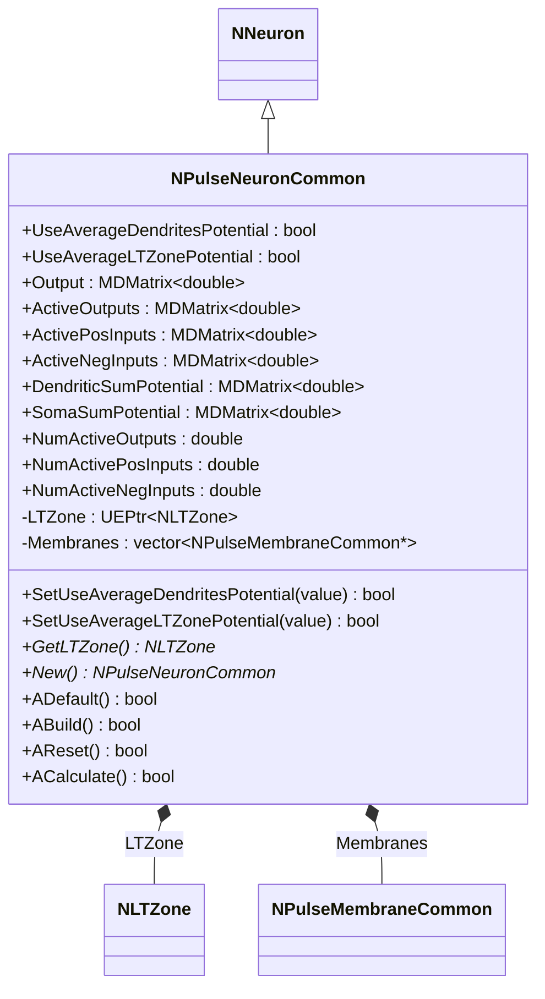
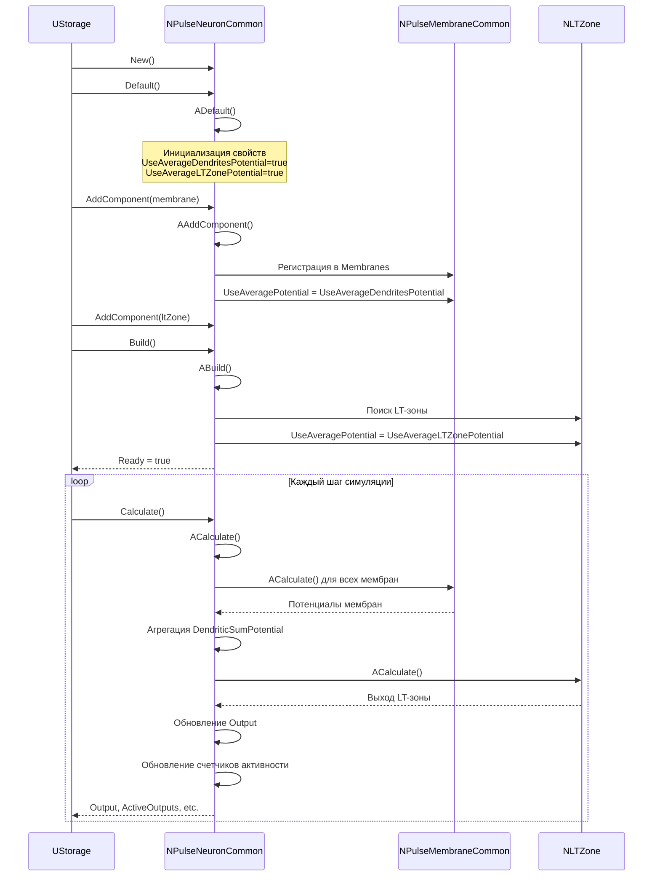
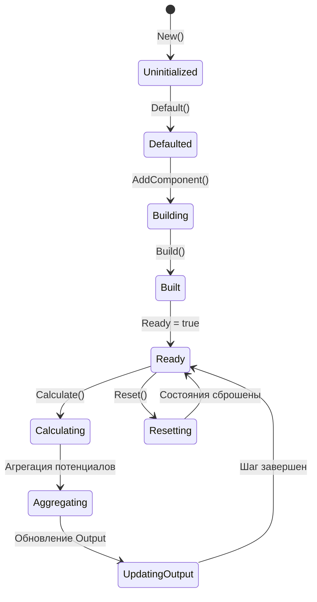
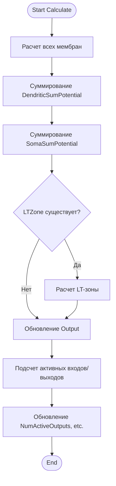
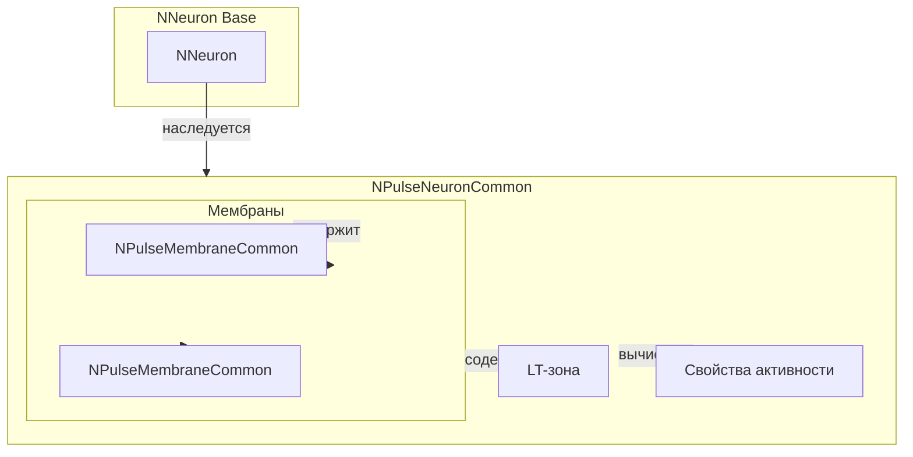
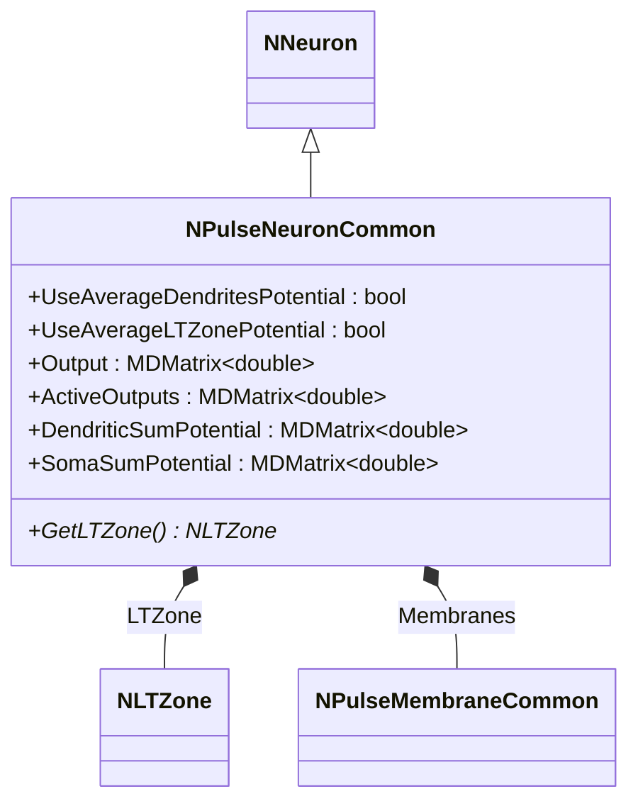
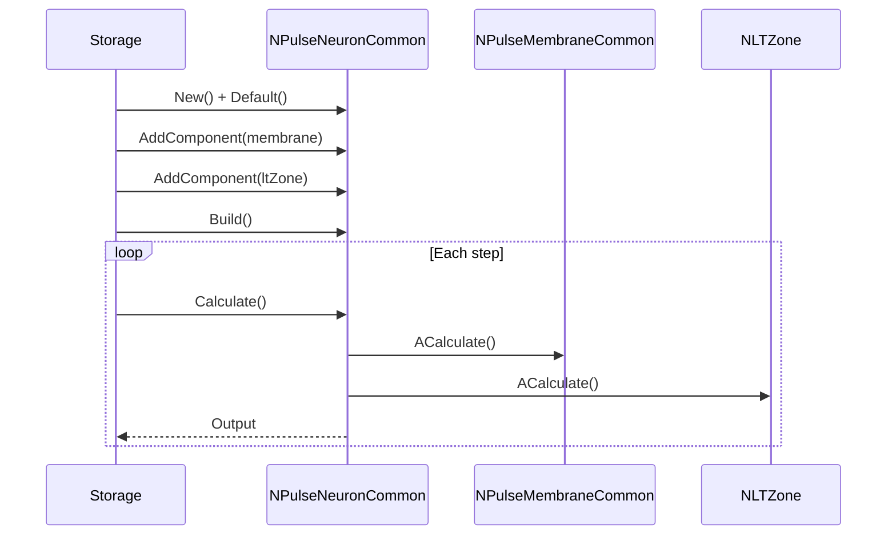
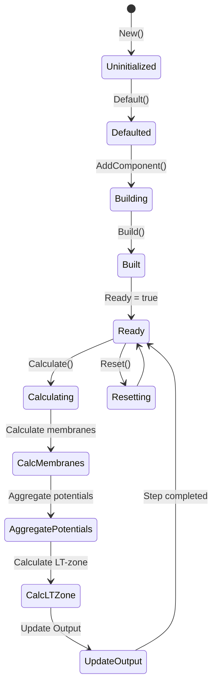
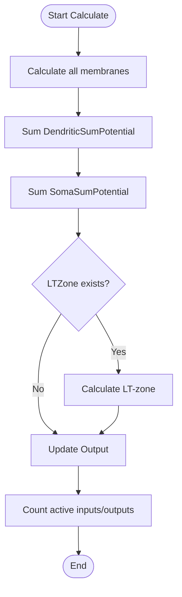
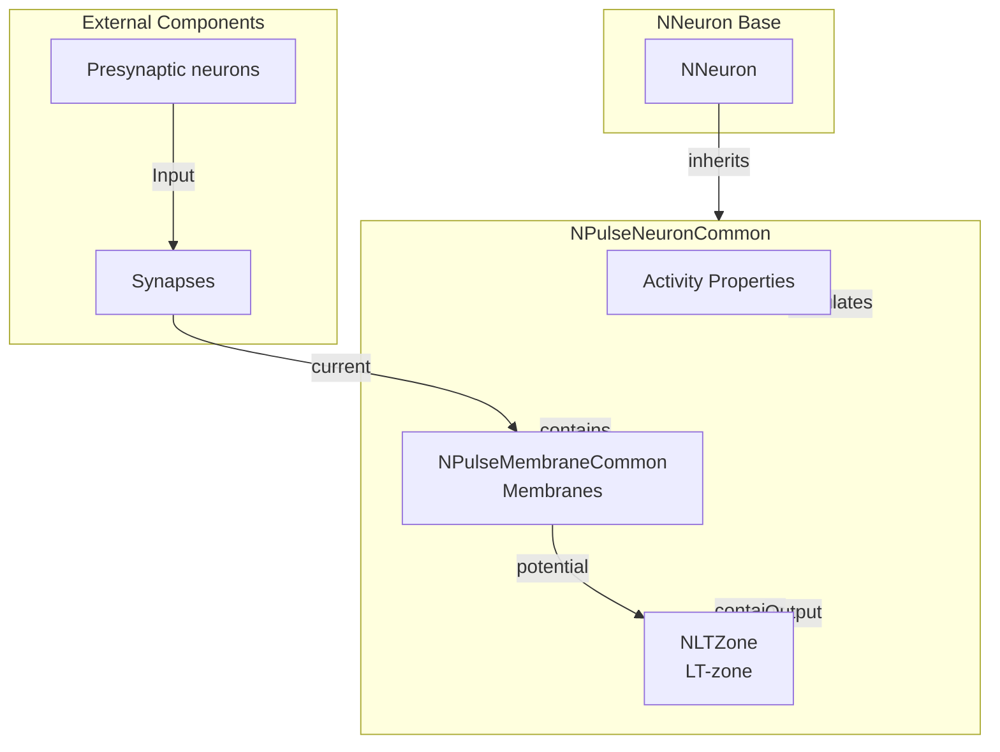

# NPulseNeuronCommon — общий импульсный нейрон

## RU

### Назначение

**Класс**: `NPulseNeuronCommon` — базовый класс для импульсных нейронов с общей функциональностью.
**Регистрация**: `NPulseLibrary.cpp` → `UploadClass("NPulseNeuronCommon", ...)`.
**Storage-инстансы**: `ClassName = "NPulseNeuronCommon"` (обычно используется через наследников).

`NPulseNeuronCommon` расширяет `NNeuron` функциональностью для работы с импульсными нейронами. Управляет мембранами, LT-зонами, отслеживает активность входов и выходов, агрегирует потенциалы дендритов и сомы.

### UML-диаграмма классов



**Иерархия наследования:**
- `NNeuron` — базовый нейрон
- `NPulseNeuronCommon` — общий импульсный нейрон

**Ключевые свойства:**
- Параметры усреднения: `UseAverageDendritesPotential`, `UseAverageLTZonePotential`
- Выходные данные: `Output`, `ActiveOutputs`, `ActivePosInputs`, `ActiveNegInputs`
- Потенциалы: `DendriticSumPotential`, `SomaSumPotential`
- Счетчики активности: `NumActiveOutputs`, `NumActivePosInputs`, `NumActiveNegInputs`

### UML-диаграмма последовательности



**Жизненный цикл:**
1. **Инициализация**: Установка параметров усреднения по умолчанию
2. **Добавление мембран**: Мембраны регистрируются в векторе `Membranes`
3. **Поиск LT-зоны**: При сборке находится первая LT-зона среди подкомпонентов
4. **Расчет**: На каждом шаге рассчитываются мембраны, агрегируются потенциалы, обновляется выход

### UML-диаграмма состояний



**Состояния:**
- **Uninitialized** — создан, но не инициализирован
- **Defaulted** — параметры установлены по умолчанию
- **Building** — добавление мембран и LT-зон
- **Built** — структура нейрона построена, LT-зона найдена
- **Ready** — готов к выполнению расчетов
- **Calculating** — выполняется расчет нейрона
- **Aggregating** — агрегация потенциалов от мембран
- **UpdatingOutput** — обновление выходного сигнала
- **Resetting** — выполняется сброс состояний

### UML-диаграмма активности



**Алгоритм расчета:**
1. Расчет всех мембран (`ACalculate()` для каждой мембраны)
2. Суммирование потенциалов дендритов (`DendriticSumPotential`)
3. Суммирование потенциалов сомы (`SomaSumPotential`)
4. Расчет LT-зоны (если существует)
5. Обновление выходного сигнала (`Output`)
6. Подсчет активных входов и выходов

### UML-диаграмма компонентов



**Зависимости:**
- **Базовый класс**: `NNeuron`
- **Компоненты**: `NPulseMembraneCommon` (мембраны), `NLTZone` (LT-зона)
- **Генераторы**: `NConstGenerator` (для мембран)

### Свойства

#### Параметры (ptPubParameter)

- **`UseAverageDendritesPotential`** (bool) — использовать усреднение потенциалов дендритов. Если `true`, мембраны используют усреднение потенциалов. Значение по умолчанию: `true`

- **`UseAverageLTZonePotential`** (bool) — использовать усреднение потенциалов LT-зоны. Если `true`, LT-зона использует усреднение потенциалов. Значение по умолчанию: `true`

#### Выходные свойства (ptOutput | ptPubState)

- **`Output`** (MDMatrix<double>) — выходной сигнал нейрона. Матрица размером 1x1, содержащая текущий выходной потенциал или активность.

- **`ActiveOutputs`** (MDMatrix<double>) — активные выходы нейрона. Отслеживает активность выходных связей.

- **`ActivePosInputs`** (MDMatrix<double>) — активные возбуждающие входы. Отслеживает активность возбуждающих входных связей.

- **`ActiveNegInputs`** (MDMatrix<double>) — активные тормозные входы. Отслеживает активность тормозных входных связей.

- **`DendriticSumPotential`** (MDMatrix<double>) — суммарный потенциал дендритов. Агрегированный потенциал всех дендритных мембран.

- **`SomaSumPotential`** (MDMatrix<double>) — суммарный потенциал сомы. Агрегированный потенциал сомальных мембран.

#### Состояния (ptPubState)

- **`NumActiveOutputs`** (double) — количество активных выходных связей.

- **`NumActivePosInputs`** (double) — количество активных возбуждающих входных связей.

- **`NumActiveNegInputs`** (double) — количество активных тормозных входных связей.

#### Внутренние компоненты

- **`LTZone`** (UEPtr<NLTZone>) — указатель на LT-зону нейрона. Находится автоматически при сборке среди подкомпонентов.

- **`Membranes`** (vector<NPulseMembraneCommon*>) — вектор указателей на мембраны нейрона. Заполняется автоматически при добавлении мембран.

### Методы

#### Публичные методы

- **`New()`** → `NPulseNeuronCommon*` — создает новый экземпляр класса.

- **`SetUseAverageDendritesPotential(const bool &value)`** → `bool` — устанавливает флаг усреднения потенциалов дендритов. Обновляет настройку для всех мембран.

- **`SetUseAverageLTZonePotential(const bool &value)`** → `bool` — устанавливает флаг усреднения потенциалов LT-зоны. Обновляет настройку для LT-зоны.

- **`GetLTZone()`** → `NLTZone*` — возвращает указатель на LT-зону нейрона. Возвращает `nullptr`, если LT-зона не найдена.

#### Защищенные методы жизненного цикла

- **`ADefault()`** → `bool` — инициализирует параметры по умолчанию. Устанавливает `UseAverageDendritesPotential=true`, `UseAverageLTZonePotential=true`, инициализирует выходные матрицы нулями.

- **`ABuild()`** → `bool` — строит структуру нейрона. Ищет LT-зону среди подкомпонентов и устанавливает параметры усреднения для мембран и LT-зоны.

- **`AReset()`** → `bool` — сбрасывает состояния нейрона. Обнуляет счетчики активности и выходные потенциалы.

- **`ACalculate()`** → `bool` — выполняет расчет нейрона на одном шаге. Рассчитывает мембраны, агрегирует потенциалы, обновляет выход и счетчики активности.

- **`AAddComponent(UEPtr<UContainer> comp)`** → `bool` — обрабатывает добавление компонента. Регистрирует мембраны в векторе `Membranes` и устанавливает параметры усреднения.

- **`ADelComponent(UEPtr<UContainer> comp)`** → `bool` — обрабатывает удаление компонента. Удаляет мембрану из вектора `Membranes`.

- **`CheckComponentType(UEPtr<UContainer> comp)`** → `bool` — проверяет допустимость типа компонента. Разрешает добавление `NPulseMembraneCommon`, `NLTZone`, `NConstGenerator`.

### Примеры использования

#### Пример 1: Создание нейрона в коде C++

```cpp
// Создание нейрона
auto neuron = storage->CreateComponent<NPulseNeuronCommon>();
neuron->SetName("Neuron1");

// Инициализация
neuron->Default();

// Настройка параметров
neuron->UseAverageDendritesPotential = true;
neuron->UseAverageLTZonePotential = true;

// Добавление мембраны
auto membrane = storage->CreateComponent<NPulseMembraneIzhikevich>();
neuron->AddComponent(membrane);

// Добавление LT-зоны
auto ltZone = storage->CreateComponent<NPulseLTZoneIzhikevich>();
neuron->AddComponent(ltZone);

// Сборка
neuron->Build();

// Использование
for (int step = 0; step < 1000; step++) {
    neuron->Calculate();
    double output = neuron->Output(0, 0);
    std::cout << "Output: " << output << std::endl;
}
```

#### Пример 2: Конфигурация XML

```xml
<Neuron1 Class="NPulseNeuronCommon">
    <Parameters>
        <UseAverageDendritesPotential>1</UseAverageDendritesPotential>
        <UseAverageLTZonePotential>1</UseAverageLTZonePotential>
    </Parameters>
    <Components>
        <Membrane1 Class="NPulseMembraneIzhikevich">
            <!-- Параметры мембраны -->
        </Membrane1>
        <LTZone1 Class="NPulseLTZoneIzhikevich">
            <!-- Параметры LT-зоны -->
        </LTZone1>
    </Components>
</Neuron1>
```

### Использование в конфигурациях

`NPulseNeuronCommon` обычно не используется напрямую в конфигурациях. Вместо него используются специализированные классы:

- `NPulseNeuronIzhikevich` — для нейронов модели Ижикевича
- `NPulseNeuron` — для нейронов с параметрами структурирования
- Другие специализированные нейроны

## Источники

См. [Literature-References.md](../Literature-References.md): **[A]**, **4**, **17**, **18**.

### См. также

- [`NNeuron`](NNeuron.md) — базовый нейрон
- [`NPulseNeuron`](NPulseNeuron.md) — импульсный нейрон с параметрами структурирования
- [`NPulseNeuronIzhikevich`](NPulseNeuronIzhikevich.md) — нейрон модели Ижикевича
- [`NPulseMembraneCommon`](NPulseMembraneCommon.md) — общая мембрана
- [`NPulseLTZoneCommon`](NPulseLTZoneCommon.md) — общая LT-зона
- [Architecture.md](../Architecture.md) — архитектура библиотеки

---

## EN

### Purpose

**Class**: `NPulseNeuronCommon` — base class for spiking neurons with common functionality.
**Registration**: `NPulseLibrary.cpp` → `UploadClass("NPulseNeuronCommon", ...)`.
**Instances**: `ClassName = "NPulseNeuronCommon"` (typically used via derived classes).

`NPulseNeuronCommon` extends `NNeuron` with functionality for working with spiking neurons. Manages membranes, LT-zones, tracks input and output activity, aggregates dendritic and soma potentials.

### UML Class Diagram



### UML Sequence Diagram



### UML State Diagram



### UML Activity Diagram



### UML Component Diagram



### Properties

- `UseAverageDendritesPotential` — использовать усреднение потенциалов дендритов
- `UseAverageLTZonePotential` — использовать усреднение потенциалов LT-зоны
- `Output` — выходной сигнал нейрона
- `ActiveOutputs` — активные выходы
- `ActivePosInputs` — активные положительные входы
- `ActiveNegInputs` — активные отрицательные входы
- `DendriticSumPotential` — суммарный потенциал дендритов
- `SomaSumPotential` — суммарный потенциал сомы
- `NumActiveOutputs` — количество активных выходов
- `NumActivePosInputs` — количество активных положительных входов
- `NumActiveNegInputs` — количество активных отрицательных входов

### Methods

- `SetUseAverageDendritesPotential(value)` — установка использования усреднения потенциалов дендритов
- `SetUseAverageLTZonePotential(value)` — установка использования усреднения потенциалов LT-зоны
- `GetLTZone()` — получение LT-зоны
- `ADefault()` — установка параметров по умолчанию
- `ABuild()` — сборка структуры нейрона
- `AReset()` — сброс состояния
- `ACalculate()` — выполнение шага расчета нейрона

### Usage in configurations

`NPulseNeuronCommon` is used as a base class for all spiking neurons:

- **Base class**: Used as base for all spiking neuron types
- **Activity tracking**: Tracks input/output activity and potentials
- **Membrane management**: Manages multiple membranes (soma and dendrites)
- **LT-zone integration**: Integrates with LT-zones for plasticity

**Features:**
- Multiple membranes: supports multiple soma and dendrite membranes
- Activity tracking: tracks active inputs and outputs
- Potential aggregation: aggregates dendritic and soma potentials
- LT-zone support: integrates with LT-zones for long-term plasticity

**Typical parameter values:**
- **UseAverageDendritesPotential**: true (use averaging for dendrites)
- **UseAverageLTZonePotential**: true (use averaging for LT-zone)

### References

See [Literature-References.md](../Literature-References.md): **[A]**, **4**, **17**, **18**.

### See Also

- [`NNeuron`](NNeuron.md) — base neuron
- [`NPulseNeuron`](NPulseNeuron.md) — spiking neuron with structuring parameters
- [`NPulseNeuronIzhikevich`](NPulseNeuronIzhikevich.md) — Izhikevich model neuron
- [`NPulseMembraneCommon`](NPulseMembraneCommon.md) — common membrane
- [`NPulseLTZoneCommon`](NPulseLTZoneCommon.md) — common LT-zone
- [Architecture.md](../Architecture.md) — library architecture
