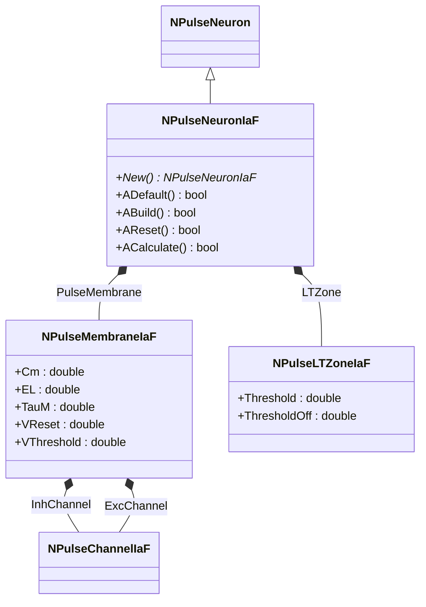
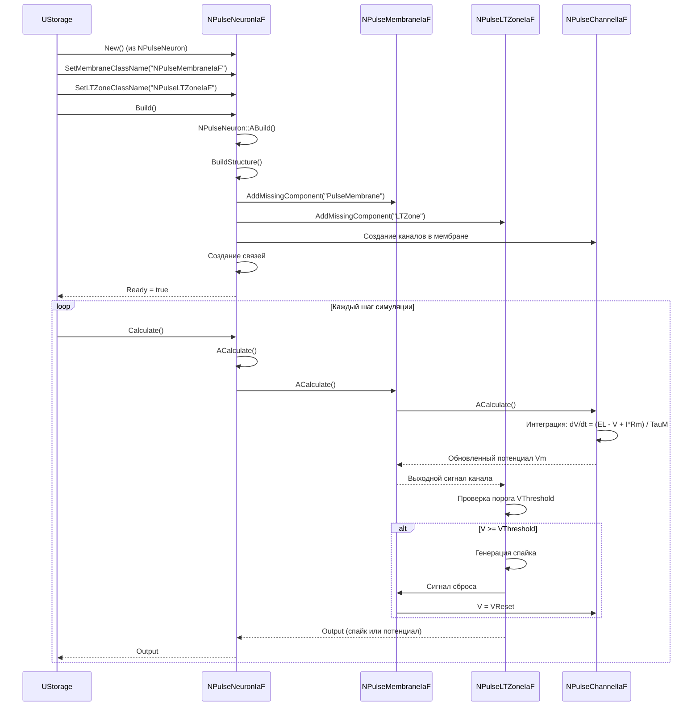
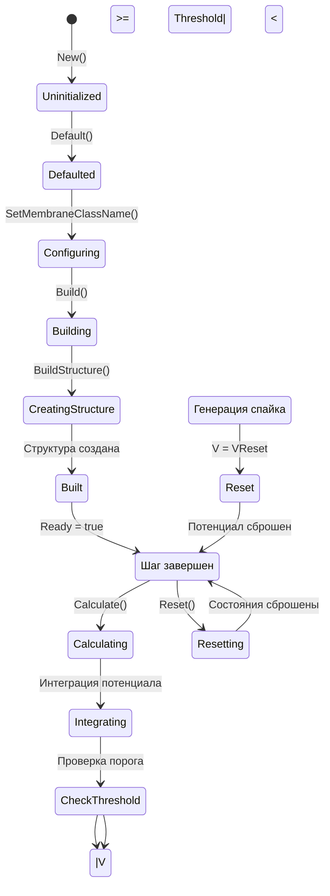
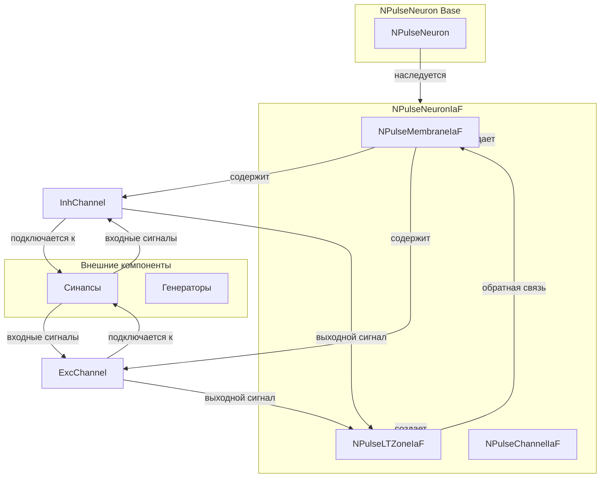
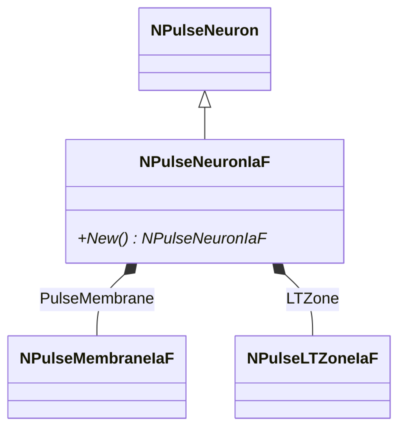
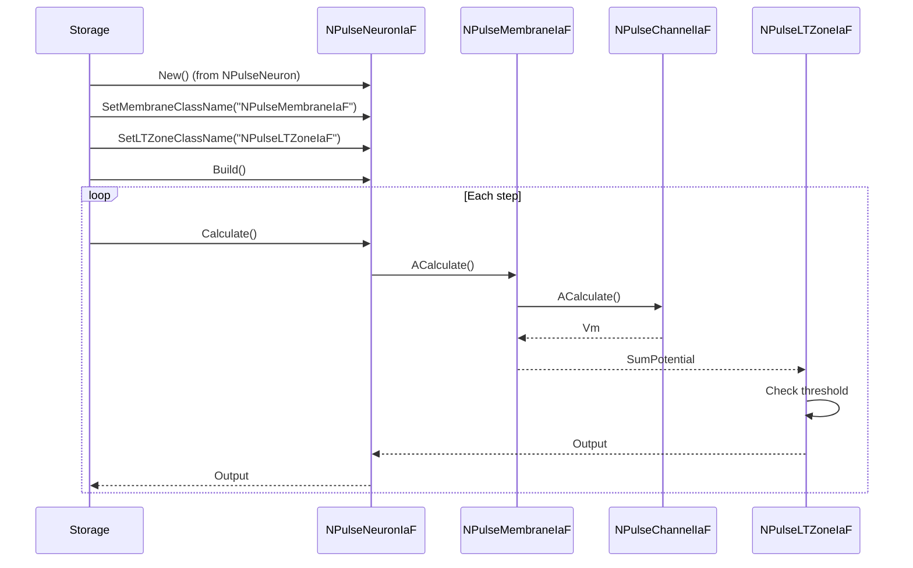
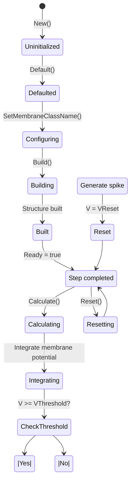
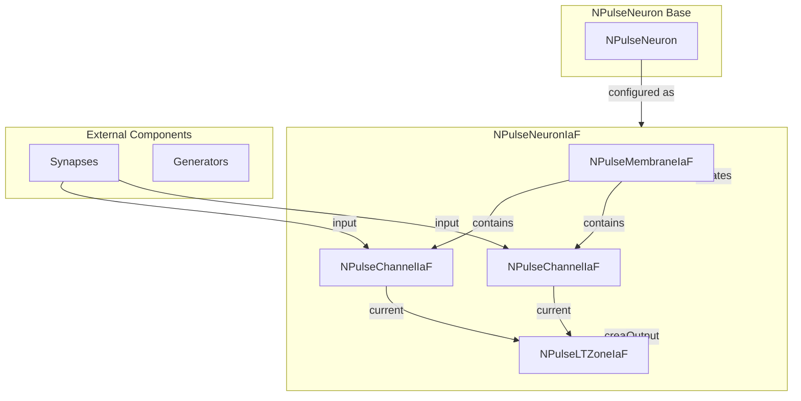

# NPulseNeuronIaF — импульсный нейрон (модель Integrate-and-Fire)

## RU

### Назначение

**Класс**: `NPulseNeuronIaF` — импульсный нейрон модели Integrate-and-Fire (IaF).
**Аббревиатура**: `IaF` — **I**ntegrate and **F**ire (интегрировать и стрелять).
**Регистрация**: `NPulseLibrary.cpp` → `UploadClass("NPulseNeuronIaF", ...)`.
**Storage-инстансы**: `ClassName = "NPulseNeuronIaF"` в `Bin/Configs/*/Model_*.xml`.

`NPulseNeuronIaF` реализует модель нейрона Integrate-and-Fire — простую модель, которая интегрирует входные токи и генерирует спайк при достижении порога. Создается из `NPulseNeuron` с параметрами для модели IaF: мембрана `NPulseMembraneIaF` и LT-зона `NPulseLTZoneIaF`. Сравнение кабельной/сегментной модели (CSNM) с IaF приведено в [C].

**Использование:** `Bin/Configs/!OldConfigs/OldExperiments/*/`

### UML-диаграмма классов



**Иерархия наследования:**
- `NPulseNeuron` — импульсный нейрон с параметрами структурирования
- `NPulseNeuronIaF` — нейрон модели Integrate-and-Fire

**Внутренняя структура:**
- **PulseMembrane** (`NPulseMembraneIaF`) — мембрана с параметрами модели IaF
- **LTZone** (`NPulseLTZoneIaF`) — LT-зона для генерации спайков

**Параметры модели IaF:**
- **Cm** (double) — емкость мембраны
- **EL** (double) — потенциал покоя
- **TauM** (double) — мембранная постоянная времени
- **VReset** (double) — потенциал сброса после спайка
- **VThreshold** (double) — порог генерации спайка

### UML-диаграмма последовательности



**Жизненный цикл:**
1. **Создание**: `NPulseNeuronIaF` создается из `NPulseNeuron` с настройкой параметров для модели IaF
2. **Настройка**: Устанавливаются имена классов мембраны и LT-зоны
3. **Сборка**: Автоматически создается структура нейрона через `BuildStructure()`
4. **Расчет**: На каждом шаге интегрируется мембранный потенциал, проверяется порог, генерируется спайк

### UML-диаграмма состояний



**Состояния:**
- **Uninitialized** — создан, но не инициализирован
- **Defaulted** — параметры установлены по умолчанию
- **Configuring** — настройка параметров структурирования
- **Building** — выполняется сборка структуры
- **Built** — структура нейрона построена
- **Ready** — готов к выполнению расчетов
- **Calculating** — выполняется расчет нейрона
- **Integrating** — интеграция мембранного потенциала
- **CheckThreshold** — проверка порога генерации спайка
- **Spiking** — генерация спайка
- **Reset** — сброс потенциала после спайка
- **Resetting** — выполняется сброс состояний

### UML-диаграмма активности

```mermaid
flowchart TD
    Start([Start Calculate]) --> CallBase[NPulseNeuronCommon::ACalculate]
    CallBase --> CalcMembrane[Расчет мембраны]
    CalcMembrane --> CalcChannel[Расчет канала]
    CalcChannel --> IntegrateV[Интеграция V: dV/dt = (EL - V + I*Rm) / TauM]
    IntegrateV --> UpdateVm[Обновление Vm]
    UpdateVm --> CheckThreshold{V >= VThreshold?}
    CheckThreshold -->|Да| GenerateSpike[Генерация спайка]
    CheckThreshold -->|Нет| CalcLTZone[Расчет LT-зоны]
    GenerateSpike --> ResetV[V = VReset]
    ResetV --> CalcLTZone
    CalcLTZone --> UpdateOutput[Обновление Output]
    UpdateOutput --> End([End])
```

**Алгоритм расчета (модель Integrate-and-Fire):**
1. Интеграция мембранного потенциала: `dV/dt = (EL - V + I*Rm) / TauM`
2. Обновление потенциала: `V = V + dV/dt * dt`
3. Проверка порога: если `V >= VThreshold`, генерируется спайк
4. При спайке: `V = VReset` (сброс потенциала)
5. Расчет LT-зоны на основе выходного сигнала мембраны
6. Генерация выходного сигнала нейрона

### UML-диаграмма компонентов



**Зависимости:**
- **Базовый класс**: `NPulseNeuron`
- **Внутренние компоненты**: `NPulseMembraneIaF`, `NPulseLTZoneIaF`, `NPulseChannelIaF`
- **Внешние компоненты**: синапсы (`NSynapseIaF`, `NSynapseStdp`), генераторы (`NPulseGenerator`)

### Свойства

`NPulseNeuronIaF` не имеет собственных публичных свойств (UProperty). Все свойства наследуются от `NPulseNeuron`. Параметры модели IaF хранятся в мембране (`NPulseMembraneIaF`).

**Наследуемые свойства от NPulseNeuron:**
- `StructureBuildMode` (int) — режим сборки структуры
- `MembraneClassName` (string) — имя класса мембраны (устанавливается в "NPulseMembraneIaF")
- `LTZoneClassName` (string) — имя класса LT-зоны (устанавливается в "NPulseLTZoneIaF")
- `NumSomaMembraneParts` (int) — количество сомальных мембран
- Все остальные свойства базового класса

**Параметры модели IaF (в мембране):**
- **Cm** (double) — емкость мембраны (по умолчанию: зависит от реализации)
- **EL** (double) — потенциал покоя (по умолчанию: -70 мВ)
- **TauM** (double) — мембранная постоянная времени (по умолчанию: 20 мс)
- **VReset** (double) — потенциал сброса после спайка (по умолчанию: -65 мВ)
- **VThreshold** (double) — порог генерации спайка (по умолчанию: -55 мВ)
- **TRef** (double) — рефрактерный период (по умолчанию: 2 мс)

### Методы

#### Публичные методы

- **`New()`** → `NPulseNeuronIaF*` — создает новый экземпляр класса. В реальности `NPulseNeuronIaF` создается из `NPulseNeuron` через настройку параметров.

**Наследуемые методы от NPulseNeuron:**
- Все методы базового класса `NPulseNeuron`

#### Защищенные методы жизненного цикла

- **`ADefault()`** → `bool` — инициализирует параметры по умолчанию. Вызывает `NPulseNeuronCommon::ADefault()`.

- **`ABuild()`** → `bool` — строит структуру нейрона. Вызывает `NPulseNeuron::ABuild()`, который создает структуру с мембраной `NPulseMembraneIaF` и LT-зоной `NPulseLTZoneIaF`.

- **`AReset()`** → `bool` — сбрасывает состояния нейрона. Вызывает `NPulseNeuronCommon::AReset()`.

- **`ACalculate()`** → `bool` — выполняет расчет нейрона на одном шаге. Вызывает `NPulseNeuronCommon::ACalculate()`, который в свою очередь рассчитывает мембрану и LT-зону.

### Примеры использования

#### Пример 1: Создание нейрона в коде C++

```cpp
// Создание нейрона IaF
auto neuron = storage->CreateComponent<NPulseNeuron>();
neuron->SetName("IaFNeuron");

// Инициализация
neuron->Default();

// Настройка параметров для модели IaF
neuron->MembraneClassName = "NPulseMembraneIaF";
neuron->LTZoneClassName = "NPulseLTZoneIaF";
neuron->ExcGeneratorClassName = "";
neuron->InhGeneratorClassName = "";
neuron->NumSomaMembraneParts = 1;

// Сборка
neuron->Build();

// Получение мембраны для настройки параметров
auto membrane = dynamic_cast<NPulseMembraneIaF*>(
    neuron->GetComponent("PulseMembrane")
);

if (membrane) {
    auto channel = dynamic_cast<NPulseChannelIaF*>(
        membrane->GetPosChannel(0)
    );
    if (channel) {
        // Настройка параметров модели IaF
        channel->Cm = 1.0;          // Емкость мембраны (нФ)
        channel->EL = -70.0;        // Потенциал покоя (мВ)
        channel->TauM = 20.0;       // Мембранная постоянная времени (мс)
        channel->VReset = -65.0;    // Потенциал сброса (мВ)
        channel->VThreshold = -55.0; // Порог спайка (мВ)
        channel->TRef = 2.0;        // Рефрактерный период (мс)
    }
}

// Использование
for (int step = 0; step < 1000; step++) {
    neuron->Calculate();
    double output = neuron->Output(0, 0);
    std::cout << "Step " << step << ": Output = " << output << std::endl;
}
```

#### Пример 2: Конфигурация XML

```xml
<Neuron1 Class="NPulseNeuronIaF">
    <Parameters>
        <UseAverageDendritesPotential>1</UseAverageDendritesPotential>
        <UseAverageLTZonePotential>1</UseAverageLTZonePotential>
    </Parameters>
    <Components>
        <!-- Мембрана и LT-зона создаются автоматически при Build() -->
        <PulseMembrane Class="NPulseMembraneIaF">
            <Parameters>
                <!-- Параметры мембраны -->
            </Parameters>
            <Components>
                <InhChannel Class="NPulseChannelIaF">
                    <Parameters>
                        <Cm>1.0</Cm>
                        <EL>-70.0</EL>
                        <TauM>20.0</TauM>
                        <VReset>-65.0</VReset>
                        <VThreshold>-55.0</VThreshold>
                        <TRef>2.0</TRef>
                    </Parameters>
                </InhChannel>
                <ExcChannel Class="NPulseChannelIaF">
                    <Parameters>
                        <Cm>1.0</Cm>
                        <EL>-70.0</EL>
                        <TauM>20.0</TauM>
                        <VReset>-65.0</VReset>
                        <VThreshold>-55.0</VThreshold>
                        <TRef>2.0</TRef>
                    </Parameters>
                </ExcChannel>
            </Components>
        </PulseMembrane>
        <LTZone Class="NPulseLTZoneIaF">
            <Parameters>
                <Threshold>-55.0</Threshold>
                <ThresholdOff>-65.0</ThresholdOff>
            </Parameters>
        </LTZone>
    </Components>
</Neuron1>
```

### Использование в конфигурациях

`NPulseNeuronIaF` используется в экспериментах с моделью Integrate-and-Fire:

- Эксперименты с простыми нейронами
- Сравнение с другими моделями нейронов
- Базовые эксперименты по обучению

**Типичные значения параметров:**
- **Cm**: 1.0 нФ (емкость мембраны)
- **EL**: -70 мВ (потенциал покоя)
- **TauM**: 20 мс (мембранная постоянная времени)
- **VReset**: -65 мВ (потенциал сброса)
- **VThreshold**: -55 мВ (порог генерации спайка)
- **TRef**: 2 мс (рефрактерный период)

## Источники

См. [Literature-References.md](../Literature-References.md): **[C]** (сравнение с кабельной/сегментной моделью); **25**, **29**, **30**.

### См. также

- [`NPulseNeuron`](NPulseNeuron.md) — импульсный нейрон с параметрами структурирования
- [`NPulseNeuronIaFStdp`](NPulseNeuronIaFStdp.md) — нейрон IaF с STDP
- [`NPulseMembraneIaF`](NPulseMembraneIaF.md) — мембрана модели IaF
- [`NPulseLTZoneIaF`](NPulseLTZoneIaF.md) — LT-зона модели IaF
- [`NPulseChannelIaF`](NPulseChannelIaF.md) — канал модели IaF
- [`NPulseNeuronIzhikevich`](NPulseNeuronIzhikevich.md) — нейрон модели Ижикевича (для сравнения)
- [Architecture.md](../Architecture.md) — архитектура библиотеки
- [Scientific-Background.md](../Scientific-Background.md) — научный фон (модель Integrate-and-Fire)

---

## EN

### Purpose

**Class**: `NPulseNeuronIaF` — Integrate-and-Fire (IaF) model spiking neuron.
**Registration**: `NPulseLibrary.cpp` → `UploadClass("NPulseNeuronIaF", ...)`.
**Instances**: `ClassName = "NPulseNeuronIaF"` in `Bin/Configs/*/Model_*.xml`.

`NPulseNeuronIaF` implements the Integrate-and-Fire neuron model — a simple model that integrates input currents and generates a spike when threshold is reached. Created from `NPulseNeuron` with parameters for IaF model: membrane `NPulseMembraneIaF` and LT-zone `NPulseLTZoneIaF`.

**Usage:** `Bin/Configs/!OldConfigs/OldExperiments/*/`

### UML Class Diagram



### UML Sequence Diagram



### UML State Diagram



### UML Activity Diagram

```mermaid
flowchart TD
    Start([Start Calculate]) --> CallBase[Call NPulseNeuronCommon::ACalculate]
    CallBase --> CalcMembrane[Calculate membrane]
    CalcMembrane --> CalcChannel[Calculate NPulseChannelIaF]
    CalcChannel --> IntegrateV[Integrate V: dV/dt = (EL - V + I*Rm) / TauM]
    IntegrateV --> UpdateVm[Update Vm]
    UpdateVm --> CheckThreshold{V >= VThreshold?}
    CheckThreshold -->|Yes| GenerateSpike[Generate spike]
    CheckThreshold -->|No| CalcLTZone[Calculate LT-zone]
    GenerateSpike --> ResetV[V = VReset]
    ResetV --> CalcLTZone
    CalcLTZone --> UpdateOutput[Update Output]
    UpdateOutput --> End([End])
```

### UML Component Diagram



### References

See [Literature-References.md](../Literature-References.md): **[C]** (comparison with cable/segment model); **25**, **29**, **30**.

### See Also

- [`NPulseNeuron`](NPulseNeuron.md) — spiking neuron with structuring parameters
- [`NPulseNeuronIaFStdp`](NPulseNeuronIaFStdp.md) — IaF neuron with STDP
- [`NPulseMembraneIaF`](NPulseMembraneIaF.md) — IaF membrane
- [`NPulseLTZoneIaF`](NPulseLTZoneIaF.md) — IaF LT-zone
- [`NPulseChannelIaF`](NPulseChannelIaF.md) — IaF channel
- [`NPulseNeuronIzhikevich`](NPulseNeuronIzhikevich.md) — Izhikevich model neuron
- [Architecture.md](../Architecture.md) — library architecture
- [Scientific-Background.md](../Scientific-Background.md) — scientific background (Integrate-and-Fire model)

