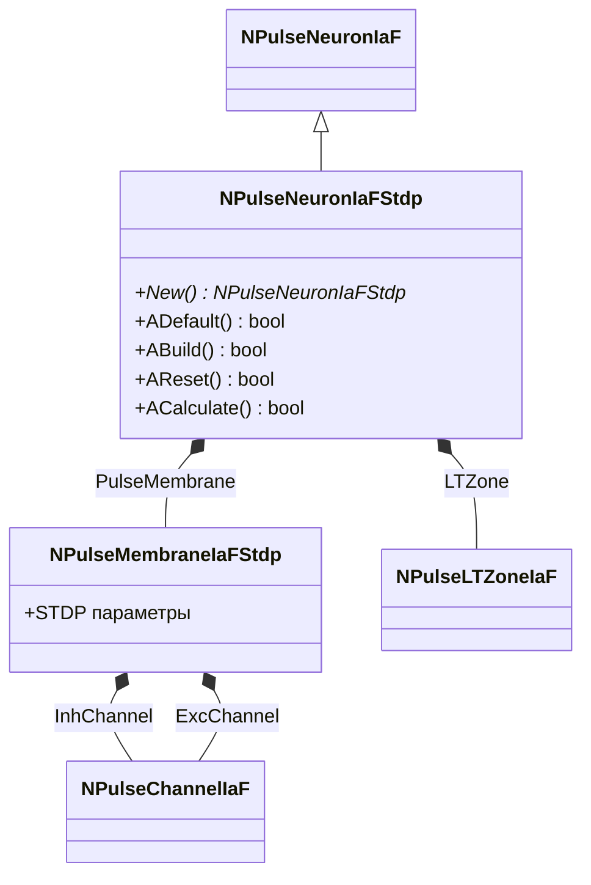
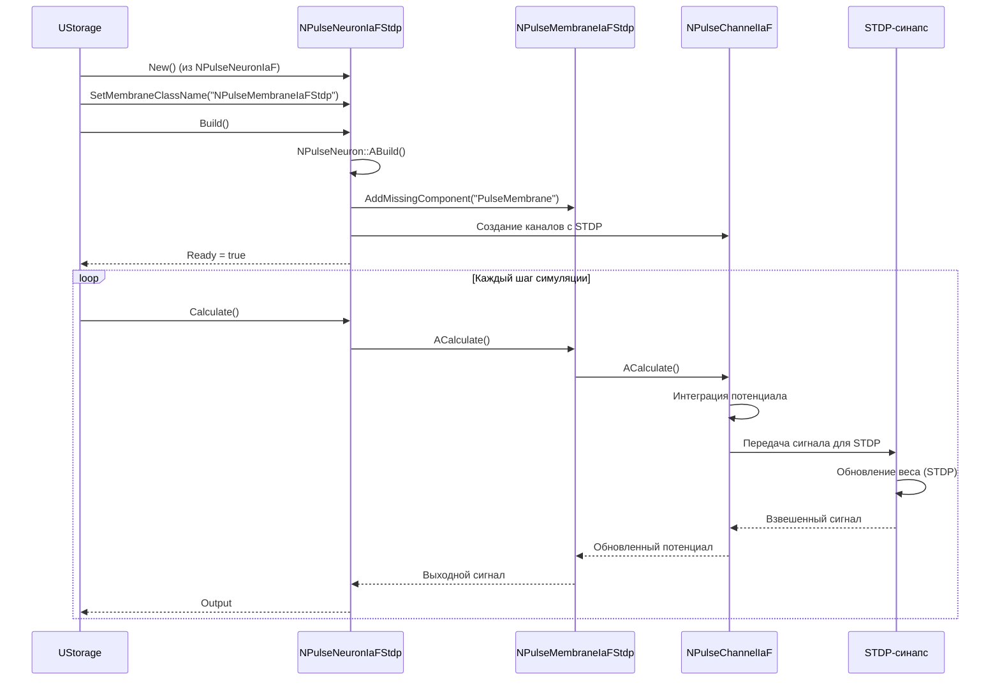
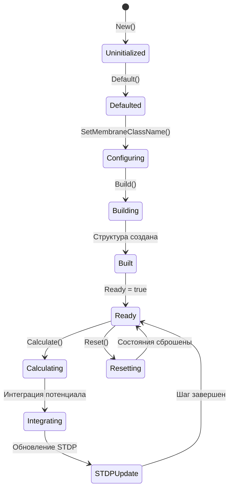
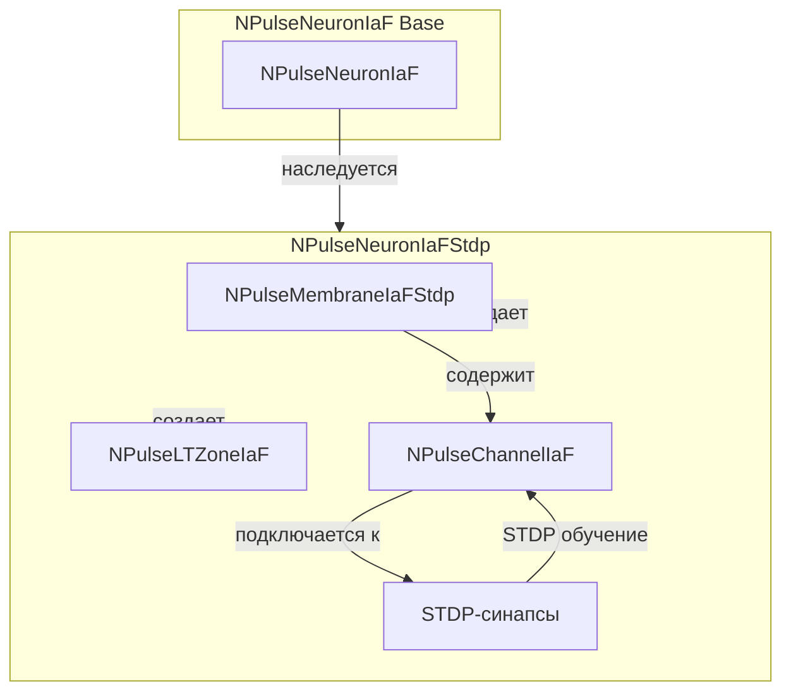
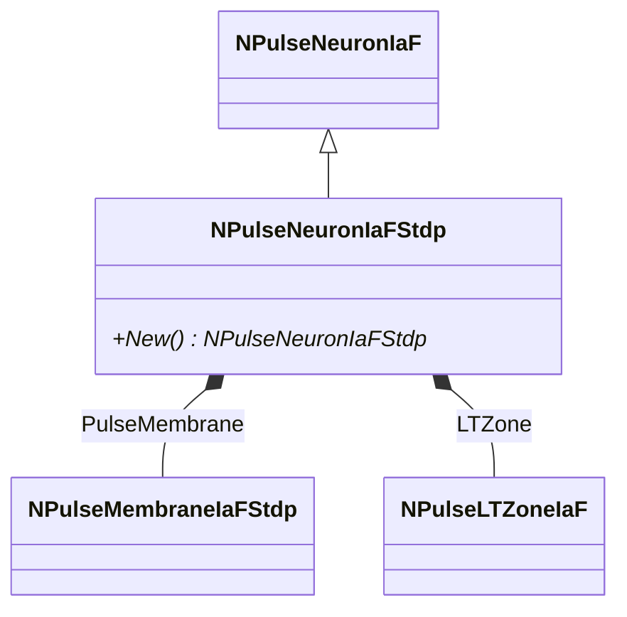
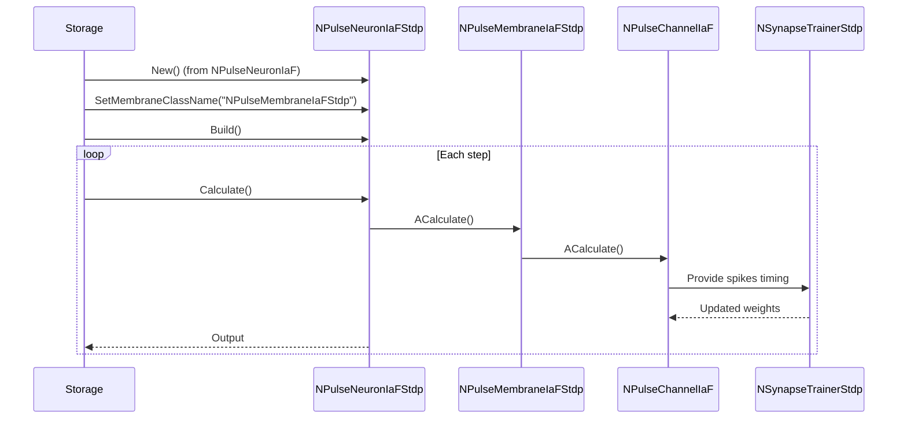
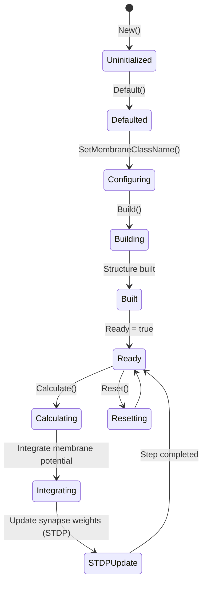
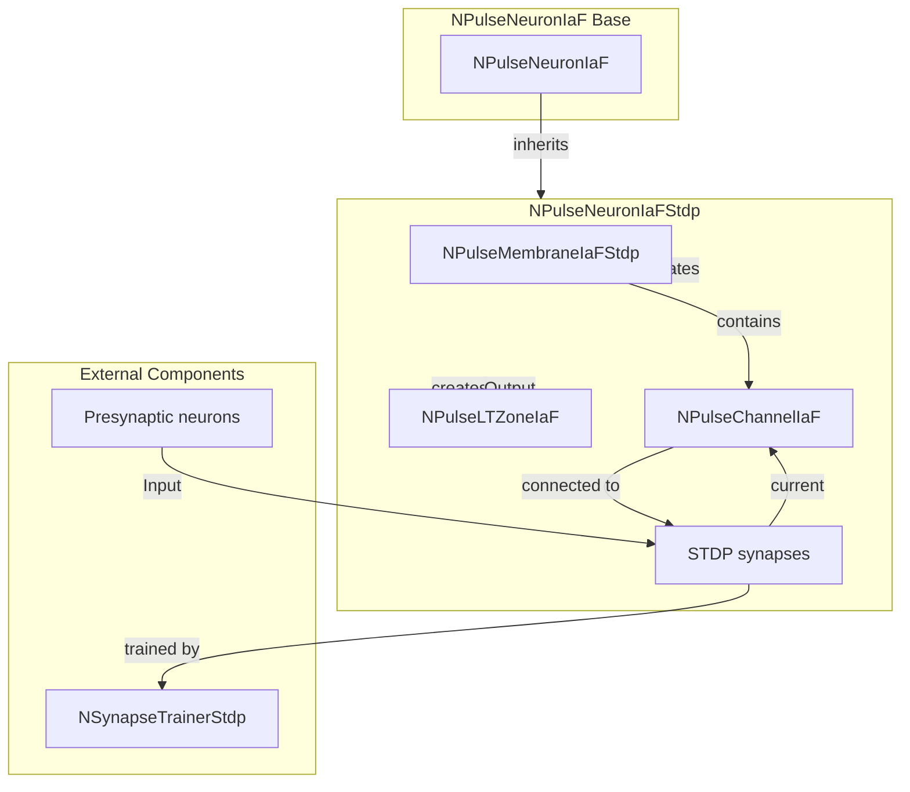

# NPulseNeuronIaFStdp — импульсный нейрон IaF с STDP

## RU

### Назначение

**Класс**: `NPulseNeuronIaFStdp` — импульсный нейрон модели Integrate-and-Fire с поддержкой STDP-обучения.  
**Аббревиатуры**: `IaF` — **I**ntegrate and **F**ire (интегрировать и стрелять); `STDP` — **S**pike-**T**iming **D**ependent **P**lasticity (пластичность, зависящая от времени спайков).  
**Регистрация**: `NPulseLibrary.cpp` → `UploadClass("NPulseNeuronIaFStdp", ...)`.  
**Storage-инстансы**: `ClassName = "NPulseNeuronIaFStdp"` в `Bin/Configs/*/Model_*.xml`.

`NPulseNeuronIaFStdp` является вариантом `NPulseNeuronIaF` с мембраной `NPulseMembraneIaFStdp`, которая поддерживает STDP-обучение. Создается из `NPulseNeuronIaF` путем замены мембраны на `NPulseMembraneIaFStdp`.

**Использование:** Эксперименты по STDP-обучению с нейронами модели IaF

### UML-диаграмма классов



**Иерархия наследования:**
- `NPulseNeuronIaF` — нейрон модели IaF
- `NPulseNeuronIaFStdp` — нейрон IaF с STDP

**Внутренняя структура:**
- **PulseMembrane** (`NPulseMembraneIaFStdp`) — мембрана с поддержкой STDP
- **LTZone** (`NPulseLTZoneIaF`) — LT-зона модели IaF

### UML-диаграмма последовательности



**Жизненный цикл:**
1. **Создание**: `NPulseNeuronIaFStdp` создается из `NPulseNeuronIaF` с заменой мембраны
2. **Настройка**: Устанавливается имя класса мембраны `NPulseMembraneIaFStdp`
3. **Сборка**: Автоматически создается структура нейрона с мембраной, поддерживающей STDP
4. **Расчет**: На каждом шаге выполняется интеграция потенциала и обновление весов синапсов по правилу STDP

### UML-диаграмма состояний



**Состояния:**
- **Uninitialized** — создан, но не инициализирован
- **Defaulted** — параметры установлены по умолчанию
- **Configuring** — настройка параметров (замена мембраны)
- **Building** — выполняется сборка структуры
- **Built** — структура нейрона построена
- **Ready** — готов к выполнению расчетов
- **Calculating** — выполняется расчет нейрона
- **Integrating** — интеграция мембранного потенциала
- **STDPUpdate** — обновление весов синапсов по правилу STDP
- **Resetting** — выполняется сброс состояний

### UML-диаграмма активности

```mermaid
flowchart TD
    Start([Start Calculate]) --> CallBase[NPulseNeuronCommon::ACalculate]
    CallBase --> CalcMembrane[Расчет мембраны]
    CalcMembrane --> CalcChannel[Расчет канала]
    CalcChannel --> IntegrateV[Интеграция V: dV/dt = (EL - V + I*Rm) / TauM]
    IntegrateV --> UpdateVm[Обновление Vm]
    UpdateVm --> CheckThreshold{V >= VThreshold?}
    CheckThreshold -->|Да| GenerateSpike[Генерация спайка]
    CheckThreshold -->|Нет| CalcSTDP[Расчет STDP]
    GenerateSpike --> ResetV[V = VReset]
    ResetV --> CalcSTDP
    CalcSTDP --> UpdateSynapseWeights[Обновление весов синапсов]
    UpdateSynapseWeights --> CalcLTZone[Расчет LT-зоны]
    CalcLTZone --> UpdateOutput[Обновление Output]
    UpdateOutput --> End([End])
```

**Алгоритм расчета:**
1. Интеграция мембранного потенциала (модель IaF)
2. Проверка порога и генерация спайка
3. Расчет STDP для всех синапсов
4. Обновление весов синапсов на основе временных интервалов спайков
5. Расчет LT-зоны и генерация выходного сигнала

### UML-диаграмма компонентов



**Зависимости:**
- **Базовый класс**: `NPulseNeuronIaF`
- **Внутренние компоненты**: `NPulseMembraneIaFStdp`, `NPulseLTZoneIaF`, `NPulseChannelIaF`
- **Внешние компоненты**: STDP-синапсы (`NSynapseStdp`, `NPulseSynapseStdp`)

### Свойства

`NPulseNeuronIaFStdp` не имеет собственных публичных свойств (UProperty). Все свойства наследуются от `NPulseNeuronIaF`. Отличие заключается в использовании мембраны `NPulseMembraneIaFStdp`, которая поддерживает STDP-обучение.

**Наследуемые свойства от NPulseNeuronIaF:**
- Все свойства базового класса `NPulseNeuronIaF`

**Особенности мембраны NPulseMembraneIaFStdp:**
- Поддержка STDP-обучения синапсов
- Интеграция с механизмом STDP для автоматического обновления весов

### Методы

#### Публичные методы

- **`New()`** → `NPulseNeuronIaFStdp*` — создает новый экземпляр класса. В реальности `NPulseNeuronIaFStdp` создается из `NPulseNeuronIaF` через замену мембраны.

**Наследуемые методы от NPulseNeuronIaF:**
- Все методы базового класса `NPulseNeuronIaF`

#### Защищенные методы жизненного цикла

- **`ADefault()`** → `bool` — инициализирует параметры по умолчанию. Вызывает `NPulseNeuronIaF::ADefault()`.

- **`ABuild()`** → `bool` — строит структуру нейрона. Вызывает `NPulseNeuron::ABuild()`, который создает структуру с мембраной `NPulseMembraneIaFStdp` и LT-зоной `NPulseLTZoneIaF`.

- **`AReset()`** → `bool` — сбрасывает состояния нейрона. Вызывает `NPulseNeuronIaF::AReset()`.

- **`ACalculate()`** → `bool` — выполняет расчет нейрона на одном шаге. Вызывает `NPulseNeuronIaF::ACalculate()`, который в свою очередь рассчитывает мембрану с поддержкой STDP.

### Примеры использования

#### Пример 1: Создание нейрона в коде C++

```cpp
// Создание нейрона IaF с STDP
auto neuron = storage->CreateComponent<NPulseNeuron>();
neuron->SetName("IaFStdpNeuron");

// Инициализация
neuron->Default();

// Настройка параметров для модели IaF с STDP
neuron->MembraneClassName = "NPulseMembraneIaFStdp";
neuron->LTZoneClassName = "NPulseLTZoneIaF";
neuron->ExcGeneratorClassName = "";
neuron->InhGeneratorClassName = "";
neuron->NumSomaMembraneParts = 1;

// Сборка
neuron->Build();

// Использование
for (int step = 0; step < 10000; step++) {
    neuron->Calculate();
    
    // Периодический вывод состояния
    if (step % 1000 == 0) {
        double output = neuron->Output(0, 0);
        std::cout << "Step " << step << ": Output = " << output << std::endl;
    }
}
```

#### Пример 2: Конфигурация XML

```xml
<Neuron1 Class="NPulseNeuronIaFStdp">
    <Parameters>
        <UseAverageDendritesPotential>1</UseAverageDendritesPotential>
        <UseAverageLTZonePotential>1</UseAverageLTZonePotential>
    </Parameters>
    <Components>
        <PulseMembrane Class="NPulseMembraneIaFStdp">
            <Parameters>
                <!-- Параметры мембраны с STDP -->
            </Parameters>
            <Components>
                <InhChannel Class="NPulseChannelIaF">
                    <Parameters>
                        <Cm>1.0</Cm>
                        <EL>-70.0</EL>
                        <TauM>20.0</TauM>
                        <VReset>-65.0</VReset>
                        <VThreshold>-55.0</VThreshold>
                    </Parameters>
                    <Components>
                        <Synapse1 Class="NSynapseStdp">
                            <Parameters>
                                <APlus>0.01</APlus>
                                <AMinus>0.012</AMinus>
                                <XTau>0.02</XTau>
                                <YTau>0.01</YTau>
                            </Parameters>
                        </Synapse1>
                    </Components>
                </InhChannel>
                <ExcChannel Class="NPulseChannelIaF">
                    <Parameters>
                        <Cm>1.0</Cm>
                        <EL>-70.0</EL>
                        <TauM>20.0</TauM>
                        <VReset>-65.0</VReset>
                        <VThreshold>-55.0</VThreshold>
                        <TRef>2.0</TRef>
                    </Parameters>
                    <Components>
                        <Synapse1 Class="NSynapseStdp">
                            <!-- Параметры синапса -->
                        </Synapse1>
                    </Components>
                </ExcChannel>
            </Components>
        </PulseMembrane>
        <LTZone Class="NPulseLTZoneIaF">
            <Parameters>
                <Threshold>-55.0</Threshold>
                <ThresholdOff>-65.0</ThresholdOff>
            </Parameters>
        </LTZone>
    </Components>
</Neuron1>
```

### Использование в конфигурациях

`NPulseNeuronIaFStdp` используется в экспериментах по STDP-обучению с нейронами модели IaF:

- Эксперименты по обучению нейросетей
- Исследования механизмов STDP
- Сравнение различных моделей нейронов с STDP

**Преимущества использования:**
- Простота модели IaF в сочетании с мощностью STDP-обучения
- Эффективное обучение синаптических весов
- Возможность моделирования различных сценариев обучения

### См. также

- [`NPulseNeuronIaF`](NPulseNeuronIaF.md) — нейрон модели IaF
- [`NPulseMembraneIaFStdp`](NPulseMembraneIaFStdp.md) — мембрана IaF с STDP
- [`NPulseLTZoneIaF`](NPulseLTZoneIaF.md) — LT-зона модели IaF
- [`NSynapseStdp`](NSynapseStdp.md) — синапс с STDP
- [`NPulseNeuronIzhikevich`](NPulseNeuronIzhikevich.md) — нейрон модели Ижикевича (для сравнения)
- [Architecture.md](../Architecture.md) — архитектура библиотеки
- [Scientific-Background.md](../Scientific-Background.md) — научный фон (STDP, модель IaF)

---

## EN

### Purpose

**Class**: `NPulseNeuronIaFStdp` — Integrate-and-Fire model spiking neuron with STDP learning support.  
**Registration**: `NPulseLibrary.cpp` → `UploadClass("NPulseNeuronIaFStdp", ...)`.  
**Instances**: `ClassName = "NPulseNeuronIaFStdp"` in `Bin/Configs/*/Model_*.xml`.

`NPulseNeuronIaFStdp` is a variant of `NPulseNeuronIaF` with `NPulseMembraneIaFStdp` membrane that supports STDP learning. Created from `NPulseNeuronIaF` by replacing the membrane with `NPulseMembraneIaFStdp`.

**Usage:** STDP learning experiments with IaF model neurons

### UML Class Diagram



### UML Sequence Diagram



### UML State Diagram



### UML Activity Diagram

```mermaid
flowchart TD
    Start([Start Calculate]) --> CallBase[Call NPulseNeuronIaF::ACalculate]
    CallBase --> CalcMembrane[Calculate NPulseMembraneIaFStdp]
    CalcMembrane --> CalcChannel[Calculate NPulseChannelIaF]
    CalcChannel --> IntegrateV[Integrate V (IaF)]
    IntegrateV --> CheckThreshold{V >= VThreshold?}
    CheckThreshold -->|Yes| GenerateSpike[Generate spike]
    CheckThreshold -->|No| CalcSTDP[Run STDP update]
    GenerateSpike --> ResetV[V = VReset]
    ResetV --> CalcSTDP
    CalcSTDP --> UpdateSynapses[Update synapse weights]
    UpdateSynapses --> CalcLTZone[Calculate LT-zone]
    CalcLTZone --> UpdateOutput[Update Output]
    UpdateOutput --> End([End])
```

### UML Component Diagram



### See Also

- [`NPulseNeuronIaF`](NPulseNeuronIaF.md) — IaF model neuron
- [`NPulseMembraneIaFStdp`](NPulseMembraneIaFStdp.md) — IaF membrane with STDP
- [`NPulseLTZoneIaF`](NPulseLTZoneIaF.md) — IaF LT-zone
- [`NSynapseStdp`](NSynapseStdp.md) — STDP synapse
- [Architecture.md](../Architecture.md) — library architecture
- [Scientific-Background.md](../Scientific-Background.md) — scientific background (STDP, IaF model)

