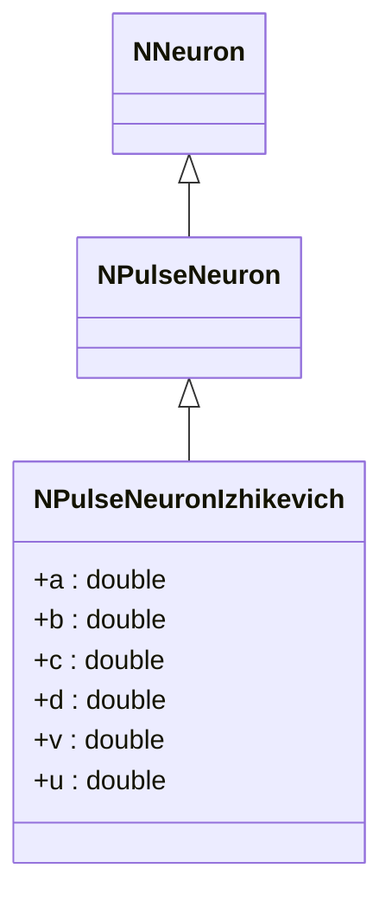
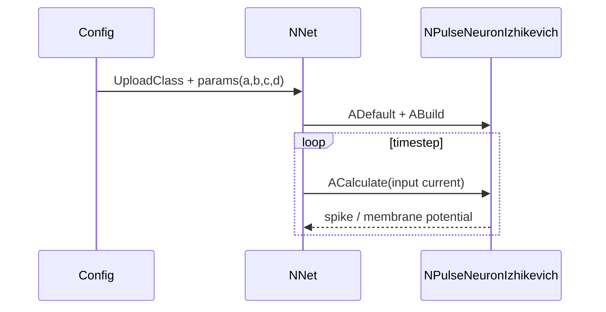
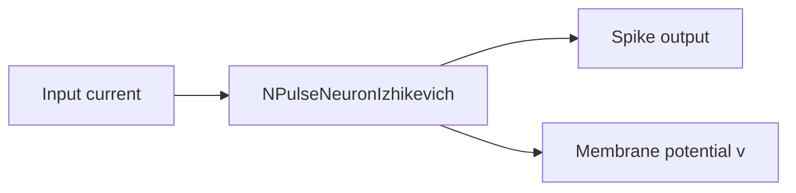

## NPulseNeuronIzhikevich — импульсный нейрон (модель Ижикевича)

**Класс**: `NPulseNeuronIzhikevich` — модель спайкового нейрона по Ижикевичу.  
**Регистрация**: `NPulseLibrary.cpp` → `UploadClass("NPulseNeuronIzhikevich", ...)`.  
**Storage-инстансы**: `ClassName = "NPulseNeuronIzhikevich"` в ClDesc/Configs, параметры: a, b, c, d, timestep, входные токи.

### Жизненный цикл
- **ADefault**: задаёт параметры модели (a,b,c,d), сбрасывает v,u.
- **ABuild**: связывает входные токи/каналы.
- **ACalculate**: интегрирует уравнения Ижикевича, генерирует спайк при пороге.

### Входы/выходы (UProperty)
- Вход: ток/сигнал (double), опционально состояния каналов.
- Выход: спайк (bool/int) и обновлённый потенциал.

Пояснение: диаграмма последовательности показывает типовой сценарий взаимодействия и порядок вызовов.

Пояснение: блок-схема показывает поток данных/сигналов (входы → компонент → выходы).

---

## NPulseNeuronIzhikevich — spike neuron (Izhikevich model)

Spike neuron with parameters a,b,c,d; integrates membrane equations and emits spikes. Inputs: current; outputs: spike flag and membrane state.
