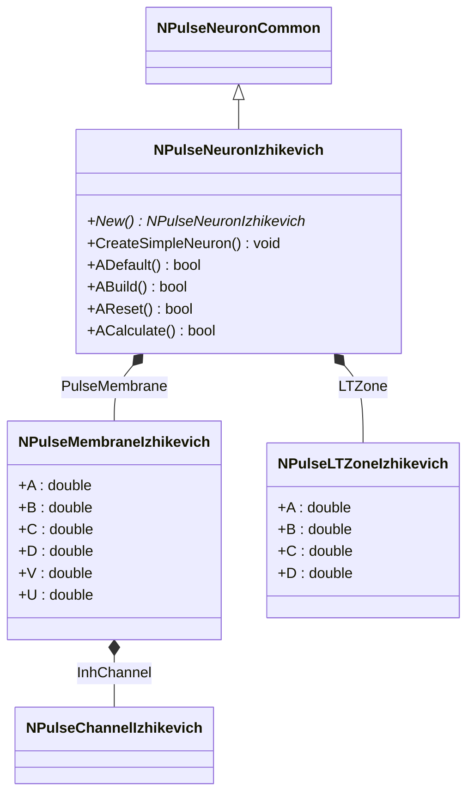
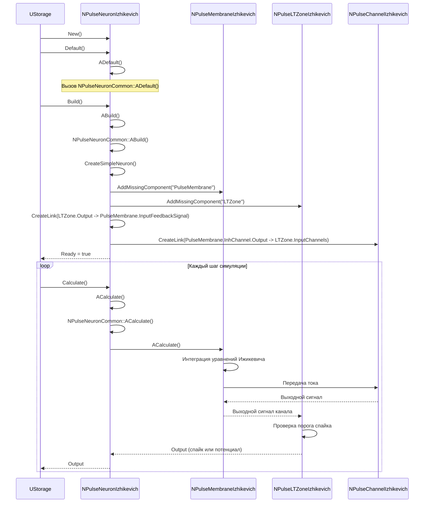
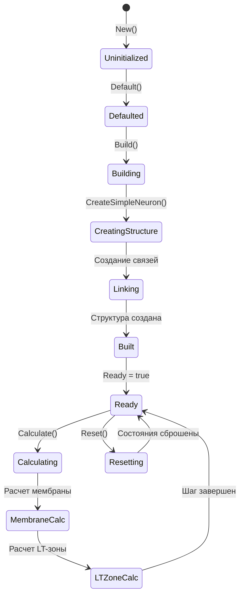
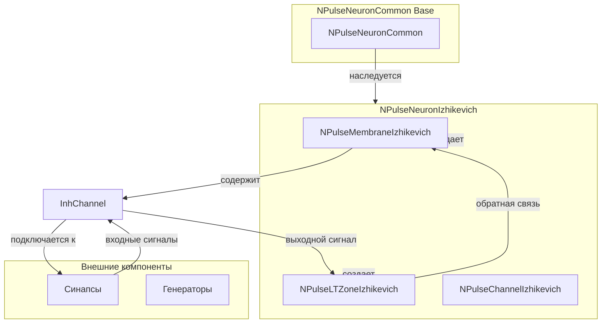
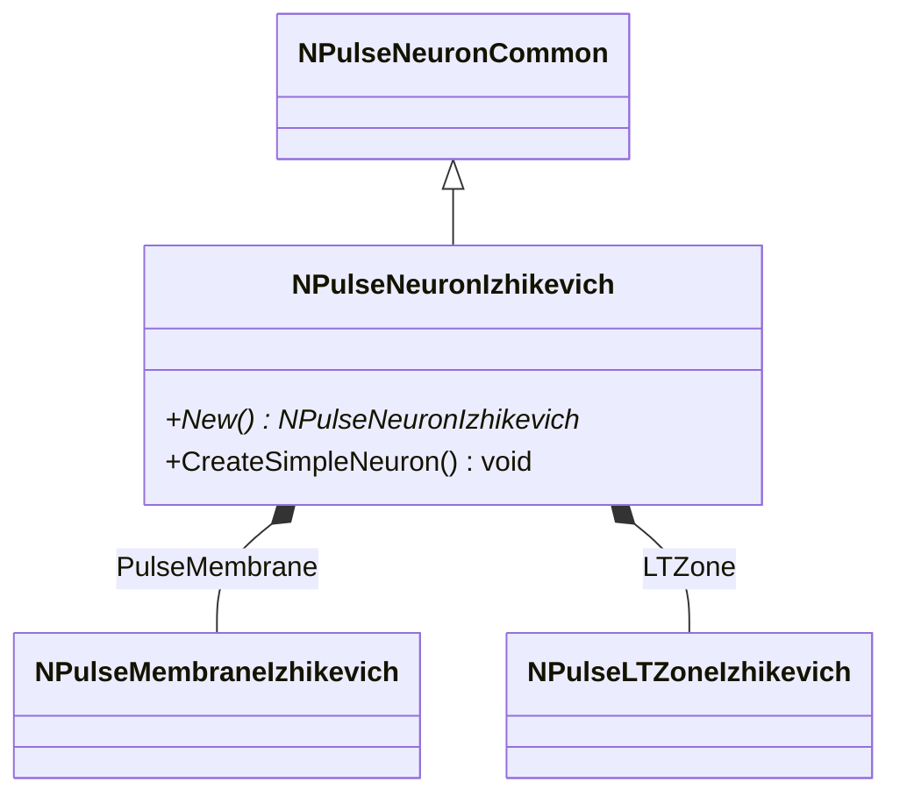
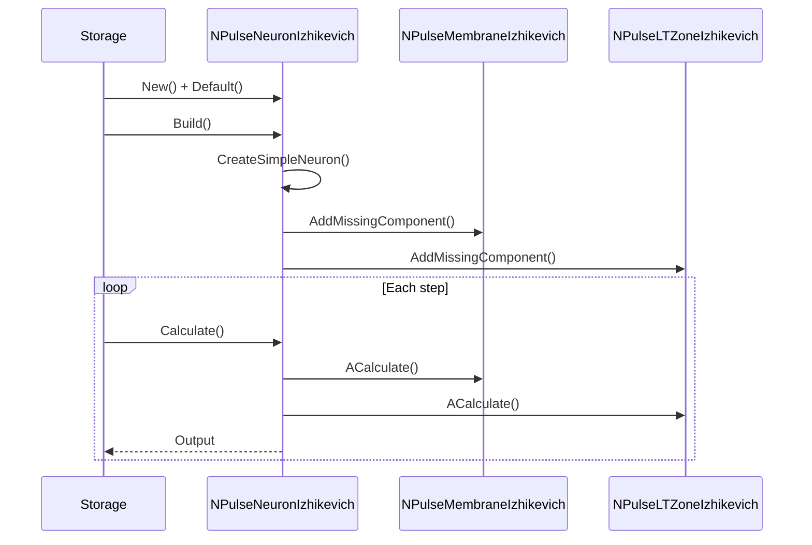
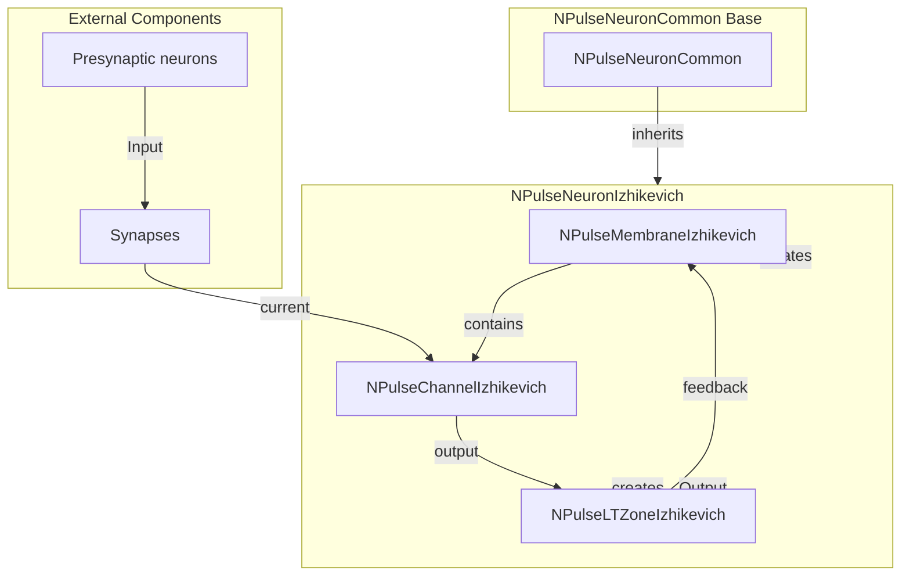

# NPulseNeuronIzhikevich — импульсный нейрон (модель Ижикевича)

## RU

### Назначение

**Класс**: `NPulseNeuronIzhikevich` — модель спайкового нейрона по Ижикевичу.  
**Регистрация**: `NPulseLibrary.cpp` → `UploadClass("NPulseNeuronIzhikevich", ...)`.  
**Storage-инстансы**: `ClassName = "NPulseNeuronIzhikevich"` в `Bin/Configs/*/Model_*.xml`.

`NPulseNeuronIzhikevich` реализует модель нейрона Ижикевича — одну из наиболее популярных моделей для имитации различных типов нейронов. Автоматически создает внутреннюю структуру с мембраной Ижикевича (`NPulseMembraneIzhikevich`) и LT-зоной Ижикевича (`NPulseLTZoneIzhikevich`). Параметры модели (a, b, c, d) хранятся в мембране и LT-зоне.

**Использование:** `Bin/Configs/!OldConfigs/OldExperiments/IzhikevichTest/`, `Bin/Configs/User/CognitiveNavigation/`

### UML-диаграмма классов



**Иерархия наследования:**
- `NPulseNeuronCommon` — общий импульсный нейрон
- `NPulseNeuronIzhikevich` — нейрон модели Ижикевича

**Внутренняя структура:**
- **PulseMembrane** (`NPulseMembraneIzhikevich`) — мембрана с параметрами модели Ижикевича (A, B, C, D, V, U)
- **LTZone** (`NPulseLTZoneIzhikevich`) — LT-зона с параметрами модели Ижикевича (A, B, C, D)

**Параметры модели Ижикевича:**
- **A** (double) — параметр восстановления мембраны (обычно 0.02)
- **B** (double) — чувствительность переменной восстановления (обычно 0.2)
- **C** (double) — значение потенциала после спайка (обычно -65.0)
- **D** (double) — приращение переменной восстановления после спайка (обычно 8.0)
- **V** (double) — мембранный потенциал
- **U** (double) — переменная восстановления

### UML-диаграмма последовательности



**Жизненный цикл:**
1. **Инициализация**: Вызов `ADefault()` для установки параметров по умолчанию
2. **Сборка**: Вызов `ABuild()` автоматически создает структуру нейрона через `CreateSimpleNeuron()`
3. **Создание структуры**: Добавляются мембрана и LT-зона, создаются связи между ними
4. **Расчет**: На каждом шаге рассчитываются мембрана и LT-зона, генерируется выходной сигнал

### UML-диаграмма состояний



**Состояния:**
- **Uninitialized** — создан, но не инициализирован
- **Defaulted** — параметры установлены по умолчанию
- **Building** — выполняется сборка структуры
- **CreatingStructure** — создание мембраны и LT-зоны
- **Linking** — создание связей между компонентами
- **Built** — структура нейрона построена
- **Ready** — готов к выполнению расчетов
- **Calculating** — выполняется расчет нейрона
- **MembraneCalc** — расчет мембраны (интеграция уравнений Ижикевича)
- **LTZoneCalc** — расчет LT-зоны (проверка порога спайка)
- **Resetting** — выполняется сброс состояний

### UML-диаграмма активности

```mermaid
flowchart TD
    Start([Start Calculate]) --> CallBase[NPulseNeuronCommon::ACalculate]
    CallBase --> CalcMembrane[Расчет мембраны]
    CalcMembrane --> IntegrateV[Интеграция V: dv/dt = 0.04v² + 5v + 140 - u + I]
    IntegrateV --> IntegrateU[Интеграция U: du/dt = a(bv - u)]
    IntegrateU --> CheckThreshold{V >= 30?}
    CheckThreshold -->|Да| Spike[Генерация спайка]
    CheckThreshold -->|Нет| NoSpike[Без спайка]
    Spike --> ResetV[V = c]
    ResetV --> ResetU[U = u + d]
    ResetU --> CalcLTZone[Расчет LT-зоны]
    NoSpike --> CalcLTZone
    CalcLTZone --> CheckLTThreshold{Порог LT-зоны?}
    CheckLTThreshold -->|Да| GenerateOutput[Генерация выходного сигнала]
    CheckLTThreshold -->|Нет| GenerateOutput
    GenerateOutput --> End([End])
```

**Алгоритм расчета (модель Ижикевича):**
1. Интеграция мембранного потенциала: `dv/dt = 0.04v² + 5v + 140 - u + I`
2. Интеграция переменной восстановления: `du/dt = a(bv - u)`
3. Проверка порога спайка: если `v >= 30`, генерируется спайк
4. При спайке: `v = c`, `u = u + d`
5. Расчет LT-зоны на основе выходного сигнала мембраны
6. Генерация выходного сигнала нейрона

### UML-диаграмма компонентов



**Зависимости:**
- **Базовый класс**: `NPulseNeuronCommon`
- **Внутренние компоненты**: `NPulseMembraneIzhikevich`, `NPulseLTZoneIzhikevich`, `NPulseChannelIzhikevich`
- **Внешние компоненты**: синапсы (`NSynapseStdp`, `NPulseSynapse`), генераторы (`NPulseGenerator`)

### Свойства

`NPulseNeuronIzhikevich` не имеет собственных публичных свойств (UProperty). Все свойства наследуются от `NPulseNeuronCommon`. Параметры модели Ижикевича (A, B, C, D, V, U) хранятся в мембране (`NPulseMembraneIzhikevich`).

**Наследуемые свойства от NPulseNeuronCommon:**
- `UseAverageDendritesPotential` (bool) — использовать усреднение потенциалов дендритов
- `UseAverageLTZonePotential` (bool) — использовать усреднение потенциалов LT-зоны
- `Output` (MDMatrix<double>) — выходной сигнал нейрона
- `ActiveOutputs`, `ActivePosInputs`, `ActiveNegInputs` (MDMatrix<double>) — активность входов/выходов
- `DendriticSumPotential`, `SomaSumPotential` (MDMatrix<double>) — потенциалы дендритов и сомы

**Параметры модели Ижикевича (в мембране):**
- **A** (double) — параметр восстановления мембраны (по умолчанию: 0.02)
- **B** (double) — чувствительность переменной восстановления (по умолчанию: 0.2)
- **C** (double) — значение потенциала после спайка (по умолчанию: -65.0)
- **D** (double) — приращение переменной восстановления после спайка (по умолчанию: 8.0)
- **V** (double) — мембранный потенциал (начальное значение: -65.0)
- **U** (double) — переменная восстановления (начальное значение: 0.0)

### Методы

#### Публичные методы

- **`New()`** → `NPulseNeuronIzhikevich*` — создает новый экземпляр класса.

- **`CreateSimpleNeuron()`** → `void` — создает структуру простого нейрона. Автоматически добавляет мембрану Ижикевича (`NPulseMembraneIzhikevich`) и LT-зону Ижикевича (`NPulseLTZoneIzhikevich`), создает связи между ними:
  - `LTZone.Output` → `PulseMembrane.InputFeedbackSignal` (обратная связь)
  - `PulseMembrane.InhChannel.Output` → `LTZone.InputChannels` (входной сигнал для LT-зоны)

#### Защищенные методы жизненного цикла

- **`ADefault()`** → `bool` — инициализирует параметры по умолчанию. Вызывает `NPulseNeuronCommon::ADefault()`.

- **`ABuild()`** → `bool` — строит структуру нейрона. Вызывает `NPulseNeuronCommon::ABuild()` и затем `CreateSimpleNeuron()` для автоматического создания внутренней структуры.

- **`AReset()`** → `bool` — сбрасывает состояния нейрона. Вызывает `NPulseNeuronCommon::AReset()`.

- **`ACalculate()`** → `bool` — выполняет расчет нейрона на одном шаге. Вызывает `NPulseNeuronCommon::ACalculate()`, который в свою очередь рассчитывает мембрану и LT-зону.

### Примеры использования

#### Пример 1: Создание нейрона в коде C++

```cpp
// Создание нейрона
auto neuron = storage->CreateComponent<NPulseNeuronIzhikevich>();
neuron->SetName("IzhikevichNeuron");

// Инициализация
neuron->Default();

// Сборка (автоматически создает мембрану и LT-зону)
neuron->Build();

// Получение мембраны для настройки параметров
auto membrane = dynamic_cast<NPulseMembraneIzhikevich*>(
    neuron->GetComponent("PulseMembrane")
);

if (membrane) {
    // Настройка параметров модели Ижикевича
    membrane->A = 0.02;  // Быстрое восстановление
    membrane->B = 0.2;   // Стандартная чувствительность
    membrane->C = -65.0; // Потенциал после спайка
    membrane->D = 8.0;   // Приращение восстановления
    membrane->V = -65.0; // Начальный потенциал
    membrane->U = 0.0;   // Начальная переменная восстановления
}

// Использование
for (int step = 0; step < 1000; step++) {
    neuron->Calculate();
    double output = neuron->Output(0, 0);
    std::cout << "Step " << step << ": Output = " << output << std::endl;
}
```

#### Пример 2: Конфигурация XML

```xml
<Neuron1 Class="NPulseNeuronIzhikevich">
    <Parameters>
        <UseAverageDendritesPotential>1</UseAverageDendritesPotential>
        <UseAverageLTZonePotential>1</UseAverageLTZonePotential>
    </Parameters>
    <Components>
        <!-- Мембрана и LT-зона создаются автоматически при Build() -->
        <!-- Но можно также указать их явно для настройки параметров -->
        <PulseMembrane Class="NPulseMembraneIzhikevich">
            <Parameters>
                <A>0.02</A>
                <B>0.2</B>
                <C>-65.0</C>
                <D>8.0</D>
                <V>-65.0</V>
                <U>0.0</U>
            </Parameters>
            <Components>
                <InhChannel Class="NPulseChannelIzhikevich">
                    <!-- Параметры канала (Type=1, тормозной) -->
                </InhChannel>
            </Components>
        </PulseMembrane>
        <LTZone Class="NPulseLTZoneIzhikevich">
            <Parameters>
                <A>0.02</A>
                <B>0.2</B>
                <C>-65.0</C>
                <D>8.0</D>
                <Threshold>30.0</Threshold>
            </Parameters>
        </LTZone>
    </Components>
    <!-- Связи создаются автоматически при Build() -->
</Neuron1>
```

### Использование в конфигурациях

`NPulseNeuronIzhikevich` широко используется в конфигурационных проектах:

- **Тесты модели Ижикевича**: `Bin/Configs/!OldConfigs/OldExperiments/IzhikevichTest/`
- **Когнитивная навигация**: `Bin/Configs/User/CognitiveNavigation/*/Model_*.xml`
- **Эксперименты с нейронами**: `Bin/Configs/!OldConfigs/NM-Neurons/*/Model.xml`

**Типичные значения параметров для разных типов нейронов:**

1. **Регулярно спайкующий (RS)**: A=0.02, B=0.2, C=-65, D=8
2. **Интегрирующий и спайкующий (IB)**: A=0.02, B=0.2, C=-55, D=4
3. **Хаотический спайкующий (CH)**: A=0.02, B=0.2, C=-50, D=2
4. **Быстро спайкующий (FS)**: A=0.1, B=0.2, C=-65, D=2

### См. также

- [`NPulseNeuronCommon`](NPulseNeuronCommon.md) — общий импульсный нейрон
- [`NPulseMembraneIzhikevich`](NPulseMembraneIzhikevich.md) — мембрана модели Ижикевича
- [`NPulseLTZoneIzhikevich`](NPulseLTZoneIzhikevich.md) — LT-зона модели Ижикевича
- [`NPulseChannelIzhikevich`](NPulseChannelIzhikevich.md) — канал модели Ижикевича
- [Architecture.md](../Architecture.md) — архитектура библиотеки
- [Scientific-Background.md](../Scientific-Background.md) — научный фон (модель Ижикевича)

---

## EN

### Purpose

**Class**: `NPulseNeuronIzhikevich` — Izhikevich model spiking neuron.  
**Registration**: `NPulseLibrary.cpp` → `UploadClass("NPulseNeuronIzhikevich", ...)`.  
**Instances**: `ClassName = "NPulseNeuronIzhikevich"` in `Bin/Configs/*/Model_*.xml`.

`NPulseNeuronIzhikevich` implements the Izhikevich neuron model — one of the most popular models for simulating various neuron types. Automatically creates internal structure with Izhikevich membrane (`NPulseMembraneIzhikevich`) and Izhikevich LT-zone (`NPulseLTZoneIzhikevich`). Model parameters (a, b, c, d) are stored in the membrane and LT-zone.

**Usage:** `Bin/Configs/!OldConfigs/OldExperiments/IzhikevichTest/`, `Bin/Configs/User/CognitiveNavigation/`

### UML Class Diagram



### UML Sequence Diagram



### UML State Diagram

```mermaid
stateDiagram-v2
    [*] --> Uninitialized: New()
    Uninitialized --> Defaulted: Default()
    Defaulted --> Building: Build()
    Building --> CreatingStructure: CreateSimpleNeuron()
    CreatingStructure --> Linking: Create links
    Linking --> Built: Structure built
    Built --> Ready: Ready = true
    Ready --> Calculating: Calculate()
    Calculating --> MembraneCalc: Calculate membrane
    MembraneCalc --> IntegrateV[Integrate V]
    IntegrateV --> IntegrateU[Integrate U]
    IntegrateU --> CheckThreshold{V >= 30?}
    CheckThreshold -->|Yes| Spike: Generate spike
    CheckThreshold -->|No| LTZoneCalc: Calculate LT-zone
    Spike --> ResetVU[Reset V, U]
    ResetVU --> LTZoneCalc
    LTZoneCalc --> Ready: Step completed
    Ready --> Resetting: Reset()
    Resetting --> Ready
```

### UML Activity Diagram

```mermaid
flowchart TD
    Start([Start Calculate]) --> CallBase[Call base ACalculate]
    CallBase --> CalcMembrane[Calculate membrane]
    CalcMembrane --> IntegrateV[Integrate V: dv/dt = 0.04v² + 5v + 140 - u + I]
    IntegrateV --> IntegrateU[Integrate U: du/dt = a(bv - u)]
    IntegrateU --> CheckThreshold{V >= 30?}
    CheckThreshold -->|Yes| Spike[Generate spike]
    CheckThreshold -->|No| CalcLTZone[Calculate LT-zone]
    Spike --> ResetV[V = c]
    ResetV --> ResetU[U = u + d]
    ResetU --> CalcLTZone
    CalcLTZone --> End([End])
```

### UML Component Diagram



### See Also

- [`NPulseNeuronCommon`](NPulseNeuronCommon.md) — common spiking neuron
- [`NPulseMembraneIzhikevich`](NPulseMembraneIzhikevich.md) — Izhikevich membrane
- [`NPulseLTZoneIzhikevich`](NPulseLTZoneIzhikevich.md) — Izhikevich LT-zone
- [Architecture.md](../Architecture.md) — library architecture
- [Scientific-Background.md](../Scientific-Background.md) — scientific background (Izhikevich model)

