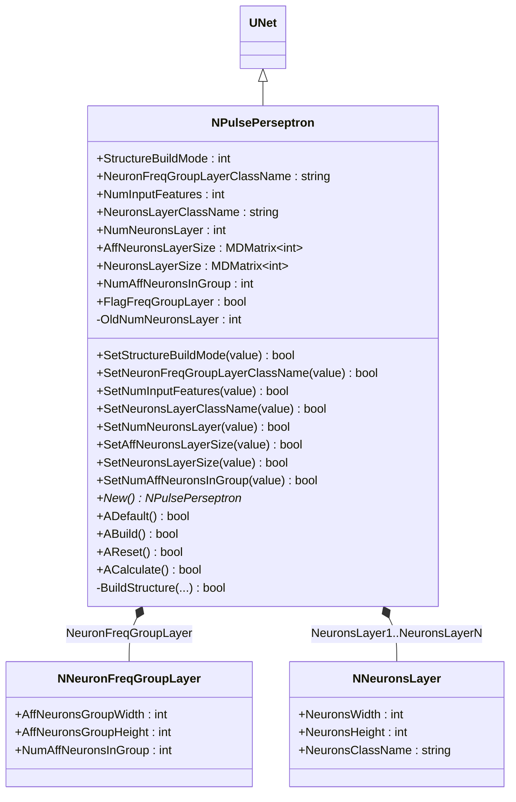
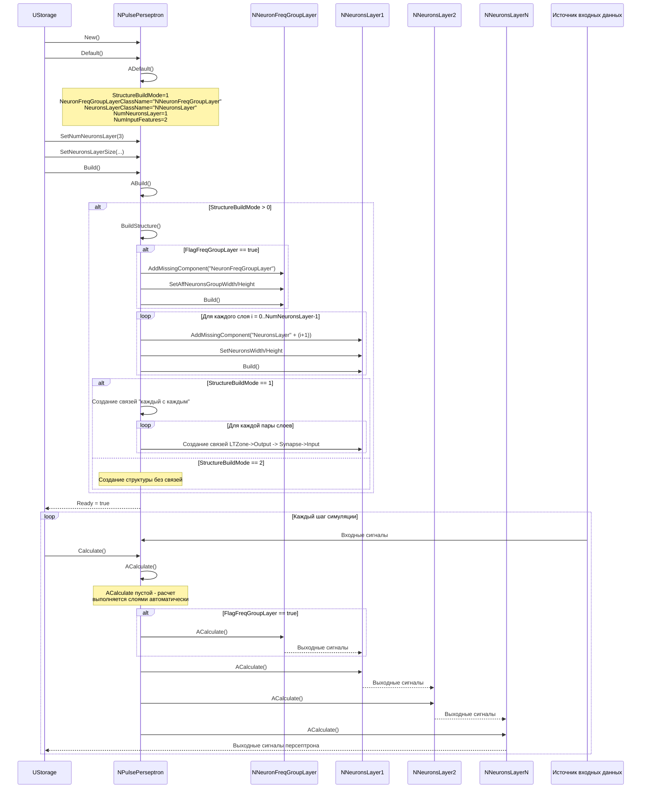
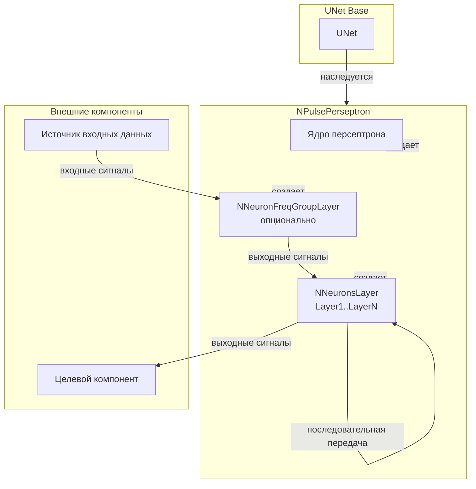
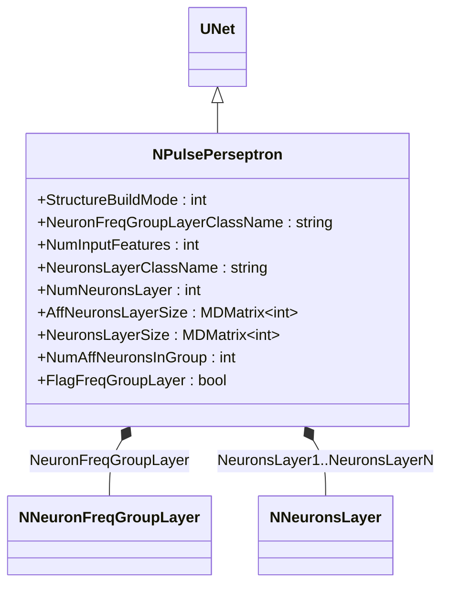
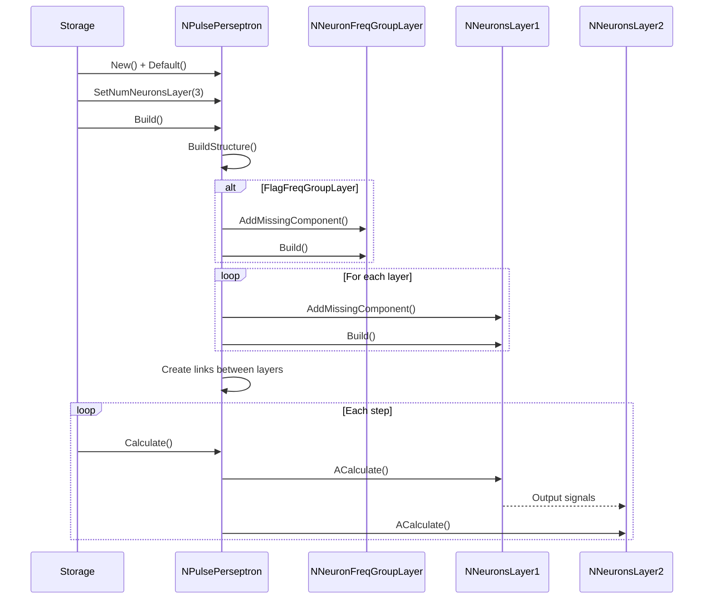
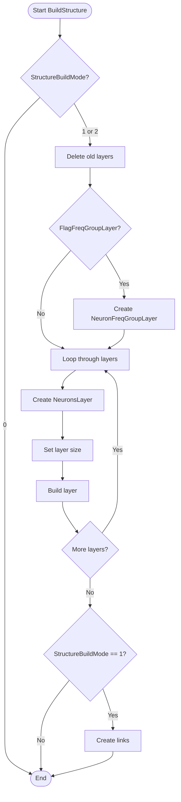
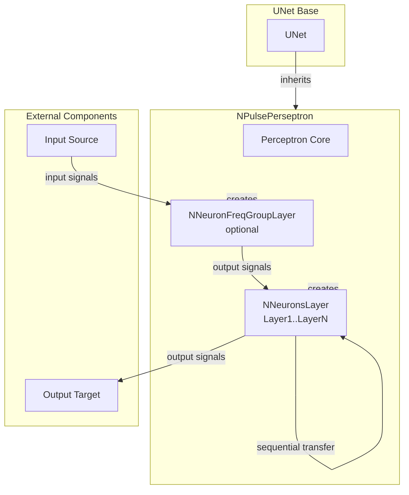

# NPulsePerseptron — импульсный персептрон

## RU

### Назначение

**Класс**: `NPulsePerseptron` — компонент для создания многослойного импульсного персептрона с автоматическим построением структуры.  
**Регистрация**: `NPulseLibrary.cpp` → `UploadClass("NPulsePerseptron", ...)`.  
**Storage-инстансы**: `ClassName = "NPulsePerseptron"` в `Bin/Configs/*/Model_*.xml`.

`NPulsePerseptron` реализует импульсный персептрон — многослойную нейронную сеть, которая автоматически создает структуру из слоев нейронов (`NNeuronsLayer`) и опционально слоя частотных групп (`NNeuronFreqGroupLayer`). Компонент автоматически создает связи между слоями согласно выбранному режиму сборки (`StructureBuildMode`).

**Использование:** Создание многослойных импульсных нейронных сетей, классификация паттернов, распознавание образов

### UML-диаграмма классов



**Иерархия наследования:**
- `UNet` — базовая сеть Rdk Framework
- `NPulsePerseptron` — импульсный персептрон

**Внутренняя структура:**
- **NeuronFreqGroupLayer** (`NNeuronFreqGroupLayer`) — опциональный слой частотных групп афферентных нейронов (создается если `FlagFreqGroupLayer = true`)
- **NeuronsLayer1..NeuronsLayerN** (`NNeuronsLayer`) — слои нейронов персептрона (количество определяется `NumNeuronsLayer`)

### UML-диаграмма последовательности



**Жизненный цикл:**
1. **Инициализация**: Установка параметров по умолчанию (StructureBuildMode=1, NeuronsLayerClassName="NNeuronsLayer", NumNeuronsLayer=1)
2. **Сборка структуры**: Вызов `BuildStructure()` для автоматического создания слоев нейронов и связей между ними
3. **Создание слоев**: Создание `NNeuronsLayer` для каждого слоя, опционально создание `NNeuronFreqGroupLayer`
4. **Создание связей**: Автоматическое создание связей между слоями согласно `StructureBuildMode`
5. **Расчет**: На каждом шаге слои рассчитываются последовательно, сигналы передаются между слоями

### UML-диаграмма состояний

```mermaid
stateDiagram-v2
    [*] --> Uninitialized: New()
    Uninitialized --> Defaulted: Default()
    Defaulted --> Building: Build()
    Building --> CheckMode{StructureBuildMode > 0?}
    CheckMode -->|Нет| Built: Структура не пересобирается
    CheckMode -->|Да| BuildStructure: BuildStructure()
    BuildStructure --> CheckFreqGroup{FlagFreqGroupLayer?}
    CheckFreqGroup -->|Да| CreateFreqGroup: Создание NeuronFreqGroupLayer
    CheckFreqGroup -->|Нет| CreateNeuronsLayers
    CreateFreqGroup --> CreateNeuronsLayers: Создание слоев нейронов
    CreateNeuronsLayers --> LoopLayers: Цикл по слоям i = 0..NumNeuronsLayer-1
    LoopLayers --> CreateLayer: Создание NeuronsLayer(i+1)
    CreateLayer --> SetLayerSize: SetNeuronsWidth/Height
    SetLayerSize --> BuildLayer: Build() слоя
    BuildLayer --> CheckMoreLayers: Есть еще слои?
    CheckMoreLayers -->|Да| LoopLayers
    CheckMoreLayers -->|Нет| CheckBuildMode{StructureBuildMode?}
    CheckBuildMode -->|1| CreateLinks: Создание связей "каждый с каждым"
    CheckBuildMode -->|2| Built: Структура без связей
    CreateLinks --> LinkLayers: Связывание слоев
    LinkLayers --> Built: Структура создана
    Built --> Ready: Ready = true
    Ready --> Calculating: Calculate()
    Calculating --> Ready: Шаг завершен (ACalculate пустой)
    Ready --> Resetting: Reset()
    Resetting --> Ready: Состояния сброшены
```

**Состояния:**
- **Uninitialized** — создан, но не инициализирован
- **Defaulted** — параметры установлены по умолчанию
- **Building** — выполняется сборка структуры
- **CheckMode** — проверка необходимости пересборки структуры
- **BuildStructure** — выполнение пересборки структуры
- **CheckFreqGroup** — проверка необходимости создания частотного слоя
- **CreateFreqGroup** — создание слоя частотных групп
- **CreateNeuronsLayers** — создание слоев нейронов
- **LoopLayers** — цикл по слоям
- **CreateLayer** — создание слоя нейронов
- **SetLayerSize** — установка размера слоя
- **BuildLayer** — сборка слоя
- **CheckMoreLayers** — проверка наличия еще слоев
- **CheckBuildMode** — проверка режима сборки
- **CreateLinks** — создание связей между слоями
- **LinkLayers** — связывание слоев
- **Built** — структура персептрона построена
- **Ready** — готов к выполнению расчетов
- **Calculating** — выполняется расчет персептрона
- **Resetting** — выполняется сброс состояний

### UML-диаграмма активности

```mermaid
flowchart TD
    Start([Start BuildStructure]) --> CheckMode{StructureBuildMode?}
    CheckMode -->|0| End([End - нет пересборки])
    CheckMode -->|1 или 2| DeleteOld[Удаление старых слоев]
    DeleteOld --> CheckFreqGroup{FlagFreqGroupLayer?}
    CheckFreqGroup -->|Да| CreateFreqGroup[Создание NeuronFreqGroupLayer]
    CheckFreqGroup -->|Нет| LoopLayers
    CreateFreqGroup --> SetFreqGroupSize[Установка AffNeuronsGroupWidth/Height]
    SetFreqGroupSize --> BuildFreqGroup[Build() NeuronFreqGroupLayer]
    BuildFreqGroup --> LoopLayers[Цикл по слоям i = 0..NumNeuronsLayer-1]
    LoopLayers --> CreateLayer[Создание NeuronsLayer(i+1)]
    CreateLayer --> SetCoord[SetCoord(8.7, 1.67+(i+1)*2, 0)]
    SetCoord --> SetLayerSize[SetNeuronsWidth/Height из NeuronsLayerSize]
    SetLayerSize --> BuildLayer[Build() NeuronsLayer]
    BuildLayer --> CheckMoreLayers{Есть еще слои?}
    CheckMoreLayers -->|Да| LoopLayers
    CheckMoreLayers -->|Нет| CheckMode2{StructureBuildMode == 1?}
    CheckMode2 -->|Да| CreateLinks[Создание связей между слоями]
    CheckMode2 -->|Нет| End
    CreateLinks --> LinkFreqToLayer1{FlagFreqGroupLayer?}
    LinkFreqToLayer1 -->|Да| LinkFreqGroup[Связи FreqGroup -> Layer1]
    LinkFreqToLayer1 -->|Нет| LinkLayers
    LinkFreqGroup --> LinkLayers[Связи Layer(i) -> Layer(i+1)]
    LinkLayers --> End
```

**Алгоритм сборки структуры:**
1. Проверка режима сборки (`StructureBuildMode`)
2. Удаление старых слоев (если `NumNeuronsLayer` уменьшилось)
3. Создание слоя частотных групп (если `FlagFreqGroupLayer = true`)
4. Создание слоев нейронов для каждого слоя персептрона
5. Создание связей между слоями (если `StructureBuildMode = 1`):
   - Связи от `NeuronFreqGroupLayer` к первому слою нейронов
   - Связи между соседними слоями нейронов (каждый с каждым)

### UML-диаграмма компонентов



**Зависимости:**
- **Базовый класс**: `UNet`
- **Внутренние компоненты**: `NNeuronFreqGroupLayer` (опционально), `NNeuronsLayer` (один или несколько слоев)
- **Внешние компоненты**: источник входных данных (для первого слоя), целевой компонент (получатель выходных сигналов последнего слоя)

### Свойства

#### Параметры (ptPubParameter)

- **`StructureBuildMode`** (int) — режим сборки структуры:
  - 0 — не пересобирать структуру
  - 1 — автоматическая сборка с созданием связей "каждый с каждым"
  - 2 — автоматическая сборка без создания связей
  Значение по умолчанию: 1

- **`NeuronFreqGroupLayerClassName`** (string) — имя класса для создания слоя частотных групп афферентных нейронов. Значение по умолчанию: "NNeuronFreqGroupLayer"

- **`NumInputFeatures`** (int) — число признаков на входе персептрона (размер вектора признаков). Используется для настройки количества синапсов в первом слое. Значение по умолчанию: 2

- **`NeuronsLayerClassName`** (string) — имя класса для создания слоев нейронов. Значение по умолчанию: "NNeuronsLayer"

- **`NumNeuronsLayer`** (int) — число слоев нейронов в персептроне. Значение по умолчанию: 1

- **`AffNeuronsLayerSize`** (MDMatrix<int>) — размер слоя афферентных нейронов (ширина × высота). Используется для `NeuronFreqGroupLayer`. Значение по умолчанию: матрица 1×2 с одним элементом

- **`NeuronsLayerSize`** (MDMatrix<int>) — размеры слоев нейронов (для каждого слоя: ширина × высота). Размер матрицы: `NumNeuronsLayer × 2`. Значение по умолчанию: матрица 1×2 с одним элементом

- **`NumAffNeuronsInGroup`** (int) — число афферентных нейронов в группе (для `NeuronFreqGroupLayer`). Значение по умолчанию: 1

#### Состояния (ptPubState)

- **`FlagFreqGroupLayer`** (bool) — флаг использования слоя частотных групп. Если `true`, создается `NeuronFreqGroupLayer`. Значение по умолчанию: false

### Методы

#### Публичные методы

- **`New()`** → `NPulsePerseptron*` — создает новый экземпляр класса.

#### Защищенные методы жизненного цикла

- **`ADefault()`** → `bool` — инициализирует параметры по умолчанию:
  - `StructureBuildMode = 1`
  - `NeuronFreqGroupLayerClassName = "NNeuronFreqGroupLayer"`
  - `NeuronsLayerClassName = "NNeuronsLayer"`
  - `NumNeuronsLayer = 1`
  - `NumInputFeatures = 2`
  - `AffNeuronsLayerSize` и `NeuronsLayerSize` инициализируются матрицами 1×2
  - `NumAffNeuronsInGroup = 1`
  - `FlagFreqGroupLayer = false`

- **`ABuild()`** → `bool` — строит структуру персептрона:
  1. Если `StructureBuildMode > 0`, вызывает `BuildStructure()` для автоматического создания слоев
  2. Создает слои нейронов согласно параметрам
  3. Создает связи между слоями (если `StructureBuildMode = 1`)

- **`AReset()`** → `bool` — сбрасывает состояния персептрона. В текущей реализации просто возвращает `true`.

- **`ACalculate()`** → `bool` — выполняет расчет персептрона. В текущей реализации просто возвращает `true` (расчет выполняется слоями автоматически).

#### Защищенные методы

- **`BuildStructure(...)`** → `bool` — строит структуру персептрона:
  - Создает `NeuronFreqGroupLayer` (если `FlagFreqGroupLayer = true`)
  - Создает слои нейронов (`NNeuronsLayer`)
  - Создает связи между слоями (если `StructureBuildMode = 1`)

#### Методы установки параметров

- **`SetStructureBuildMode(const int &value)`** → `bool` — устанавливает режим сборки структуры. Если `value > 0`, сбрасывает `Ready = false`.

- **`SetNeuronFreqGroupLayerClassName(const std::string &value)`** → `bool` — устанавливает имя класса для слоя частотных групп.

- **`SetNumInputFeatures(const int &value)`** → `bool` — устанавливает число признаков на входе.

- **`SetNeuronsLayerClassName(const std::string &value)`** → `bool` — устанавливает имя класса для слоев нейронов.

- **`SetNumNeuronsLayer(const int &value)`** → `bool` — устанавливает число слоев нейронов. Автоматически изменяет размер `NeuronsLayerSize`.

- **`SetAffNeuronsLayerSize(const MDMatrix<int> &value)`** → `bool` — устанавливает размер слоя афферентных нейронов.

- **`SetNeuronsLayerSize(const MDMatrix<int> &value)`** → `bool` — устанавливает размеры слоев нейронов.

- **`SetNumAffNeuronsInGroup(const int &value)`** → `bool` — устанавливает число афферентных нейронов в группе.

### Примеры использования

#### Пример 1: Создание персептрона в коде C++

```cpp
// Создание персептрона
auto perceptron = storage->CreateComponent<NPulsePerseptron>();
perceptron->SetName("PulsePerseptron");

// Инициализация
perceptron->Default();

// Настройка параметров
perceptron->StructureBuildMode = 1;  // Автоматическая сборка с связями
perceptron->NeuronsLayerClassName = "NNeuronsLayer";
perceptron->NumNeuronsLayer = 3;     // 3 слоя нейронов
perceptron->NumInputFeatures = 16;    // 16 признаков на входе

// Настройка размеров слоев
MDMatrix<int> layerSizes(3, 2);
layerSizes(0, 0) = 10; layerSizes(0, 1) = 1;  // Первый слой: 10×1
layerSizes(1, 0) = 5;  layerSizes(1, 1) = 1;  // Второй слой: 5×1
layerSizes(2, 0) = 2;  layerSizes(2, 1) = 1;  // Третий слой: 2×1
perceptron->NeuronsLayerSize = layerSizes;

// Сборка (автоматически создает слои и связи)
perceptron->Build();

// Использование
for (int step = 0; step < 1000; step++) {
    perceptron->Calculate();
    // Выходные сигналы доступны через последний слой нейронов
}
```

#### Пример 2: Конфигурация XML

```xml
<PulsePerseptron1 Class="NPulsePerseptron">
    <Parameters>
        <StructureBuildMode>1</StructureBuildMode>
        <NeuronsLayerClassName>NNeuronsLayer</NeuronsLayerClassName>
        <NumNeuronsLayer>2</NumNeuronsLayer>
        <NumInputFeatures>8</NumInputFeatures>
        <NeuronsLayerSize>
            <Row>
                <Col>10</Col>
                <Col>1</Col>
            </Row>
            <Row>
                <Col>5</Col>
                <Col>1</Col>
            </Row>
        </NeuronsLayerSize>
        <FlagFreqGroupLayer>0</FlagFreqGroupLayer>
    </Parameters>
</PulsePerseptron1>
```

### Использование в конфигурациях

`NPulsePerseptron` используется в экспериментах с многослойными импульсными нейронными сетями:

- **Классификация паттернов**: `Bin/Configs/!OldConfigs/*/Model_*.xml` (где требуется многослойная обработка)
- **Распознавание образов**: эксперименты с классификацией входных паттернов

**Типичные значения параметров:**
- **StructureBuildMode**: 1 (автоматическая сборка с связями), 2 (без связей)
- **NeuronsLayerClassName**: "NNeuronsLayer" (стандартный слой), "NNeuronsLayerIaF" (для IaF-модели)
- **NumNeuronsLayer**: 1-5 (количество скрытых слоев)
- **NumInputFeatures**: 2-100 (размер входного вектора признаков)
- **NeuronsLayerSize**: матрица размером `NumNeuronsLayer × 2`, определяющая ширину и высоту каждого слоя

**Особенности:**
- Автоматическое создание структуры: компонент автоматически создает слои нейронов и связи между ними
- Гибкая настройка: можно настроить количество слоев, размеры каждого слоя, тип нейронов
- Опциональный частотный слой: можно добавить слой частотных групп для обработки частотных паттернов

## Источники

См. [Literature-References.md](../Literature-References.md): **[A]**, **4**, **25**.

### См. также

- [`NPulsePerseptronIaF`](NPulsePerseptronIaF.md) — импульсный персептрон с IaF-нейронами
- [`NNeuronsLayer`](NNeuronsLayer.md) — слой нейронов
- [`NNeuronFreqGroupLayer`](NNeuronFreqGroupLayer.md) — слой частотных групп
- [`NPulseNeuron`](NPulseNeuron.md) — импульсный нейрон
- [Architecture.md](../Architecture.md) — архитектура библиотеки

---

## EN

### Purpose

**Class**: `NPulsePerseptron` — component for creating multi-layer spiking perceptron with automatic structure building.  
**Registration**: `NPulseLibrary.cpp` → `UploadClass("NPulsePerseptron", ...)`.  
**Instances**: `ClassName = "NPulsePerseptron"` in `Bin/Configs/*/Model_*.xml`.

`NPulsePerseptron` implements spiking perceptron — multi-layer neural network that automatically creates structure from neuron layers (`NNeuronsLayer`) and optionally frequency group layer (`NNeuronFreqGroupLayer`). Component automatically creates connections between layers according to selected build mode (`StructureBuildMode`).

**Usage:** Creating multi-layer spiking neural networks, pattern classification, pattern recognition

### UML Class Diagram



### UML Sequence Diagram



### UML State Diagram

```mermaid
stateDiagram-v2
    [*] --> Uninitialized: New()
    Uninitialized --> Defaulted: Default()
    Defaulted --> Building: Build()
    Building --> CheckMode{StructureBuildMode > 0?}
    CheckMode -->|Yes| BuildStructure: BuildStructure()
    CheckMode -->|No| Built: No rebuild
    BuildStructure --> CreateLayers: Create neuron layers
    CreateLayers --> CreateLinks: Create links
    CreateLinks --> Built: Structure built
    Built --> Ready: Ready = true
    Ready --> Calculating: Calculate()
    Calculating --> Ready: Step completed
    Ready --> Resetting: Reset()
    Resetting --> Ready
```

### UML Activity Diagram



### UML Component Diagram



### Properties

- **`StructureBuildMode`** (`int`) — structure build mode:
  - 0 — do not rebuild structure
  - 1 — automatic build with "all-to-all" connections
  - 2 — automatic build without connections
  Default: 1

- **`NeuronFreqGroupLayerClassName`** (`string`) — class name for frequency group layer. Default: "NNeuronFreqGroupLayer"

- **`NumInputFeatures`** (`int`) — number of input features (feature vector size). Default: 2

- **`NeuronsLayerClassName`** (`string`) — class name for neuron layers. Default: "NNeuronsLayer"

- **`NumNeuronsLayer`** (`int`) — number of neuron layers. Default: 1

- **`AffNeuronsLayerSize`** (`MDMatrix<int>`) — afferent neurons layer size (width × height). Default: 1×2 matrix

- **`NeuronsLayerSize`** (`MDMatrix<int>`) — neuron layers sizes (for each layer: width × height). Size: `NumNeuronsLayer × 2`. Default: 1×2 matrix

- **`NumAffNeuronsInGroup`** (`int`) — number of afferent neurons in group. Default: 1

- **`FlagFreqGroupLayer`** (`bool`) — flag for using frequency group layer. Default: false

### Methods

- **`ADefault()`** → `bool` — initializes default parameters.
- **`ABuild()`** → `bool` — builds perceptron structure:
  - creates neuron layers
  - creates connections between layers (if `StructureBuildMode = 1`)
- **`AReset()`** → `bool` — resets perceptron states.
- **`ACalculate()`** → `bool` — performs perceptron calculation (empty, calculation is done by layers automatically).

### Usage in configurations

`NPulsePerseptron` is used in multi-layer spiking neural network experiments:

- **Pattern classification**: `Bin/Configs/!OldConfigs/*/Model_*.xml`
- **Pattern recognition**: experiments with input pattern classification

**Typical parameter values:**
- **StructureBuildMode**: 1 (automatic build with connections), 2 (without connections)
- **NeuronsLayerClassName**: "NNeuronsLayer" (standard layer), "NNeuronsLayerIaF" (for IaF model)
- **NumNeuronsLayer**: 1-5 (number of hidden layers)
- **NumInputFeatures**: 2-100 (input feature vector size)

### References

See [Literature-References.md](../Literature-References.md): **[A]**, **4**, **25**.

### See Also

- [`NPulsePerseptronIaF`](NPulsePerseptronIaF.md) — spiking perceptron with IaF neurons
- [`NNeuronsLayer`](NNeuronsLayer.md) — neuron layer
- [`NNeuronFreqGroupLayer`](NNeuronFreqGroupLayer.md) — frequency group layer
- [Architecture.md](../Architecture.md) — library architecture
