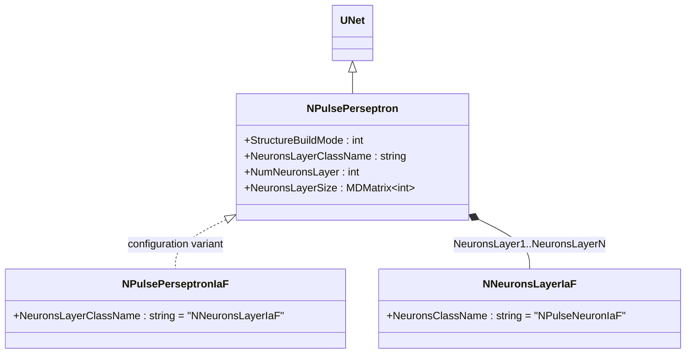
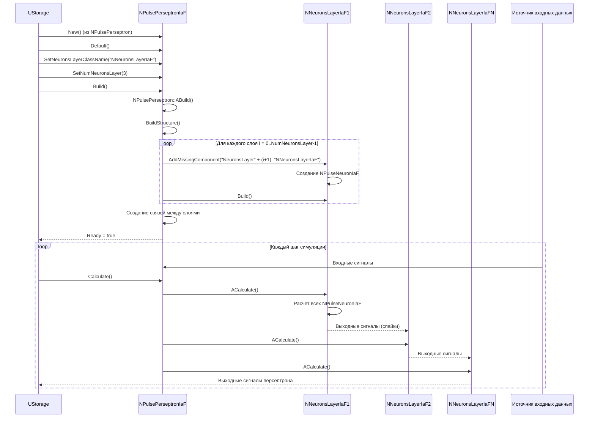
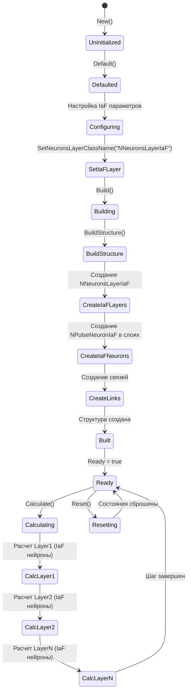
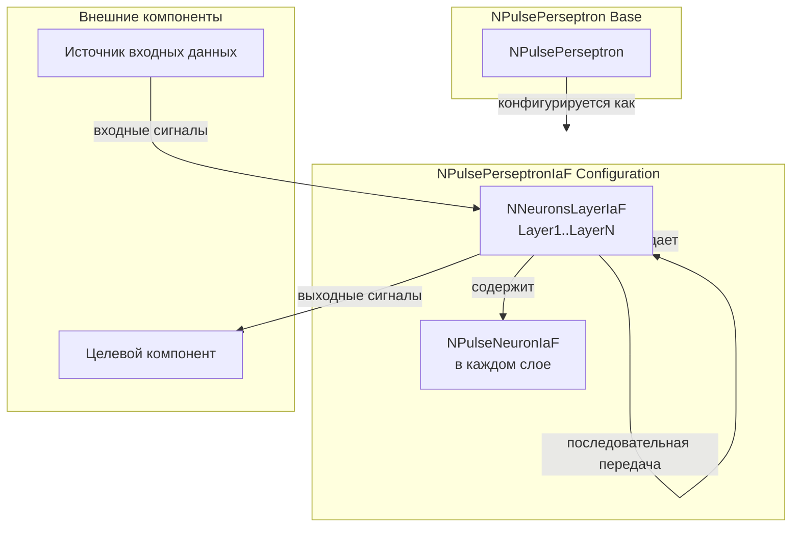
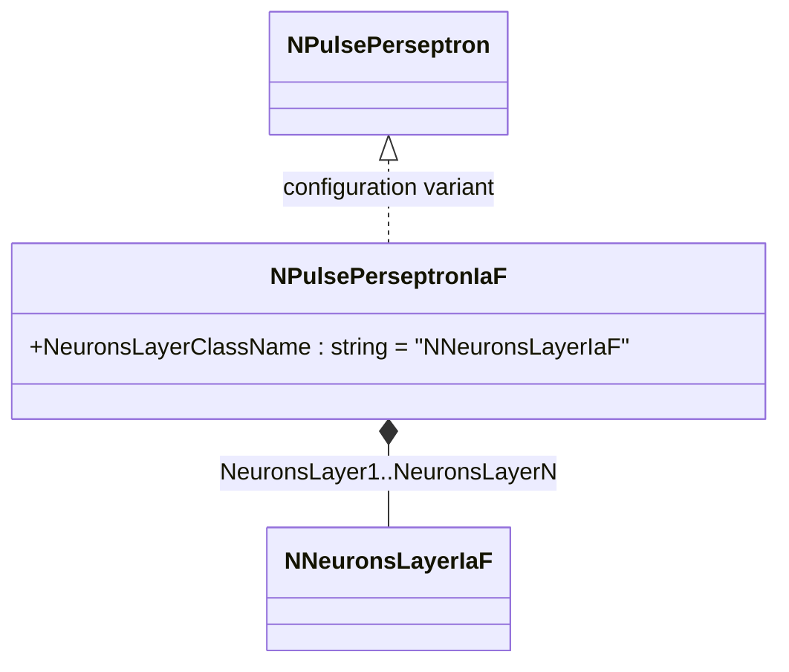
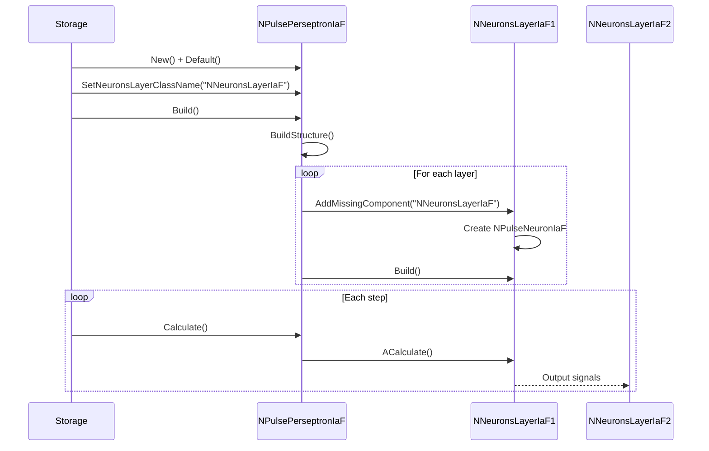
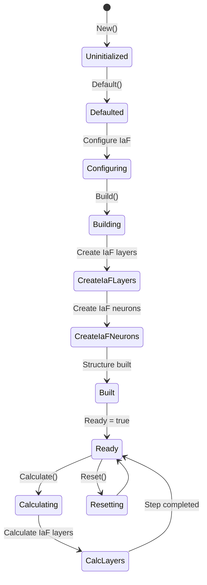
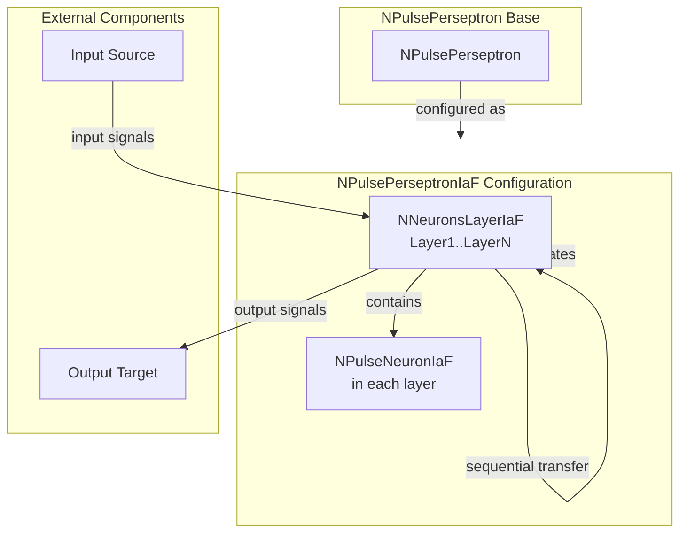

# NPulsePerseptronIaF — импульсный персептрон (модель IaF)

## RU

### Назначение

**Класс**: `NPulsePerseptronIaF` — конфигурационный вариант импульсного персептрона с нейронами модели Integrate-and-Fire.  
**Регистрация**: `NPulseLibrary.cpp` → `UploadClass("NPulsePerseptronIaF", ...)`.  
**Storage-инстансы**: `ClassName = "NPulsePerseptronIaF"` в `Bin/Configs/*/Model_*.xml`.

`NPulsePerseptronIaF` является конфигурационным вариантом класса `NPulsePerseptron` с параметрами для модели IaF. При создании компонента с `ClassName = "NPulsePerseptronIaF"` создается экземпляр `NPulsePerseptron` с параметром:
- `NeuronsLayerClassName = "NNeuronsLayerIaF"` — слои нейронов модели IaF

**Использование:** Создание многослойных импульсных нейронных сетей с IaF-нейронами, классификация паттернов с использованием модели IaF

### UML-диаграмма классов



**Иерархия наследования:**
- `UNet` — базовая сеть Rdk Framework
- `NPulsePerseptron` — импульсный персептрон
- `NPulsePerseptronIaF` — конфигурационный вариант для модели IaF

**Внутренняя структура:**
- **NeuronsLayer1..NeuronsLayerN** (`NNeuronsLayerIaF`) — слои нейронов модели IaF, создаются автоматически при сборке

### UML-диаграмма последовательности



**Жизненный цикл:**
1. **Создание**: `NPulsePerseptronIaF` создается из `NPulsePerseptron` с настройкой параметров
2. **Настройка**: Устанавливается `NeuronsLayerClassName = "NNeuronsLayerIaF"`
3. **Сборка**: Автоматически создаются слои `NNeuronsLayerIaF`, которые содержат нейроны `NPulseNeuronIaF`
4. **Расчет**: На каждом шаге рассчитываются слои с IaF-нейронами, сигналы передаются между слоями

### UML-диаграмма состояний



**Состояния:**
- **Uninitialized** — создан, но не инициализирован
- **Defaulted** — параметры установлены по умолчанию
- **Configuring** — настройка параметров для IaF
- **SetIaFLayer** — установка имени класса слоя IaF
- **Building** — выполняется сборка структуры
- **BuildStructure** — выполнение пересборки структуры
- **CreateIaFLayers** — создание слоев IaF
- **CreateIaFNeurons** — создание нейронов IaF в слоях
- **CreateLinks** — создание связей между слоями
- **Built** — структура персептрона построена
- **Ready** — готов к выполнению расчетов
- **Calculating** — выполняется расчет персептрона
- **CalcLayer1..CalcLayerN** — расчет каждого слоя с IaF-нейронами
- **Resetting** — выполняется сброс состояний

### UML-диаграмма активности

```mermaid
flowchart TD
    Start([Start Build]) --> SetIaFClass[SetNeuronsLayerClassName = "NNeuronsLayerIaF"]
    SetIaFClass --> BuildStructure[NPulsePerseptron::BuildStructure]
    BuildStructure --> LoopLayers[Цикл по слоям i = 0..NumNeuronsLayer-1]
    LoopLayers --> CreateIaFLayer[Создание NNeuronsLayerIaF]
    CreateIaFLayer --> SetIaFLayerSize[SetNeuronsWidth/Height]
    SetIaFLayerSize --> BuildIaFLayer[Build() NNeuronsLayerIaF]
    BuildIaFLayer --> CreateIaFNeurons[NNeuronsLayerIaF создает NPulseNeuronIaF]
    CreateIaFNeurons --> CheckMoreLayers{Есть еще слои?}
    CheckMoreLayers -->|Да| LoopLayers
    CheckMoreLayers -->|Нет| CreateLinks[Создание связей между слоями]
    CreateLinks --> End([End])
```

**Алгоритм сборки:**
1. Установка `NeuronsLayerClassName = "NNeuronsLayerIaF"`
2. Вызов `BuildStructure()` базового класса
3. Создание слоев `NNeuronsLayerIaF` для каждого слоя персептрона
4. Каждый `NNeuronsLayerIaF` автоматически создает нейроны `NPulseNeuronIaF`
5. Создание связей между слоями (если `StructureBuildMode = 1`)

### UML-диаграмма компонентов



**Зависимости:**
- **Базовый класс**: `NPulsePerseptron` (конфигурационный вариант)
- **Внутренние компоненты**: `NNeuronsLayerIaF` (слои нейронов IaF), `NPulseNeuronIaF` (нейроны в слоях)
- **Внешние компоненты**: источник входных данных (для первого слоя), целевой компонент (получатель выходных сигналов)

### Свойства

`NPulsePerseptronIaF` использует все свойства базового класса `NPulsePerseptron` с параметром:
- `NeuronsLayerClassName = "NNeuronsLayerIaF"` — слои нейронов модели IaF

**Наследуемые свойства от NPulsePerseptron:**
- `StructureBuildMode` (int) — режим сборки структуры
- `NumNeuronsLayer` (int) — число слоев нейронов
- `NeuronsLayerSize` (MDMatrix<int>) — размеры слоев нейронов
- `NumInputFeatures` (int) — число признаков на входе
- `FlagFreqGroupLayer` (bool) — флаг использования частотного слоя

### Методы

`NPulsePerseptronIaF` использует все методы базового класса `NPulsePerseptron`.

### Примеры использования

#### Пример 1: Создание персептрона IaF в коде C++

```cpp
// Создание персептрона IaF
auto perceptron = storage->CreateComponent("NPulsePerseptronIaF");
perceptron->SetName("PerseptronIaF");

// Инициализация (использует параметры по умолчанию с NeuronsLayerClassName="NNeuronsLayerIaF")
perceptron->Default();

// Настройка параметров
perceptron->StructureBuildMode = 1;  // Автоматическая сборка с связями
perceptron->NumNeuronsLayer = 2;     // 2 слоя нейронов
perceptron->NumInputFeatures = 8;    // 8 признаков на входе

// Настройка размеров слоев
MDMatrix<int> layerSizes(2, 2);
layerSizes(0, 0) = 10; layerSizes(0, 1) = 1;  // Первый слой: 10×1
layerSizes(1, 0) = 5;  layerSizes(1, 1) = 1;  // Второй слой: 5×1
perceptron->NeuronsLayerSize = layerSizes;

// Сборка (автоматически создает слои NNeuronsLayerIaF с NPulseNeuronIaF)
perceptron->Build();

// Использование
for (int step = 0; step < 1000; step++) {
    perceptron->Calculate();
    // Выходные сигналы доступны через последний слой нейронов
}
```

#### Пример 2: Конфигурация XML

```xml
<PerseptronIaF1 Class="NPulsePerseptronIaF">
    <Parameters>
        <StructureBuildMode>1</StructureBuildMode>
        <NumNeuronsLayer>2</NumNeuronsLayer>
        <NumInputFeatures>8</NumInputFeatures>
        <NeuronsLayerSize>
            <Row>
                <Col>10</Col>
                <Col>1</Col>
            </Row>
            <Row>
                <Col>5</Col>
                <Col>1</Col>
            </Row>
        </NeuronsLayerSize>
        <FlagFreqGroupLayer>0</FlagFreqGroupLayer>
    </Parameters>
</PerseptronIaF1>
```

### Использование в конфигурациях

`NPulsePerseptronIaF` используется в экспериментах с многослойными импульсными нейронными сетями на основе модели IaF:

- **Классификация с IaF**: `Bin/Configs/!OldConfigs/*/Model_*.xml` (где требуется использование IaF-нейронов)
- **Обучение нейросетей**: эксперименты с обучением многослойных сетей

**Типичные значения параметров:**
- **NeuronsLayerClassName**: автоматически устанавливается в "NNeuronsLayerIaF"
- **StructureBuildMode**: 1 (автоматическая сборка с связями)
- **NumNeuronsLayer**: 1-5 (количество скрытых слоев)
- **NumInputFeatures**: 2-100 (размер входного вектора признаков)

**Особенности:**
- Автоматическое использование IaF-нейронов: все слои содержат нейроны модели Integrate-and-Fire
- Простота настройки: достаточно указать `ClassName = "NPulsePerseptronIaF"`, и компонент автоматически использует IaF-модель
- Совместимость с IaF-экспериментами: интегрируется с другими компонентами модели IaF

## Источники

См. [Literature-References.md](../Literature-References.md): **25**, **29**, **30**.

### См. также

- [`NPulsePerseptron`](NPulsePerseptron.md) — импульсный персептрон (базовый класс)
- [`NNeuronsLayerIaF`](NNeuronsLayerIaF.md) — слой нейронов модели IaF
- [`NPulseNeuronIaF`](NPulseNeuronIaF.md) — нейрон модели IaF
- [`NPulseMembraneIaF`](NPulseMembraneIaF.md) — мембрана модели IaF
- [`NPulseLTZoneIaF`](NPulseLTZoneIaF.md) — LT-зона модели IaF
- [Architecture.md](../Architecture.md) — архитектура библиотеки

---

## EN

### Purpose

**Class**: `NPulsePerseptronIaF` — configuration variant of spiking perceptron with Integrate-and-Fire model neurons.  
**Registration**: `NPulseLibrary.cpp` → `UploadClass("NPulsePerseptronIaF", ...)`.  
**Instances**: `ClassName = "NPulsePerseptronIaF"` in `Bin/Configs/*/Model_*.xml`.

`NPulsePerseptronIaF` is a configuration variant of `NPulsePerseptron` class with parameters for IaF model. When creating a component with `ClassName = "NPulsePerseptronIaF"`, an instance of `NPulsePerseptron` is created with parameter:
- `NeuronsLayerClassName = "NNeuronsLayerIaF"` — IaF model neuron layers

**Usage:** Creating multi-layer spiking neural networks with IaF neurons, pattern classification using IaF model

### UML Class Diagram



### UML Sequence Diagram



### UML State Diagram



### UML Activity Diagram

```mermaid
flowchart TD
    Start([Start Build]) --> SetIaFClass[Set NeuronsLayerClassName = "NNeuronsLayerIaF"]
    SetIaFClass --> BuildStructure[NPulsePerseptron::BuildStructure]
    BuildStructure --> LoopLayers[Loop through layers]
    LoopLayers --> CreateIaFLayer[Create NNeuronsLayerIaF]
    CreateIaFLayer --> CreateIaFNeurons[Create NPulseNeuronIaF in layer]
    CreateIaFNeurons --> CheckMore{More layers?}
    CheckMore -->|Yes| LoopLayers
    CheckMore -->|No| CreateLinks[Create links]
    CreateLinks --> End([End])
```

### UML Component Diagram



### Properties

`NPulsePerseptronIaF` uses all properties of base class `NPulsePerseptron` with parameter:
- `NeuronsLayerClassName = "NNeuronsLayerIaF"` — IaF model neuron layers

### Methods

`NPulsePerseptronIaF` uses all methods of base class `NPulsePerseptron`.

### Usage in configurations

`NPulsePerseptronIaF` is used in multi-layer spiking neural network experiments with IaF model:

- **Classification with IaF**: `Bin/Configs/!OldConfigs/*/Model_*.xml`
- **Neural network training**: experiments with multi-layer network training

**Typical parameter values:**
- **NeuronsLayerClassName**: automatically set to "NNeuronsLayerIaF"
- **StructureBuildMode**: 1 (automatic build with connections)
- **NumNeuronsLayer**: 1-5 (number of hidden layers)

### References

See [Literature-References.md](../Literature-References.md): **25**, **29**, **30**.

### See Also

- [`NPulsePerseptron`](NPulsePerseptron.md) — spiking perceptron (base class)
- [`NNeuronsLayerIaF`](NNeuronsLayerIaF.md) — IaF model neuron layer
- [`NPulseNeuronIaF`](NPulseNeuronIaF.md) — IaF model neuron
- [`NPulseMembraneIaF`](NPulseMembraneIaF.md) — IaF membrane
- [Architecture.md](../Architecture.md) — library architecture
