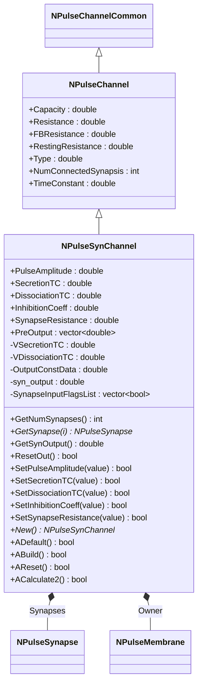
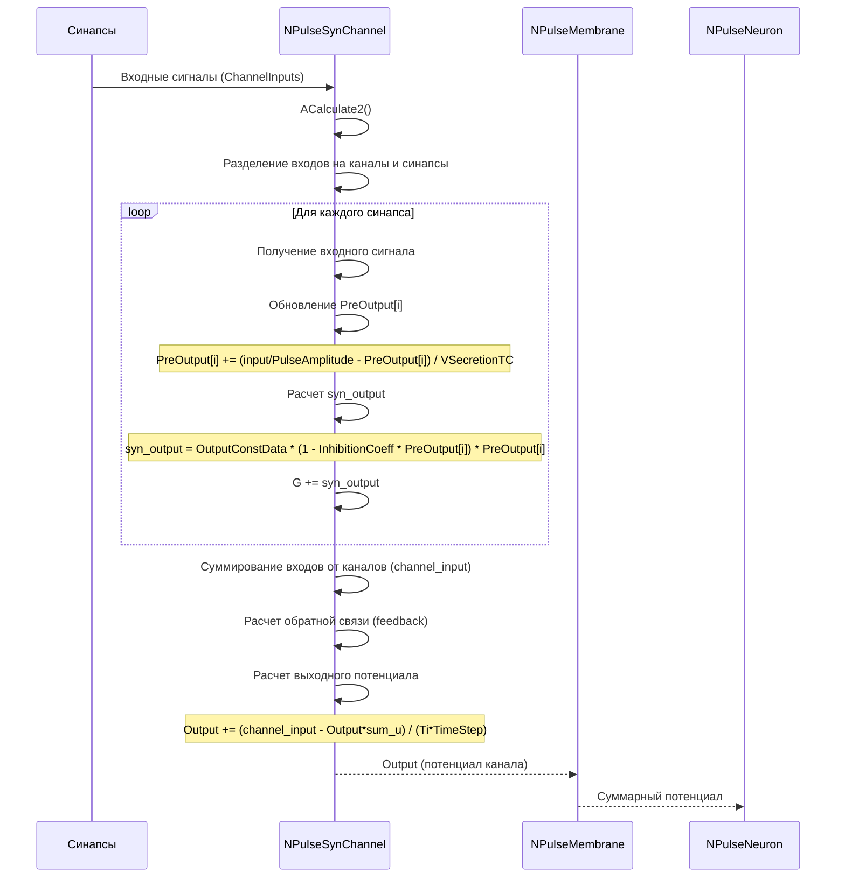
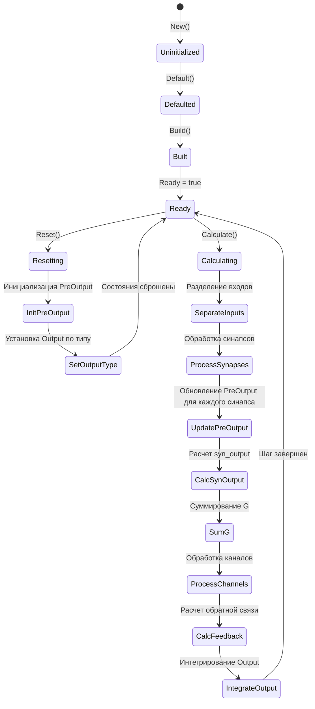
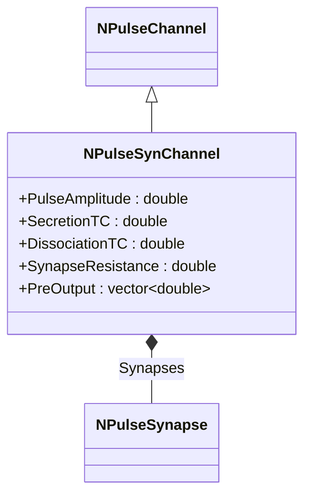
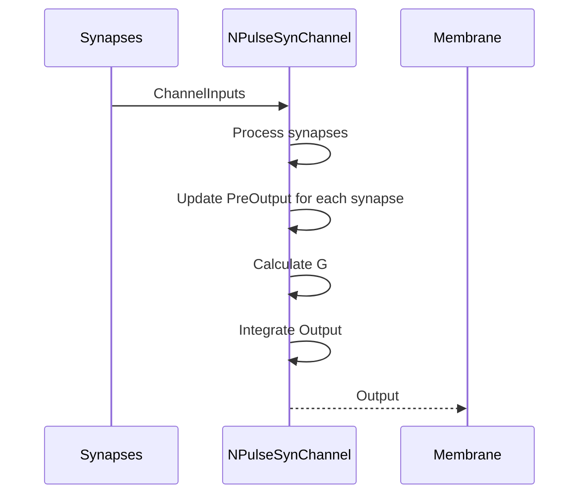

# NPulseSynChannel — синаптический импульсный канал

## RU

### Назначение

**Класс**: `NPulseSynChannel` — синаптический импульсный канал с поддержкой модели динамики медиатора для нескольких синапсов.  
**Регистрация**: `NPulseLibrary.cpp` → `UploadClass("NPSynChannel", ...)` (как алиас).  
**Storage-инстансы**: `ClassName = "NPulseSynChannel"` или `"NPSynChannel"` в `Bin/Configs/*/Model_*.xml`.

`NPulseSynChannel` реализует синаптический канал, который может содержать несколько синапсов и обрабатывает их выходы с учетом модели динамики медиатора. Для каждого синапса рассчитывается концентрация медиатора (`PreOutput`), затем все токи суммируются в общую проводимость `G`, которая используется для расчета выходного потенциала канала с учетом емкости и сопротивления мембраны.

**Использование:** Моделирование синаптических каналов с несколькими синапсами, обработка динамики медиатора на уровне канала

### UML-диаграмма классов



**Иерархия наследования:**
- `NPulseChannelCommon` — общий импульсный канал
- `NPulseChannel` — базовый импульсный канал
- `NPulseSynChannel` — синаптический импульсный канал

**Ключевые свойства:**
- Параметры динамики медиатора: `SecretionTC`, `DissociationTC`
- Параметры синапсов: `SynapseResistance`, `InhibitionCoeff`
- Состояния медиатора: `PreOutput` (вектор для каждого синапса)

### UML-диаграмма последовательности



**Жизненный цикл:**
1. **Инициализация**: Установка параметров по умолчанию
2. **Сборка**: Расчет `VSecretionTC` и `VDissociationTC` на основе `TimeStep`
3. **Сброс**: Инициализация `PreOutput` для каждого синапса, установка начального значения `Output` в зависимости от типа
4. **Расчет**: Обработка входов от синапсов и каналов, расчет динамики медиатора, интегрирование выходного потенциала

### UML-диаграмма состояний



### UML-диаграмма активности

```mermaid
flowchart TD
    Start([Start Calculate]) --> InitVars[channel_input = 0, G = 0, num_connected_synapsis = 0]
    InitVars --> LoopInputs[Цикл по ChannelInputs]
    LoopInputs --> CheckSize{ChannelInputs[n].GetCols() > 0?}
    CheckSize -->|Нет| CheckMore{Еще входы?}
    CheckSize -->|Да| CheckSynapse{SynapseInputFlagsList[n]?}
    CheckSynapse -->|Нет| AddChannelInput[channel_input += ChannelInputs[n]]
    CheckSynapse -->|Да| ProcessSynapse[Обработка синапса]
    AddChannelInput --> IncrementChannels[num_connected_channels++]
    IncrementChannels --> CheckMore
    ProcessSynapse --> ResizePreOutput{PreOutput.size() < num_connected_synapsis?}
    ResizePreOutput -->|Да| Resize[PreOutput.resize(num_connected_synapsis)]
    ResizePreOutput -->|Нет| GetInput[input = ChannelInputs[n](0,0)]
    Resize --> GetInput
    GetInput --> UpdatePreOutput{input > 0?}
    UpdatePreOutput -->|Да| PreOutputSecretion[PreOutput[i] += (input/PulseAmplitude - PreOutput[i]) / VSecretionTC]
    UpdatePreOutput -->|Нет| PreOutputDissociation[PreOutput[i] -= PreOutput[i] / VDissociationTC]
    PreOutputSecretion --> CalcSynOutput[syn_output = OutputConstData * (1 - InhibitionCoeff * PreOutput[i]) * PreOutput[i]]
    PreOutputDissociation --> CalcSynOutput
    CalcSynOutput --> CheckSynOutput{syn_output > 0?}
    CheckSynOutput -->|Да| AddG[G += syn_output]
    CheckSynOutput -->|Нет| IncrementSynapses[num_connected_synapsis++]
    AddG --> IncrementSynapses
    IncrementSynapses --> CheckMore
    CheckMore -->|Да| LoopInputs
    CheckMore -->|Нет| AverageChannels{UseAveragePotential и num_connected_channels > 0?}
    AverageChannels -->|Да| AverageChannelInput[channel_input /= num_connected_channels]
    AverageChannels -->|Нет| SetSumInput[SumChannelInput = channel_input]
    AverageChannelInput --> SetSumInput
    SetSumInput --> AverageSynapses{UseAverageSynapsis и num_connected_synapsis > 0?}
    AverageSynapses -->|Да| AverageG[G /= num_connected_synapsis]
    AverageSynapses -->|Нет| GetFeedback[feedback = Membrane->Feedback]
    AverageG --> GetFeedback
    GetFeedback --> CalcFeedback[channel_input -= feedback]
    CalcFeedback --> CheckFeedback{feedback?}
    CheckFeedback -->|Нет| CheckResistance{Определение resistance}
    CheckFeedback -->|Да| CalcTiFB[Ti = Capacity / (G + 1.0/FBResistance)]
    CheckResistance --> CalcTi[Ti = Capacity / (G + 1.0/resistance)]
    CalcTiFB --> CalcSumU[sum_u = 1.0 + G*FBResistance]
    CalcTi --> CalcSumU2[sum_u = 1.0 + G*resistance]
    CalcSumU --> Integrate[Output += (channel_input - Output*sum_u) / (Ti*TimeStep)]
    CalcSumU2 --> Integrate
    Integrate --> End([End])
```

**Алгоритм расчета:**
1. Разделение входов на каналы и синапсы (на основе `SynapseInputFlagsList`)
2. Обработка входов от каналов: суммирование в `channel_input`
3. Обработка входов от синапсов:
   - Для каждого синапса обновление `PreOutput[i]` согласно модели медиатора
   - Расчет `syn_output` для каждого синапса
   - Суммирование `syn_output` в общую проводимость `G`
4. Расчет обратной связи от мембраны
5. Интегрирование выходного потенциала с учетом емкости, сопротивления и проводимости

### UML-диаграмма компонентов

```mermaid
graph TB
    subgraph NPulseChannel["NPulseChannel Base"]
        BaseChannel[NPulseChannel]
    end
    
    subgraph NPulseSynChannel["NPulseSynChannel"]
        MediatorModel[Модель медиатора для синапсов]
        SynapseProcessor[Обработчик синапсов]
    end
    
    subgraph External["Внешние компоненты"]
        Synapses[NPulseSynapse[]]
        Channels[NPulseChannel[]]
        Membrane[NPulseMembrane]
        Neuron[NPulseNeuron]
    end
    
    BaseChannel -->|наследуется| NPulseSynChannel
    NPulseSynChannel -->|обрабатывает| MediatorModel
    NPulseSynChannel -->|обрабатывает| SynapseProcessor
    Synapses -->|ChannelInputs| NPulseSynChannel
    Channels -->|ChannelInputs| NPulseSynChannel
    NPulseSynChannel -->|Output| Membrane
    Membrane -->|Feedback| NPulseSynChannel
    Membrane -->|часть| Neuron
```

### Свойства

#### Параметры (ptPubParameter)

- **`PulseAmplitude`** (double) — амплитуда импульса. Используется для нормализации входных сигналов от синапсов. Значение по умолчанию: 1.0

- **`SecretionTC`** (double) — постоянная времени выделения медиатора (в секундах). Определяет скорость накопления медиатора при наличии входного сигнала. Значение по умолчанию: 0.001 (1 мс)

- **`DissociationTC`** (double) — постоянная времени распада медиатора (в секундах). Определяет скорость распада медиатора при отсутствии входного сигнала. Значение по умолчанию: 0.01 (10 мс)

- **`InhibitionCoeff`** (double) — коэффициент пресинаптического торможения. Определяет степень торможения при использовании пресинаптического торможения. Значение по умолчанию: 0.0

- **`SynapseResistance`** (double) — сопротивление синапса (в омах). Используется для расчета `OutputConstData`. Значение по умолчанию: 1.0e8 (100 МОм)

**Наследуемые параметры от NPulseChannel:**
- `Capacity` (double) — емкость мембраны (по умолчанию: 1.0e-9)
- `Resistance` (double) — сопротивление мембраны (по умолчанию: 1.0e7)
- `FBResistance` (double) — сопротивление обратной связи (по умолчанию: 1.0e8)
- `RestingResistance` (double) — сопротивление покоя (по умолчанию: 1.0e7)
- `Type` (double) — тип канала (<0 — возбуждающий, >0 — тормозной, =0 — нейтральный)

#### Входные свойства (ptInput | ptPubState)

**Наследуемые от NPulseChannel:**
- **`ChannelInputs`** (vector<MDMatrix<double>>) — входные сигналы от каналов и синапсов. Разделяются на каналы и синапсы на основе `SynapseInputFlagsList`.

#### Выходные свойства (ptOutput | ptPubState)

**Наследуемые от NPulseChannel:**
- **`Output`** (MDMatrix<double>) — выходной потенциал канала. Интегрируется с учетом емкости, сопротивления и проводимости от синапсов.

- **`SumChannelInput`** (MDMatrix<double>) — суммарный входной сигнал от каналов

#### Состояния (ptPubState)

- **`PreOutput`** (vector<double>) — концентрация медиатора для каждого синапса. Интегрируется согласно модели выделения и распада. Размер соответствует количеству подключенных синапсов. Начальное значение: все элементы 0.0

**Наследуемые состояния от NPulseChannel:**
- `NumConnectedSynapsis` (int) — количество подключенных синапсов
- `TimeConstant` (double) — постоянная времени канала (`Resistance * Capacity`)

**Внутренние состояния:**
- **`VSecretionTC`** (double) — нормализованная постоянная времени выделения (`SecretionTC * TimeStep`)
- **`VDissociationTC`** (double) — нормализованная постоянная времени распада (`DissociationTC * TimeStep`)
- **`OutputConstData`** (double) — константа для расчета выходного тока (`1/SynapseResistance` или `4*InhibitionCoeff/SynapseResistance`)
- **`syn_output`** (double) — выходной ток текущего синапса
- **`SynapseInputFlagsList`** (vector<bool>) — флаги для разделения входов на каналы и синапсы

### Методы

#### Публичные методы

- **`New()`** → `NPulseSynChannel*` — создает новый экземпляр класса.

- **`GetNumSynapses()`** → `int` — возвращает количество синапсов. В текущей реализации возвращает 0.

- **`GetSynapse(size_t i)`** → `NPulseSynapse*` — возвращает синапс по индексу. В текущей реализации возвращает 0.

- **`GetSynOutput()`** → `double` — возвращает выходной ток последнего обработанного синапса (`syn_output`).

- **`ResetOut()`** → `bool` — сбрасывает выходной ток. В текущей реализации возвращает `true`.

#### Защищенные методы жизненного цикла

- **`ADefault()`** → `bool` — инициализирует параметры по умолчанию. Устанавливает `PulseAmplitude=1.0`, `SecretionTC=0.001`, `DissociationTC=0.01`, `InhibitionCoeff=0.0`, `SynapseResistance=1.0e8`, вызывает `NPulseChannel::ADefault()`.

- **`ABuild()`** → `bool` — строит структуру канала. Рассчитывает `VSecretionTC = SecretionTC * TimeStep` и `VDissociationTC = DissociationTC * TimeStep`, вызывает `NPulseChannel::ABuild()`.

- **`AReset()`** → `bool` — сбрасывает состояния канала. Устанавливает начальное значение `Output` в зависимости от типа (`Type>0` → `Output=1`, `Type<0` → `Output=-1`, иначе `Output=0`), инициализирует `SynapseInputFlagsList`, вызывает `NPulseChannel::AReset()`.

- **`ACalculate2()`** → `bool` — выполняет расчет канала на одном шаге. Обрабатывает входы от синапсов и каналов, рассчитывает динамику медиатора для каждого синапса, суммирует проводимости, интегрирует выходной потенциал.

#### Методы установки параметров

- **`SetPulseAmplitude(const double &value)`** → `bool` — устанавливает амплитуду импульса.

- **`SetSecretionTC(const double &value)`** → `bool` — устанавливает постоянную времени выделения. Проверяет, что значение > 0, устанавливает `Ready=false`.

- **`SetDissociationTC(const double &value)`** → `bool` — устанавливает постоянную времени распада. Проверяет, что значение > 0, устанавливает `Ready=false`.

- **`SetInhibitionCoeff(const double &value)`** → `bool` — устанавливает коэффициент пресинаптического торможения. Пересчитывает `OutputConstData`.

- **`SetSynapseResistance(const double &value)`** → `bool` — устанавливает сопротивление синапса. Проверяет, что значение > 0, пересчитывает `OutputConstData`.

### Примеры использования

#### Пример 1: Создание канала в коде C++

```cpp
// Создание синаптического канала
auto channel = storage->CreateComponent<NPulseSynChannel>();
channel->SetName("SynChannel");

// Инициализация
channel->Default();

// Настройка параметров динамики медиатора
channel->PulseAmplitude = 1.0;
channel->SecretionTC = 0.001;      // Постоянная времени выделения (1 мс)
channel->DissociationTC = 0.01;   // Постоянная времени распада (10 мс)
channel->SynapseResistance = 1.0e8; // Сопротивление синапса (100 МОм)
channel->InhibitionCoeff = 0.0;    // Без пресинаптического торможения

// Настройка параметров канала
channel->Capacity = 1.0e-9;        // Емкость (1 нФ)
channel->Resistance = 1.0e7;       // Сопротивление (10 МОм)
channel->FBResistance = 1.0e8;     // Сопротивление обратной связи (100 МОм)
channel->Type = -1;                // Возбуждающий канал

// Сборка
channel->Build();

// Использование
for (int step = 0; step < 10000; step++) {
    channel->Calculate();
    double output = channel->Output(0, 0);
    double synOutput = channel->GetSynOutput();
    if (step % 1000 == 0) {
        std::cout << "Step " << step << ": Output = " << output 
                  << ", SynOutput = " << synOutput << std::endl;
    }
}
```

#### Пример 2: Конфигурация XML

```xml
<Channel1 Class="NPSynChannel">
    <Parameters>
        <Type>-1</Type>
        <Capacity>1.0e-9</Capacity>
        <Resistance>1.0e7</Resistance>
        <FBResistance>1.0e8</FBResistance>
        <RestingResistance>1.0e7</RestingResistance>
        <PulseAmplitude>1.0</PulseAmplitude>
        <SecretionTC>0.001</SecretionTC>
        <DissociationTC>0.01</DissociationTC>
        <InhibitionCoeff>0.0</InhibitionCoeff>
        <SynapseResistance>1.0e8</SynapseResistance>
    </Parameters>
</Channel1>
```

### Использование в конфигурациях

`NPulseSynChannel` используется в экспериментах с синаптическими каналами:

- Моделирование синаптических каналов с несколькими синапсами
- Обработка динамики медиатора на уровне канала
- Интеграция токов от нескольких синапсов

**Особенности:**
- Поддерживает несколько синапсов с индивидуальной обработкой динамики медиатора
- Разделяет входы на каналы и синапсы автоматически
- Интегрирует выходной потенциал с учетом емкости и сопротивления мембраны

**Типичные значения параметров:**
- `SecretionTC = 0.001` (1 мс) — быстрое выделение медиатора
- `DissociationTC = 0.01` (10 мс) — умеренный распад медиатора
- `SynapseResistance = 1.0e8` (100 МОм) — биологически реалистичное сопротивление

### См. также

- [`NPulseChannel`](NPulseChannel.md) — базовый импульсный канал
- [`NPulseChannelCommon`](NPulseChannelCommon.md) — общий импульсный канал
- [`NPSynChannel`](NPSynChannel.md) — алиас для NPulseSynChannel
- [`NPSynExcChannel`](NPSynExcChannel.md) — возбуждающий синаптический канал
- [`NPSynInhChannel`](NPSynInhChannel.md) — тормозной синаптический канал
- [`NPulseSynapse`](NPulseSynapse.md) — импульсный синапс
- [`NPulseMembrane`](NPulseMembrane.md) — импульсная мембрана
- [Architecture.md](../Architecture.md) — архитектура библиотеки
- [Scientific-Background.md](../Scientific-Background.md) — научный фон (синаптическая передача, динамика медиатора)

---

## EN

### Purpose

**Class**: `NPulseSynChannel` — synaptic spiking channel with support for neurotransmitter dynamics model for multiple synapses.  
**Registration**: `NPulseLibrary.cpp` → `UploadClass("NPSynChannel", ...)` (as alias).  
**Instances**: `ClassName = "NPulseSynChannel"` or `"NPSynChannel"` in `Bin/Configs/*/Model_*.xml`.

`NPulseSynChannel` implements a synaptic channel that can contain multiple synapses and processes their outputs considering neurotransmitter dynamics model. For each synapse, neurotransmitter concentration (`PreOutput`) is calculated, then all currents are summed into total conductance `G`, which is used to calculate channel output potential considering membrane capacitance and resistance.

**Usage:** Modeling synaptic channels with multiple synapses, processing neurotransmitter dynamics at channel level

### UML Class Diagram



### UML Sequence Diagram



### See Also

- [`NPulseChannel`](NPulseChannel.md) — base spiking channel
- [`NPulseChannelCommon`](NPulseChannelCommon.md) — common spiking channel
- [`NPSynChannel`](NPSynChannel.md) — alias for NPulseSynChannel
- [`NPSynExcChannel`](NPSynExcChannel.md) — excitatory synaptic channel
- [`NPSynInhChannel`](NPSynInhChannel.md) — inhibitory synaptic channel
- [`NPulseSynapse`](NPulseSynapse.md) — spiking synapse
- [`NPulseMembrane`](NPulseMembrane.md) — spiking membrane
- [Architecture.md](../Architecture.md) — library architecture
