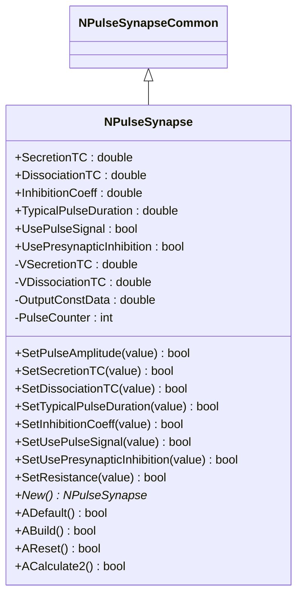
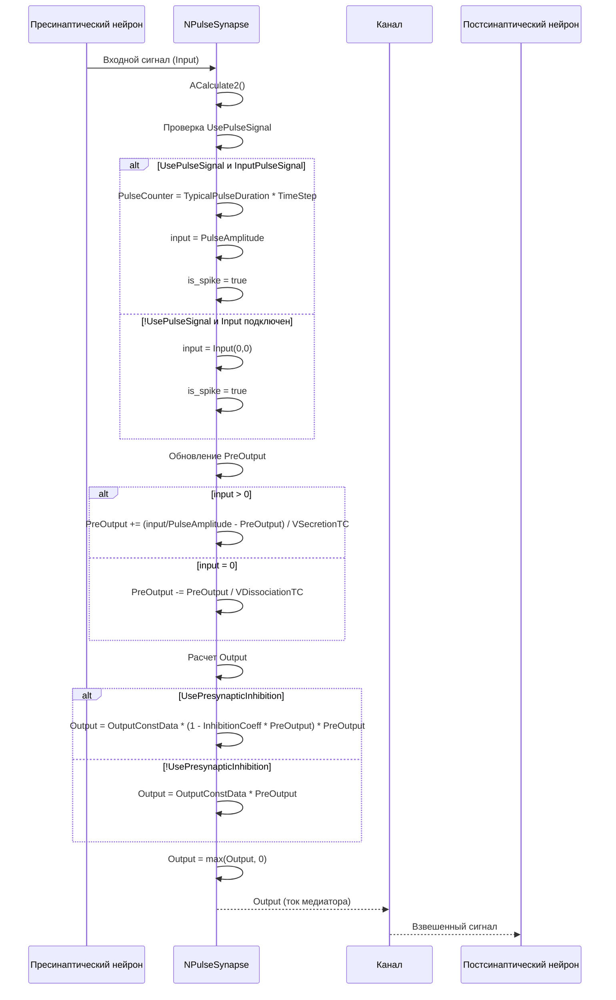
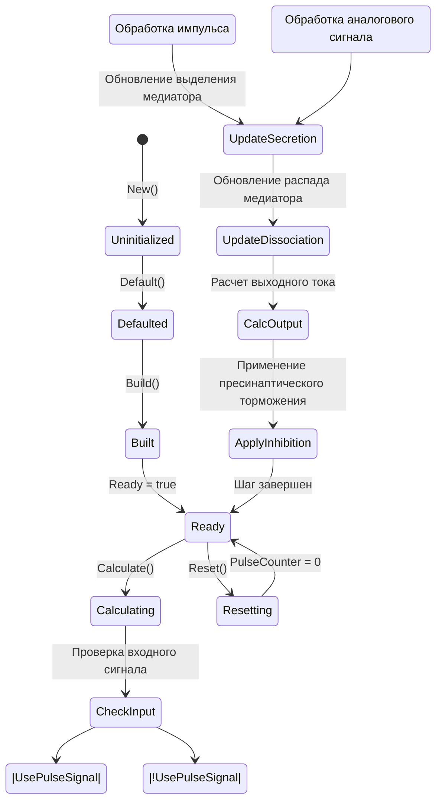
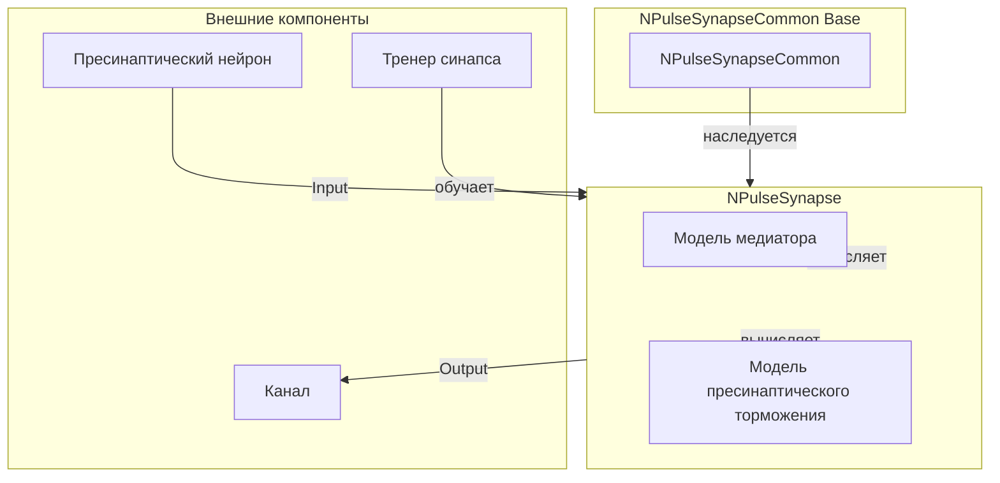
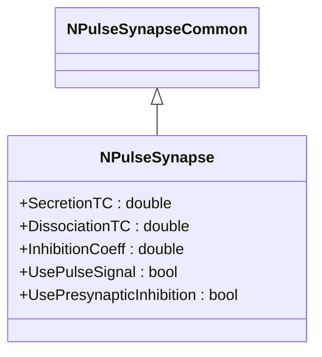
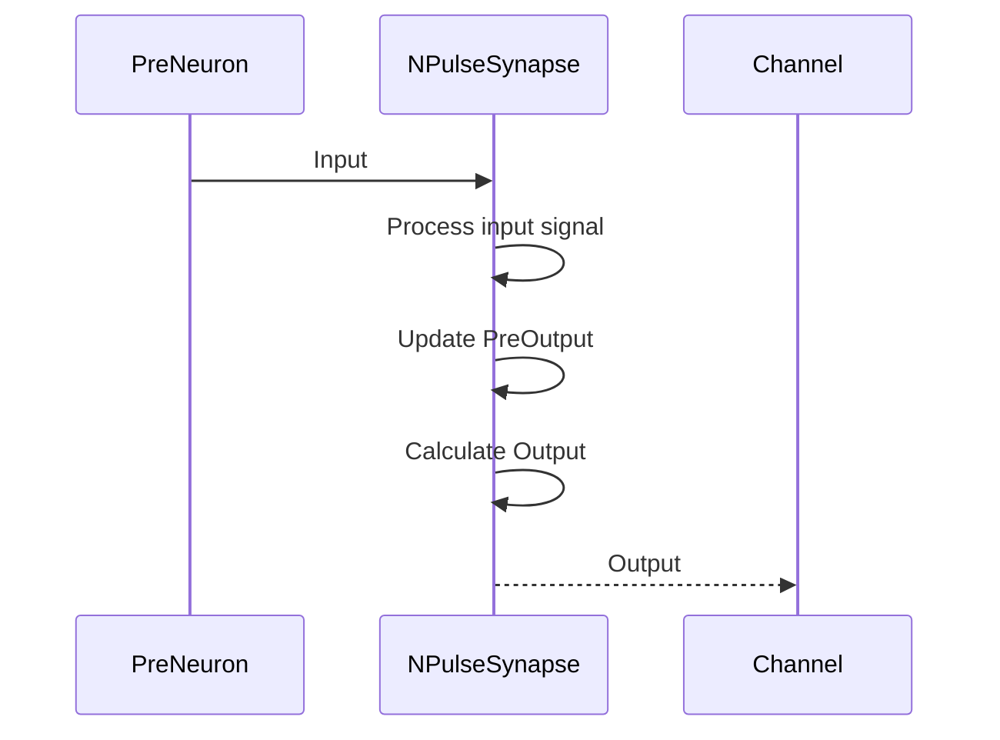
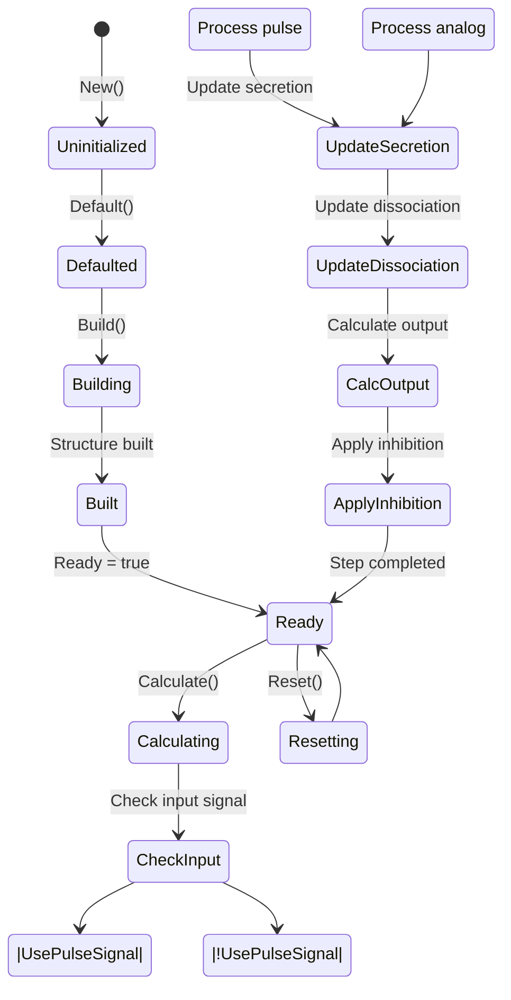
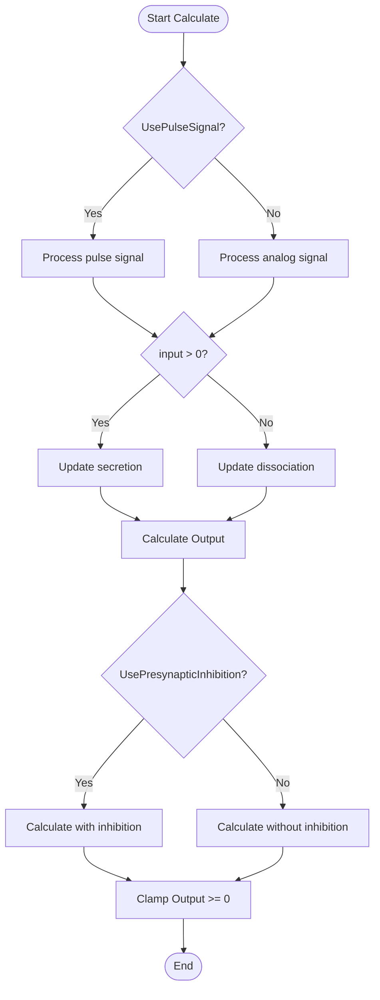
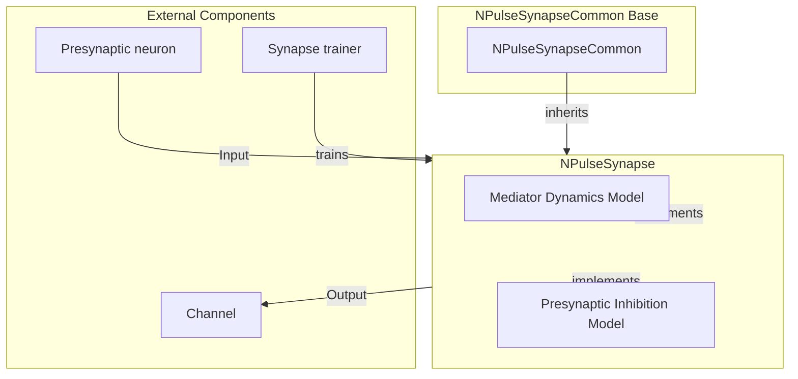

# NPulseSynapse — импульсный синапс с моделью медиатора

## RU

### Назначение

**Класс**: `NPulseSynapse` — импульсный синапс с моделью выделения и диссоциации медиатора.  
**Регистрация**: `NPulseLibrary.cpp` → `UploadClass("NPulseSynapse", ...)`.  
**Storage-инстансы**: `ClassName = "NPulseSynapse"` в `Bin/Configs/*/Model_*.xml`.

`NPulseSynapse` реализует импульсный синапс с моделью динамики медиатора, включающей процессы выделения (секреции) и распада (диссоциации) медиатора. Моделирует пресинаптическое торможение и использует импульсные сигналы для передачи информации.

**Использование:** Моделирование синаптической передачи с учетом динамики медиатора, пресинаптического торможения

### UML-диаграмма классов



**Иерархия наследования:**
- `NPulseSynapseCommon` — общий импульсный синапс
- `NPulseSynapse` — импульсный синапс с моделью медиатора

**Ключевые свойства:**
- Параметры динамики медиатора: `SecretionTC` (постоянная времени выделения), `DissociationTC` (постоянная времени распада)
- Пресинаптическое торможение: `InhibitionCoeff` (коэффициент торможения), `UsePresynapticInhibition` (флаг использования)
- Импульсные сигналы: `UsePulseSignal` (использование импульсных сигналов), `TypicalPulseDuration` (типовая длительность импульса)

### UML-диаграмма последовательности



**Жизненный цикл:**
1. **Инициализация**: Установка параметров по умолчанию
2. **Сборка**: Расчет `VSecretionTC` и `VDissociationTC` на основе `TimeStep`
3. **Расчет**: Обработка входного сигнала, обновление концентрации медиатора, расчет выходного тока
4. **Сброс**: Обнуление счетчиков и состояний

### UML-диаграмма состояний



### UML-диаграмма активности

```mermaid
flowchart TD
    Start([Start Calculate]) --> CheckUsePulse{UsePulseSignal?}
    CheckUsePulse -->|Да| CheckPulseSignal{InputPulseSignal?}
    CheckUsePulse -->|Нет| CheckInputConnected{Input подключен?}
    CheckPulseSignal -->|Да| SetPulseCounter[PulseCounter = TypicalPulseDuration * TimeStep]
    CheckPulseSignal -->|Нет| CheckPulseCounter{PulseCounter > 0?}
    SetPulseCounter --> SetInput[input = PulseAmplitude]
    CheckPulseCounter -->|Да| SetInput
    CheckPulseCounter -->|Нет| SetInputZero[input = 0]
    CheckInputConnected -->|Да| SetInputFromInput[input = Input(0,0)]
    CheckInputConnected -->|Нет| SetInputZero
    SetInput --> DecrementCounter[PulseCounter--]
    DecrementCounter --> UpdatePreOutput
    SetInputFromInput --> UpdatePreOutput{input > 0?}
    SetInputZero --> UpdatePreOutput
    UpdatePreOutput -->|Да| UpdateSecretion[PreOutput += (input/PulseAmplitude - PreOutput) / VSecretionTC]
    UpdatePreOutput -->|Нет| UpdateDissociation[PreOutput -= PreOutput / VDissociationTC]
    UpdateSecretion --> CalcOutput
    UpdateDissociation --> CalcOutput{UsePresynapticInhibition?}
    CalcOutput -->|Да| CalcWithInhibition[Output = OutputConstData * (1 - InhibitionCoeff * PreOutput) * PreOutput]
    CalcOutput -->|Нет| CalcWithoutInhibition[Output = OutputConstData * PreOutput]
    CalcWithInhibition --> ClampOutput[Output = max(Output, 0)]
    CalcWithoutInhibition --> ClampOutput
    ClampOutput --> End([End])
```

**Алгоритм расчета:**
1. Проверка типа входного сигнала (`UsePulseSignal`)
2. Обработка импульсного сигнала или аналогового сигнала
3. Обновление концентрации медиатора (`PreOutput`):
   - При наличии входного сигнала: `PreOutput += (input/PulseAmplitude - PreOutput) / VSecretionTC`
   - При отсутствии сигнала: `PreOutput -= PreOutput / VDissociationTC`
4. Расчет выходного тока с учетом пресинаптического торможения
5. Ограничение выходного сигнала снизу нулем

### UML-диаграмма компонентов



### Свойства

#### Параметры (ptPubParameter)

- **`SecretionTC`** (double) — постоянная времени выделения медиатора (в секундах). Определяет скорость накопления медиатора при наличии входного сигнала. Значение по умолчанию: 0.001 (1 мс)

- **`DissociationTC`** (double) — постоянная времени распада медиатора (в секундах). Определяет скорость распада медиатора при отсутствии входного сигнала. Значение по умолчанию: 0.01 (10 мс)

- **`InhibitionCoeff`** (double) — коэффициент пресинаптического торможения. Определяет степень торможения при использовании пресинаптического торможения. Значение по умолчанию: 0.0

- **`TypicalPulseDuration`** (double) — типовая длительность импульса (в секундах). Используется для определения длительности импульса при `UsePulseSignal=true`. Значение по умолчанию: 0.001 (1 мс)

- **`UsePulseSignal`** (bool) — использовать импульсные сигналы. Если `true`, входной сигнал обрабатывается как импульс с длительностью `TypicalPulseDuration`. Значение по умолчанию: true

- **`UsePresynapticInhibition`** (bool) — использовать пресинаптическое торможение. Если `true`, выходной ток рассчитывается с учетом пресинаптического торможения. Значение по умолчанию: false

**Наследуемые параметры от NPulseSynapseCommon:**
- `Type` (double) — тип синапса (<0 — тормозной, >0 — возбуждающий)
- `PulseAmplitude` (double) — амплитуда импульса
- `Resistance` (double) — сопротивление синапса (по умолчанию: 1.0e9)
- `Weight` (double) — вес синапса
- `TrainerClassName` (string) — имя класса тренера синапса

#### Входные свойства (ptInput | ptPubState)

**Наследуемые от NPulseSynapseCommon:**
- **`Input`** (MDMatrix<double>) — входной сигнал от пресинаптического нейрона
- **`WeightInput`** (MDMatrix<double>) — входной сигнал для динамического изменения веса

#### Выходные свойства (ptOutput | ptPubState)

**Наследуемые от NPulseSynapseCommon:**
- **`Output`** (MDMatrix<double>) — выходной ток синапса. Рассчитывается на основе концентрации медиатора и пресинаптического торможения.

- **`OutInCopy`** (MDMatrix<double>) — копия входного сигнала на выходе

#### Состояния (ptPubState)

**Наследуемые от NPulseSynapseCommon:**
- **`PreOutput`** (double) — концентрация медиатора в синаптической щели. Интегрируется согласно модели выделения и распада. Начальное значение: 0.0

- **`InputPulseSignal`** (bool) — флаг наличия импульсного входного сигнала

**Внутренние состояния:**
- **`VSecretionTC`** (double) — нормализованная постоянная времени выделения (`SecretionTC * TimeStep`)
- **`VDissociationTC`** (double) — нормализованная постоянная времени распада (`DissociationTC * TimeStep`)
- **`OutputConstData`** (double) — константа для расчета выходного тока. При `UsePresynapticInhibition` и `InhibitionCoeff=k>0`: `C = 4k/Resistance` (пик квадратичной формы `(1−k·p)·p` равен `1/R`). Иначе `C = 1/Resistance`. Все сеттеры (`SetInhibitionCoeff`, `SetResistance`, `SetUsePresynapticInhibition`) согласованы на эту нормализацию (legacy `4(k+1)/R` в `SetInhibitionCoeff` убран).
- **`PulseCounter`** (int) — счетчик длительности импульса. Уменьшается на каждом шаге, когда обрабатывается импульс. Начальное значение: 0

### Методы

#### Публичные методы

- **`New()`** → `NPulseSynapse*` — создает новый экземпляр класса.

#### Защищенные методы жизненного цикла

- **`ADefault()`** → `bool` — инициализирует параметры по умолчанию. Устанавливает `SecretionTC=0.001`, `DissociationTC=0.01`, `InhibitionCoeff=0.0`, `TypicalPulseDuration=0.001`, `UsePulseSignal=true`, `UsePresynapticInhibition=false`, `Resistance=1.0e9`, `PulseAmplitude=1.0`.

- **`ABuild()`** → `bool` — строит структуру синапса. Рассчитывает `VSecretionTC = SecretionTC * TimeStep` и `VDissociationTC = DissociationTC * TimeStep`.

- **`AReset()`** → `bool` — сбрасывает состояния синапса. Устанавливает `PulseCounter=0`, вызывает `NPulseSynapseCommon::AReset()`.

- **`ACalculate2()`** → `bool` — выполняет расчет синапса на одном шаге. Обрабатывает входной сигнал, обновляет концентрацию медиатора, рассчитывает выходной ток.

#### Методы установки параметров

- **`SetPulseAmplitude(const double &value)`** → `bool` — устанавливает амплитуду импульса.

- **`SetSecretionTC(const double &value)`** → `bool` — устанавливает постоянную времени выделения. Проверяет, что значение > 0, устанавливает `Ready=false`.

- **`SetDissociationTC(const double &value)`** → `bool` — устанавливает постоянную времени распада. Проверяет, что значение > 0, устанавливает `Ready=false`.

- **`SetTypicalPulseDuration(const double &value)`** → `bool` — устанавливает типовую длительность импульса. Проверяет, что значение > 0, устанавливает `Ready=false`.

- **`SetInhibitionCoeff(const double &value)`** → `bool` — устанавливает коэффициент пресинаптического торможения. Пересчитывает `OutputConstData` (`4k/R` при PSI и `k>0`, иначе `1/R`).

- **`SetUsePulseSignal(const bool &value)`** → `bool` — устанавливает флаг использования импульсных сигналов. Устанавливает `Ready=false`.

- **`SetUsePresynapticInhibition(const bool &value)`** → `bool` — устанавливает флаг использования пресинаптического торможения. Пересчитывает `OutputConstData`.

- **`SetResistance(const double &value)`** → `bool` — устанавливает сопротивление синапса. Проверяет, что значение > 0, пересчитывает `OutputConstData` с учетом пресинаптического торможения.

### Примеры использования

#### Пример 1: Создание синапса в коде C++

```cpp
// Создание синапса
auto synapse = storage->CreateComponent<NPulseSynapse>();
synapse->SetName("PulseSynapse");

// Инициализация
synapse->Default();

// Настройка параметров динамики медиатора
synapse->SecretionTC = 0.001;           // Постоянная времени выделения (1 мс)
synapse->DissociationTC = 0.01;        // Постоянная времени распада (10 мс)
synapse->TypicalPulseDuration = 0.001; // Типовая длительность импульса (1 мс)
synapse->UsePulseSignal = true;         // Использовать импульсные сигналы
synapse->UsePresynapticInhibition = false; // Без пресинаптического торможения

// Настройка типа и веса
synapse->Type = 1.0;                    // Возбуждающий синапс
synapse->PulseAmplitude = 1.0;          // Амплитуда импульса
synapse->Resistance = 1.0e9;            // Сопротивление синапса
synapse->Weight = 1.0;                  // Вес синапса

// Сборка
synapse->Build();

// Использование
for (int step = 0; step < 1000; step++) {
    synapse->Calculate();
    double output = synapse->Output(0, 0);
    double preOutput = synapse->PreOutput;
    std::cout << "Step " << step << ": Output = " << output 
              << ", PreOutput = " << preOutput << std::endl;
}
```

#### Пример 2: Конфигурация XML

```xml
<Synapse1 Class="NPulseSynapse">
    <Parameters>
        <Type>1</Type>
        <PulseAmplitude>1.0</PulseAmplitude>
        <Resistance>1.0e9</Resistance>
        <Weight>1.0</Weight>
        <SecretionTC>0.001</SecretionTC>
        <DissociationTC>0.01</DissociationTC>
        <InhibitionCoeff>0.0</InhibitionCoeff>
        <TypicalPulseDuration>0.001</TypicalPulseDuration>
        <UsePulseSignal>1</UsePulseSignal>
        <UsePresynapticInhibition>0</UsePresynapticInhibition>
    </Parameters>
</Synapse1>
```

### Использование в конфигурациях

`NPulseSynapse` используется в различных экспериментах:

- Моделирование синаптической передачи с учетом динамики медиатора
- Изучение пресинаптического торможения
- Эксперименты с различными параметрами выделения и распада медиатора

**Типичные значения параметров:**

1. **Быстрый синапс**: SecretionTC=0.0005, DissociationTC=0.005
2. **Медленный синапс**: SecretionTC=0.002, DissociationTC=0.02
3. **С пресинаптическим торможением**: InhibitionCoeff=0.5, UsePresynapticInhibition=true

## Источники

См. [Literature-References.md](../Literature-References.md): **[A]**, **4**, **25**, **29**.

### См. также

- [`NPulseSynapseCommon`](NPulseSynapseCommon.md) — общий импульсный синапс
- [`NSynapseStdp`](NSynapseStdp.md) — STDP-синапс
- [`NPulseSynapseStdp`](NPulseSynapseStdp.md) — импульсный STDP-синапс
- [`NSynapseClassic`](NSynapseClassic.md) — классический синапс
- [`NPulseChannel`](NPulseChannel.md) — импульсный канал
- [Architecture.md](../Architecture.md) — архитектура библиотеки
- [Scientific-Background.md](../Scientific-Background.md) — научный фон (синаптическая передача, динамика медиатора)

---

## EN

### Purpose

**Class**: `NPulseSynapse` — spiking synapse with neurotransmitter dynamics model.  
**Registration**: `NPulseLibrary.cpp` → `UploadClass("NPulseSynapse", ...)`.  
**Instances**: `ClassName = "NPulseSynapse"` in `Bin/Configs/*/Model_*.xml`.

`NPulseSynapse` implements a spiking synapse with neurotransmitter dynamics model, including secretion and dissociation processes. Models presynaptic inhibition and uses pulse signals for information transmission.

**Usage:** Modeling synaptic transmission with neurotransmitter dynamics, presynaptic inhibition

### UML Class Diagram



### UML Sequence Diagram



### UML State Diagram



### UML Activity Diagram



### UML Component Diagram



### References

See [Literature-References.md](../Literature-References.md): **[A]**, **4**, **25**, **29**.

### See Also

- [`NPulseSynapseCommon`](NPulseSynapseCommon.md) — common spiking synapse
- [`NSynapseStdp`](NSynapseStdp.md) — STDP synapse
- [`NPulseSynapseStdp`](NPulseSynapseStdp.md) — spiking STDP synapse
- [`NSynapseClassic`](NSynapseClassic.md) — classic synapse
- [Architecture.md](../Architecture.md) — library architecture
- [Scientific-Background.md](../Scientific-Background.md) — scientific background (synaptic transmission, neurotransmitter dynamics)
