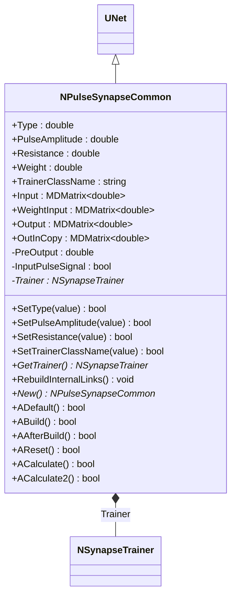
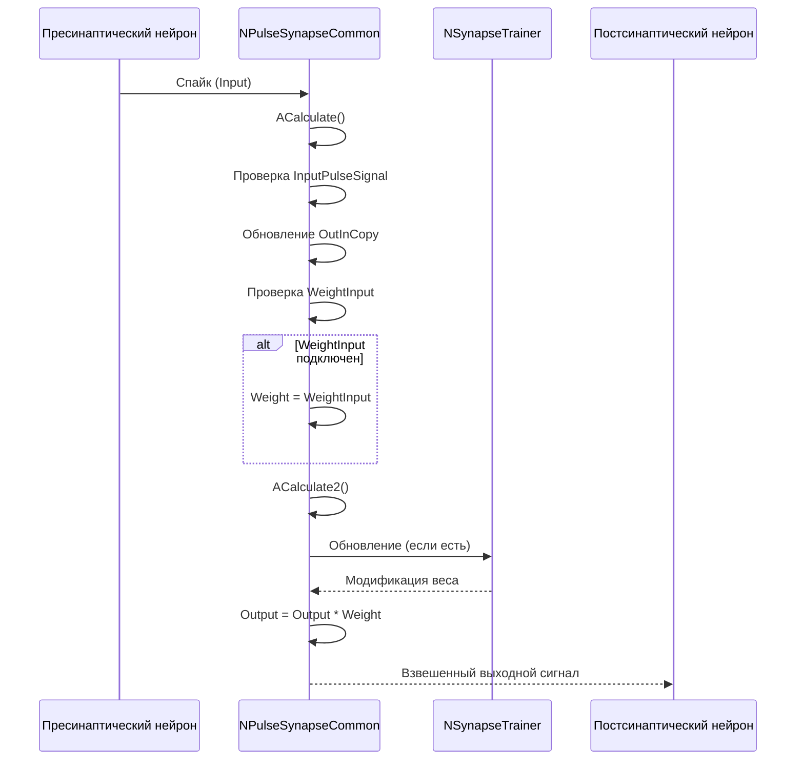
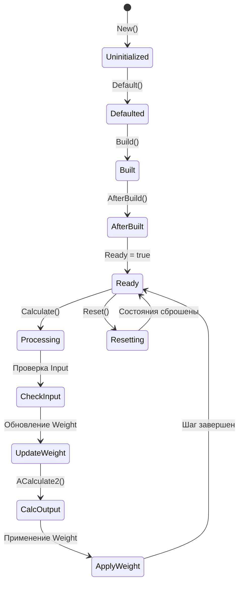
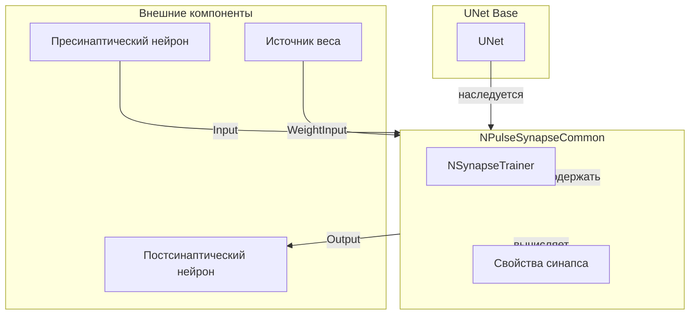
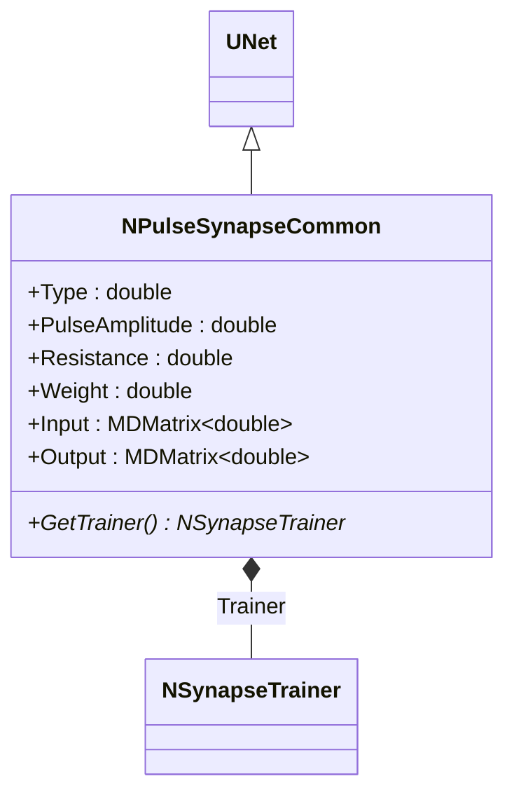
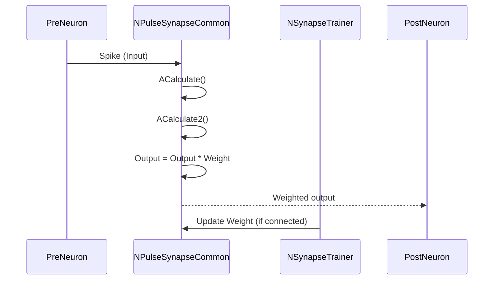
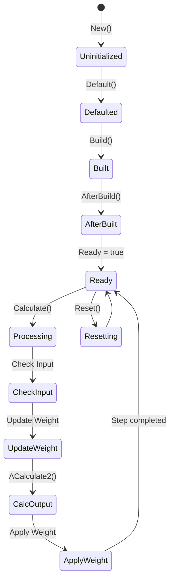
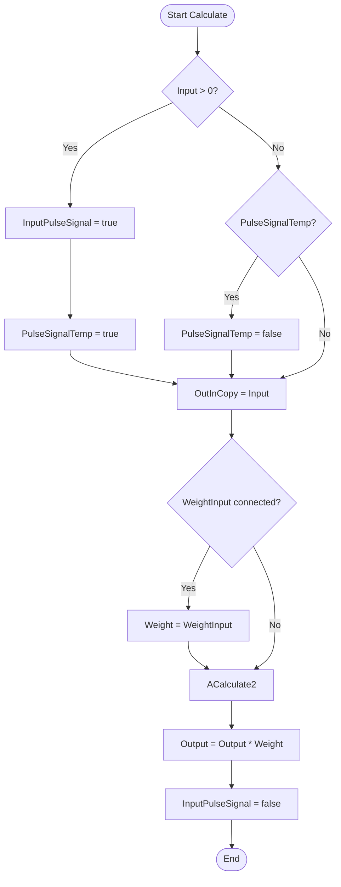
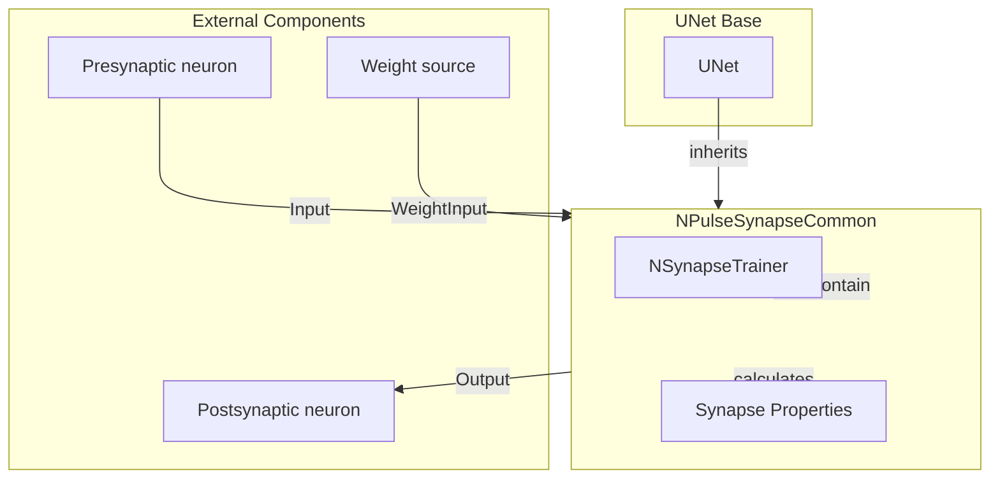

# NPulseSynapseCommon — общий импульсный синапс

## RU

### Назначение

**Класс**: `NPulseSynapseCommon` — базовый класс для импульсных синапсов с общей функциональностью.  
**Регистрация**: `NPulseLibrary.cpp` → `UploadClass("NPulseSynapseCommon", ...)`.  
**Storage-инстансы**: `ClassName = "NPulseSynapseCommon"` (обычно используется через наследников).

`NPulseSynapseCommon` является базовым классом для всех импульсных синапсов в библиотеке PulseLib. Наследуется от `UNet` и предоставляет базовую функциональность для передачи импульсов между нейронами, управления весом синапса и интеграции с тренерами синапсов.

### UML-диаграмма классов



**Иерархия наследования:**
- `UNet` (Rdk) — базовый класс для сетей компонентов
- `NPulseSynapseCommon` — общий импульсный синапс

**Ключевые свойства:**
- Параметры синапса: `Type`, `PulseAmplitude`, `Resistance`, `Weight`
- Входы/выходы: `Input`, `WeightInput`, `Output`, `OutInCopy`
- Тренер: `Trainer` (опциональный компонент для обучения синапса)

### UML-диаграмма последовательности



**Жизненный цикл:**
1. **Инициализация**: Установка параметров по умолчанию
2. **Сборка**: Построение структуры синапса
3. **После сборки**: Создание тренера (если указан `TrainerClassName`)
4. **Расчет**: Обработка входного сигнала, применение веса, генерация выходного сигнала

### UML-диаграмма состояний



**Состояния:**
- **Uninitialized** — создан, но не инициализирован
- **Defaulted** — параметры установлены по умолчанию
- **Built** — структура синапса построена
- **AfterBuilt** — выполняется постобработка (создание тренера)
- **Ready** — готов к обработке сигналов
- **Processing** — обработка входного сигнала
- **CheckInput** — проверка наличия входного сигнала
- **UpdateWeight** — обновление веса из WeightInput
- **CalcOutput** — расчет выходного сигнала
- **ApplyWeight** — применение веса к выходному сигналу
- **Resetting** — выполняется сброс состояний

### UML-диаграмма активности


**Алгоритм расчета:**
1. Проверка входного сигнала и установка флагов импульса
2. Копирование входного сигнала в `OutInCopy`
3. Обновление веса из `WeightInput` (если подключен)
4. Вызов `ACalculate2()` для расчета выходного сигнала
5. Применение веса к выходному сигналу
6. Сброс флага `InputPulseSignal`

### UML-диаграмма компонентов



**Зависимости:**
- **Базовый класс**: `UNet`
- **Опциональные компоненты**: `NSynapseTrainer` (тренер синапса)
- **Внешние компоненты**: пресинаптический нейрон (источник `Input`), постсинаптический нейрон (получатель `Output`), источник веса (источник `WeightInput`)

### Свойства

#### Параметры (ptPubParameter)

- **`Type`** (double) — тип синапса:
  - < 0 — тормозной (ингибиторный) синапс
  - > 0 — возбуждающий (эксайтаторный) синапс
  Значение по умолчанию: -1 (тормозной)

- **`PulseAmplitude`** (double) — амплитуда входных импульсов. Определяет силу передаваемого сигнала. Значение по умолчанию: 1.0

- **`Resistance`** (double) — сопротивление синапса. Используется для расчета выходного сигнала. Значение по умолчанию: 10.0

- **`Weight`** (double) — вес синапса (эффективность синапса). Применяется к выходному сигналу. Может изменяться тренером или внешним источником через `WeightInput`. Значение по умолчанию: 1.0

- **`TrainerClassName`** (string) — имя класса тренера синапса. Если указано, тренер создается автоматически при сборке. Значение по умолчанию: пустая строка (тренер не создается)

#### Входные свойства (ptInput | ptPubState)

- **`Input`** (MDMatrix<double>) — входной сигнал (пресинаптический спайк). Подключается к выходу пресинаптического нейрона.

- **`WeightInput`** (MDMatrix<double>) — входной сигнал для веса. Если подключен, вес синапса обновляется из этого источника на каждом шаге расчета.

#### Выходные свойства (ptOutput | ptPubState)

- **`Output`** (MDMatrix<double>) — выходной сигнал синапса. Рассчитывается в `ACalculate2()` и умножается на `Weight`. Подключается к входу постсинаптического нейрона.

- **`OutInCopy`** (MDMatrix<double>) — копия входного сигнала на выходе. Используется для отладки и мониторинга.

#### Защищенные состояния (ptPubState)

- **`PreOutput`** (double) — предыдущий выходной сигнал. Используется в некоторых реализациях `ACalculate2()`.

- **`InputPulseSignal`** (bool) — флаг активного входного импульса. Устанавливается в `true`, когда входной сигнал становится положительным, сбрасывается в `false` в конце шага расчета.

- **`PulseSignalTemp`** (bool) — временный флаг для отслеживания переходов входного сигнала.

#### Внутренние компоненты

- **`Trainer`** (NSynapseTrainer*) — указатель на тренер синапса. Создается автоматически при сборке, если указан `TrainerClassName`. Может быть `nullptr`, если тренер не используется.

### Методы

#### Публичные методы

- **`New()`** → `NPulseSynapseCommon*` — создает новый экземпляр класса.

- **`GetTrainer()`** → `NSynapseTrainer*` — возвращает указатель на тренер синапса. Возвращает `nullptr`, если тренер не создан.

- **`RebuildInternalLinks()`** → `void` — перестраивает внутренние связи тренера (если он существует).

#### Защищенные методы установки параметров

- **`SetType(const double &value)`** → `bool` — устанавливает тип синапса.

- **`SetPulseAmplitude(const double &value)`** → `bool` — устанавливает амплитуду импульсов.

- **`SetResistance(const double &value)`** → `bool` — устанавливает сопротивление синапса.

- **`SetTrainerClassName(const std::string &value)`** → `bool` — устанавливает имя класса тренера. Тренер будет создан при следующей сборке.

#### Защищенные методы жизненного цикла

- **`ADefault()`** → `bool` — инициализирует параметры по умолчанию. Устанавливает `Type=-1`, `PulseAmplitude=1`, `Resistance=10.0`, `Weight=1.0`, инициализирует выходные матрицы нулями.

- **`ABuild()`** → `bool` — строит структуру синапса. Базовая реализация не выполняет дополнительных действий.

- **`AAfterBuild()`** → `bool` — выполняется после сборки. Создает тренер синапса, если указан `TrainerClassName`.

- **`AReset()`** → `bool` — сбрасывает состояния синапса. Обнуляет `PreOutput`, сбрасывает флаги импульсов.

- **`ACalculate()`** → `bool` — выполняет расчет синапса на одном шаге. Обрабатывает входной сигнал, обновляет вес, вызывает `ACalculate2()`, применяет вес к выходному сигналу.

- **`ACalculate2()`** → `bool` — виртуальный метод для расчета выходного сигнала. Должен быть переопределен в производных классах. Базовая реализация устанавливает `Output = PreOutput`.

### Примеры использования

#### Пример 1: Создание синапса в коде C++

```cpp
// Создание синапса
auto synapse = storage->CreateComponent<NPulseSynapseCommon>();
synapse->SetName("Synapse1");

// Инициализация
synapse->Default();

// Настройка параметров
synapse->Type = 1.0;              // Возбуждающий синапс
synapse->PulseAmplitude = 1.0;    // Амплитуда импульсов
synapse->Resistance = 10.0;       // Сопротивление
synapse->Weight = 0.5;            // Начальный вес
synapse->TrainerClassName = "NSynapseTrainerStdp"; // Тренер STDP

// Подключение к нейронам
auto preNeuron = storage->GetComponent("PreNeuron");
auto postNeuron = storage->GetComponent("PostNeuron");

// Создание связей
network->CreateLink("PreNeuron", "Output", "Synapse1", "Input");
network->CreateLink("Synapse1", "Output", "PostNeuron", "Input");

// Сборка
synapse->Build();

// Использование
for (int step = 0; step < 1000; step++) {
    network->Calculate();
    double output = synapse->Output(0, 0);
    double weight = synapse->Weight;
    std::cout << "Step " << step << ": Output = " << output 
              << ", Weight = " << weight << std::endl;
}
```

#### Пример 2: Конфигурация XML

```xml
<Synapse1 Class="NPulseSynapseCommon">
    <Parameters>
        <Type>1</Type>
        <PulseAmplitude>1.0</PulseAmplitude>
        <Resistance>10.0</Resistance>
        <Weight>0.5</Weight>
        <TrainerClassName>NSynapseTrainerStdp</TrainerClassName>
    </Parameters>
</Synapse1>
```

### Использование в конфигурациях

`NPulseSynapseCommon` обычно не используется напрямую в конфигурациях. Вместо него используются специализированные классы:

- `NSynapseStdp` — для STDP-синапсов
- `NPulseSynapseStdp` — для импульсных STDP-синапсов
- `NPulseHebbSynapse` — для синапсов Хебба
- `NSynapseClassic` — для классических синапсов

## Источники

См. [Literature-References.md](../Literature-References.md): **[A]**, **4**, **25**, **29**.

### См. также

- [`NSynapseStdp`](NSynapseStdp.md) — синапс с STDP
- [`NPulseSynapseStdp`](NPulseSynapseStdp.md) — импульсный STDP-синапс
- [`NPulseHebbSynapse`](NPulseHebbSynapse.md) — синапс Хебба
- [`NSynapseTrainerStdp`](NSynapseTrainerStdp.md) — тренер STDP-синапсов
- [Architecture.md](../Architecture.md) — архитектура библиотеки

---

## EN

### Purpose

**Class**: `NPulseSynapseCommon` — base class for spiking synapses with common functionality.  
**Registration**: `NPulseLibrary.cpp` → `UploadClass("NPulseSynapseCommon", ...)`.  
**Instances**: `ClassName = "NPulseSynapseCommon"` (typically used via derived classes).

`NPulseSynapseCommon` is the base class for all spiking synapses in the PulseLib library. It inherits from `UNet` and provides basic functionality for transmitting impulses between neurons, managing synapse weight, and integrating with synapse trainers.

### UML Class Diagram



### UML Sequence Diagram



### UML State Diagram



### UML Activity Diagram



### UML Component Diagram



### Properties

`NPulseSynapseCommon` uses the following properties:

**Parameters:**
- `Type` (double) — synapse type (-1 for excitatory, 1 for inhibitory)
- `PulseAmplitude` (double) — pulse amplitude
- `Resistance` (double) — synapse resistance
- `Weight` (double) — synapse weight
- `TrainerClassName` (string) — trainer class name

**Input properties:**
- `Input` (MDMatrix<double>) — input signal from presynaptic neuron
- `WeightInput` (MDMatrix<double>) — input signal for weight (if connected)

**Output properties:**
- `Output` (MDMatrix<double>) — output signal (weighted input)
- `OutInCopy` (MDMatrix<double>) — copy of input signal

**Internal components:**
- `Trainer` (NSynapseTrainer*) — synapse trainer (optional)

### Methods

`NPulseSynapseCommon` uses the following methods:

- `GetTrainer()` → `NSynapseTrainer*` — get synapse trainer
- `RebuildInternalLinks()` → `void` — rebuild internal trainer links
- `SetType(value)` → `bool` — set synapse type
- `SetPulseAmplitude(value)` → `bool` — set pulse amplitude
- `SetResistance(value)` → `bool` — set synapse resistance
- `SetTrainerClassName(value)` → `bool` — set trainer class name
- `ADefault()` → `bool` — initialize default parameters
- `ABuild()` → `bool` — build synapse structure
- `AAfterBuild()` → `bool` — create trainer if specified
- `AReset()` → `bool` — reset synapse state
- `ACalculate()` → `bool` — perform one calculation step
- `ACalculate2()` → `bool` — calculate output (virtual, must be overridden)

### Usage in configurations

`NPulseSynapseCommon` is used as a base class for all spiking synapses:

- **Base class**: Used as base for all spiking synapse types
- **Signal transmission**: Transmits signals from presynaptic to postsynaptic neuron
- **Weight management**: Manages synapse weight and supports weight training
- **Trainer support**: Supports optional synapse trainers for learning

**Features:**
- Weight support: multiplies input by weight for output
- Trainer support: optional trainer for weight modification
- Pulse detection: detects input pulses and tracks pulse signals
- Type support: supports excitatory and inhibitory synapses

**Typical parameter values:**
- **Type**: -1 (excitatory) or 1 (inhibitory)
- **PulseAmplitude**: 1.0 (default pulse amplitude)
- **Resistance**: 10.0 (default resistance)
- **Weight**: 1.0 (default weight)

### References

See [Literature-References.md](../Literature-References.md): **[A]**, **4**, **25**, **29**.

### See Also

- [`NSynapseStdp`](NSynapseStdp.md) — STDP synapse
- [`NPulseSynapseStdp`](NPulseSynapseStdp.md) — spiking STDP synapse
- [`NPulseHebbSynapse`](NPulseHebbSynapse.md) — Hebb synapse
- [`NSynapseTrainerStdp`](NSynapseTrainerStdp.md) — STDP synapse trainer
- [Architecture.md](../Architecture.md) — library architecture
