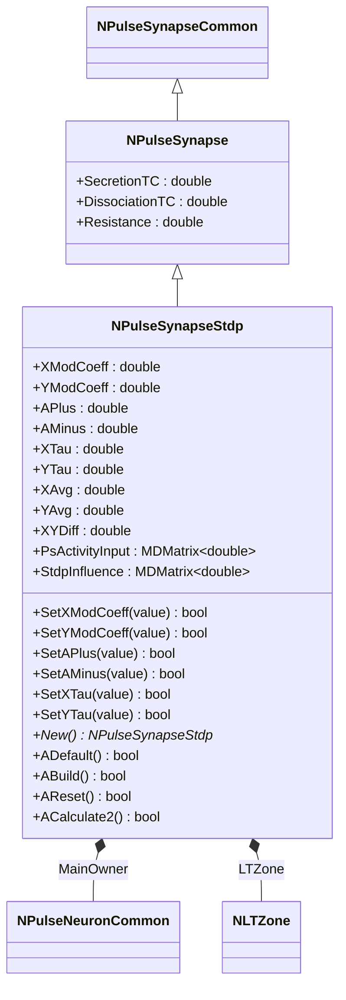
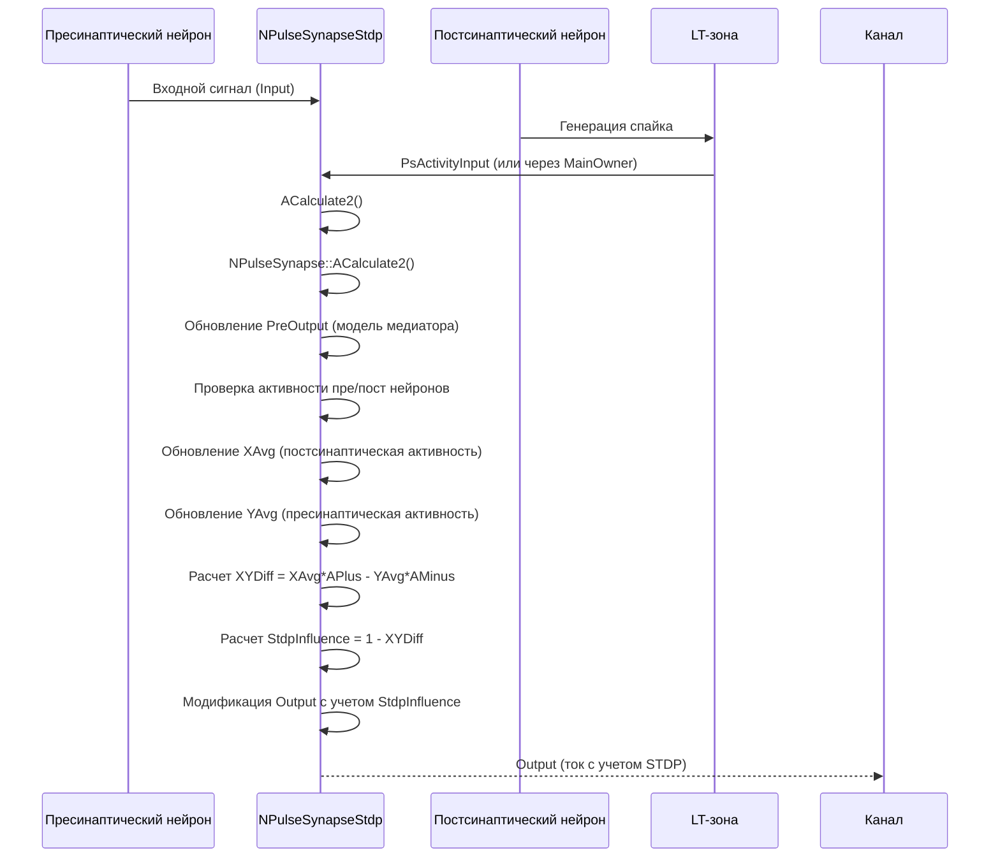
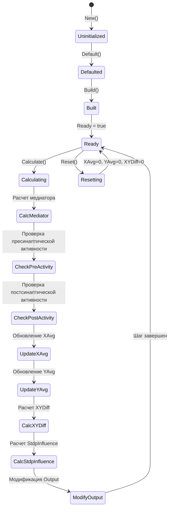
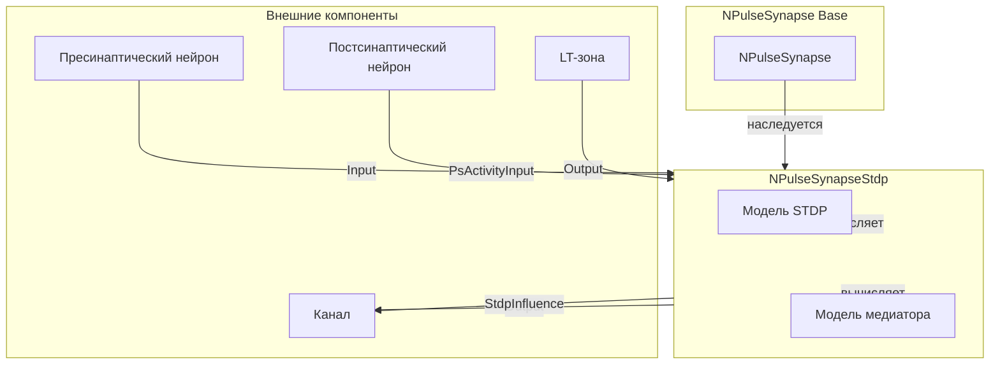
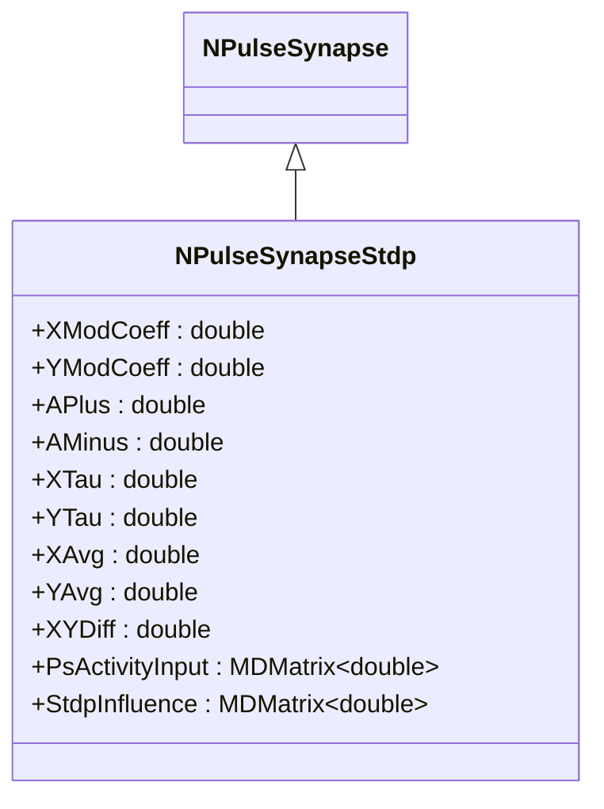
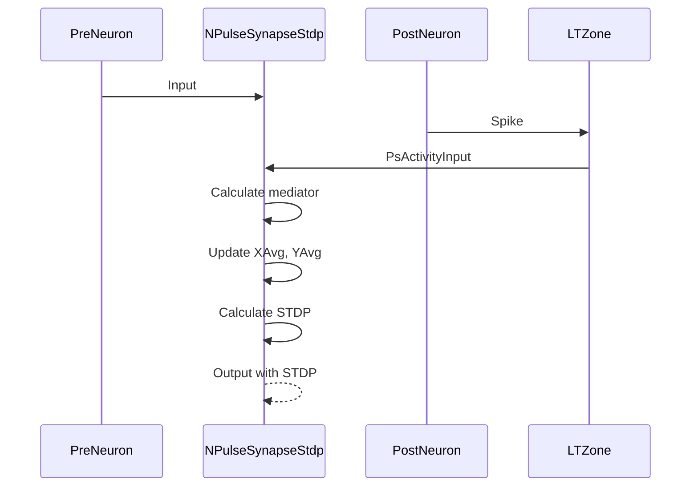
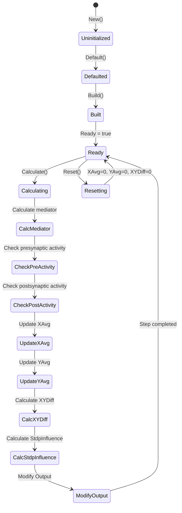
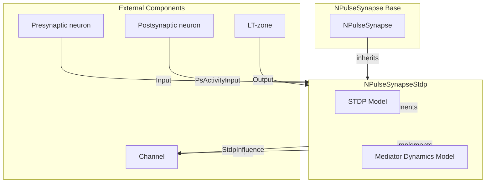

# NPulseSynapseStdp — импульсный синапс с STDP

## RU

### Назначение

**Класс**: `NPulseSynapseStdp` — импульсный синапс с поддержкой STDP-обучения и моделью медиатора.  
**Аббревиатура**: `STDP` — **S**pike-**T**iming **D**ependent **P**lasticity (пластичность, зависящая от времени спайков).  
**Регистрация**: `NPulseLibrary.cpp` → `UploadClass("NPulseSynapseStdp", ...)`.  
**Storage-инстансы**: `ClassName = "NPulseSynapseStdp"` в `Bin/Configs/*/Model_*.xml`.

`NPulseSynapseStdp` реализует импульсный синапс с комбинацией модели динамики медиатора (`NPulseSynapse`) и механизма STDP-обучения. Отслеживает активность пресинаптического и постсинаптического нейронов, рассчитывает влияние STDP на вес синапса и интегрирует его с выходным током синапса.

**Использование:** Моделирование синаптической передачи с STDP-обучением, изучение пластичности синапсов

### UML-диаграмма классов



**Иерархия наследования:**
- `NPulseSynapseCommon` — общий импульсный синапс
- `NPulseSynapse` — импульсный синапс с моделью медиатора
- `NPulseSynapseStdp` — импульсный синапс с STDP

**Ключевые свойства:**
- Параметры STDP: `XModCoeff`, `YModCoeff`, `APlus`, `AMinus`, `XTau`, `YTau`
- Состояния STDP: `XAvg` (средняя активность постсинаптического нейрона), `YAvg` (средняя активность пресинаптического нейрона), `XYDiff` (разница влияний)
- Входы/выходы: `PsActivityInput` (активность постсинаптического нейрона), `StdpInfluence` (влияние STDP на вес)

### UML-диаграмма последовательности



**Жизненный цикл:**
1. **Инициализация**: Установка параметров STDP по умолчанию
2. **Расчет медиатора**: Выполнение расчета базового синапса (`NPulseSynapse::ACalculate2()`)
3. **Отслеживание активности**: Определение активности пресинаптического и постсинаптического нейронов
4. **Обновление STDP**: Расчет средних активностей и их разницы
5. **Применение STDP**: Модификация выходного тока с учетом влияния STDP

### UML-диаграмма состояний



### UML-диаграмма активности

```mermaid
flowchart TD
    Start([Start Calculate]) --> CallBase[NPulseSynapse::ACalculate2]
    CallBase --> CheckInput{Input подключен?}
    CheckInput -->|Нет| End([End])
    CheckInput -->|Да| CheckInputPulse{Input > 0?}
    CheckInputPulse -->|Да| SetPreActive[is_input_pulse_active = true]
    CheckInputPulse -->|Нет| SetPreInactive[is_input_pulse_active = false]
    SetPreActive --> CheckPostActivity
    SetPreInactive --> CheckPostActivity{Проверка постсинаптической активности}
    CheckPostActivity -->|PsActivityInput подключен| CheckPsInput{PsActivityInput > 0?}
    CheckPostActivity -->|!PsActivityInput| CheckLTZone{LTZone->Output > 0?}
    CheckPsInput -->|Да| SetPostActive[is_output_pulse_active = true]
    CheckPsInput -->|Нет| SetPostInactive[is_output_pulse_active = false]
    CheckLTZone -->|Да| SetPostActive
    CheckLTZone -->|Нет| SetPostInactive
    SetPostActive --> UpdateXAvg{is_output_pulse_active?}
    SetPostInactive --> UpdateXAvg
    UpdateXAvg -->|Да| XAvgSecretion[XAvg += (XModCoeff - XAvg) / (XTau * TimeStep)]
    UpdateXAvg -->|Нет| XAvgDissociation[XAvg -= XAvg / (XTau * TimeStep)]
    XAvgSecretion --> UpdateYAvg{is_input_pulse_active?}
    XAvgDissociation --> UpdateYAvg
    UpdateYAvg -->|Да| YAvgSecretion[YAvg += (YModCoeff - YAvg) / (YTau * TimeStep)]
    UpdateYAvg -->|Нет| YAvgDissociation[YAvg -= YAvg / (YTau * TimeStep)]
    YAvgSecretion --> CalcXYDiff
    YAvgDissociation --> CalcXYDiff[Расчет XYDiff]
    Note over CalcXYDiff: x_avg_res = is_output_pulse_active ? XAvg * APlus : 0
    Note over CalcXYDiff: y_avg_res = is_input_pulse_active ? YAvg * AMinus : 0
    Note over CalcXYDiff: XYDiff += (x_avg_res - y_avg_res) / TimeStep
    CalcXYDiff --> CalcStdpInfluence[StdpInfluence = 1 - XYDiff]
    CalcStdpInfluence --> ClampStdp{StdpInfluence < 0?}
    ClampStdp -->|Да| SetZero[StdpInfluence = 0]
    ClampStdp -->|Нет| End
    SetZero --> End
```

**Алгоритм расчета STDP:**
1. Расчет базового синапса (модель медиатора)
2. Определение активности пресинаптического нейрона (`is_input_pulse_active`)
3. Определение активности постсинаптического нейрона (`is_output_pulse_active`) через `PsActivityInput` или `LTZone->Output`
4. Обновление средних активностей:
   - `XAvg` (постсинаптическая): увеличивается при активности постнейрона, уменьшается при отсутствии
   - `YAvg` (пресинаптическая): увеличивается при активности пренейрона, уменьшается при отсутствии
5. Расчет разницы влияний: `XYDiff += (XAvg*APlus - YAvg*AMinus) / TimeStep`
6. Расчет влияния STDP: `StdpInfluence = 1 - XYDiff` (ограничивается снизу нулем)

### UML-диаграмма компонентов



### Свойства

#### Параметры (ptPubParameter)

- **`XModCoeff`** (double) — коэффициент модуляции для постсинаптической активности. Определяет максимальное значение `XAvg`. Значение по умолчанию: 1.0

- **`YModCoeff`** (double) — коэффициент модуляции для пресинаптической активности. Определяет максимальное значение `YAvg`. Значение по умолчанию: 1.0

- **`APlus`** (double) — амплитуда усиления при постсинаптической активности. Определяет влияние постсинаптического спайка на увеличение веса. Значение по умолчанию: 1.0

- **`AMinus`** (double) — амплитуда ослабления при пресинаптической активности. Определяет влияние пресинаптического спайка на уменьшение веса. Значение по умолчанию: 1.0

- **`XTau`** (double) — постоянная времени для постсинаптической активности (в секундах). Определяет скорость изменения `XAvg`. Значение по умолчанию: 1e-2 (10 мс)

- **`YTau`** (double) — постоянная времени для пресинаптической активности (в секундах). Определяет скорость изменения `YAvg`. Значение по умолчанию: 1e-3 (1 мс)

**Наследуемые параметры от NPulseSynapse:**
- `SecretionTC` (double) — постоянная времени выделения медиатора
- `DissociationTC` (double) — постоянная времени распада медиатора
- `Resistance` (double) — сопротивление синапса
- `PulseAmplitude` (double) — амплитуда импульса
- `UsePulseSignal` (bool) — использовать импульсные сигналы
- `UsePresynapticInhibition` (bool) — использовать пресинаптическое торможение
- `InhibitionCoeff` (double) — коэффициент пресинаптического торможения
- `TypicalPulseDuration` (double) — типовая длительность импульса

#### Входные свойства (ptInput | ptPubState)

**Наследуемые от NPulseSynapse:**
- **`Input`** (MDMatrix<double>) — входной сигнал от пресинаптического нейрона

- **`PsActivityInput`** (MDMatrix<double>) — входной сигнал активности постсинаптического нейрона. Если подключен, используется вместо `LTZone->Output` для определения постсинаптической активности.

#### Выходные свойства (ptOutput | ptPubState)

**Наследуемые от NPulseSynapse:**
- **`Output`** (MDMatrix<double>) — выходной ток синапса. Рассчитывается с учетом модели медиатора и влияния STDP.

- **`StdpInfluence`** (MDMatrix<double>) — влияние STDP на вес синапса. Рассчитывается как `StdpInfluence = max(1 - XYDiff, 0)`. Используется для модификации веса синапса.

#### Состояния (ptPubState)

- **`XAvg`** (double) — средняя активность постсинаптического нейрона. Интегрируется согласно экспоненциальному закону с постоянной времени `XTau`. Начальное значение: 0.0

- **`YAvg`** (double) — средняя активность пресинаптического нейрона. Интегрируется согласно экспоненциальному закону с постоянной времени `YTau`. Начальное значение: 0.0

- **`XYDiff`** (double) — разница влияний STDP. Интегрируется как `XYDiff += (XAvg*APlus - YAvg*AMinus) / TimeStep`. Начальное значение: 0.0

**Наследуемые состояния от NPulseSynapse:**
- `PreOutput` (double) — концентрация медиатора
- `InputPulseSignal` (bool) — флаг наличия импульсного входного сигнала
- `PulseCounter` (int) — счетчик длительности импульса

### Методы

#### Публичные методы

- **`New()`** → `NPulseSynapseStdp*` — создает новый экземпляр класса.

#### Защищенные методы жизненного цикла

- **`ADefault()`** → `bool` — инициализирует параметры по умолчанию. Устанавливает `XModCoeff=1.0`, `YModCoeff=1.0`, `APlus=1.0`, `AMinus=1.0`, `XTau=1e-2`, `YTau=1e-3`, вызывает `NPulseSynapse::ADefault()`.

- **`ABuild()`** → `bool` — строит структуру синапса. Вызывает `NPulseSynapse::ABuild()`.

- **`AReset()`** → `bool` — сбрасывает состояния синапса. Устанавливает `XAvg=0`, `YAvg=0`, `XYDiff=0`, обнуляет `StdpInfluence`, вызывает `NPulseSynapse::AReset()`.

- **`ACalculate2()`** → `bool` — выполняет расчет синапса на одном шаге. Вызывает `NPulseSynapse::ACalculate2()` для расчета медиатора, затем рассчитывает STDP и модифицирует выходной сигнал.

#### Методы установки параметров

- **`SetXModCoeff(const double &value)`** → `bool` — устанавливает коэффициент модуляции для постсинаптической активности.

- **`SetYModCoeff(const double &value)`** → `bool` — устанавливает коэффициент модуляции для пресинаптической активности.

- **`SetAPlus(const double &value)`** → `bool` — устанавливает амплитуду усиления. Проверяет, что значение > 0.

- **`SetAMinus(const double &value)`** → `bool` — устанавливает амплитуду ослабления. Проверяет, что значение > 0.

- **`SetXTau(const double &value)`** → `bool` — устанавливает постоянную времени для постсинаптической активности. Проверяет, что значение > 0.

- **`SetYTau(const double &value)`** → `bool` — устанавливает постоянную времени для пресинаптической активности. Проверяет, что значение > 0.

### Примеры использования

#### Пример 1: Создание синапса в коде C++

```cpp
// Создание STDP-синапса
auto synapse = storage->CreateComponent<NPulseSynapseStdp>();
synapse->SetName("StdpSynapse");

// Инициализация
synapse->Default();

// Настройка параметров STDP
synapse->XModCoeff = 1.0;      // Коэффициент модуляции постсинаптической активности
synapse->YModCoeff = 1.0;      // Коэффициент модуляции пресинаптической активности
synapse->APlus = 0.01;         // Амплитуда усиления
synapse->AMinus = 0.012;       // Амплитуда ослабления
synapse->XTau = 0.02;          // Постоянная времени постсинаптической активности (20 мс)
synapse->YTau = 0.01;          // Постоянная времени пресинаптической активности (10 мс)

// Настройка параметров медиатора
synapse->SecretionTC = 0.001;  // Постоянная времени выделения (1 мс)
synapse->DissociationTC = 0.01; // Постоянная времени распада (10 мс)
synapse->Resistance = 1.0e9;   // Сопротивление синапса
synapse->Type = 1.0;           // Возбуждающий синапс

// Сборка
synapse->Build();

// Использование
for (int step = 0; step < 10000; step++) {
    synapse->Calculate();
    double output = synapse->Output(0, 0);
    double stdpInfluence = synapse->StdpInfluence(0, 0);
    double xAvg = synapse->XAvg;
    double yAvg = synapse->YAvg;
    
    if (step % 1000 == 0) {
        std::cout << "Step " << step << ": Output = " << output 
                  << ", STDP Influence = " << stdpInfluence
                  << ", XAvg = " << xAvg << ", YAvg = " << yAvg << std::endl;
    }
}
```

#### Пример 2: Конфигурация XML

```xml
<Synapse1 Class="NPulseSynapseStdp">
    <Parameters>
        <Type>1</Type>
        <PulseAmplitude>1.0</PulseAmplitude>
        <Resistance>1.0e9</Resistance>
        <Weight>1.0</Weight>
        <SecretionTC>0.001</SecretionTC>
        <DissociationTC>0.01</DissociationTC>
        <XModCoeff>1.0</XModCoeff>
        <YModCoeff>1.0</YModCoeff>
        <APlus>0.01</APlus>
        <AMinus>0.012</AMinus>
        <XTau>0.02</XTau>
        <YTau>0.01</YTau>
        <UsePulseSignal>1</UsePulseSignal>
        <UsePresynapticInhibition>0</UsePresynapticInhibition>
    </Parameters>
</Synapse1>
```

### Использование в конфигурациях

`NPulseSynapseStdp` используется в экспериментах по STDP-обучению:

- Моделирование синаптической пластичности
- Изучение механизмов STDP
- Обучение нейросетей с помощью STDP

**Типичные значения параметров STDP:**

1. **Стандартный STDP**: APlus=0.01, AMinus=0.012, XTau=0.02, YTau=0.01
2. **Асимметричный STDP**: APlus=0.015, AMinus=0.01, XTau=0.03, YTau=0.01
3. **Симметричный STDP**: APlus=0.01, AMinus=0.01, XTau=0.02, YTau=0.02

### См. также

- [`NPulseSynapse`](NPulseSynapse.md) — импульсный синапс с моделью медиатора
- [`NSynapseStdp`](NSynapseStdp.md) — STDP-синапс (базовый)
- [`NPulseSynapseCommon`](NPulseSynapseCommon.md) — общий импульсный синапс
- [`NPulseNeuronCommon`](NPulseNeuronCommon.md) — общий импульсный нейрон
- [`NPulseLTZoneCommon`](NPulseLTZoneCommon.md) — общая импульсная LT-зона
- [Architecture.md](../Architecture.md) — архитектура библиотеки
- [Scientific-Background.md](../Scientific-Background.md) — научный фон (STDP, синаптическая пластичность)

---

## EN

### Purpose

**Class**: `NPulseSynapseStdp` — spiking synapse with STDP learning and neurotransmitter dynamics model.  
**Registration**: `NPulseLibrary.cpp` → `UploadClass("NPulseSynapseStdp", ...)`.  
**Instances**: `ClassName = "NPulseSynapseStdp"` in `Bin/Configs/*/Model_*.xml`.

`NPulseSynapseStdp` implements a spiking synapse combining neurotransmitter dynamics model (`NPulseSynapse`) with STDP learning mechanism. Tracks presynaptic and postsynaptic neuron activity, calculates STDP influence on synapse weight, and integrates it with synapse output current.

**Usage:** Modeling synaptic transmission with STDP learning, studying synaptic plasticity

### UML Class Diagram



### UML Sequence Diagram



### UML State Diagram



### UML Activity Diagram

```mermaid
flowchart TD
    Start([Start Calculate]) --> CallBase[Call NPulseSynapse::ACalculate2]
    CallBase --> CheckInput{Input connected?}
    CheckInput -->|No| End([End])
    CheckInput -->|Yes| CheckInputPulse{Input > 0?}
    CheckInputPulse -->|Yes| SetPreActive[is_input_pulse_active = true]
    CheckInputPulse -->|No| SetPreInactive[is_input_pulse_active = false]
    SetPreActive --> CheckPostActivity
    SetPreInactive --> CheckPostActivity{Check postsynaptic activity}
    CheckPostActivity -->|PsActivityInput connected| CheckPsInput{PsActivityInput > 0?}
    CheckPostActivity -->|!PsActivityInput| CheckLTZone{LTZone->Output > 0?}
    CheckPsInput -->|Yes| SetPostActive[is_output_pulse_active = true]
    CheckPsInput -->|No| SetPostInactive[is_output_pulse_active = false]
    CheckLTZone -->|Yes| SetPostActive
    CheckLTZone -->|No| SetPostInactive
    SetPostActive --> UpdateXAvg{is_output_pulse_active?}
    SetPostInactive --> UpdateXAvg
    UpdateXAvg -->|Yes| XAvgSecretion[XAvg += (XModCoeff - XAvg) / (XTau * TimeStep)]
    UpdateXAvg -->|No| XAvgDissociation[XAvg -= XAvg / (XTau * TimeStep)]
    XAvgSecretion --> UpdateYAvg{is_input_pulse_active?}
    XAvgDissociation --> UpdateYAvg
    UpdateYAvg -->|Yes| YAvgSecretion[YAvg += (YModCoeff - YAvg) / (YTau * TimeStep)]
    UpdateYAvg -->|No| YAvgDissociation[YAvg -= YAvg / (YTau * TimeStep)]
    YAvgSecretion --> CalcXYDiff
    YAvgDissociation --> CalcXYDiff[Calculate XYDiff]
    CalcXYDiff --> CalcStdpInfluence[StdpInfluence = 1 - XYDiff]
    CalcStdpInfluence --> ClampStdp{StdpInfluence < 0?}
    ClampStdp -->|Yes| SetZero[StdpInfluence = 0]
    ClampStdp -->|No| End
    SetZero --> End
```

### UML Component Diagram



### Usage in configurations

`NPulseSynapseStdp` is used in STDP learning experiments:

- Synaptic plasticity modeling with neurotransmitter dynamics
- STDP mechanism studies
- Neural network training with STDP

**Typical STDP parameter values:**

1. **Standard STDP**: APlus=0.01, AMinus=0.012, XTau=0.02, YTau=0.01
2. **Asymmetric STDP**: APlus=0.015, AMinus=0.01, XTau=0.03, YTau=0.01
3. **Symmetric STDP**: APlus=0.01, AMinus=0.01, XTau=0.02, YTau=0.02

### See Also

- [`NPulseSynapse`](NPulseSynapse.md) — spiking synapse with neurotransmitter model
- [`NSynapseStdp`](NSynapseStdp.md) — STDP synapse (base)
- [`NPulseSynapseCommon`](NPulseSynapseCommon.md) — common spiking synapse
- [Architecture.md](../Architecture.md) — library architecture
- [Scientific-Background.md](../Scientific-Background.md) — scientific background (STDP, synaptic plasticity)

