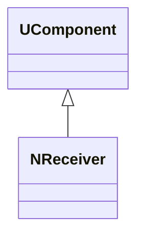
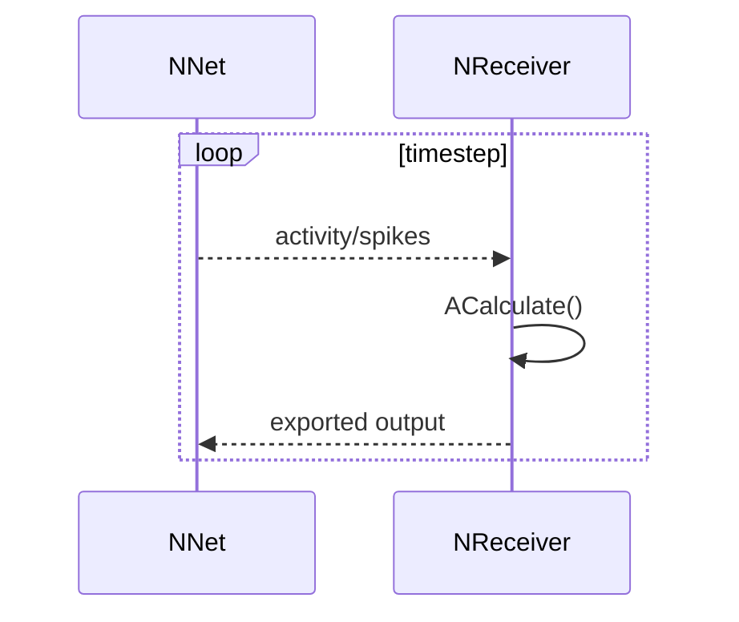
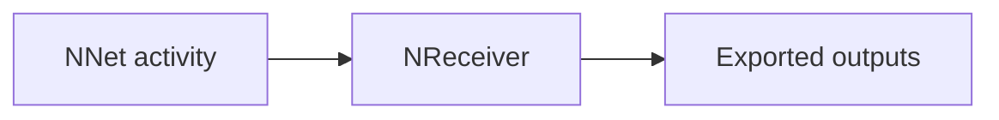
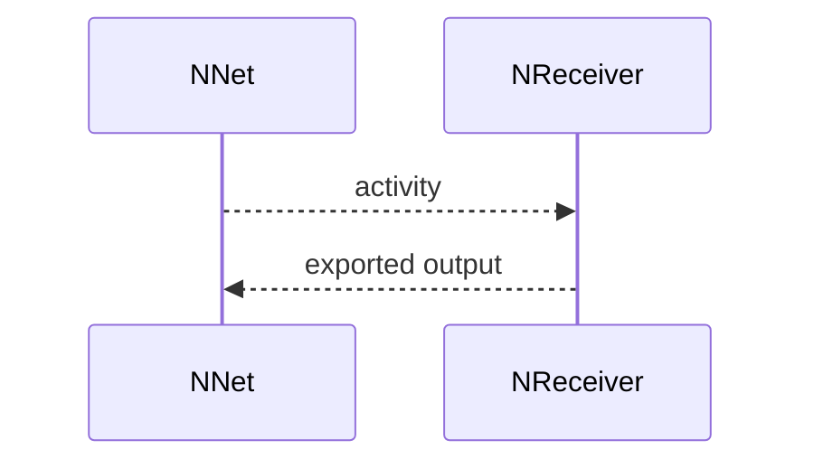

## NReceiver — приёмник выходов сети

**Класс**: `NReceiver` — принимает выходные сигналы/активность сети и преобразует/экспортирует их наружу.  
**Регистрация**: `NPulseLibrary.cpp` → `UploadClass("NReceiver", ...)`.  
**Storage-инстансы**: `ClassName = "NReceiver"`.

### Lifecycle
- **ADefault**: параметры приёма/агрегации.
- **ABuild**: подключение к выходам сети/слоёв.
- **AReset**: сброс накопителей.
- **ACalculate**: агрегация активности и выдача наружу.

### I/O
- Вход: активность/спайки (векторы/события).
- Выход: агрегированные признаки/значения (скаляры/векторы), пригодные для логирования/управления.



Пояснение: диаграмма классов показывает место компонента в иерархии и ключевые связи.



Пояснение: диаграмма последовательности показывает типовой сценарий взаимодействия и порядок вызовов.



Пояснение: блок-схема показывает поток данных/сигналов (входы → компонент → выходы).

### Config snippet

```ini
[Component]
ClassName = NReceiver
Name = Receiver1
```

---

## NReceiver — network output receiver (EN)

Consumes network outputs and exposes aggregated values for external use.


Description: this class diagram shows the component position in the type hierarchy and key relations.



Description: this sequence diagram shows a typical runtime interaction and call order.


Description: this flowchart shows the data/signal flow (inputs → component → outputs).
