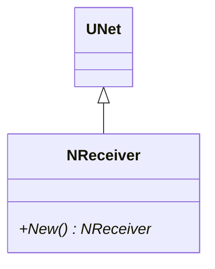
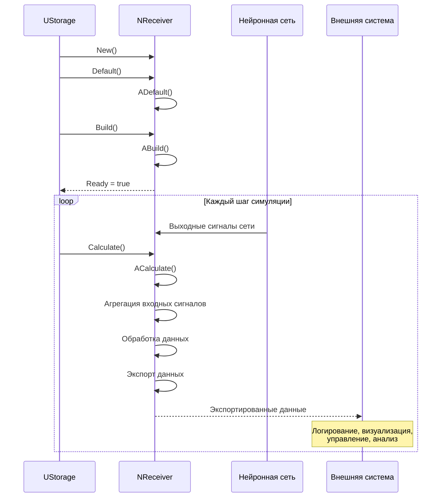
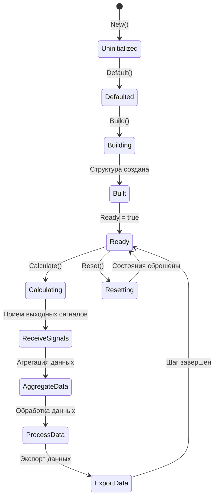
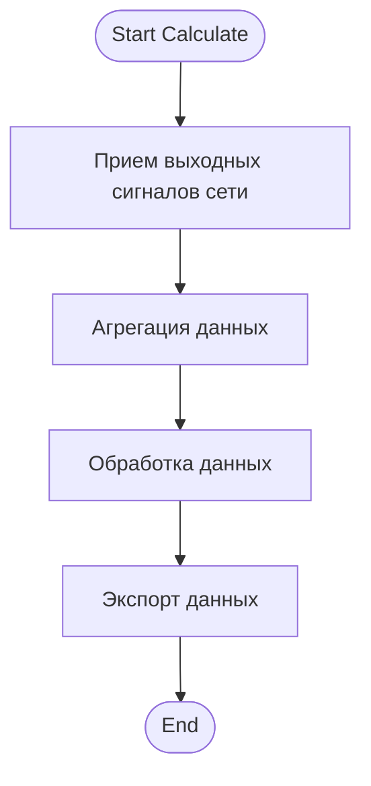
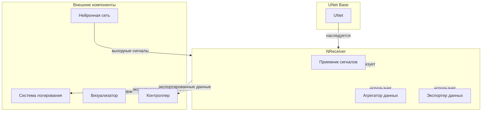
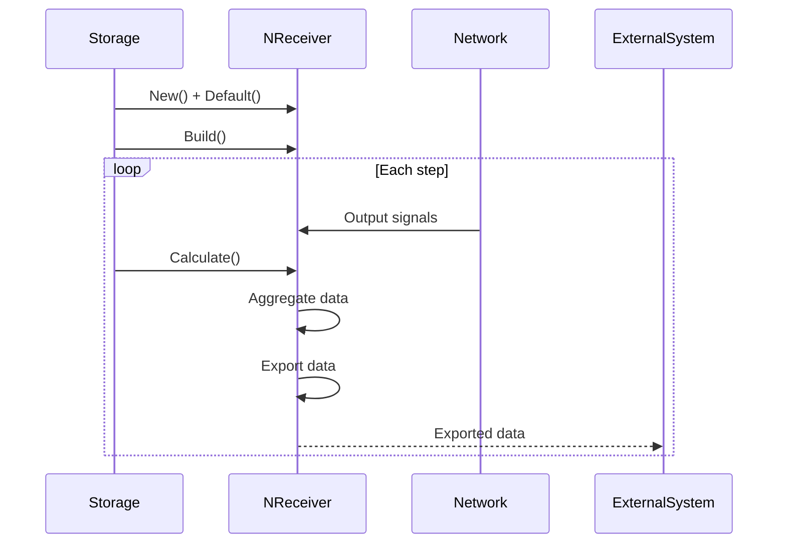
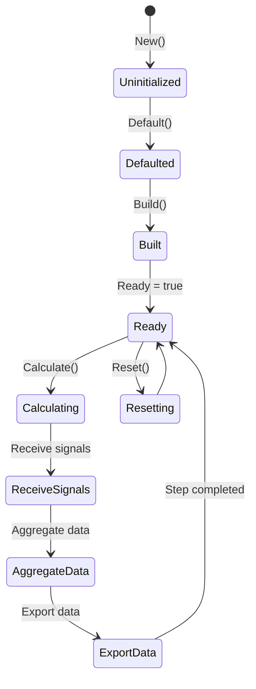
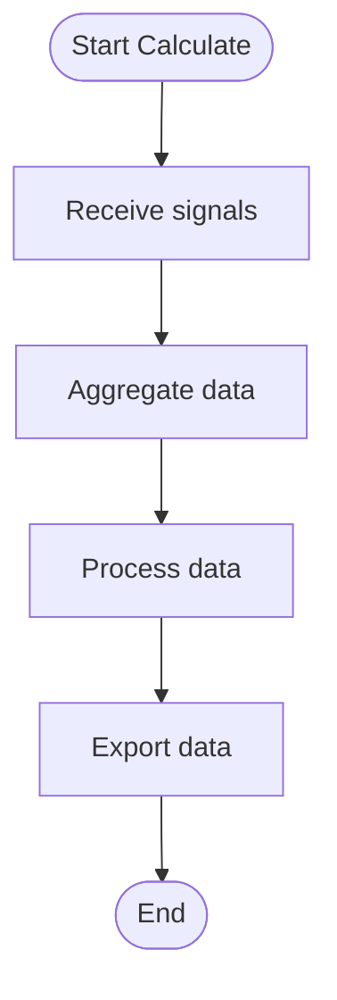
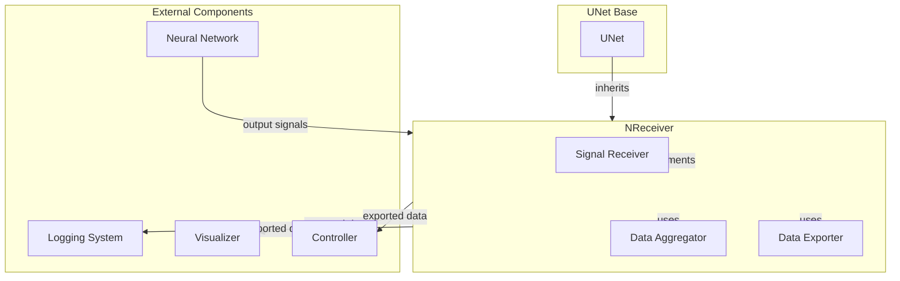

# NReceiver — приемник сигналов

## RU

### Назначение

**Класс**: `NReceiver` — компонент для приема выходных сигналов/активности сети и преобразования/экспорта их наружу.  
**Регистрация**: `NPulseLibrary.cpp` → `UploadClass("NReceiver", ...)`.  
**Storage-инстансы**: `ClassName = "NReceiver"` в `Bin/Configs/*/Model_*.xml`.

`NReceiver` реализует приемник, который принимает выходные сигналы сети, агрегирует их и экспортирует для внешнего использования (логирование, управление, визуализация). Компонент является базовым классом для приема и обработки выходных сигналов нейронных сетей.

**Использование:** Прием выходных сигналов сети, экспорт данных

### UML-диаграмма классов



**Иерархия наследования:**
- `UNet` — базовая сеть Rdk Framework
- `NReceiver` — приемник сигналов

### UML-диаграмма последовательности



**Жизненный цикл:**
1. **Инициализация**: Установка параметров по умолчанию
2. **Сборка**: Инициализация структуры приемника
3. **Расчет**: Прием выходных сигналов сети, агрегация, обработка, экспорт

### UML-диаграмма состояний



**Состояния:**
- **Uninitialized** — создан, но не инициализирован
- **Defaulted** — параметры установлены по умолчанию
- **Building** — выполняется сборка
- **Built** — структура приемника построена
- **Ready** — готов к выполнению расчетов
- **Calculating** — выполняется расчет приемника
- **ReceiveSignals** — прием выходных сигналов сети
- **AggregateData** — агрегация данных
- **ProcessData** — обработка данных
- **ExportData** — экспорт данных
- **Resetting** — выполняется сброс состояний

### UML-диаграмма активности



**Алгоритм расчета:**
1. Прием выходных сигналов сети
2. Агрегация данных от различных компонентов
3. Обработка данных (нормализация, фильтрация, преобразование)
4. Экспорт данных для внешнего использования (логирование, визуализация, управление)

### UML-диаграмма компонентов



**Зависимости:**
- **Базовый класс**: `UNet`
- **Внутренние компоненты**: приемник сигналов, агрегатор данных, экспортер данных
- **Внешние компоненты**: нейронная сеть (источник выходных сигналов), системы логирования, визуализации, управления (получатели экспортированных данных)

### Свойства

`NReceiver` является базовым классом и не имеет собственных публичных свойств. Производные классы могут добавлять входные и выходные свойства для приема и экспорта данных.

### Методы

#### Публичные методы

- **`New()`** → `NReceiver*` — создает новый экземпляр класса.

### Примеры использования

#### Пример 1: Создание приемника в коде C++

```cpp
// Создание приемника
auto receiver = storage->CreateComponent<NReceiver>();
receiver->SetName("Receiver");

// Инициализация
receiver->Default();

// Использование
receiver->Build();
```

### Использование в конфигурациях

`NReceiver` используется как базовый класс для приемников сигналов:

- **Приемники сигналов**: `Bin/Configs/!OldConfigs/*/Model_*.xml` (производные классы)

**Особенности:**
- Базовый класс: не используется напрямую, только через производные классы
- Прием сигналов: получает выходные сигналы нейронной сети
- Экспорт данных: экспортирует данные для внешнего использования (логирование, визуализация, управление)

### См. также

- [`NSource`](NSource.md) — источник сигналов
- [`NReceptor`](NReceptor.md) — рецептор
- [Architecture.md](../Architecture.md) — архитектура библиотеки

---

## EN

### Purpose

**Class**: `NReceiver` — component for receiving network output signals/activity and transforming/exporting them externally.  
**Registration**: `NPulseLibrary.cpp` → `UploadClass("NReceiver", ...)`.  
**Instances**: `ClassName = "NReceiver"` in `Bin/Configs/*/Model_*.xml`.

`NReceiver` implements receiver that receives network output signals, aggregates them, and exports for external use (logging, control, visualization). Component is base class for receiving and processing neural network output signals.

**Usage:** Receiving network output signals, data export

### UML Class Diagram


### UML Sequence Diagram



### UML State Diagram



### UML Activity Diagram



### UML Component Diagram



### Properties

`NReceiver` does not have its own public properties (UProperty). All properties are inherited from the base class `UNet`. Derived classes may add specific properties for data reception and export.

### Methods

- `New()` — creates new receiver instance
- `ADefault()` — sets default parameters (inherited from UNet)
- `ABuild()` — builds receiver structure (inherited from UNet)
- `AReset()` — resets receiver state (inherited from UNet)
- `ACalculate()` — performs one calculation step (receives signals, aggregates data, exports)

**Inherited methods from UNet:**
- `AddComponent()` — add component to receiver
- `CreateLink()` — create link between components
- `Default()` / `Build()` / `Reset()` / `Calculate()` — lifecycle methods

### Usage in configurations

`NReceiver` is used as base class for signal receivers:

- **Signal receivers**: `Bin/Configs/!OldConfigs/*/Model_*.xml` (derived classes)

**Features:**
- Base class: not used directly, only through derived classes
- Signal reception: receives network output signals
- Data export: exports data for external use (logging, visualization, control)

### See Also

- [`NSource`](NSource.md) — signal source
- [`NReceptor`](NReceptor.md) — receptor
- [Architecture.md](../Architecture.md) — library architecture
