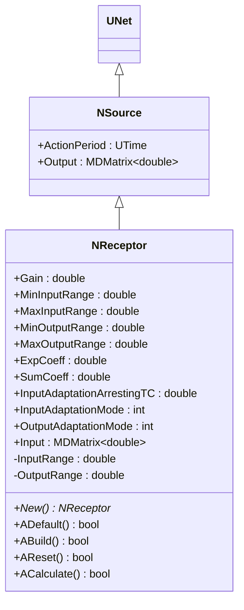
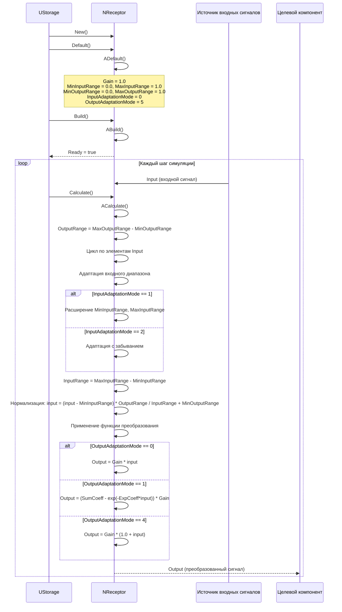
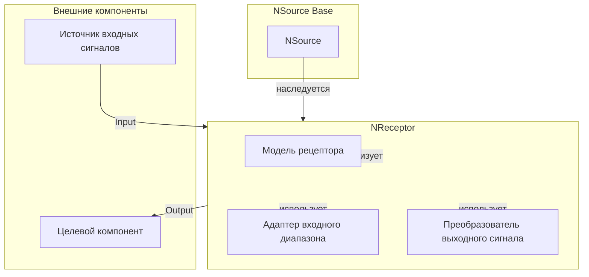
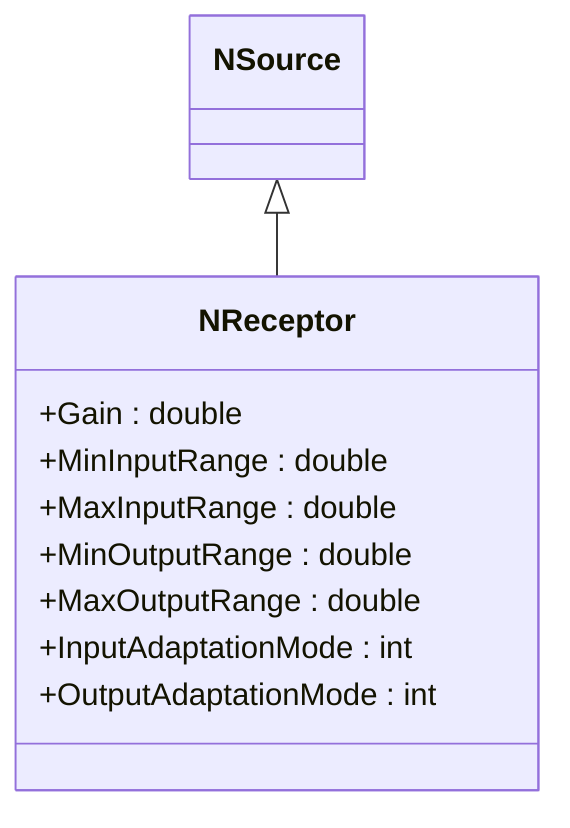
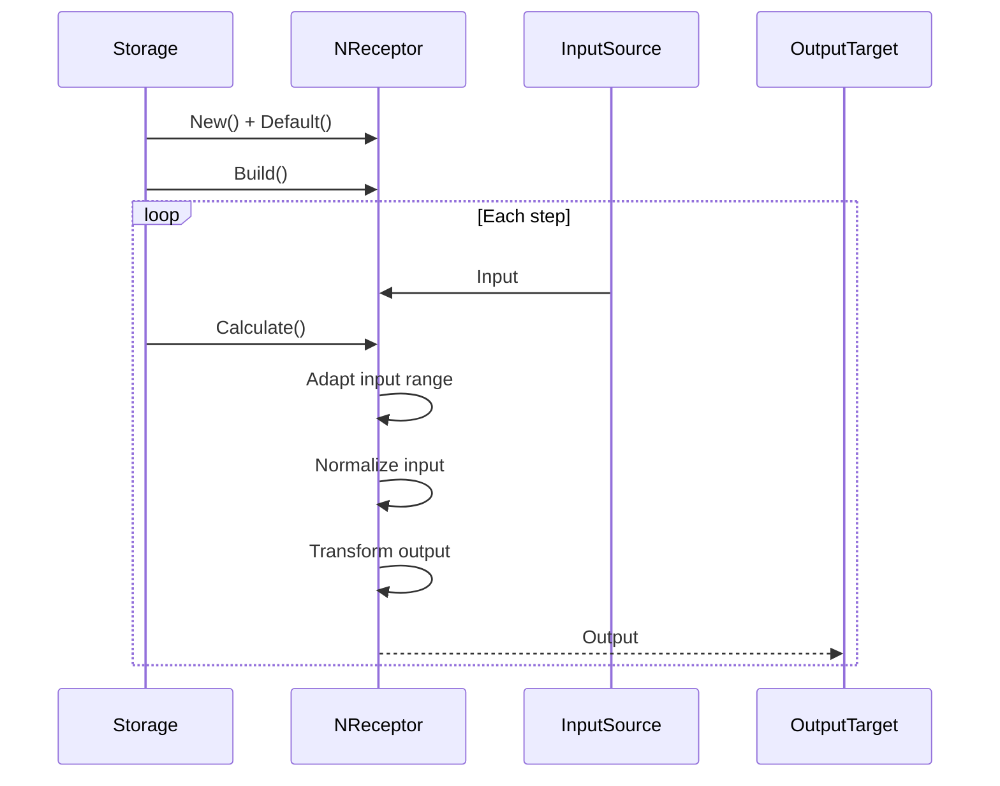
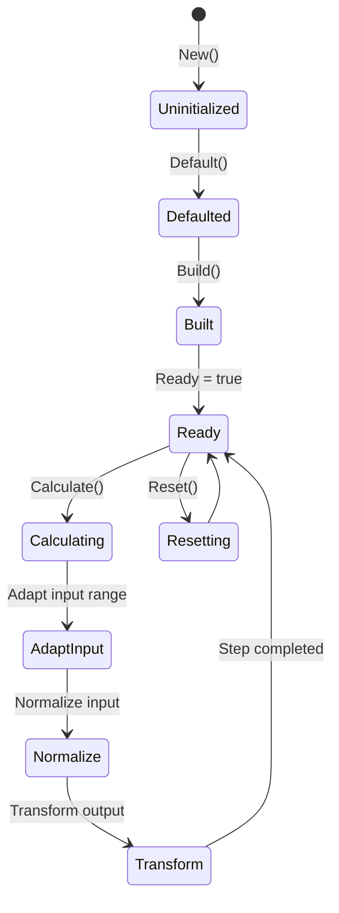
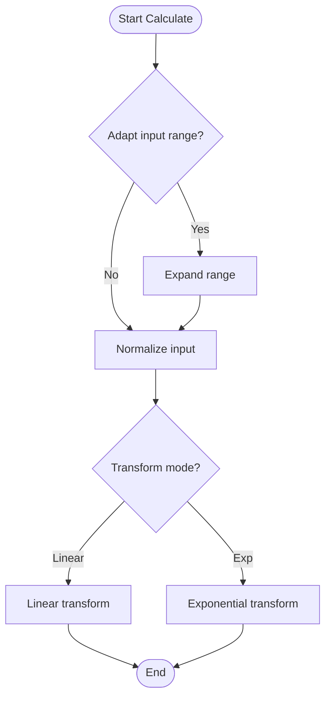
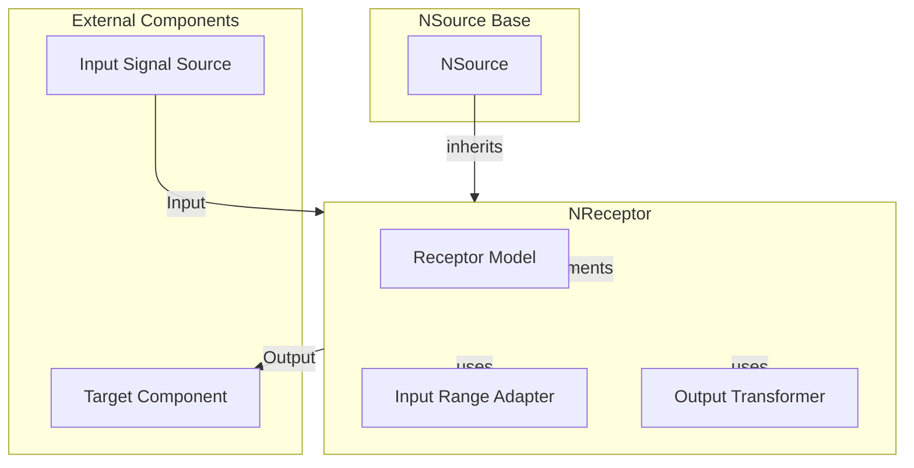

# NReceptor — рецептор

## RU

### Назначение

**Класс**: `NReceptor` — компонент для преобразования входных сигналов с адаптацией и различными режимами преобразования.  
**Регистрация**: `NPulseLibrary.cpp` → `UploadClass("NReceptor", ...)`.  
**Storage-инстансы**: `ClassName = "NReceptor"` в `Bin/Configs/*/Model_*.xml`.

`NReceptor` реализует рецептор, который преобразует входные сигналы (`Input`) в выходные сигналы (`Output`) с учетом коэффициента усиления (`Gain`), диапазонов входных и выходных значений, и различных режимов адаптации входов и выходов. Компонент поддерживает адаптацию диапазонов входных сигналов и различные функции преобразования выходных сигналов.

**Использование:** Преобразование входных сигналов, адаптация сигналов

### UML-диаграмма классов



**Иерархия наследования:**
- `UNet` — базовая сеть Rdk Framework
- `NSource` — базовый источник сигналов
- `NReceptor` — рецептор

### UML-диаграмма последовательности



**Жизненный цикл:**
1. **Инициализация**: Установка параметров по умолчанию (`Gain=1.0`, диапазоны входных/выходных значений)
2. **Сброс**: Инициализация диапазонов
3. **Расчет**: Адаптация входного диапазона, нормализация, применение функции преобразования

### UML-диаграмма состояний

```mermaid
stateDiagram-v2
    [*] --> Uninitialized: New()
    Uninitialized --> Defaulted: Default()
    Defaulted --> Building: Build()
    Building --> Built: Структура создана
    Built --> Ready: Ready = true
    Ready --> Resetting: Reset()
    Resetting --> Ready: Состояния сброшены
    Ready --> Calculating: Calculate()
    Calculating --> CalcOutputRange: OutputRange = MaxOutputRange - MinOutputRange
    CalcOutputRange --> LoopElements: Цикл по элементам Input
    LoopElements --> AdaptInput: Адаптация входного диапазона
    AdaptInput --> CheckInputMode{InputAdaptationMode?}
    CheckInputMode -->|0| Normalize: Нормализация
    CheckInputMode -->|1| ExpandRange: Расширение диапазона
    CheckInputMode -->|2| AdaptWithForgetting: Адаптация с забыванием
    ExpandRange --> Normalize
    AdaptWithForgetting --> Normalize
    Normalize --> CalcInputRange: InputRange = MaxInputRange - MinInputRange
    CalcInputRange --> Transform: Применение функции преобразования
    Transform --> CheckOutputMode{OutputAdaptationMode?}
    CheckOutputMode -->|0| Linear: Output = Gain * input
    CheckOutputMode -->|1| Exp1: Output = (SumCoeff - exp(-ExpCoeff*input)) * Gain
    CheckOutputMode -->|4| LinearGain: Output = Gain * (1.0 + input)
    CheckOutputMode -->|5| Other: Другой режим
    Linear --> CheckMoreElements: Есть еще элементы?
    Exp1 --> CheckMoreElements
    LinearGain --> CheckMoreElements
    Other --> CheckMoreElements
    CheckMoreElements -->|Да| LoopElements
    CheckMoreElements -->|Нет| Ready: Шаг завершен
```

**Состояния:**
- **Uninitialized** — создан, но не инициализирован
- **Defaulted** — параметры установлены по умолчанию
- **Building** — выполняется сборка
- **Built** — структура рецептора построена
- **Ready** — готов к выполнению расчетов
- **Resetting** — выполняется сброс состояний
- **Calculating** — выполняется расчет рецептора
- **CalcOutputRange** — вычисление выходного диапазона
- **LoopElements** — цикл по элементам входного сигнала
- **AdaptInput** — адаптация входного диапазона
- **CheckInputMode** — проверка режима адаптации входа
- **ExpandRange** — расширение диапазона
- **AdaptWithForgetting** — адаптация с забыванием
- **Normalize** — нормализация входного сигнала
- **CalcInputRange** — вычисление входного диапазона
- **Transform** — применение функции преобразования
- **CheckOutputMode** — проверка режима преобразования выхода
- **Linear** — линейное преобразование
- **Exp1** — экспоненциальное преобразование (режим 1)
- **LinearGain** — линейное преобразование с усилением
- **Other** — другой режим преобразования
- **CheckMoreElements** — проверка наличия еще элементов

### UML-диаграмма активности

```mermaid
flowchart TD
    Start([Start Calculate]) --> CalcOutputRange[OutputRange = MaxOutputRange - MinOutputRange]
    CalcOutputRange --> ResizeOutput[Output.Resize(Input->GetRows(), Input->GetCols())]
    ResizeOutput --> LoopRows[Цикл по строкам i = 0..Input->GetRows()-1]
    LoopRows --> LoopCols[Цикл по столбцам j = 0..Input->GetCols()-1]
    LoopCols --> GetInput[input = Input(i,j)]
    GetInput --> AdaptInput{InputAdaptationMode?}
    AdaptInput -->|0| Normalize[Нормализация]
    AdaptInput -->|1| ExpandRange[Расширение MinInputRange, MaxInputRange]
    AdaptInput -->|2| AdaptWithForgetting[Адаптация с забыванием]
    ExpandRange --> Normalize
    AdaptWithForgetting --> Normalize
    Normalize --> CalcInputRange[InputRange = MaxInputRange - MinInputRange]
    CalcInputRange --> CheckInputRange{InputRange == 0?}
    CheckInputRange -->|Да| End([End])
    CheckInputRange -->|Нет| NormalizeInput[input = (input - MinInputRange) * OutputRange / InputRange + MinOutputRange]
    NormalizeInput --> Transform{OutputAdaptationMode?}
    Transform -->|0| Linear[Output(i,j) = Gain * input]
    Transform -->|1| Exp1[Output(i,j) = (SumCoeff - exp(-ExpCoeff*input)) * Gain]
    Transform -->|4| LinearGain[Output(i,j) = Gain * (1.0 + input)]
    Transform -->|5| Other[Другой режим]
    Linear --> CheckMoreCols{Есть еще столбцы?}
    Exp1 --> CheckMoreCols
    LinearGain --> CheckMoreCols
    Other --> CheckMoreCols
    CheckMoreCols -->|Да| LoopCols
    CheckMoreCols -->|Нет| CheckMoreRows{Есть еще строки?}
    CheckMoreRows -->|Да| LoopRows
    CheckMoreRows -->|Нет| End
```

**Алгоритм расчета:**
1. Вычисление выходного диапазона: `OutputRange = MaxOutputRange - MinOutputRange`
2. Цикл по всем элементам входного сигнала
3. Адаптация входного диапазона (если `InputAdaptationMode > 0`):
   - Режим 1: расширение диапазона при выходе за границы
   - Режим 2: адаптация с забыванием (используя `InputAdaptationArrestingTC`)
4. Нормализация: `input = (input - MinInputRange) * OutputRange / InputRange + MinOutputRange`
5. Применение функции преобразования в зависимости от `OutputAdaptationMode`

### UML-диаграмма компонентов



**Зависимости:**
- **Базовый класс**: `NSource`
- **Внутренние компоненты**: модель рецептора, адаптер входного диапазона, преобразователь выходного сигнала
- **Внешние компоненты**: источник входных сигналов (источник `Input`), целевой компонент (получатель `Output`)

### Свойства

#### Параметры (ptPubParameter)

- **`Gain`** (double) — коэффициент усиления входного сигнала. Значение по умолчанию: 1.0

- **`MinInputRange`** (double) — минимальный диапазон входного сигнала. Используется для нормализации. Значение по умолчанию: 0.0

- **`MaxInputRange`** (double) — максимальный диапазон входного сигнала. Используется для нормализации. Значение по умолчанию: 1.0

- **`MinOutputRange`** (double) — минимальный диапазон выходного сигнала. Значение по умолчанию: 0.0

- **`MaxOutputRange`** (double) — максимальный диапазон выходного сигнала. Значение по умолчанию: 1.0

- **`ExpCoeff`** (double) — экспоненциальный коэффициент для режима 2. Значение по умолчанию: 0.1

- **`SumCoeff`** (double) — коэффициент суммы для режима 1. Значение по умолчанию: 1.0

- **`InputAdaptationArrestingTC`** (double) — постоянная времени адаптации входного диапазона (режим 2). Значение по умолчанию: 1.0

- **`InputAdaptationMode`** (int) — режим адаптации входного диапазона:
  - 0 — не адаптировать
  - 1 — адаптировать (расширять диапазон)
  - 2 — адаптировать с забыванием (используя `InputAdaptationArrestingTC`)
  Значение по умолчанию: 0

- **`OutputAdaptationMode`** (int) — режим адаптации выходного сигнала:
  - 0 — линейный
  - 1 — экспоненциальный: `y = (SumCoeff - exp(-ExpCoeff*x)) * Gain` для `x` в `[0; Gain]`
  - 2 — экспоненциальный: `y = exp(-Kx) * Gain`
  - 3 — экспоненциальный с `ExpCoeff`
  - 4 — линейный с усилением: `y = Gain * (1.0 + input)`
  - 5 — другой режим
  Значение по умолчанию: 5

#### Входные свойства (ptInput | ptPubState)

- **`Input`** (MDMatrix<double>) — входной сигнал рецептора. Значение по умолчанию: зависит от реализации

### Методы

- **`ACalculate()`** → `bool` — выполняет расчет рецептора:
  1. Адаптирует диапазон входных сигналов (если `InputAdaptationMode > 0`)
  2. Нормализует входной сигнал в диапазон `[MinInputRange, MaxInputRange]`
  3. Применяет функцию преобразования в зависимости от `OutputAdaptationMode`
  4. Масштабирует результат в диапазон `[MinOutputRange, MaxOutputRange]`
  5. Выдает результат как выходной сигнал

### Примеры использования

#### Пример 1: Создание рецептора в коде C++

```cpp
// Создание рецептора
auto receptor = storage->CreateComponent<NReceptor>();
receptor->SetName("Receptor");

// Инициализация
receptor->Default();

// Настройка параметров
receptor->Gain = 1.0;
receptor->MinInputRange = 0.0;
receptor->MaxInputRange = 1.0;
receptor->MinOutputRange = 0.0;
receptor->MaxOutputRange = 1.0;
receptor->InputAdaptationMode = 0;
receptor->OutputAdaptationMode = 0;

// Сборка
receptor->Build();
```

### Использование в конфигурациях

`NReceptor` используется в экспериментах с преобразованием входных сигналов:

- **Рецепторы**: `Bin/Configs/!OldConfigs/NReceptor/` (эксперименты с рецепторами)

**Типичные значения параметров:**
- **Gain**: 1.0 (коэффициент усиления)
- **MinInputRange**: 0.0, **MaxInputRange**: 1.0 (диапазон входных значений)
- **MinOutputRange**: 0.0, **MaxOutputRange**: 1.0 (диапазон выходных значений)
- **InputAdaptationMode**: 0 (не адаптировать), 1 (расширять диапазон), 2 (с забыванием)
- **OutputAdaptationMode**: 0 (линейный), 1 (экспоненциальный), 4 (линейный с усилением), 5 (другой)
- **ExpCoeff**: 0.1 (экспоненциальный коэффициент)
- **SumCoeff**: 1.0 (коэффициент суммы)
- **InputAdaptationArrestingTC**: 1.0 (постоянная времени адаптации)

**Особенности:**
- Адаптация входного диапазона: автоматическое расширение диапазона при выходе входных значений за границы
- Режимы преобразования: линейный, экспоненциальный, линейный с усилением
- Нормализация: автоматическая нормализация входных сигналов в заданный диапазон

## Источники

См. [Literature-References.md](../Literature-References.md): **25**, **29**.

### См. также

- [`NSource`](NSource.md) — базовый источник сигналов
- [`NReceiver`](NReceiver.md) — приемник сигналов
- [Architecture.md](../Architecture.md) — архитектура библиотеки

---

## EN

### Purpose

**Class**: `NReceptor` — component for input signal transformation with adaptation and various transformation modes.  
**Registration**: `NPulseLibrary.cpp` → `UploadClass("NReceptor", ...)`.  
**Instances**: `ClassName = "NReceptor"` in `Bin/Configs/*/Model_*.xml`.

`NReceptor` implements receptor that transforms input signals (`Input`) to output signals (`Output`) with gain (`Gain`), input and output ranges, and various adaptation modes. Component supports input range adaptation and various output transformation functions.

**Usage:** Input signal transformation, signal adaptation

### UML Class Diagram



### UML Sequence Diagram



### UML State Diagram



### UML Activity Diagram



### UML Component Diagram



### Properties

- `Gain` — коэффициент усиления
- `MinInputRange` — минимальное значение входного диапазона
- `MaxInputRange` — максимальное значение входного диапазона
- `MinOutputRange` — минимальное значение выходного диапазона
- `MaxOutputRange` — максимальное значение выходного диапазона
- `ExpCoeff` — коэффициент экспоненты (для режима 1)
- `SumCoeff` — коэффициент суммы (для режима 1)
- `InputAdaptationArrestingTC` — временная константа адаптации входа
- `InputAdaptationMode` — режим адаптации входа (0 — нет, 1 — расширение диапазона, 2 — с забыванием)
- `OutputAdaptationMode` — режим адаптации выхода (0 — линейный, 1 — экспоненциальный, 4 — линейный с усилением, 5 — другой)
- `Input` — входной сигнал
- `Output` — выходной сигнал (преобразованный)

### Methods

- `SetGain(value)` — установка коэффициента усиления
- `ADefault()` — установка параметров по умолчанию
- `ABuild()` — сборка структуры рецептора
- `AReset()` — сброс состояния (инициализация диапазонов)
- `ACalculate()` — выполнение шага преобразования сигнала

### Usage in configurations

`NReceptor` is used in input signal transformation experiments:

- **Receptors**: `Bin/Configs/!OldConfigs/NReceptor/` (receptor experiments)

**Typical parameter values:**
- **Gain**: 1.0 (gain coefficient)
- **MinInputRange**: 0.0, **MaxInputRange**: 1.0 (input value range)
- **MinOutputRange**: 0.0, **MaxOutputRange**: 1.0 (output value range)
- **InputAdaptationMode**: 0 (no adaptation), 1 (expand range), 2 (with forgetting)
- **OutputAdaptationMode**: 0 (linear), 1 (exponential), 4 (linear with gain), 5 (other)
- **ExpCoeff**: 0.1 (exponential coefficient)
- **SumCoeff**: 1.0 (sum coefficient)
- **InputAdaptationArrestingTC**: 1.0 (adaptation time constant)

**Features:**
- Input range adaptation: automatic range expansion when input values exceed boundaries
- Transformation modes: linear, exponential, linear with gain
- Normalization: automatic normalization of input signals to specified range

### References

See [Literature-References.md](../Literature-References.md): **25**, **29**.

### See Also

- [`NSource`](NSource.md) — base signal source
- [`NReceiver`](NReceiver.md) — signal receiver
- [Architecture.md](../Architecture.md) — library architecture
