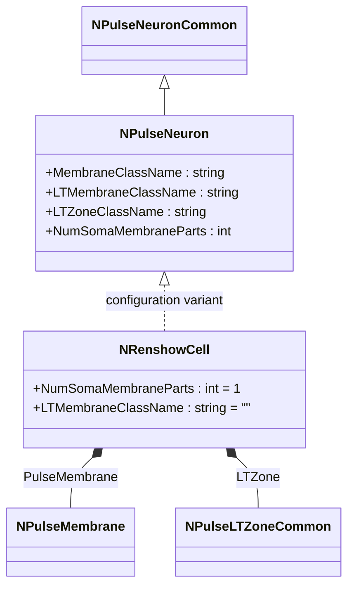
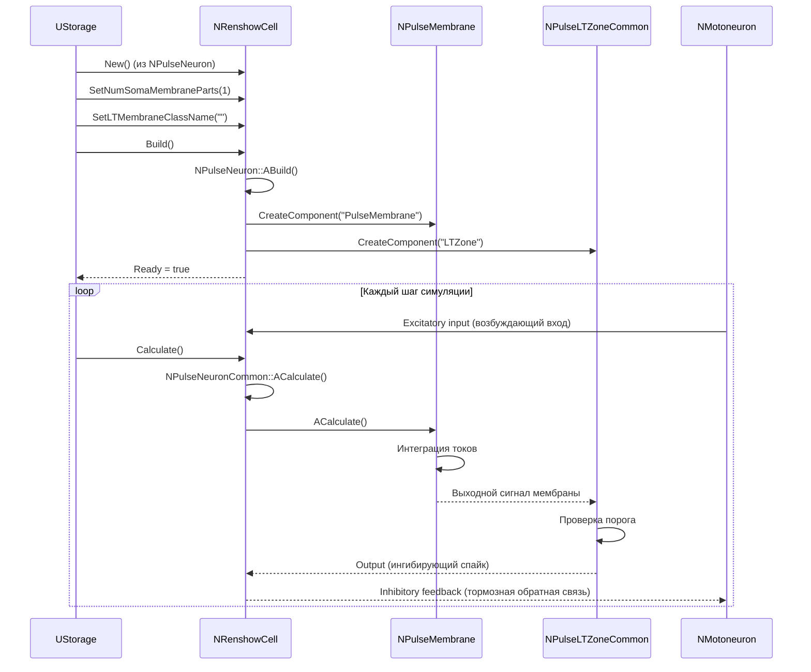
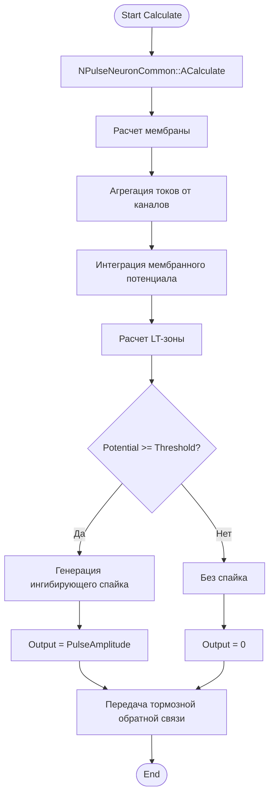
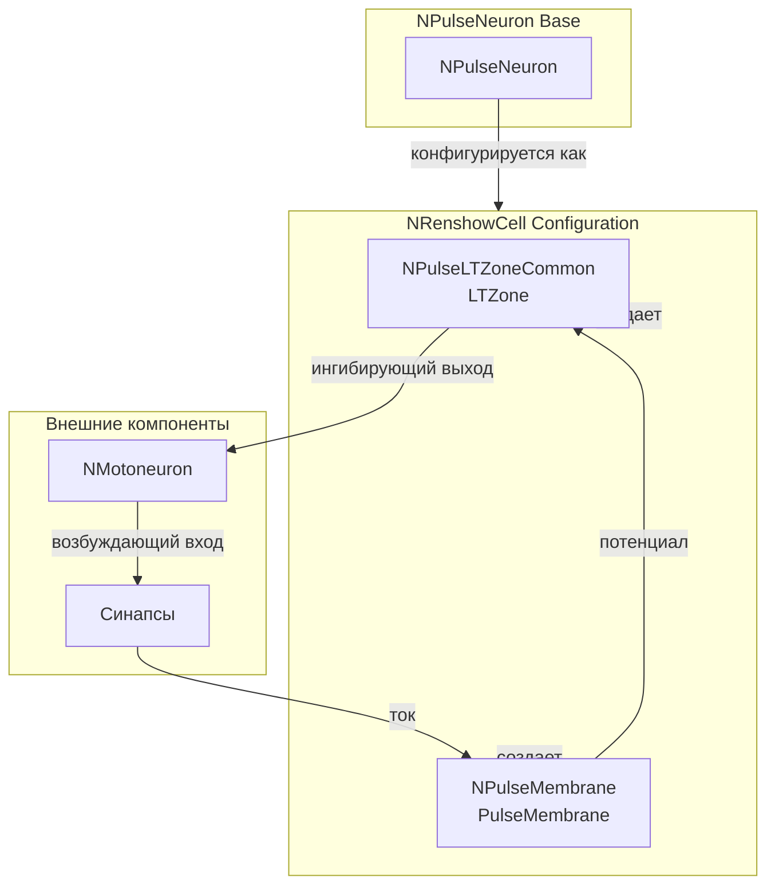
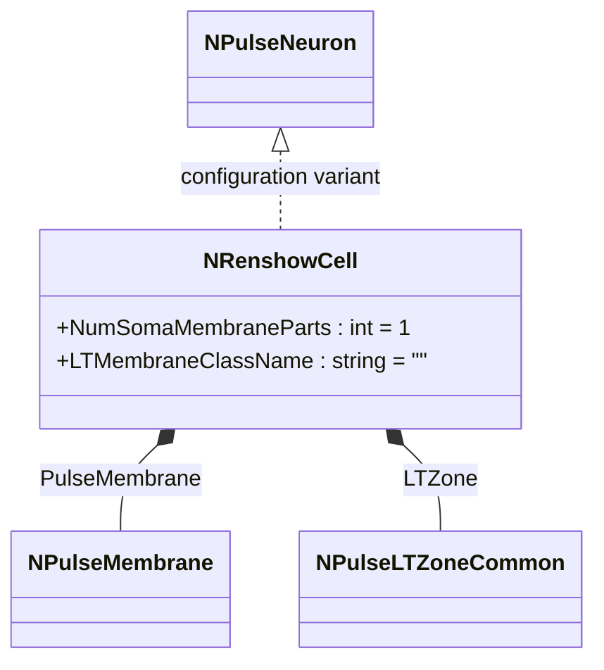
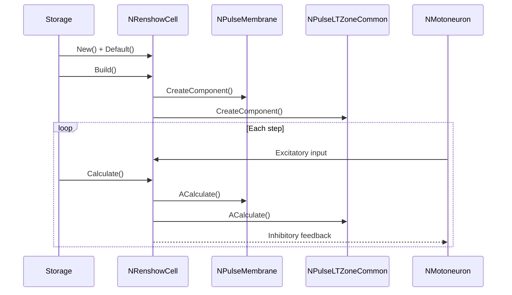
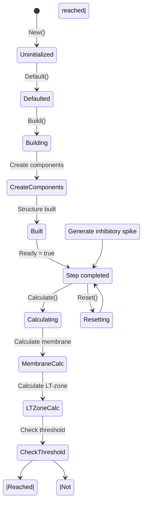
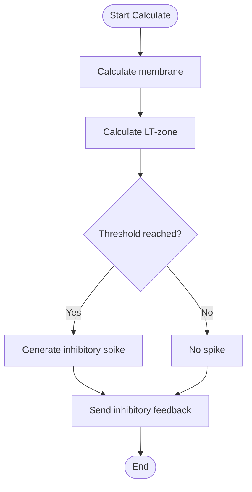
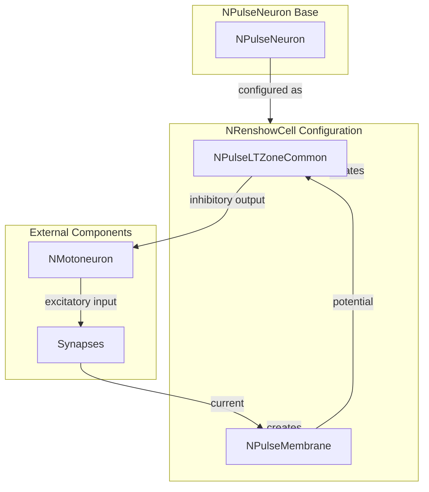

# NRenshowCell — клетка Реншоу

## RU

### Назначение

**Класс**: `NRenshowCell` — конфигурационный вариант клетки Реншоу (ингибирующий интернейрон) для моделирования реципрокного торможения.  
**Регистрация**: `NPulseLibrary.cpp` → `UploadClass("NRenshowCell", ...)`.  
**Storage-инстансы**: `ClassName = "NRenshowCell"` в `Bin/Configs/*/Model_*.xml`.

`NRenshowCell` является конфигурационным вариантом базового класса `NPulseNeuron` для моделирования клеток Реншоу — ингибирующих интернейронов, которые обеспечивают реципрокное торможение мотонейронов. Создается из `NPulseNeuron` с настройками:
- `NumSomaMembraneParts = 1` — одна часть сомы
- `LTMembraneClassName = ""` — без LT-мембраны
- Стандартная мембрана и LT-зона

Клетки Реншоу получают возбуждающие входы от мотонейронов и обеспечивают ингибирующую обратную связь, реализуя механизм реципрокного торможения.

**Использование:** Моделирование реципрокного торможения, двигательных систем

### UML-диаграмма классов



**Иерархия наследования:**
- `NPulseNeuronCommon` — общий импульсный нейрон
- `NPulseNeuron` — импульсный нейрон с параметрами структурирования
- `NRenshowCell` — конфигурационный вариант для клеток Реншоу

**Внутренняя структура:**
- **PulseMembrane** (`NPulseMembrane`) — стандартная мембрана нейрона
- **LTZone** (`NPulseLTZoneCommon`) — стандартная LT-зона

### UML-диаграмма последовательности



**Жизненный цикл:**
1. **Создание**: `NRenshowCell` создается из `NPulseNeuron` с настройкой параметров
2. **Настройка**: Устанавливается одна часть сомы, отсутствие LT-мембраны
3. **Сборка**: Автоматически создается структура нейрона с мембраной и LT-зоной
4. **Расчет**: На каждом шаге рассчитываются мембрана и LT-зона, генерируется ингибирующий выход

### UML-диаграмма состояний

```mermaid
stateDiagram-v2
    [*] --> Uninitialized: New()
    Uninitialized --> Defaulted: Default()
    Defaulted --> Configuring: Настройка Renshaw параметров
    Configuring --> SetRenshawParams: SetNumSomaMembraneParts(1)<br/>SetLTMembraneClassName("")
    SetRenshawParams --> Building: Build()
    Building --> BuildBase: NPulseNeuron::ABuild()
    BuildBase --> CreateMembrane: Создание NPulseMembrane
    CreateMembrane --> CreateLTZone: Создание NPulseLTZoneCommon
    CreateLTZone --> Built: Структура создана
    Built --> Ready: Ready = true
    Ready --> Calculating: Calculate()
    Calculating --> MembraneCalc: Расчет мембраны
    MembraneCalc --> LTZoneCalc: Расчет LT-зоны
    LTZoneCalc --> CheckThreshold: Проверка порога
    CheckThreshold -->|Порог достигнут| InhibitorySpike: Генерация ингибирующего спайка
    CheckThreshold -->|Порог не достигнут| Ready: Шаг завершен
    InhibitorySpike --> Ready
    Ready --> Resetting: Reset()
    Resetting --> Ready: Состояния сброшены
```

**Состояния:**
- **Uninitialized** — создан, но не инициализирован
- **Defaulted** — параметры установлены по умолчанию
- **Configuring** — настройка параметров для клетки Реншоу
- **SetRenshawParams** — установка параметров (одна часть сомы, без LT-мембраны)
- **Building** — выполняется сборка структуры
- **BuildBase** — сборка базовой структуры нейрона
- **CreateMembrane** — создание мембраны
- **CreateLTZone** — создание LT-зоны
- **Built** — структура нейрона построена
- **Ready** — готов к выполнению расчетов
- **Calculating** — выполняется расчет клетки Реншоу
- **MembraneCalc** — расчет мембраны
- **LTZoneCalc** — расчет LT-зоны
- **CheckThreshold** — проверка достижения порога
- **InhibitorySpike** — генерация ингибирующего спайка
- **Resetting** — выполняется сброс состояний

### UML-диаграмма активности



**Алгоритм расчета:**
1. Вызов базового расчета нейрона (`NPulseNeuronCommon::ACalculate`)
2. Расчет мембраны: агрегация токов от каналов, интеграция мембранного потенциала
3. Расчет LT-зоны: проверка порога
4. Генерация ингибирующего спайка при достижении порога
5. Передача тормозной обратной связи мотонейронам

### UML-диаграмма компонентов



**Зависимости:**
- **Базовый класс**: `NPulseNeuron` (конфигурационный вариант)
- **Внутренние компоненты**: `NPulseMembrane` (мембрана), `NPulseLTZoneCommon` (LT-зона)
- **Внешние компоненты**: мотонейроны (источники возбуждающих входов и получатели тормозной обратной связи), синапсы

### Свойства

`NRenshowCell` использует все свойства базового класса `NPulseNeuron` с параметрами:
- `NumSomaMembraneParts = 1` — одна часть сомы
- `LTMembraneClassName = ""` — без LT-мембраны
- Стандартная мембрана и LT-зона

### Методы

`NRenshowCell` использует все методы базового класса `NPulseNeuron`.

### Примеры использования

#### Пример 1: Создание клетки Реншоу в коде C++

```cpp
// Создание клетки Реншоу
auto cell = storage->CreateComponent("NRenshowCell");
cell->SetName("RenshowCell");

// Инициализация (использует параметры по умолчанию)
cell->Default();

// Сборка (автоматически создает NPulseMembrane, NPulseLTZoneCommon)
cell->Build();

// Использование
for (int step = 0; step < 1000; step++) {
    cell->Calculate();
    // Клетка Реншоу генерирует ингибирующие спайки в ответ на активность мотонейронов
}
```

#### Пример 2: Конфигурация XML

```xml
<RenshowCell1 Class="NRenshowCell">
    <Parameters>
        <!-- Параметры наследуются от NPulseNeuron -->
    </Parameters>
</RenshowCell1>
```

### Использование в конфигурациях

`NRenshowCell` используется в экспериментах с реципрокным торможением:

- **Реципрокное торможение**: `Bin/Configs/!OldConfigs/*/Model_*.xml` (где требуется моделирование клеток Реншоу)
- **Двигательные системы**: эксперименты с управлением движением и торможением мотонейронов

**Типичные значения параметров:**
- **NumSomaMembraneParts**: 1 (одна часть сомы)
- **LTMembraneClassName**: "" (без LT-мембраны)

**Особенности:**
- Реципрокное торможение: обеспечивает ингибирующую обратную связь мотонейронам
- Интернейрон: действует как ингибирующий интернейрон в двигательных цепях
- Обратная связь: получает возбуждающие входы от мотонейронов и генерирует ингибирующие выходы

## Источники

См. [Literature-References.md](../Literature-References.md): **19**, **20**, **21**, **22**, **28**, **31**.

### См. также

- [`NPulseNeuron`](NPulseNeuron.md) — импульсный нейрон с параметрами структурирования
- [`NMotoneuron`](NMotoneuron.md) — мотонейрон
- [`NNewRenshowCell`](NNewRenshowCell.md) — новая клетка Реншоу
- [`NSynRenshowCell`](NSynRenshowCell.md) — клетка Реншоу с оптимизированными синапсами
- [Architecture.md](../Architecture.md) — архитектура библиотеки

---

## EN

### Purpose

**Class**: `NRenshowCell` — configuration variant of Renshaw cell (inhibitory interneuron) for modeling reciprocal inhibition.  
**Registration**: `NPulseLibrary.cpp` → `UploadClass("NRenshowCell", ...)`.  
**Instances**: `ClassName = "NRenshowCell"` in `Bin/Configs/*/Model_*.xml`.

`NRenshowCell` is a configuration variant of the base class `NPulseNeuron` for modeling Renshaw cells — inhibitory interneurons that provide reciprocal inhibition of motor neurons. Created from `NPulseNeuron` with settings:
- `NumSomaMembraneParts = 1` — one soma part
- `LTMembraneClassName = ""` — without LT-membrane
- Standard membrane and LT-zone

Renshaw cells receive excitatory inputs from motor neurons and provide inhibitory feedback, implementing reciprocal inhibition mechanism.

**Usage:** Modeling reciprocal inhibition, motor systems

### UML Class Diagram



### UML Sequence Diagram



### UML State Diagram



### UML Activity Diagram



### UML Component Diagram



### Properties

`NRenshowCell` uses all properties of base class `NPulseNeuron` with parameters:
- `NumSomaMembraneParts = 1` — one soma part
- `LTMembraneClassName = ""` — without LT-membrane
- Standard membrane and LT-zone

### Methods

`NRenshowCell` uses all methods of base class `NPulseNeuron`.

### Usage in configurations

`NRenshowCell` is used in reciprocal inhibition experiments:

- **Reciprocal inhibition**: `Bin/Configs/!OldConfigs/*/Model_*.xml` (where Renshaw cells are required)
- **Motor systems**: experiments with movement control and motor neuron inhibition

**Typical parameter values:**
- **NumSomaMembraneParts**: 1 (one soma part)
- **LTMembraneClassName**: "" (without LT-membrane)

**Features:**
- Reciprocal inhibition: provides inhibitory feedback to motor neurons
- Interneuron: acts as inhibitory interneuron in motor circuits
- Feedback: receives excitatory inputs from motor neurons and generates inhibitory outputs

### References

See [Literature-References.md](../Literature-References.md): **19**, **20**, **21**, **22**, **28**, **31**.

### See Also

- [`NPulseNeuron`](NPulseNeuron.md) — spiking neuron with structuring parameters
- [`NMotoneuron`](NMotoneuron.md) — motor neuron
- [`NNewRenshowCell`](NNewRenshowCell.md) — new Renshaw cell
- [`NSynRenshowCell`](NSynRenshowCell.md) — Renshaw cell with optimized synapses
- [Architecture.md](../Architecture.md) — library architecture
