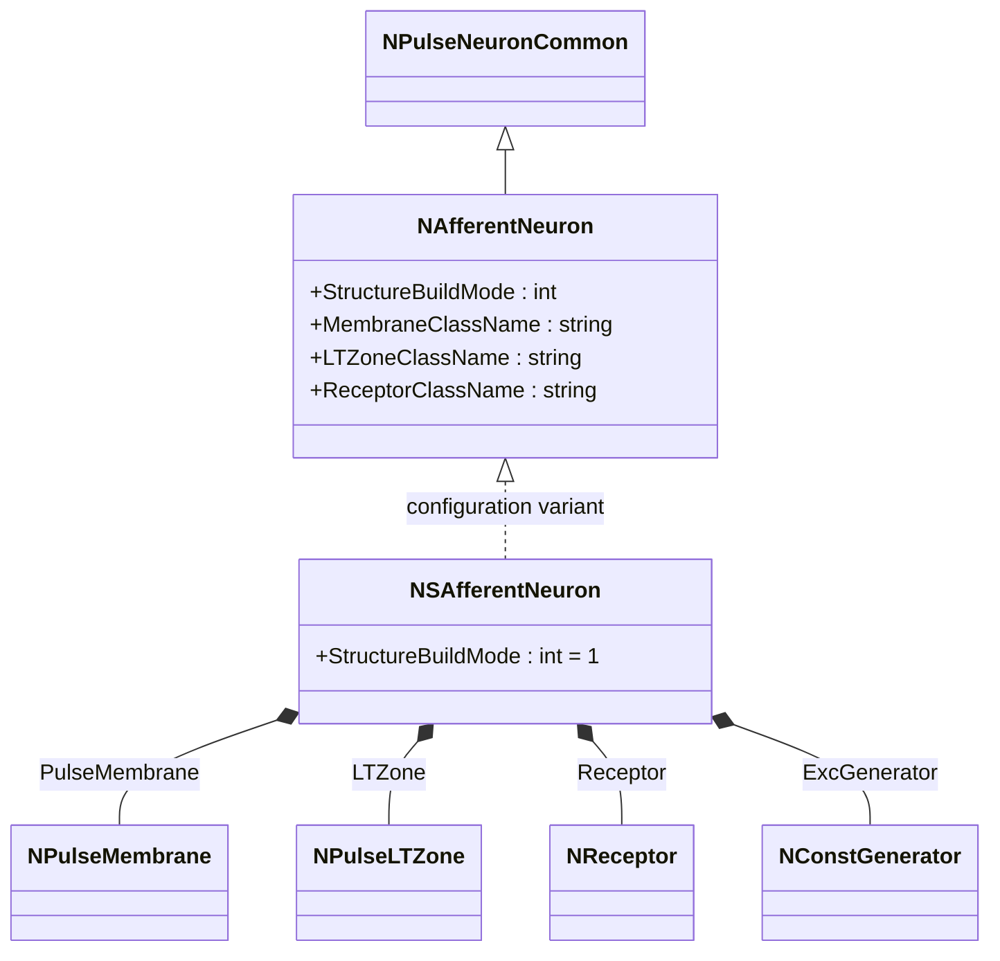
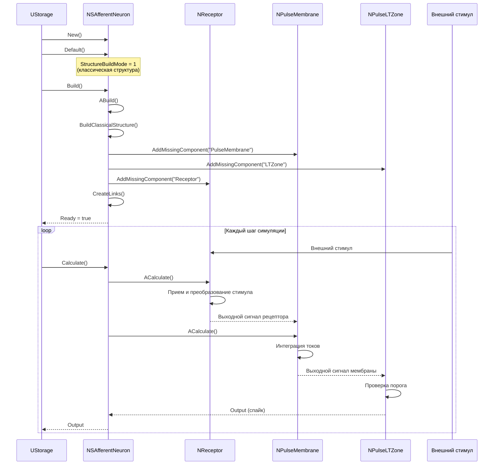
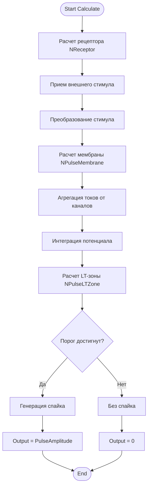
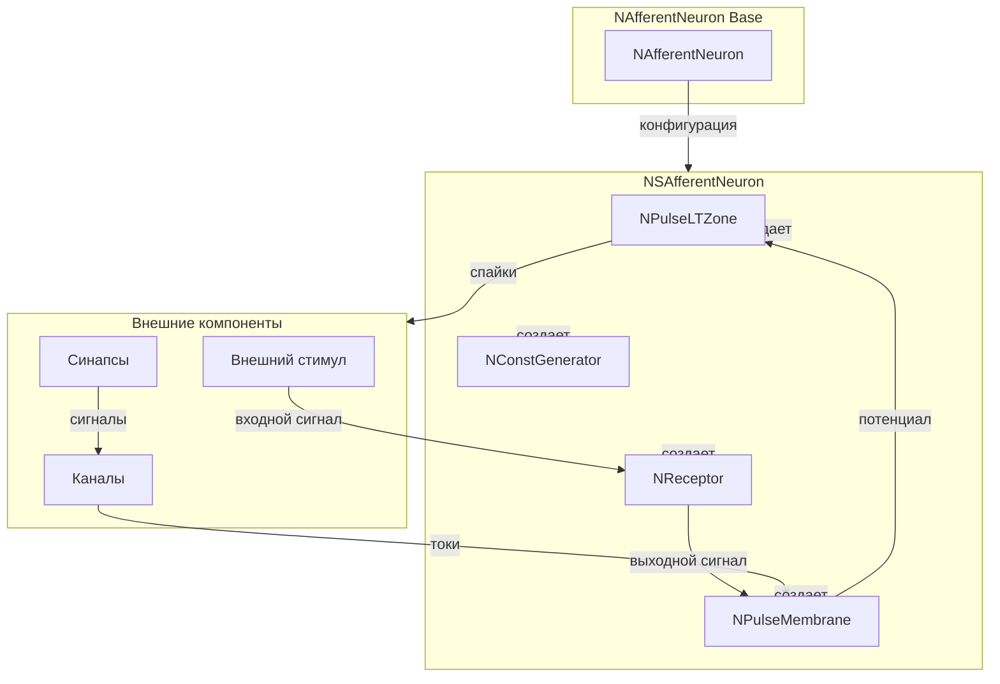
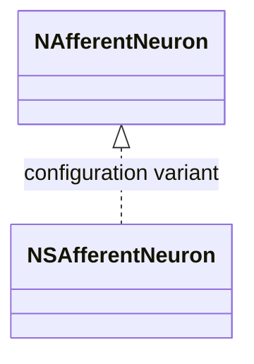
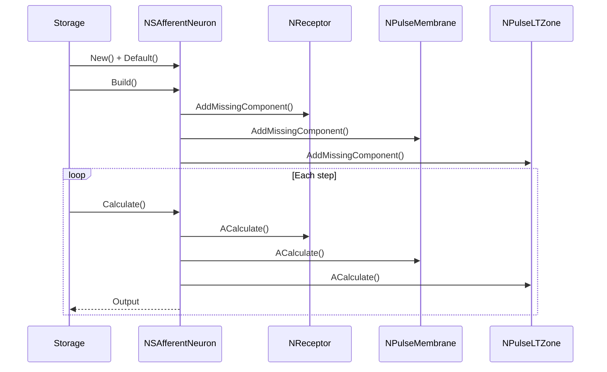
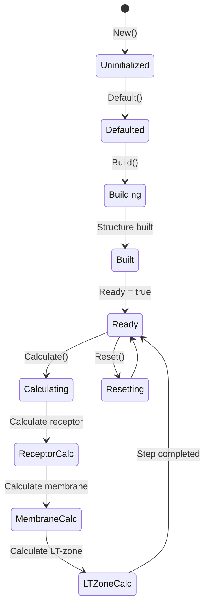
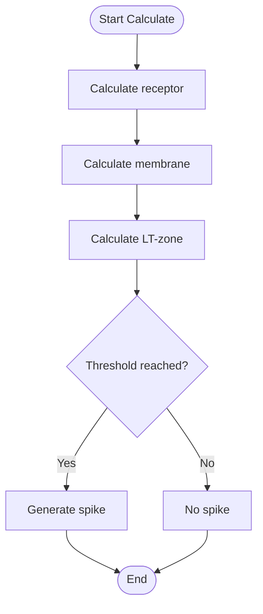
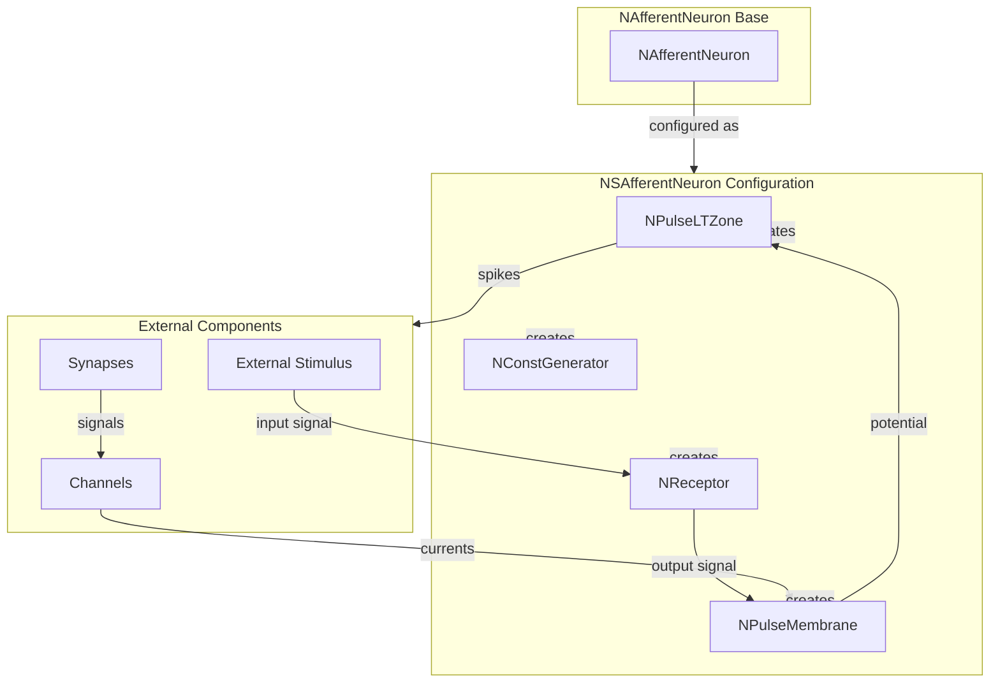

# NSAfferentNeuron — классический афферентный нейрон

## RU

### Назначение

**Класс**: `NSAfferentNeuron` — конфигурационный вариант классического афферентного нейрона с полной структурой.  
**Префикс**: `NS` — **S**imple (простой) или **S**tandard (стандартный/классический).  
**Регистрация**: `NPulseLibrary.cpp` → `UploadClass("NSAfferentNeuron", ...)`.  
**Storage-инстансы**: `ClassName = "NSAfferentNeuron"` в `Bin/Configs/*/Model_*.xml`.

`NSAfferentNeuron` является конфигурационным вариантом базового класса `NAfferentNeuron` с классической структурой. Создается из `NAfferentNeuron` с настройками:
- `StructureBuildMode = 1` — классическая структура
- Полная структура: мембрана + LT-зона + рецептор + генератор

**Использование:** Моделирование сенсорных систем с полной структурой

### UML-диаграмма классов



**Иерархия наследования:**
- `NPulseNeuronCommon` — общий импульсный нейрон
- `NAfferentNeuron` — базовый афферентный нейрон
- `NSAfferentNeuron` — классический афферентный нейрон (конфигурационный вариант)

**Внутренняя структура:**
- **Receptor** (`NReceptor`) — рецептор для приема внешних стимулов
- **PulseMembrane** (`NPulseMembrane`) — мембрана нейрона
- **LTZone** (`NPulseLTZone`) — LT-зона для генерации спайков
- **ExcGenerator** (`NConstGenerator`) — возбуждающий генератор

### UML-диаграмма последовательности



**Жизненный цикл:**
1. **Инициализация**: Установка `StructureBuildMode = 1` (классическая структура)
2. **Сборка**: Автоматическое создание мембраны, LT-зоны и рецептора
3. **Расчет**: Прием внешнего стимула через рецептор, обработка мембраной, генерация спайков LT-зоной

### UML-диаграмма состояний

```mermaid
stateDiagram-v2
    [*] --> Uninitialized: New()
    Uninitialized --> Defaulted: Default()
    Note over Defaulted: StructureBuildMode = 1
    Defaulted --> Building: Build()
    Building --> CreatingMembrane: Создание мембраны
    CreatingMembrane --> CreatingLTZone: Создание LT-зоны
    CreatingLTZone --> CreatingReceptor: Создание рецептора
    CreatingReceptor --> Linking: Создание связей
    Linking --> Built: Структура построена
    Built --> Ready: Ready = true
    Ready --> Calculating: Calculate()
    Calculating --> ReceptorCalc: Расчет рецептора
    ReceptorCalc --> MembraneCalc: Расчет мембраны
    MembraneCalc --> LTZoneCalc: Расчет LT-зоны
    LTZoneCalc --> CheckThreshold: Проверка порога
    CheckThreshold -->|Порог достигнут| Spiking: Генерация спайка
    CheckThreshold -->|Порог не достигнут| Ready: Шаг завершен
    Spiking --> Ready
    Ready --> Resetting: Reset()
    Resetting --> Ready: Состояния сброшены
```

**Состояния:**
- **Uninitialized** — создан, но не инициализирован
- **Defaulted** — параметры установлены (`StructureBuildMode = 1`)
- **Building** — выполняется сборка классической структуры
- **CreatingMembrane** — создание мембраны
- **CreatingLTZone** — создание LT-зоны
- **CreatingReceptor** — создание рецептора
- **Linking** — создание связей между компонентами
- **Built** — структура нейрона построена
- **Ready** — готов к выполнению расчетов
- **Calculating** — выполняется расчет нейрона
- **ReceptorCalc** — расчет рецептора (прием и преобразование стимула)
- **MembraneCalc** — расчет мембраны (интеграция токов)
- **LTZoneCalc** — расчет LT-зоны (проверка порога)
- **CheckThreshold** — проверка достижения порога
- **Spiking** — генерация спайка
- **Resetting** — выполняется сброс состояний

### UML-диаграмма активности



**Алгоритм расчета:**
1. Расчет рецептора: прием внешнего стимула и его преобразование
2. Расчет мембраны: агрегация токов от каналов, интеграция потенциала
3. Расчет LT-зоны: проверка порога генерации спайка
4. Генерация спайка при достижении порога
5. Обновление выходного сигнала нейрона

### UML-диаграмма компонентов



**Зависимости:**
- **Базовый класс**: `NAfferentNeuron` (конфигурационный вариант)
- **Внутренние компоненты**: `NReceptor` (рецептор), `NPulseMembrane` (мембрана), `NPulseLTZone` (LT-зона), `NConstGenerator` (возбуждающий генератор)
- **Внешние компоненты**: внешние стимулы (источники входных сигналов), каналы, синапсы

### Свойства

`NSAfferentNeuron` использует все свойства базового класса `NAfferentNeuron` с параметрами:
- `StructureBuildMode = 1`

### Методы

`NSAfferentNeuron` использует все методы базового класса `NAfferentNeuron`.

### Использование в конфигурациях

`NSAfferentNeuron` используется в экспериментах с сенсорными системами:

- **Афферентные нейроны**: `Bin/Configs/!OldConfigs/NM-AfferentNeurons/`
- **Управление движением**: `Bin/Configs/!OldConfigs/OldExperiments/SimplestMotionControlSAfferent/`

**Типичные значения параметров:**
- **StructureBuildMode**: 1 (классическая структура)
- **ReceptorClassName**: "NReceptor" (рецептор для приема стимулов)
- **MembraneClassName**: "NPulseMembrane" (мембрана)
- **LTZoneClassName**: "NPulseLTZone" (LT-зона)

## Источники

См. [Literature-References.md](../Literature-References.md): **25**, **29**.

### См. также

- [`NAfferentNeuron`](NAfferentNeuron.md) — базовый афферентный нейрон
- [`NSimpleAfferentNeuron`](NSimpleAfferentNeuron.md) — простой афферентный нейрон
- [`NReceptor`](NReceptor.md) — рецептор для приема стимулов
- [Architecture.md](../Architecture.md) — архитектура библиотеки

---

## EN

### Purpose

**Class**: `NSAfferentNeuron` — configuration variant of classical afferent neuron with full structure.  
**Registration**: `NPulseLibrary.cpp` → `UploadClass("NSAfferentNeuron", ...)`.  
**Instances**: `ClassName = "NSAfferentNeuron"` in `Bin/Configs/*/Model_*.xml`.

`NSAfferentNeuron` is a configuration variant of the base class `NAfferentNeuron` with classical structure. Created from `NAfferentNeuron` with settings:
- `StructureBuildMode = 1` — classical structure
- Full structure: membrane + LT-zone + receptor + generator

**Usage:** Modeling sensory systems with full structure

### UML Class Diagram



### UML Sequence Diagram



### UML State Diagram



### UML Activity Diagram



### UML Component Diagram



### Properties

`NSAfferentNeuron` uses all properties of base class `NAfferentNeuron` with parameters:
- `StructureBuildMode = 1` — classical structure mode

**Inherited properties:**
- `MembraneClassName` — membrane class name (default "NPulseMembrane")
- `LTZoneClassName` — LT-zone class name (default "NPulseLTZone")
- `ReceptorClassName` — receptor class name (by default "NReceptor")
- `ExcGeneratorClassName` — excitatory generator class name
- `NumSomaMembraneParts` — number of soma parts

### Methods

`NSAfferentNeuron` uses all methods of base class `NAfferentNeuron`:
- `ADefault()` — setting default parameters (sets StructureBuildMode = 1)
- `ABuild()` — building neuron structure (calls BuildClassicalStructure)
- `AReset()` — resetting neuron states
- `ACalculate()` — neuron calculation step

### Usage in configurations

`NSAfferentNeuron` is used in sensory system experiments:

- **Afferent neurons**: `Bin/Configs/!OldConfigs/NM-AfferentNeurons/`
- **Motion control**: `Bin/Configs/!OldConfigs/OldExperiments/SimplestMotionControlSAfferent/`

**Typical parameter values:**
- **StructureBuildMode**: 1 (classical structure)
- **ReceptorClassName**: "NReceptor" (receptor for receiving stimuli)
- **MembraneClassName**: "NPulseMembrane" (membrane)
- **LTZoneClassName**: "NPulseLTZone" (LT-zone)

**Features:**
- Classical structure: full structure with membrane, LT-zone, receptor, and generator
- External stimulus reception: receptor receives and transforms external stimuli
- Complete signal processing: stimulus → receptor → membrane → LT-zone → spike

### References

See [Literature-References.md](../Literature-References.md): **25**, **29**.

### See Also

- [`NAfferentNeuron`](NAfferentNeuron.md) — base afferent neuron
- [`NSimpleAfferentNeuron`](NSimpleAfferentNeuron.md) — simple afferent neuron
- [`NReceptor`](NReceptor.md) — receptor for receiving stimuli
- [Architecture.md](../Architecture.md) — library architecture
