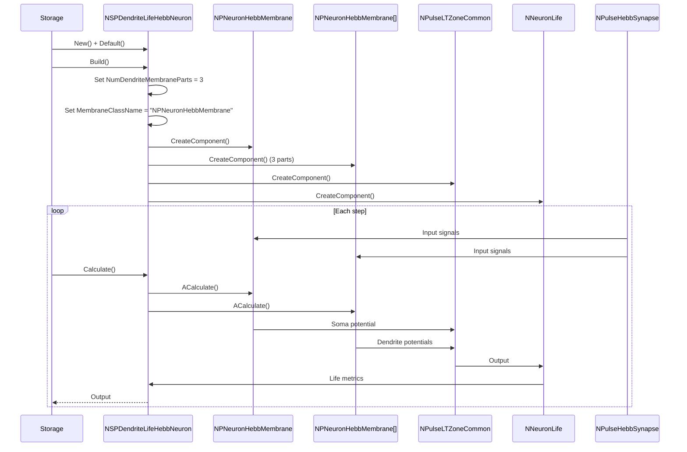
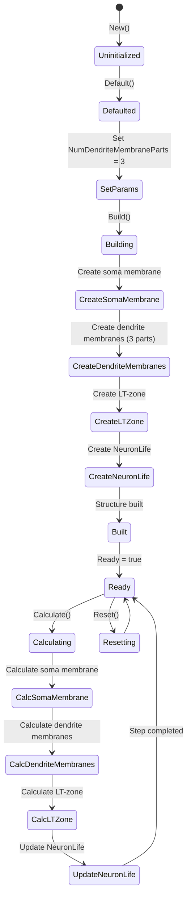
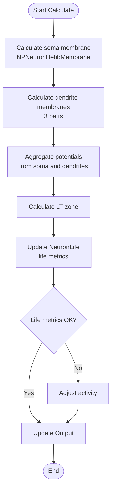
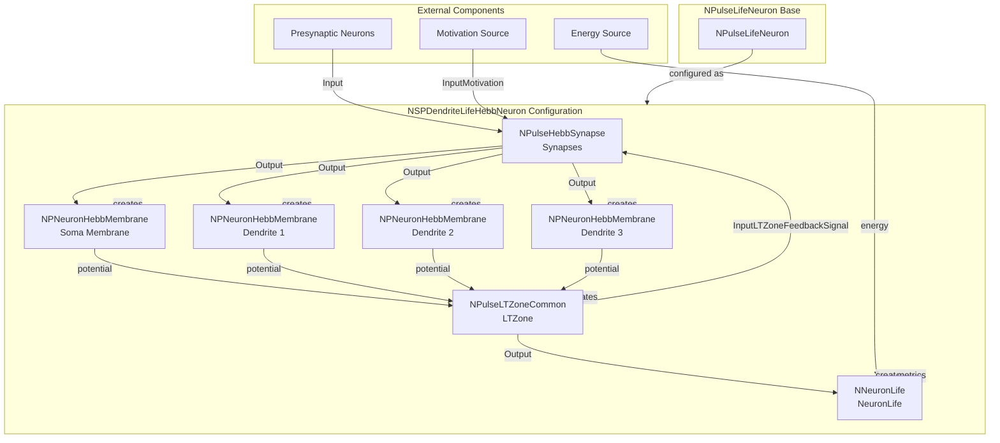

# NSPDendriteLifeHebbNeuron — мелкий живой импульсный нейрон с синапсами Хебба и дендритом

## RU

### Назначение

**Класс**: `NSPDendriteLifeHebbNeuron` — конфигурационный вариант мелкого живого импульсного нейрона с синапсами Хебба и дендритной структурой.  
**Аббревиатура**: `Hebb` — **Hebb**ian (геббовская пластичность, обучение по правилу Хебба).  
**Регистрация**: `NPulseLibrary.cpp` → `UploadClass("NSPDendriteLifeHebbNeuron", ...)`.  
**Storage-инстансы**: `ClassName = "NSPDendriteLifeHebbNeuron"` в `Bin/Configs/*/Model_*.xml`.

`NSPDendriteLifeHebbNeuron` является конфигурационным вариантом базового класса `NPulseLifeNeuron` с мембраной, поддерживающей синапсы Хебба, и дендритной структурой. Создается из `NPulseLifeNeuron` с настройками:
- `NumDendriteMembraneParts = 3` — три части дендритной мембраны
- `LTMembraneClassName = ""` — без LT-мембраны
- `MembraneClassName = "NPNeuronHebbMembrane"` — мембрана с поддержкой синапсов Хебба

Отличие от `NSPLifeHebbNeuron` заключается в наличии дендритной структуры для более сложного пространственного моделирования.

**Использование:** Моделирование живых нейронов с дендритной структурой и обучением Хебба

### UML-диаграмма классов

```mermaid
classDiagram
    NPulseNeuron <|-- NPulseLifeNeuron
    NPulseLifeNeuron <|.. NSPDendriteLifeHebbNeuron : configuration variant
    NSPDendriteLifeHebbNeuron *-- NPNeuronHebbMembrane : PulseMembrane
    NSPDendriteLifeHebbNeuron *-- NPNeuronHebbMembrane[] : DendriteMembranes
    NSPDendriteLifeHebbNeuron *-- NNeuronLife : NeuronLife
    class NPulseLifeNeuron {
        +NumDendriteMembraneParts : int
        +SummaryPosGd : double
        +GetNeuronLife() NNeuronLife*
    }
    class NSPDendriteLifeHebbNeuron {
        +NumDendriteMembraneParts : int = 3
        +MembraneClassName : string = "NPNeuronHebbMembrane"
        +LTMembraneClassName : string = ""
    }
```

**Иерархия наследования:**
- `NPulseNeuron` — импульсный нейрон
- `NPulseLifeNeuron` — живой импульсный нейрон
- `NSPDendriteLifeHebbNeuron` — конфигурационный вариант с дендритами и синапсами Хебба

### Свойства

`NSPDendriteLifeHebbNeuron` использует все свойства базового класса `NPulseLifeNeuron` с параметрами:
- `NumDendriteMembraneParts = 3`
- `MembraneClassName = "NPNeuronHebbMembrane"`
- `LTMembraneClassName = ""`

### Методы

`NSPDendriteLifeHebbNeuron` использует все методы базового класса `NPulseLifeNeuron`.

## Источники

См. [Literature-References.md](../Literature-References.md): **[A]**, **4**, **25**, **29**.

### См. также

- [`NPulseLifeNeuron`](NPulseLifeNeuron.md) — живой импульсный нейрон
- [`NSPLifeHebbNeuron`](NSPLifeHebbNeuron.md) — мелкий живой нейрон с синапсами Хебба
- [`NPulseHebbSynapse`](NPulseHebbSynapse.md) — синапс Хебба
- [Architecture.md](../Architecture.md) — архитектура библиотеки

---

## EN

### Purpose

**Class**: `NSPDendriteLifeHebbNeuron` — configuration variant of small living spiking neuron with Hebbian synapses and dendritic structure.  
**Registration**: `NPulseLibrary.cpp` → `UploadClass("NSPDendriteLifeHebbNeuron", ...)`.  
**Instances**: `ClassName = "NSPDendriteLifeHebbNeuron"` in `Bin/Configs/*/Model_*.xml`.

`NSPDendriteLifeHebbNeuron` is a configuration variant of the base class `NPulseLifeNeuron` with membrane supporting Hebbian synapses and dendritic structure. Created from `NPulseLifeNeuron` with settings:
- `NumDendriteMembraneParts = 3` — three dendritic membrane parts
- `LTMembraneClassName = ""` — without LT-membrane
- `MembraneClassName = "NPNeuronHebbMembrane"` — membrane with Hebbian synapse support

Difference from `NSPLifeHebbNeuron` is the presence of dendritic structure for more complex spatial modeling.

**Usage:** Modeling living neurons with dendritic structure and Hebbian learning

### UML Class Diagram

```mermaid
classDiagram
    UNet <|-- NPulseNeuron
    NPulseNeuron <|-- NPulseLifeNeuron
    NPulseLifeNeuron <|.. NSPDendriteLifeHebbNeuron : configuration variant
    NSPDendriteLifeHebbNeuron *-- NPNeuronHebbMembrane : PulseMembrane
    NSPDendriteLifeHebbNeuron *-- NPNeuronHebbMembrane[] : DendriteMembranes
    NSPDendriteLifeHebbNeuron *-- NNeuronLife : NeuronLife
    class NPulseLifeNeuron {
        +NumDendriteMembraneParts : int
        +SummaryPosGd : double
        +GetNeuronLife() NNeuronLife*
    }
    class NSPDendriteLifeHebbNeuron {
        +NumDendriteMembraneParts : int = 3
        +MembraneClassName : string = "NPNeuronHebbMembrane"
        +LTMembraneClassName : string = ""
    }
```

### UML Sequence Diagram



### UML State Diagram



### UML Activity Diagram



### UML Component Diagram



### Properties

`NSPDendriteLifeHebbNeuron` uses all properties of base class `NPulseLifeNeuron` with parameters:
- `NumDendriteMembraneParts = 3` — three dendritic membrane parts
- `MembraneClassName = "NPNeuronHebbMembrane"` — membrane with Hebbian synapse support
- `LTMembraneClassName = ""` — without LT-membrane

**Inherited properties from NPulseLifeNeuron:**
- `SummaryPosGd`, `SummaryPosGs`, `SummaryPosG` (double) — summary positive weights
- `SummaryNegGd`, `SummaryNegGs`, `SummaryNegG` (double) — summary negative weights
- `OutputSummaryPosGd`, `OutputSummaryPosGs`, `OutputSummaryPosG` (MDMatrix<double>) — output signals of positive weights
- `OutputSummaryNegGd`, `OutputSummaryNegGs`, `OutputSummaryNegG` (MDMatrix<double>) — output signals of negative weights
- All normalized outputs (`*Norm`)

**Life support parameters (in NeuronLife):**
- `Energy` (double) — current neuron energy
- `Threshold` (double) — life threshold
- `CriticalEnergy` (double) — critical energy level
- `WearOut` (double) — neuron wear out
- `Feel` (double) — neuron feel

**Hebb synapse parameters (in NPulseHebbSynapse):**
- `Min`, `Mout`, `Md` (double) — forgetting constants
- `Kin`, `Kout` (double) — activity coefficients

### Methods

`NSPDendriteLifeHebbNeuron` uses all methods of base class `NPulseLifeNeuron`:
- `GetNeuronLife()` → `NNeuronLife*` — get life support model

### Usage in configurations

`NSPDendriteLifeHebbNeuron` is used in experiments with living neurons, dendritic structure, and Hebbian learning:

- **Dendritic + Life + Hebb**: `Bin/Configs/!OldConfigs/*/Model_*.xml` (where combination of dendritic structure, life support, and Hebbian learning is used)
- **Spatial modeling**: Experiments with spatial neuron modeling using dendritic compartments
- **Complex neurons**: Modeling neurons with complex morphology and learning

**Typical parameter values:**
- **NumDendriteMembraneParts**: 3 (three dendritic membrane parts)
- **MembraneClassName**: "NPNeuronHebbMembrane" (membrane with Hebb support)
- **LTMembraneClassName**: "" (without LT-membrane)

**Features:**
- Dendritic structure: Includes three dendritic compartments for spatial modeling
- Life support: Automatically creates and links NeuronLife model
- Hebbian learning: Uses Hebb synapses for synaptic plasticity
- Combined functionality: Combines dendritic structure, life support, and Hebbian learning

### References

See [Literature-References.md](../Literature-References.md): **[A]**, **4**, **25**, **29**.

### See Also

- [`NPulseLifeNeuron`](NPulseLifeNeuron.md) — living spiking neuron
- [`NSPLifeHebbNeuron`](NSPLifeHebbNeuron.md) — small living neuron with Hebbian synapses
- [`NPulseHebbSynapse`](NPulseHebbSynapse.md) — Hebbian synapse
- [Architecture.md](../Architecture.md) — library architecture
