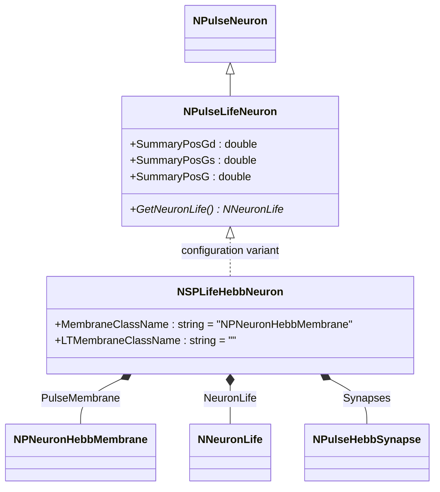
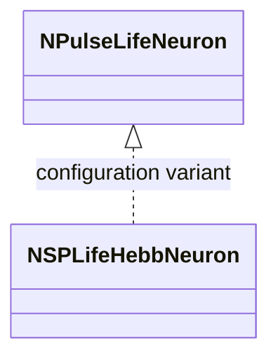
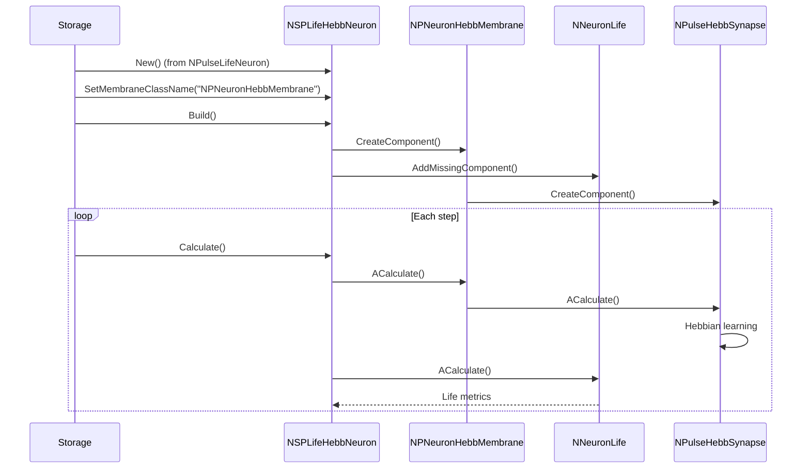
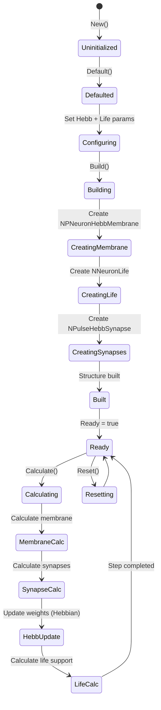
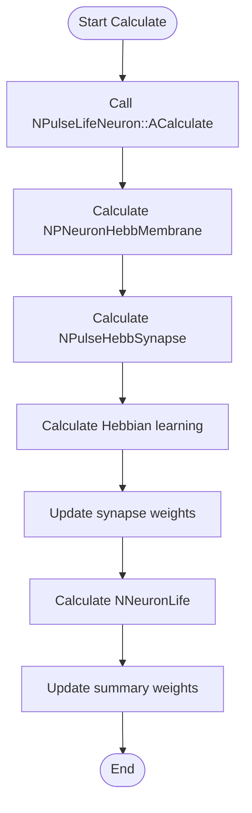

# NSPLifeHebbNeuron — мелкий живой импульсный нейрон с синапсами Хебба

## RU

### Назначение

**Класс**: `NSPLifeHebbNeuron` — конфигурационный вариант мелкого живого импульсного нейрона с синапсами Хебба и поддержкой жизнеобеспечения.
**Префикс**: `NSP` — **S**imple **P**ulse (простой импульсный); `Hebb` — **Hebb**ian (геббовская пластичность).
**Регистрация**: `NPulseLibrary.cpp` → `UploadClass("NSPLifeHebbNeuron", ...)`.
**Storage-инстансы**: `ClassName = "NSPLifeHebbNeuron"` в `Bin/Configs/*/Model_*.xml`.

`NSPLifeHebbNeuron` является конфигурационным вариантом базового класса `NPulseLifeNeuron` с мембраной, поддерживающей синапсы Хебба. Создается из `NPulseLifeNeuron` с настройками:
- `LTMembraneClassName = ""` — без LT-мембраны
- `MembraneClassName = "NPNeuronHebbMembrane"` — мембрана с поддержкой синапсов Хебба

Комбинирует возможности живых нейронов (жизнеобеспечение) и синапсов Хебба (обучение).

**Использование:** Моделирование живых нейронов с обучением Хебба, эксперименты с пластичностью и жизнеобеспечением

### UML-диаграмма классов



**Иерархия наследования:**
- `NPulseNeuron` — импульсный нейрон
- `NPulseLifeNeuron` — живой импульсный нейрон
- `NSPLifeHebbNeuron` — конфигурационный вариант с синапсами Хебба

### Свойства

`NSPLifeHebbNeuron` использует все свойства базового класса `NPulseLifeNeuron` с поддержкой синапсов Хебба.

### Методы

`NSPLifeHebbNeuron` использует все методы базового класса `NPulseLifeNeuron`.

## Источники

См. [Literature-References.md](../Literature-References.md): **neuromodeler.ru** (жизнеобеспечение), **15**.

### См. также

- [`NPulseLifeNeuron`](NPLifeNeuron.md) — живой импульсный нейрон
- [`NSPLifeNeuron`](NSPLifeNeuron.md) — мелкий живой нейрон
- [`NSPHebbNeuron`](NSPHebbNeuron.md) — мелкий нейрон с синапсами Хебба
- [`NPulseHebbSynapse`](NPulseHebbSynapse.md) — синапс Хебба
- [Architecture.md](../Architecture.md) — архитектура библиотеки

---

## EN

### Purpose

**Class**: `NSPLifeHebbNeuron` — configuration variant of small living spiking neuron with Hebbian synapses and life support.
**Registration**: `NPulseLibrary.cpp` → `UploadClass("NSPLifeHebbNeuron", ...)`.
**Instances**: `ClassName = "NSPLifeHebbNeuron"` in `Bin/Configs/*/Model_*.xml`.

`NSPLifeHebbNeuron` is a configuration variant of the base class `NPulseLifeNeuron` with membrane supporting Hebbian synapses. Created from `NPulseLifeNeuron` with settings:
- `LTMembraneClassName = ""` — without LT-membrane
- `MembraneClassName = "NPNeuronHebbMembrane"` — membrane with Hebbian synapse support

Combines capabilities of living neurons (life support) and Hebbian synapses (learning).

**Usage:** Modeling living neurons with Hebbian learning, experiments with plasticity and life support

### UML Class Diagram



### UML Sequence Diagram



### UML State Diagram



### UML Activity Diagram



### UML Component Diagram

```mermaid
graph TB
    subgraph NPulseLifeNeuron["NPulseLifeNeuron Base"]
        BaseNeuron[NPulseLifeNeuron]
    end

    subgraph NSPLifeHebbNeuron["NSPLifeHebbNeuron Configuration"]
        Membrane[NPNeuronHebbMembrane]
        NeuronLife[NNeuronLife]
        HebbSynapses[NPulseHebbSynapse[]]
    end

    subgraph External["External Components"]
        PreNeurons[Presynaptic neurons]
        EnergySource[Energy Source]
        MotivationalSignals[Motivational signals]
    end

    BaseNeuron -->|configured as| NSPLifeHebbNeuron
    NSPLifeHebbNeuron -->|creates| Membrane
    NSPLifeHebbNeuron -->|creates| NeuronLife
    NSPLifeHebbNeuron -->|creates| HebbSynapses
    PreNeurons -->|Input| HebbSynapses
    MotivationalSignals -->|Mout| HebbSynapses
    EnergySource -->|energy| NeuronLife
    HebbSynapses -->|current| Membrane
    Membrane -->|Output| NSPLifeHebbNeuron
    NeuronLife -->|metrics| NSPLifeHebbNeuron
```

### Properties

`NSPLifeHebbNeuron` uses all properties of base class `NPulseLifeNeuron` with parameters:
- `MembraneClassName = "NPNeuronHebbMembrane"` — membrane with Hebbian synapse support
- `LTMembraneClassName = ""` — without LT-membrane

**Inherited properties from NPulseLifeNeuron:**
- `SummaryPosGd`, `SummaryPosGs`, `SummaryPosG` (double) — summary positive weights
- `SummaryNegGd`, `SummaryNegGs`, `SummaryNegG` (double) — summary negative weights
- `OutputSummaryPosGd`, `OutputSummaryPosGs`, `OutputSummaryPosG` (MDMatrix<double>) — output signals of positive weights
- `OutputSummaryNegGd`, `OutputSummaryNegGs`, `OutputSummaryNegG` (MDMatrix<double>) — output signals of negative weights
- All normalized outputs (`*Norm`)

**Life support parameters (in NeuronLife):**
- `Energy` (double) — current neuron energy
- `Threshold` (double) — life threshold
- `CriticalEnergy` (double) — critical energy level
- `WearOut` (double) — neuron wear out
- `Feel` (double) — neuron feel

**Hebb synapse parameters (in NPulseHebbSynapse):**
- `Min`, `Mout`, `Md` (double) — forgetting constants
- `Kin`, `Kout` (double) — activity coefficients

### Methods

`NSPLifeHebbNeuron` uses all methods of base class `NPulseLifeNeuron`:
- `GetNeuronLife()` → `NNeuronLife*` — get life support model

### Usage in configurations

`NSPLifeHebbNeuron` is used in living neuron experiments with Hebbian learning:

- **Living neurons with Hebbian learning**: `Bin/Configs/!OldConfigs/*/Model_*.xml` (where living neurons with Hebbian synapses are required)
- **Plasticity and life support**: experiments combining Hebbian learning with life support

**Typical parameter values:**
- **MembraneClassName**: "NPNeuronHebbMembrane" (membrane with Hebbian support)
- **LTMembraneClassName**: "" (without LT-membrane)

**Features:**
- Combines life support and Hebbian learning
- Life metrics: tracks energy, wear out, and other life parameters
- Hebbian adaptation: automatic weight updates based on activity
- Dual adaptation: both life support and synaptic plasticity mechanisms

### References

See [Literature-References.md](../Literature-References.md): **neuromodeler.ru** (life support), **15**.

### See Also

- [`NPulseLifeNeuron`](NPLifeNeuron.md) — living spiking neuron
- [`NSPLifeNeuron`](NSPLifeNeuron.md) — small living neuron
- [`NSPHebbNeuron`](NSPHebbNeuron.md) — small neuron with Hebbian synapses
- [`NPulseHebbSynapse`](NPulseHebbSynapse.md) — Hebbian synapse
- [Architecture.md](../Architecture.md) — library architecture
