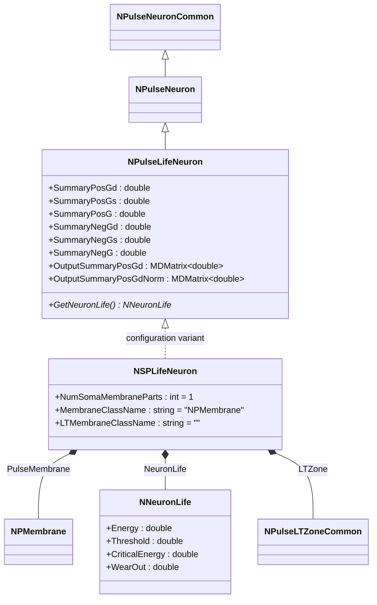
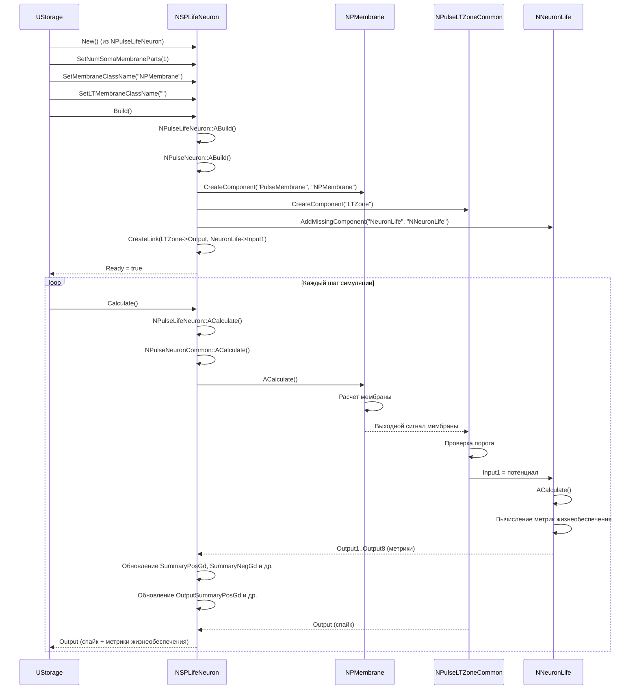
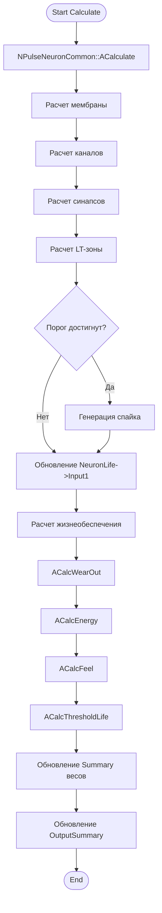
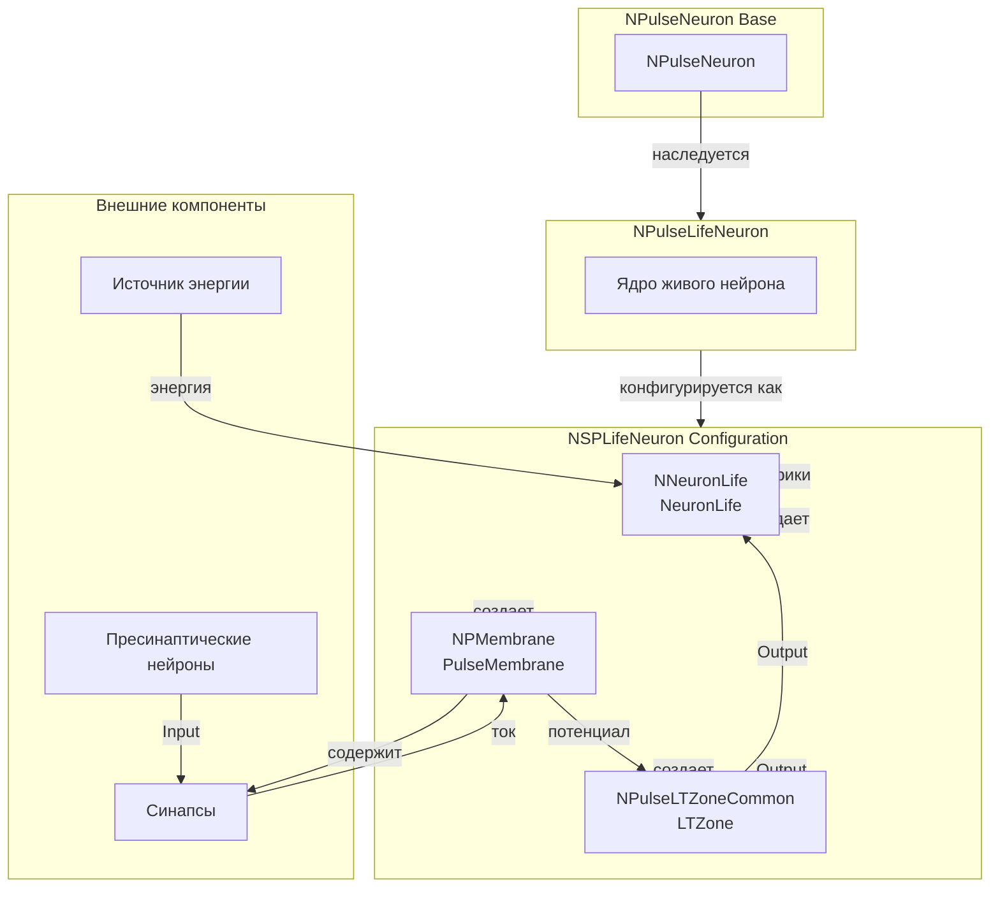
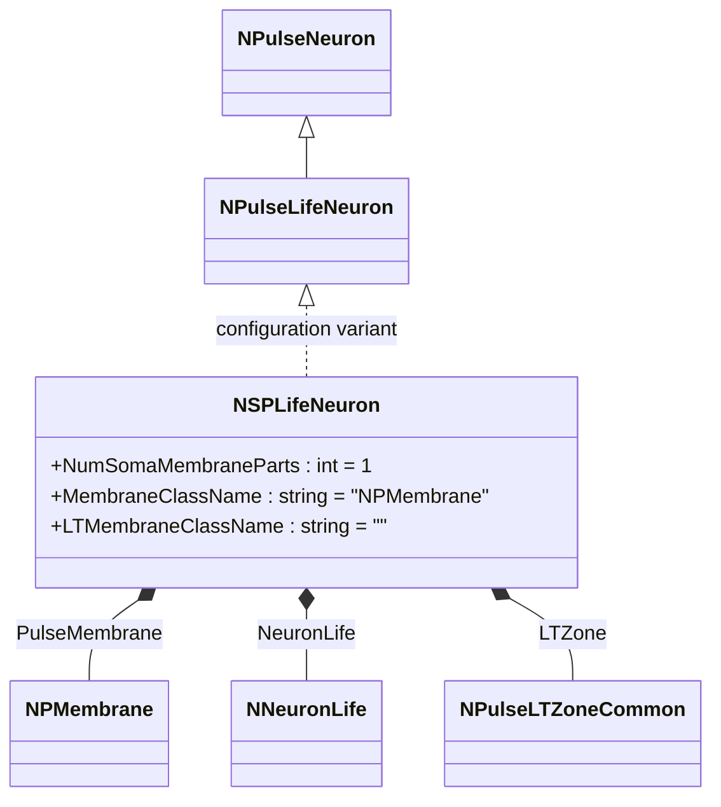
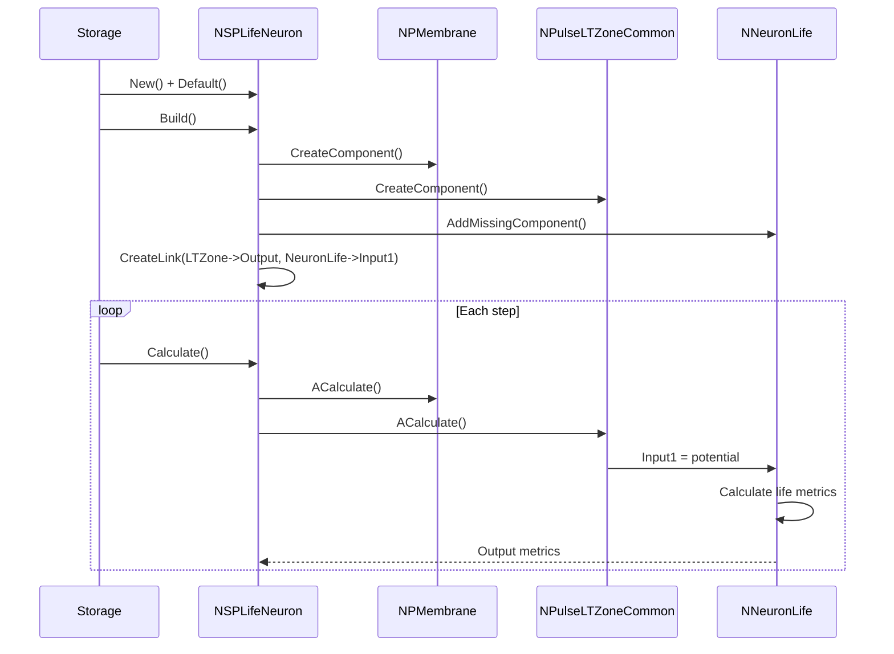
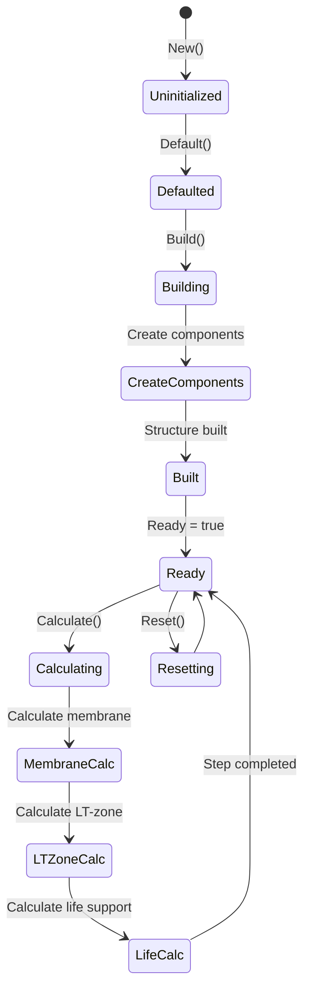
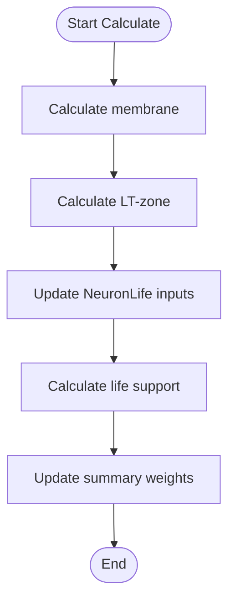
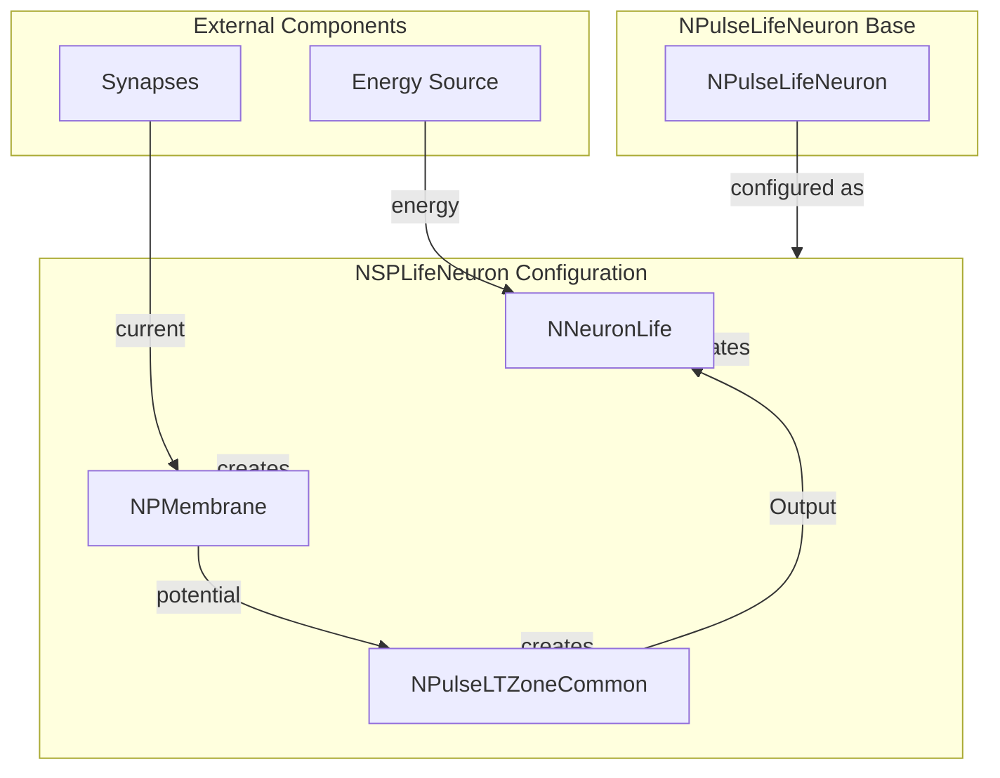

# NSPLifeNeuron — мелкий живой импульсный нейрон

## RU

### Назначение

**Класс**: `NSPLifeNeuron` — конфигурационный вариант мелкого живого импульсного нейрона с поддержкой жизнеобеспечения.
**Регистрация**: `NPulseLibrary.cpp` → `UploadClass("NSPLifeNeuron", ...)`.
**Storage-инстансы**: `ClassName = "NSPLifeNeuron"` в `Bin/Configs/*/Model_*.xml`.

`NSPLifeNeuron` является конфигурационным вариантом базового класса `NPulseLifeNeuron` с предустановленными параметрами для мелких живых нейронов. Создается из `NPulseLifeNeuron` с настройками:
- `NumSomaMembraneParts = 1` — одна часть сомы
- `MembraneClassName = "NPMembrane"` — стандартная мембрана
- `LTMembraneClassName = ""` — без LT-мембраны

Живые нейроны (`NPulseLifeNeuron`) включают модель жизнеобеспечения (`NNeuronLife`), которая отслеживает энергетическое состояние нейрона, износ и другие параметры жизнедеятельности.

**Использование:** Моделирование нейронов с жизнеобеспечением, эксперименты с энергетическими моделями

### UML-диаграмма классов



**Иерархия наследования:**
- `NPulseNeuronCommon` — общий импульсный нейрон
- `NPulseNeuron` — импульсный нейрон с параметрами структурирования
- `NPulseLifeNeuron` — живой импульсный нейрон с поддержкой жизнеобеспечения
- `NSPLifeNeuron` — конфигурационный вариант для мелких живых нейронов

**Внутренняя структура:**
- **PulseMembrane** (`NPMembrane`) — стандартная мембрана
- **NeuronLife** (`NNeuronLife`) — модель жизнеобеспечения
- **LTZone** (`NPulseLTZoneCommon`) — стандартная LT-зона

### UML-диаграмма последовательности



**Жизненный цикл:**
1. **Создание**: `NSPLifeNeuron` создается из `NPulseLifeNeuron` с настройкой параметров
2. **Настройка**: Устанавливается одна часть сомы, стандартная мембрана, отсутствие LT-мембраны
3. **Сборка**: Автоматически создается структура нейрона с мембраной, LT-зоной и моделью жизнеобеспечения
4. **Расчет**: На каждом шаге рассчитываются мембрана, LT-зона и модель жизнеобеспечения

### UML-диаграмма состояний

```mermaid
stateDiagram-v2
    [*] --> Uninitialized: New()
    Uninitialized --> Defaulted: Default()
    Defaulted --> Configuring: Настройка SP параметров
    Configuring --> SetSPParams: SetNumSomaMembraneParts(1)<br/>SetMembraneClassName("NPMembrane")
    SetSPParams --> Building: Build()
    Building --> BuildBase: NPulseNeuron::ABuild()
    BuildBase --> CreateMembrane: Создание NPMembrane
    CreateMembrane --> CreateLTZone: Создание NPulseLTZoneCommon
    CreateLTZone --> CreateLife: Создание NNeuronLife
    CreateLife --> LinkLife: CreateLink(LTZone->Output, NeuronLife->Input1)
    LinkLife --> Built: Структура создана
    Built --> Ready: Ready = true
    Ready --> Calculating: Calculate()
    Calculating --> MembraneCalc: Расчет мембраны
    MembraneCalc --> LTZoneCalc: Расчет LT-зоны
    LTZoneCalc --> LifeCalc: Расчет жизнеобеспечения
    LifeCalc --> UpdateSummary: Обновление Summary весов
    UpdateSummary --> Ready: Шаг завершен
    Ready --> Resetting: Reset()
    Resetting --> Ready: Состояния сброшены
```

**Состояния:**
- **Uninitialized** — создан, но не инициализирован
- **Defaulted** — параметры установлены по умолчанию
- **Configuring** — настройка параметров для SP-нейрона
- **SetSPParams** — установка параметров (одна часть сомы, стандартная мембрана)
- **Building** — выполняется сборка структуры
- **BuildBase** — сборка базовой структуры нейрона
- **CreateMembrane** — создание мембраны
- **CreateLTZone** — создание LT-зоны
- **CreateLife** — создание модели жизнеобеспечения
- **LinkLife** — связывание LT-зоны с моделью жизнеобеспечения
- **Built** — структура нейрона построена
- **Ready** — готов к выполнению расчетов
- **Calculating** — выполняется расчет нейрона
- **MembraneCalc** — расчет мембраны
- **LTZoneCalc** — расчет LT-зоны
- **LifeCalc** — расчет жизнеобеспечения
- **UpdateSummary** — обновление суммарных весов
- **Resetting** — выполняется сброс состояний

### UML-диаграмма активности



**Алгоритм расчета:**
1. Вызов базового расчета нейрона (`NPulseNeuronCommon::ACalculate`)
2. Расчет мембраны, каналов, синапсов
3. Расчет LT-зоны и проверка порога
4. Обновление входов модели жизнеобеспечения (потенциал, энергия, заряды)
5. Расчет метрик жизнеобеспечения (износ, энергия, чувство, пороги)
6. Обновление суммарных весов и выходов

### UML-диаграмма компонентов



**Зависимости:**
- **Базовый класс**: `NPulseLifeNeuron` (конфигурационный вариант)
- **Внутренние компоненты**: `NPMembrane` (мембрана), `NPulseLTZoneCommon` (LT-зона), `NNeuronLife` (модель жизнеобеспечения)
- **Внешние компоненты**: синапсы, пресинаптические нейроны, источник энергии

### Свойства

`NSPLifeNeuron` использует все свойства базового класса `NPulseLifeNeuron`:

**Наследуемые свойства от NPulseLifeNeuron:**
- `SummaryPosGd`, `SummaryPosGs`, `SummaryPosG` (double) — суммарные положительные веса (динамический, статический, результирующий)
- `SummaryNegGd`, `SummaryNegGs`, `SummaryNegG` (double) — суммарные отрицательные веса
- `OutputSummaryPosGd`, `OutputSummaryPosGs`, `OutputSummaryPosG` (MDMatrix<double>) — выходные сигналы положительных весов
- `OutputSummaryNegGd`, `OutputSummaryNegGs`, `OutputSummaryNegG` (MDMatrix<double>) — выходные сигналы отрицательных весов
- Все нормализованные выходы (`*Norm`)

**Параметры жизнеобеспечения (в NeuronLife):**
- `Energy` (double) — текущая энергия нейрона
- `Threshold` (double) — порог жизнедеятельности
- `CriticalEnergy` (double) — критический уровень энергии
- `WearOut` (double) — износ нейрона
- `Feel` (double) — чувство нейрона

**Параметры конфигурации:**
- `NumSomaMembraneParts = 1` — одна часть сомы
- `MembraneClassName = "NPMembrane"` — стандартная мембрана
- `LTMembraneClassName = ""` — без LT-мембраны

### Методы

`NSPLifeNeuron` использует все методы базового класса `NPulseLifeNeuron`:

- **`GetNeuronLife()`** → `NNeuronLife*` — получение модели жизнеобеспечения

### Примеры использования

#### Пример 1: Создание живого SP-нейрона в коде C++

```cpp
// Создание мелкого живого нейрона
auto neuron = storage->CreateComponent("NSPLifeNeuron");
neuron->SetName("SPLifeNeuron");

// Инициализация (использует параметры по умолчанию)
neuron->Default();

// Сборка (автоматически создает NPMembrane, NPulseLTZoneCommon, NNeuronLife)
neuron->Build();

// Получение модели жизнеобеспечения
auto neuronLife = neuron->GetNeuronLife();
if (neuronLife) {
    // Настройка параметров жизнеобеспечения
    neuronLife->Threshold = 0.001;
    neuronLife->CriticalEnergy = 0.5;
}

// Использование
for (int step = 0; step < 1000; step++) {
    neuron->Calculate();
    // Получение метрик жизнеобеспечения
    auto neuronLife = neuron->GetNeuronLife();
    if (neuronLife) {
        double energy = neuronLife->Output5(0, 0);
        double wearOut = neuronLife->Output3(0, 0);
        // Использование метрик для адаптации
    }
}
```

#### Пример 2: Конфигурация XML

```xml
<SPLifeNeuron1 Class="NSPLifeNeuron">
    <Parameters>
        <!-- Параметры наследуются от NPulseLifeNeuron -->
    </Parameters>
</SPLifeNeuron1>
```

### Использование в конфигурациях

`NSPLifeNeuron` используется в экспериментах с живыми нейронами:

- **Моделирование жизнеобеспечения**: `Bin/Configs/!OldConfigs/*/Model_*.xml` (где используются живые нейроны)
- **Энергетические модели**: эксперименты с метриками энергии и износа

**Типичные значения параметров:**
- **NumSomaMembraneParts**: 1 (одна часть сомы для мелких нейронов)
- **MembraneClassName**: "NPMembrane" (стандартная мембрана)
- **LTMembraneClassName**: "" (без LT-мембраны)

**Особенности:**
- Модель жизнеобеспечения: автоматически создается и связывается с LT-зоной
- Метрики жизнедеятельности: отслеживание энергии, износа, чувства
- Адаптация: метрики используются для адаптации нейрона к условиям работы

## Источники

См. [Literature-References.md](../Literature-References.md): **neuromodeler.ru** (жизнеобеспечение), **15**.

### См. также

- [`NPulseLifeNeuron`](NPulseLifeNeuron.md) — живой импульсный нейрон (базовый класс)
- [`NSPNeuron`](NSPNeuron.md) — базовый SP-нейрон
- [`NSPLifeHebbNeuron`](NSPLifeHebbNeuron.md) — мелкий живой нейрон с синапсами Хебба
- [`NLPLifeNeuron`](NLPLifeNeuron.md) — крупный живой нейрон
- [`NNeuronLife`](NNeuronLife.md) — модель жизнеобеспечения
- [Architecture.md](../Architecture.md) — архитектура библиотеки

---

## EN

### Purpose

**Class**: `NSPLifeNeuron` — configuration variant of small living spiking neuron with life support.
**Registration**: `NPulseLibrary.cpp` → `UploadClass("NSPLifeNeuron", ...)`.
**Instances**: `ClassName = "NSPLifeNeuron"` in `Bin/Configs/*/Model_*.xml`.

`NSPLifeNeuron` is a configuration variant of the base class `NPulseLifeNeuron` with preset parameters for small living neurons. Created from `NPulseLifeNeuron` with settings:
- `NumSomaMembraneParts = 1` — one soma part
- `MembraneClassName = "NPMembrane"` — standard membrane
- `LTMembraneClassName = ""` — without LT-membrane

Living neurons (`NPulseLifeNeuron`) include a life support model (`NNeuronLife`) that tracks the neuron's energy state, wear, and other life parameters.

**Usage:** Modeling neurons with life support, experiments with energy models

### UML Class Diagram



### UML Sequence Diagram



### UML State Diagram



### UML Activity Diagram



### UML Component Diagram



### Properties

`NSPLifeNeuron` uses all properties of base class `NPulseLifeNeuron`:
- `SummaryPosGd`, `SummaryPosGs`, `SummaryPosG` (double) — positive weight summaries
- `SummaryNegGd`, `SummaryNegGs`, `SummaryNegG` (double) — negative weight summaries
- `OutputSummaryPosGd`, `OutputSummaryPosGs`, `OutputSummaryPosG` (MDMatrix<double>) — positive weight outputs
- `OutputSummaryNegGd`, `OutputSummaryNegGs`, `OutputSummaryNegG` (MDMatrix<double>) — negative weight outputs

**Life support parameters (in NeuronLife):**
- `Energy` (double) — current neuron energy
- `Threshold` (double) — life threshold
- `CriticalEnergy` (double) — critical energy level
- `WearOut` (double) — neuron wear out

### Methods

`NSPLifeNeuron` uses all methods of base class `NPulseLifeNeuron`:
- `GetNeuronLife()` → `NNeuronLife*` — get life support model

### Usage in configurations

`NSPLifeNeuron` is used in living neuron experiments:

- **Life support modeling**: `Bin/Configs/!OldConfigs/*/Model_*.xml` (where living neurons are used)
- **Energy models**: experiments with energy and wear out metrics

**Typical parameter values:**
- **NumSomaMembraneParts**: 1 (one soma part for small neurons)
- **MembraneClassName**: "NPMembrane" (standard membrane)
- **LTMembraneClassName**: "" (without LT-membrane)

### References

See [Literature-References.md](../Literature-References.md): **neuromodeler.ru** (life support), **15**.

### See Also

- [`NPulseLifeNeuron`](NPulseLifeNeuron.md) — living spiking neuron (base class)
- [`NSPNeuron`](NSPNeuron.md) — base SP-neuron
- [`NSPLifeHebbNeuron`](NSPLifeHebbNeuron.md) — small living neuron with Hebbian synapses
- [`NLPLifeNeuron`](NLPLifeNeuron.md) — large living neuron
- [`NNeuronLife`](NNeuronLife.md) — life support model
- [Architecture.md](../Architecture.md) — library architecture
