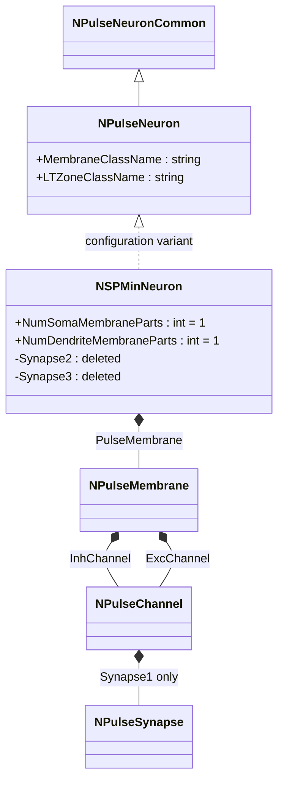
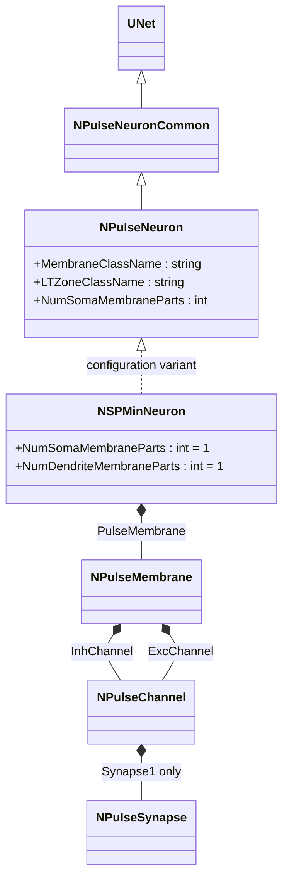
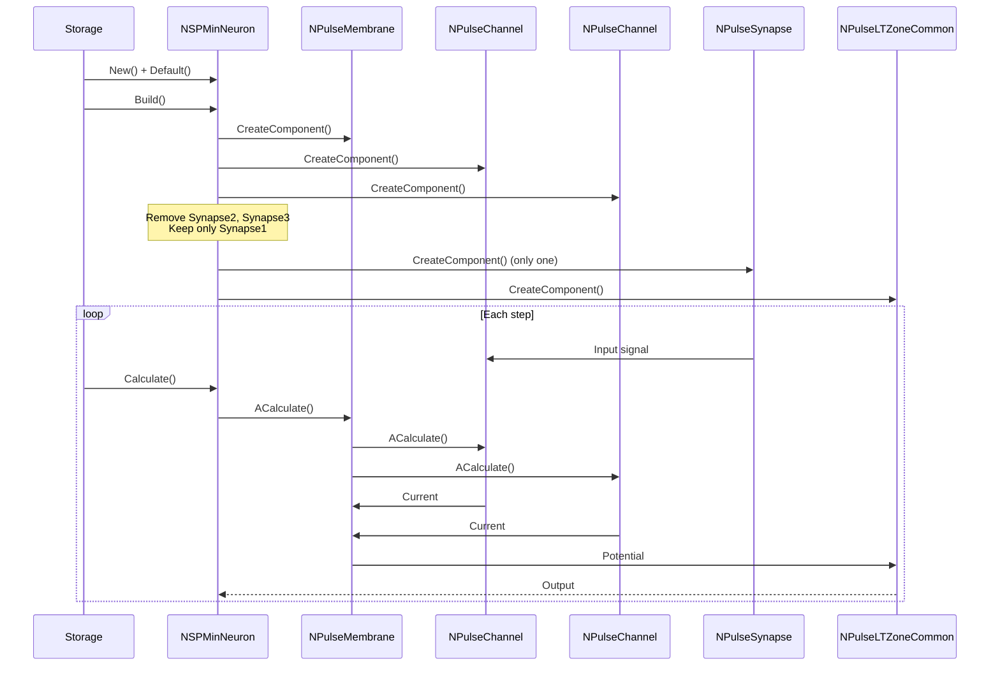
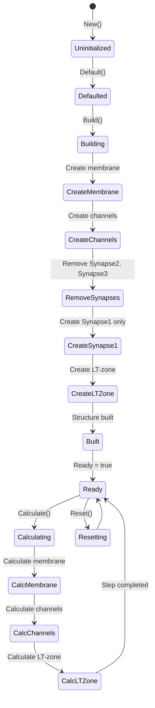
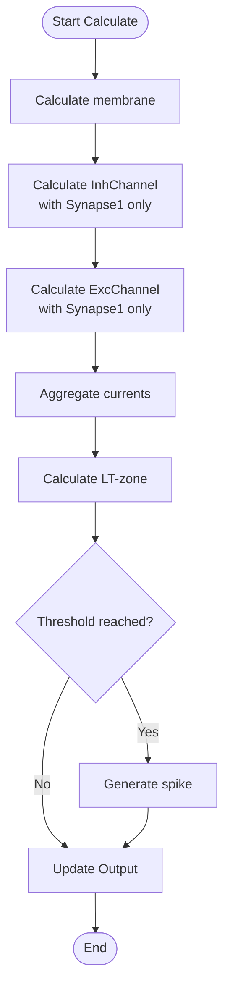

# NSPMinNeuron — минимальный мелкий импульсный нейрон

## RU

### Назначение

**Класс**: `NSPMinNeuron` — конфигурационный вариант минимального мелкого импульсного нейрона с минимальным количеством синапсов.  
**Регистрация**: `NPulseLibrary.cpp` → `UploadClass("NSPMinNeuron", ...)` (закомментирован в коде).  
**Storage-инстансы**: `ClassName = "NSPMinNeuron"` в `Bin/Configs/*/Model_*.xml`.

`NSPMinNeuron` является конфигурационным вариантом базового класса `NPulseNeuron` с минимальной конфигурацией — удаляются дополнительные синапсы, оставляется только один синапс на канал. Создается из `NPulseNeuron` с удалением синапсов Synapse2 и Synapse3 из InhChannel и ExcChannel.

**Примечание:** В текущей версии кода регистрация `NSPMinNeuron` закомментирована в `NPulseLibrary.cpp`.

**Использование:** Минимальные нейронные сети, упрощенные модели

### UML-диаграмма классов



**Иерархия наследования:**
- `NPulseNeuronCommon` — общий импульсный нейрон
- `NPulseNeuron` — импульсный нейрон с параметрами структурирования
- `NSPMinNeuron` — конфигурационный вариант с минимальной конфигурацией

**Особенности:**
- Удаляются синапсы Synapse2 и Synapse3 из InhChannel
- Удаляются синапсы Synapse2 и Synapse3 из ExcChannel
- Остается только Synapse1 на каждом канале
- **Примечание:** Методы `GetPosChannel()` и `GetNegChannel()` возвращают каналы с фактическими именами "ExcChannel" (Type=-1) и "InhChannel" (Type=1) соответственно

### Свойства

`NSPMinNeuron` использует все свойства базового класса `NPulseNeuron` с минимальной конфигурацией.

### Методы

`NSPMinNeuron` использует все методы базового класса `NPulseNeuron`.

## Источники

См. [Literature-References.md](../Literature-References.md): **[A]**, **4**, **25**, **29**.

### См. также

- [`NPulseNeuron`](NPulseNeuron.md) — импульсный нейрон с параметрами структурирования
- [`NSPNeuron`](NSPNeuron.md) — базовый SP-нейрон
- [Architecture.md](../Architecture.md) — архитектура библиотеки

---

## EN

### Purpose

**Class**: `NSPMinNeuron` — configuration variant of minimal small spiking neuron with minimal number of synapses.  
**Registration**: `NPulseLibrary.cpp` → `UploadClass("NSPMinNeuron", ...)` (commented out in code).  
**Instances**: `ClassName = "NSPMinNeuron"` in `Bin/Configs/*/Model_*.xml`.

`NSPMinNeuron` is a configuration variant of the base class `NPulseNeuron` with minimal configuration — additional synapses are removed, leaving only one synapse per channel. Created from `NPulseNeuron` with deletion of synapses Synapse2 and Synapse3 from InhChannel and ExcChannel.

**Note:** In the current code version, registration of `NSPMinNeuron` is commented out in `NPulseLibrary.cpp`.

**Usage:** Minimal neural networks, simplified models

### UML Class Diagram



### UML Sequence Diagram



### UML State Diagram



### UML Activity Diagram



### UML Component Diagram

```mermaid
graph TB
    subgraph NPulseNeuron["NPulseNeuron Base"]
        BaseNeuron[NPulseNeuron]
    end
    
    subgraph NSPMinNeuron["NSPMinNeuron Configuration"]
        Membrane[NPulseMembrane]
        InhChannel[NPulseChannel<br/>InhChannel]
        ExcChannel[NPulseChannel<br/>ExcChannel]
        Synapse1[NPulseSynapse<br/>Synapse1 only]
        LTZone[NPulseLTZoneCommon]
    end
    
    subgraph External["External Components"]
        PreNeurons[Presynaptic Neurons]
    end
    
    BaseNeuron -->|configured as| NSPMinNeuron
    NSPMinNeuron -->|creates| Membrane
    NSPMinNeuron -->|creates| InhChannel
    NSPMinNeuron -->|creates| ExcChannel
    NSPMinNeuron -->|creates| Synapse1
    Note over NSPMinNeuron: Synapse2, Synapse3 removed
    NSPMinNeuron -->|creates| LTZone
    PreNeurons -->|Input| Synapse1
    Synapse1 -->|current| InhChannel
    Synapse1 -->|current| ExcChannel
    InhChannel -->|current| Membrane
    ExcChannel -->|current| Membrane
    Membrane -->|potential| LTZone
    LTZone -->|Output| NSPMinNeuron
```

### Properties

`NSPMinNeuron` uses all properties of base class `NPulseNeuron` with minimal configuration:
- `NumSomaMembraneParts = 1` — one soma part
- `NumDendriteMembraneParts = 1` — one dendrite part

**Features:**
- Minimal synapses: Only Synapse1 per channel (Synapse2 and Synapse3 are removed)
- Simplified structure: Minimal configuration for simplified models

### Methods

`NSPMinNeuron` uses all methods of base class `NPulseNeuron`.

### Usage in configurations

`NSPMinNeuron` is used in minimal neural network experiments:

- **Minimal networks**: `Bin/Configs/*/Model_*.xml` (where minimal neuron configuration is required)
- **Simplified models**: Experiments with simplified neuron models

**Note:** Registration of `NSPMinNeuron` is commented out in `NPulseLibrary.cpp` in the current code version.

**Typical parameter values:**
- **NumSomaMembraneParts**: 1 (one soma part)
- **NumDendriteMembraneParts**: 1 (one dendrite part)

**Features:**
- Minimal configuration: Only one synapse per channel
- Simplified structure: Removes additional synapses for minimal models
- Note: Currently commented out in code registration

### References

See [Literature-References.md](../Literature-References.md): **[A]**, **4**, **25**, **29**.

### See Also

- [`NPulseNeuron`](NPulseNeuron.md) — spiking neuron with structuring parameters
- [`NSPNeuron`](NSPNeuron.md) — base SP-neuron
- [Architecture.md](../Architecture.md) — library architecture
