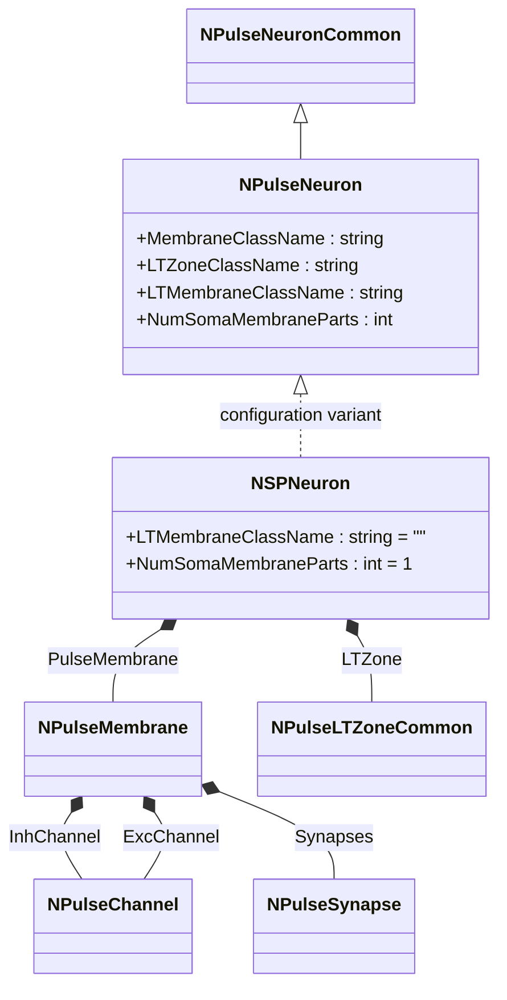
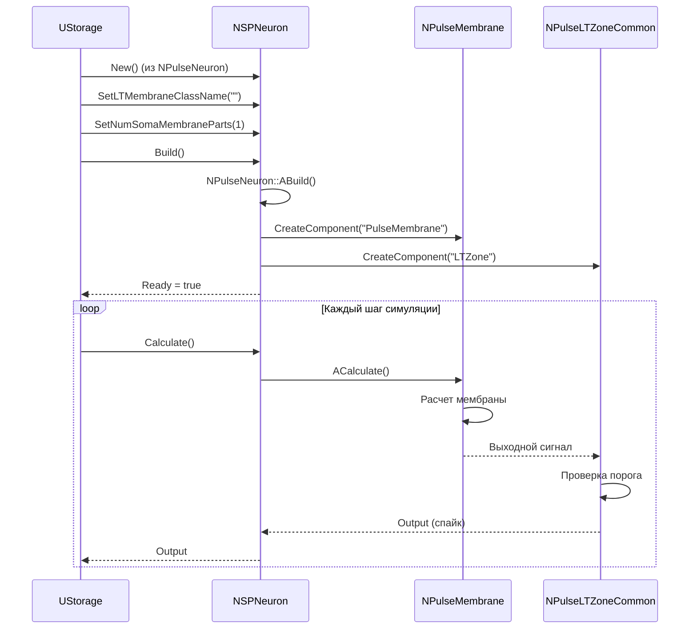
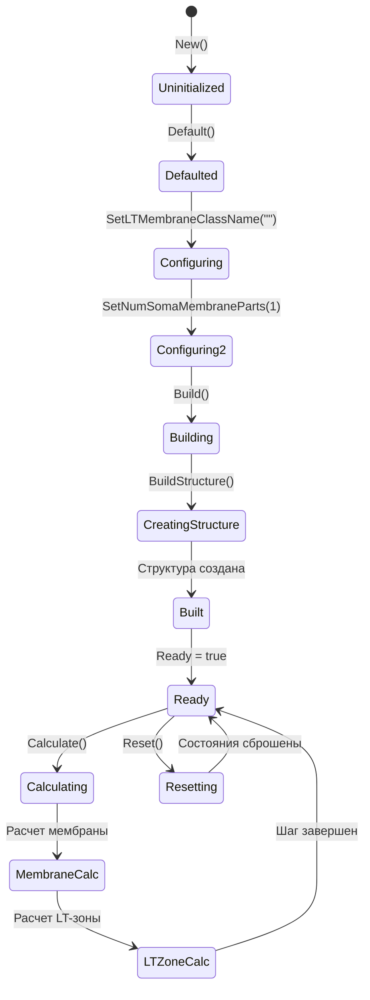
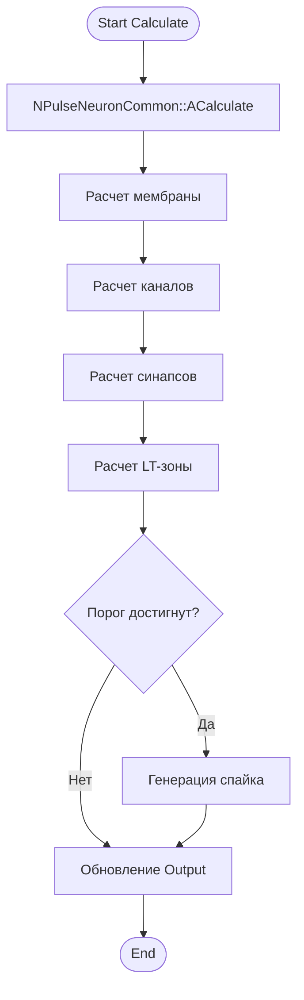
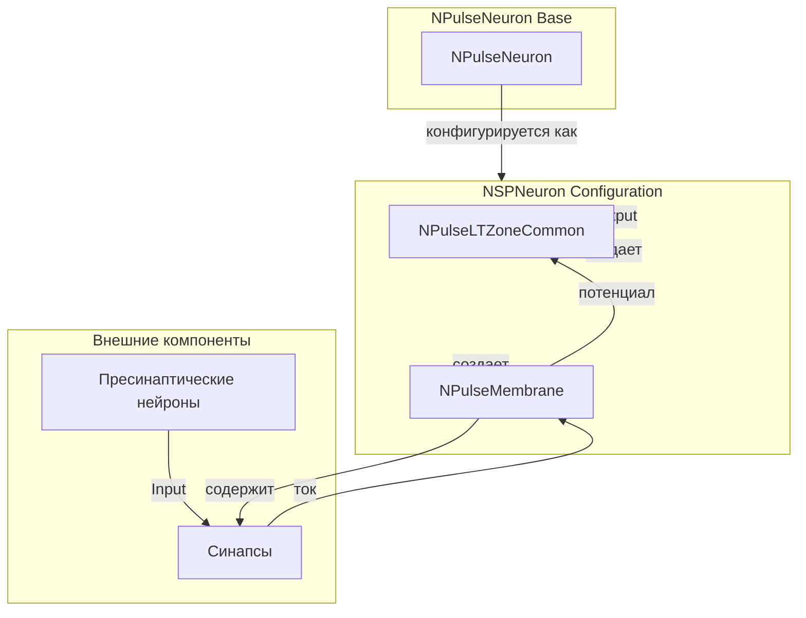
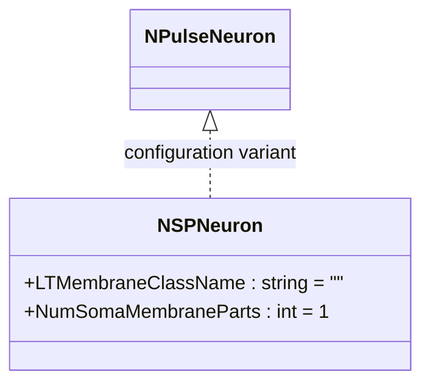
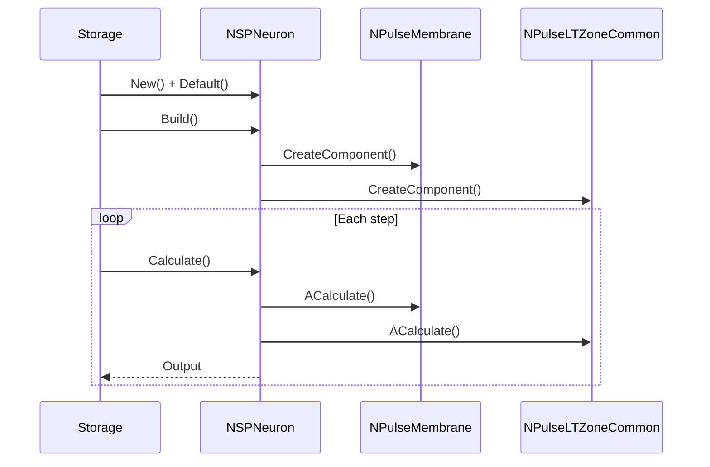
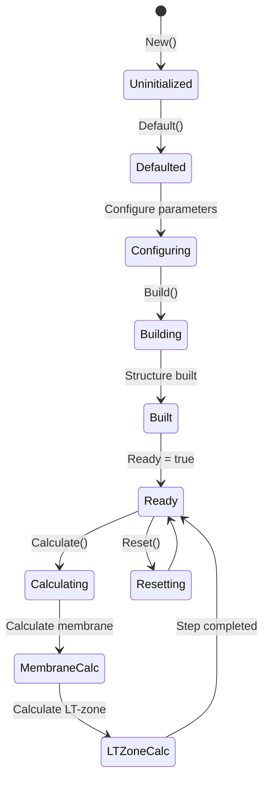
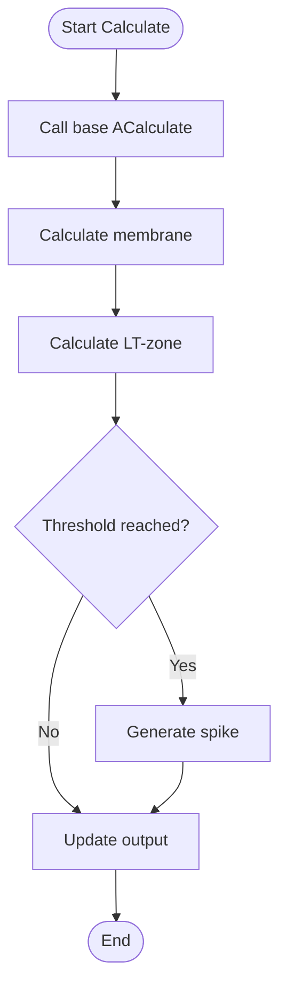
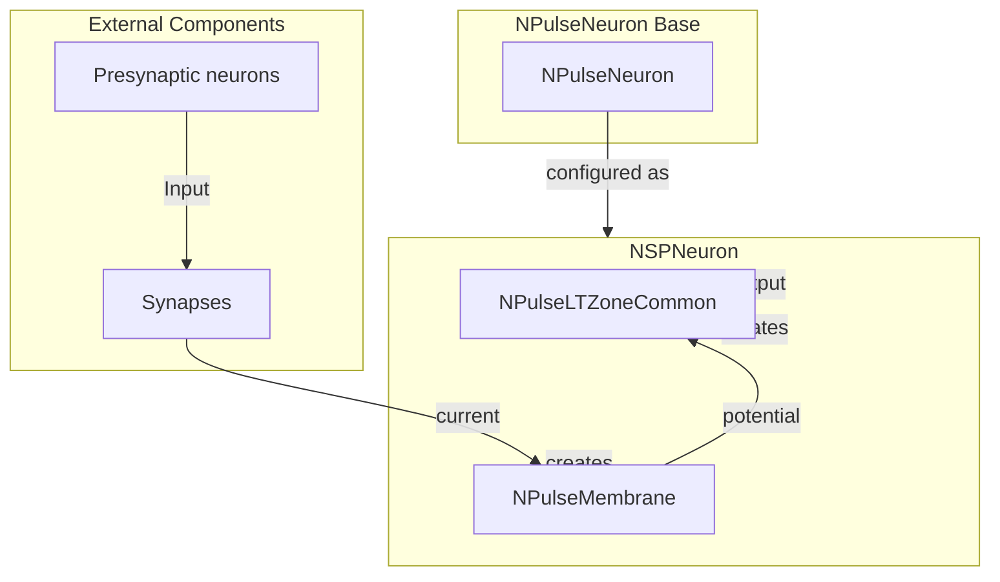

# NSPNeuron — мелкий импульсный нейрон (SP-нейрон)

## RU

### Назначение

**Класс**: `NSPNeuron` — конфигурационный вариант мелкого импульсного нейрона (Small Pulse Neuron).  
**Регистрация**: `NPulseLibrary.cpp` → `UploadClass("NSPNeuron", ...)`.  
**Storage-инстансы**: `ClassName = "NSPNeuron"` в `Bin/Configs/*/Model_*.xml`.

`NSPNeuron` является конфигурационным вариантом базового класса `NPulseNeuron` с предустановленными параметрами для мелких нейронов. Создается из `NPulseNeuron` с настройками:
- `LTMembraneClassName = ""` — без LT-мембраны
- `NumSomaMembraneParts = 1` — одна часть сомы

SP-нейроны (Small Pulse Neurons) — это мелкие нейроны с минимальной структурой, используемые для базовых экспериментов и простых сетей.

**Использование:** Базовые эксперименты, простые нейронные сети, моделирование мелких нейронов

### UML-диаграмма классов



**Иерархия наследования:**
- `NPulseNeuronCommon` — общий импульсный нейрон
- `NPulseNeuron` — импульсный нейрон с параметрами структурирования
- `NSPNeuron` — конфигурационный вариант для мелких нейронов

**Внутренняя структура:**
- **PulseMembrane** (`NPulseMembrane`) — стандартная мембрана
- **LTZone** (`NPulseLTZoneCommon`) — стандартная LT-зона
- Без LT-мембраны (LTMembraneClassName = "")

### UML-диаграмма последовательности



**Жизненный цикл:**
1. **Создание**: `NSPNeuron` создается из `NPulseNeuron` с настройкой параметров
2. **Настройка**: Устанавливается отсутствие LT-мембраны, одна часть сомы
3. **Сборка**: Автоматически создается структура нейрона
4. **Расчет**: На каждом шаге рассчитываются мембрана и LT-зона

### UML-диаграмма состояний



### UML-диаграмма активности



### UML-диаграмма компонентов



### Свойства

`NSPNeuron` использует все свойства базового класса `NPulseNeuron` с предустановленными значениями:

**Наследуемые свойства от NPulseNeuron:**
- `LTMembraneClassName` (string) — имя класса LT-мембраны (устанавливается в "")
- `NumSomaMembraneParts` (int) — количество частей сомы (устанавливается в 1)
- Все остальные свойства базового класса

### Методы

`NSPNeuron` использует все методы базового класса `NPulseNeuron`.

### Примеры использования

#### Пример 1: Создание SP-нейрона в коде C++

```cpp
// Создание SP-нейрона
auto neuron = storage->CreateComponent<NPulseNeuron>();
neuron->SetName("SPNeuron");

// Инициализация
neuron->Default();

// Настройка параметров для SP-нейрона
neuron->LTMembraneClassName = "";
neuron->NumSomaMembraneParts = 1;

// Сборка
neuron->Build();
```

### Использование в конфигурациях

`NSPNeuron` используется в базовых экспериментах с импульсными нейронными сетями:

- **Базовые эксперименты**: `Bin/Configs/!OldConfigs/NM-Neurons/` (эксперименты с нейронами)

**Типичные значения параметров:**
- **LTMembraneClassName**: "" (без LT-мембраны)
- **NumSomaMembraneParts**: 1 (одна часть сомы)
- **MembraneClassName**: "NPulseMembrane" (стандартная мембрана)
- **LTZoneClassName**: "NPulseLTZoneCommon" (стандартная LT-зона)

**Особенности:**
- Минимальная структура: без LT-мембраны, одна часть сомы
- Простота использования: подходит для базовых экспериментов
- Конфигурационный вариант: создается из `NPulseNeuron` с предустановленными параметрами

### См. также

- [`NPulseNeuron`](NPulseNeuron.md) — импульсный нейрон с параметрами структурирования (базовый класс)
- [`NSPNeuronGen`](NSPNeuronGen.md) — SP-нейрон с упрощенным генератором спайков
- [`NSPNeuronBio`](NSPNeuronBio.md) — SP-нейрон с биологически правдоподобными параметрами
- [`NSPNeuronBio2`](NSPNeuronBio2.md) — SP-нейрон с биологически правдоподобными параметрами (версия 2)
- [`NLPNeuron`](NLPNeuron.md) — крупный импульсный нейрон (LP-нейрон)
- [Architecture.md](../Architecture.md) — архитектура библиотеки

---

## EN

### Purpose

**Class**: `NSPNeuron` — configuration variant of small spiking neuron (Small Pulse Neuron).  
**Registration**: `NPulseLibrary.cpp` → `UploadClass("NSPNeuron", ...)`.  
**Instances**: `ClassName = "NSPNeuron"` in `Bin/Configs/*/Model_*.xml`.

`NSPNeuron` is a configuration variant of the base class `NPulseNeuron` with preset parameters for small neurons. Created from `NPulseNeuron` with settings:
- `LTMembraneClassName = ""` — without LT-membrane
- `NumSomaMembraneParts = 1` — one soma part

SP-neurons (Small Pulse Neurons) are small neurons with minimal structure, used for basic experiments and simple networks.

**Usage:** Basic experiments, simple neural networks, modeling small neurons

### UML Class Diagram



### UML Sequence Diagram



### UML State Diagram



### UML Activity Diagram



### UML Component Diagram



### Properties

`NSPNeuron` uses all properties of base class `NPulseNeuron` with preset values:

**Inherited properties from NPulseNeuron:**
- `LTMembraneClassName` (string) — LT-membrane class name (set to "")
- `NumSomaMembraneParts` (int) — number of soma parts (set to 1)
- All other base class properties

### Methods

`NSPNeuron` uses all methods of base class `NPulseNeuron`.

### Usage in configurations

`NSPNeuron` is used in basic experiments with spiking neural networks:

- **Basic experiments**: `Bin/Configs/!OldConfigs/NM-Neurons/` (experiments with neurons)

**Typical parameter values:**
- **LTMembraneClassName**: "" (without LT-membrane)
- **NumSomaMembraneParts**: 1 (one soma part)
- **MembraneClassName**: "NPulseMembrane" (standard membrane)
- **LTZoneClassName**: "NPulseLTZoneCommon" (standard LT-zone)

**Features:**
- Minimal structure: without LT-membrane, one soma part
- Easy to use: suitable for basic experiments
- Configuration variant: created from `NPulseNeuron` with preset parameters

### See Also

- [`NPulseNeuron`](NPulseNeuron.md) — spiking neuron with structuring parameters (base class)
- [`NSPNeuronGen`](NSPNeuronGen.md) — SP-neuron with simplified spike generator
- [`NSPNeuronBio`](NSPNeuronBio.md) — SP-neuron with bio-inspired parameters
- [`NSPNeuronBio2`](NSPNeuronBio2.md) — SP-neuron with bio-inspired parameters (version 2)
- [`NLPNeuron`](NLPNeuron.md) — large spiking neuron (LP-neuron)
- [Architecture.md](../Architecture.md) — library architecture
