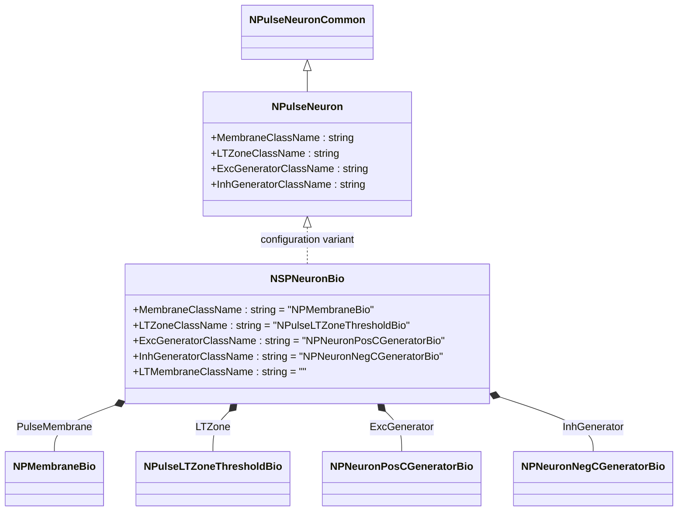
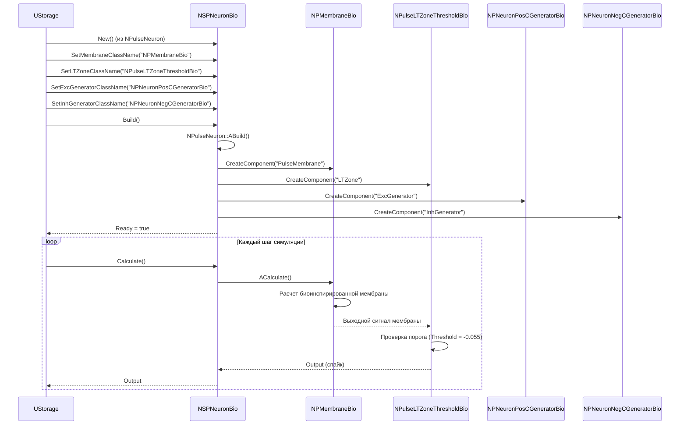
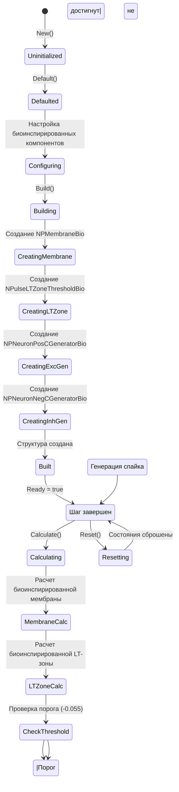
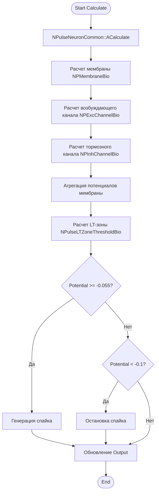
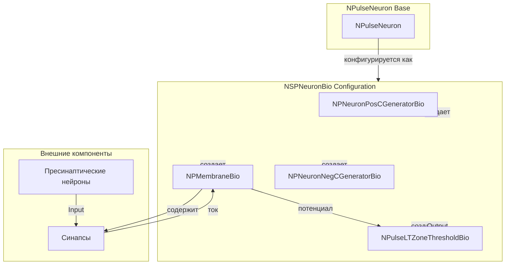
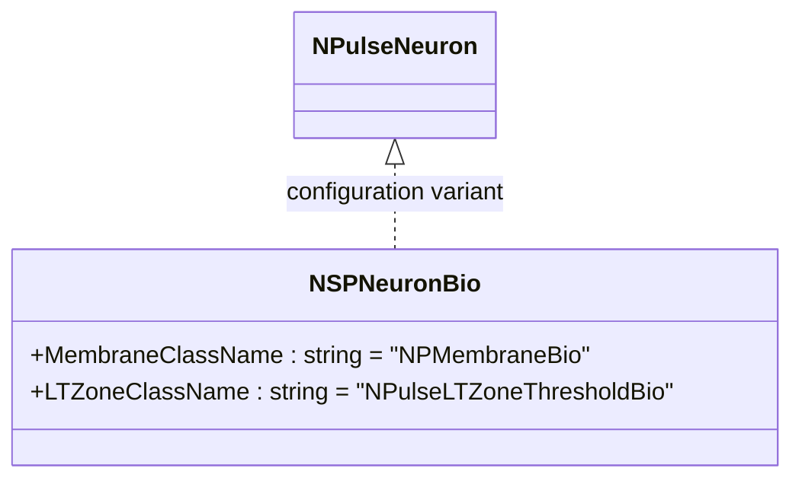
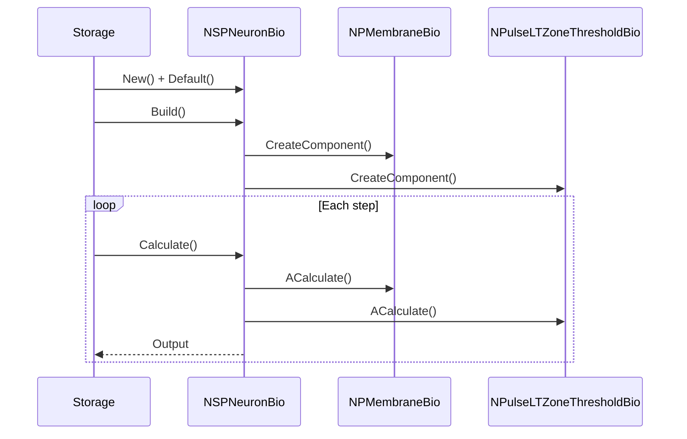
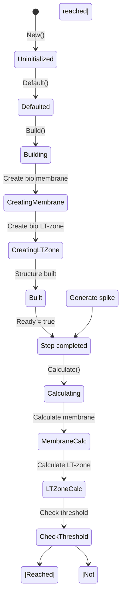
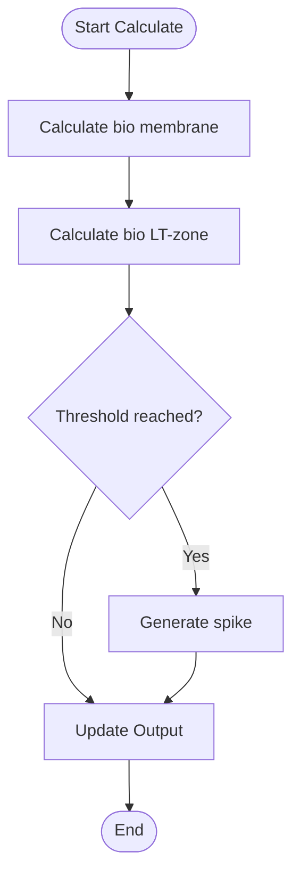
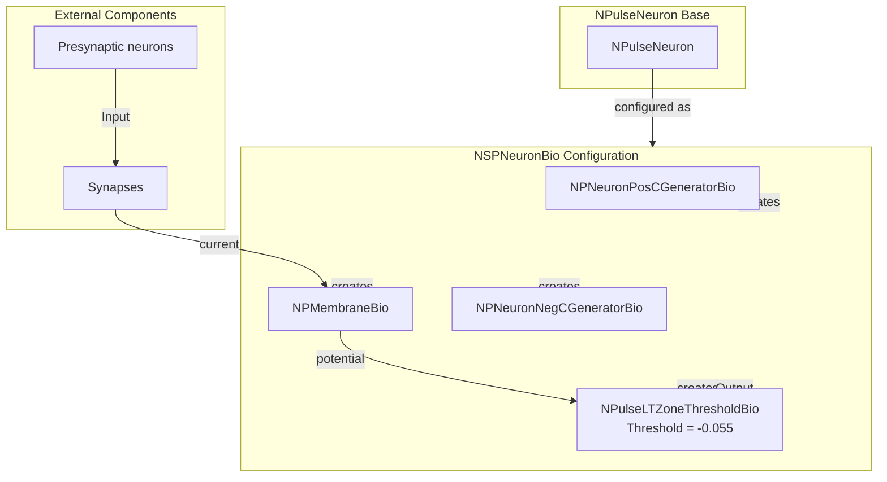

# NSPNeuronBio — мелкий импульсный нейрон с биологически правдоподобными параметрами

## RU

### Назначение

**Класс**: `NSPNeuronBio` — конфигурационный вариант мелкого импульсного нейрона с биологически правдоподобными параметрами.  
**Регистрация**: `NPulseLibrary.cpp` → `UploadClass("NSPNeuronBio", ...)`.  
**Storage-инстансы**: `ClassName = "NSPNeuronBio"` в `Bin/Configs/*/Model_*.xml`.

`NSPNeuronBio` является конфигурационным вариантом базового класса `NPulseNeuron` с предустановленными биологически правдоподобными параметрами. Создается из `NPulseNeuron` с настройками:
- `LTMembraneClassName = ""` — без LT-мембраны
- `MembraneClassName = "NPMembraneBio"` — биоинспирированная мембрана
- `LTZoneClassName = "NPulseLTZoneThresholdBio"` — биоинспирированная LT-зона с порогом
- `ExcGeneratorClassName = "NPNeuronPosCGeneratorBio"` — биоинспирированный возбуждающий генератор
- `InhGeneratorClassName = "NPNeuronNegCGeneratorBio"` — биоинспирированный тормозной генератор

**Использование:** Моделирование биологически реалистичных мелких нейронов, эксперименты с биоинспирированными параметрами

### UML-диаграмма классов



**Иерархия наследования:**
- `NPulseNeuronCommon` — общий импульсный нейрон
- `NPulseNeuron` — импульсный нейрон с параметрами структурирования
- `NSPNeuronBio` — конфигурационный вариант с биологически правдоподобными параметрами

**Внутренняя структура:**
- **PulseMembrane** (`NPMembraneBio`) — биоинспирированная мембрана
- **LTZone** (`NPulseLTZoneThresholdBio`) — биоинспирированная LT-зона с порогом (Threshold = -0.055, ThresholdOff = -0.1)
- **ExcGenerator** (`NPNeuronPosCGeneratorBio`) — биоинспирированный возбуждающий генератор
- **InhGenerator** (`NPNeuronNegCGeneratorBio`) — биоинспирированный тормозной генератор

### UML-диаграмма последовательности



**Жизненный цикл:**
1. **Создание**: `NSPNeuronBio` создается из `NPulseNeuron` с настройкой биоинспирированных компонентов
2. **Настройка**: Устанавливаются биоинспирированные мембрана, LT-зона и генераторы
3. **Сборка**: Автоматически создается структура нейрона с биоинспирированными компонентами
4. **Расчет**: На каждом шаге рассчитываются биоинспирированные компоненты

### UML-диаграмма состояний



**Состояния:**
- **Uninitialized** — создан, но не инициализирован
- **Defaulted** — параметры установлены по умолчанию
- **Configuring** — настройка биоинспирированных компонентов
- **Building** — выполняется сборка
- **CreatingMembrane** — создание биоинспирированной мембраны
- **CreatingLTZone** — создание биоинспирированной LT-зоны
- **CreatingExcGen** — создание возбуждающего генератора
- **CreatingInhGen** — создание тормозного генератора
- **Built** — структура нейрона построена
- **Ready** — готов к выполнению расчетов
- **Calculating** — выполняется расчет нейрона
- **MembraneCalc** — расчет биоинспирированной мембраны
- **LTZoneCalc** — расчет биоинспирированной LT-зоны
- **CheckThreshold** — проверка порога (-0.055)
- **GenerateSpike** — генерация спайка
- **Resetting** — выполняется сброс состояний

### UML-диаграмма активности



**Алгоритм расчета:**
1. Вызов базового расчета (`NPulseNeuronCommon::ACalculate()`)
2. Расчет биоинспирированной мембраны: расчет возбуждающих и тормозных каналов
3. Агрегация потенциалов от всех каналов
4. Расчет биоинспирированной LT-зоны: проверка порогов (-0.055 для генерации, -0.1 для остановки)
5. Генерация спайка при достижении порога
6. Обновление выходного сигнала нейрона

### UML-диаграмма компонентов



**Зависимости:**
- **Базовый класс**: `NPulseNeuron` (конфигурационный вариант)
- **Внутренние компоненты**: `NPMembraneBio` (мембрана), `NPulseLTZoneThresholdBio` (LT-зона), `NPNeuronPosCGeneratorBio` (возбуждающий генератор), `NPNeuronNegCGeneratorBio` (тормозной генератор)
- **Внешние компоненты**: синапсы, пресинаптические нейроны

### Свойства

`NSPNeuronBio` использует все свойства базового класса `NPulseNeuron` с параметрами:
- `MembraneClassName = "NPMembraneBio"`
- `LTZoneClassName = "NPulseLTZoneThresholdBio"`
- `ExcGeneratorClassName = "NPNeuronPosCGeneratorBio"`
- `InhGeneratorClassName = "NPNeuronNegCGeneratorBio"`
- `LTMembraneClassName = ""`

### Методы

`NSPNeuronBio` использует все методы базового класса `NPulseNeuron`.

### Примеры использования

#### Пример 1: Создание биоинспирированного SP-нейрона в коде C++

```cpp
// Создание биоинспирированного SP-нейрона
auto neuron = storage->CreateComponent<NPulseNeuron>();
neuron->SetName("SPNeuronBio");

// Инициализация
neuron->Default();

// Настройка параметров
neuron->LTMembraneClassName = "";
neuron->MembraneClassName = "NPMembraneBio";
neuron->LTZoneClassName = "NPulseLTZoneThresholdBio";
neuron->ExcGeneratorClassName = "NPNeuronPosCGeneratorBio";
neuron->InhGeneratorClassName = "NPNeuronNegCGeneratorBio";

// Сборка
neuron->Build();
```

### Использование в конфигурациях

`NSPNeuronBio` используется в экспериментах с биологически реалистичными нейронами:

- **Биоинспирированные модели**: `Bin/Configs/!OldConfigs/*/Model_*.xml` (где требуется биологическая реалистичность)

**Типичные значения параметров:**
- **MembraneClassName**: "NPMembraneBio" (биоинспирированная мембрана)
- **LTZoneClassName**: "NPulseLTZoneThresholdBio" (LT-зона с порогом -0.055)
- **ExcGeneratorClassName**: "NPNeuronPosCGeneratorBio" (возбуждающий генератор)
- **InhGeneratorClassName**: "NPNeuronNegCGeneratorBio" (тормозной генератор)
- **LTMembraneClassName**: "" (без LT-мембраны)

## Источники

См. [Literature-References.md](../Literature-References.md): **26**, **29**, **30**.

### См. также

- [`NPulseNeuron`](NPulseNeuron.md) — импульсный нейрон с параметрами структурирования
- [`NSPNeuron`](NSPNeuron.md) — базовый SP-нейрон
- [`NSPNeuronBio2`](NSPNeuronBio2.md) — SP-нейрон с биологически правдоподобными параметрами (версия 2)
- [`NPMembraneBio`](NPMembraneBio.md) — биоинспирированная мембрана
- [`NPulseLTZoneThresholdBio`](NPulseLTZoneThresholdBio.md) — биоинспирированная LT-зона с порогом
- [Architecture.md](../Architecture.md) — архитектура библиотеки

---

## EN

### Purpose

**Class**: `NSPNeuronBio` — configuration variant of small spiking neuron with biologically plausible parameters.  
**Registration**: `NPulseLibrary.cpp` → `UploadClass("NSPNeuronBio", ...)`.  
**Instances**: `ClassName = "NSPNeuronBio"` in `Bin/Configs/*/Model_*.xml`.

`NSPNeuronBio` is a configuration variant of the base class `NPulseNeuron` with preset biologically plausible parameters. Created from `NPulseNeuron` with settings:
- `LTMembraneClassName = ""` — without LT-membrane
- `MembraneClassName = "NPMembraneBio"` — bio-inspired membrane
- `LTZoneClassName = "NPulseLTZoneThresholdBio"` — bio-inspired LT-zone with threshold
- `ExcGeneratorClassName = "NPNeuronPosCGeneratorBio"` — bio-inspired excitatory generator
- `InhGeneratorClassName = "NPNeuronNegCGeneratorBio"` — bio-inspired inhibitory generator

**Usage:** Modeling biologically realistic small neurons, experiments with bio-inspired parameters

### UML Class Diagram



### UML Sequence Diagram



### UML State Diagram



### UML Activity Diagram



### UML Component Diagram



### Properties

`NSPNeuronBio` uses all properties of base class `NPulseNeuron` with parameters:
- `MembraneClassName = "NPMembraneBio"` — bio-inspired membrane
- `LTZoneClassName = "NPulseLTZoneThresholdBio"` — bio-inspired LT-zone with threshold
- `ExcGeneratorClassName = "NPNeuronPosCGeneratorBio"` — bio-inspired excitatory generator
- `InhGeneratorClassName = "NPNeuronNegCGeneratorBio"` — bio-inspired inhibitory generator
- `LTMembraneClassName = ""` — without LT-membrane

### Methods

`NSPNeuronBio` uses all methods of base class `NPulseNeuron`.

### Usage in configurations

`NSPNeuronBio` is used in experiments with biologically realistic neurons:

- **Bio-inspired models**: `Bin/Configs/!OldConfigs/*/Model_*.xml` (where biological realism is required)

**Typical parameter values:**
- **MembraneClassName**: "NPMembraneBio" (bio-inspired membrane)
- **LTZoneClassName**: "NPulseLTZoneThresholdBio" (LT-zone with threshold -0.055)
- **ExcGeneratorClassName**: "NPNeuronPosCGeneratorBio" (excitatory generator)
- **InhGeneratorClassName**: "NPNeuronNegCGeneratorBio" (inhibitory generator)
- **LTMembraneClassName**: "" (without LT-membrane)

**Features:**
- Biologically plausible: all components use bio-inspired parameters
- Realistic thresholds: LT-zone uses biological threshold values (-0.055 for spike, -0.1 for stop)
- Complete bio setup: includes both excitatory and inhibitory generators

### References

See [Literature-References.md](../Literature-References.md): **26**, **29**, **30**.

### See Also

- [`NPulseNeuron`](NPulseNeuron.md) — spiking neuron with structuring parameters
- [`NSPNeuron`](NSPNeuron.md) — base SP-neuron
- [`NSPNeuronBio2`](NSPNeuronBio2.md) — SP-neuron with bio-inspired parameters (version 2)
- [`NPMembraneBio`](NPMembraneBio.md) — bio-inspired membrane
- [`NPulseLTZoneThresholdBio`](NPulseLTZoneThresholdBio.md) — bio-inspired LT-zone with threshold
- [Architecture.md](../Architecture.md) — library architecture
