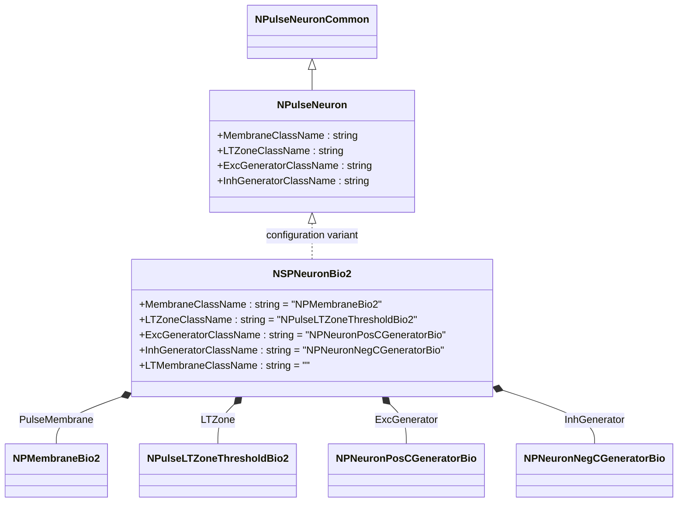
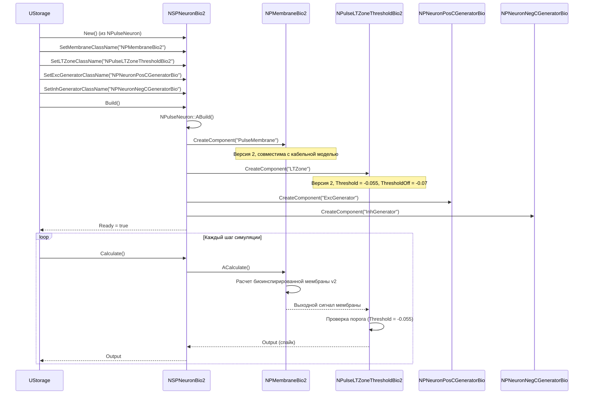
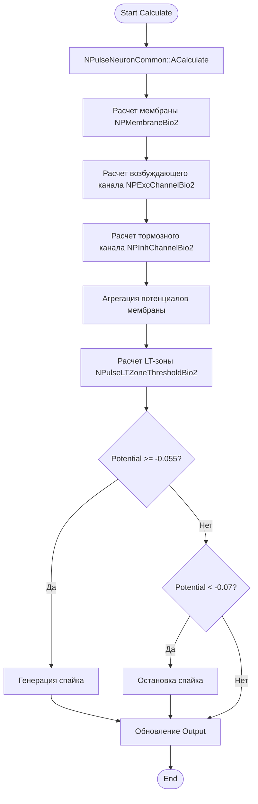
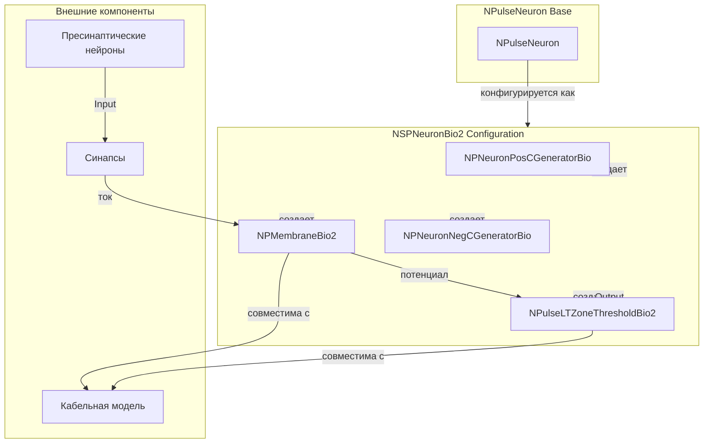
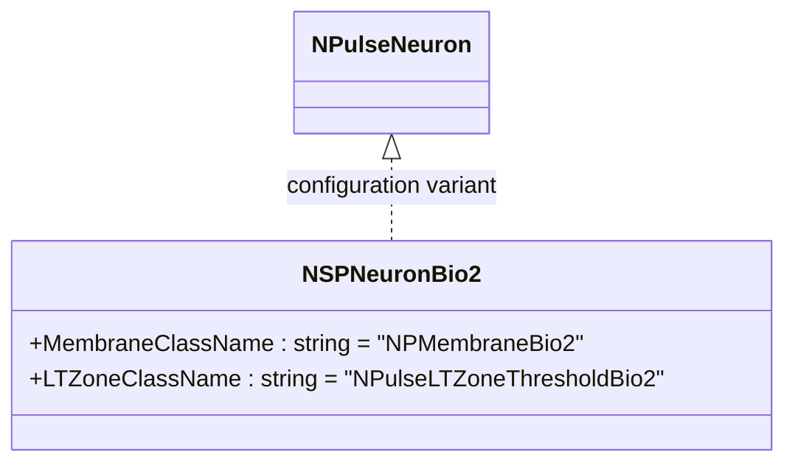
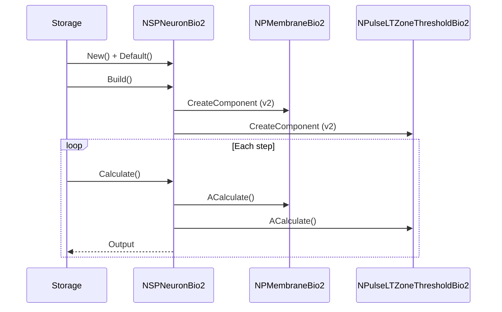
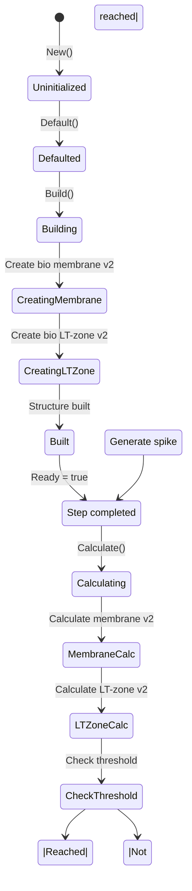
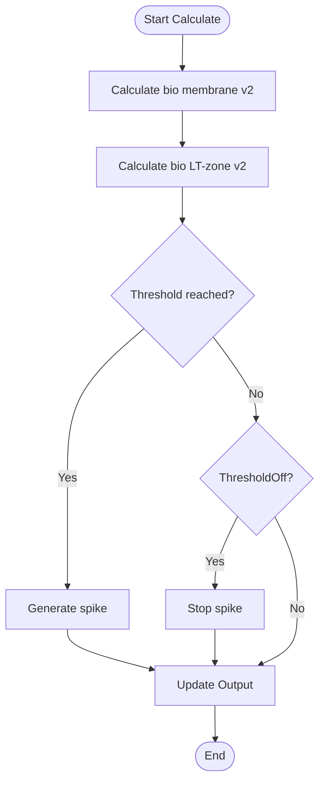
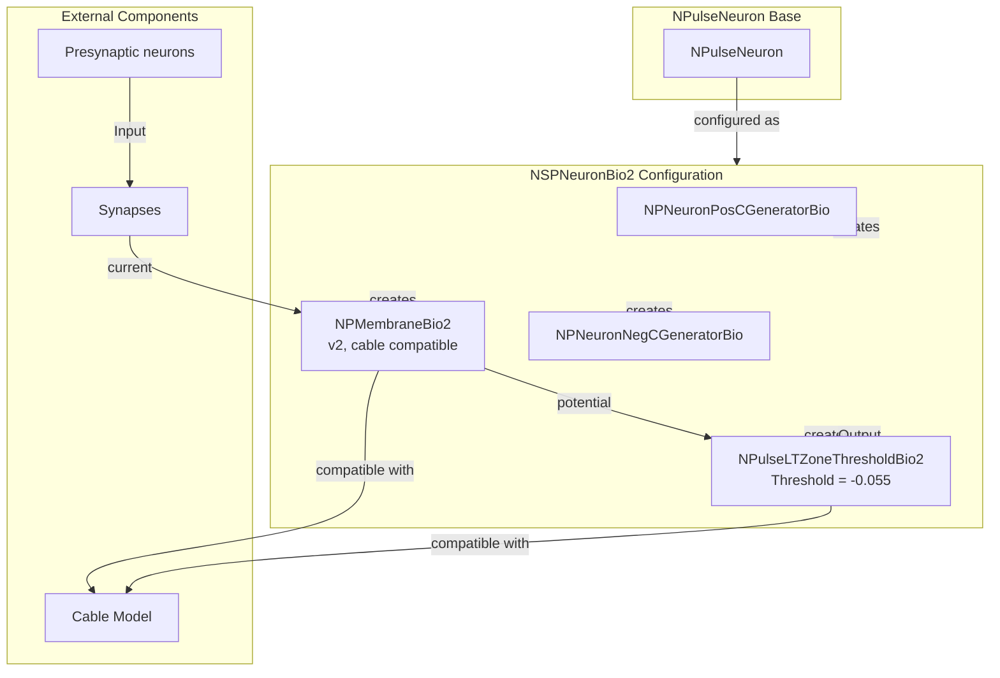

# NSPNeuronBio2 — мелкий импульсный нейрон с биологически правдоподобными параметрами (версия 2)

## RU

### Назначение

**Класс**: `NSPNeuronBio2` — конфигурационный вариант мелкого импульсного нейрона с биологически правдоподобными параметрами (версия 2, совместимая с кабельной моделью).  
**Регистрация**: `NPulseLibrary.cpp` → `UploadClass("NSPNeuronBio2", ...)`.  
**Storage-инстансы**: `ClassName = "NSPNeuronBio2"` в `Bin/Configs/*/Model_*.xml`.

`NSPNeuronBio2` является конфигурационным вариантом базового класса `NPulseNeuron` с предустановленными биологически правдоподобными параметрами версии 2, совместимыми с кабельной моделью. Создается из `NPulseNeuron` с настройками:
- `LTMembraneClassName = ""` — без LT-мембраны
- `MembraneClassName = "NPMembraneBio2"` — биоинспирированная мембрана версии 2
- `LTZoneClassName = "NPulseLTZoneThresholdBio2"` — биоинспирированная LT-зона версии 2 с порогом
- `ExcGeneratorClassName = "NPNeuronPosCGeneratorBio"` — биоинспирированный возбуждающий генератор
- `InhGeneratorClassName = "NPNeuronNegCGeneratorBio"` — биоинспирированный тормозной генератор

Отличие от `NSPNeuronBio` заключается в использовании версии 2 компонентов (`NPMembraneBio2`, `NPulseLTZoneThresholdBio2`), которые совместимы с кабельной моделью.

**Использование:** Моделирование биологически реалистичных мелких нейронов, совместимых с кабельной моделью

### UML-диаграмма классов



**Иерархия наследования:**
- `NPulseNeuronCommon` — общий импульсный нейрон
- `NPulseNeuron` — импульсный нейрон с параметрами структурирования
- `NSPNeuronBio2` — конфигурационный вариант с биологически правдоподобными параметрами версии 2

**Внутренняя структура:**
- **PulseMembrane** (`NPMembraneBio2`) — биоинспирированная мембрана версии 2
- **LTZone** (`NPulseLTZoneThresholdBio2`) — биоинспирированная LT-зона версии 2 с порогом (Threshold = -0.055, ThresholdOff = -0.07)
- **ExcGenerator** (`NPNeuronPosCGeneratorBio`) — биоинспирированный возбуждающий генератор
- **InhGenerator** (`NPNeuronNegCGeneratorBio`) — биоинспирированный тормозной генератор

### UML-диаграмма последовательности



**Жизненный цикл:**
1. **Создание**: `NSPNeuronBio2` создается из `NPulseNeuron` с настройкой биоинспирированных компонентов версии 2
2. **Настройка**: Устанавливаются биоинспирированные компоненты версии 2 (совместимые с кабельной моделью)
3. **Сборка**: Автоматически создается структура нейрона с биоинспирированными компонентами версии 2
4. **Расчет**: На каждом шаге рассчитываются биоинспирированные компоненты версии 2

### UML-диаграмма состояний

```mermaid
stateDiagram-v2
    [*] --> Uninitialized: New()
    Uninitialized --> Defaulted: Default()
    Defaulted --> Configuring: Настройка биоинспирированных компонентов v2
    Configuring --> Building: Build()
    Building --> CreatingMembrane: Создание NPMembraneBio2
    CreatingMembrane --> CreatingLTZone: Создание NPulseLTZoneThresholdBio2
    CreatingLTZone --> CreatingExcGen: Создание NPNeuronPosCGeneratorBio
    CreatingExcGen --> CreatingInhGen: Создание NPNeuronNegCGeneratorBio
    CreatingInhGen --> Built: Структура создана
    Built --> Ready: Ready = true
    Ready --> Calculating: Calculate()
    Calculating --> MembraneCalc: Расчет биоинспирированной мембраны v2
    MembraneCalc --> LTZoneCalc: Расчет биоинспирированной LT-зоны v2
    LTZoneCalc --> CheckThreshold: Проверка порога (-0.055)
    CheckThreshold -->|Порог достигнут| GenerateSpike: Генерация спайка
    CheckThreshold -->|Порог не достигнут| CheckThresholdOff: Проверка ThresholdOff (-0.07)
    CheckThresholdOff -->|Потенциал < -0.07| StopSpike: Остановка спайка
    CheckThresholdOff -->|Потенциал >= -0.07| Ready: Шаг завершен
    GenerateSpike --> Ready
    StopSpike --> Ready
    Ready --> Resetting: Reset()
    Resetting --> Ready: Состояния сброшены
```

**Состояния:**
- **Uninitialized** — создан, но не инициализирован
- **Defaulted** — параметры установлены по умолчанию
- **Configuring** — настройка биоинспирированных компонентов версии 2
- **Building** — выполняется сборка
- **CreatingMembrane** — создание биоинспирированной мембраны версии 2
- **CreatingLTZone** — создание биоинспирированной LT-зоны версии 2
- **CreatingExcGen** — создание возбуждающего генератора
- **CreatingInhGen** — создание тормозного генератора
- **Built** — структура нейрона построена
- **Ready** — готов к выполнению расчетов
- **Calculating** — выполняется расчет нейрона
- **MembraneCalc** — расчет биоинспирированной мембраны версии 2
- **LTZoneCalc** — расчет биоинспирированной LT-зоны версии 2
- **CheckThreshold** — проверка порога (-0.055)
- **CheckThresholdOff** — проверка порога остановки (-0.07)
- **GenerateSpike** — генерация спайка
- **StopSpike** — остановка спайка
- **Resetting** — выполняется сброс состояний

### UML-диаграмма активности



**Алгоритм расчета:**
1. Вызов базового расчета (`NPulseNeuronCommon::ACalculate()`)
2. Расчет биоинспирированной мембраны версии 2: расчет возбуждающих и тормозных каналов версии 2
3. Агрегация потенциалов от всех каналов
4. Расчет биоинспирированной LT-зоны версии 2: проверка порогов (-0.055 для генерации, -0.07 для остановки)
5. Генерация спайка при достижении порога
6. Обновление выходного сигнала нейрона

### UML-диаграмма компонентов



**Зависимости:**
- **Базовый класс**: `NPulseNeuron` (конфигурационный вариант)
- **Внутренние компоненты**: `NPMembraneBio2` (мембрана версии 2), `NPulseLTZoneThresholdBio2` (LT-зона версии 2), `NPNeuronPosCGeneratorBio` (возбуждающий генератор), `NPNeuronNegCGeneratorBio` (тормозной генератор)
- **Внешние компоненты**: синапсы, пресинаптические нейроны, кабельная модель (совместимость)

### Свойства

`NSPNeuronBio2` использует все свойства базового класса `NPulseNeuron` с параметрами:
- `MembraneClassName = "NPMembraneBio2"`
- `LTZoneClassName = "NPulseLTZoneThresholdBio2"`
- `ExcGeneratorClassName = "NPNeuronPosCGeneratorBio"`
- `InhGeneratorClassName = "NPNeuronNegCGeneratorBio"`
- `LTMembraneClassName = ""`

### Методы

`NSPNeuronBio2` использует все методы базового класса `NPulseNeuron`.

### Примеры использования

#### Пример 1: Создание биоинспирированного SP-нейрона версии 2 в коде C++

```cpp
// Создание биоинспирированного SP-нейрона версии 2
auto neuron = storage->CreateComponent<NPulseNeuron>();
neuron->SetName("SPNeuronBio2");

// Инициализация
neuron->Default();

// Настройка параметров
neuron->LTMembraneClassName = "";
neuron->MembraneClassName = "NPMembraneBio2";
neuron->LTZoneClassName = "NPulseLTZoneThresholdBio2";
neuron->ExcGeneratorClassName = "NPNeuronPosCGeneratorBio";
neuron->InhGeneratorClassName = "NPNeuronNegCGeneratorBio";

// Сборка
neuron->Build();
```

### Использование в конфигурациях

`NSPNeuronBio2` используется в экспериментах с биологически реалистичными нейронами, совместимыми с кабельной моделью:

- **Биоинспирированные модели с кабелем**: `Bin/Configs/!OldConfigs/*/Model_*.xml` (где требуется совместимость с кабельной моделью)

**Типичные значения параметров:**
- **MembraneClassName**: "NPMembraneBio2" (биоинспирированная мембрана версии 2)
- **LTZoneClassName**: "NPulseLTZoneThresholdBio2" (LT-зона версии 2 с порогом -0.055)
- **ExcGeneratorClassName**: "NPNeuronPosCGeneratorBio" (возбуждающий генератор)
- **InhGeneratorClassName**: "NPNeuronNegCGeneratorBio" (тормозной генератор)
- **LTMembraneClassName**: "" (без LT-мембраны)

**Отличия от NSPNeuronBio:**
- Использует версию 2 компонентов (`NPMembraneBio2`, `NPulseLTZoneThresholdBio2`)
- Совместим с кабельной моделью
- ThresholdOff = -0.07 (вместо -0.1 в версии 1)

## Источники

См. [Literature-References.md](../Literature-References.md): **26**, **29**, **30**.

### См. также

- [`NPulseNeuron`](NPulseNeuron.md) — импульсный нейрон с параметрами структурирования
- [`NSPNeuron`](NSPNeuron.md) — базовый SP-нейрон
- [`NSPNeuronBio`](NSPNeuronBio.md) — SP-нейрон с биологически правдоподобными параметрами (версия 1)
- [`NPMembraneBio2`](NPMembraneBio2.md) — биоинспирированная мембрана версии 2
- [`NPulseLTZoneThresholdBio2`](NPulseLTZoneThresholdBio2.md) — биоинспирированная LT-зона версии 2 с порогом
- [Architecture.md](../Architecture.md) — архитектура библиотеки

---

## EN

### Purpose

**Class**: `NSPNeuronBio2` — configuration variant of small spiking neuron with biologically plausible parameters (version 2, compatible with cable model).  
**Registration**: `NPulseLibrary.cpp` → `UploadClass("NSPNeuronBio2", ...)`.  
**Instances**: `ClassName = "NSPNeuronBio2"` in `Bin/Configs/*/Model_*.xml`.

`NSPNeuronBio2` is a configuration variant of the base class `NPulseNeuron` with preset biologically plausible parameters version 2, compatible with cable model. Created from `NPulseNeuron` with settings:
- `LTMembraneClassName = ""` — without LT-membrane
- `MembraneClassName = "NPMembraneBio2"` — bio-inspired membrane version 2
- `LTZoneClassName = "NPulseLTZoneThresholdBio2"` — bio-inspired LT-zone version 2 with threshold
- `ExcGeneratorClassName = "NPNeuronPosCGeneratorBio"` — bio-inspired excitatory generator
- `InhGeneratorClassName = "NPNeuronNegCGeneratorBio"` — bio-inspired inhibitory generator

Difference from `NSPNeuronBio` is the use of version 2 components (`NPMembraneBio2`, `NPulseLTZoneThresholdBio2`), which are compatible with cable model.

**Usage:** Modeling biologically realistic small neurons compatible with cable model

### UML Class Diagram



### UML Sequence Diagram



### UML State Diagram



### UML Activity Diagram



### UML Component Diagram



### Properties

`NSPNeuronBio2` uses all properties of base class `NPulseNeuron` with parameters:
- `MembraneClassName = "NPMembraneBio2"` — bio-inspired membrane version 2
- `LTZoneClassName = "NPulseLTZoneThresholdBio2"` — bio-inspired LT-zone version 2 with threshold
- `ExcGeneratorClassName = "NPNeuronPosCGeneratorBio"` — bio-inspired excitatory generator
- `InhGeneratorClassName = "NPNeuronNegCGeneratorBio"` — bio-inspired inhibitory generator
- `LTMembraneClassName = ""` — without LT-membrane

### Methods

`NSPNeuronBio2` uses all methods of base class `NPulseNeuron`.

### Usage in configurations

`NSPNeuronBio2` is used in experiments with biologically realistic neurons compatible with cable model:

- **Bio-inspired models with cable**: `Bin/Configs/!OldConfigs/*/Model_*.xml` (where cable model compatibility is required)

**Typical parameter values:**
- **MembraneClassName**: "NPMembraneBio2" (bio-inspired membrane version 2)
- **LTZoneClassName**: "NPulseLTZoneThresholdBio2" (LT-zone version 2 with threshold -0.055)
- **ExcGeneratorClassName**: "NPNeuronPosCGeneratorBio" (excitatory generator)
- **InhGeneratorClassName**: "NPNeuronNegCGeneratorBio" (inhibitory generator)
- **LTMembraneClassName**: "" (without LT-membrane)

**Differences from NSPNeuronBio:**
- Uses version 2 components (`NPMembraneBio2`, `NPulseLTZoneThresholdBio2`)
- Compatible with cable model
- ThresholdOff = -0.07 (instead of -0.1 in version 1)

**Features:**
- Cable model compatibility: version 2 components support cable model integration
- Bio-inspired parameters: maintains biological realism with improved compatibility
- Enhanced thresholds: refined threshold values for better spike control

### References

See [Literature-References.md](../Literature-References.md): **26**, **29**, **30**.

### See Also

- [`NPulseNeuron`](NPulseNeuron.md) — spiking neuron with structuring parameters
- [`NSPNeuron`](NSPNeuron.md) — base SP-neuron
- [`NSPNeuronBio`](NSPNeuronBio.md) — SP-neuron with bio-inspired parameters (version 1)
- [`NPMembraneBio2`](NPMembraneBio2.md) — bio-inspired membrane version 2
- [`NPulseLTZoneThresholdBio2`](NPulseLTZoneThresholdBio2.md) — bio-inspired LT-zone version 2 with threshold
- [Architecture.md](../Architecture.md) — library architecture
