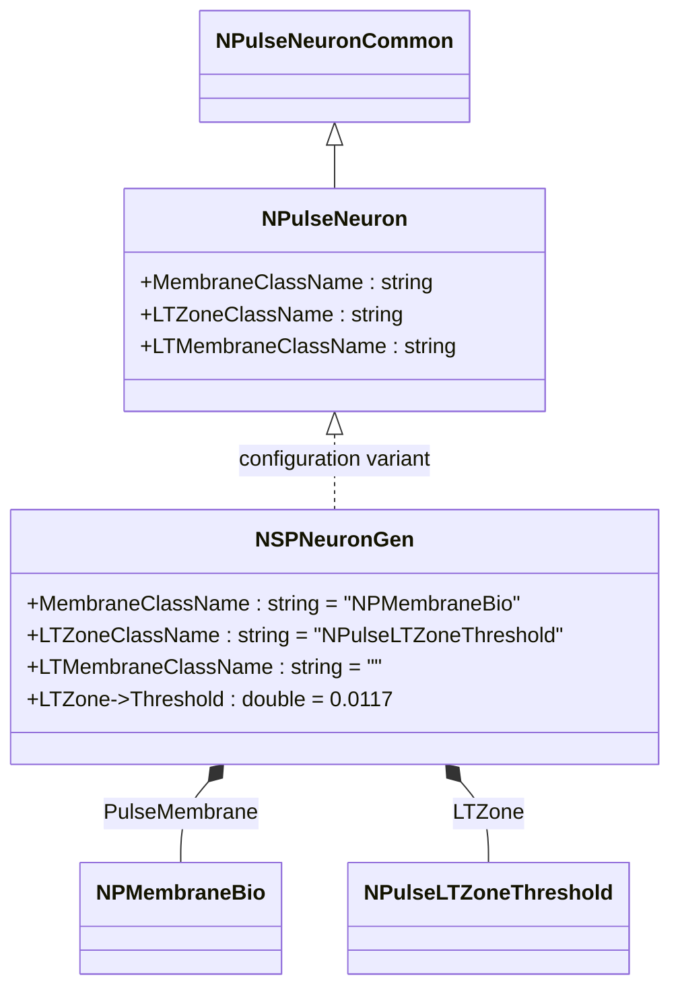
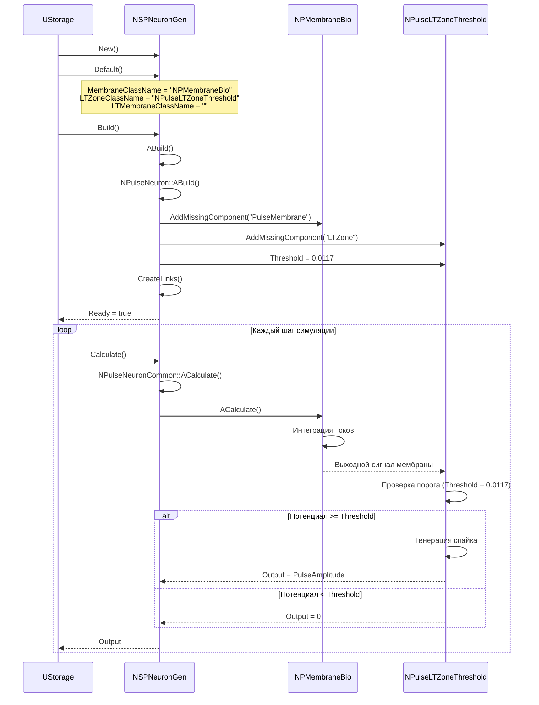
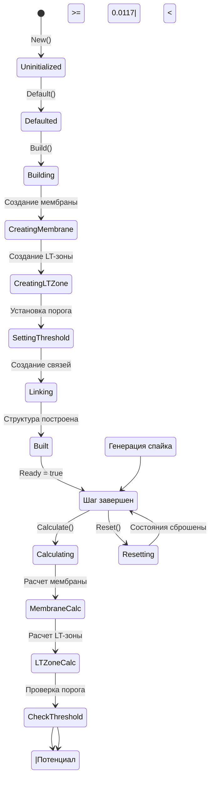
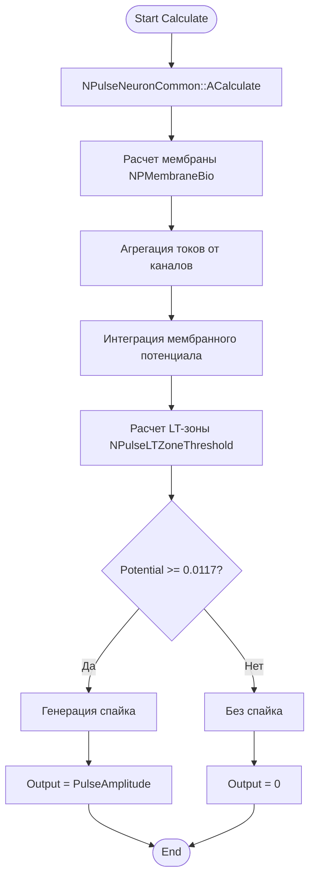
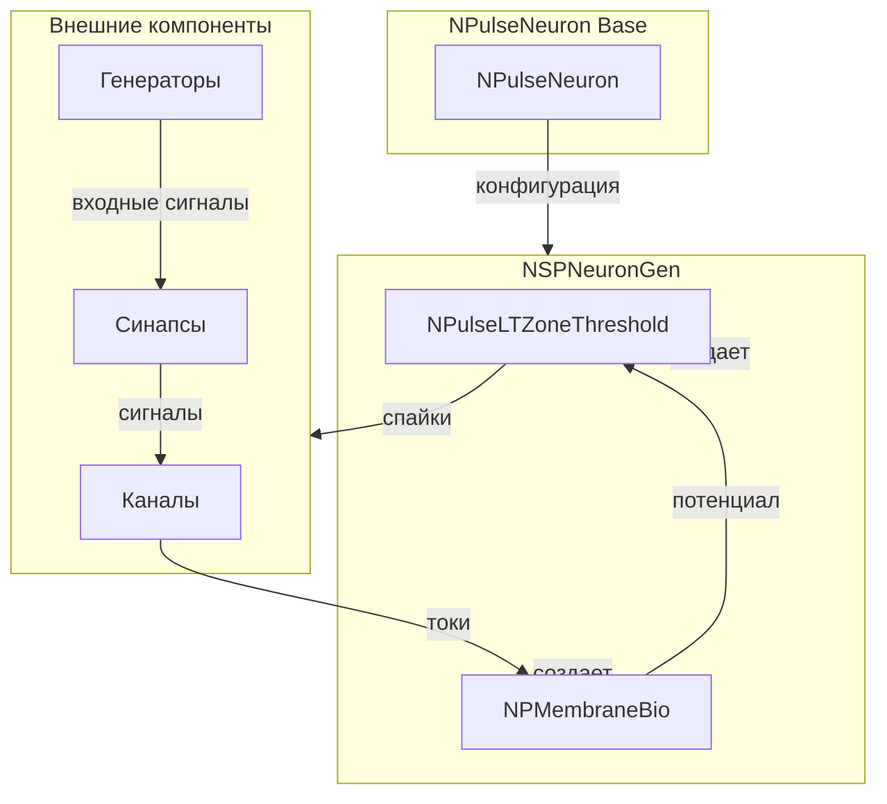
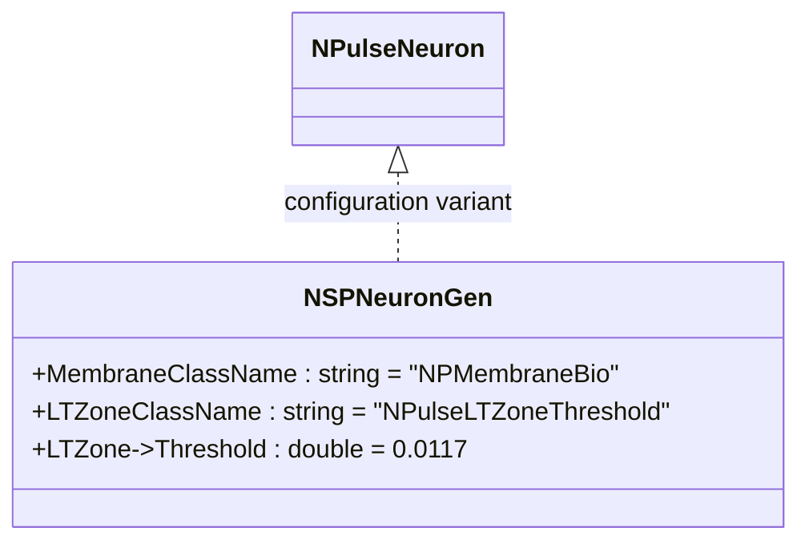
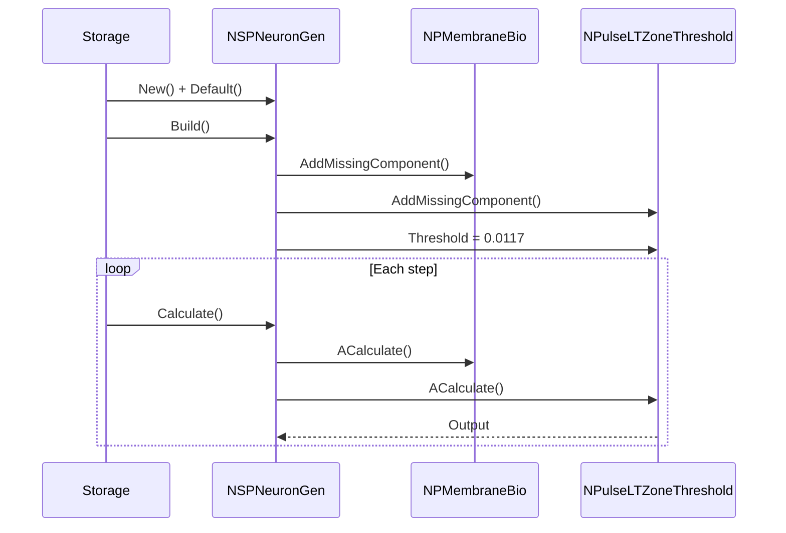
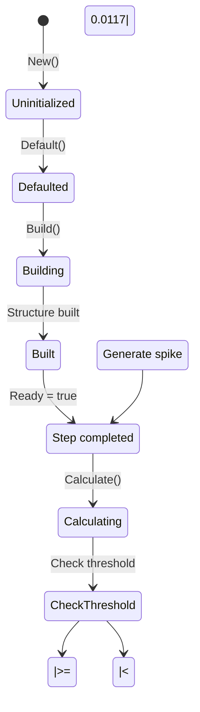
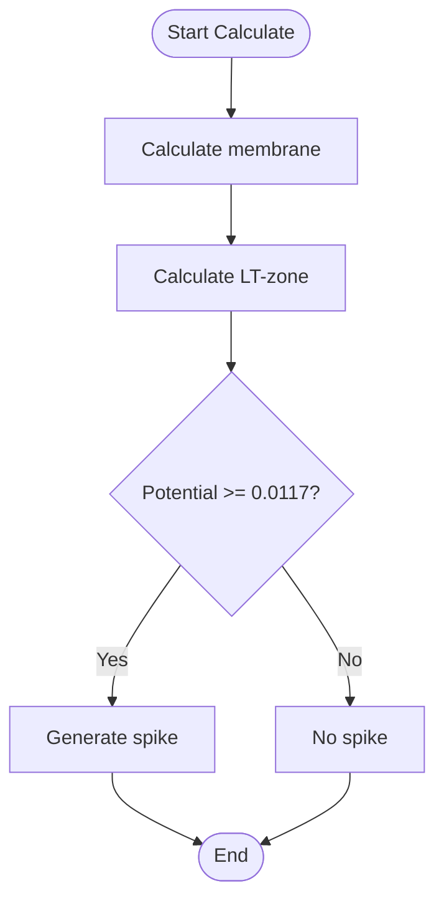
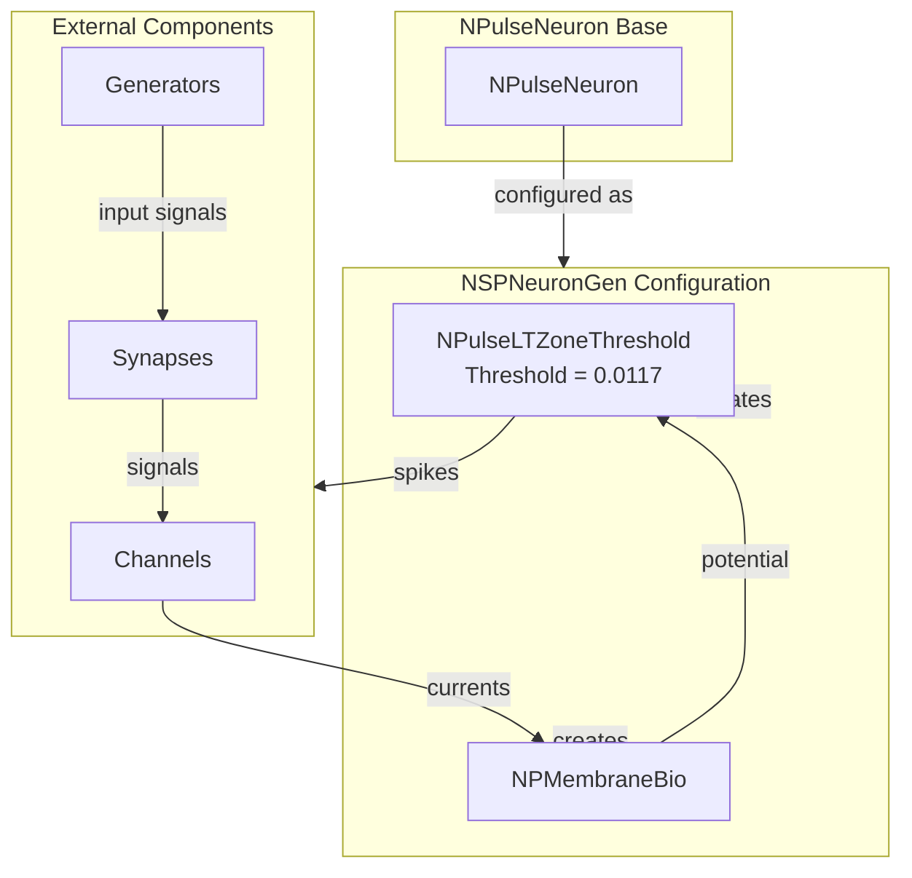

# NSPNeuronGen — мелкий импульсный нейрон с упрощенным генератором спайков

**Каталог компонентов:** [Component-Catalog.md](../Component-Catalog.md).

## RU

### Назначение

**Класс**: `NSPNeuronGen` — конфигурационный вариант мелкого импульсного нейрона с упрощенным генератором спайков.
**Регистрация**: `NPulseLibrary.cpp` → `UploadClass("NSPNeuronGen", ...)`.
**Storage-инстансы**: `ClassName = "NSPNeuronGen"` в `Bin/Configs/*/Model_*.xml`.

`NSPNeuronGen` является конфигурационным вариантом базового класса `NPulseNeuron` с предустановленными параметрами для мелких нейронов с упрощенным генератором спайков. Создается из `NPulseNeuron` с настройками:
- `LTMembraneClassName = ""` — без LT-мембраны
- `MembraneClassName = "NPMembraneBio"` — биоинспирированная мембрана
- `LTZoneClassName = "NPulseLTZoneThreshold"` — LT-зона с порогом
- `LTZone->Threshold = 0.0117` — порог генерации спайка

**Использование:** Эксперименты с упрощенными нейронами, базовые модели спайкования

### UML-диаграмма классов



**Иерархия наследования:**
- `NPulseNeuronCommon` — общий импульсный нейрон
- `NPulseNeuron` — импульсный нейрон с параметрами структурирования
- `NSPNeuronGen` — конфигурационный вариант с упрощенным генератором спайков

**Внутренняя структура:**
- **PulseMembrane** (`NPMembraneBio`) — биоинспирированная мембрана
- **LTZone** (`NPulseLTZoneThreshold`) — LT-зона с порогом (Threshold = 0.0117)

### UML-диаграмма последовательности



**Жизненный цикл:**
1. **Инициализация**: Установка параметров структурирования (MembraneClassName, LTZoneClassName)
2. **Сборка**: Автоматическое создание мембраны и LT-зоны с заданными параметрами
3. **Настройка порога**: Установка порога LT-зоны (Threshold = 0.0117)
4. **Расчет**: Интеграция токов в мембране, проверка порога в LT-зоне, генерация спайков

### UML-диаграмма состояний



**Состояния:**
- **Uninitialized** — создан, но не инициализирован
- **Defaulted** — параметры установлены по умолчанию
- **Building** — выполняется сборка структуры
- **CreatingMembrane** — создание биоинспирированной мембраны
- **CreatingLTZone** — создание LT-зоны с порогом
- **SettingThreshold** — установка порога (0.0117)
- **Linking** — создание связей между компонентами
- **Built** — структура нейрона построена
- **Ready** — готов к выполнению расчетов
- **Calculating** — выполняется расчет нейрона
- **MembraneCalc** — расчет мембраны (интеграция токов)
- **LTZoneCalc** — расчет LT-зоны
- **CheckThreshold** — проверка достижения порога
- **Spiking** — генерация спайка
- **Resetting** — выполняется сброс состояний

### UML-диаграмма активности



**Алгоритм расчета:**
1. Вызов базового расчета (`NPulseNeuronCommon::ACalculate()`)
2. Расчет мембраны (`NPMembraneBio`): агрегация токов от каналов, интеграция потенциала
3. Расчет LT-зоны (`NPulseLTZoneThreshold`): проверка порога (0.0117)
4. Генерация спайка при достижении порога
5. Обновление выходного сигнала нейрона

### UML-диаграмма компонентов



**Зависимости:**
- **Базовый класс**: `NPulseNeuron` (конфигурационный вариант)
- **Внутренние компоненты**: `NPMembraneBio` (мембрана), `NPulseLTZoneThreshold` (LT-зона)
- **Внешние компоненты**: каналы (`NPulseChannel*`), синапсы (`NPulseSynapse*`), генераторы (`NPulseGenerator*`)

### Свойства

`NSPNeuronGen` использует все свойства базового класса `NPulseNeuron` с параметрами:
- `MembraneClassName = "NPMembraneBio"`
- `LTZoneClassName = "NPulseLTZoneThreshold"`
- `LTMembraneClassName = ""`
- `LTZone->Threshold = 0.0117`

### Методы

`NSPNeuronGen` использует все методы базового класса `NPulseNeuron`.

### Примеры использования

#### Пример 1: Создание SP-нейрона с генератором в коде C++

```cpp
// Создание SP-нейрона с упрощенным генератором спайков
auto neuron = storage->CreateComponent<NPulseNeuron>();
neuron->SetName("SPNeuronGen");

// Инициализация
neuron->Default();

// Настройка параметров
neuron->LTMembraneClassName = "";
neuron->MembraneClassName = "NPMembraneBio";
neuron->LTZoneClassName = "NPulseLTZoneThreshold";

// Сборка
neuron->Build();

// Настройка порога LT-зоны
auto ltZone = dynamic_cast<NPulseLTZoneThreshold*>(neuron->GetLTZone());
if (ltZone) {
    ltZone->Threshold = 0.0117;
}
```

### Использование в конфигурациях

`NSPNeuronGen` используется в экспериментах с упрощенными нейронами:

- **Когнитивная навигация**: `Bin/Configs/User/CognitiveNavigation/*/Model_*.xml`
- **Эксперименты с нейронами**: `Bin/Configs/!OldConfigs/NM-Neurons/*/Model.xml`

**Типичные значения параметров:**
- **LTZone->Threshold**: 0.0117 (порог генерации спайка)
- **MembraneClassName**: "NPMembraneBio" (биоинспирированная мембрана)
- **LTZoneClassName**: "NPulseLTZoneThreshold" (LT-зона с порогом)

## Источники

См. [Literature-References.md](../Literature-References.md): **[A]**, **4**, **25**, **29**.

### См. также

- [`NPulseNeuron`](NPulseNeuron.md) — импульсный нейрон с параметрами структурирования
- [`NSPNeuron`](NSPNeuron.md) — базовый SP-нейрон
- [`NPMembraneBio`](NPMembraneBio.md) — биоинспирированная мембрана
- [`NPulseLTZoneThreshold`](NPulseLTZoneThreshold.md) — LT-зона с порогом
- [Architecture.md](../Architecture.md) — архитектура библиотеки

---

## EN

### Purpose

**Class**: `NSPNeuronGen` — configuration variant of small spiking neuron with simplified spike generator.
**Registration**: `NPulseLibrary.cpp` → `UploadClass("NSPNeuronGen", ...)`.
**Instances**: `ClassName = "NSPNeuronGen"` in `Bin/Configs/*/Model_*.xml`.

`NSPNeuronGen` is a configuration variant of the base class `NPulseNeuron` with preset parameters for small neurons with simplified spike generator. Created from `NPulseNeuron` with settings:
- `LTMembraneClassName = ""` — without LT-membrane
- `MembraneClassName = "NPMembraneBio"` — bio-inspired membrane
- `LTZoneClassName = "NPulseLTZoneThreshold"` — LT-zone with threshold
- `LTZone->Threshold = 0.0117` — spike generation threshold

**Usage:** Experiments with simplified neurons, basic spiking models

### UML Class Diagram



### UML Sequence Diagram



### UML State Diagram



### UML Activity Diagram



### UML Component Diagram



### Properties

`NSPNeuronGen` uses all properties of base class `NPulseNeuron` with parameters:
- `MembraneClassName = "NPMembraneBio"` — bio-inspired membrane
- `LTZoneClassName = "NPulseLTZoneThreshold"` — LT-zone with threshold
- `LTMembraneClassName = ""` — without LT-membrane
- `LTZone->Threshold = 0.0117` — spike generation threshold

### Methods

`NSPNeuronGen` uses all methods of base class `NPulseNeuron`.

### Usage in configurations

`NSPNeuronGen` is used in experiments with simplified neurons:

- **Cognitive navigation**: `Bin/Configs/User/CognitiveNavigation/*/Model_*.xml`
- **Neuron experiments**: `Bin/Configs/!OldConfigs/NM-Neurons/*/Model.xml`

**Typical parameter values:**
- **LTZone->Threshold**: 0.0117 (spike generation threshold)
- **MembraneClassName**: "NPMembraneBio" (bio-inspired membrane)
- **LTZoneClassName**: "NPulseLTZoneThreshold" (LT-zone with threshold)

**Features:**
- Simplified spike generator: uses threshold-based LT-zone
- Bio-inspired membrane: uses NPMembraneBio for realistic dynamics
- Easy configuration: preset parameters for quick setup

### References

See [Literature-References.md](../Literature-References.md): **[A]**, **4**, **25**, **29**.

### See Also

- [`NPulseNeuron`](NPulseNeuron.md) — spiking neuron with structuring parameters
- [`NSPNeuron`](NSPNeuron.md) — base SP-neuron
- [`NPMembraneBio`](NPMembraneBio.md) — bio-inspired membrane
- [`NPulseLTZoneThreshold`](NPulseLTZoneThreshold.md) — LT-zone with threshold
- [Architecture.md](../Architecture.md) — library architecture
