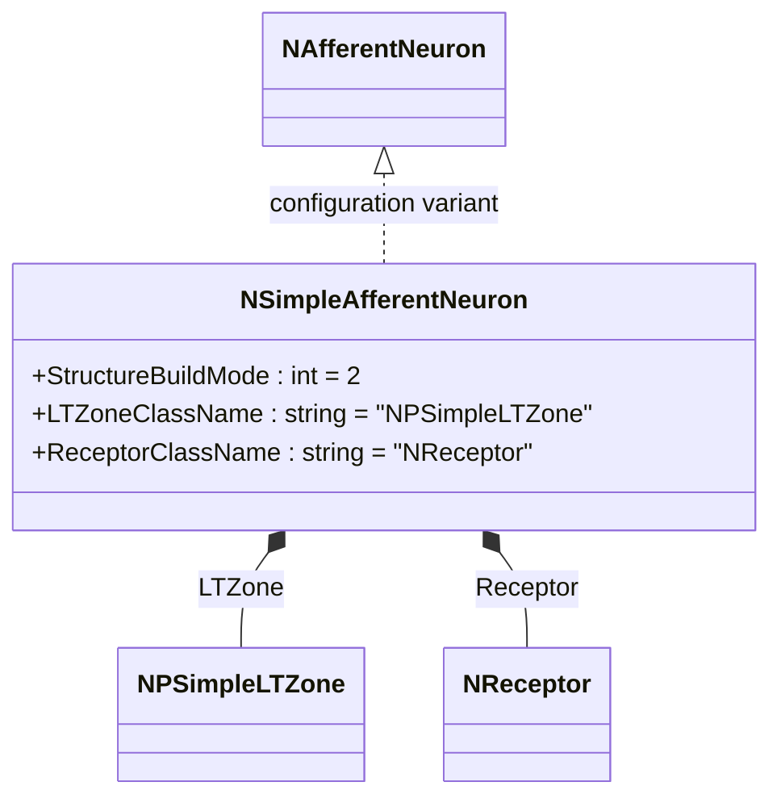
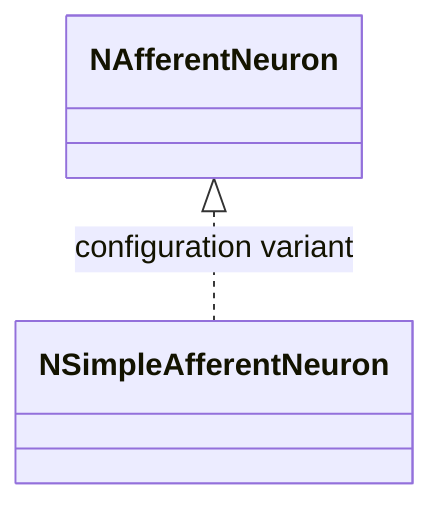
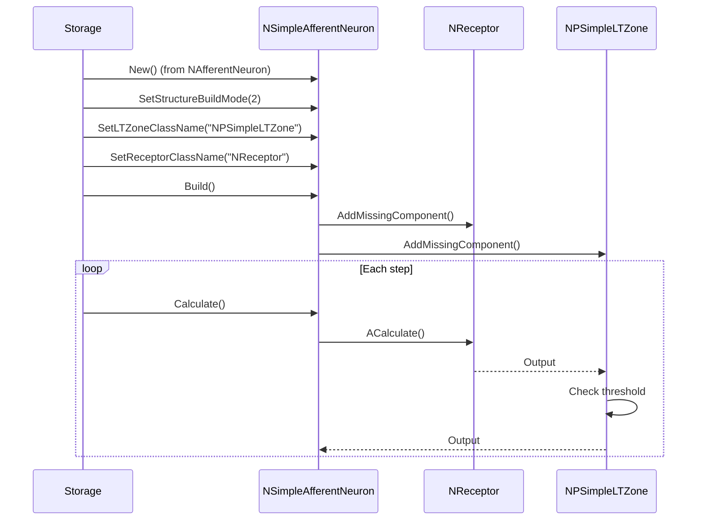
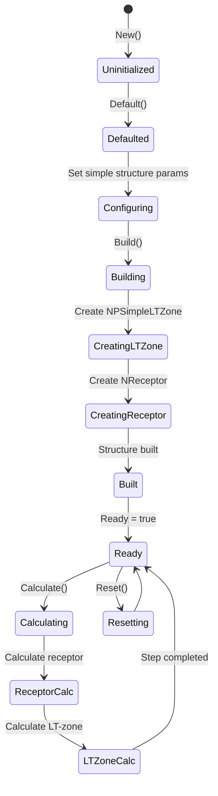
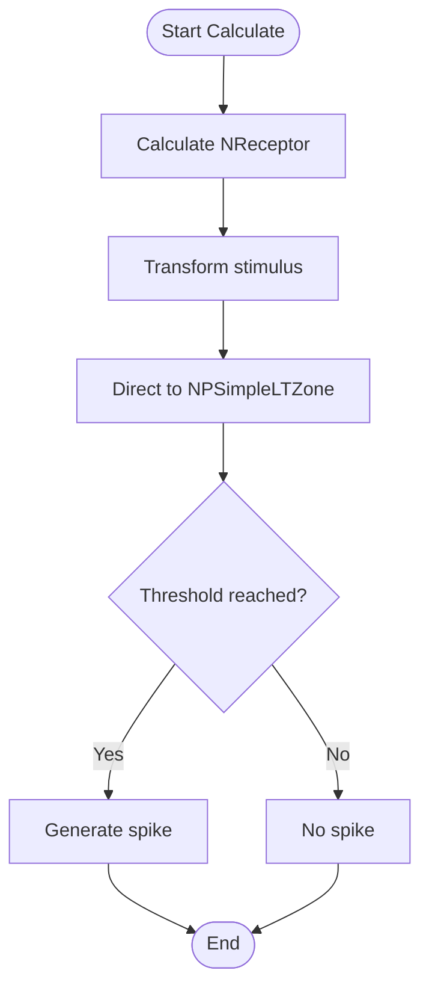
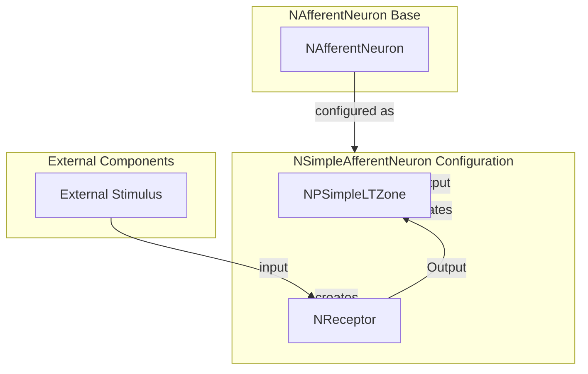

# NSimpleAfferentNeuron — простой афферентный нейрон

## RU

### Назначение

**Класс**: `NSimpleAfferentNeuron` — конфигурационный вариант простого афферентного нейрона с упрощенной структурой.  
**Регистрация**: `NPulseLibrary.cpp` → `UploadClass("NSimpleAfferentNeuron", ...)`.  
**Storage-инстансы**: `ClassName = "NSimpleAfferentNeuron"` в `Bin/Configs/*/Model_*.xml`.

`NSimpleAfferentNeuron` является конфигурационным вариантом базового класса `NAfferentNeuron` с простой структурой. Создается из `NAfferentNeuron` с настройками:
- `StructureBuildMode = 2` — простая структура
- `LTZoneClassName = "NPSimpleLTZone"` — простая LT-зона
- `ReceptorClassName = "NReceptor"` — рецептор
- Параметры рецептора: `ExpCoeff = 10e-5`, `Gain = 1`, `SumCoeff = 2`, `MaxOutputRange = 100`, `OutputAdaptationMode = 0`

Простая структура включает только LT-зону и рецептор, без мембраны.

**Использование:** Моделирование простых сенсорных систем

### UML-диаграмма классов

### Свойства

`NSimpleAfferentNeuron` использует все свойства базового класса `NAfferentNeuron` с параметрами:
- `StructureBuildMode = 2`
- `LTZoneClassName = "NPSimpleLTZone"`
- `ReceptorClassName = "NReceptor"`

### Методы

`NSimpleAfferentNeuron` использует все методы базового класса `NAfferentNeuron`.

### См. также

- [`NAfferentNeuron`](NAfferentNeuron.md) — базовый афферентный нейрон
- [`NSAfferentNeuron`](NSAfferentNeuron.md) — классический афферентный нейрон
- [`NPSimpleLTZone`](NPSimpleLTZone.md) — простая LT-зона
- [Architecture.md](../Architecture.md) — архитектура библиотеки

---

## EN

### Purpose

**Class**: `NSimpleAfferentNeuron` — configuration variant of simple afferent neuron with simplified structure.  
**Registration**: `NPulseLibrary.cpp` → `UploadClass("NSimpleAfferentNeuron", ...)`.  
**Instances**: `ClassName = "NSimpleAfferentNeuron"` in `Bin/Configs/*/Model_*.xml`.

`NSimpleAfferentNeuron` is a configuration variant of the base class `NAfferentNeuron` with simple structure. Created from `NAfferentNeuron` with settings:
- `StructureBuildMode = 2` — simple structure
- `LTZoneClassName = "NPSimpleLTZone"` — simple LT-zone
- `ReceptorClassName = "NReceptor"` — receptor

Simple structure includes only LT-zone and receptor, without membrane.

**Usage:** Modeling simple sensory systems

### UML Class Diagram

### UML Sequence Diagram

### UML State Diagram

### UML Activity Diagram

### UML Component Diagram

### Properties

`NSimpleAfferentNeuron` uses all properties of base class `NAfferentNeuron` with parameters:
- `StructureBuildMode = 2` — simple structure mode
- `LTZoneClassName = "NPSimpleLTZone"` — simple LT-zone
- `ReceptorClassName = "NReceptor"` — receptor

**Receptor parameters (configured in receptor):**
- `ExpCoeff = 10e-5` — exponential coefficient
- `Gain = 1` — gain coefficient
- `SumCoeff = 2` — sum coefficient
- `MaxOutputRange = 100` — maximum output range
- `OutputAdaptationMode = 0` — output adaptation mode (linear)

### Methods

`NSimpleAfferentNeuron` uses all methods of base class `NAfferentNeuron`:
- `ADefault()` — установка параметров по умолчанию (устанавливает StructureBuildMode = 2)
- `ABuild()` — сборка структуры нейрона (вызывает BuildSimpleStructure)
- `AReset()` — сброс состояний нейрона
- `ACalculate()` — выполнение шага расчета нейрона

### Usage in configurations

`NSimpleAfferentNeuron` is used in simple sensory system modeling:

- **Simple sensory systems**: `Bin/Configs/!OldConfigs/*/Model_*.xml` (where simple afferent neurons are required)

**Typical parameter values:**
- **StructureBuildMode**: 2 (simple structure)
- **LTZoneClassName**: "NPSimpleLTZone" (simple LT-zone)
- **ReceptorClassName**: "NReceptor" (receptor)
- **Receptor parameters**: ExpCoeff=10e-5, Gain=1, SumCoeff=2, MaxOutputRange=100, OutputAdaptationMode=0

**Features:**
- Simple structure: only LT-zone and receptor, without membrane
- Optimized for simple sensory processing
- Lower computational complexity compared to classical structure

### See Also

- [`NAfferentNeuron`](NAfferentNeuron.md) — base afferent neuron
- [`NSAfferentNeuron`](NSAfferentNeuron.md) — classical afferent neuron
- [`NPSimpleLTZone`](NPSimpleLTZone.md) — simple LT-zone
- [Architecture.md](../Architecture.md) — library architecture
