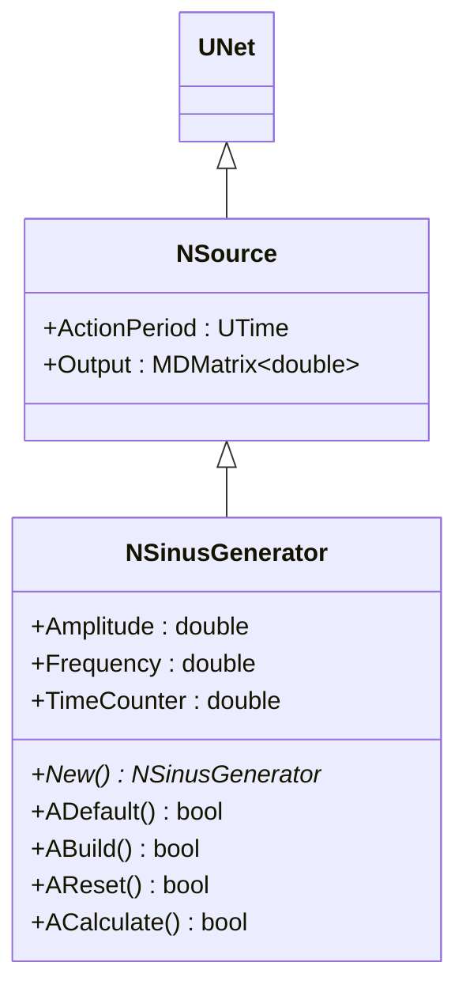
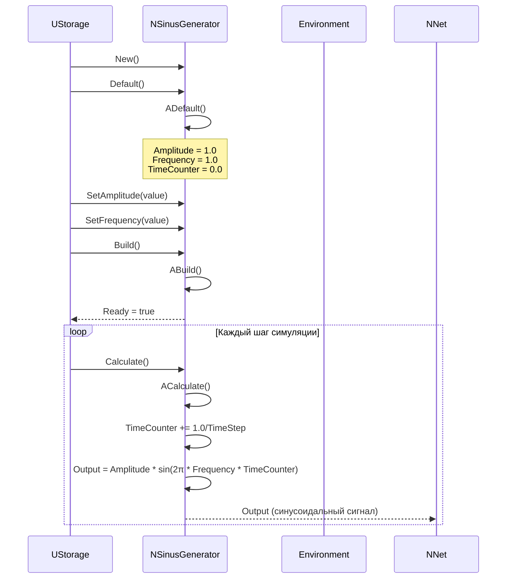
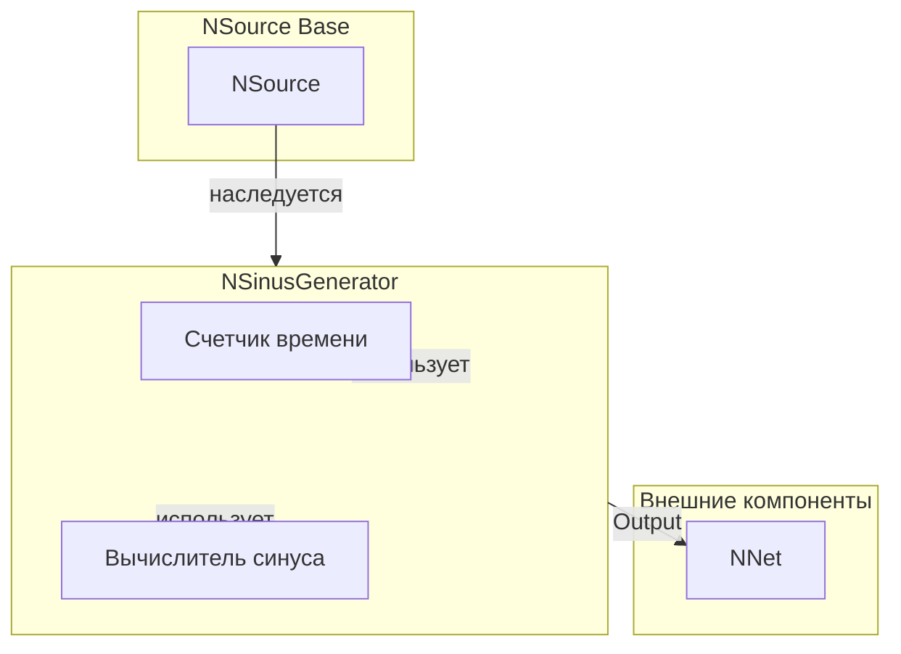
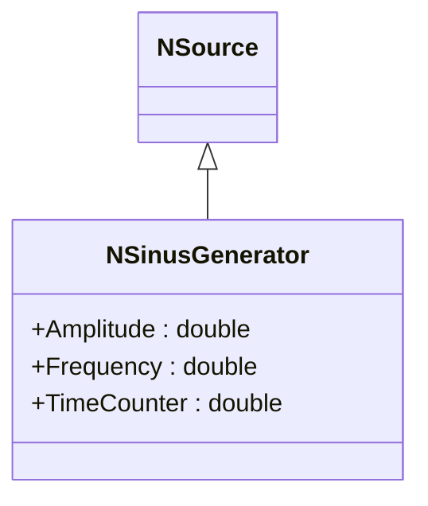
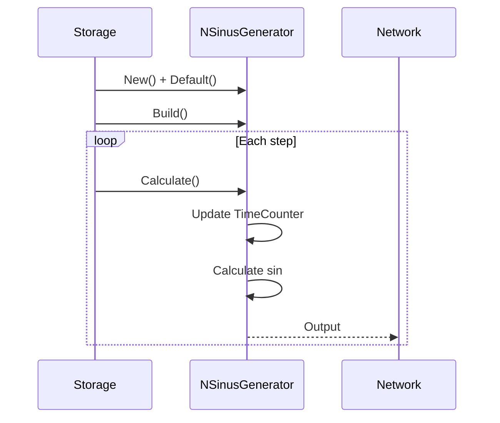
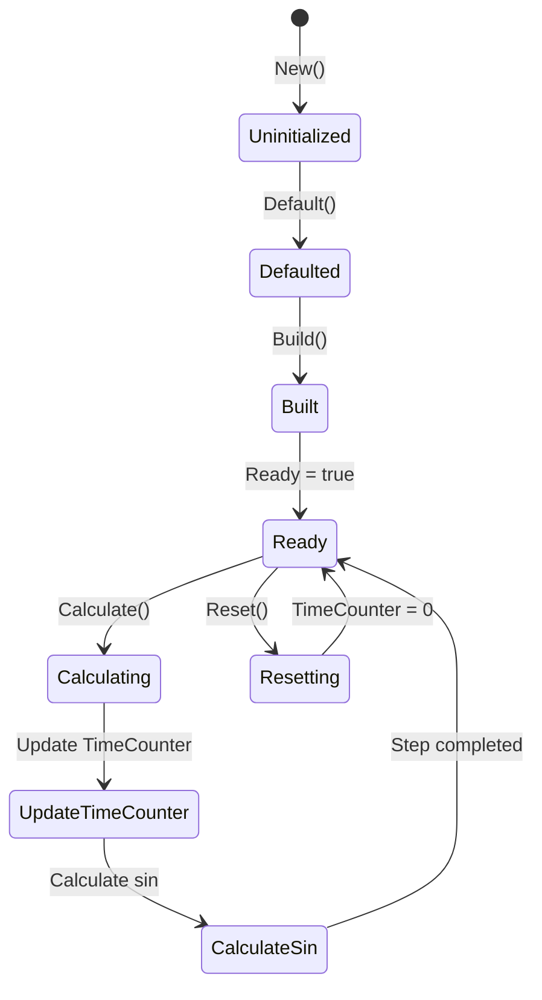
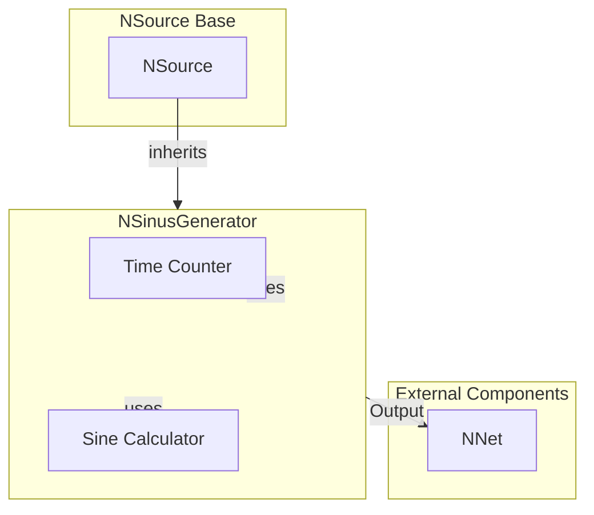

# NSinusGenerator — синусоидальный генератор

## RU

### Назначение

**Класс**: `NSinusGenerator` — генератор синусоидальных сигналов.  
**Регистрация**: `NPulseLibrary.cpp` → `UploadClass("NSinusGenerator", ...)`.  
**Storage-инстансы**: `ClassName = "NSinusGenerator"` в `Bin/Configs/*/Model_*.xml`.

`NSinusGenerator` реализует генератор синусоидальных сигналов с заданной амплитудой и частотой. Наследуется от `NSource` и генерирует непрерывный синусоидальный сигнал: `Output = Amplitude * sin(2 * π * Frequency * TimeCounter)`.

**Использование:** Генерация синусоидальных сигналов, тестирование нейронных сетей

### UML-диаграмма классов



**Иерархия наследования:**
- `UNet` — базовая сеть Rdk Framework
- `NSource` — базовый источник сигналов
- `NSinusGenerator` — синусоидальный генератор

### UML-диаграмма последовательности



**Жизненный цикл:**
1. **Инициализация**: Установка параметров по умолчанию (`Amplitude=1.0`, `Frequency=1.0`, `TimeCounter=0.0`)
2. **Сброс**: Инициализация `TimeCounter=0`
3. **Расчет**: Обновление счетчика времени и вычисление синусоидального сигнала
4. **Выход**: Генерация непрерывного синусоидального сигнала

### UML-диаграмма состояний

```mermaid
stateDiagram-v2
    [*] --> Uninitialized: New()
    Uninitialized --> Defaulted: Default()
    Note over Defaulted: Amplitude = 1.0<br/>Frequency = 1.0<br/>TimeCounter = 0.0
    Defaulted --> Built: Build()
    Built --> Ready: Ready = true
    Ready --> Calculating: Calculate()
    Calculating --> UpdateTimeCounter: TimeCounter += 1.0/TimeStep
    UpdateTimeCounter --> CalculateSin: Output = Amplitude * sin(2π * Frequency * TimeCounter)
    CalculateSin --> Ready: Шаг завершен
    Ready --> Resetting: Reset()
    Resetting --> Ready: TimeCounter = 0
```

**Состояния:**
- **Uninitialized** — создан, но не инициализирован
- **Defaulted** — параметры установлены по умолчанию
- **Built** — структура генератора построена
- **Ready** — готов к выполнению расчетов
- **Calculating** — выполняется расчет генератора
- **UpdateTimeCounter** — обновление счетчика времени
- **CalculateSin** — вычисление синусоидального сигнала
- **Resetting** — выполняется сброс состояний

### UML-диаграмма активности

```mermaid
flowchart TD
    Start([Start Calculate]) --> UpdateTimeCounter[TimeCounter += 1.0/TimeStep]
    UpdateTimeCounter --> CalculatePhase[phase = 2π * Frequency * TimeCounter]
    CalculatePhase --> CalculateSin[Output = Amplitude * sin(phase)]
    CalculateSin --> End([End])
```

**Алгоритм расчета:**
1. Обновление счетчика времени: `TimeCounter += 1.0/TimeStep`
2. Вычисление фазы: `phase = 2π * Frequency * TimeCounter`
3. Вычисление выходного сигнала: `Output = Amplitude * sin(phase)`

### UML-диаграмма компонентов



**Зависимости:**
- **Базовый класс**: `NSource`
- **Внутренние компоненты**: счетчик времени (`TimeCounter`), вычислитель синуса
- **Внешние компоненты**: сеть (получатель выходных сигналов)

### Свойства

#### Параметры (ptPubParameter)

- **`Amplitude`** (double) — амплитуда синусоидального сигнала. Значение по умолчанию: зависит от реализации

- **`Frequency`** (double) — частота синусоидального сигнала (Гц). Значение по умолчанию: зависит от реализации

- **`TimeCounter`** (double) — счетчик времени для расчета фазы синусоиды. Обновляется на каждом шаге: `TimeCounter += TimeStep`. Значение по умолчанию: 0.0

### Методы

- **`ACalculate()`** → `bool` — выполняет расчет синусоидального сигнала:
  1. Обновляет `TimeCounter += TimeStep`
  2. Вычисляет выходной сигнал: `Output = Amplitude * sin(2 * π * Frequency * TimeCounter)`

### Примеры использования

#### Пример 1: Создание генератора в коде C++

```cpp
// Создание синусоидального генератора
auto generator = storage->CreateComponent<NSinusGenerator>();
generator->SetName("SinusGen");

// Инициализация
generator->Default();

// Настройка параметров
generator->Amplitude = 1.0;
generator->Frequency = 1.0;  // 1 Гц

// Сборка
generator->Build();
```

### Использование в конфигурациях

`NSinusGenerator` используется в экспериментах с синусоидальными сигналами:

- **Тестирование нейронных сетей**: `Bin/Configs/!OldConfigs/*/Model_*.xml` (где требуется синусоидальный входной сигнал)

**Типичные значения параметров:**
- **Amplitude**: 0.5-2.0 (амплитуда сигнала)
- **Frequency**: 0.1-10.0 Гц (частота синусоиды)
- **TimeCounter**: 0.0 (начальное значение счетчика времени)

### См. также

- [`NSource`](NSource.md) — базовый источник сигналов
- [`NPulseGenerator`](NPulseGenerator.md) — генератор импульсов
- [`NFileGenerator`](NFileGenerator.md) — генератор из файла
- [Architecture.md](../Architecture.md) — архитектура библиотеки

---

## EN

### Purpose

**Class**: `NSinusGenerator` — sinusoidal signal generator.  
**Registration**: `NPulseLibrary.cpp` → `UploadClass("NSinusGenerator", ...)`.  
**Instances**: `ClassName = "NSinusGenerator"` in `Bin/Configs/*/Model_*.xml`.

`NSinusGenerator` implements sinusoidal signal generator with specified amplitude and frequency. Inherits from `NSource` and generates continuous sinusoidal signal: `Output = Amplitude * sin(2 * π * Frequency * TimeCounter)`.

**Usage:** Generating sinusoidal signals, testing neural networks

### UML Class Diagram



### UML Sequence Diagram



### UML State Diagram



### UML Activity Diagram

```mermaid
flowchart TD
    Start([Start Calculate]) --> UpdateTimeCounter[TimeCounter += step]
    UpdateTimeCounter --> CalculatePhase[Calculate phase]
    CalculatePhase --> CalculateSin[Output = Amplitude * sin(phase)]
    CalculateSin --> End([End])
```

### UML Component Diagram



### Usage in configurations

`NSinusGenerator` is used in sinusoidal signal experiments:

- **Neural network testing**: `Bin/Configs/!OldConfigs/*/Model_*.xml` (where sinusoidal input signal is required)

**Typical parameter values:**
- **Amplitude**: 0.5-2.0 (signal amplitude)
- **Frequency**: 0.1-10.0 Hz (sinusoid frequency)
- **TimeCounter**: 0.0 (initial time counter value)

### See Also

- [`NSource`](NSource.md) — base signal source
- [`NPulseGenerator`](NPulseGenerator.md) — pulse generator
- [`NFileGenerator`](NFileGenerator.md) — file-based generator
- [Architecture.md](../Architecture.md) — library architecture
