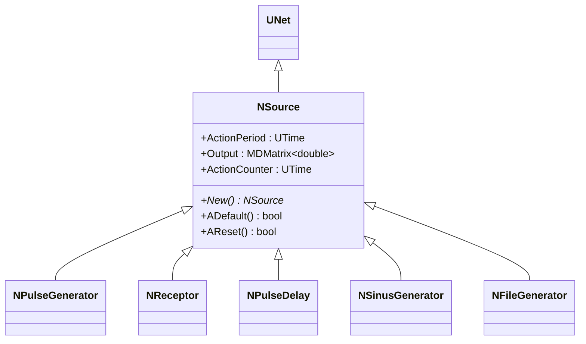
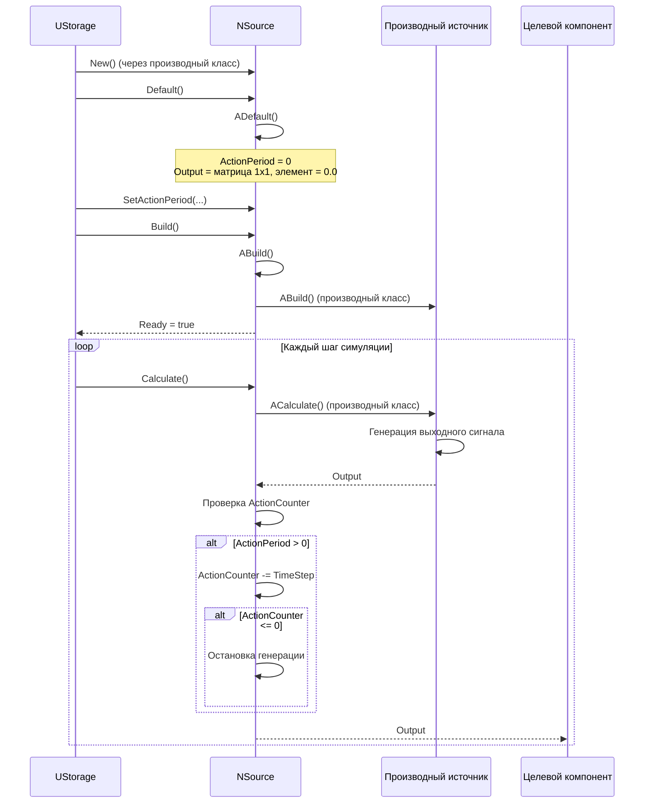
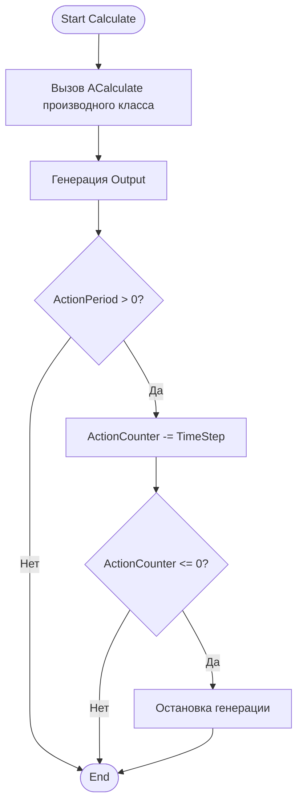
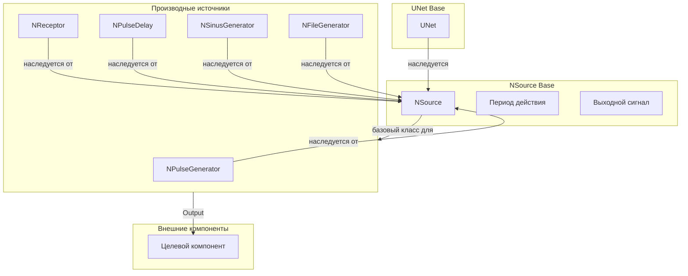
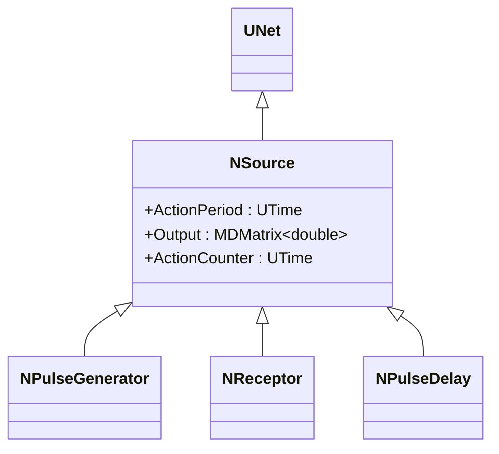
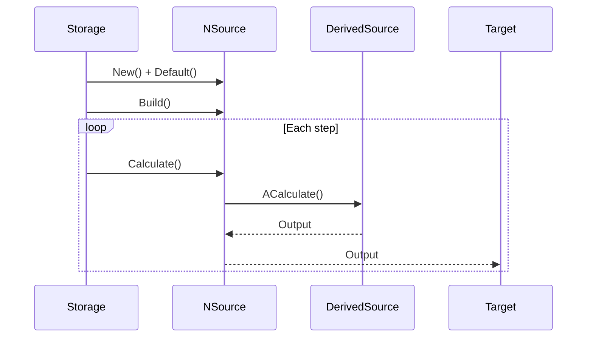
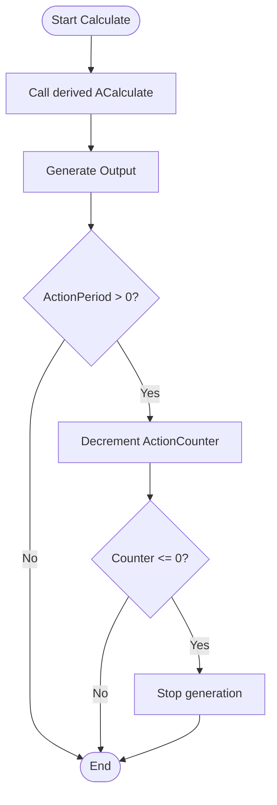
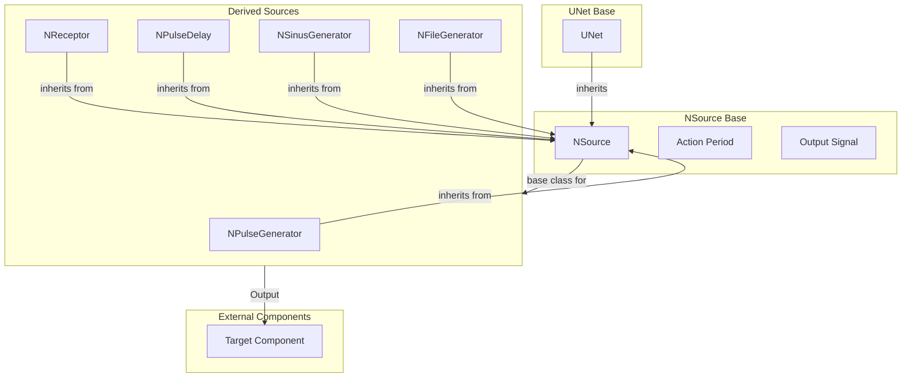

# NSource — источник сигналов

## RU

### Назначение

**Класс**: `NSource` — базовый класс для источников внешних сигналов/стимулов для сети.  
**Регистрация**: `NPulseLibrary.cpp` → `UploadClass("NSource", ...)`.  
**Storage-инстансы**: `ClassName = "NSource"` (обычно используется через наследников).

`NSource` является базовым классом для всех источников сигналов в библиотеке PulseLib. Наследуется от `UNet` и предоставляет базовую функциональность для генерации выходных сигналов с учетом периода действия (`ActionPeriod`).

**Использование:** Базовый класс для источников сигналов, генерация выходных сигналов

### UML-диаграмма классов



**Иерархия наследования:**
- `UNet` — базовая сеть Rdk Framework
- `NSource` — базовый источник сигналов

**Производные классы:**
- `NPulseGenerator` — генератор импульсов
- `NReceptor` — рецептор
- `NPulseDelay` — задержка импульсов
- `NSinusGenerator` — синусоидальный генератор
- `NFileGenerator` — генератор из файла

### UML-диаграмма последовательности



**Жизненный цикл:**
1. **Инициализация**: Установка параметров по умолчанию (`ActionPeriod = 0`)
2. **Сброс**: Инициализация `ActionCounter = ActionPeriod`
3. **Расчет**: Генерация выходного сигнала производным классом, проверка периода действия

### UML-диаграмма состояний

```mermaid
stateDiagram-v2
    [*] --> Uninitialized: New()
    Uninitialized --> Defaulted: Default()
    Defaulted --> Building: Build()
    Building --> Built: Структура создана
    Built --> Ready: Ready = true
    Ready --> Resetting: Reset()
    Resetting --> InitActionCounter: ActionCounter = ActionPeriod
    InitActionCounter --> Ready: Состояния сброшены
    Ready --> Calculating: Calculate()
    Calculating --> GenerateOutput: Генерация Output (производный класс)
    GenerateOutput --> CheckActionPeriod{ActionPeriod > 0?}
    CheckActionPeriod -->|Нет| Ready: Шаг завершен
    CheckActionPeriod -->|Да| DecrementCounter: ActionCounter -= TimeStep
    DecrementCounter --> CheckCounter{ActionCounter <= 0?}
    CheckCounter -->|Нет| Ready: Шаг завершен
    CheckCounter -->|Да| Stopped: Генерация остановлена
    Stopped --> Ready: Шаг завершен
```

**Состояния:**
- **Uninitialized** — создан, но не инициализирован
- **Defaulted** — параметры установлены по умолчанию
- **Building** — выполняется сборка
- **Built** — структура источника построена
- **Ready** — готов к выполнению расчетов
- **Resetting** — выполняется сброс
- **InitActionCounter** — инициализация счетчика действия
- **Calculating** — выполняется расчет источника
- **GenerateOutput** — генерация выходного сигнала
- **CheckActionPeriod** — проверка периода действия
- **DecrementCounter** — уменьшение счетчика действия
- **CheckCounter** — проверка счетчика действия
- **Stopped** — генерация остановлена

### UML-диаграмма активности



**Алгоритм расчета:**
1. Вызов метода расчета производного класса (`ACalculate()`)
2. Генерация выходного сигнала производным классом
3. Проверка периода действия:
   - Если `ActionPeriod > 0`: уменьшение `ActionCounter`
   - Если `ActionCounter <= 0`: остановка генерации

### UML-диаграмма компонентов



**Зависимости:**
- **Базовый класс**: `UNet`
- **Производные классы**: `NPulseGenerator`, `NReceptor`, `NPulseDelay`, `NSinusGenerator`, `NFileGenerator`
- **Внешние компоненты**: целевой компонент (получатель `Output`)

### Свойства

#### Параметры (ptPubParameter)

- **`ActionPeriod`** (UTime) — период действия источника (0 — бесконечный). Определяет, как долго источник будет генерировать сигналы. Значение по умолчанию: 0

#### Выходные свойства (ptOutput | ptPubState)

- **`Output`** (MDMatrix<double>) — выходной сигнал источника. Значение по умолчанию: матрица 1x1, элемент = 0.0

#### Состояния (ptPubState)

- **`ActionCounter`** (UTime) — счетчик действия. Отсчитывает оставшееся время действия источника. Начальное значение: `ActionPeriod`

### Методы

#### Публичные методы

- **`New()`** → `NSource*` — создает новый экземпляр класса.

#### Защищенные методы жизненного цикла

- **`ADefault()`** → `bool` — инициализирует параметры по умолчанию. Устанавливает `ActionPeriod = 0`, инициализирует `Output` как матрицу 1x1.

- **`AReset()`** → `bool` — сбрасывает состояния источника. Устанавливает `ActionCounter = ActionPeriod`.

### Примеры использования

#### Пример 1: Создание источника в коде C++

```cpp
// Создание источника сигналов
auto source = storage->CreateComponent<NSource>();
source->SetName("Source");

// Инициализация
source->Default();

// Настройка параметров
source->ActionPeriod = 10.0;  // Действует 10 секунд

// Сборка
source->Build();
```

### Использование в конфигурациях

`NSource` используется как базовый класс для всех источников сигналов:

- **Источники сигналов**: `Bin/Configs/!OldConfigs/*/Model_*.xml` (все производные классы)

**Типичные значения параметров:**
- **ActionPeriod**: 0 (бесконечное действие), > 0 (ограниченное время действия)

**Особенности:**
- Базовый класс: не используется напрямую, только через производные классы
- Период действия: если `ActionPeriod > 0`, источник прекращает генерацию после истечения времени
- Выходной сигнал: `Output` генерируется производными классами

### См. также

- [`NPulseGenerator`](NPulseGenerator.md) — генератор импульсов
- [`NReceptor`](NReceptor.md) — рецептор
- [`NPulseDelay`](NPulseDelay.md) — задержка импульсов
- [`NSinusGenerator`](NSinusGenerator.md) — синусоидальный генератор
- [`NFileGenerator`](NFileGenerator.md) — генератор из файла
- [Architecture.md](../Architecture.md) — архитектура библиотеки

---

## EN

### Purpose

**Class**: `NSource` — base class for external signal/stimulus sources for network.  
**Registration**: `NPulseLibrary.cpp` → `UploadClass("NSource", ...)`.  
**Instances**: `ClassName = "NSource"` (typically used via derived classes).

`NSource` is the base class for all signal sources in PulseLib library. Inherits from `UNet` and provides basic functionality for generating output signals with action period (`ActionPeriod`) consideration.

**Usage:** Base class for signal sources, output signal generation

### UML Class Diagram



### UML Sequence Diagram



### UML State Diagram

```mermaid
stateDiagram-v2
    [*] --> Uninitialized: New()
    Uninitialized --> Defaulted: Default()
    Defaulted --> Built: Build()
    Built --> Ready: Ready = true
    Ready --> Calculating: Calculate()
    Calculating --> GenerateOutput: Generate output
    GenerateOutput --> CheckActionPeriod{ActionPeriod > 0?}
    CheckActionPeriod -->|No| Ready: Step completed
    CheckActionPeriod -->|Yes| DecrementCounter: Decrement counter
    DecrementCounter --> Ready: Step completed
    Ready --> Resetting: Reset()
    Resetting --> Ready
```

### UML Activity Diagram



### UML Component Diagram



### Properties

- `ActionPeriod` — период действия источника (0 — бесконечное действие, > 0 — ограниченное время действия)
- `Output` — выходной сигнал (генерируется производными классами)
- `ActionCounter` — счетчик времени действия (внутреннее состояние)

### Methods

- `SetActionPeriod(value)` — установка периода действия
- `ADefault()` — установка параметров по умолчанию
- `AReset()` — сброс состояния (инициализация ActionCounter = ActionPeriod)
- `New()` — создание нового экземпляра

### Usage in configurations

`NSource` is used as base class for all signal sources:

- **Signal sources**: `Bin/Configs/!OldConfigs/*/Model_*.xml` (all derived classes)

**Typical parameter values:**
- **ActionPeriod**: 0 (infinite action), > 0 (limited action time)

**Features:**
- Base class: not used directly, only through derived classes
- Action period: if `ActionPeriod > 0`, source stops generation after time expires
- Output signal: `Output` is generated by derived classes

### See Also

- [`NPulseGenerator`](NPulseGenerator.md) — pulse generator
- [`NReceptor`](NReceptor.md) — receptor
- [`NPulseDelay`](NPulseDelay.md) — pulse delay
- [`NSinusGenerator`](NSinusGenerator.md) — sinusoidal generator
- [`NFileGenerator`](NFileGenerator.md) — file generator
- [Architecture.md](../Architecture.md) — library architecture
