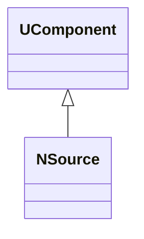
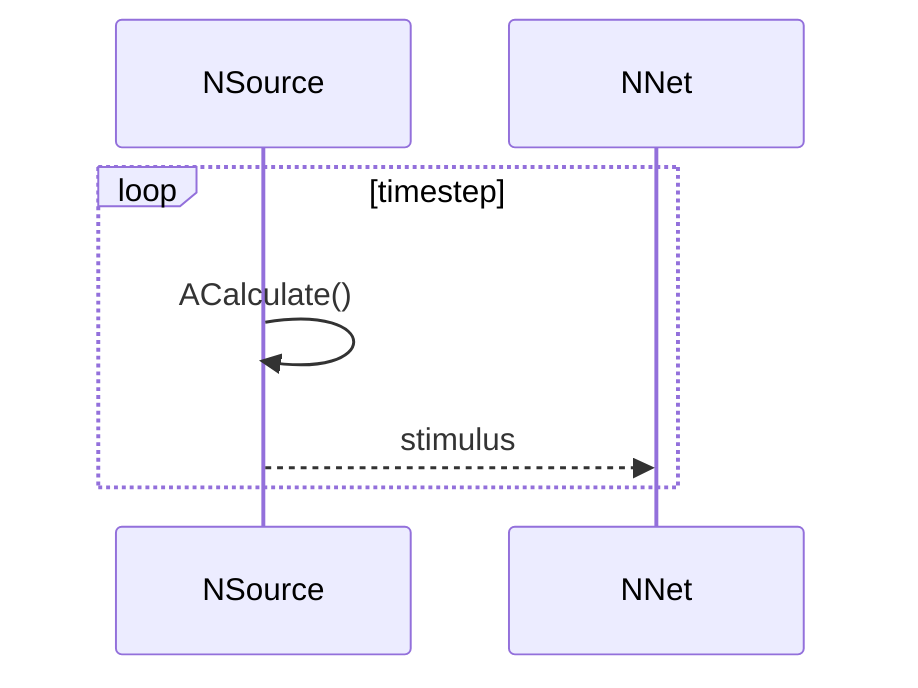
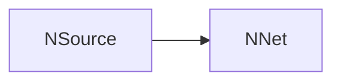
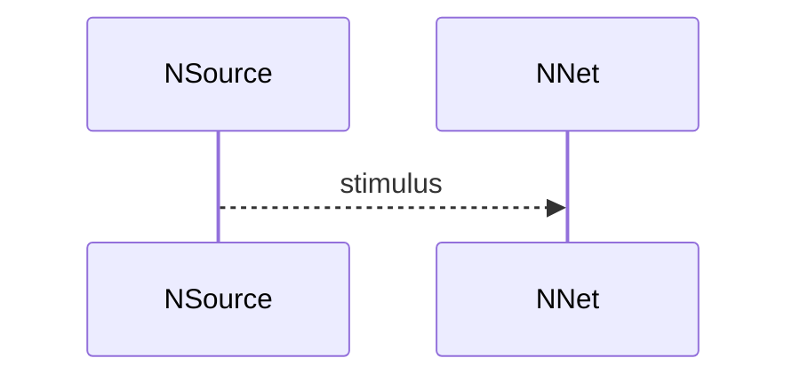

## NSource — источник сигналов для сети

**Класс**: `NSource` — источник внешних сигналов/стимулов для сети.  
**Регистрация**: `NPulseLibrary.cpp` → `UploadClass("NSource", ...)`.  
**Storage-инстансы**: `ClassName = "NSource"`.

### Lifecycle
- **ADefault**: параметры источника.
- **ABuild**: подключение к генераторам/датасетам.
- **AReset**: сброс позиции/состояния.
- **ACalculate**: выдача следующего стимула.

### I/O
- Вход: (опционально) управление режимом/индексом.
- Выход: стимул (ток/спайки/вектор) в сеть.



Пояснение: диаграмма классов показывает место компонента в иерархии и ключевые связи.



Пояснение: диаграмма последовательности показывает типовой сценарий взаимодействия и порядок вызовов.



Пояснение: блок-схема показывает поток данных/сигналов (входы → компонент → выходы).

### Config snippet

```ini
[Component]
ClassName = NSource
Name = Source1
```

---

## NSource — network input source (EN)

Produces external stimuli for the network.


Description: this class diagram shows the component position in the type hierarchy and key relations.



Description: this sequence diagram shows a typical runtime interaction and call order.


Description: this flowchart shows the data/signal flow (inputs → component → outputs).
