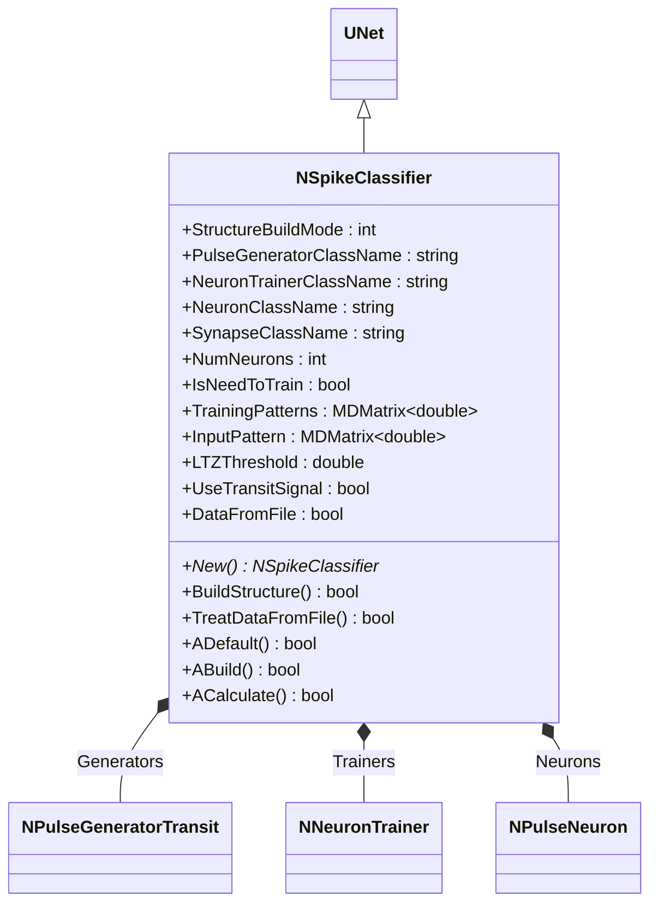
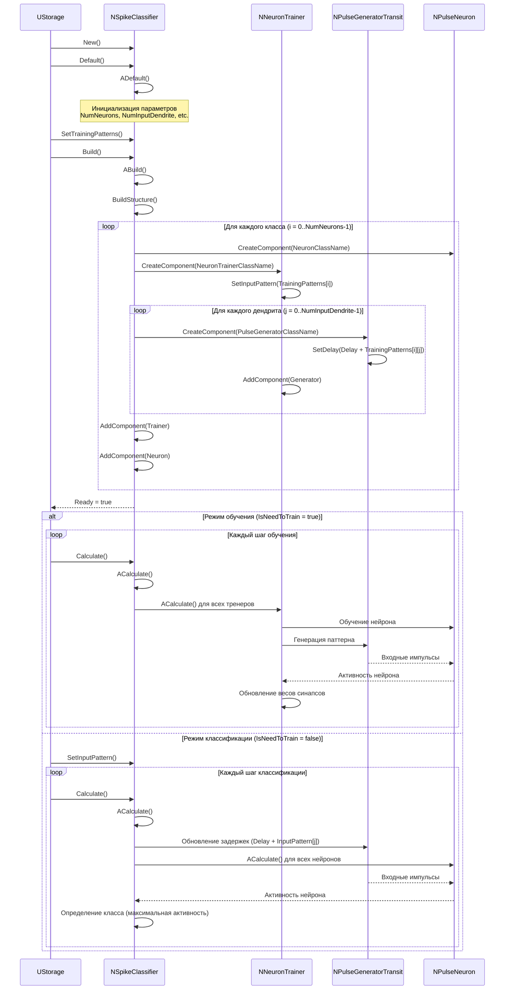
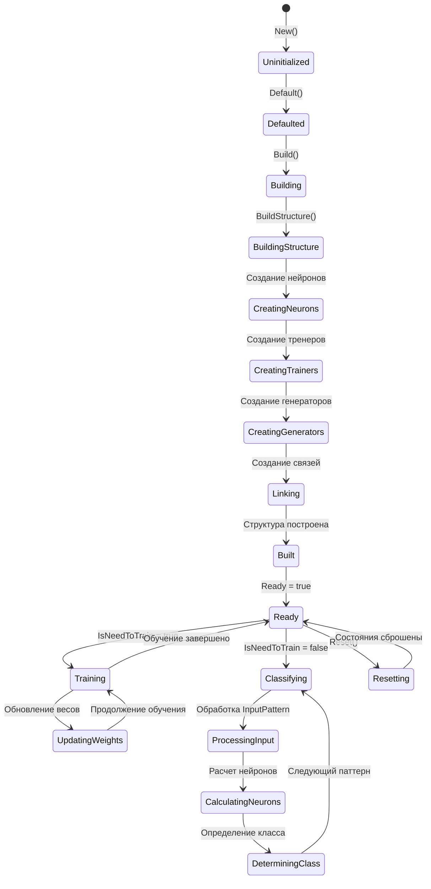
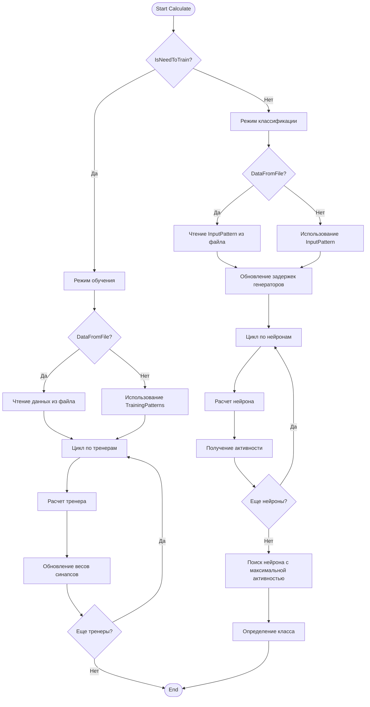
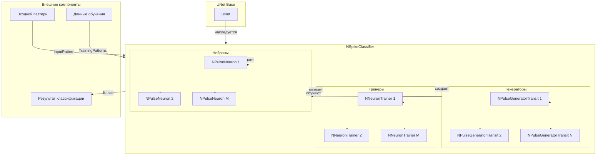
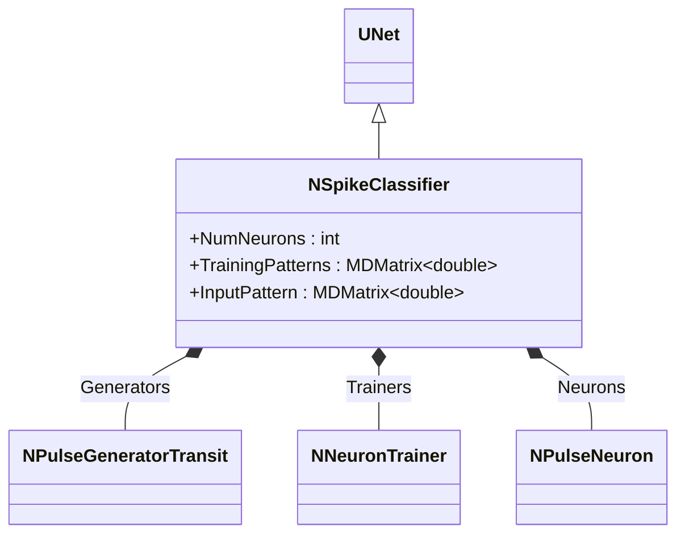
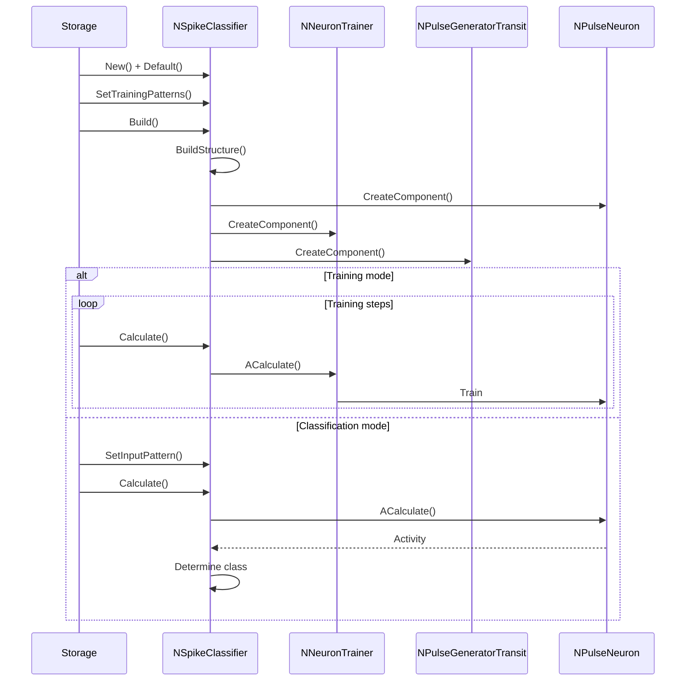
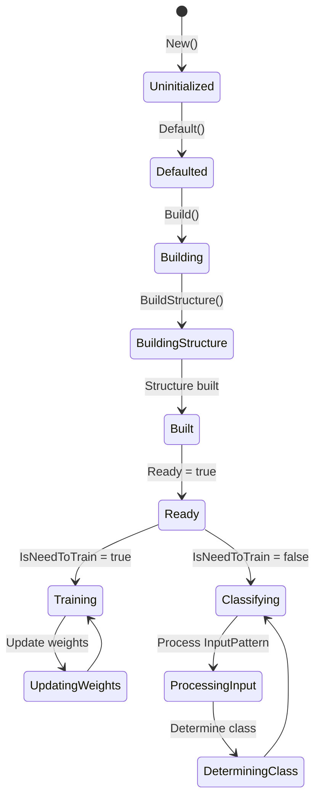
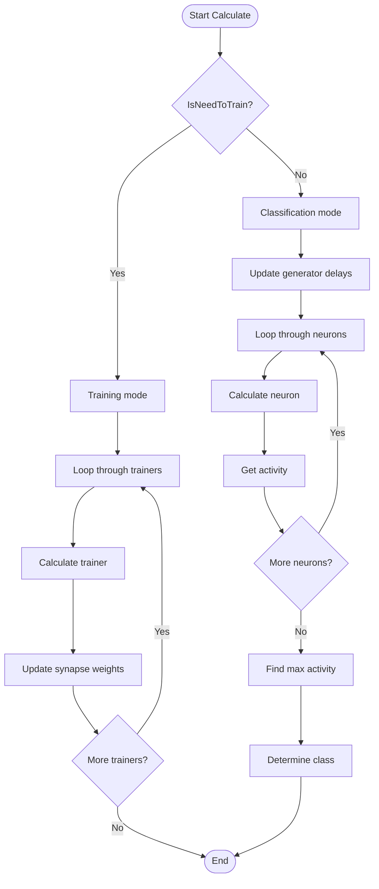
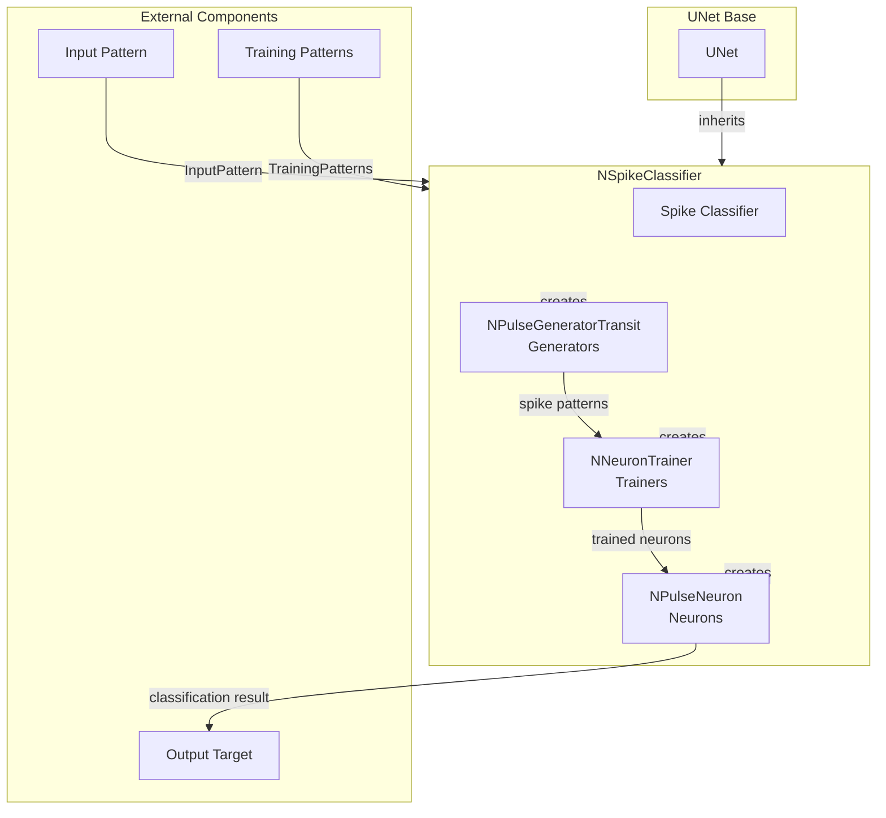

# NSpikeClassifier — классификатор по спайкам

## RU

### Назначение

**Класс**: `NSpikeClassifier` — классификатор, определяющий класс по спайковым паттернам.  
**Регистрация**: `NPulseLibrary.cpp` → `UploadClass("NSpikeClassifier", ...)`.  
**Storage-инстансы**: `ClassName = "NSpikeClassifier"` в `Bin/Configs/*/Model_*.xml`.

`NSpikeClassifier` реализует классификатор, который определяет класс входного паттерна на основе спайковой активности обученных нейронов. Наследуется от `UNet` и создает группу нейронов, каждый из которых обучен распознавать один класс паттернов.

**Использование:** Классификация спайковых паттернов, распознавание паттернов импульсов

### UML-диаграмма классов



**Иерархия наследования:**
- `UNet` — базовая сеть Rdk Framework
- `NSpikeClassifier` — классификатор по спайкам

**Внутренняя структура:**
- **Generators** (vector<NPulseGeneratorTransit*>) — генераторы импульсов для каждого входного дендрита
- **Trainers** (vector<NNeuronTrainer*>) — тренеры для обучения нейронов каждого класса
- **Neurons** (NPulseNeuron*) — нейроны для каждого класса паттернов

### UML-диаграмма последовательности



**Жизненный цикл:**
1. **Инициализация**: Установка параметров классификатора
2. **Сборка структуры**: Создание нейронов, тренеров и генераторов для каждого класса
3. **Обучение** (если `IsNeedToTrain = true`): Обучение нейронов на паттернах из `TrainingPatterns`
4. **Классификация** (если `IsNeedToTrain = false`): Определение класса входного паттерна на основе активности нейронов

### UML-диаграмма состояний



**Состояния:**
- **Uninitialized** — создан, но не инициализирован
- **Defaulted** — параметры установлены по умолчанию
- **Building** — выполняется сборка структуры
- **BuildingStructure** — построение структуры классификатора
- **CreatingNeurons** — создание нейронов для каждого класса
- **CreatingTrainers** — создание тренеров для обучения
- **CreatingGenerators** — создание генераторов импульсов
- **Linking** — создание связей между компонентами
- **Built** — структура классификатора построена
- **Ready** — готов к работе (обучению или классификации)
- **Training** — режим обучения нейронов
- **UpdatingWeights** — обновление весов синапсов
- **Classifying** — режим классификации паттернов
- **ProcessingInput** — обработка входного паттерна
- **CalculatingNeurons** — расчет активности нейронов
- **DeterminingClass** — определение класса по активности
- **Resetting** — выполняется сброс состояний

### UML-диаграмма активности



**Алгоритм работы:**
1. **Режим обучения** (`IsNeedToTrain = true`):
   - Для каждого тренера выполняется расчет и обновление весов синапсов
   - Нейроны обучаются распознавать паттерны из `TrainingPatterns`
   
2. **Режим классификации** (`IsNeedToTrain = false`):
   - Обновляются задержки генераторов на основе `InputPattern`
   - Рассчитывается активность всех нейронов
   - Определяется класс по нейрону с максимальной активностью

### UML-диаграмма компонентов



**Зависимости:**
- **Базовый класс**: `UNet`
- **Внутренние компоненты**: `NPulseGeneratorTransit` (генераторы), `NNeuronTrainer` (тренеры), `NPulseNeuron` (нейроны)
- **Внешние данные**: входные паттерны (`InputPattern`), данные обучения (`TrainingPatterns`)

### Свойства

#### Параметры (ptPubParameter)

- **`StructureBuildMode`** (int) — режим сборки структуры:
  - 0 — простая структура
  - 1 — полная структура с перекрестными связями между нейронами
  Значение по умолчанию: 0

- **`PulseGeneratorClassName`** (string) — имя класса генератора импульсов. Используется для создания генераторов входных сигналов. Значение по умолчанию: `"NPulseGeneratorTransit"`

- **`NeuronTrainerClassName`** (string) — имя класса тренера нейронов. Используется для создания тренеров обучения. Значение по умолчанию: зависит от реализации

- **`NeuronClassName`** (string) — имя класса нейронов. Используется для создания нейронов классификатора. Значение по умолчанию: `"NPulseNeuron"`

- **`SynapseClassName`** (string) — имя класса синапсов. Используется для создания синапсов между генераторами и нейронами. Значение по умолчанию: зависит от реализации

- **`NumNeurons`** (int) — количество нейронов (классов) для классификации. Каждый нейрон обучается распознавать один класс паттернов. Значение по умолчанию: зависит от реализации

- **`IsNeedToTrain`** (bool) — флаг необходимости обучения. Если `true`, классификатор находится в режиме обучения. Значение по умолчанию: `true`

- **`Delay`** (double) — задержка начала обучения/классификации относительно старта системы (секунды). Значение по умолчанию: 0.0

- **`SpikesFrequency`** (double) — частота генераторов импульсов (Гц). Значение по умолчанию: зависит от реализации

- **`NumInputDendrite`** (int) — количество входных дендритов (размерность входного паттерна). Значение по умолчанию: зависит от реализации

- **`MaxDendriteLength`** (int) — максимальная длина дендрита. Используется при построении структуры нейрона. Значение по умолчанию: зависит от реализации

- **`TrainingPatterns`** (MDMatrix<double>) — матрица паттернов для обучения. Размер: `NumNeurons x NumInputDendrite`. Каждая строка содержит паттерн для обучения одного нейрона.

- **`InputPattern`** (MDMatrix<double>) — входной паттерн для классификации. Размер: `NumInputDendrite x 1`. Содержит временные задержки для генераторов импульсов.

- **`LTZThreshold`** (double) — порог низкопороговой зоны (LT-зоны) нейрона. Значение по умолчанию: зависит от реализации

- **`FixedLTZThreshold`** (double) — фиксированный порог LT-зоны. Используется, если `UseFixedLTZThreshold = true`. Значение по умолчанию: зависит от реализации

- **`TrainingLTZThreshold`** (double) — порог LT-зоны для этапа обучения. Может отличаться от порога классификации. Значение по умолчанию: зависит от реализации

- **`UseFixedLTZThreshold`** (bool) — использовать фиксированный порог LT-зоны. Если `true`, используется `FixedLTZThreshold`. Значение по умолчанию: `false`

- **`UseTransitSignal`** (bool) — использовать транзитный сигнал от внешнего источника. Если `true`, генераторы используют внешние сигналы вместо внутренней генерации. Значение по умолчанию: `false`

- **`DataFromFile`** (bool) — флаг чтения данных из файла. Если `true`, паттерны читаются из файла. Значение по умолчанию: `false`

### Методы

#### Публичные методы

- **`New()`** → `NSpikeClassifier*` — создает новый экземпляр класса. Используется системой Rdk для создания компонентов.

#### Защищенные методы жизненного цикла

- **`ADefault()`** → `bool` — инициализирует параметры по умолчанию. Устанавливает начальные значения всех параметров.

- **`ABuild()`** → `bool` — строит структуру классификатора. Вызывает `BuildStructure()` для создания нейронов, тренеров и генераторов.

- **`ACalculate()`** → `bool` — выполняет расчет классификатора на одном шаге:
  - Если `IsNeedToTrain = true`, выполняет обучение нейронов
  - Если `IsNeedToTrain = false`, выполняет классификацию входного паттерна

- **`BuildStructure()`** → `bool` — строит структуру классификатора:
  1. Создает `NumNeurons` нейронов указанного класса
  2. Создает `NumNeurons` тренеров для обучения нейронов
  3. Для каждого тренера создает `NumInputDendrite` генераторов импульсов
  4. Настраивает связи между компонентами
  5. Устанавливает паттерны обучения для каждого тренера

- **`TreatDataFromFile()`** → `bool` — обрабатывает данные из файла (если `DataFromFile = true`). Читает паттерны обучения или входные паттерны из файла.

#### Методы установки параметров

Все параметры имеют соответствующие методы `Set*()` для установки значений, которые автоматически обновляют связанные компоненты (тренеры, генераторы, нейроны).

### Примеры использования

#### Пример 1: Создание классификатора в коде C++

```cpp
// Создание классификатора
auto classifier = storage->CreateComponent<NSpikeClassifier>();
classifier->SetName("SpikeClassifier1");

// Инициализация
classifier->Default();

// Настройка параметров
classifier->NumNeurons = 3;                    // 3 класса
classifier->NumInputDendrite = 5;               // Размерность паттерна: 5
classifier->IsNeedToTrain = true;               // Режим обучения
classifier->SpikesFrequency = 1.5;              // Частота импульсов (Гц)
classifier->Delay = 0.1;                        // Задержка (сек)
classifier->LTZThreshold = 0.0117;              // Порог LT-зоны

// Установка паттернов обучения
MDMatrix<double> trainingPatterns;
trainingPatterns.Resize(3, 5);                  // 3 класса, 5 дендритов
// Паттерн для класса 0
trainingPatterns(0, 0) = 0.0;
trainingPatterns(0, 1) = 0.1;
trainingPatterns(0, 2) = 0.2;
trainingPatterns(0, 3) = 0.3;
trainingPatterns(0, 4) = 0.4;
// Паттерн для класса 1
trainingPatterns(1, 0) = 0.5;
trainingPatterns(1, 1) = 0.6;
trainingPatterns(1, 2) = 0.7;
trainingPatterns(1, 3) = 0.8;
trainingPatterns(1, 4) = 0.9;
// Паттерн для класса 2
trainingPatterns(2, 0) = 1.0;
trainingPatterns(2, 1) = 1.1;
trainingPatterns(2, 2) = 1.2;
trainingPatterns(2, 3) = 1.3;
trainingPatterns(2, 4) = 1.4;

classifier->TrainingPatterns = trainingPatterns;

// Сборка
classifier->Build();

// Обучение
for (int step = 0; step < 10000; step++) {
    classifier->Calculate();
}

// Переключение в режим классификации
classifier->IsNeedToTrain = false;

// Классификация входного паттерна
MDMatrix<double> inputPattern;
inputPattern.Resize(5, 1);
inputPattern(0, 0) = 0.05;  // Входной паттерн
inputPattern(1, 0) = 0.15;
inputPattern(2, 0) = 0.25;
inputPattern(3, 0) = 0.35;
inputPattern(4, 0) = 0.45;

classifier->InputPattern = inputPattern;

// Выполнение классификации
for (int step = 0; step < 1000; step++) {
    classifier->Calculate();
    // Определение класса по активности нейронов
}
```

#### Пример 2: Конфигурация XML

```xml
<SpikeClassifier1 Class="NSpikeClassifier">
    <Parameters>
        <StructureBuildMode>1</StructureBuildMode>
        <PulseGeneratorClassName>NPulseGeneratorTransit</PulseGeneratorClassName>
        <NeuronTrainerClassName>NNeuronTrainer</NeuronTrainerClassName>
        <NeuronClassName>NSPNeuronGen</NeuronClassName>
        <SynapseClassName>NPSynapseBio</SynapseClassName>
        <NumNeurons>3</NumNeurons>
        <IsNeedToTrain>1</IsNeedToTrain>
        <Delay>0.1</Delay>
        <SpikesFrequency>1.5</SpikesFrequency>
        <NumInputDendrite>5</NumInputDendrite>
        <MaxDendriteLength>100</MaxDendriteLength>
        <LTZThreshold>0.0117</LTZThreshold>
        <TrainingLTZThreshold>100</TrainingLTZThreshold>
        <FixedLTZThreshold>0.0117</FixedLTZThreshold>
        <UseFixedLTZThreshold>1</UseFixedLTZThreshold>
        <UseTransitSignal>0</UseTransitSignal>
        <DataFromFile>0</DataFromFile>
        <TrainingPatterns>
            <!-- Матрица 3x5: 3 класса, 5 дендритов -->
            <!-- Класс 0: [0.0, 0.1, 0.2, 0.3, 0.4] -->
            <!-- Класс 1: [0.5, 0.6, 0.7, 0.8, 0.9] -->
            <!-- Класс 2: [1.0, 1.1, 1.2, 1.3, 1.4] -->
        </TrainingPatterns>
        <InputPattern>
            <!-- Вектор 5x1: [0.05, 0.15, 0.25, 0.35, 0.45] -->
        </InputPattern>
    </Parameters>
</SpikeClassifier1>
```

### Использование в конфигурациях

`NSpikeClassifier` используется в экспериментах по классификации спайковых паттернов:

- **Классификация паттернов**: `Bin/Configs/!OldConfigs/SpikeClassifier/`
- **Распознавание паттернов**: `Bin/Configs/!OldConfigs/SpikeANPA3/`

**Типичные значения параметров:**
- **NumNeurons**: 2-10 (количество классов для распознавания)
- **NumInputDendrite**: 5-20 (размерность входного паттерна)
- **SpikesFrequency**: 1.0-5.0 Гц (частота генерации импульсов)
- **LTZThreshold**: 0.01-0.1 (порог генерации спайков)
- **TrainingLTZThreshold**: 50-200 (более высокий порог для обучения)

### См. также

- [`NClassifier`](NClassifier.md) — базовый классификатор
- [`NPCAClassifier`](NPCAClassifier.md) — классификатор PCA
- [`NNeuronTrainer`](NNeuronTrainer.md) — тренер нейронов
- [`NPulseGeneratorTransit`](NPulseGeneratorTransit.md) — транзитный генератор импульсов
- [`NPulseNeuron`](NPulseNeuron.md) — импульсный нейрон
- [Architecture.md](../Architecture.md) — архитектура библиотеки

---

## EN

### Purpose

**Class**: `NSpikeClassifier` — classifier that determines class by spike patterns.  
**Registration**: `NPulseLibrary.cpp` → `UploadClass("NSpikeClassifier", ...)`.  
**Instances**: `ClassName = "NSpikeClassifier"` in `Bin/Configs/*/Model_*.xml`.

`NSpikeClassifier` implements classifier that determines input pattern class based on spike activity of trained neurons. Inherits from `UNet` and creates group of neurons, each trained to recognize one pattern class.

**Usage:** Spike pattern classification, pattern recognition

### UML Class Diagram



### UML Sequence Diagram



### UML State Diagram



### UML Activity Diagram



### UML Component Diagram



### Properties

- `StructureBuildMode` — режим пересборки структуры
- `PulseGeneratorClassName` — имя класса генератора импульсов
- `NeuronTrainerClassName` — имя класса тренера нейронов
- `NeuronClassName` — имя класса нейрона
- `SynapseClassName` — имя класса синапса
- `NumNeurons` — количество нейронов (классов)
- `IsNeedToTrain` — необходимость обучения
- `TrainingPatterns` — паттерны для обучения
- `InputPattern` — входной паттерн для классификации
- `LTZThreshold` — порог LT-зоны
- `UseTransitSignal` — использование транзитного сигнала
- `DataFromFile` — загрузка данных из файла

### Methods

- `ADefault()` — установка параметров по умолчанию
- `ABuild()` — сборка структуры классификатора
- `ACalculate()` — выполнение шага классификации или обучения
- `BuildStructure()` — построение структуры нейронов и тренеров
- `TreatDataFromFile()` — обработка данных из файла

### Usage in configurations

`NSpikeClassifier` is used for spike pattern classification:

- **Spike classification**: `Bin/Configs/*/Model_*.xml` (where spike pattern classification is required)
- **Pattern recognition**: experiments with recognizing spike patterns
- **Neuron training**: training neurons on specific spike patterns

**Features:**
- Automatic structure building: creates neurons and trainers for each class
- Training mode: trains neurons on provided spike patterns
- Classification mode: classifies input patterns using trained neurons
- Spike-based: uses spike timing for pattern recognition
- Flexible configuration: supports various neuron and synapse types

**Typical parameter values:**
- **NeuronClassName**: "NPulseNeuron" (spiking neuron)
- **NeuronTrainerClassName**: "NNeuronTrainer" (neuron trainer)
- **PulseGeneratorClassName**: "NPulseGeneratorTransit" (transit pulse generator)
- **SynapseClassName**: "NPulseSynapse" (pulse synapse)

### See Also

- [`NClassifier`](NClassifier.md) — base classifier
- [`NPCAClassifier`](NPCAClassifier.md) — PCA classifier
- [`NNeuronTrainer`](NNeuronTrainer.md) — neuron trainer
- [`NPulseGeneratorTransit`](NPulseGeneratorTransit.md) — transit pulse generator
- [`NPulseNeuron`](NPulseNeuron.md) — spiking neuron
- [Architecture.md](../Architecture.md) — library architecture
