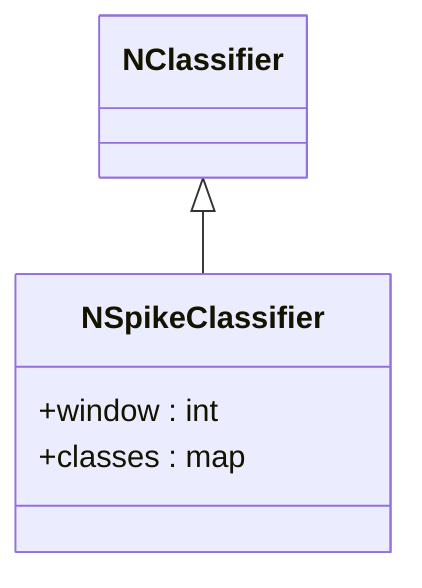
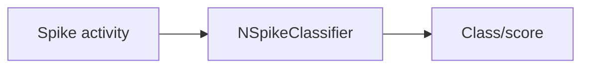
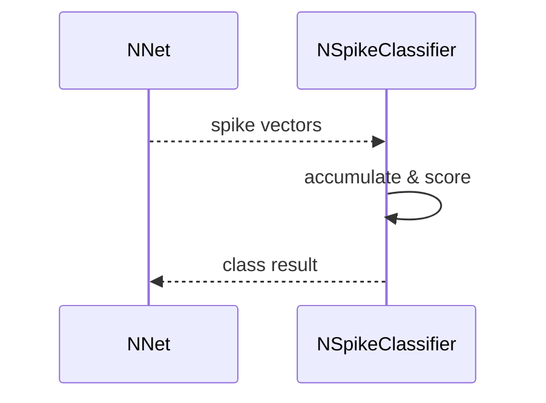

## NSpikeClassifier — классификатор по спайкам

**Класс**: `NSpikeClassifier` — определяет класс по спайковым паттернам.  
**Регистрация**: `NPulseLibrary.cpp` → `UploadClass("NSpikeClassifier", ...)`.  
**Storage-инстансы**: `ClassName = "NSpikeClassifier"`; параметры окон подсчёта, карт классов.

### Входы/выходы
- Вход: активность/спайки слоёв/групп.
- Выход: метка класса/скор.

Пояснение: блок-схема показывает поток данных/сигналов (входы → компонент → выходы).

Пояснение: диаграмма последовательности показывает типовой сценарий взаимодействия и порядок вызовов.

---

## NSpikeClassifier — spike-based classifier

Consumes spike activity and outputs class labels/scores using configured windows and mapping.
