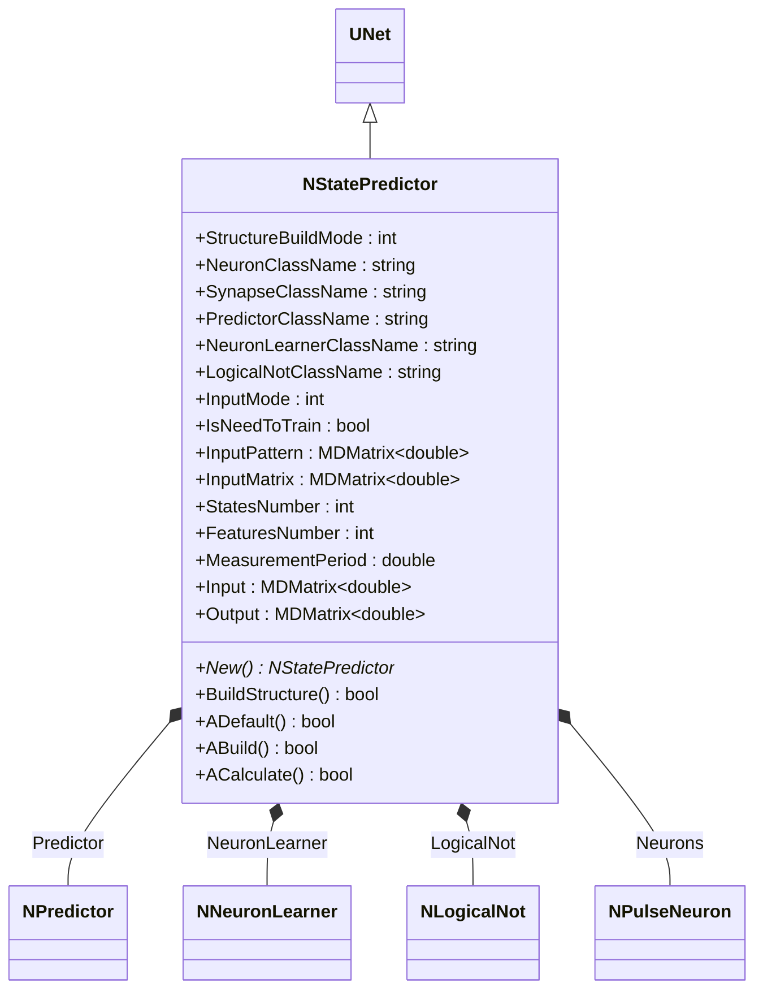
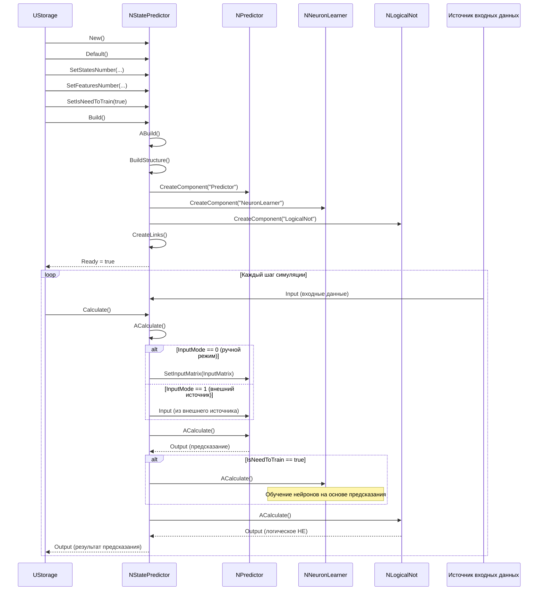
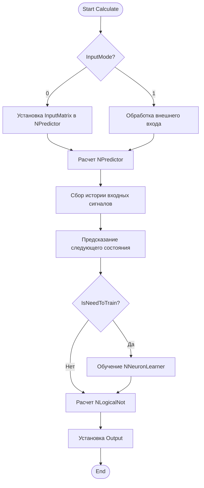
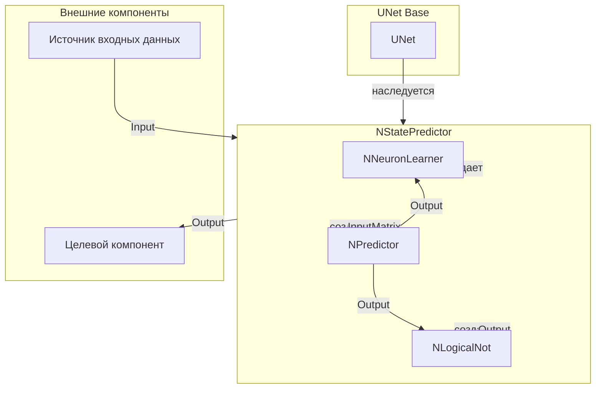
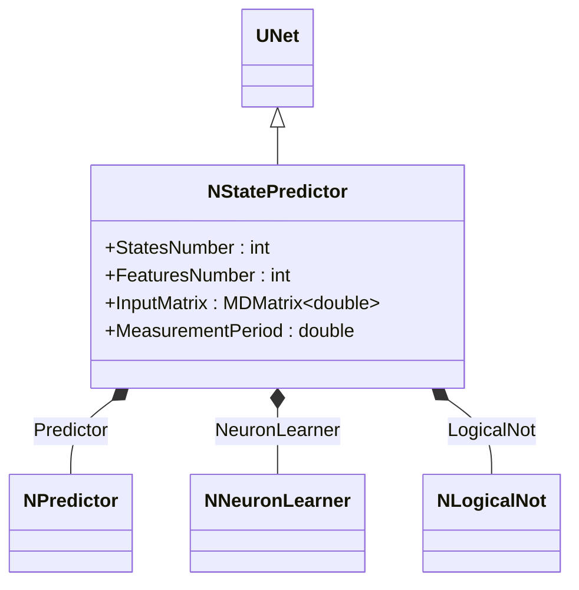
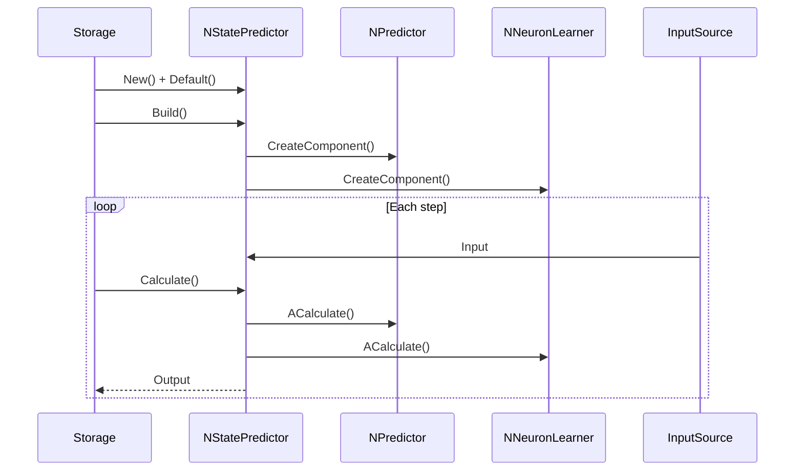
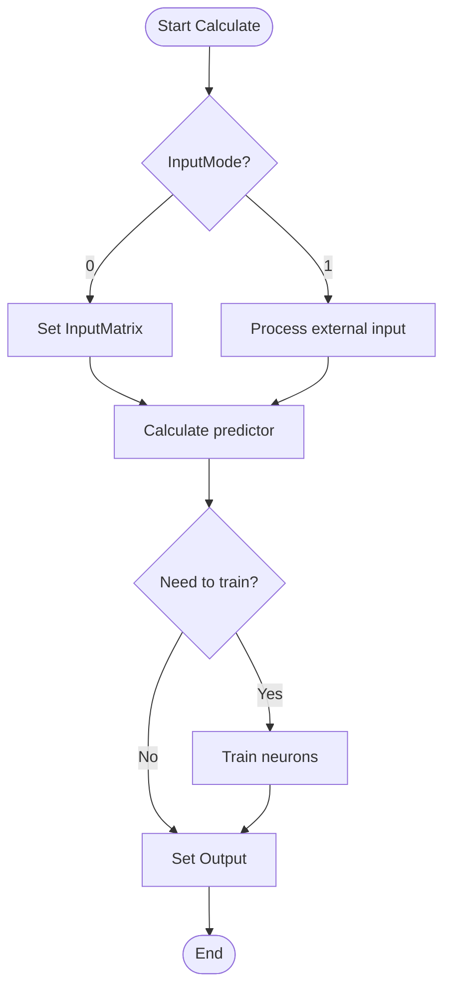
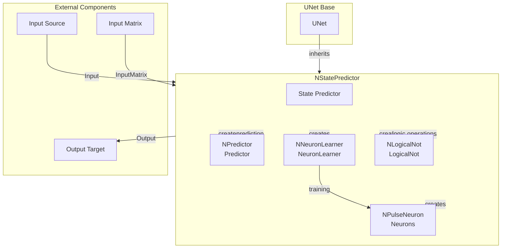

# NStatePredictor — предсказатель состояний

## RU

### Назначение

**Класс**: `NStatePredictor` — предсказатель состояний на основе временных рядов с использованием нейронных сетей.  
**Регистрация**: `NPulseLibrary.cpp` → `UploadClass("NStatePredictor", ...)`.  
**Storage-инстансы**: `ClassName = "NStatePredictor"` в `Bin/Configs/*/Model_*.xml`.

`NStatePredictor` реализует предсказатель состояний, который использует нейронные сети для предсказания будущих состояний на основе истории входных сигналов. Компонент интегрирует `NPredictor` (предсказатель), `NNeuronLearner` (обучатель нейронов), и `NLogicalNot` (логическое НЕ) для создания системы предсказания.

**Использование:** Предсказание состояний, анализ временных рядов с нейронными сетями

### UML-диаграмма классов



**Иерархия наследования:**
- `UNet` — базовая сеть Rdk Framework
- `NStatePredictor` — предсказатель состояний

**Связи:**
- Использует `NPredictor` для предсказания
- Использует `NNeuronLearner` для обучения нейронов
- Использует `NLogicalNot` для логических операций

**Внутренняя структура:**
- **Predictor** (`NPredictor`) — предсказатель состояний
- **NeuronLearner** (`NNeuronLearner`) — обучатель нейронов
- **LogicalNot** (`NLogicalNot`) — логическое НЕ

### UML-диаграмма последовательности



**Жизненный цикл:**
1. **Инициализация**: Установка параметров предсказателя состояний
2. **Сборка структуры**: Создание предсказателя, обучателя нейронов, логического НЕ
3. **Расчет**: Обработка входных данных, предсказание состояний, обучение (если включено)

### UML-диаграмма состояний

```mermaid
stateDiagram-v2
    [*] --> Uninitialized: New()
    Uninitialized --> Defaulted: Default()
    Defaulted --> Building: Build()
    Building --> CreatingPredictor: Создание NPredictor
    CreatingPredictor --> CreatingLearner: Создание NNeuronLearner
    CreatingLearner --> CreatingLogicalNot: Создание NLogicalNot
    CreatingLogicalNot --> Linking: Создание связей
    Linking --> Built: Структура построена
    Built --> Ready: Ready = true
    Ready --> Calculating: Calculate()
    Calculating --> CheckInputMode{InputMode?}
    CheckInputMode -->|0| SetInputMatrix: Установка InputMatrix
    CheckInputMode -->|1| ProcessExternalInput: Обработка внешнего входа
    SetInputMatrix --> CalcPredictor: Расчет NPredictor
    ProcessExternalInput --> CalcPredictor
    CalcPredictor --> CheckTrain{IsNeedToTrain?}
    CheckTrain -->|Да| TrainNeurons: Обучение NNeuronLearner
    CheckTrain -->|Нет| CalcLogicalNot: Расчет NLogicalNot
    TrainNeurons --> CalcLogicalNot
    CalcLogicalNot --> Ready: Шаг завершен
    Ready --> Resetting: Reset()
    Resetting --> Ready: Состояния сброшены
```

**Состояния:**
- **Uninitialized** — создан, но не инициализирован
- **Defaulted** — параметры установлены по умолчанию
- **Building** — выполняется сборка структуры
- **CreatingPredictor** — создание предсказателя
- **CreatingLearner** — создание обучателя нейронов
- **CreatingLogicalNot** — создание логического НЕ
- **Linking** — создание связей между компонентами
- **Built** — структура предсказателя построена
- **Ready** — готов к выполнению расчетов
- **Calculating** — выполняется расчет предсказателя
- **CheckInputMode** — проверка режима ввода
- **SetInputMatrix** — установка входной матрицы
- **ProcessExternalInput** — обработка внешнего входа
- **CalcPredictor** — расчет предсказателя
- **CheckTrain** — проверка необходимости обучения
- **TrainNeurons** — обучение нейронов
- **CalcLogicalNot** — расчет логического НЕ
- **Resetting** — выполняется сброс состояний

### UML-диаграмма активности



**Алгоритм расчета:**
1. Проверка режима ввода: ручной (InputMatrix) или внешний источник
2. Расчет предсказателя: сбор истории входных сигналов, предсказание следующего состояния
3. Обучение нейронов (если `IsNeedToTrain = true`): обновление весов на основе предсказания
4. Расчет логического НЕ: обработка результата предсказания
5. Генерация выходного сигнала

### UML-диаграмма компонентов



**Зависимости:**
- **Базовый класс**: `UNet`
- **Внутренние компоненты**: `NPredictor` (предсказатель), `NNeuronLearner` (обучатель), `NLogicalNot` (логическое НЕ)
- **Внешние компоненты**: источник входных данных (источник `Input`), целевой компонент (получатель `Output`)

### Свойства

#### Параметры (ptPubParameter)

- **`StatesNumber`** (int) — количество состояний для предсказания. Значение по умолчанию: зависит от реализации

- **`FeaturesNumber`** (int) — количество признаков (измерений). Значение по умолчанию: зависит от реализации

**Остальные параметры аналогичны `NPredictor`.**

### Методы

- **`BuildStructure()`** → `bool` — строит структуру предсказателя состояний:
  1. Создает предсказатель (`NPredictor`)
  2. Создает обучатель нейронов (`NNeuronLearner`)
  3. Создает логическое НЕ (`NLogicalNot`)
  4. Настраивает связи между компонентами

- **`ACalculate()`** → `bool` — выполняет расчет предсказателя состояний:
  1. Собирает историю входных сигналов
  2. Использует предсказатель для предсказания следующего состояния
  3. Обновляет обучатель нейронов (если `IsNeedToTrain = true`)
  4. Выдает предсказание как выходной сигнал

### Использование в конфигурациях

`NStatePredictor` используется в экспериментах с предсказанием состояний:

- **Предсказание состояний**: `Bin/Configs/!OldConfigs/*/Model_*.xml` (где требуется предсказание будущих состояний)

**Типичные значения параметров:**
- **StructureBuildMode**: 1 (классическая структура)
- **NeuronClassName**: "NPulseNeuron" (импульсный нейрон)
- **SynapseClassName**: "NPulseSynapse" (импульсный синапс)
- **PredictorClassName**: "NPredictor" (предсказатель)
- **NeuronLearnerClassName**: "NNeuronLearner" (обучатель нейронов)
- **LogicalNotClassName**: "NLogicalNot" (логическое НЕ)
- **InputMode**: 0 (ручной режим), 1 (внешний источник)
- **IsNeedToTrain**: true (режим обучения), false (режим проверки)
- **StatesNumber**: количество состояний для предсказания
- **FeaturesNumber**: количество признаков (измерений)

## Источники

См. [Literature-References.md](../Literature-References.md): **1**, **6**, **8**, **9**, **10**.

### См. также

- [`NPredictor`](NPredictor.md) — предсказатель
- [`NNeuronLearner`](NNeuronLearner.md) — обучатель нейронов
- [`NLogicalNot`](NLogicalNot.md) — логическое НЕ
- [Architecture.md](../Architecture.md) — архитектура библиотеки

---

## EN

### Purpose

**Class**: `NStatePredictor` — state predictor based on time series using neural networks.  
**Registration**: `NPulseLibrary.cpp` → `UploadClass("NStatePredictor", ...)`.  
**Instances**: `ClassName = "NStatePredictor"` in `Bin/Configs/*/Model_*.xml`.

`NStatePredictor` implements state predictor that uses neural networks to predict future states based on input signal history. Component integrates `NPredictor`, `NNeuronLearner`, and `NLogicalNot` to create prediction system.

**Usage:** State prediction, time series analysis with neural networks

### UML Class Diagram



### UML Sequence Diagram



### UML State Diagram

```mermaid
stateDiagram-v2
    [*] --> Uninitialized: New()
    Uninitialized --> Defaulted: Default()
    Defaulted --> Building: Build()
    Building --> Built: Structure built
    Built --> Ready: Ready = true
    Ready --> Calculating: Calculate()
    Calculating --> CalcPredictor: Calculate predictor
    CalcPredictor --> CheckTrain{Need to train?}
    CheckTrain -->|Yes| TrainNeurons: Train neurons
    CheckTrain -->|No| Ready: Step completed
    TrainNeurons --> Ready: Step completed
    Ready --> Resetting: Reset()
    Resetting --> Ready
```

### UML Activity Diagram



### UML Component Diagram



### Properties

- `StructureBuildMode` — structure rebuild mode
- `NeuronClassName` — neuron class name
- `SynapseClassName` — synapse class name
- `PredictorClassName` — predictor class name
- `NeuronLearnerClassName` — neuron learner class name
- `LogicalNotClassName` — logical NOT class name
- `InputMode` — input mode (0 — manual, 1 — external source)
- `IsNeedToTrain` — training required flag
- `InputPattern` — input pattern
- `InputMatrix` — input data matrix
- `StatesNumber` — number of states
- `FeaturesNumber` — number of features
- `MeasurementPeriod` — measurement period
- `Input` — input signal
- `Output` — output signal (state prediction)

### Methods

- `ADefault()` — setting default parameters
- `ABuild()` — building state predictor structure
- `ACalculate()` — prediction or training step
- `BuildStructure()` — building component structure

### Usage in configurations

`NStatePredictor` is used for state prediction:

- **State prediction**: `Bin/Configs/*/Model_*.xml` (where state prediction is required)
- **Time series analysis**: experiments with time series state prediction
- **Neural prediction**: prediction using neural networks

**Features:**
- Automatic structure building: creates predictor, learner, and logical components
- Training mode: trains neurons on state patterns
- Prediction mode: predicts future states based on history
- Flexible configuration: supports various neuron and synapse types

**Typical parameter values:**
- **NeuronClassName**: "NPulseNeuron" (spiking neuron)
- **PredictorClassName**: "NPredictor" (predictor)
- **NeuronLearnerClassName**: "NNeuronLearner" (neuron learner)
- **LogicalNotClassName**: "NLogicalNot" (logical NOT)

### References

See [Literature-References.md](../Literature-References.md): **1**, **6**, **8**, **9**, **10**.

### See Also

- [`NPredictor`](NPredictor.md) — predictor
- [`NNeuronLearner`](NNeuronLearner.md) — neuron learner
- [`NLogicalNot`](NLogicalNot.md) — logical NOT
- [Architecture.md](../Architecture.md) — library architecture
