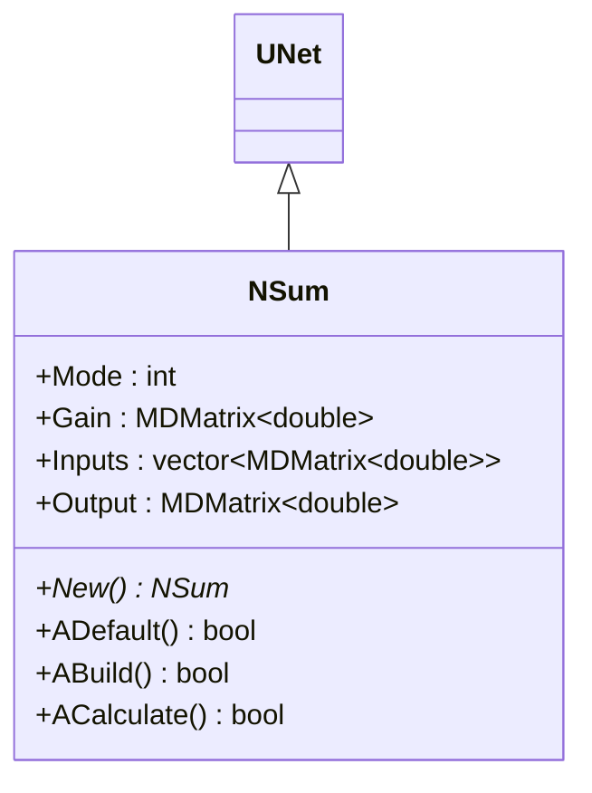
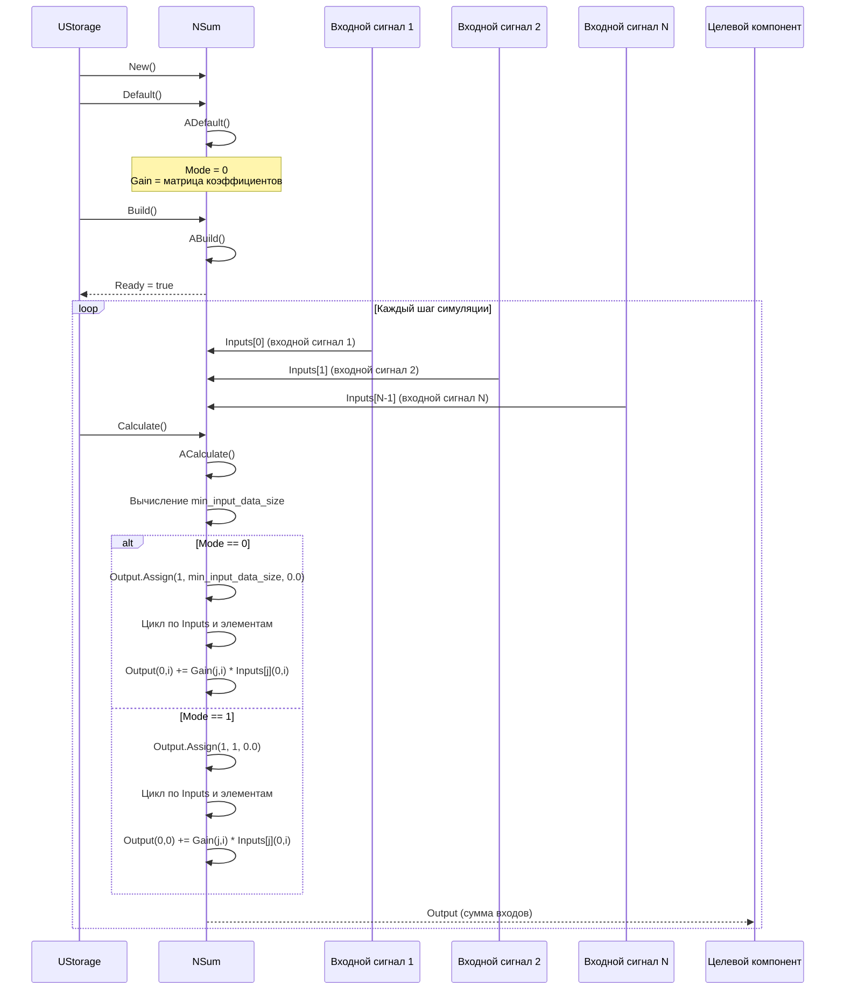
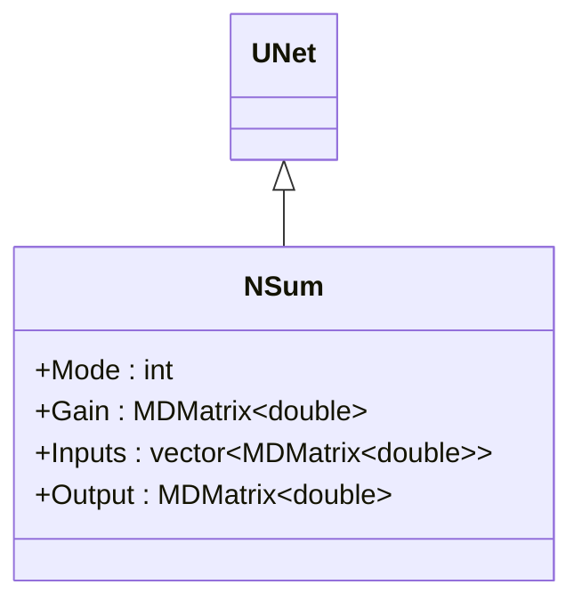
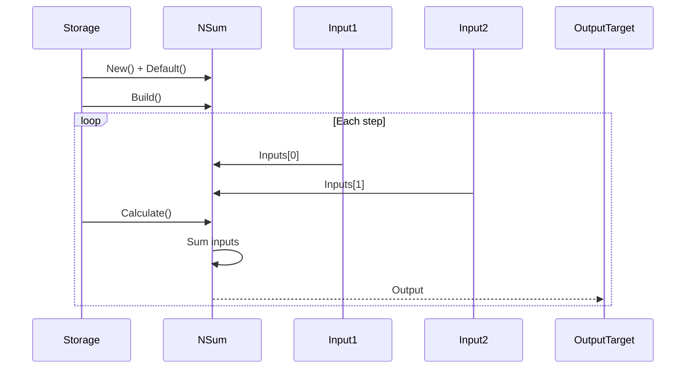
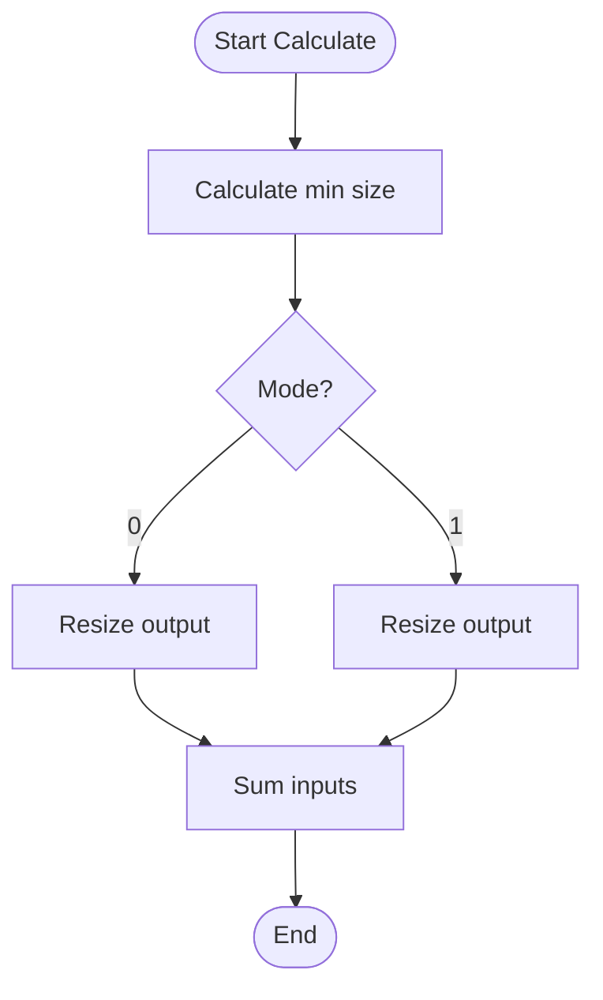

# NSum — сумматор

## RU

### Назначение

**Класс**: `NSum` — компонент для суммирования входных сигналов с коэффициентами усиления.  
**Регистрация**: `NPulseLibrary.cpp` → `UploadClass("NSum", ...)`.  
**Storage-инстансы**: `ClassName = "NSum"` в `Bin/Configs/*/Model_*.xml`.

`NSum` реализует сумматор, который суммирует входные сигналы (`Inputs`) с учетом коэффициентов усиления (`Gain`) и выдает результат как выходной сигнал (`Output`). Компонент может работать в различных режимах (`Mode`) для различных типов суммирования.

**Использование:** Суммирование сигналов, агрегация входов

### UML-диаграмма классов



**Иерархия наследования:**
- `UNet` — базовая сеть Rdk Framework
- `NSum` — сумматор

### UML-диаграмма последовательности



**Жизненный цикл:**
1. **Инициализация**: Установка параметров по умолчанию (`Mode=0`)
2. **Сброс**: Инициализация состояний
3. **Расчет**: Суммирование входных сигналов с учетом коэффициентов усиления

### UML-диаграмма состояний

```mermaid
stateDiagram-v2
    [*] --> Uninitialized: New()
    Uninitialized --> Defaulted: Default()
    Defaulted --> Building: Build()
    Building --> Built: Структура создана
    Built --> Ready: Ready = true
    Ready --> Calculating: Calculate()
    Calculating --> CalcMinSize: Вычисление min_input_data_size
    CalcMinSize --> CheckMode{Mode?}
    CheckMode -->|0| Mode0: Режим 0
    CheckMode -->|1| Mode1: Режим 1
    Mode0 --> ResizeOutput0: Output.Resize(1, min_input_data_size)
    Mode1 --> ResizeOutput1: Output.Resize(1, 1)
    ResizeOutput0 --> LoopInputs: Цикл по Inputs
    ResizeOutput1 --> LoopInputs
    LoopInputs --> LoopElements: Цикл по элементам
    LoopElements --> GetGain: Получение Gain(j,i)
    GetGain --> Sum: Output += Gain * Input
    Sum --> CheckMoreElements: Есть еще элементы?
    CheckMoreElements -->|Да| LoopElements
    CheckMoreElements -->|Нет| CheckMoreInputs: Есть еще входы?
    CheckMoreInputs -->|Да| LoopInputs
    CheckMoreInputs -->|Нет| Ready: Шаг завершен
    Ready --> Resetting: Reset()
    Resetting --> Ready: Состояния сброшены
```

**Состояния:**
- **Uninitialized** — создан, но не инициализирован
- **Defaulted** — параметры установлены по умолчанию
- **Building** — выполняется сборка
- **Built** — структура сумматора построена
- **Ready** — готов к выполнению расчетов
- **Calculating** — выполняется расчет сумматора
- **CalcMinSize** — вычисление минимального размера входных данных
- **CheckMode** — проверка режима суммирования
- **Mode0** — режим 0 (обычное суммирование)
- **Mode1** — режим 1 (суммирование в один элемент)
- **ResizeOutput0** — изменение размера выходной матрицы (режим 0)
- **ResizeOutput1** — изменение размера выходной матрицы (режим 1)
- **LoopInputs** — цикл по входным сигналам
- **LoopElements** — цикл по элементам входных сигналов
- **GetGain** — получение коэффициента усиления
- **Sum** — суммирование с учетом усиления
- **CheckMoreElements** — проверка наличия еще элементов
- **CheckMoreInputs** — проверка наличия еще входов
- **Resetting** — выполняется сброс состояний

### UML-диаграмма активности

```mermaid
flowchart TD
    Start([Start Calculate]) --> CalcMinSize["Вычисление min_input_data_size<br/>минимальный размер среди всех Inputs"]
    CalcMinSize --> CheckMode{Mode?}
    CheckMode -->|0| ResizeOutput0[Output.Resize(1, min_input_data_size)]
    CheckMode -->|1| ResizeOutput1[Output.Resize(1, 1)]
    ResizeOutput0 --> LoopInputs[Цикл по Inputs j = 0..size-1]
    ResizeOutput1 --> LoopInputs
    LoopInputs --> LoopElements[Цикл по элементам i = 0..min_size-1]
    LoopElements --> GetGain[" Gain.GetRows() > j и<br/>Gain.GetCols() > i?"]
    GetGain -->|Да| UseGain[gain = Gain(j,i)]
    GetGain -->|Нет| UseDefaultGain[gain = 1.0]
    UseGain --> Sum[Output += gain * Inputs[j](0,i)]
    UseDefaultGain --> Sum
    Sum --> CheckMoreElements{Есть еще элементы?}
    CheckMoreElements -->|Да| LoopElements
    CheckMoreElements -->|Нет| CheckMoreInputs{Есть еще входы?}
    CheckMoreInputs -->|Да| LoopInputs
    CheckMoreInputs -->|Нет| End([End])
```

**Алгоритм расчета:**
1. Вычисление минимального размера входных данных: `min_input_data_size = min(Inputs[i].GetCols())`
2. Изменение размера выходной матрицы в зависимости от режима:
   - Режим 0: `Output.Resize(1, min_input_data_size)`
   - Режим 1: `Output.Resize(1, 1)`
3. Цикл по всем входным сигналам и элементам:
   - Получение коэффициента усиления: `gain = Gain(j,i)` или `gain = 1.0` (если не задан)
   - Суммирование: `Output += gain * Inputs[j](0,i)`

### UML-диаграмма компонентов

```mermaid
graph TB
    subgraph UNet["UNet Base"]
        BaseNet[UNet]
    end
    
    subgraph NSum["NSum"]
        Summer[Сумматор]
        GainMatrix[Матрица коэффициентов усиления]
    end
    
    subgraph External["Внешние компоненты"]
        Input1[Входной сигнал 1]
        Input2[Входной сигнал 2]
        InputN[Входной сигнал N]
        OutputTarget[Целевой компонент]
    end
    
    BaseNet -->|наследуется| NSum
    NSum -->|реализует| Summer
    NSum -->|использует| GainMatrix
    Input1 -->|Inputs[0]| NSum
    Input2 -->|Inputs[1]| NSum
    InputN -->|Inputs[N-1]| NSum
    NSum -->|Output| OutputTarget
```

**Зависимости:**
- **Базовый класс**: `UNet`
- **Внутренние компоненты**: сумматор, матрица коэффициентов усиления (`Gain`)
- **Внешние компоненты**: входные сигналы (источники `Inputs`), целевой компонент (получатель `Output`)

### Свойства

#### Параметры (ptPubParameter)

- **`Mode`** (int) — режим суммирования:
  - 0 — обычное суммирование
  - 1 — другой режим
  Значение по умолчанию: 0

- **`Gain`** (MDMatrix<double>) — матрица коэффициентов усиления для каждого входа. Значение по умолчанию: зависит от реализации

#### Входные свойства (ptInput | ptPubState)

- **`Inputs`** (vector<MDMatrix<double>>) — вектор входных сигналов. Значение по умолчанию: зависит от реализации

#### Выходные свойства (ptOutput | ptPubState)

- **`Output`** (MDMatrix<double>) — выходной сигнал (сумма входов с учетом усиления). Значение по умолчанию: зависит от реализации

### Методы

- **`ACalculate()`** → `bool` — выполняет расчет сумматора:
  1. Суммирует входные сигналы с учетом коэффициентов усиления
  2. Выдает результат как выходной сигнал

### Примеры использования

#### Пример 1: Создание сумматора в коде C++

```cpp
// Создание сумматора
auto sum = storage->CreateComponent<NSum>();
sum->SetName("Sum");

// Инициализация
sum->Default();

// Настройка параметров
sum->Mode = 0;

// Сборка
sum->Build();
```

## Источники

См. [Literature-References.md](../Literature-References.md): **[A]**, **4**, **25**.

### См. также

- [`NLogicalNot`](NLogicalNot.md) — логическое НЕ
- [Architecture.md](../Architecture.md) — архитектура библиотеки

---

## EN

### Purpose

**Class**: `NSum` — component for summing input signals with gain coefficients.  
**Registration**: `NPulseLibrary.cpp` → `UploadClass("NSum", ...)`.  
**Instances**: `ClassName = "NSum"` in `Bin/Configs/*/Model_*.xml`.

`NSum` implements summer that sums input signals (`Inputs`) with gain coefficients (`Gain`) and outputs result as output signal (`Output`). Component can work in various modes (`Mode`) for different summation types.

**Usage:** Signal summation, input aggregation

### UML Class Diagram



### UML Sequence Diagram



### UML State Diagram

```mermaid
stateDiagram-v2
    [*] --> Uninitialized: New()
    Uninitialized --> Defaulted: Default()
    Defaulted --> Built: Build()
    Built --> Ready: Ready = true
    Ready --> Calculating: Calculate()
    Calculating --> CalcMinSize: Calculate min size
    CalcMinSize --> CheckMode{Mode?}
    CheckMode -->|0| Mode0: Mode 0
    CheckMode -->|1| Mode1: Mode 1
    Mode0 --> Sum: Sum inputs
    Mode1 --> Sum
    Sum --> Ready: Step completed
    Ready --> Resetting: Reset()
    Resetting --> Ready
```

### UML Activity Diagram



### UML Component Diagram

```mermaid
graph TB
    subgraph UNet["UNet Base"]
        BaseNet[UNet]
    end
    
    subgraph NSum["NSum"]
        Summer[Summer]
        GainMatrix[Gain Matrix]
    end
    
    subgraph External["External Components"]
        Input1[Input Signal 1]
        Input2[Input Signal 2]
        InputN[Input Signal N]
        OutputTarget[Output Target]
    end
    
    BaseNet -->|inherits| NSum
    NSum -->|implements| Summer
    NSum -->|uses| GainMatrix
    Input1 -->|Inputs[0]| NSum
    Input2 -->|Inputs[1]| NSum
    InputN -->|Inputs[N-1]| NSum
    NSum -->|Output| OutputTarget
```

### Properties

`NSum` uses the following properties:

**Parameters (ptPubParameter):**
- `Mode` (int) — summation mode:
  - 0 — normal summation (output size = min input size)
  - 1 — single element summation (output size = 1)
  Default: 0

- `Gain` (MDMatrix<double>) — gain coefficient matrix for each input. Default: depends on implementation

**Input properties (ptInput | ptPubState):**
- `Inputs` (vector<MDMatrix<double>>) — vector of input signals. Default: depends on implementation

**Output properties (ptOutput | ptPubState):**
- `Output` (MDMatrix<double>) — output signal (sum of inputs with gain). Default: depends on implementation

### Methods

`NSum` uses the following methods:

- `ADefault()` → `bool` — initializes default parameters (Mode = 0)
- `ABuild()` → `bool` — builds component structure
- `ACalculate()` → `bool` — performs summer calculation:
  1. Calculates minimum size among all inputs
  2. Resizes output based on Mode
  3. Sums input signals with gain coefficients
  4. Sets output signal

### Usage in configurations

`NSum` is used in signal aggregation experiments:

- **Signal aggregation**: `Bin/Configs/*/Model_*.xml` (where signal summation is required)
- **Input combination**: Combining multiple input signals into single output

**Typical parameter values:**
- **Mode**: 0 (normal summation), 1 (single element summation)
- **Gain**: Matrix of gain coefficients (default: 1.0 for all elements if not specified)

**Features:**
- Multiple inputs: Supports multiple input signals
- Gain coefficients: Each input can have individual gain coefficient
- Two modes: Normal summation or single element summation
- Flexible: Automatically handles different input sizes

### References

See [Literature-References.md](../Literature-References.md): **[A]**, **4**, **25**.

### See Also

- [`NLogicalNot`](NLogicalNot.md) — logical NOT
- [Architecture.md](../Architecture.md) — library architecture
