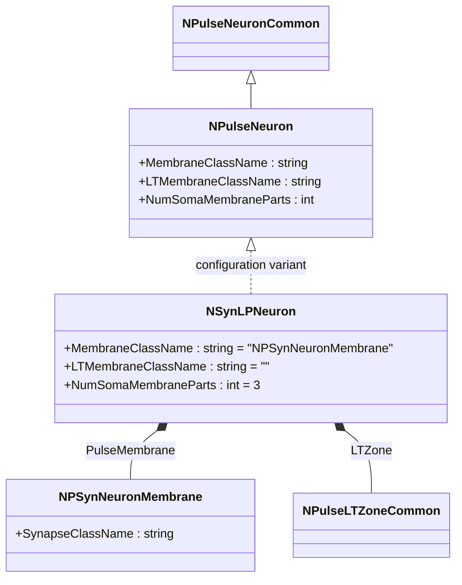
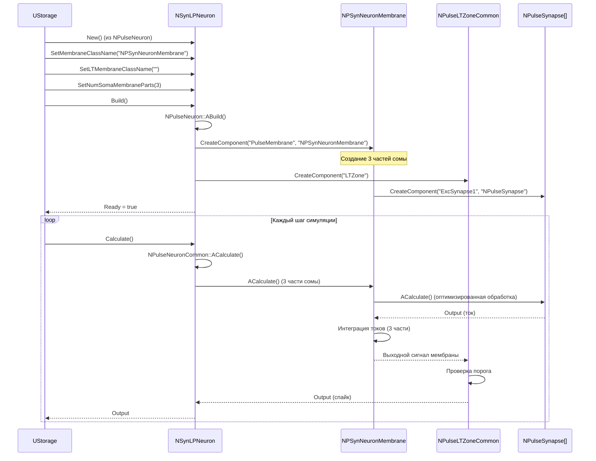
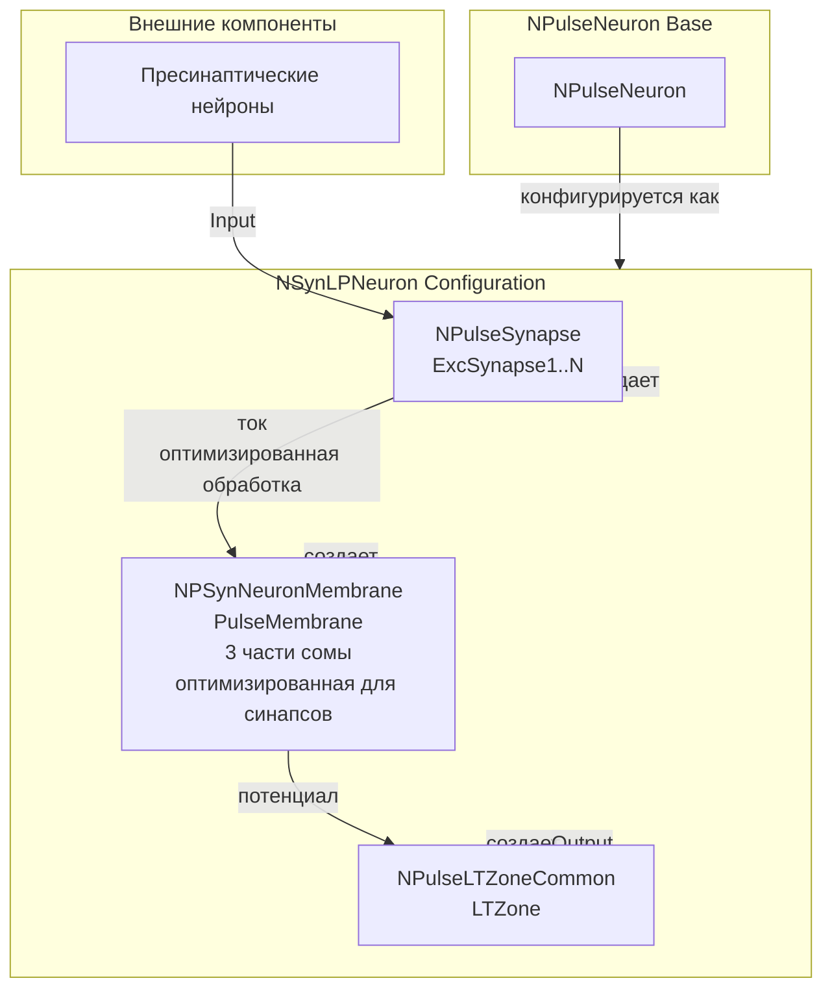
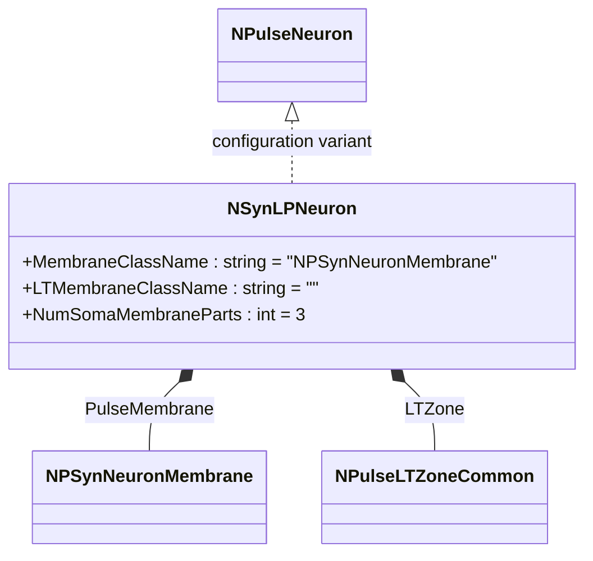
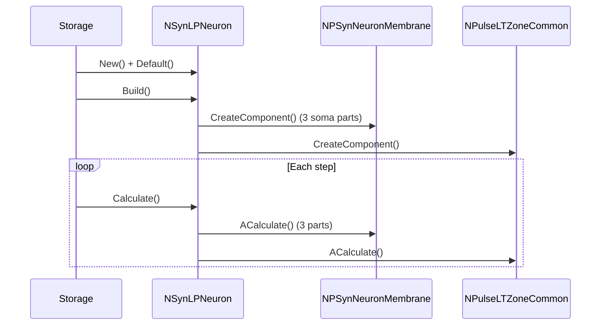
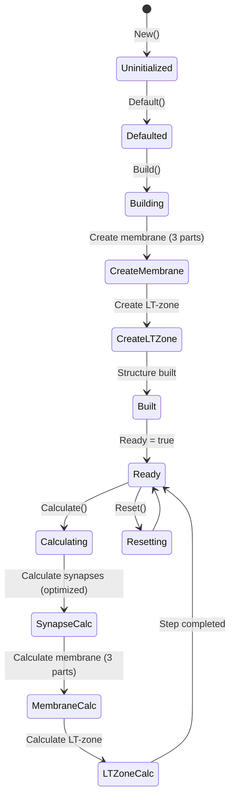
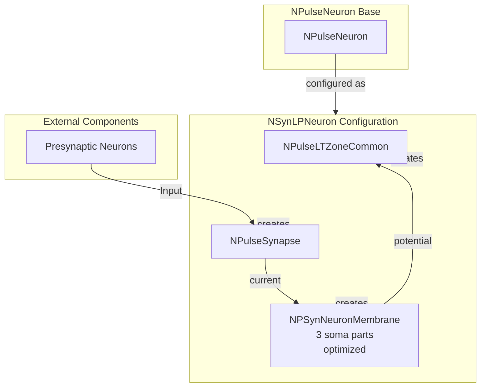

# NSynLPNeuron — крупный син-нейрон

## RU

### Назначение

**Класс**: `NSynLPNeuron` — конфигурационный вариант крупного импульсного нейрона с оптимизированными синапсами.  
**Аббревиатуры**: `Syn` — **Syn**apse (синапс); `LP` — **L**ong **P**attern (длинный паттерн).  
**Регистрация**: `NPulseLibrary.cpp` → `UploadClass("NSynLPNeuron", ...)`.  
**Storage-инстансы**: `ClassName = "NSynLPNeuron"` в `Bin/Configs/*/Model_*.xml`.

`NSynLPNeuron` является конфигурационным вариантом базового класса `NPulseNeuron` с мембраной, оптимизированной для синапсов. Создается из `NPulseNeuron` с настройками:
- `LTMembraneClassName = ""` — без LT-мембраны
- `MembraneClassName = "NPSynNeuronMembrane"` — мембрана, оптимизированная для синапсов
- `NumSomaMembraneParts = 3` — три части сомы

Мембрана `NPSynNeuronMembrane` оптимизирована для эффективной обработки синапсов, что улучшает производительность при работе с большим количеством синаптических соединений. Крупные нейроны имеют расширенную структуру с тремя частями сомы.

**Использование:** Эксперименты с оптимизированными синапсами для крупных нейронов

### UML-диаграмма классов



**Иерархия наследования:**
- `NPulseNeuronCommon` — общий импульсный нейрон
- `NPulseNeuron` — импульсный нейрон с параметрами структурирования
- `NSynLPNeuron` — конфигурационный вариант с оптимизированными синапсами

**Внутренняя структура:**
- **PulseMembrane** (`NPSynNeuronMembrane`) — мембрана, оптимизированная для синапсов (3 части сомы)
- **LTZone** (`NPulseLTZoneCommon`) — стандартная LT-зона

### UML-диаграмма последовательности



**Жизненный цикл:**
1. **Создание**: `NSynLPNeuron` создается из `NPulseNeuron` с настройкой параметров
2. **Настройка**: Устанавливается мембрана с оптимизацией для синапсов, три части сомы
3. **Сборка**: Автоматически создается структура нейрона с оптимизированной мембраной (3 части) и LT-зоной
4. **Расчет**: На каждом шаге рассчитываются синапсы (оптимизированная обработка), мембрана (3 части) и LT-зона

### UML-диаграмма состояний

```mermaid
stateDiagram-v2
    [*] --> Uninitialized: New()
    Uninitialized --> Defaulted: Default()
    Defaulted --> Configuring: Настройка Syn параметров
    Configuring --> SetSynParams: SetMembraneClassName("NPSynNeuronMembrane")<br/>SetLTMembraneClassName("")<br/>SetNumSomaMembraneParts(3)
    SetSynParams --> Building: Build()
    Building --> BuildBase: NPulseNeuron::ABuild()
    BuildBase --> CreateMembrane: Создание NPSynNeuronMembrane (3 части)
    CreateMembrane --> CreateLTZone: Создание NPulseLTZoneCommon
    CreateLTZone --> CreateSynapses: Создание синапсов
    CreateSynapses --> Built: Структура создана
    Built --> Ready: Ready = true
    Ready --> Calculating: Calculate()
    Calculating --> SynapseCalc: Расчет синапсов (оптимизированный)
    SynapseCalc --> MembraneCalc: Расчет мембраны (3 части)
    MembraneCalc --> LTZoneCalc: Расчет LT-зоны
    LTZoneCalc --> Ready: Шаг завершен
    Ready --> Resetting: Reset()
    Resetting --> Ready: Состояния сброшены
```

**Состояния:**
- **Uninitialized** — создан, но не инициализирован
- **Defaulted** — параметры установлены по умолчанию
- **Configuring** — настройка параметров для оптимизированных синапсов
- **SetSynParams** — установка параметров (мембрана с оптимизацией, три части сомы)
- **Building** — выполняется сборка структуры
- **BuildBase** — сборка базовой структуры нейрона
- **CreateMembrane** — создание мембраны с тремя частями сомы
- **CreateLTZone** — создание LT-зоны
- **CreateSynapses** — создание синапсов
- **Built** — структура нейрона построена
- **Ready** — готов к выполнению расчетов
- **Calculating** — выполняется расчет нейрона
- **SynapseCalc** — расчет синапсов (оптимизированная обработка)
- **MembraneCalc** — расчет мембраны (три части сомы)
- **LTZoneCalc** — расчет LT-зоны
- **Resetting** — выполняется сброс состояний

### UML-диаграмма активности

```mermaid
flowchart TD
    Start([Start Calculate]) --> CallBase[NPulseNeuronCommon::ACalculate]
    CallBase --> CalcMembrane[Расчет NPSynNeuronMembrane (3 части)]
    CalcMembrane --> LoopSynapses[Цикл по синапсам]
    LoopSynapses --> CalcSynapse["Расчет синапса<br/>оптимизированная обработка"]
    CalcSynapse --> CheckMoreSynapses{Есть еще синапсы?}
    CheckMoreSynapses -->|Да| LoopSynapses
    CheckMoreSynapses -->|Нет| CalcMembranePart1[Расчет части 1 сомы]
    CalcMembranePart1 --> CalcMembranePart2[Расчет части 2 сомы]
    CalcMembranePart2 --> CalcMembranePart3[Расчет части 3 сомы]
    CalcMembranePart3 --> AggregateMembrane[Агрегация потенциалов]
    AggregateMembrane --> CalcLTZone[Расчет LT-зоны]
    CalcLTZone --> CheckThreshold{Порог достигнут?}
    CheckThreshold -->|Да| GenerateSpike[Генерация спайка]
    CheckThreshold -->|Нет| UpdateOutput[Обновление Output]
    GenerateSpike --> UpdateOutput
    UpdateOutput --> End([End])
```

**Алгоритм расчета:**
1. Вызов базового расчета нейрона (`NPulseNeuronCommon::ACalculate`)
2. Расчет мембраны с оптимизированной обработкой синапсов
3. Для каждого синапса: оптимизированный расчет тока
4. Расчет трех частей сомы: последовательный расчет каждой части
5. Агрегация потенциалов от всех частей мембраны
6. Расчет LT-зоны: проверка порога
7. Генерация спайка при достижении порога

### UML-диаграмма компонентов



**Зависимости:**
- **Базовый класс**: `NPulseNeuron` (конфигурационный вариант)
- **Внутренние компоненты**: `NPSynNeuronMembrane` (мембрана с 3 частями сомы и оптимизацией), `NPulseLTZoneCommon` (LT-зона), `NPulseSynapse` (синапсы)
- **Внешние компоненты**: пресинаптические нейроны

### Свойства

`NSynLPNeuron` использует все свойства базового класса `NPulseNeuron` с параметрами:
- `MembraneClassName = "NPSynNeuronMembrane"` — мембрана, оптимизированная для синапсов
- `LTMembraneClassName = ""` — без LT-мембраны
- `NumSomaMembraneParts = 3` — три части сомы

### Методы

`NSynLPNeuron` использует все методы базового класса `NPulseNeuron`.

### Примеры использования

#### Пример 1: Создание крупного син-нейрона в коде C++

```cpp
// Создание крупного нейрона с оптимизированными синапсами
auto neuron = storage->CreateComponent("NSynLPNeuron");
neuron->SetName("SynLPNeuron");

// Инициализация (использует параметры по умолчанию)
neuron->Default();

// Сборка (автоматически создает NPSynNeuronMembrane с 3 частями сомы, NPulseLTZoneCommon)
neuron->Build();

// Использование
for (int step = 0; step < 1000; step++) {
    neuron->Calculate();
    // Нейрон генерирует спайки с оптимизированной обработкой синапсов
}
```

#### Пример 2: Конфигурация XML

```xml
<SynLPNeuron1 Class="NSynLPNeuron">
    <Parameters>
        <!-- Параметры наследуются от NPulseNeuron -->
    </Parameters>
</SynLPNeuron1>
```

### Использование в конфигурациях

`NSynLPNeuron` используется в экспериментах с оптимизированными синапсами для крупных нейронов:

- **Оптимизированные синапсы**: `Bin/Configs/!OldConfigs/*/Model_*.xml` (где требуется эффективная обработка синапсов для крупных нейронов)
- **Производительность**: эксперименты с большим количеством синаптических соединений в крупных нейронах

**Типичные значения параметров:**
- **MembraneClassName**: "NPSynNeuronMembrane" (мембрана с оптимизацией)
- **LTMembraneClassName**: "" (без LT-мембраны)
- **NumSomaMembraneParts**: 3 (три части сомы для крупных нейронов)

**Особенности:**
- Оптимизация синапсов: мембрана оптимизирована для эффективной обработки синапсов
- Производительность: улучшенная производительность при работе с большим количеством синапсов
- Крупные нейроны: три части сомы для более сложных экспериментов

## Источники

См. [Literature-References.md](../Literature-References.md): **[A]**, **4**, **25**, **29**.

### См. также

- [`NPulseNeuron`](NPulseNeuron.md) — импульсный нейрон с параметрами структурирования
- [`NLPNeuron`](NLPNeuron.md) — базовый крупный нейрон
- [`NPSynNeuronMembrane`](NPSynNeuronMembrane.md) — мембрана, оптимизированная для синапсов
- [`NSynSPNeuron`](NSynSPNeuron.md) — мелкий син-нейрон
- [Architecture.md](../Architecture.md) — архитектура библиотеки

---

## EN

### Purpose

**Class**: `NSynLPNeuron` — configuration variant of large spiking neuron with optimized synapses.  
**Registration**: `NPulseLibrary.cpp` → `UploadClass("NSynLPNeuron", ...)`.  
**Instances**: `ClassName = "NSynLPNeuron"` in `Bin/Configs/*/Model_*.xml`.

`NSynLPNeuron` is a configuration variant of the base class `NPulseNeuron` with membrane optimized for synapses. Created from `NPulseNeuron` with settings:
- `LTMembraneClassName = ""` — without LT-membrane
- `MembraneClassName = "NPSynNeuronMembrane"` — membrane optimized for synapses
- `NumSomaMembraneParts = 3` — three soma parts

Membrane `NPSynNeuronMembrane` is optimized for efficient synapse processing, improving performance when working with large numbers of synaptic connections. Large neurons have extended structure with three soma parts.

**Usage:** Experiments with optimized synapses for large neurons

### UML Class Diagram



### UML Sequence Diagram



### UML State Diagram



### UML Activity Diagram

```mermaid
flowchart TD
    Start([Start Calculate]) --> CalcMembrane[Calculate membrane (3 parts)]
    CalcMembrane --> LoopSynapses[Loop through synapses]
    LoopSynapses --> CalcSynapse["Calculate synapse<br/>optimized"]
    CalcSynapse --> CheckMore{More synapses?}
    CheckMore -->|Yes| LoopSynapses
    CheckMore -->|No| CalcMembraneParts[Calculate 3 soma parts]
    CalcMembraneParts --> AggregateMembrane[Aggregate potentials]
    AggregateMembrane --> CalcLTZone[Calculate LT-zone]
    CalcLTZone --> CheckThreshold{Threshold reached?}
    CheckThreshold -->|Yes| GenerateSpike[Generate spike]
    CheckThreshold -->|No| End([End])
    GenerateSpike --> End
```

### UML Component Diagram



### Properties

`NSynLPNeuron` uses all properties of base class `NPulseNeuron` with parameters:
- `MembraneClassName = "NPSynNeuronMembrane"` — membrane optimized for synapses
- `LTMembraneClassName = ""` — without LT-membrane
- `NumSomaMembraneParts = 3` — three soma parts

### Methods

`NSynLPNeuron` uses all methods of base class `NPulseNeuron`.

### Usage in configurations

`NSynLPNeuron` is used in experiments with optimized synapses for large neurons:

- **Optimized synapses**: `Bin/Configs/!OldConfigs/*/Model_*.xml` (where efficient synapse processing is required for large neurons)
- **Performance**: experiments with large numbers of synaptic connections in large neurons

**Typical parameter values:**
- **MembraneClassName**: "NPSynNeuronMembrane" (membrane with optimization)
- **LTMembraneClassName**: "" (without LT-membrane)
- **NumSomaMembraneParts**: 3 (three soma parts for large neurons)

**Features:**
- Synapse optimization: membrane optimized for efficient synapse processing
- Performance: improved performance when working with large numbers of synapses
- Large neurons: three soma parts for more complex experiments

### References

See [Literature-References.md](../Literature-References.md): **[A]**, **4**, **25**, **29**.

### See Also

- [`NPulseNeuron`](NPulseNeuron.md) — spiking neuron with structuring parameters
- [`NLPNeuron`](NLPNeuron.md) — base large neuron
- [`NPSynNeuronMembrane`](NPSynNeuronMembrane.md) — membrane optimized for synapses
- [`NSynSPNeuron`](NSynSPNeuron.md) — small syn-neuron
- [Architecture.md](../Architecture.md) — library architecture
