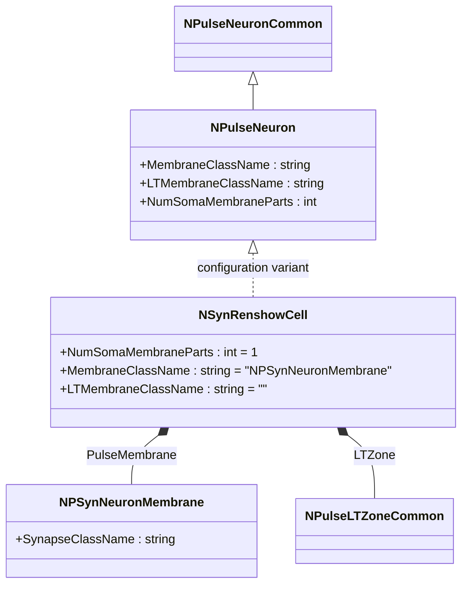
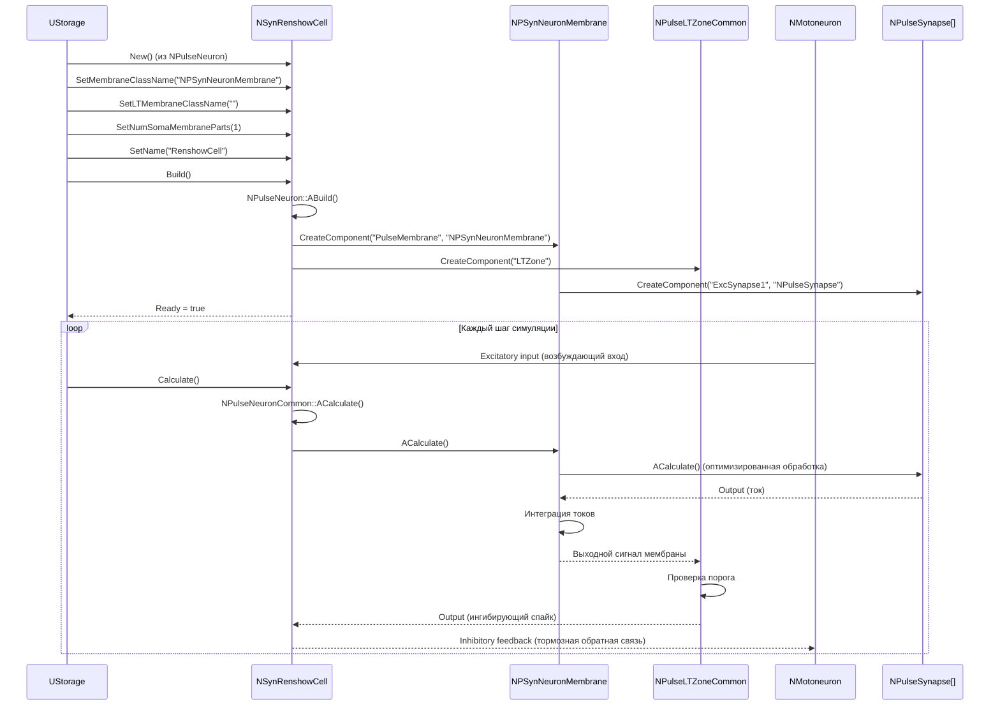
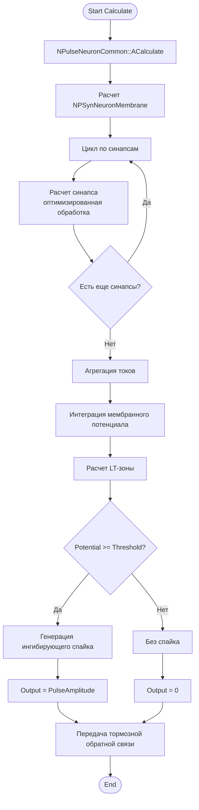
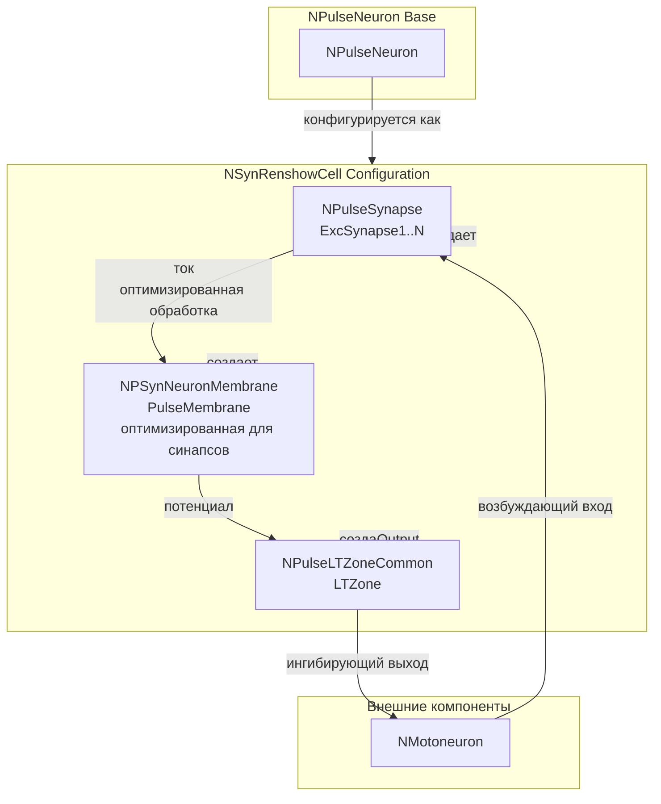
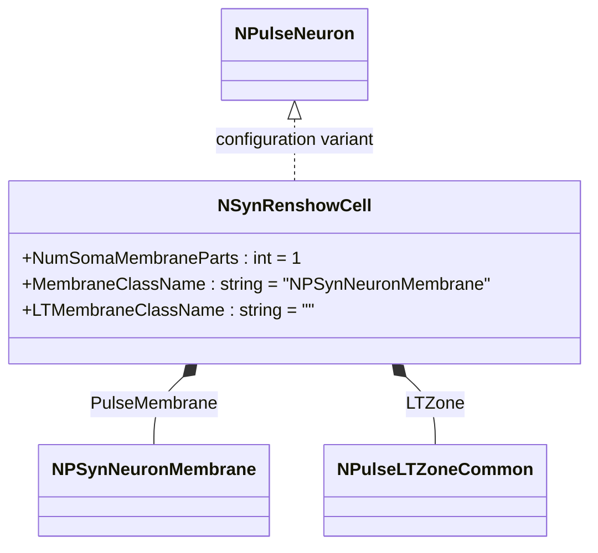
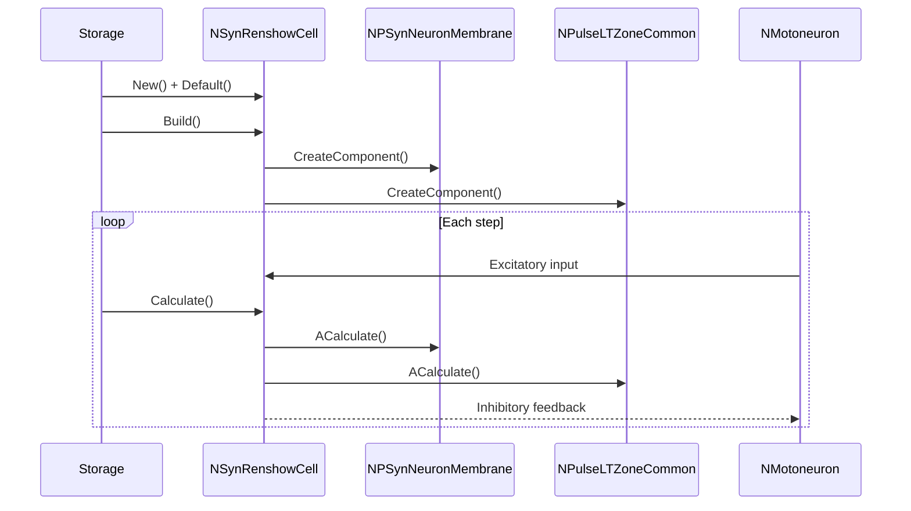
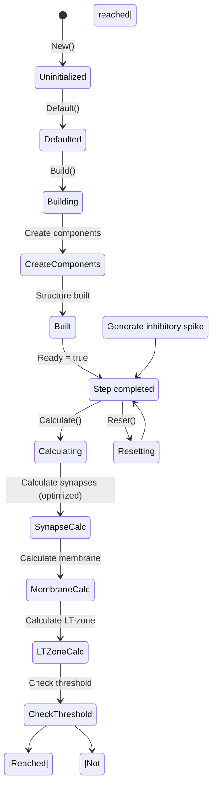
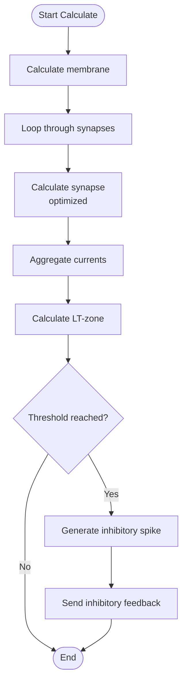
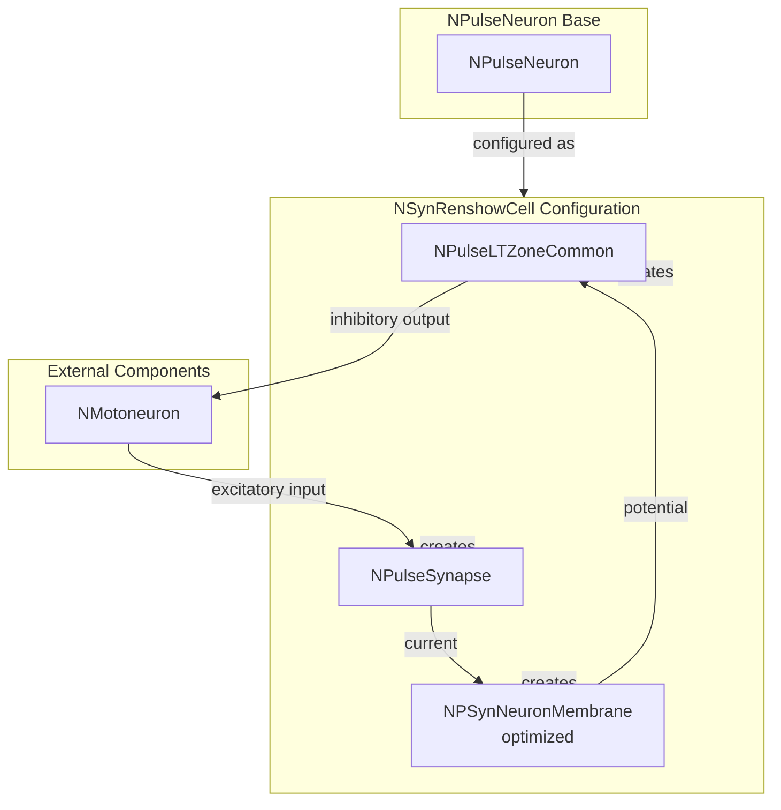

# NSynRenshowCell — син-клетка Реншоу

## RU

### Назначение

**Класс**: `NSynRenshowCell` — конфигурационный вариант клетки Реншоу (ингибирующий интернейрон) с оптимизированными синапсами.  
**Аббревиатура**: `Syn` — **Syn**apse (синапс).  
**Регистрация**: `NPulseLibrary.cpp` → `UploadClass("NSynRenshowCell", ...)`.  
**Storage-инстансы**: `ClassName = "NSynRenshowCell"` в `Bin/Configs/*/Model_*.xml`.

`NSynRenshowCell` является конфигурационным вариантом базового класса `NPulseNeuron` для моделирования клеток Реншоу — ингибирующих интернейронов, которые обеспечивают реципрокное торможение мотонейронов. Создается из `NPulseNeuron` с настройками:
- `NumSomaMembraneParts = 1` — одна часть сомы
- `MembraneClassName = "NPSynNeuronMembrane"` — мембрана, оптимизированная для синапсов
- `LTMembraneClassName = ""` — без LT-мембраны

Клетки Реншоу получают возбуждающие входы от мотонейронов и обеспечивают ингибирующую обратную связь. Мембрана `NPSynNeuronMembrane` оптимизирована для эффективной обработки синапсов.

**Использование:** Моделирование реципрокного торможения с оптимизированными синапсами, двигательные системы

### UML-диаграмма классов



**Иерархия наследования:**
- `NPulseNeuronCommon` — общий импульсный нейрон
- `NPulseNeuron` — импульсный нейрон с параметрами структурирования
- `NSynRenshowCell` — конфигурационный вариант с оптимизированными синапсами

**Внутренняя структура:**
- **PulseMembrane** (`NPSynNeuronMembrane`) — мембрана, оптимизированная для синапсов
- **LTZone** (`NPulseLTZoneCommon`) — стандартная LT-зона

### UML-диаграмма последовательности



**Жизненный цикл:**
1. **Создание**: `NSynRenshowCell` создается из `NPulseNeuron` с настройкой параметров
2. **Настройка**: Устанавливается мембрана с оптимизацией для синапсов, одна часть сомы
3. **Сборка**: Автоматически создается структура клетки Реншоу с оптимизированной мембраной и LT-зоной
4. **Расчет**: На каждом шаге рассчитываются синапсы (оптимизированная обработка), мембрана и LT-зона, генерируется ингибирующий выход

### UML-диаграмма состояний

```mermaid
stateDiagram-v2
    [*] --> Uninitialized: New()
    Uninitialized --> Defaulted: Default()
    Defaulted --> Configuring: Настройка Syn Renshaw параметров
    Configuring --> SetSynRenshawParams: SetMembraneClassName("NPSynNeuronMembrane")<br/>SetLTMembraneClassName("")<br/>SetNumSomaMembraneParts(1)
    SetSynRenshawParams --> Building: Build()
    Building --> BuildBase: NPulseNeuron::ABuild()
    BuildBase --> CreateMembrane: Создание NPSynNeuronMembrane
    CreateMembrane --> CreateLTZone: Создание NPulseLTZoneCommon
    CreateLTZone --> CreateSynapses: Создание синапсов
    CreateSynapses --> Built: Структура создана
    Built --> Ready: Ready = true
    Ready --> Calculating: Calculate()
    Calculating --> SynapseCalc: Расчет синапсов (оптимизированный)
    SynapseCalc --> MembraneCalc: Расчет мембраны
    MembraneCalc --> LTZoneCalc: Расчет LT-зоны
    LTZoneCalc --> CheckThreshold: Проверка порога
    CheckThreshold -->|Порог достигнут| InhibitorySpike: Генерация ингибирующего спайка
    CheckThreshold -->|Порог не достигнут| Ready: Шаг завершен
    InhibitorySpike --> Ready
    Ready --> Resetting: Reset()
    Resetting --> Ready: Состояния сброшены
```

**Состояния:**
- **Uninitialized** — создан, но не инициализирован
- **Defaulted** — параметры установлены по умолчанию
- **Configuring** — настройка параметров для клетки Реншоу с оптимизированными синапсами
- **SetSynRenshawParams** — установка параметров (мембрана с оптимизацией, одна часть сомы)
- **Building** — выполняется сборка структуры
- **BuildBase** — сборка базовой структуры нейрона
- **CreateMembrane** — создание мембраны с оптимизацией для синапсов
- **CreateLTZone** — создание LT-зоны
- **CreateSynapses** — создание синапсов
- **Built** — структура клетки Реншоу построена
- **Ready** — готов к выполнению расчетов
- **Calculating** — выполняется расчет клетки Реншоу
- **SynapseCalc** — расчет синапсов (оптимизированная обработка)
- **MembraneCalc** — расчет мембраны
- **LTZoneCalc** — расчет LT-зоны
- **CheckThreshold** — проверка достижения порога
- **InhibitorySpike** — генерация ингибирующего спайка
- **Resetting** — выполняется сброс состояний

### UML-диаграмма активности



**Алгоритм расчета:**
1. Вызов базового расчета нейрона (`NPulseNeuronCommon::ACalculate`)
2. Расчет мембраны с оптимизированной обработкой синапсов
3. Для каждого синапса: оптимизированный расчет тока
4. Агрегация токов от всех синапсов
5. Интеграция мембранного потенциала
6. Расчет LT-зоны: проверка порога
7. Генерация ингибирующего спайка при достижении порога
8. Передача тормозной обратной связи мотонейронам

### UML-диаграмма компонентов



**Зависимости:**
- **Базовый класс**: `NPulseNeuron` (конфигурационный вариант)
- **Внутренние компоненты**: `NPSynNeuronMembrane` (мембрана с оптимизацией), `NPulseLTZoneCommon` (LT-зона), `NPulseSynapse` (синапсы)
- **Внешние компоненты**: мотонейроны (источники возбуждающих входов и получатели тормозной обратной связи)

### Свойства

`NSynRenshowCell` использует все свойства базового класса `NPulseNeuron` с параметрами:
- `NumSomaMembraneParts = 1` — одна часть сомы
- `MembraneClassName = "NPSynNeuronMembrane"` — мембрана, оптимизированная для синапсов
- `LTMembraneClassName = ""` — без LT-мембраны

### Методы

`NSynRenshowCell` использует все методы базового класса `NPulseNeuron`.

### Примеры использования

#### Пример 1: Создание син-клетки Реншоу в коде C++

```cpp
// Создание клетки Реншоу с оптимизированными синапсами
auto cell = storage->CreateComponent("NSynRenshowCell");
cell->SetName("SynRenshowCell");

// Инициализация (использует параметры по умолчанию)
cell->Default();

// Сборка (автоматически создает NPSynNeuronMembrane, NPulseLTZoneCommon)
cell->Build();

// Использование
for (int step = 0; step < 1000; step++) {
    cell->Calculate();
    // Клетка Реншоу генерирует ингибирующие спайки с оптимизированной обработкой синапсов
}
```

#### Пример 2: Конфигурация XML

```xml
<SynRenshowCell1 Class="NSynRenshowCell">
    <Parameters>
        <!-- Параметры наследуются от NPulseNeuron -->
    </Parameters>
</SynRenshowCell1>
```

### Использование в конфигурациях

`NSynRenshowCell` используется в экспериментах с реципрокным торможением с оптимизированными синапсами:

- **Реципрокное торможение**: `Bin/Configs/!OldConfigs/*/Model_*.xml` (где требуется эффективная обработка синапсов для клеток Реншоу)
- **Двигательные системы**: эксперименты с управлением движением и торможением мотонейронов

**Типичные значения параметров:**
- **NumSomaMembraneParts**: 1 (одна часть сомы)
- **MembraneClassName**: "NPSynNeuronMembrane" (мембрана с оптимизацией)
- **LTMembraneClassName**: "" (без LT-мембраны)

**Особенности:**
- Реципрокное торможение: обеспечивает ингибирующую обратную связь мотонейронам
- Оптимизация синапсов: мембрана оптимизирована для эффективной обработки синапсов
- Интернейрон: действует как ингибирующий интернейрон в двигательных цепях
- Производительность: улучшенная производительность при работе с большим количеством синапсов

### См. также

- [`NPulseNeuron`](NPulseNeuron.md) — импульсный нейрон с параметрами структурирования
- [`NRenshowCell`](NRenshowCell.md) — базовая клетка Реншоу
- [`NPSynNeuronMembrane`](NPSynNeuronMembrane.md) — мембрана, оптимизированная для синапсов
- [`NSynSPNeuron`](NSynSPNeuron.md) — мелкий син-нейрон
- [`NSynLPNeuron`](NSynLPNeuron.md) — крупный син-нейрон
- [Architecture.md](../Architecture.md) — архитектура библиотеки

---

## EN

### Purpose

**Class**: `NSynRenshowCell` — configuration variant of Renshaw cell (inhibitory interneuron) with optimized synapses.  
**Registration**: `NPulseLibrary.cpp` → `UploadClass("NSynRenshowCell", ...)`.  
**Instances**: `ClassName = "NSynRenshowCell"` in `Bin/Configs/*/Model_*.xml`.

`NSynRenshowCell` is a configuration variant of the base class `NPulseNeuron` for modeling Renshaw cells — inhibitory interneurons that provide reciprocal inhibition of motor neurons. Created from `NPulseNeuron` with settings:
- `NumSomaMembraneParts = 1` — one soma part
- `MembraneClassName = "NPSynNeuronMembrane"` — membrane optimized for synapses
- `LTMembraneClassName = ""` — without LT-membrane

Renshaw cells receive excitatory inputs from motor neurons and provide inhibitory feedback. Membrane `NPSynNeuronMembrane` is optimized for efficient synapse processing.

**Usage:** Modeling reciprocal inhibition with optimized synapses, motor systems

### UML Class Diagram



### UML Sequence Diagram



### UML State Diagram



### UML Activity Diagram



### UML Component Diagram



### Properties

`NSynRenshowCell` uses all properties of base class `NPulseNeuron` with parameters:
- `NumSomaMembraneParts = 1` — one soma part
- `MembraneClassName = "NPSynNeuronMembrane"` — membrane optimized for synapses
- `LTMembraneClassName = ""` — without LT-membrane

### Methods

`NSynRenshowCell` uses all methods of base class `NPulseNeuron`.

### Usage in configurations

`NSynRenshowCell` is used in reciprocal inhibition experiments with optimized synapses:

- **Reciprocal inhibition**: `Bin/Configs/!OldConfigs/*/Model_*.xml` (where efficient synapse processing is required for Renshaw cells)
- **Motor systems**: experiments with movement control and motor neuron inhibition

**Typical parameter values:**
- **NumSomaMembraneParts**: 1 (one soma part)
- **MembraneClassName**: "NPSynNeuronMembrane" (membrane with optimization)
- **LTMembraneClassName**: "" (without LT-membrane)

**Features:**
- Reciprocal inhibition: provides inhibitory feedback to motor neurons
- Synapse optimization: membrane optimized for efficient synapse processing
- Interneuron: acts as inhibitory interneuron in motor circuits
- Performance: improved performance when working with large numbers of synapses

### See Also

- [`NPulseNeuron`](NPulseNeuron.md) — spiking neuron with structuring parameters
- [`NRenshowCell`](NRenshowCell.md) — base Renshaw cell
- [`NPSynNeuronMembrane`](NPSynNeuronMembrane.md) — membrane optimized for synapses
- [`NSynSPNeuron`](NSynSPNeuron.md) — small syn-neuron
- [`NSynLPNeuron`](NSynLPNeuron.md) — large syn-neuron
- [Architecture.md](../Architecture.md) — library architecture
