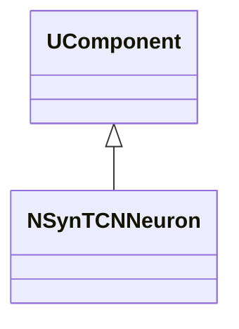
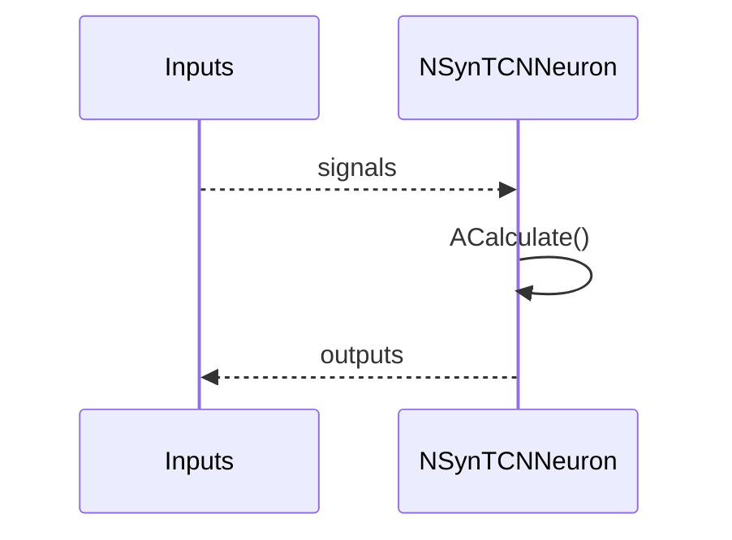
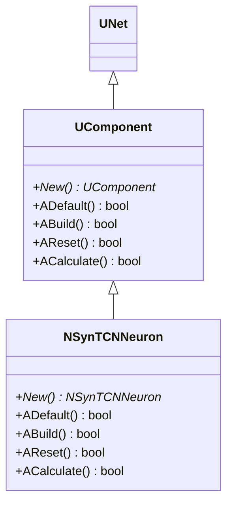
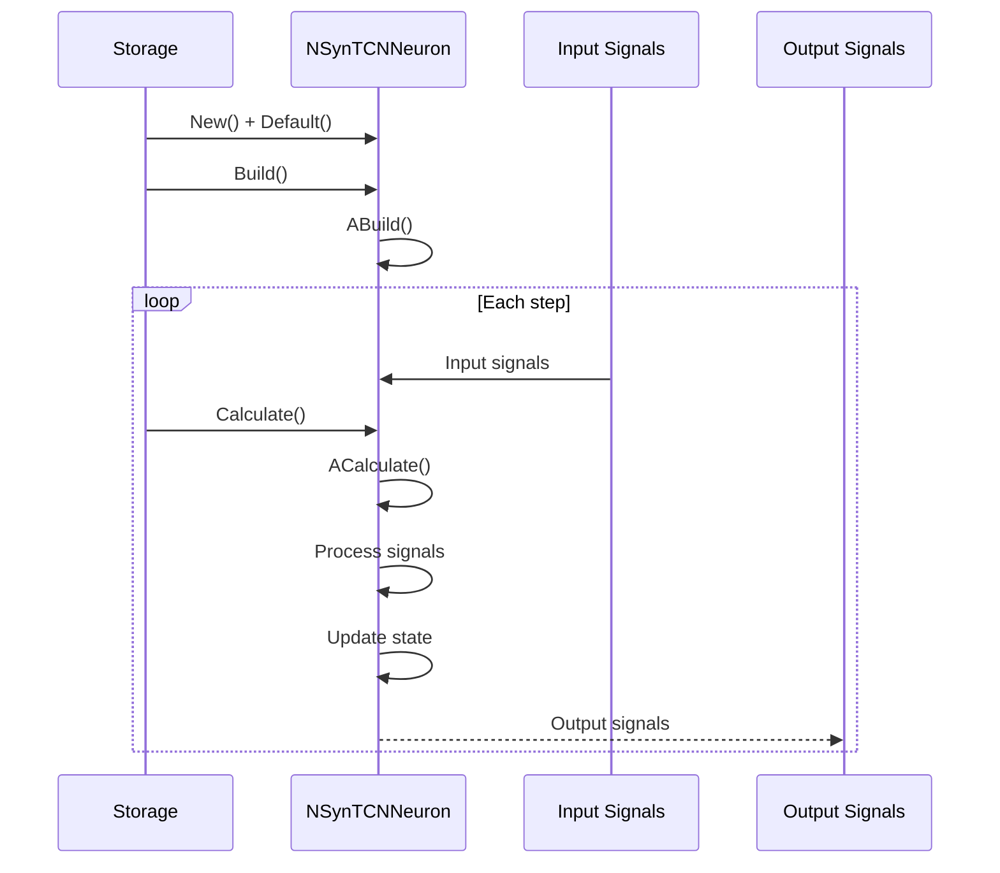
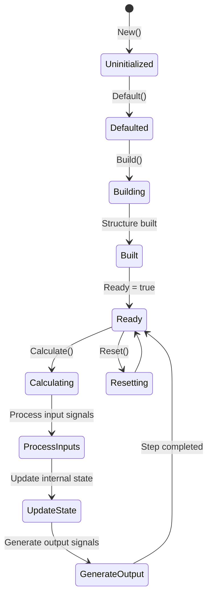
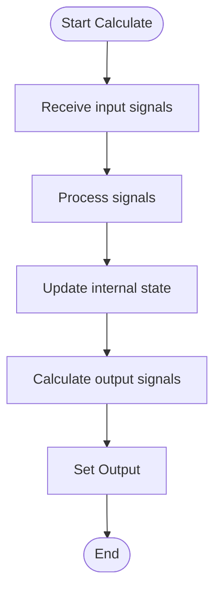
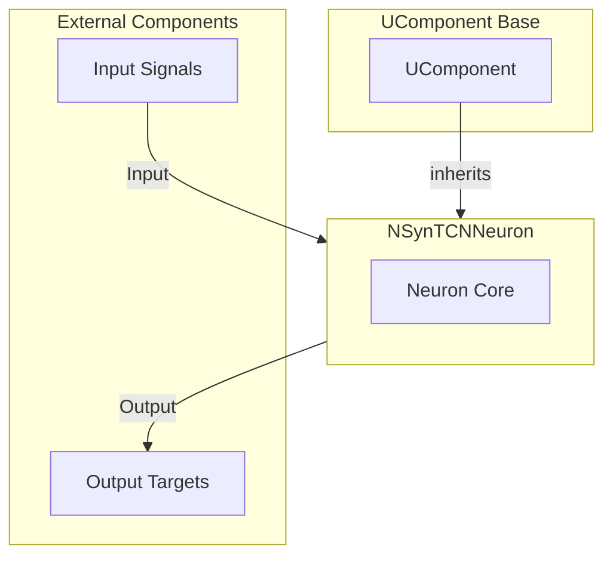

## RU

## NSynTCNNeuron — компонент PulseLib

**Класс**: `NSynTCNNeuron` — компонент PulseLib (см. реализацию в `NPulseLibrary.cpp`).
**Аббревиатуры**: `Syn` — **Syn**apse (синапс); `TCN` — **T**emporal **C**onvolutional **N**etwork (временная сверточная сеть).
**Регистрация**: `NPulseLibrary.cpp` → `UploadClass("NSynTCNNeuron", ...)`.
**Storage**: `ClassName = "NSynTCNNeuron"` в `ClDesc`/`Configs`.

### Lifecycle
- **ADefault**: установка параметров по умолчанию.
- **ABuild**: подключение входов/выходов, подготовка внутренних структур.
- **AReset**: сброс внутренних состояний/счётчиков.
- **ACalculate**: выполнение шага расчёта (интеграция/передача/обновление).

### I/O (UProperty)
- **Входы**: сигналы/токи/спайки или данные (зависят от роли компонента).
- **Выходы**: потенциалы/спайки/активности или преобразованные данные.



Пояснение: диаграмма классов показывает место компонента в иерархии и ключевые связи.



Пояснение: диаграмма последовательности показывает типовой сценарий взаимодействия и порядок вызовов.


Пояснение: блок-схема показывает поток данных/сигналов (входы → компонент → выходы).

### Config snippet
```ini
[Component]
ClassName = NSynTCNNeuron
Name = NSynTCNNeuron1
```

## Источники

См. [Literature-References.md](../Literature-References.md): **[A]**, **25**, **29**.

---

## EN

## NSynTCNNeuron — component PulseLib (EN)

**Class**: `NSynTCNNeuron` — PulseLib component (see implementation in `NPulseLibrary.cpp`).

- **Registration**: `UploadClass("NSynTCNNeuron", ...)` in `NPulseLibrary.cpp`.
- **Storage**: `ClassName = "NSynTCNNeuron"` in configs.

### Lifecycle
- **ADefault**: set default parameters.
- **ABuild**: wire inputs/outputs and internal state.
- **AReset**: reset internal state/counters.
- **ACalculate**: perform one calculation step.

### I/O (UProperty)
- **Inputs**: signals/currents/spikes or data (depends on role).
- **Outputs**: potentials/spikes/activities or transformed data.



### UML Sequence Diagram



### UML State Diagram



### UML Activity Diagram



### UML Component Diagram



### Properties

`NSynTCNNeuron` uses properties from base class `UComponent`:

**Inherited properties:**
- Standard component properties from `UComponent`

### Methods

`NSynTCNNeuron` uses all methods of base class `UComponent`:
- `ADefault()` → `bool` — set default parameters
- `ABuild()` → `bool` — build component structure
- `AReset()` → `bool` — reset component state
- `ACalculate()` → `bool` — perform calculation step

### Usage in configurations

`NSynTCNNeuron` is used in TCN (Thalamocortical Network) neuron experiments:

- **TCN networks**: `Bin/Configs/*/Model_*.xml` (where TCN neurons are required)
- **Thalamocortical modeling**: Experiments with thalamocortical network neurons

**Typical parameter values:**
- Standard default parameters from `UComponent`

**Features:**
- TCN neuron: Specialized neuron for thalamocortical networks
- Signal processing: Processes input signals and generates output signals
- Network integration: Integrates with TCN network structures

### References

See [Literature-References.md](../Literature-References.md): **[A]**, **25**, **29**.
