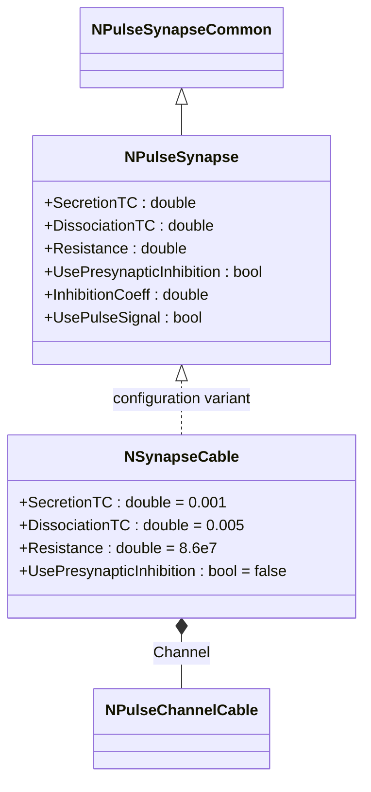
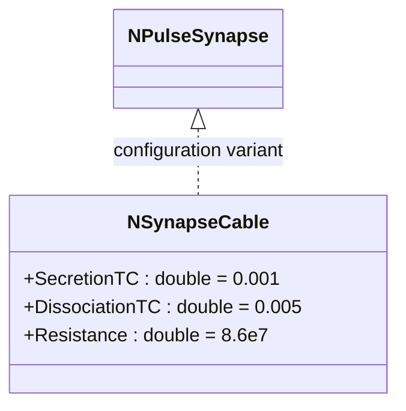
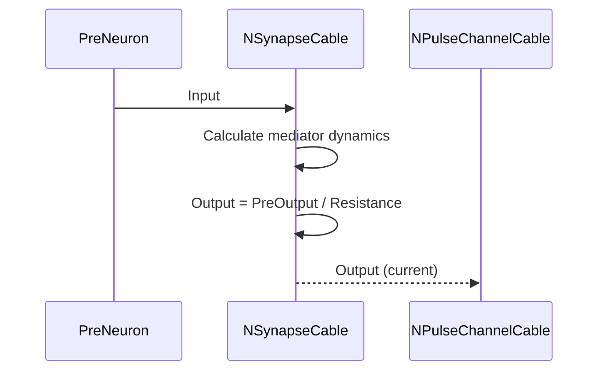
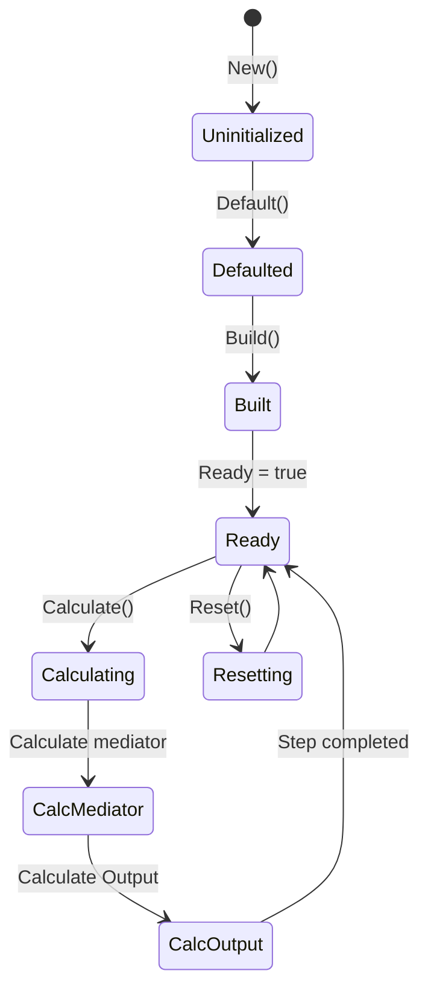
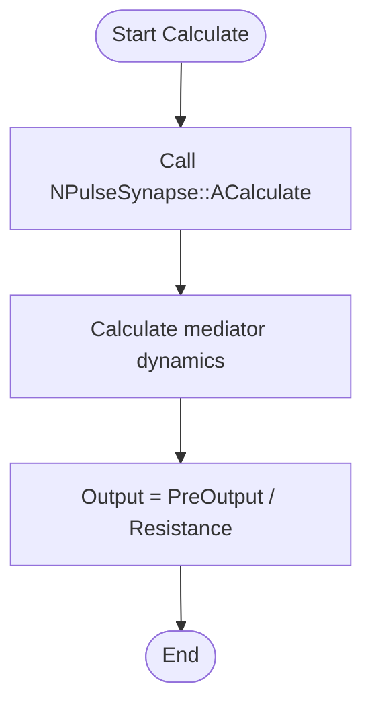
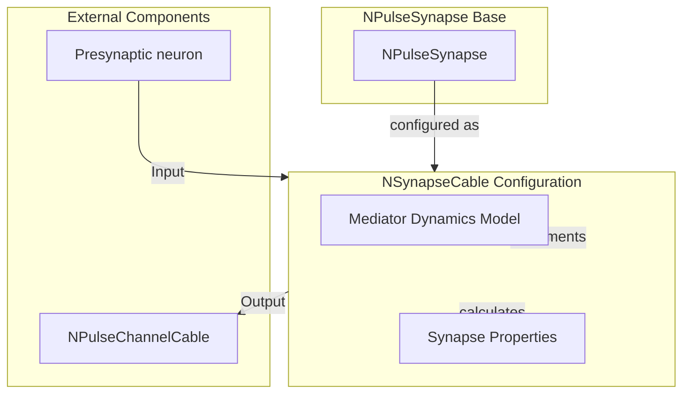

# NSynapseCable — кабельный импульсный синапс

## RU

### Назначение

**Класс**: `NSynapseCable` — конфигурационный вариант импульсного синапса для кабельных моделей.  
**Регистрация**: `NPulseLibrary.cpp` → `UploadClass("NSynapseCable", ...)`.  
**Storage-инстансы**: `ClassName = "NSynapseCable"` в `Bin/Configs/*/Model_*.xml`.

`NSynapseCable` является конфигурационным вариантом базового класса `NPulseSynapse` с предустановленными параметрами для кабельных моделей. Создается из `NPulseSynapse` с настройками:
- `SecretionTC = 0.001` (1 мс) — постоянная времени выделения медиатора
- `DissociationTC = 0.005` (5 мс) — постоянная времени распада медиатора
- `UsePresynapticInhibition = false` — без пресинаптического торможения
- `Resistance = 86000000` (86 МОм) — сопротивление синапса

Эти параметры оптимизированы для работы с кабельными моделями нейронов.

**Использование:** Моделирование синаптической передачи в кабельных моделях, эксперименты с дендритными структурами

### UML-диаграмма классов



**Иерархия наследования:**
- `NPulseSynapseCommon` — общий импульсный синапс
- `NPulseSynapse` — импульсный синапс с моделью медиатора
- `NSynapseCable` — конфигурационный вариант для кабельных моделей

**Параметры конфигурации:**
- `SecretionTC = 0.001` (1 мс) — постоянная времени выделения медиатора
- `DissociationTC = 0.005` (5 мс) — постоянная времени распада медиатора
- `Resistance = 86000000` (86 МОм) — сопротивление синапса
- `UsePresynapticInhibition = false` — без пресинаптического торможения

### Свойства

`NSynapseCable` использует все свойства базового класса `NPulseSynapse` с параметрами:
- `SecretionTC = 0.001` (1 мс)
- `DissociationTC = 0.005` (5 мс)
- `Resistance = 86000000` (86 МОм)
- `UsePresynapticInhibition = false`

### Методы

`NSynapseCable` использует все методы базового класса `NPulseSynapse`.

### Примеры использования

#### Пример 1: Создание кабельного синапса в коде C++

```cpp
// Создание кабельного синапса
auto synapse = storage->CreateComponent("NSynapseCable");
synapse->SetName("CableSynapse");

// Инициализация (использует параметры для кабельных моделей)
synapse->Default();

// Использование
synapse->Build();
```

### См. также

- [`NPulseSynapse`](NPulseSynapse.md) — импульсный синапс с моделью медиатора (базовый класс)
- [`NSynapseCableMulti`](NSynapseCableMulti.md) — кабельный импульсный синапс (мульти-вариант)
- [`NPulseChannelCable`](NPulseChannelCable.md) — кабельный импульсный канал
- [`NPulseMembraneCable`](NPulseMembraneCable.md) — кабельная импульсная мембрана
- [Architecture.md](../Architecture.md) — архитектура библиотеки

---

## EN

### Purpose

**Class**: `NSynapseCable` — configuration variant of spiking synapse for cable models.  
**Registration**: `NPulseLibrary.cpp` → `UploadClass("NSynapseCable", ...)`.  
**Instances**: `ClassName = "NSynapseCable"` in `Bin/Configs/*/Model_*.xml`.

`NSynapseCable` is a configuration variant of the base class `NPulseSynapse` with preset parameters for cable models. Created from `NPulseSynapse` with settings:
- `SecretionTC = 0.001` (1 ms) — neurotransmitter secretion time constant
- `DissociationTC = 0.005` (5 ms) — neurotransmitter dissociation time constant
- `UsePresynapticInhibition = false` — without presynaptic inhibition
- `Resistance = 86000000` (86 MΩ) — synapse resistance

These parameters are optimized for work with cable model neurons.

**Usage:** Modeling synaptic transmission in cable models, experiments with dendritic structures

### UML Class Diagram



### UML Sequence Diagram



### UML State Diagram



### UML Activity Diagram



### UML Component Diagram



### Usage in configurations

`NSynapseCable` is used in cable model experiments:

- Synaptic transmission modeling in cable models
- Experiments with dendritic structures
- Cable neuron networks

**Typical parameter values:**
- **SecretionTC**: 0.001 (1 ms) — neurotransmitter secretion time constant
- **DissociationTC**: 0.005 (5 ms) — neurotransmitter dissociation time constant
- **Resistance**: 8.6e7 (86 MΩ) — synapse resistance
- **UsePresynapticInhibition**: false — without presynaptic inhibition

**Features:**
- Optimized parameters for cable model neurons
- Uses mediator dynamics model from base class
- Compatible with `NPulseChannelCable` and `NPulseMembraneCable`

### See Also

- [`NPulseSynapse`](NPulseSynapse.md) — spiking synapse with neurotransmitter model (base class)
- [`NSynapseCableMulti`](NSynapseCableMulti.md) — cable spiking synapse (multi variant)
- [`NPulseChannelCable`](NPulseChannelCable.md) — cable spiking channel
- [`NPulseMembraneCable`](NPulseMembraneCable.md) — cable spiking membrane
- [Architecture.md](../Architecture.md) — library architecture
