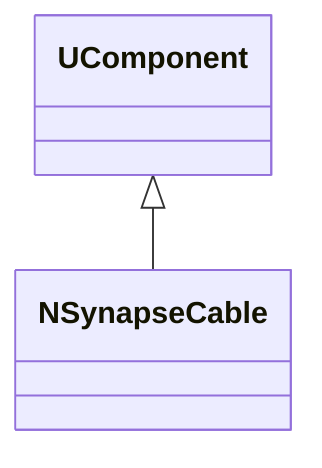
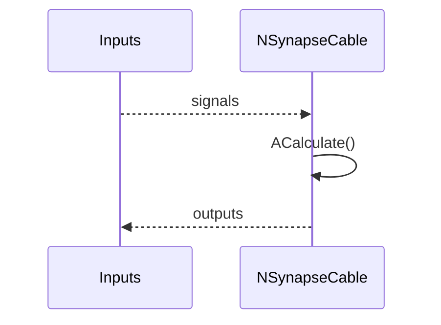
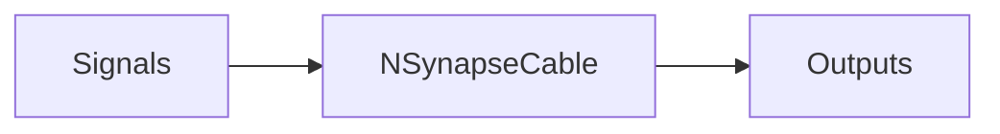
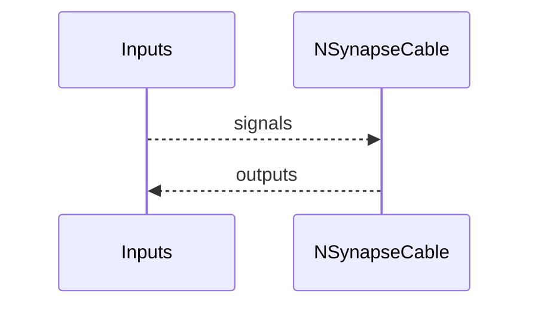

## NSynapseCable — компонент PulseLib

**Класс**: `NSynapseCable` — компонент PulseLib (см. реализацию в `NPulseLibrary.cpp`).  
**Регистрация**: `NPulseLibrary.cpp` → `UploadClass("NSynapseCable", ...)`.  
**Storage**: `ClassName = "NSynapseCable"` в `ClDesc`/`Configs`.

### Lifecycle
- **ADefault**: установка параметров по умолчанию.
- **ABuild**: подключение входов/выходов, подготовка внутренних структур.
- **AReset**: сброс внутренних состояний/счётчиков.
- **ACalculate**: выполнение шага расчёта (интеграция/передача/обновление).

### I/O (UProperty)
- **Входы**: сигналы/токи/спайки или данные (зависят от роли компонента).
- **Выходы**: потенциалы/спайки/активности или преобразованные данные.



Пояснение: диаграмма классов показывает место компонента в иерархии и ключевые связи.



Пояснение: диаграмма последовательности показывает типовой сценарий взаимодействия и порядок вызовов.



Пояснение: блок-схема показывает поток данных/сигналов (входы → компонент → выходы).

### Config snippet
```ini
[Component]
ClassName = NSynapseCable
Name = NSynapseCable1
```

---

## NSynapseCable — component PulseLib (EN)

**Class**: `NSynapseCable` — PulseLib component (see implementation in `NPulseLibrary.cpp`).

- **Registration**: `UploadClass("NSynapseCable", ...)` in `NPulseLibrary.cpp`.  
- **Storage**: `ClassName = "NSynapseCable"` in configs.

### Lifecycle
- **ADefault**: set default parameters.
- **ABuild**: wire inputs/outputs and internal state.
- **AReset**: reset internal state/counters.
- **ACalculate**: perform one calculation step.

### I/O (UProperty)
- **Inputs**: signals/currents/spikes or data (depends on role).
- **Outputs**: potentials/spikes/activities or transformed data.


Пояснение: диаграмма классов показывает место компонента в иерархии и ключевые связи.



Пояснение: диаграмма последовательности показывает типовой сценарий взаимодействия и порядок вызовов.


Пояснение: блок-схема показывает поток данных/сигналов (входы → компонент → выходы).
