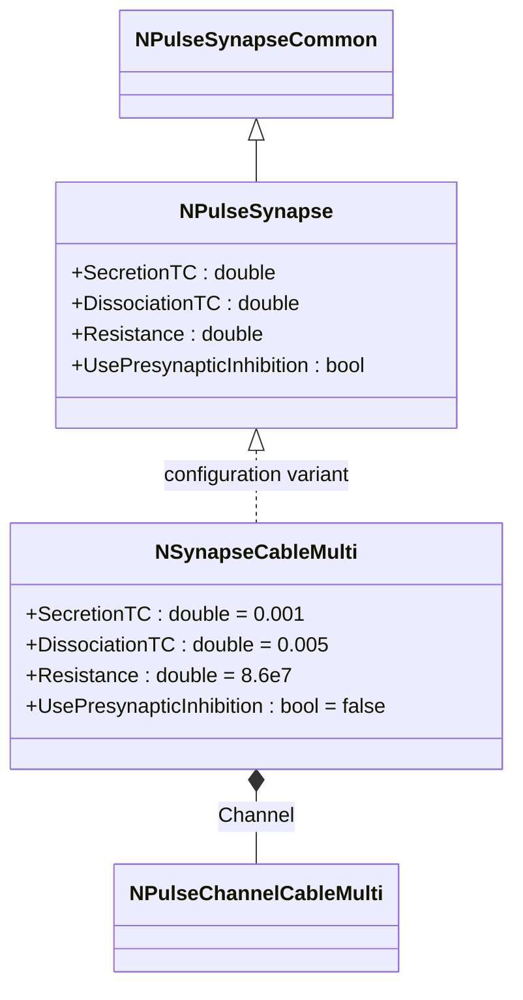
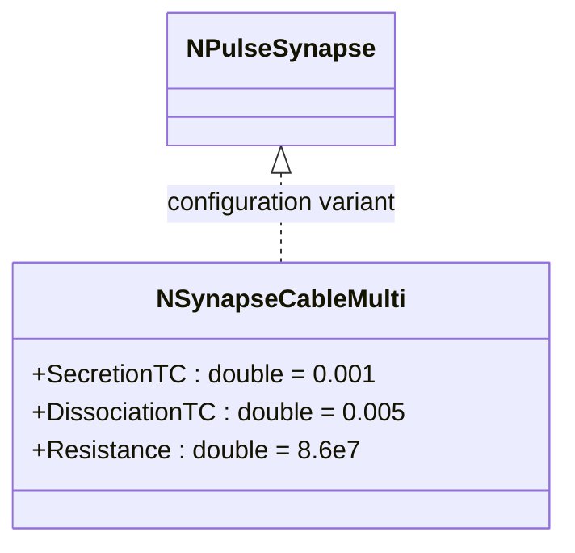
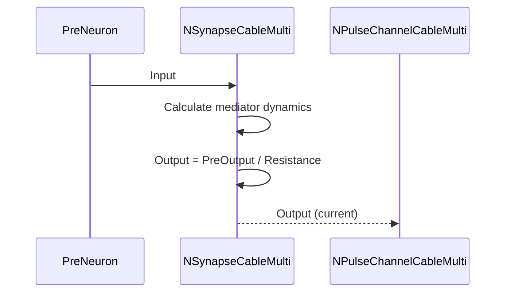
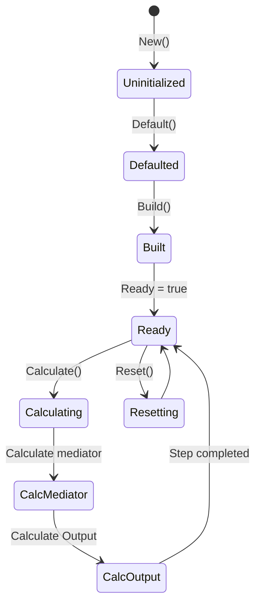
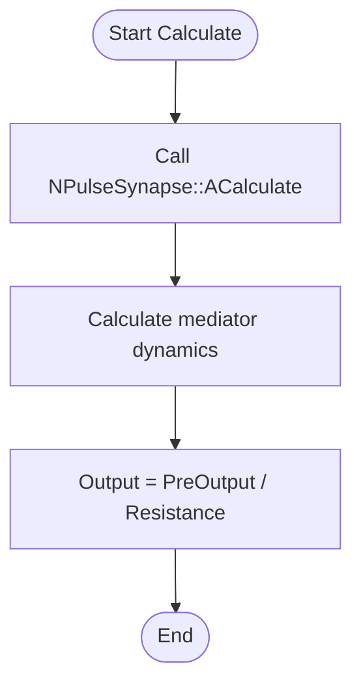
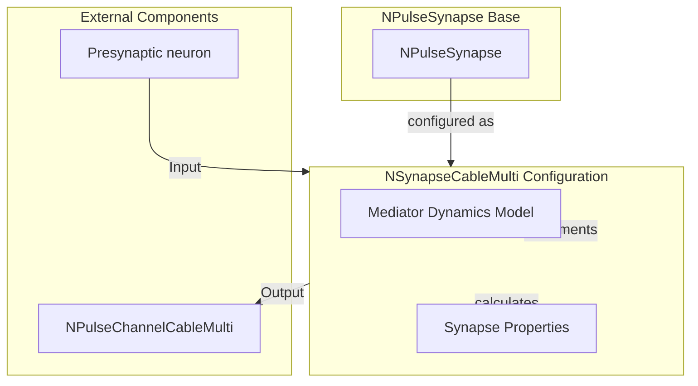

# NSynapseCableMulti — кабельный импульсный синапс (мульти-вариант)

## RU

### Назначение

**Класс**: `NSynapseCableMulti` — конфигурационный вариант импульсного синапса для мульти-кабельных моделей.  
**Регистрация**: `NPulseLibrary.cpp` → `UploadClass("NSynapseCableMulti", ...)`.  
**Storage-инстансы**: `ClassName = "NSynapseCableMulti"` в `Bin/Configs/*/Model_*.xml`.

`NSynapseCableMulti` является конфигурационным вариантом базового класса `NPulseSynapse` с предустановленными параметрами для мульти-кабельных моделей. Создается из `NPulseSynapse` с теми же параметрами, что и `NSynapseCable`, но используется в контексте мульти-кабельных мембран (`NPulseMembraneCableMulti`).

**Использование:** Моделирование синаптической передачи в мульти-кабельных моделях, эксперименты с сложными дендритными структурами

### UML-диаграмма классов



**Иерархия наследования:**
- `NPulseSynapseCommon` — общий импульсный синапс
- `NPulseSynapse` — импульсный синапс с моделью медиатора
- `NSynapseCableMulti` — конфигурационный вариант для мульти-кабельных моделей

**Параметры конфигурации:**
- `SecretionTC = 0.001` (1 мс) — постоянная времени выделения медиатора
- `DissociationTC = 0.005` (5 мс) — постоянная времени распада медиатора
- `Resistance = 86000000` (86 МОм) — сопротивление синапса
- `UsePresynapticInhibition = false` — без пресинаптического торможения

### Свойства

`NSynapseCableMulti` использует все свойства базового класса `NPulseSynapse` с параметрами:
- `SecretionTC = 0.001` (1 мс)
- `DissociationTC = 0.005` (5 мс)
- `Resistance = 86000000` (86 МОм)
- `UsePresynapticInhibition = false`

### Методы

`NSynapseCableMulti` использует все методы базового класса `NPulseSynapse`.

### Примеры использования

#### Пример 1: Создание мульти-кабельного синапса в коде C++

```cpp
// Создание мульти-кабельного синапса
auto synapse = storage->CreateComponent("NSynapseCableMulti");
synapse->SetName("CableMultiSynapse");

// Инициализация (использует параметры для мульти-кабельных моделей)
synapse->Default();

// Использование
synapse->Build();
```

### См. также

- [`NPulseSynapse`](NPulseSynapse.md) — импульсный синапс с моделью медиатора (базовый класс)
- [`NSynapseCable`](NSynapseCable.md) — кабельный импульсный синапс
- [`NPulseChannelCableMulti`](NPulseChannelCableMulti.md) — мульти-кабельный импульсный канал
- [`NPulseMembraneCableMulti`](NPulseMembraneCableMulti.md) — мульти-кабельная импульсная мембрана
- [Architecture.md](../Architecture.md) — архитектура библиотеки

---

## EN

### Purpose

**Class**: `NSynapseCableMulti` — configuration variant of spiking synapse for multi-cable models.  
**Registration**: `NPulseLibrary.cpp` → `UploadClass("NSynapseCableMulti", ...)`.  
**Instances**: `ClassName = "NSynapseCableMulti"` in `Bin/Configs/*/Model_*.xml`.

`NSynapseCableMulti` is a configuration variant of the base class `NPulseSynapse` with preset parameters for multi-cable models. Created from `NPulseSynapse` with the same parameters as `NSynapseCable`, but used in the context of multi-cable membranes (`NPulseMembraneCableMulti`).

**Usage:** Modeling synaptic transmission in multi-cable models, experiments with complex dendritic structures

### UML Class Diagram



### UML Sequence Diagram



### UML State Diagram



### UML Activity Diagram



### UML Component Diagram



### Usage in configurations

`NSynapseCableMulti` is used in multi-cable model experiments:

- Synaptic transmission modeling in multi-cable models
- Experiments with complex dendritic structures
- Multi-cable neuron networks

**Typical parameter values:**
- **SecretionTC**: 0.001 (1 ms) — neurotransmitter secretion time constant
- **DissociationTC**: 0.005 (5 ms) — neurotransmitter dissociation time constant
- **Resistance**: 8.6e7 (86 MΩ) — synapse resistance
- **UsePresynapticInhibition**: false — without presynaptic inhibition

**Features:**
- Same parameters as `NSynapseCable`, but used in multi-cable context
- Compatible with `NPulseChannelCableMulti` and `NPulseMembraneCableMulti`
- Optimized for multi-channel cable models

### See Also

- [`NPulseSynapse`](NPulseSynapse.md) — spiking synapse with neurotransmitter model (base class)
- [`NSynapseCable`](NSynapseCable.md) — cable spiking synapse
- [`NPulseChannelCableMulti`](NPulseChannelCableMulti.md) — multi-cable spiking channel
- [`NPulseMembraneCableMulti`](NPulseMembraneCableMulti.md) — multi-cable spiking membrane
- [Architecture.md](../Architecture.md) — library architecture
