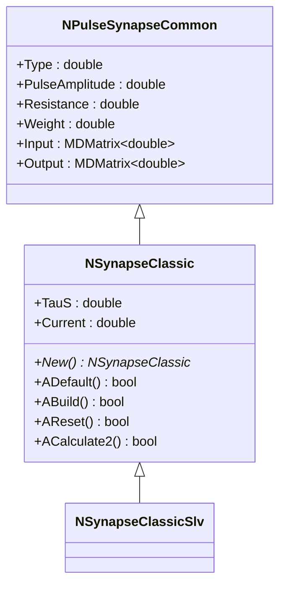
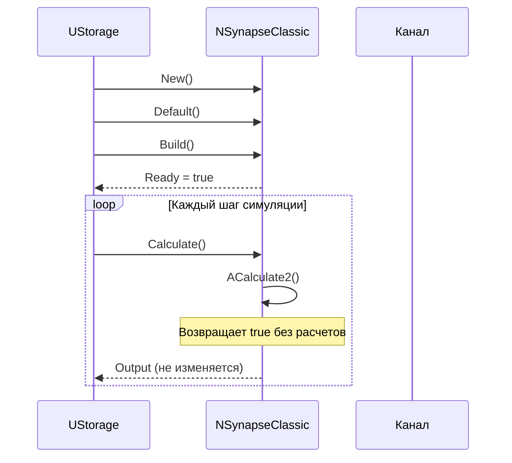
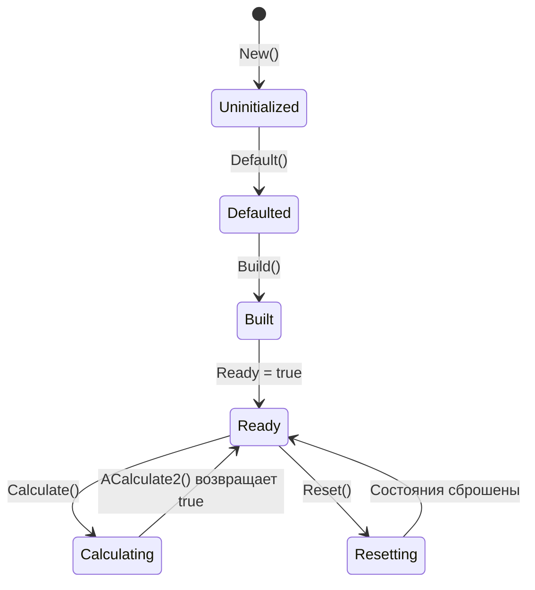
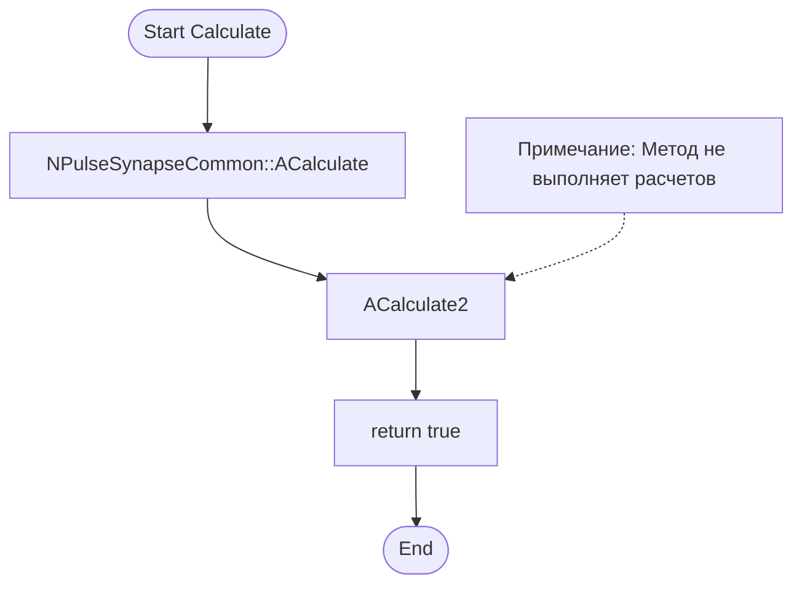
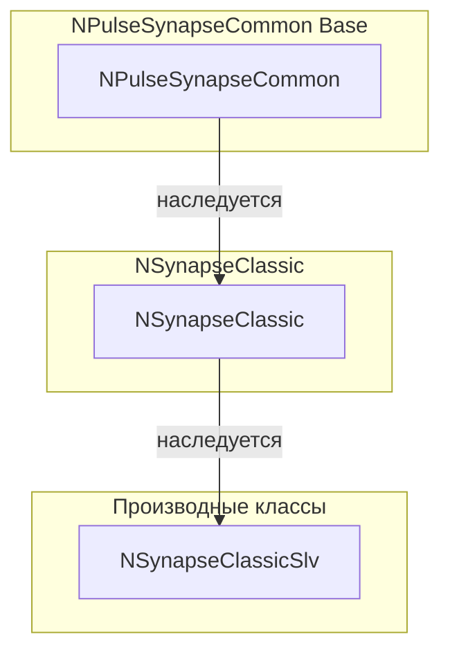
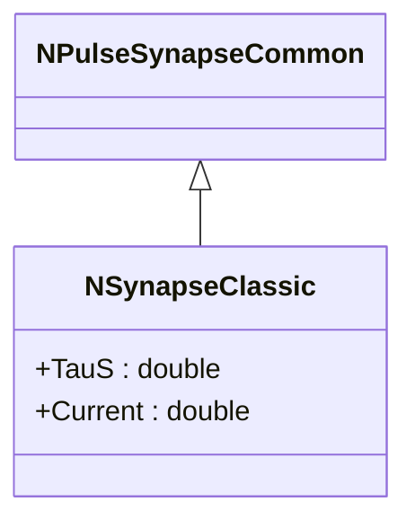
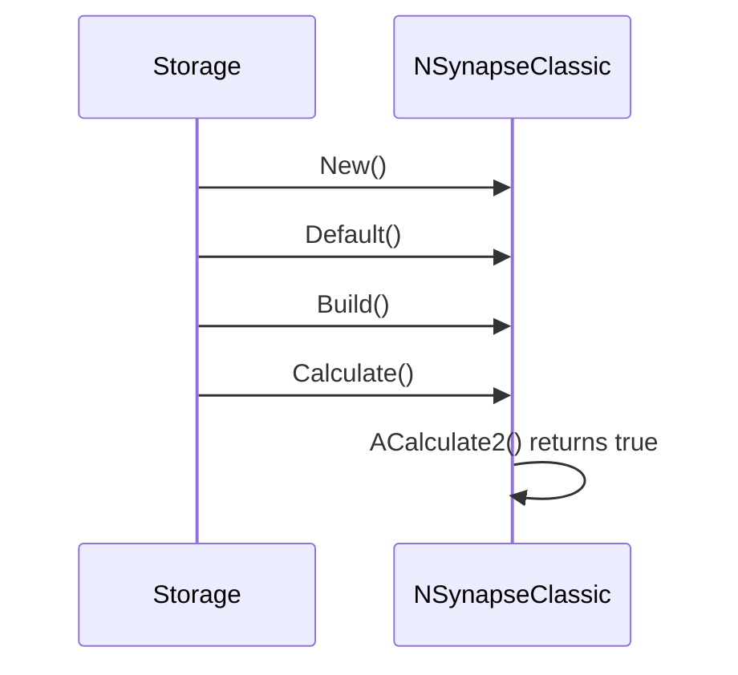
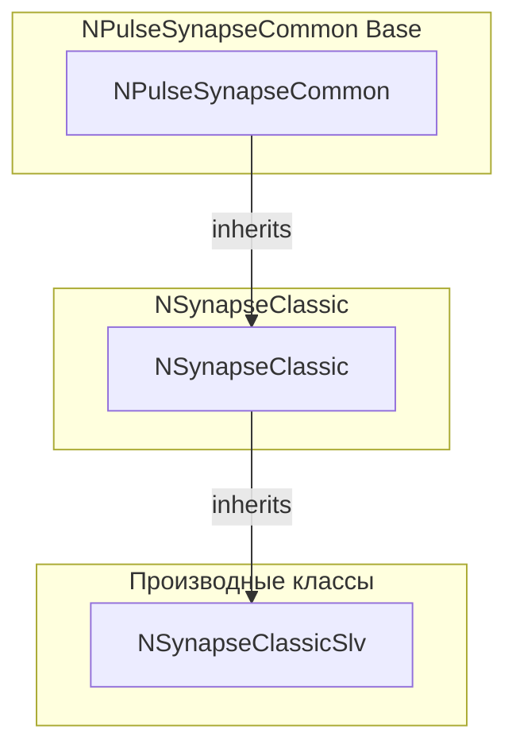

# NSynapseClassic — классический синапс

## RU

### Назначение

**Класс**: `NSynapseClassic` — базовый классический синапс с параметрами синаптической передачи.  
**Регистрация**: `NPulseLibrary.cpp` → `UploadClass("NSynapseClassic", ...)`.  
**Storage-инстансы**: `ClassName = "NSynapseClassic"` в `Bin/Configs/*/Model_*.xml`.

`NSynapseClassic` реализует базовый классический синапс с параметрами синаптической передачи (`TauS` — постоянная времени синапса, `Current` — ток синапса). Является базовым классом для других типов классических синапсов. Метод `ACalculate2()` возвращает `true` без выполнения расчетов, что делает его подходящим для использования как заглушки или базового класса для наследования.

**Использование:** Базовый класс для классических синапсов, заглушка для синапсов без динамики

### UML-диаграмма классов



**Иерархия наследования:**
- `NPulseSynapseCommon` — общий импульсный синапс
- `NSynapseClassic` — базовый классический синапс
- `NSynapseClassicSlv` — классический синапс с буфером спайков

**Ключевые свойства:**
- Параметры синапса: `TauS` (постоянная времени), `Current` (ток)

### UML-диаграмма последовательности



**Жизненный цикл:**
1. **Инициализация**: Установка параметров по умолчанию (`TauS=1e-3`, `Current=376e-12`)
2. **Сборка**: Вызов `NPulseSynapseCommon::ABuild()`
3. **Расчет**: Метод `ACalculate2()` возвращает `true` без выполнения расчетов
4. **Сброс**: Вызов `NPulseSynapseCommon::AReset()`

### UML-диаграмма состояний



### UML-диаграмма активности



**Алгоритм расчета:**
Метод `ACalculate2()` не выполняет расчетов и просто возвращает `true`. Это делает класс подходящим для использования как базового класса или заглушки.

### UML-диаграмма компонентов



### Свойства

#### Параметры (ptPubParameter)

- **`TauS`** (double) — постоянная времени синапса (в секундах). Определяет временную характеристику синаптической передачи. Значение по умолчанию: 1e-3 (1 мс)

- **`Current`** (double) — ток синапса (в амперах). Определяет амплитуду синаптического тока. Значение по умолчанию: 376e-12 (376 пА)

**Наследуемые параметры от NPulseSynapseCommon:**
- `Type` (double) — тип синапса (<0 — тормозной, >0 — возбуждающий)
- `PulseAmplitude` (double) — амплитуда импульса
- `Resistance` (double) — сопротивление синапса
- `Weight` (double) — вес синапса
- `TrainerClassName` (string) — имя класса тренера синапса

#### Входные свойства (ptInput | ptPubState)

**Наследуемые от NPulseSynapseCommon:**
- **`Input`** (MDMatrix<double>) — входной сигнал от пресинаптического нейрона
- **`WeightInput`** (MDMatrix<double>) — входной сигнал для динамического изменения веса

#### Выходные свойства (ptOutput | ptPubState)

**Наследуемые от NPulseSynapseCommon:**
- **`Output`** (MDMatrix<double>) — выходной ток синапса. Не изменяется методом `ACalculate2()`.

- **`OutInCopy`** (MDMatrix<double>) — копия входного сигнала на выходе

#### Состояния (ptPubState)

**Наследуемые от NPulseSynapseCommon:**
- **`PreOutput`** (double) — концентрация медиатора в синаптической щели
- **`InputPulseSignal`** (bool) — флаг наличия импульсного входного сигнала

### Методы

#### Публичные методы

- **`New()`** → `NSynapseClassic*` — создает новый экземпляр класса.

#### Защищенные методы жизненного цикла

- **`ADefault()`** → `bool` — инициализирует параметры по умолчанию. Устанавливает `TauS=1e-3`, `Current=376e-12`, вызывает `NPulseSynapseCommon::ADefault()`.

- **`ABuild()`** → `bool` — строит структуру синапса. Вызывает `NPulseSynapseCommon::ABuild()`.

- **`AReset()`** → `bool` — сбрасывает состояния синапса. Вызывает `NPulseSynapseCommon::AReset()`.

- **`ACalculate2()`** → `bool` — выполняет расчет синапса на одном шаге. Не выполняет расчетов, просто возвращает `true`. Предназначен для переопределения в производных классах.

### Примеры использования

#### Пример 1: Создание синапса в коде C++

```cpp
// Создание классического синапса
auto synapse = storage->CreateComponent<NSynapseClassic>();
synapse->SetName("ClassicSynapse");

// Инициализация
synapse->Default();

// Настройка параметров
synapse->TauS = 0.001;        // Постоянная времени (1 мс)
synapse->Current = 376e-12;  // Ток синапса (376 пА)
synapse->Type = 1.0;          // Возбуждающий синапс
synapse->Weight = 1.0;        // Вес синапса

// Сборка
synapse->Build();

// Использование
for (int step = 0; step < 1000; step++) {
    synapse->Calculate();
    // Output не изменяется методом ACalculate2()
}
```

#### Пример 2: Конфигурация XML

```xml
<Synapse1 Class="NSynapseClassic">
    <Parameters>
        <Type>1</Type>
        <PulseAmplitude>1.0</PulseAmplitude>
        <Resistance>1.0e9</Resistance>
        <Weight>1.0</Weight>
        <TauS>0.001</TauS>
        <Current>3.76e-10</Current>
    </Parameters>
</Synapse1>
```

### Использование в конфигурациях

`NSynapseClassic` используется как базовый класс для классических синапсов:

- Базовый класс для наследования
- Заглушка для синапсов без динамики
- Хранение параметров синаптической передачи

**Особенности:**
- Метод `ACalculate2()` не выполняет расчетов
- Подходит для использования как базового класса
- Параметры `TauS` и `Current` могут использоваться производными классами

## Источники

См. [Literature-References.md](../Literature-References.md): **[A]**, **4**, **25**, **29**.

### См. также

- [`NPulseSynapseCommon`](NPulseSynapseCommon.md) — общий импульсный синапс
- [`NSynapseClassicSlv`](NSynapseClassicSlv.md) — классический синапс с буфером спайков
- [`NSynapseIaF`](NSynapseIaF.md) — синапс для IaF модели
- [`NPulseSynapse`](NPulseSynapse.md) — импульсный синапс с моделью медиатора
- [Architecture.md](../Architecture.md) — архитектура библиотеки
- [Scientific-Background.md](../Scientific-Background.md) — научный фон (синаптическая передача)

---

## EN

### Purpose

**Class**: `NSynapseClassic` — base classic synapse with synaptic transmission parameters.  
**Registration**: `NPulseLibrary.cpp` → `UploadClass("NSynapseClassic", ...)`.  
**Instances**: `ClassName = "NSynapseClassic"` in `Bin/Configs/*/Model_*.xml`.

`NSynapseClassic` implements a base classic synapse with synaptic transmission parameters (`TauS` — synapse time constant, `Current` — synapse current). Serves as a base class for other types of classic synapses. The `ACalculate2()` method returns `true` without performing calculations, making it suitable for use as a stub or base class for inheritance.

**Usage:** Base class for classic synapses, stub for synapses without dynamics

### UML Class Diagram



### UML Sequence Diagram



### References

See [Literature-References.md](../Literature-References.md): **[A]**, **4**, **25**, **29**.

### See Also

- [`NPulseSynapseCommon`](NPulseSynapseCommon.md) — common spiking synapse
- [`NSynapseClassicSlv`](NSynapseClassicSlv.md) — classic synapse with spike buffer
- [`NSynapseIaF`](NSynapseIaF.md) — synapse for IaF model
- [`NPulseSynapse`](NPulseSynapse.md) — spiking synapse with neurotransmitter model
- [Architecture.md](../Architecture.md) — library architecture



