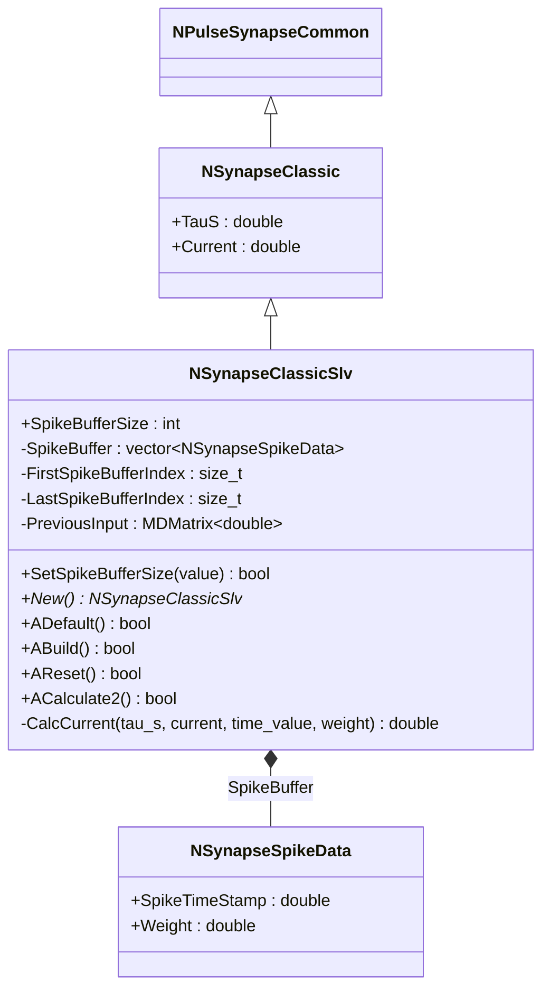
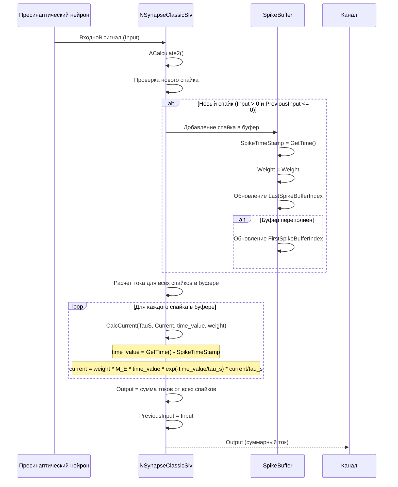
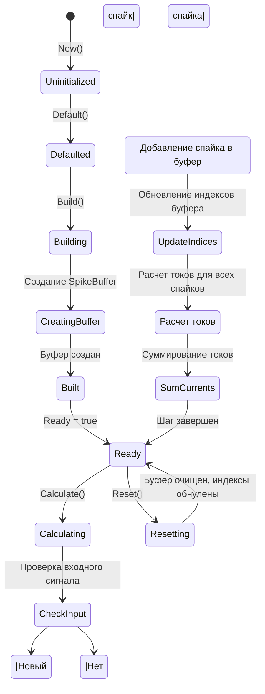
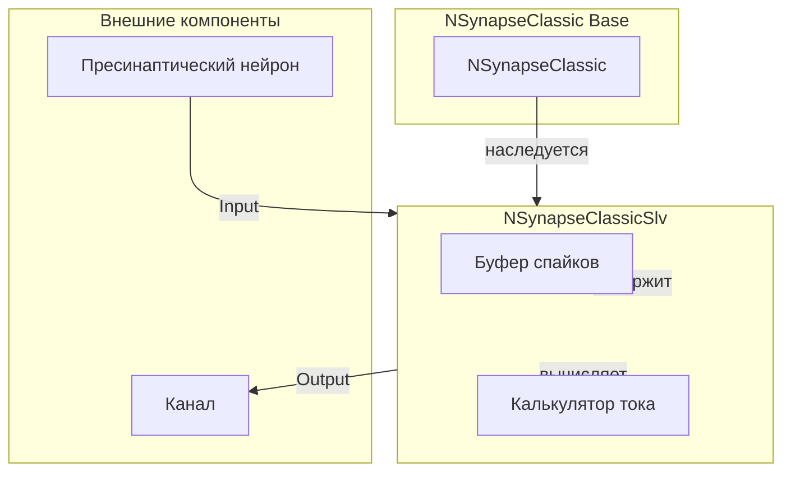
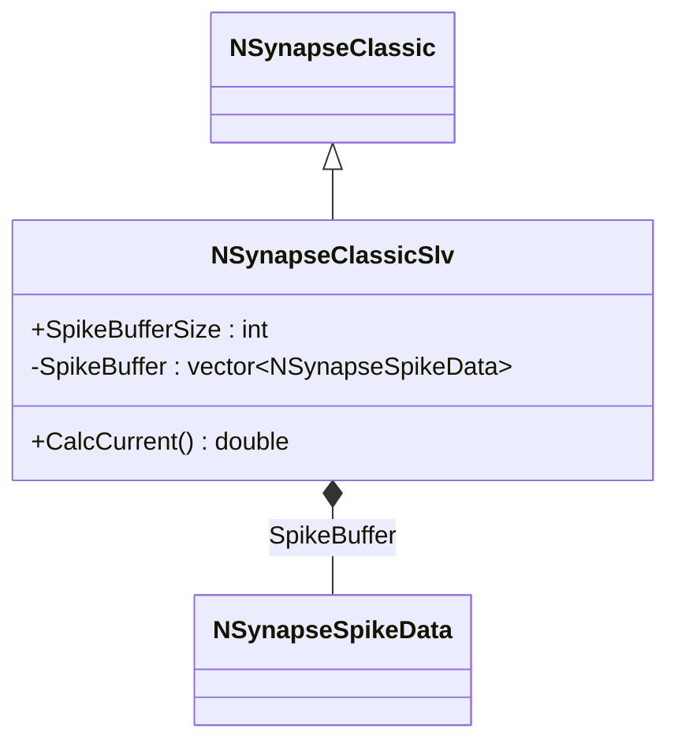
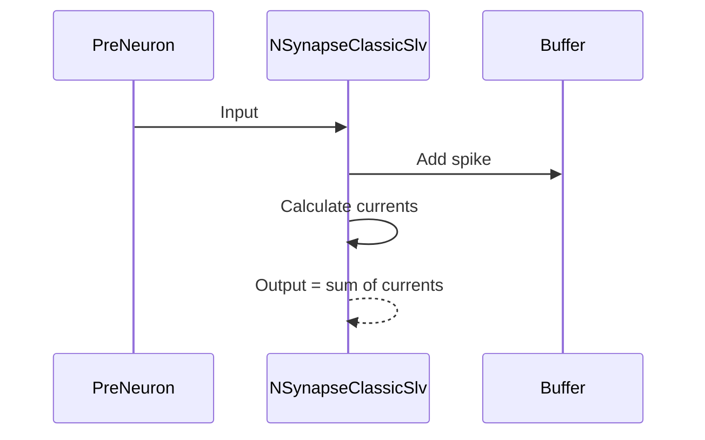
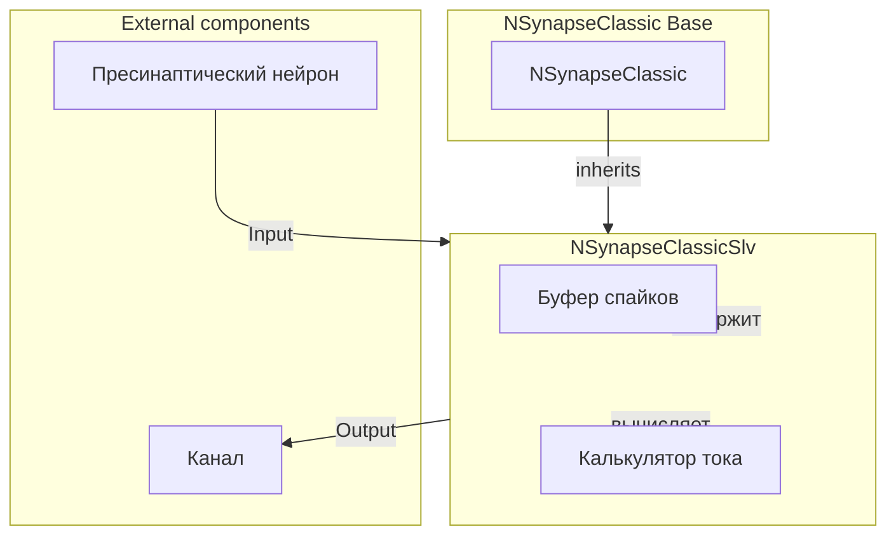

# NSynapseClassicSlv — классический синапс с буфером спайков

## RU

### Назначение

**Класс**: `NSynapseClassicSlv` — классический синапс с буфером спайков для отслеживания истории спайков и расчета тока на основе экспоненциальной функции времени.  
**Регистрация**: `NPulseLibrary.cpp` → `UploadClass("NSynapseClassicSlv", ...)`.  
**Storage-инстансы**: `ClassName = "NSynapseClassicSlv"` в `Bin/Configs/*/Model_*.xml`.

`NSynapseClassicSlv` реализует классический синапс с буфером спайков (`SpikeBuffer`), который отслеживает историю входящих спайков. Для каждого спайка в буфере рассчитывается ток синапса на основе экспоненциальной функции времени с учетом времени с момента прихода спайка. Выходной ток синапса представляет собой сумму токов от всех активных спайков в буфере.

**Использование:** Моделирование синаптической передачи с учетом истории спайков, временная динамика синаптического тока

### UML-диаграмма классов



**Иерархия наследования:**
- `NPulseSynapseCommon` — общий импульсный синапс
- `NSynapseClassic` — базовый классический синапс
- `NSynapseClassicSlv` — классический синапс с буфером спайков

**Ключевые свойства:**
- Буфер спайков: `SpikeBuffer` (вектор `NSynapseSpikeData`), `SpikeBufferSize` (размер буфера)
- Индексы буфера: `FirstSpikeBufferIndex`, `LastSpikeBufferIndex` (для циклического буфера)
- Предыдущий вход: `PreviousInput` (для определения начала спайка)

### UML-диаграмма последовательности



**Жизненный цикл:**
1. **Инициализация**: Установка параметров по умолчанию (`SpikeBufferSize=10`)
2. **Сборка**: Создание буфера спайков размером `SpikeBufferSize`
3. **Расчет**: Обновление буфера при новых спайках, расчет тока для всех спайков в буфере
4. **Сброс**: Очистка буфера, обнуление индексов

### UML-диаграмма состояний



### UML-диаграмма активности

```mermaid
flowchart TD
    Start([Start Calculate]) --> CheckInput{Input подключен?}
    CheckInput -->|Нет| SetOutputZero[Output = 0]
    CheckInput -->|Да| CheckNewSpike{Новый спайк?}
    SetOutputZero --> ResetIndices[FirstSpikeBufferIndex = LastSpikeBufferIndex = 0]
    ResetIndices --> End([End])
    CheckNewSpike -->|Input > 0 и PreviousInput <= 0| AddSpikeToBuffer[Добавление спайка в буфер]
    CheckNewSpike -->|Нет| CalcCurrents
    AddSpikeToBuffer --> UpdateLastIndex[LastSpikeBufferIndex++]
    UpdateLastIndex --> CheckOverflow{LastSpikeBufferIndex >= SpikeBuffer.size()?}
    CheckOverflow -->|Да| WrapLastIndex[LastSpikeBufferIndex = 0]
    CheckOverflow -->|Нет| CheckBufferFull{Буфер переполнен?}
    WrapLastIndex --> CheckBufferFull
    CheckBufferFull -->|Да| UpdateFirstIndex[FirstSpikeBufferIndex++]
    CheckBufferFull -->|Нет| SetSpikeData[SpikeBuffer[LastSpikeBufferIndex].SpikeTimeStamp = GetTime()]
    UpdateFirstIndex --> CheckFirstWrap{FirstSpikeBufferIndex >= SpikeBuffer.size()?}
    CheckFirstWrap -->|Да| WrapFirstIndex[FirstSpikeBufferIndex = 0]
    CheckFirstWrap -->|Нет| SetSpikeData
    WrapFirstIndex --> SetSpikeData
    SetSpikeData --> SetSpikeWeight[SpikeBuffer[LastSpikeBufferIndex].Weight = Weight]
    SetSpikeWeight --> UpdatePreviousInput[PreviousInput = Input]
    UpdatePreviousInput --> CalcCurrents[Расчет токов для всех спайков в буфере]
    CalcCurrents --> InitResult[result = 0]
    InitResult --> CheckBufferOrder{FirstSpikeBufferIndex < LastSpikeBufferIndex?}
    CheckBufferOrder -->|Да| LoopNormal[Цикл от FirstSpikeBufferIndex до LastSpikeBufferIndex]
    CheckBufferOrder -->|Нет| LoopWrapped[Цикл от FirstSpikeBufferIndex до конца + от начала до LastSpikeBufferIndex]
    LoopNormal --> CalcCurrentForSpike[CalcCurrent для каждого спайка]
    LoopWrapped --> CalcCurrentForSpike
    CalcCurrentForSpike --> AddToResult[result += CalcCurrent]
    AddToResult --> SetOutput[Output = result]
    SetOutput --> End
```

**Алгоритм расчета:**
1. Проверка подключения входного сигнала
2. Определение нового спайка (переход от `PreviousInput <= 0` к `Input > 0`)
3. Добавление спайка в циклический буфер с сохранением времени и веса
4. Расчет тока для каждого спайка в буфере: `CalcCurrent(tau_s, current, time_value, weight)`
5. Суммирование токов от всех спайков в буфере
6. Обновление `PreviousInput` для следующего шага

**Формула расчета тока:**
```
current(t) = weight * M_E * t * exp(-t/tau_s) * current/tau_s
```
где `t` — время с момента прихода спайка, `tau_s` — постоянная времени синапса, `current` — ток синапса, `weight` — вес спайка.

### UML-диаграмма компонентов



### Свойства

#### Параметры (ptPubParameter)

- **`SpikeBufferSize`** (int) — размер буфера спайков. Определяет максимальное количество спайков, которые могут храниться в буфере одновременно. Значение по умолчанию: 10

**Наследуемые параметры от NSynapseClassic:**
- `TauS` (double) — постоянная времени синапса (по умолчанию: 1e-3)
- `Current` (double) — ток синапса (по умолчанию: 376e-12)

**Наследуемые параметры от NPulseSynapseCommon:**
- `Type` (double) — тип синапса
- `PulseAmplitude` (double) — амплитуда импульса
- `Resistance` (double) — сопротивление синапса
- `Weight` (double) — вес синапса

#### Входные свойства (ptInput | ptPubState)

**Наследуемые от NPulseSynapseCommon:**
- **`Input`** (MDMatrix<double>) — входной сигнал от пресинаптического нейрона. Используется для определения новых спайков.

#### Выходные свойства (ptOutput | ptPubState)

**Наследуемые от NPulseSynapseCommon:**
- **`Output`** (MDMatrix<double>) — выходной ток синапса. Рассчитывается как сумма токов от всех спайков в буфере.

#### Состояния (ptPubState)

**Внутренние структуры:**
- **`SpikeBuffer`** (vector<NSynapseSpikeData>) — буфер спайков. Хранит историю входящих спайков с временными метками и весами.

- **`FirstSpikeBufferIndex`** (size_t) — индекс первого (самого старого) спайка в буфере. Используется для циклического буфера.

- **`LastSpikeBufferIndex`** (size_t) — индекс последнего (самого нового) спайка в буфере. Используется для циклического буфера.

- **`PreviousInput`** (MDMatrix<double>) — предыдущее значение входного сигнала. Используется для определения начала нового спайка.

**Структура NSynapseSpikeData:**
- `SpikeTimeStamp` (double) — временная метка спайка (в секундах)
- `Weight` (double) — вес спайка на момент прихода

### Методы

#### Публичные методы

- **`New()`** → `NSynapseClassicSlv*` — создает новый экземпляр класса.

#### Защищенные методы жизненного цикла

- **`ADefault()`** → `bool` — инициализирует параметры по умолчанию. Устанавливает `SpikeBufferSize=10`, вызывает `NSynapseClassic::ADefault()`.

- **`ABuild()`** → `bool` — строит структуру синапса. Создает буфер спайков размером `SpikeBufferSize`, вызывает `NSynapseClassic::ABuild()`.

- **`AReset()`** → `bool` — сбрасывает состояния синапса. Очищает буфер спайков, обнуляет индексы (`FirstSpikeBufferIndex=0`, `LastSpikeBufferIndex=0`), обнуляет `PreviousInput`, вызывает `NSynapseClassic::AReset()`.

- **`ACalculate2()`** → `bool` — выполняет расчет синапса на одном шаге. Обновляет буфер спайков при новых спайках, рассчитывает ток для всех спайков в буфере, суммирует токи.

#### Защищенные методы расчета

- **`CalcCurrent(double tau_s, double current, double time_value, double weight)`** → `double` — рассчитывает ток синапса для заданного времени с момента прихода спайка. Формула: `weight * M_E * time_value * exp(-time_value/tau_s) * current/tau_s` (если `time_value > 0`, иначе `0`).

#### Методы установки параметров

- **`SetSpikeBufferSize(const int &value)`** → `bool` — устанавливает размер буфера спайков. Устанавливает `Ready=false`.

### Примеры использования

#### Пример 1: Создание синапса в коде C++

```cpp
// Создание классического синапса с буфером спайков
auto synapse = storage->CreateComponent<NSynapseClassicSlv>();
synapse->SetName("ClassicSlvSynapse");

// Инициализация
synapse->Default();

// Настройка параметров
synapse->SpikeBufferSize = 20;      // Размер буфера спайков
synapse->TauS = 0.005;              // Постоянная времени (5 мс)
synapse->Current = 376e-12;         // Ток синапса (376 пА)
synapse->Type = 1.0;                 // Возбуждающий синапс
synapse->Weight = 1.0;               // Вес синапса

// Сборка
synapse->Build();

// Использование
for (int step = 0; step < 10000; step++) {
    synapse->Calculate();
    double output = synapse->Output(0, 0);
    if (step % 1000 == 0) {
        std::cout << "Step " << step << ": Output = " << output << std::endl;
    }
}
```

#### Пример 2: Конфигурация XML

```xml
<Synapse1 Class="NSynapseClassicSlv">
    <Parameters>
        <Type>1</Type>
        <PulseAmplitude>1.0</PulseAmplitude>
        <Resistance>1.0e9</Resistance>
        <Weight>1.0</Weight>
        <TauS>0.005</TauS>
        <Current>3.76e-10</Current>
        <SpikeBufferSize>20</SpikeBufferSize>
    </Parameters>
</Synapse1>
```

### Использование в конфигурациях

`NSynapseClassicSlv` используется в экспериментах с временной динамикой синаптической передачи:

- Моделирование синаптической передачи с учетом истории спайков
- Изучение временной динамики синаптического тока
- Эксперименты с различными параметрами буфера и постоянной времени

**Типичные значения параметров:**

1. **Быстрый синапс**: TauS=0.001, SpikeBufferSize=10
2. **Медленный синапс**: TauS=0.01, SpikeBufferSize=20
3. **Большой буфер**: SpikeBufferSize=50, TauS=0.005

**Особенности:**
- Использует циклический буфер для эффективного хранения истории спайков
- Рассчитывает ток на основе экспоненциальной функции времени
- Поддерживает суммирование токов от нескольких спайков

## Источники

См. [Literature-References.md](../Literature-References.md): **[A]**, **4**, **25**, **29**.

### См. также

- [`NSynapseClassic`](NSynapseClassic.md) — базовый классический синапс
- [`NPulseSynapseCommon`](NPulseSynapseCommon.md) — общий импульсный синапс
- [`NSynapseIaF`](NSynapseIaF.md) — синапс для IaF модели
- [`NPulseSynapse`](NPulseSynapse.md) — импульсный синапс с моделью медиатора
- [Architecture.md](../Architecture.md) — архитектура библиотеки
- [Scientific-Background.md](../Scientific-Background.md) — научный фон (синаптическая передача, временная динамика)

---

## EN

### Purpose

**Class**: `NSynapseClassicSlv` — classic synapse with spike buffer for tracking spike history and calculating current based on exponential time function.  
**Registration**: `NPulseLibrary.cpp` → `UploadClass("NSynapseClassicSlv", ...)`.  
**Instances**: `ClassName = "NSynapseClassicSlv"` in `Bin/Configs/*/Model_*.xml`.

`NSynapseClassicSlv` implements a classic synapse with a spike buffer (`SpikeBuffer`) that tracks incoming spike history. For each spike in the buffer, synapse current is calculated based on exponential time function considering time since spike arrival. Output synapse current is the sum of currents from all active spikes in the buffer.

**Usage:** Modeling synaptic transmission with spike history, temporal dynamics of synaptic current

### UML Class Diagram



### UML Sequence Diagram



### References

See [Literature-References.md](../Literature-References.md): **[A]**, **4**, **25**, **29**.

### See Also

- [`NSynapseClassic`](NSynapseClassic.md) — base classic synapse
- [`NPulseSynapseCommon`](NPulseSynapseCommon.md) — common spiking synapse
- [`NSynapseIaF`](NSynapseIaF.md) — synapse for IaF model
- [`NPulseSynapse`](NPulseSynapse.md) — spiking synapse with neurotransmitter model
- [Architecture.md](../Architecture.md) — library architecture


```mermaid
flowchart TD
    Start([Start Calculate]) --> CheckInput{Input подключен?}
    CheckInput -->|Нет| SetOutputZero[Output = 0]
    CheckInput -->|Да| CheckNewSpike{Новый спайк?}
    SetOutputZero --> ResetIndices[FirstSpikeBufferIndex = LastSpikeBufferIndex = 0]
    ResetIndices --> End([End])
    CheckNewSpike -->|Input > 0 и PreviousInput <= 0| AddSpikeToBuffer[Добавление спайка в буфер]
    CheckNewSpike -->|Нет| CalcCurrents
    AddSpikeToBuffer --> UpdateLastIndex[LastSpikeBufferIndex++]
    UpdateLastIndex --> CheckOverflow{LastSpikeBufferIndex >= SpikeBuffer.size()?}
    CheckOverflow -->|Да| WrapLastIndex[LastSpikeBufferIndex = 0]
    CheckOverflow -->|Нет| CheckBufferFull{Буфер переполнен?}
    WrapLastIndex --> CheckBufferFull
    CheckBufferFull -->|Да| UpdateFirstIndex[FirstSpikeBufferIndex++]
    CheckBufferFull -->|Нет| SetSpikeData[SpikeBuffer[LastSpikeBufferIndex].SpikeTimeStamp = GetTime()]
    UpdateFirstIndex --> CheckFirstWrap{FirstSpikeBufferIndex >= SpikeBuffer.size()?}
    CheckFirstWrap -->|Да| WrapFirstIndex[FirstSpikeBufferIndex = 0]
    CheckFirstWrap -->|Нет| SetSpikeData
    WrapFirstIndex --> SetSpikeData
    SetSpikeData --> SetSpikeWeight[SpikeBuffer[LastSpikeBufferIndex].Weight = Weight]
    SetSpikeWeight --> UpdatePreviousInput[PreviousInput = Input]
    UpdatePreviousInput --> CalcCurrents[Расчет токов для всех спайков в буфере]
    CalcCurrents --> InitResult[result = 0]
    InitResult --> CheckBufferOrder{FirstSpikeBufferIndex < LastSpikeBufferIndex?}
    CheckBufferOrder -->|Да| LoopNormal[Цикл от FirstSpikeBufferIndex до LastSpikeBufferIndex]
    CheckBufferOrder -->|Нет| LoopWrapped[Цикл от FirstSpikeBufferIndex до конца + от начала до LastSpikeBufferIndex]
    LoopNormal --> CalcCurrentForSpike[CalcCurrent для каждого спайка]
    LoopWrapped --> CalcCurrentForSpike
    CalcCurrentForSpike --> AddToResult[result += CalcCurrent]
    AddToResult --> SetOutput[Output = result]
    SetOutput --> End
```


