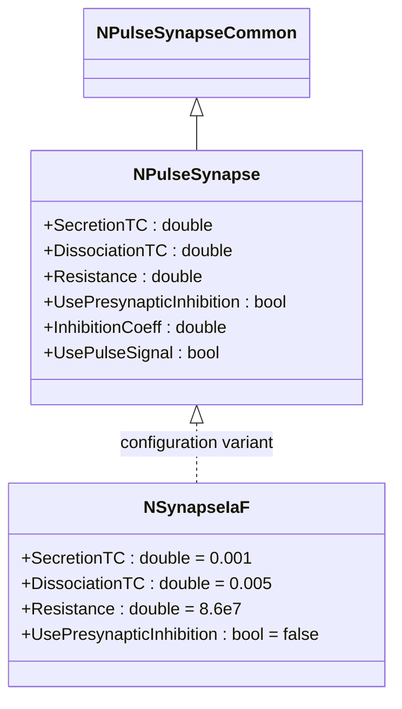
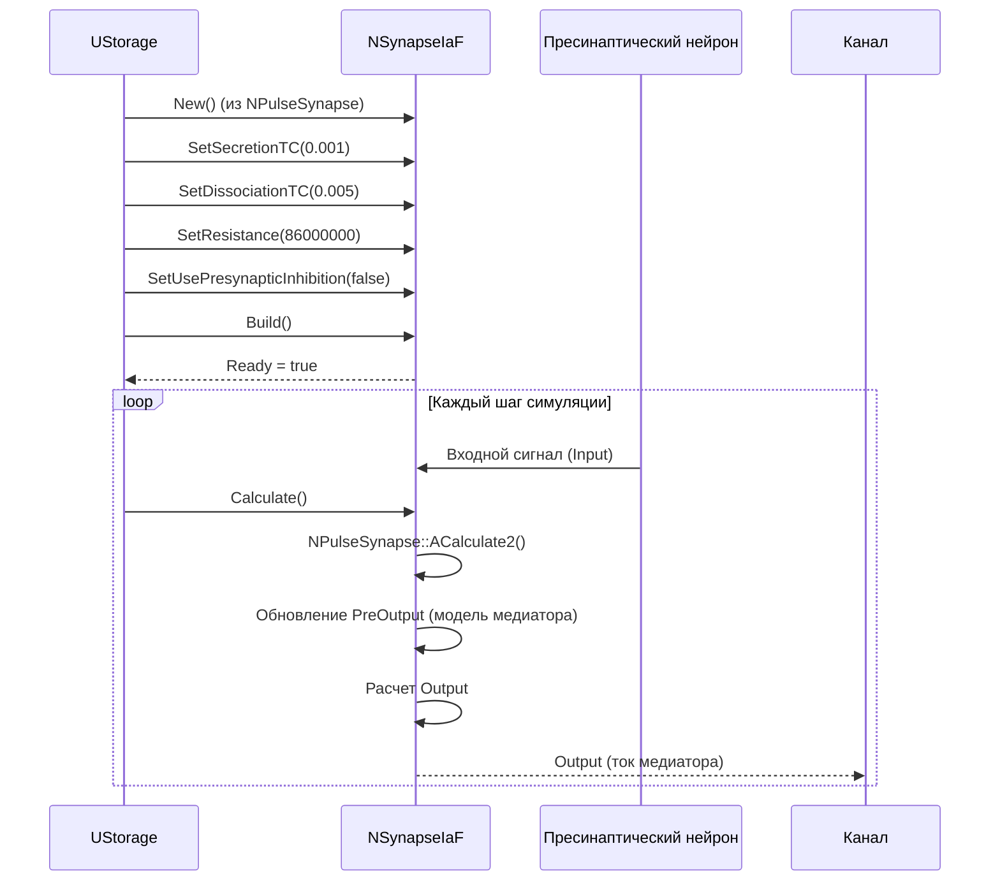
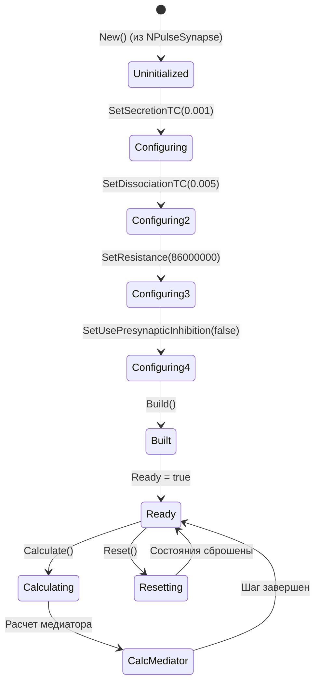
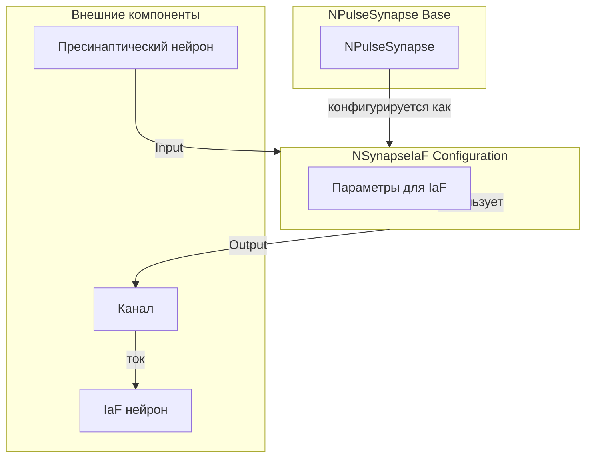
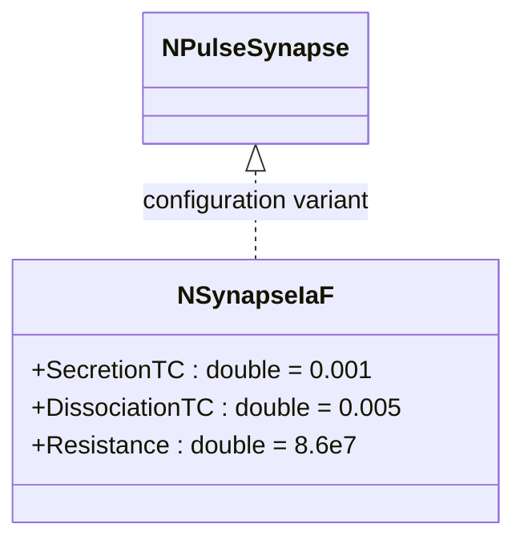
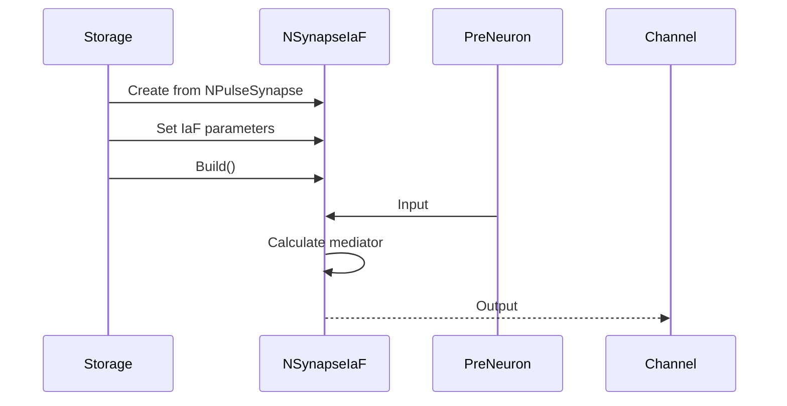
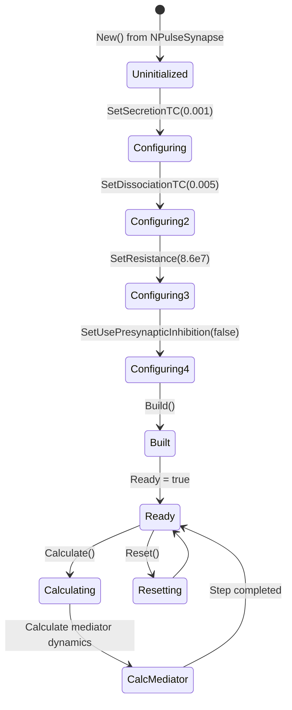

# NSynapseIaF — синапс для модели Integrate-and-Fire

## RU

### Назначение

**Класс**: `NSynapseIaF` — конфигурационный вариант импульсного синапса с параметрами для модели Integrate-and-Fire (IaF).  
**Регистрация**: `NPulseLibrary.cpp` → `UploadClass("NSynapseIaF", ...)`.  
**Storage-инстансы**: `ClassName = "NSynapseIaF"` в `Bin/Configs/*/Model_*.xml`.

`NSynapseIaF` является конфигурационным вариантом базового класса `NPulseSynapse` с предустановленными параметрами для модели Integrate-and-Fire. Создается из `NPulseSynapse` с настройками:
- `SecretionTC = 0.001` (1 мс) — постоянная времени выделения медиатора
- `DissociationTC = 0.005` (5 мс) — постоянная времени распада медиатора
- `UsePresynapticInhibition = false` — без пресинаптического торможения
- `Resistance = 86000000` (86 МОм) — сопротивление синапса

Эти параметры оптимизированы для работы с нейронами модели Integrate-and-Fire.

**Использование:** Моделирование синаптической передачи в нейронах IaF, эксперименты с IaF сетями

### UML-диаграмма классов



**Иерархия наследования:**
- `NPulseSynapseCommon` — общий импульсный синапс
- `NPulseSynapse` — импульсный синапс с моделью медиатора
- `NSynapseIaF` — конфигурационный вариант для IaF модели

**Ключевые свойства:**
- Параметры динамики медиатора: `SecretionTC`, `DissociationTC`
- Параметры синапса: `Resistance`, `UsePresynapticInhibition`

### UML-диаграмма последовательности



**Жизненный цикл:**
1. **Инициализация**: Создание из `NPulseSynapse` с параметрами по умолчанию
2. **Настройка**: Установка параметров для IaF модели
3. **Расчет**: Выполнение расчета базового синапса с моделью медиатора
4. **Использование**: Работа в составе IaF нейронов

### UML-диаграмма состояний



### UML-диаграмма активности

```mermaid
flowchart TD
    Start([Start Calculate]) --> CallBase[NPulseSynapse::ACalculate2]
    CallBase --> CheckUsePulse{UsePulseSignal?}
    CheckUsePulse -->|Да| ProcessPulse[Обработка импульсного сигнала]
    CheckUsePulse -->|Нет| ProcessAnalog[Обработка аналогового сигнала]
    ProcessPulse --> UpdatePreOutput{input > 0?}
    ProcessAnalog --> UpdatePreOutput
    UpdatePreOutput -->|Да| UpdateSecretion[PreOutput += (input/PulseAmplitude - PreOutput) / VSecretionTC]
    UpdatePreOutput -->|Нет| UpdateDissociation[PreOutput -= PreOutput / VDissociationTC]
    UpdateSecretion --> CalcOutput[Output = OutputConstData * PreOutput]
    UpdateDissociation --> CalcOutput
    CalcOutput --> ClampOutput[Output = max(Output, 0)]
    ClampOutput --> End([End])
    
    Note1[Параметры для IaF: SecretionTC=0.001, DissociationTC=0.005]
    Note1 -.-> UpdateSecretion
```

**Алгоритм расчета:**
Алгоритм идентичен базовому `NPulseSynapse`, но использует предустановленные параметры для IaF модели.

### UML-диаграмма компонентов



### Свойства

`NSynapseIaF` использует все свойства базового класса `NPulseSynapse` с предустановленными значениями:

**Параметры:**
- `SecretionTC = 0.001` (1 мс) — постоянная времени выделения медиатора
- `DissociationTC = 0.005` (5 мс) — постоянная времени распада медиатора
- `Resistance = 86000000` (86 МОм) — сопротивление синапса
- `UsePresynapticInhibition = false` — без пресинаптического торможения

**Остальные параметры по умолчанию:**
- `PulseAmplitude = 1.0`
- `UsePulseSignal = true`
- `InhibitionCoeff = 0.0`
- `TypicalPulseDuration = 0.001`

**Наследуемые свойства от NPulseSynapse:**
- Все входные/выходные свойства и состояния базового класса

### Методы

`NSynapseIaF` использует все методы базового класса `NPulseSynapse`.

### Примеры использования

#### Пример 1: Создание синапса в коде C++

```cpp
// Создание синапса для IaF модели
auto synapse = storage->CreateComponent("NSynapseIaF");
synapse->SetName("IaFSynapse");

// Инициализация (использует параметры для IaF)
synapse->Default();

// Использование
synapse->Build();
for (int step = 0; step < 10000; step++) {
    synapse->Calculate();
    double output = synapse->Output(0, 0);
    if (step % 1000 == 0) {
        std::cout << "Step " << step << ": Output = " << output << std::endl;
    }
}
```

#### Пример 2: Конфигурация XML

```xml
<Synapse1 Class="NSynapseIaF">
    <Parameters>
        <Type>1</Type>
        <PulseAmplitude>1.0</PulseAmplitude>
        <Resistance>86000000</Resistance>
        <Weight>1.0</Weight>
        <SecretionTC>0.001</SecretionTC>
        <DissociationTC>0.005</DissociationTC>
        <UsePulseSignal>1</UsePulseSignal>
        <UsePresynapticInhibition>0</UsePresynapticInhibition>
    </Parameters>
</Synapse1>
```

### Использование в конфигурациях

`NSynapseIaF` используется в экспериментах с нейронами модели Integrate-and-Fire:

- Моделирование синаптической передачи в IaF нейронах
- Эксперименты с IaF сетями
- Изучение динамики синаптической передачи в простых моделях нейронов

**Особенности:**
- Параметры оптимизированы для работы с IaF нейронами
- Использует модель динамики медиатора с быстрым выделением и распадом
- Подходит для моделирования простых синаптических связей

**Типичные значения параметров:**
- `SecretionTC = 0.001` (1 мс) — быстрое выделение медиатора
- `DissociationTC = 0.005` (5 мс) — умеренный распад медиатора
- `Resistance = 86000000` (86 МОм) — биологически реалистичное сопротивление

### См. также

- [`NPulseSynapse`](NPulseSynapse.md) — импульсный синапс с моделью медиатора
- [`NPulseNeuronIaF`](NPulseNeuronIaF.md) — нейрон модели Integrate-and-Fire
- [`NPulseMembraneIaF`](NPulseMembraneIaF.md) — мембрана для IaF модели
- [`NPulseChannelIaF`](NPulseChannelIaF.md) — канал для IaF модели
- [`NPulseSynapseCommon`](NPulseSynapseCommon.md) — общий импульсный синапс
- [Architecture.md](../Architecture.md) — архитектура библиотеки
- [Scientific-Background.md](../Scientific-Background.md) — научный фон (модель Integrate-and-Fire, синаптическая передача)

---

## EN

### Purpose

**Class**: `NSynapseIaF` — configuration variant of spiking synapse with parameters for Integrate-and-Fire (IaF) model.  
**Registration**: `NPulseLibrary.cpp` → `UploadClass("NSynapseIaF", ...)`.  
**Instances**: `ClassName = "NSynapseIaF"` in `Bin/Configs/*/Model_*.xml`.

`NSynapseIaF` is a configuration variant of the base class `NPulseSynapse` with preset parameters for Integrate-and-Fire model. Created from `NPulseSynapse` with settings:
- `SecretionTC = 0.001` (1 ms) — neurotransmitter secretion time constant
- `DissociationTC = 0.005` (5 ms) — neurotransmitter dissociation time constant
- `UsePresynapticInhibition = false` — without presynaptic inhibition
- `Resistance = 86000000` (86 MΩ) — synapse resistance

These parameters are optimized for work with Integrate-and-Fire neurons.

**Usage:** Modeling synaptic transmission in IaF neurons, experiments with IaF networks

### UML Class Diagram



### UML Sequence Diagram



### UML State Diagram



### UML Activity Diagram

```mermaid
flowchart TD
    Start([Start Calculate]) --> CallBase[Call NPulseSynapse::ACalculate2]
    CallBase --> CheckUsePulse{UsePulseSignal?}
    CheckUsePulse -->|Yes| ProcessPulse[Process pulse input]
    CheckUsePulse -->|No| ProcessAnalog[Process analog input]
    ProcessPulse --> UpdatePreOutput{input > 0?}
    ProcessAnalog --> UpdatePreOutput
    UpdatePreOutput -->|Yes| UpdateSecretion[Update secretion (PreOutput)]
    UpdatePreOutput -->|No| UpdateDissociation[Update dissociation]
    UpdateSecretion --> CalcOutput[Calculate Output = OutputConstData * PreOutput]
    UpdateDissociation --> CalcOutput
    CalcOutput --> ClampOutput[Clamp Output >= 0]
    ClampOutput --> End([End])
```

### UML Component Diagram

```mermaid
graph TB
    subgraph NPulseSynapse["NPulseSynapse Base"]
        BaseSynapse[NPulseSynapse]
    end
    
    subgraph NSynapseIaF["NSynapseIaF"]
        IaFParams[IaF-specific parameters<br/>(SecretionTC, DissociationTC, Resistance)]
    end
    
    subgraph External["External Components"]
        PreNeuron[Presynaptic neuron]
        Channel[Channel]
        IaFNeuron[IaF neuron]
    end
    
    BaseSynapse -->|configured as| NSynapseIaF
    NSynapseIaF -->|uses| IaFParams
    PreNeuron -->|Input| NSynapseIaF
    NSynapseIaF -->|Output| Channel
    Channel -->|current| IaFNeuron
```

### Usage in configurations

`NSynapseIaF` is used in Integrate-and-Fire neuron experiments and IaF networks:

- Synaptic transmission modeling in IaF neurons
- Simple IaF network experiments

**Typical parameters:**
- `SecretionTC = 0.001` (1 ms)
- `DissociationTC = 0.005` (5 ms)
- `Resistance = 8.6e7` (86 MΩ)

### See Also

- [`NPulseSynapse`](NPulseSynapse.md) — spiking synapse with neurotransmitter model
- [`NPulseNeuronIaF`](NPulseNeuronIaF.md) — Integrate-and-Fire neuron
- [`NPulseMembraneIaF`](NPulseMembraneIaF.md) — membrane for IaF model
- [`NPulseChannelIaF`](NPulseChannelIaF.md) — channel for IaF model
- [`NPulseSynapseCommon`](NPulseSynapseCommon.md) — common spiking synapse
- [Architecture.md](../Architecture.md) — library architecture
