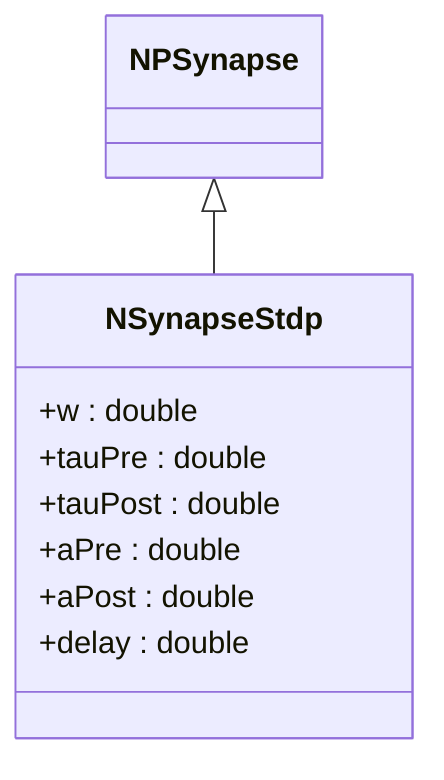
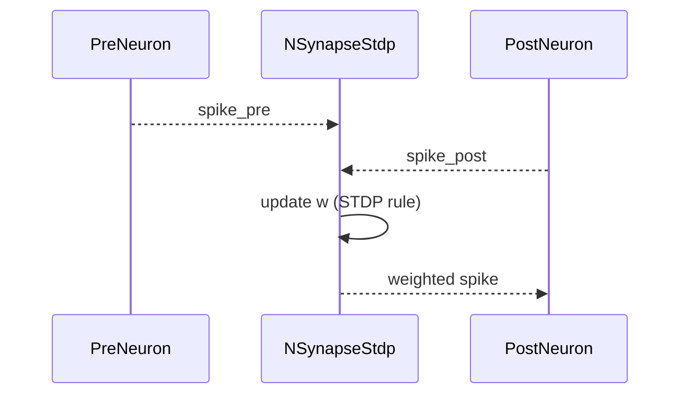
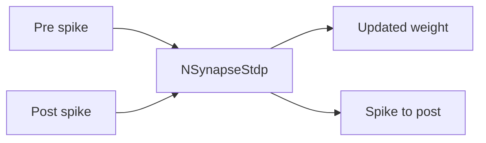

## NSynapseStdp — синапс с STDP (Nmsdk-PulseLib)

**Класс**: `NSynapseStdp` — импульсный синапс с правилом Spike-Timing Dependent Plasticity.  
**Регистрация**: `NPulseLibrary.cpp` → `UploadClass("NSynapseStdp", ...)`.  
**Storage-инстансы**: `ClassName = "NSynapseStdp"`; параметры: tau_pre/post, A_pre/post, w_min/max, задержка.

### Жизненный цикл
- **ADefault**: инициализация веса и временных констант.
- **ABuild**: подключение к пресинаптическому/постсинаптическому нейрону.
- **ACalculate**: обновление веса по временному различию спайков.

### Входы/выходы
- Вход: спайки pre/post.
- Выход: модифицированный вес w и переданный импульс.

Пояснение: диаграмма последовательности показывает типовой сценарий взаимодействия и порядок вызовов.

Пояснение: блок-схема показывает поток данных/сигналов (входы → компонент → выходы).

---

## NSynapseStdp — STDP synapse

Implements spike-timing dependent plasticity; inputs pre/post spikes, outputs weighted spike and updated weight.
